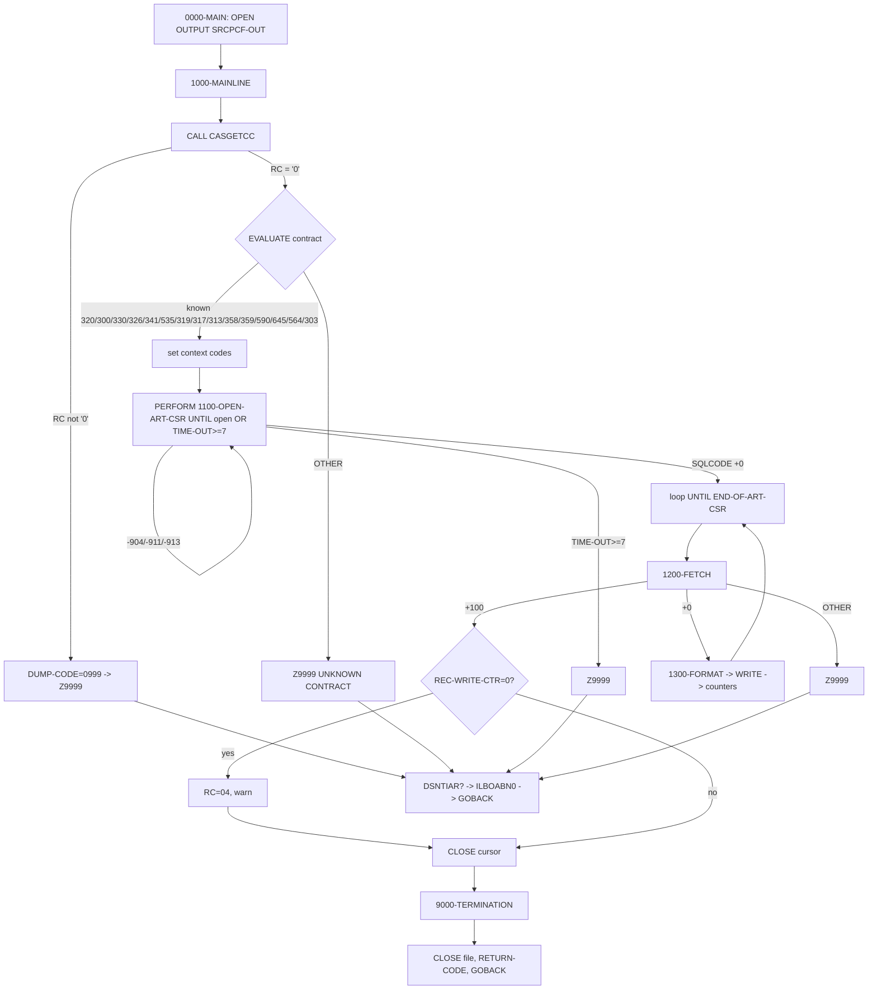

# CASNCTC0 — Program Logic Documentation

> **Evidence discipline.** Every statement below is tagged where the source is not literally explicit:
> **(proven)** = directly present in the inspected source; **(inferred)** = deduced from structure/usage;
> **(not proven)** / **(open question)** = cannot be confirmed from the artifacts available;
> **(referenced, not available)** = named/called by the code but the implementation is not in the inspected set.
> Line numbers refer to the source files as extracted for this analysis.

---

# 1. Analysis Method

## 1.1 Artifacts inspected

| Artifact | Type | Source location (branch) | Role in this analysis |
|---|---|---|---|
| `CASNCTC0.txt` | COBOL + embedded SQL (DB2) | `origin/Job-details` | Primary program under analysis (476 lines) |
| `ARTCLKP.txt` | DB2 DCLGEN copybook | `origin/Job-details` | Host structure `DCLARTCLKP` — `EXEC SQL INCLUDE ARTCLKP` |
| `ARTCCLM.txt` | DB2 DCLGEN copybook | `origin/Job-details` | Host structure `DCLARTCCLM` — `EXEC SQL INCLUDE ARTCCLM` |
| `CASGETCC.txt` | COBOL subprogram | `origin/Job-details` | Called routine that resolves the contract number |
| `CLMPREFX.txt` | Copybook (prefix-substitution) | `origin/Job-details` | Layout that matches the 70-byte output record's first five fields |
| `NCTCASE.txt` | Copybook (prefix-substitution) | `origin/Job-details` | Tied to program only by the paragraph name `1300-FORMAT-NCTCASE-REC` (layout does **not** match the output) |
| `PWTALCDS.txt` | JCL job stream | `origin/Job-details` | Control artifact that executes `CASNCTC0` (DD `SRCPCFO`, GDG, SORT step) |

**Not inspected because not present in the repository:** `DPSGTJOB` (called by `CASGETCC`), `DSNTIAR`, `ILBOABN0`, the `DB2BATCH` cataloged procedure, and the SORT control member `WALCDS01`. These are marked **(referenced, not available)** wherever they appear.

## 1.2 How logic was traced

1. Read `CASNCTC0.txt` top-to-bottom: `IDENTIFICATION`, `ENVIRONMENT` (`SELECT`), `DATA` (`FD`, `WORKING-STORAGE`, DCLGEN includes, cursor `DECLARE`), and `PROCEDURE DIVISION`.
2. Followed every `PERFORM`, `GO TO`, `EVALUATE`, `IF`, `CALL`, `EXEC SQL`, `WRITE`, `MOVE`, `UNSTRING`, and `INITIALIZE`.
3. Resolved host variables to their DCLGEN definitions (`ARTCLKP`, `ARTCCLM`) to determine column types/lengths and nullability.
4. Cross-referenced the called subprogram `CASGETCC` to establish how `HMS-3BYTE-CONTRACT-NUM` and `CASGETCC-RETURN-CODE` are produced.
5. Cross-referenced the JCL `PWTALCDS.txt` to establish the physical dataset behind DD `SRCPCFO`, the job-accounting code, and the surrounding steps.
6. Verified which `WORKING-STORAGE` items are actually *used* (defined vs populated vs checked vs output) with targeted searches.

## 1.3 Proven vs inferred handling

* A field/behavior is called **proven** only when it appears verbatim in the source.
* Where the *comment* and the *code* disagree, both are reported and the disagreement is flagged (see §7 and §8).
* Meaning of DB2 SQLCODEs (`-904`, `-911`, `-913`, `+100`) is stated as DB2-standard behavior, and separately noted where the program's own comment adds context (line 391).

## 1.4 Limitations

* The semantic meaning of the DB2 **data values** (e.g., what a particular `CLMST_RF` first character represents, what a `CONTEXT_CD` such as `CTSCASNY` means in the business) is **not proven** from these artifacts; only the *code paths* are proven.
* `DPSGTJOB` (the routine that actually reads the job-card accounting code) is **(referenced, not available)**, so the derivation of the accounting code itself is not directly provable — only `CASGETCC`'s mapping from accounting code to contract number is.
* Runtime record *contents* are illustrated with dummy data in the companion illustration document; no live data was available.

---

# 2. Program Overview

## 2.1 Identity (proven)

| Attribute | Value | Evidence |
|---|---|---|
| `PROGRAM-ID` | `CASNCTC0` | line 2 |
| `AUTHOR` | `BJW` | line 3 |
| `INSTALLATION` | `HMS` | line 4 |
| `DATE-WRITTEN` | `10/28/2015` | line 5 |
| Latest change tag | `0027 07/16/25 … CTSCASNJ - MAINFRAME CLAIM PULL` | lines 47-48 |

## 2.2 Purpose

**Header comment (proven text, lines 7-14):**

```
* THIS PGM WILL SELECT DATA FROM DB2 TABLES AND CREATE NEW
* GENERATION OF THE CUM FILE.
* IT WILL ALSO CREATE 2 FILES OF CLOSED CASES.
* SINCE CASE IS NOT SUPPLIED, WE PROCESS BOTH OPENED AND CLOSED.
*  DB2 TABLES USED :  DB2AR01.ARTCCLM - CLAIMS TABLE
*                             ARTCLKP - LINKAGE TABLE
```

**What the code actually does (proven):**

* Resolves a 3-byte contract number via `CALL CASGETCC` (line 241).
* Translates that contract into one base context code plus up to six additional context codes via an `EVALUATE` (lines 257-306).
* Opens a single read-only DB2 cursor `ART_CSR` that joins `ARTCLKP` (linkage) to `ARTCCLM` (claims) on matching `CLAIM_ID` and `CONTEXT_CD`, where `CONTEXT_CD` equals any of the resolved context codes (lines 196-215).
* Fetches each row, formats a 70-byte record, and **writes it to one output file** `SRCPCF-OUT` (lines 326-339, 333).
* Reports a single counter (records written) and returns `0`, `04`, or abends (lines 446-476).

**Consistency check on the purpose comment:**

* *"CREATE NEW GENERATION OF THE CUM FILE"* — **consistent**. The JCL DD `SRCPCFO` is a GDG generation `…PCFCASE.CUM70(+1)` (`PWTALCDS.txt` lines 70-74). **(proven via JCL)**
* *"SINCE CASE IS NOT SUPPLIED, WE PROCESS BOTH OPENED AND CLOSED"* — **consistent**. The cursor has no status predicate on `CLMST_RF`, so all matching claims are selected regardless of status. **(proven — absence of a filter, lines 196-215)**
* *"IT WILL ALSO CREATE 2 FILES OF CLOSED CASES"* — **NOT consistent with this program.** `CASNCTC0` declares only **one** file (`SRCPCF-OUT`, line 52) and contains no open/closed branching or second/third output. See §7.1 and §8.3. **(proven discrepancy)**

## 2.3 Technical role & invocation style

* **Batch DB2 subprogram / main step program.** It ends with `GOBACK` (lines 238, 476) and sets `RETURN-CODE` (line 237). It is executed as a job step under the `DB2BATCH` procedure with `MEMBER=CASNCTC0, DATABASE=CTSPROD, SYSTEM=DB2P` (`PWTALCDS.txt` lines 65-67). **(proven)**
* It in turn **calls** `CASGETCC`, `DSNTIAR`, and `ILBOABN0` (lines 241, 460, 475). **(proven)**

## 2.4 Upstream / downstream dependencies (from JCL `PWTALCDS.txt`, proven)

```
STEP0010 IEFBR14      → deletes  P.HMS.TPL.ALT.IW.NCTCASE.CLSD.RFMT.EXTR      (lines 35-37)
EXEC0010 DB2BATCH     → MEMBER=CASNCTD1  (sister program; writes NCTCASE/TCMCASE/CLSD, LRECL 384)  (lines 39-58)
EXEC0020 DB2BATCH     → MEMBER=CASNCTC0  ← THIS PROGRAM; writes SRCPCFO = …PCFCASE.CUM70(+1) FB/70  (lines 65-74)
EXEC0030 SORT         → SORTIN  …PCFCASE.CUM70(+1) → SORTOUT …PCFCASE.CUM70(+2), SYSIN=CARD.CNTL(WALCDS01) (lines 80-88)
```

* **Upstream:** the DB2 tables `DB2AR01.ARTCCLM` and `ARTCLKP` must be populated (by other processes, **not proven** which). `CASGETCC`/`DPSGTJOB` supply the contract number from the job card.
* **Downstream:** the CUM70 generation written by this step is read and re-sorted by the following `SORT` step (`EXEC0030`) into the next generation `(+2)` using control member `WALCDS01` **(referenced, not available)**.

---

# 3. Inputs, Outputs, and Dependencies

## 3.1 Files (`SELECT` / `FD`)

| Logical file | DD name | Open mode | Record | Length | Evidence |
|---|---|---|---|---|---|
| `SRCPCF-OUT` | `SRCPCFO` | `OUTPUT` | `CLMO-RECORD` | `PIC X(70)`, `RECORDING MODE F` | `SELECT` line 52; `FD` 56-62; `OPEN OUTPUT` 232; `CLOSE` 236 |

There is **exactly one** file declared. There are **no input files** (all business input is read from DB2). **(proven)**

**Physical dataset behind `SRCPCFO` (JCL, proven):**
`DSN=&DOPOND..HMS.TPL.&ACNTR..IR.PCFCASE.CUM70(+1)`, `DISP=(NEW,CATLG,DELETE)`, `RECFM=FB, LRECL=70` — with `DOPOND=P`, `ACNTR=ALT` this resolves to `P.HMS.TPL.ALT.IR.PCFCASE.CUM70(+1)` (`PWTALCDS.txt` lines 28-31, 70-74).

## 3.2 DB2 objects

| Object | Type | Access | Evidence |
|---|---|---|---|
| `ARTCLKP` (aliased `C`) | Table (linkage) | `SELECT` via cursor `ART_CSR`, `FOR READ ONLY` | DCLGEN `ARTCLKP.txt`; cursor lines 196-215 |
| `ARTCCLM` (aliased `D`) | Table (claims) | `SELECT` via cursor `ART_CSR`, `FOR READ ONLY` | DCLGEN `ARTCCLM.txt`; cursor lines 196-215 |
| `SQLCA` | Communication area | `INCLUDE`d; `SQLCODE` tested | lines 140-142; 342, 385, 415, 459 |
| Cursor `ART_CSR` | Read-only cursor | `DECLARE` / `OPEN` / `FETCH` / `CLOSE` | 196, 384, 408, 341 |

The DCLGEN header comments show the fully-qualified name `DB2AR01.ARTCLKP` / `DB2AR01.ARTCCLM` (`ARTCLKP.txt` line 2, `ARTCCLM.txt` line 2). **(proven)**

## 3.3 Copybooks / includes

| Include | Mechanism | Present? | Notes |
|---|---|---|---|
| `SQLCA` | `EXEC SQL INCLUDE SQLCA` (140-142) | (system) | DB2 SQL communication area |
| `ARTCLKP` | `EXEC SQL INCLUDE ARTCLKP` (183-185) | yes | DCLGEN for the linkage table |
| `ARTCCLM` | `EXEC SQL INCLUDE ARTCCLM` (189-191) | yes | DCLGEN for the claims table |

**No COBOL `COPY` statements exist in this program** — the output record and all working fields are coded inline. **(proven — a search for `COPY` returns none.)**
`CLMPREFX.txt` and `NCTCASE.txt` are present in the repository but are **not** `COPY`/`INCLUDE`d here (see §4.1 and §8 for how they relate).

## 3.4 Called programs

| Called | Statement | Purpose (evidence) | Availability |
|---|---|---|---|
| `CASGETCC` | `CALL WS-CASGETCC USING CASGETCC-CALLING-AREA` (241) | Returns 3-byte contract number + return code | `CASGETCC.txt` present |
| `DSNTIAR` | `CALL 'DSNTIAR' USING SQLCA, ERROR-MESSAGE, ERROR-LINE-LENGTH` (460-462) | Format DB2 error text for display | (referenced, not available) |
| `ILBOABN0` | `CALL 'ILBOABN0' USING DUMP-CODE` (475) | Force an abend with `DUMP-CODE` | (referenced, not available) |
| `DPSGTJOB` | called *inside* `CASGETCC` (`CASGETCC.txt` line 86) | Read job-card accounting code | (referenced, not available) |

## 3.5 Control-card / profile dependencies

* **Job-card accounting code** drives the entire run. `CASGETCC` → `DPSGTJOB` reads it; `CASGETCC` maps it to a contract number (`CASGETCC.txt` lines 110-227). In `PWTALCDS.txt` the accounting code is `600040` (line 1). **(proven)**
* **JCL symbolic `ACNTR=ALT`** selects the output dataset qualifier (`PWTALCDS.txt` line 31, 70). **(proven)**
* **SORT control member `WALCDS01`** is used by the *downstream* SORT step, not by `CASNCTC0` (`PWTALCDS.txt` line 88). **(referenced, not available)**
* No `SYSIN`/parameter file is read by `CASNCTC0` itself. **(proven — no such `SELECT`/`ACCEPT`.)**

## 3.6 Important status codes & flags

| Name | Definition | Values checked | Effect |
|---|---|---|---|
| `CASGETCC-RETURN-CODE` | `PIC X(01)` (line 120) | `NOT = '0'` (244) | Abend `0999` if not `'0'` |
| `ART-CSR-FLAG` (88s) | `START-OF-ART-CSR 'S'`, `END-OF-ART-CSR 'E'` (85-87) | drives open-retry and fetch loops | see §5 |
| `SQLCODE` (in `SQLCA`) | DB2-returned | `+0`, `+100`, `-904`, `-911`, `-913`, OTHER | branch/retry/abend |
| `TIME-OUT-CTR` | `PIC S9(01) COMP-3` (127) | `>= 7` (321-322) | abend after 7 failed opens |
| `WS-RETURN-CODE` | `PIC 9(02)` (84) | moved to `RETURN-CODE` (237) | `00` normal, `04` no rows |
| `DUMP-CODE` | `PIC S9(04) COMP VALUE +3645` (82) | passed to `ILBOABN0` (475) | abend user code |

---

# 4. Data Structures and Important Fields

## 4.1 Output record — `WS-HSTI-RECORD` (the record actually written)

`WRITE CLMO-RECORD FROM WS-HSTI-RECORD` (line 333) copies this 70-byte group to the file.

| Field | PIC | Bytes | Populated in | Source column |
|---|---|---|---|---|
| `HST-RECIPIENT-ID-NUM` | `X(20)` | 1–20 | line 436 | `ARTCCLM.RECIP_MA_NUM` |
| `HST-HMS-CASE-KEY` | `9(09)` | 21–29 | line 437 | `ARTCLKP.CASE_ID` |
| `HST-ICN` | `X(20)` | 30–49 | line 439 | `ARTCCLM.ICN_NUM` |
| `HST-FORMER-ICN` | `X(20)` | 50–69 | line 441 | `ARTCCLM.PREV_ICN_NUM` |
| `HST-XACTION-STATUS` | `X(01)` | 70 | line 443 | first char of `ARTCCLM.CLMST_RF` |

**Relationship to `CLMPREFX.txt` (proven group name + matching layout):** the record wraps an intermediate group named **`03 HST-CLMPRFX`** (line 67) whose five sub-fields match, in name, order, and PIC, the first five fields of the `CLMPREFX` copybook (`(PREFIX)-RECIPIENT-ID-NUM X(20)`, `-HMS-CASE-KEY 9(09)`, `-ICN X(20)`, `-FORMER-ICN X(20)`, `-XACTION-STATUS X(01)`; `CLMPREFX.txt` lines 2-6). The group name `HST-CLMPRFX` is direct evidence that this is the *claim-prefix* layout with prefix `HST`. **(proven for the group name and field match.)** The copybook continues with further fields (`CLM-FROM-DATE`, `RX-WRITTEN-DATE`, …) that this program does **not** populate, so the output is only the 70-byte **claim-prefix** portion of a larger downstream record. **(that the remainder is expanded downstream is inferred; the record is defined inline, not `COPY`-linked.)**

## 4.2 Contract → context routing fields (`WORKING-STORAGE`)

| Field | PIC | Role |
|---|---|---|
| `HMS-3BYTE-CONTRACT-NUM` | `X(03)` (116) | Contract number returned by `CASGETCC`; drives the `EVALUATE` (257) |
| `WS-CONTEXT-CD` | `X(16)` (89) | Base context code; becomes cursor host var `:CLKP-CONTEXT-CD` |
| `WS-CONTEXT-CD1`…`WS-CONTEXT-CD6` | `X(16)` (90-95) | Additional context codes; become `:CASE-CONTEXT-CD1..6` |

Default before `EVALUATE`: `WS-CONTEXT-CD1..CD6` are set to `'ZZZZZZZZZZZZZZZZ'` (16 `Z`s) at lines 251-256, then selectively overwritten per contract. **(proven.)** Slots left at `ZZ…` act as non-matching sentinels in the cursor's `OR` list. **(inferred from usage.)**

## 4.3 DB2 host-variable groups (from DCLGENs)

* **`DCLARTCLKP`** (`ARTCLKP.txt` 30-63) — used fields: `CLKP-CONTEXT-CD` (VARCHAR: `-L S9(4) COMP` + `-T X(16)`) as the base host var, and `CLKP-CASE-ID PIC S9(12)V COMP-3` fetched into the output. `CLKP-CLAIM-ID` participates only inside SQL (join). **(proven.)**
* **`DCLARTCCLM`** (`ARTCCLM.txt` 50-161) — used fields: `CCLM-RECIP-MA-NUM`, `CCLM-ICN-NUM`, `CCLM-PREV-ICN-NUM`, `CCLM-CLMST-RF` (all VARCHAR `-L`+`-T`), plus `CCLM-CONTEXT-CD`/`CCLM-CLAIM-ID` inside SQL only. **(proven.)**
* **`WS-CURSOR-VALUES`** (144-172) — VARCHAR host variables `CASE-CONTEXT-CD1..6` (each `49 …-L S9(4) COMP` + `49 …-T X(16)`). Note: the program declares **six separate `01 WS-CURSOR-VALUES` groups** (a duplicate 01-level name). **(proven — see §8.3.)**
* **`WS-NULL-INDICATORS`** (174-177) — `WS-RECIP-MANUM-IND`, `WS-PREV-ICN-NUM-IND`, `WS-CLMST-RF-NULL-IND` (`S9(04) COMP`). Bound on `FETCH` (409, 412, 413) but **never tested** afterward. **(proven.)**

### Nullability of the fetched columns (from `ARTCCLM.txt`)

| Column | DB2 declaration | Nullable? | Null indicator used |
|---|---|---|---|
| `ICN_NUM` | `VARCHAR(20) NOT NULL` (16) | No | (none) |
| `PREV_ICN_NUM` | `VARCHAR(20)` (17) | Yes | `WS-PREV-ICN-NUM-IND` |
| `RECIP_MA_NUM` | `VARCHAR(20)` (18) | Yes | `WS-RECIP-MANUM-IND` |
| `CLMST_RF` | `VARCHAR(10)` (20) | Yes | `WS-CLMST-RF-NULL-IND` |
| `CASE_ID` (from `ARTCLKP`) | `DECIMAL(12,0) NOT NULL` (`ARTCLKP.txt` 15) | No | (none) |

## 4.4 Counters (`WORKING-STORAGE`, 122-129)

| Counter | Incremented? | Reported/checked? | Status |
|---|---|---|---|
| `REC-WRITE-CTR` | yes, per write (334) | checked `= ZERO` (420); displayed via `NUM-REC-OUT` (450-452) | **used** |
| `OPEN-NCTC-REC-CTR` | yes, per write (335) | never displayed/checked | **inert** (dead) |
| `CLOSED-NCTC-REC-CTR` | never | never | **dead** |
| `OTHER-NCTC-REC-CTR` | never | never | **dead** |
| `TIME-OUT-CTR` | on DB2 contention (394) | `>= 7` (321-322) | **used** |
| `WS-COMP-01` | never | never | **dead** |
| `NUM-REC-OUT` | (edit field) | display target (450) | **used** |

## 4.5 Match / sort / merge / delete keys

* **Join keys (proven, cursor 205-213):** `C.CLAIM_ID = D.CLAIM_ID` **and** `C.CONTEXT_CD = D.CONTEXT_CD`.
* **Selection predicate (proven):** `C.CONTEXT_CD` equals any of `:CLKP-CONTEXT-CD`, `:CASE-CONTEXT-CD1..6`.
* **No sort/merge/update/delete inside this program.** Access is `FOR READ ONLY` (214); the only DML verbs are `OPEN`/`FETCH`/`CLOSE`. Sorting happens in the *separate* downstream SORT step. **(proven.)**

---

# 5. Processing Logic

## 5.1 `0000-MAIN` — driver (lines 220-238)

1. `DISPLAY` banner lines (221-222).
2. Capture compile timestamp: `MOVE FUNCTION WHEN-COMPILED TO WS-WHEN-COMPILED`, then reformat into `WS-WHEN-COMPILED-DISP` and display it (224-231).
3. `OPEN OUTPUT SRCPCF-OUT` (232).
4. `PERFORM 1000-MAINLINE THRU 1000-MAINLINE-EXIT` (234) — all substantive work.
5. `PERFORM 9000-TERMINATION THRU 9000-TERMINATION-EXIT` (235) — counter report.
6. `CLOSE SRCPCF-OUT` (236); `MOVE WS-RETURN-CODE TO RETURN-CODE` (237); `GOBACK` (238).

> **Note (proven):** the file is opened *before* `CASGETCC`/DB2 processing. If `1000-MAINLINE` branches to `Z9999-ERROR-EXIT`, the program abends via `ILBOABN0` and `0000-MAIN`'s `CLOSE` is **not** reached (control leaves through `GOBACK` at line 476).

## 5.2 `1000-MAINLINE` — contract resolution, cursor open, fetch/write loop (240-351)

### 5.2.1 Resolve the contract (241-256)
* `CALL WS-CASGETCC USING CASGETCC-CALLING-AREA` (241).
* `IF CASGETCC-RETURN-CODE NOT = '0'` → display error, `MOVE +0999 TO DUMP-CODE`, `GO TO Z9999-ERROR-EXIT` (244-248).
* Set `WS-CONTEXT-CD1..CD6` to `'ZZZZZZZZZZZZZZZZ'` defaults (251-256).

### 5.2.2 Map contract → context codes (`EVALUATE HMS-3BYTE-CONTRACT-NUM`, 257-306)

| `WHEN` | `WS-CONTEXT-CD` | `-CD1` | `-CD2` | `-CD3` | `-CD4` | `-CD5` | `-CD6` |
|---|---|---|---|---|---|---|---|
| `320` | `CTSCASNY` | `CTSCASNYC` | `CTSCASEX-NY` | `CTSESTNY` | `CTSESTEX-NY` | `CTSCASNYOP1` | `CTSESTNYOP1` |
| `300` | `CTSCASTST` | `CTSCASTST` | `CTSCASTST` | *(ZZ…)* | *(ZZ…)* | *(ZZ…)* | *(ZZ…)* |
| `330` | `CTSCASAR` | `CTSCASAR` | `CTSCASAR` | *(ZZ…)* | *(ZZ…)* | *(ZZ…)* | *(ZZ…)* |
| `326` | `CTSCASCO` | `CTSESTCO` | `CTSCASCO` | `CTSCASCO-HCPF` | *(ZZ…)* | *(ZZ…)* | *(ZZ…)* |
| `341` | `CTSCASOH` | `CTSCASOH` | `CTSCASOH` | *(ZZ…)* | *(ZZ…)* | *(ZZ…)* | *(ZZ…)* |
| `535` | `CTSCASOH` | `CTSCASOH` | `CTSCASOH` | *(ZZ…)* | *(ZZ…)* | *(ZZ…)* | *(ZZ…)* |
| `319` | `CTSCASCT` | `CTSCASCT` | `CTSCASCT` | *(ZZ…)* | *(ZZ…)* | *(ZZ…)* | *(ZZ…)* |
| `317` | `CTSWRCCA` | `CTSWRCCA` | `CTSWRCCA` | *(ZZ…)* | *(ZZ…)* | *(ZZ…)* | *(ZZ…)* |
| `313` | `CTSCASFL` | `CTSESTFL` | `CTSTRSFL` | `CTSCASMT-FL` | *(ZZ…)* | *(ZZ…)* | *(ZZ…)* |
| `358` | `CTSCASNV` | `CTSESTNV` | `CTSTRSNV` | `CTSTFRNV` | *(ZZ…)* | *(ZZ…)* | *(ZZ…)* |
| `359` | `CTSCASNM` | `CTSESTNM` | `CTSTRSNM` | *(ZZ…)* | *(ZZ…)* | *(ZZ…)* | *(ZZ…)* |
| `590` | `CTSCASAL` | `CTSESTAL` | `CTSTRSAL` | *(ZZ…)* | *(ZZ…)* | *(ZZ…)* | *(ZZ…)* |
| `645` | `CTSCASWV` | `CTSESTWV` | `CTSCASCH-WV` | *(ZZ…)* | *(ZZ…)* | *(ZZ…)* | *(ZZ…)* |
| `564` | `CTSCASTN` | `CTSCASTN` | `CTSCASTN` | *(ZZ…)* | *(ZZ…)* | *(ZZ…)* | *(ZZ…)* |
| `303` | `CTSCASNJ` | *(ZZ…)* | *(ZZ…)* | *(ZZ…)* | *(ZZ…)* | *(ZZ…)* | *(ZZ…)* |
| `OTHER` | *(unchanged)* | — | — | — | — | — | — → `DISPLAY '** ERR: UNKNOWN …'` then `GO TO Z9999-ERROR-EXIT` (303-305) |

*(ZZ…)* = the field keeps its `'ZZZZZZZZZZZZZZZZ'` default from lines 251-256. Cells that share a target (e.g., `MOVE 'CTSCASTST' TO WS-CONTEXT-CD WS-CONTEXT-CD1 WS-CONTEXT-CD2`) are proven at lines 265-266, 267-268, 273-274, 275-276, 277-278, 279-280, 300-301. **(entire table proven, lines 258-302.)**

### 5.2.3 Open the cursor with contention retry (317-324)
* `INITIALIZE DCLARTCLKP DCLARTCCLM` (317-318).
* `PERFORM 1100-OPEN-ART-CSR THRU 1100-OPEN-EXIT UNTIL START-OF-ART-CSR OR TIME-OUT-CTR >= 7` (320-321).
* `IF TIME-OUT-CTR >= 7 GO TO Z9999-ERROR-EXIT` (322-324).

### 5.2.4 Fetch / format / write loop (326-339)
```
PERFORM UNTIL END-OF-ART-CSR
   PERFORM 1200-FETCH-ART-CSR THRU 1200-FETCH-EXIT
   IF END-OF-ART-CSR
      CONTINUE
   ELSE
      PERFORM 1300-FORMAT-NCTCASE-REC THRU 1300-FORMAT-EXIT
      WRITE CLMO-RECORD FROM WS-HSTI-RECORD
      ADD 1 TO REC-WRITE-CTR
      ADD 1 TO OPEN-NCTC-REC-CTR
      INITIALIZE DCLARTCLKP DCLARTCCLM
   END-IF
END-PERFORM
```
Every fetched (non-EOF) row is formatted and written; there is **no filtering, no rewrite, no delete**. **(proven.)**

### 5.2.5 Close the cursor (341-349)
* `EXEC SQL CLOSE ART_CSR`; `EVALUATE SQLCODE WHEN +0 CONTINUE WHEN OTHER` → display + `GO TO Z9999-ERROR-EXIT`.

## 5.3 `1100-OPEN-ART-CSR` (353-403)
* Build each VARCHAR host variable by `UNSTRING … DELIMITED BY ALL SPACES INTO <name>-T COUNT IN <name>-L` for `WS-CONTEXT-CD` → `CLKP-CONTEXT-CD` and `WS-CONTEXT-CD1..6` → `CASE-CONTEXT-CD1..6` (354-381). This sets both the text and the VARCHAR length from the trimmed 16-byte field.
* `EXEC SQL OPEN ART_CSR` (384); then `EVALUATE SQLCODE`:
  * `+0` → `SET START-OF-ART-CSR TO TRUE` (386-387).
  * `-904` / `-911` / `-913` → display, `ADD 1 TO TIME-OUT-CTR`, display attempt count, `GO TO 1100-OPEN-EXIT` (388-397) — i.e., **retry** (loop re-enters until success or 7 attempts).
  * `OTHER` → display, `GO TO Z9999-ERROR-EXIT` (398-401).
* Program comment at line 391: `-913` "will never be received in our installation." **(proven comment.)**

## 5.4 `1200-FETCH-ART-CSR` (405-431)
* `INITIALIZE DCLARTCLKP DCLARTCCLM` (406-407).
* `EXEC SQL FETCH ART_CSR INTO :CCLM-RECIP-MA-NUM:WS-RECIP-MANUM-IND, :CLKP-CASE-ID, :CCLM-ICN-NUM, :CCLM-PREV-ICN-NUM:WS-PREV-ICN-NUM-IND, :CCLM-CLMST-RF:WS-CLMST-RF-NULL-IND` (408-414).
* `EVALUATE SQLCODE`:
  * `+0` → `CONTINUE` (416-417).
  * `+100` → `SET END-OF-ART-CSR TO TRUE`; **if** `REC-WRITE-CTR = ZERO` then warn "NO MATCHING RECS FOUND IN DB2AR01 TABLES ARTCASE AND ARTINDV" and `MOVE 04 TO WS-RETURN-CODE` (418-425).
  * `OTHER` → display, `GO TO Z9999-ERROR-EXIT` (426-429).

> **Note (proven discrepancy):** the `+100` warning text names tables **`ARTCASE` and `ARTINDV`**, but the cursor actually reads **`ARTCCLM` and `ARTCLKP`**. This is a stale message (see §7 and §8).

## 5.5 `1300-FORMAT-NCTCASE-REC` (433-444)
Maps fetched VARCHAR columns into the fixed output fields via the reusable `WS-MOVE PIC X(20)`:

| Step | Statement | Result |
|---|---|---|
| 1 | `MOVE CCLM-RECIP-MA-NUM-T (1:CCLM-RECIP-MA-NUM-L) TO WS-MOVE` then `MOVE WS-MOVE(1:20) TO HST-RECIPIENT-ID-NUM` (434-436) | recipient id, left-justified, space-padded to 20 |
| 2 | `MOVE CLKP-CASE-ID TO HST-HMS-CASE-KEY` (437) | numeric case key |
| 3 | `MOVE CCLM-ICN-NUM-T (1:CCLM-ICN-NUM-L) TO WS-MOVE` → `WS-MOVE(1:20) TO HST-ICN` (438-439) | ICN |
| 4 | `MOVE CCLM-PREV-ICN-NUM-T (1:CCLM-PREV-ICN-NUM-L) TO WS-MOVE` → `WS-MOVE(1:20) TO HST-FORMER-ICN` (440-441) | former/previous ICN |
| 5 | `MOVE CCLM-CLMST-RF-T (1:CCLM-CLMST-RF-L) TO WS-MOVE` → `WS-MOVE(1:1) TO HST-XACTION-STATUS` (442-443) | **first character only** of claim status |

## 5.6 `9000-TERMINATION` (446-456)
* Display a "PROGRAM COUNTERS" banner; `MOVE REC-WRITE-CTR TO NUM-REC-OUT`; `DISPLAY 'NUMBER OF RECORDS  WRITTEN.......... :' NUM-REC-OUT`; then `DISPLAY '*****  PGM  CASNCTC0  NORMAL  END  *****'`. Only `REC-WRITE-CTR` is reported. **(proven.)**

## 5.7 `Z9999-ERROR-EXIT` (458-476)
* `IF SQLCODE NOT = +0` → `CALL 'DSNTIAR' USING SQLCA ERROR-MESSAGE ERROR-LINE-LENGTH` and display the 7 formatted lines (459-471).
* Always: `DISPLAY '*****  PGM  CASNCTC0  ABENDED  *****'`, then `CALL 'ILBOABN0' USING DUMP-CODE`, then `GOBACK` (473-476).

## 5.8 Control-flow (proven)



---

# 6. Extracted Business Logic

> Expressed as rules. Each rule cites the code that proves it. "Business meaning" of codes/values is **not** asserted beyond what the code shows.

### R1 — Contract gate (routing)
**When** `CASGETCC` returns `CASGETCC-RETURN-CODE = '0'` **and** `HMS-3BYTE-CONTRACT-NUM` is one of the 15 handled values, the program shall resolve the corresponding context code set and proceed. **When** the contract is unknown (`WHEN OTHER`), the program shall abend. *(Lines 244-306.)*

### R2 — CASGETCC failure
**If** `CASGETCC-RETURN-CODE ≠ '0'`, the program shall set user dump code `0999` and abend. *(Lines 244-248, 458-476.)*

### R3 — Multi-context selection
**When** context codes are resolved, the program shall select claims whose `ARTCCLM`/`ARTCLKP` `CONTEXT_CD` equals **any** of the (up to seven) resolved codes and whose `CLAIM_ID` and `CONTEXT_CD` match across the two tables. Unused context slots hold `'ZZZZZZZZZZZZZZZZ'` and therefore do not match real data. *(Cursor 196-215; defaults 251-256.)* *(Non-matching effect of `ZZ…` is inferred.)*

### R4 — Status-agnostic inclusion
**Because** the cursor applies **no** predicate on `CLMST_RF`, the program shall include claims of **all** statuses (open and closed alike). *(Cursor 196-215; header comment line 11.)*

### R5 — One row → one output record
**For each** fetched claim row, the program shall write exactly one 70-byte record to `SRCPCF-OUT`; there is no de-duplication, aggregation, update, or delete. *(Lines 326-339.)*

### R6 — Field derivation
Each output record shall carry: recipient MA number (`RECIP_MA_NUM`), HMS case key (`CASE_ID`), ICN (`ICN_NUM`), former ICN (`PREV_ICN_NUM`), and a one-character transaction status = **first character of** `CLMST_RF`. *(Lines 434-443.)*

### R7 — "No data" outcome
**When** the first `FETCH` returns end-of-data with zero writes (`REC-WRITE-CTR = 0`), the program shall emit a warning and set return code `04` (a *non-abend* completion). *(Lines 418-425.)*

### R8 — DB2 contention tolerance
**If** cursor `OPEN` fails with `-904`, `-911`, or `-913`, the program shall retry, counting attempts; after 7 failed attempts it shall abend. *(Lines 320-324, 388-397.)*

### R9 — Generation output
The output is written as a **new GDG generation** of the CUM70 file; the program itself only writes sequentially, and generation management is handled by JCL. *(FD 56-62; `PWTALCDS.txt` 70-74.)*

**Not present (proven by absence):** inclusion/exclusion by amount, date, or category; duplicate handling; rewrite/delete logic; open-vs-closed file splitting.

---

# 7. Error Handling and Edge Cases

## 7.1 File status
* `SRCPCF-OUT` is opened `OUTPUT` and `CLOSE`d in the normal path only; **no `FILE STATUS` clause is declared** and no I/O status is checked. A `WRITE` failure is not trapped by the program. **(proven — no `FILE STATUS` in `SELECT`.)**

## 7.2 DB2 handling
| SQLCODE | Where | Action |
|---|---|---|
| `+0` | open/fetch/close | proceed |
| `+100` | fetch (418) | end loop; if no writes, RC=04 + warning |
| `-904` / `-911` / `-913` | open (388-390) | retry up to 7 (then abend) |
| any other non-zero | open/fetch/close (398, 426, 345) | `DSNTIAR` format + abend |

## 7.3 Return / abend codes
* `RETURN-CODE`: `00` normal, `04` no rows. **(237, 424.)**
* Abend via `CALL 'ILBOABN0' USING DUMP-CODE`: `DUMP-CODE = +0999` only on the `CASGETCC` failure path; otherwise it retains its initial `+3645`. **(82, 246, 475.)**

## 7.4 Edge cases (proven / inferred)
1. **Unknown contract** (`WHEN OTHER`, incl. `CASGETCC` returning `'000'`): abend. **(proven, 303-305; `CASGETCC.txt` 224-225.)**
2. **Null claim columns not checked:** `RECIP_MA_NUM`, `PREV_ICN_NUM`, `CLMST_RF` are nullable; their null indicators are captured but never tested (409-413). If a value is NULL, its length sub-field may be `0`, making the reference modification `(1:0)` invalid at run time. **(inferred latent risk; not proven to occur, data-dependent.)**
3. **Case-key width:** `CLKP-CASE-ID` is `S9(12)` but `HST-HMS-CASE-KEY` is `9(09)`; a `CASE_ID` above `999,999,999` would be **high-order truncated** on the move. **(inferred from PICs, lines 437 vs `ARTCLKP.txt` 37.)**
4. **`CLMST_RF` longer than 1:** only the first character survives into `HST-XACTION-STATUS`; the remaining up-to-nine characters are dropped. **(proven, 442-443.)**
5. **Stale diagnostics:** the `+100` warning (421-422) names `ARTCASE`/`ARTINDV`, which this program does not use. **(proven discrepancy.)**

## 7.5 Restart / recovery
* No checkpoint, commit, or restart logic exists in `CASNCTC0` (read-only cursor; output is a fresh generation). The JCL header shows a commented-out `RESTART=` (`PWTALCDS.txt` line 3). **(proven — no `COMMIT`/checkpoint in code.)**

---

# 8. Proven vs Inferred vs Unknown

## 8.1 Proven from source
* Single output file `SRCPCF-OUT`/`SRCPCFO`, `FB` `LRECL 70` (52, 56-62; JCL 70-74).
* Contract resolved by `CASGETCC`; failure ⇒ dump `0999` (241-248).
* Full contract→context `EVALUATE` mapping (257-306).
* Read-only two-table join cursor with the 7-way `CONTEXT_CD` `OR` predicate; **no status filter** (196-215).
* Per-row format-and-write; only `REC-WRITE-CTR` reported (326-339, 446-456).
* Open retry on `-904/-911/-913`, cap 7, then abend (320-324, 388-397).
* Empty result ⇒ RC `04` + warning; other SQL errors ⇒ `DSNTIAR` + `ILBOABN0` abend (418-476).
* Output field-to-column mapping and the first-char-only `CLMST_RF` rule (434-443).
* Output group is named `03 HST-CLMPRFX` and its five fields match `CLMPREFX.txt` 2-6 in name/order/PIC (66-72). **(proven layout match.)**
* Dead/inert items: `WS-SRCPCF-OUT`, `CLOSED-NCTC-REC-CTR`, `OTHER-NCTC-REC-CTR`, `WS-COMP-01`, and the three null indicators (see §4).
* JCL context: job accounting `600040`, `ACNTR=ALT`, GDG generations, downstream SORT (`PWTALCDS.txt`).

## 8.2 Inferred from structure / usage
* That the 70-byte `HST-CLMPRFX` prefix is expanded into the fuller `CLMPREFX` record (fields beyond byte 70) by a downstream process (§4.1). *(The prefix group name/field match is proven; only the downstream expansion is inferred.)*
* `'ZZ…'` sentinels neutralize unused `CONTEXT_CD` slots in the cursor (§4.2, R3).
* Job-accounting `600040 → 590 → CTSCASAL` chain implies this specific job runs the **Alabama (ALT)** contract (JCL line 1 + `CASGETCC.txt` 202-203 + `CASNCTC0` 293-296). *(Depends on `DPSGTJOB`, not available.)*
* Latent null / truncation risks in §7.4.

## 8.3 Open questions / not proven
* **Header vs code conflict:** "IT WILL ALSO CREATE 2 FILES OF CLOSED CASES" — no such files exist in `CASNCTC0`. Whether this behavior was moved to the sister program `CASNCTD1` (which the JCL shows writing `CLSDO`/`CLSDEXTO`) is **not proven** here. *(open question.)*
* **Paragraph name `1300-FORMAT-NCTCASE-REC`** vs the 70-byte CLMPRFX record it builds, and the presence of `NCTCASE.txt` (a different, larger layout): the naming is inconsistent; the true relationship to the `NCTCASE` structure is **not proven**.
* **Six `01 WS-CURSOR-VALUES` groups** (144-172): a duplicated 01-level name. How the compiler in this shop resolves/uses these (all reference distinct `CASE-CONTEXT-CD1..6` subfields) is **not proven** from source alone.
* **Contract `300` (`CTSCASTST`)** is handled by `CASNCTC0` but is **not produced** by the available `CASGETCC` mapping (no accounting code maps to `300`); its trigger path is **not proven** from these artifacts.
* **Business meaning** of any `CONTEXT_CD`, `CLMST_RF` value, or `RECIP_MA_NUM` — **not proven** (no data dictionary in scope).
* Implementations of `DPSGTJOB`, `DSNTIAR`, `ILBOABN0`, the `DB2BATCH` proc, and SORT member `WALCDS01` — **(referenced, not available).**
