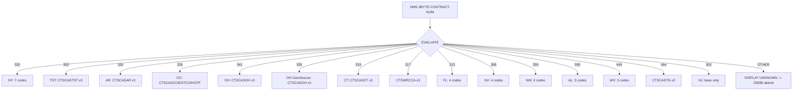
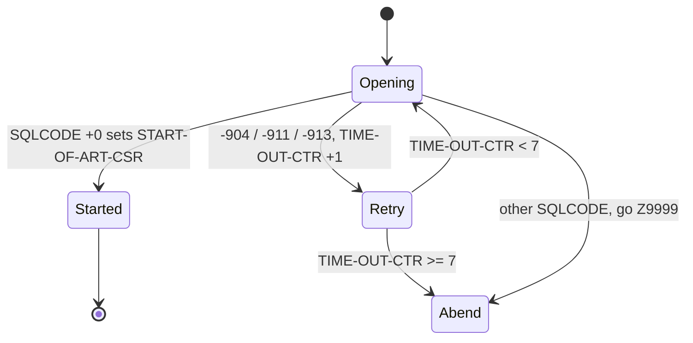
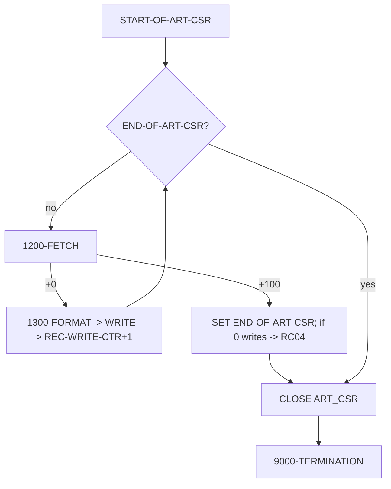

# CASNCTC0 — Illustration Document (Dummy-Data Walkthroughs)

> **All data in this document is invented (dummy) for illustration.** Field names, PICs, lengths, and code
> paths are taken from `CASNCTC0.txt` and its DCLGENs (`ARTCLKP.txt`, `ARTCCLM.txt`), the called program
> `CASGETCC.txt`, and the JCL `PWTALCDS.txt`. Where a value's *business meaning* is unknown, it is left as an
> illustrative token and flagged. Line numbers refer to `CASNCTC0.txt` unless noted.

---

# 1. Illustration Scope

* **Illustrated:** every branch that materially changes behavior — contract routing (`EVALUATE`, 257-306),
  `CASGETCC` success/failure, DB2 cursor open with contention retry, fetch loop, format-and-write, the
  empty-result (RC 04) path, and each abend path.
* **How dummy data was built:** the output layout is the 70-byte `WS-HSTI-RECORD` (66-72); inputs are dummy
  `ARTCCLM`/`ARTCLKP` rows shaped by the DCLGEN column types (`ARTCCLM.txt`, `ARTCLKP.txt`). VARCHAR values
  are shown as *text + length* because the code uses `…-T (1:…-L)` reference modification (434-443).
* **Could not be illustrated with live values:** the *business meaning* of `CONTEXT_CD`, `CLMST_RF`, and
  `RECIP_MA_NUM` (no data dictionary in scope); the internals of `DPSGTJOB`, `DSNTIAR`, `ILBOABN0`
  (referenced, not available).

### Output record byte map (70 bytes) used throughout

```
Pos  Field                      PIC       Example (dummy)
---- -------------------------- --------- ------------------------
1-20 HST-RECIPIENT-ID-NUM       X(20)     MA1234567890________     (_ = space)
21-29 HST-HMS-CASE-KEY          9(09)     000123456
30-49 HST-ICN                   X(20)     2023123000001_______
50-69 HST-FORMER-ICN            X(20)     2022999000001_______
70    HST-XACTION-STATUS        X(01)     C
```

---

# 2. Scenario Catalog

| ID | Scenario | Trigger (proven at line) | Expected outcome |
|---|---|---|---|
| S1 | Known contract, rows found → normal write | contract handled (257-302); fetch `+0` (416) | records written, RC `00` |
| S2 | `CASGETCC` failure | `CASGETCC-RETURN-CODE NOT = '0'` (244) | dump `0999`, abend |
| S3 | Unknown contract | `WHEN OTHER` (303) incl. `'000'` | abend (dump `3645`) |
| S4 | NY multi-context (7 codes) | contract `320` (258-264) | 7 `CONTEXT_CD` values in cursor OR-list |
| S5 | FL context set (4 codes) | contract `313` (281-284) | 4 codes active, CD4-6 = `ZZ…` |
| S6 | CO context set (HCPF, shared CD/CD2) | contract `326` (269-272) | CD=CD2=`CTSCASCO`, CD1=`CTSESTCO`, CD3=`CTSCASCO-HCPF` |
| S7 | NJ single context | contract `303` (302) | only base code set; CD1-6 stay `ZZ…` |
| S8 | No matching rows | first `FETCH` → `+100`, `REC-WRITE-CTR=0` (418-425) | warning + RC `04`, normal end |
| S9 | DB2 contention then success | `OPEN` `-911` once (388-397) then `+0` | retry, then normal processing |
| S10 | DB2 contention persistent | 7× `-904/-911/-913` (321-322) | abend after 7 attempts |
| S11 | `OPEN` other SQL error | `WHEN OTHER` (398) | `DSNTIAR` + abend |
| S12 | `FETCH` other SQL error | `WHEN OTHER` (426) | `DSNTIAR` + abend |
| S13 | `CLOSE` other SQL error | `WHEN OTHER` (345) | `DSNTIAR` + abend |
| S14 | `CLMST_RF` longer than 1 char | `WS-MOVE(1:1)` (443) | only first char kept |
| S15 | Populated vs empty `PREV_ICN_NUM` | 440-441 | former-ICN filled or blank |
| S16 | Short VARCHAR value | `…-T (1:…-L)` + `WS-MOVE(1:20)` (434-436) | left-justified, space-padded |
| S17 | Many rows | loop (326-339) | one record each, counter increments |
| S18 | `CASE_ID` > 9 digits | `MOVE CLKP-CASE-ID TO HST-HMS-CASE-KEY` (437) | high-order truncation (edge) |
| S19 | Nullable column returns NULL | indicators bound but untested (409-413) | latent risk (edge, inferred) |

---

# 3. Dummy Data Examples

## S1 — Known contract (Alabama, `590`), rows found → **normal write**

**Triggering condition (proven):** `CASGETCC-RETURN-CODE = '0'` (244) and `HMS-3BYTE-CONTRACT-NUM = '590'` (293).
Per the JCL this is the real configuration: `JOB (600040,ALT)` → `CASGETCC` maps `600040 → 590`
(`CASGETCC.txt` 202-203) → `EVALUATE '590'` sets Alabama codes.

**Context codes set (590, lines 293-296):**

| Host var | Value |
|---|---|
| `WS-CONTEXT-CD` | `CTSCASAL` |
| `WS-CONTEXT-CD1` | `CTSESTAL` |
| `WS-CONTEXT-CD2` | `CTSTRSAL` |
| `WS-CONTEXT-CD3..CD6` | `ZZZZZZZZZZZZZZZZ` (defaults, 253-256) |

**Dummy fetched row (`ARTCCLM` D / `ARTCLKP` C):**

| Column | Dummy value | VARCHAR len |
|---|---|---|
| `D.RECIP_MA_NUM` | `MA1234567890` | 12 |
| `C.CASE_ID` | `123456` | (DEC 12,0) |
| `D.ICN_NUM` | `2023123000001` | 13 |
| `D.PREV_ICN_NUM` | `2022999000001` | 13 |
| `D.CLMST_RF` | `O` | 1 |

**Processing path:** `1200-FETCH` `SQLCODE=+0` → `1300-FORMAT-NCTCASE-REC` → `WRITE CLMO-RECORD FROM WS-HSTI-RECORD` → `ADD 1 TO REC-WRITE-CTR`.

**Output record (70 bytes):**
```
|MA1234567890________|000123456|2023123000001_______|2022999000001_______|O|
 1-20 recipient        21-29 key 30-49 ICN            50-69 former-ICN      70
```
(`_` = space; pipes mark field boundaries, not extra bytes — the record is exactly 70 characters.)
**Why:** each fetched claim yields exactly one record (R5); `CLMST_RF='O'` → status byte `O` (R6).

---

## S2 — `CASGETCC` failure → **abend user 0999**

**Trigger (proven):** `CASGETCC-RETURN-CODE NOT = '0'` (244). E.g., `DPSGTJOB` could not read the job card,
so `CASGETCC` leaves `L-RET-CODE` non-`'0'` (`CASGETCC.txt` 82-83, 108).

**Path:** `DISPLAY '** ERR: RETRIEVE CONTRACT NUMBER **'` → `MOVE +0999 TO DUMP-CODE` → `GO TO Z9999-ERROR-EXIT`
(245-247). In `Z9999`, `SQLCODE` is `+0`, so `DSNTIAR` is skipped; `CALL 'ILBOABN0' USING DUMP-CODE` abends with **0999** (459, 475).

**Result:** no rows read, no records written, job step abends. RC not set to 0/4 (control never returns to `0000-MAIN`).

---

## S3 — Unknown contract → **abend (dump 3645)**

**Trigger (proven):** `EVALUATE HMS-3BYTE-CONTRACT-NUM … WHEN OTHER` (303). Two realistic dummy triggers:

1. `CASGETCC` returned `'000'` because the job accounting code was unmapped (`CASGETCC.txt` 224-225).
2. `CASGETCC` returned a contract it recognizes but `CASNCTC0` does not, e.g. `'481'`, `'537'`, `'633'`
   (present in `CASGETCC.txt` 181-216 but **absent** from `CASNCTC0`'s `EVALUATE`).

**Path:** `DISPLAY '** ERR: UNKNOWN HMS-3BYTE-CONTRACT-NUM **'` → `GO TO Z9999-ERROR-EXIT` (304-305).
`DUMP-CODE` is still its initial `+3645` (82). `SQLCODE=+0` ⇒ `DSNTIAR` skipped ⇒ `ILBOABN0` abends **3645**.

---

## S4 — New York (`320`) → **seven context codes**

**Trigger (proven):** `HMS-3BYTE-CONTRACT-NUM = '320'` (258).

| Host var | Value (258-264) |
|---|---|
| `WS-CONTEXT-CD` → `:CLKP-CONTEXT-CD` | `CTSCASNY` |
| `WS-CONTEXT-CD1` → `:CASE-CONTEXT-CD1` | `CTSCASNYC` |
| `WS-CONTEXT-CD2` → `:CASE-CONTEXT-CD2` | `CTSCASEX-NY` |
| `WS-CONTEXT-CD3` → `:CASE-CONTEXT-CD3` | `CTSESTNY` |
| `WS-CONTEXT-CD4` → `:CASE-CONTEXT-CD4` | `CTSESTEX-NY` |
| `WS-CONTEXT-CD5` → `:CASE-CONTEXT-CD5` | `CTSCASNYOP1` |
| `WS-CONTEXT-CD6` → `:CASE-CONTEXT-CD6` | `CTSESTNYOP1` |

**Effect on the cursor (196-215):** `C.CONTEXT_CD` may equal any of the seven — the widest OR-list of all
contracts. A dummy `ARTCCLM` row with `CONTEXT_CD = 'CTSCASEX-NY'` **matches** (via the CD2 term) and is written;
a row with `CONTEXT_CD = 'CTSCASWV'` does **not** match and is skipped.

---

## S5 — Florida (`313`) → **four codes; CD4-CD6 remain `ZZ…`**

**Trigger (proven):** `= '313'` (281).

| Host var | Value (281-284) |
|---|---|
| `WS-CONTEXT-CD` | `CTSCASFL` |
| `WS-CONTEXT-CD1` | `CTSESTFL` |
| `WS-CONTEXT-CD2` | `CTSTRSFL` |
| `WS-CONTEXT-CD3` | `CTSCASMT-FL` |
| `WS-CONTEXT-CD4..CD6` | `ZZZZZZZZZZZZZZZZ` |

A dummy row with `CONTEXT_CD='CTSCASMT-FL'` matches (CD3); the `ZZ…` slots match nothing real.

---

## S6 — Colorado (`326`) → **shared targets + HCPF**

**Trigger (proven):** `= '326'` (269).

| Host var | Value (269-272) | Note |
|---|---|---|
| `WS-CONTEXT-CD` | `CTSCASCO` | set with CD2 in one `MOVE … TO WS-CONTEXT-CD WS-CONTEXT-CD2` |
| `WS-CONTEXT-CD1` | `CTSESTCO` | change `0005` |
| `WS-CONTEXT-CD2` | `CTSCASCO` | same as base |
| `WS-CONTEXT-CD3` | `CTSCASCO-HCPF` | change `0022` |
| `WS-CONTEXT-CD4..CD6` | `ZZ…` | |

Illustrates a single `MOVE` populating two fields (269-270) and a later add-on code (272).

---

## S7 — New Jersey (`303`) → **single context code**

**Trigger (proven):** `= '303'` (302) — the newest contract (change `0027`).

| Host var | Value |
|---|---|
| `WS-CONTEXT-CD` | `CTSCASNJ` |
| `WS-CONTEXT-CD1..CD6` | `ZZZZZZZZZZZZZZZZ` (never overwritten) |

Only the base `:CLKP-CONTEXT-CD = 'CTSCASNJ'` OR-term can match; all six `:CASE-CONTEXT-CDn` terms compare
against `ZZ…` and match nothing. **(Non-match of `ZZ…` inferred.)**

---

## S8 — No matching rows → **RC 04 + warning (no abend)**

**Trigger (proven):** first `FETCH` returns `SQLCODE=+100` while `REC-WRITE-CTR = 0` (418-420).

**Path:** `SET END-OF-ART-CSR TO TRUE`; because `REC-WRITE-CTR = 0`:
```
WRN: NO MATCHING RECS FOUND IN  DB2AR01 TABLES
     ARTCASE  AND  ARTINDV .
```
`MOVE 04 TO WS-RETURN-CODE` (424). Loop ends, `CLOSE ART_CSR` `+0`, `9000-TERMINATION` prints
`NUMBER OF RECORDS  WRITTEN.......... :          0`, `GOBACK` with **RC 04**.

> The warning names `ARTCASE`/`ARTINDV`, but the cursor used `ARTCCLM`/`ARTCLKP` — **stale text** (see logic §7.4/§8.3).

---

## S9 — DB2 contention, then success

**Trigger (proven):** `OPEN ART_CSR` returns `-911` once (388-390).

**Path:** display `ERR: OPEN ART_CSR, SQLCODE = -911`, `ADD 1 TO TIME-OUT-CTR` (→1), display
`DB2 ACCESS ATTEMPTED 1 TIME(S)`, `GO TO 1100-OPEN-EXIT`. The `PERFORM … UNTIL START-OF-ART-CSR OR TIME-OUT-CTR >= 7`
re-invokes `1100-OPEN-ART-CSR`; the retry returns `+0` → `SET START-OF-ART-CSR` → processing continues normally.

---

## S10 — DB2 contention persists → **abend after 7 attempts**

**Trigger (proven):** `OPEN` returns `-904`/`-911`/`-913` on every attempt.

**Path:** each attempt does `ADD 1 TO TIME-OUT-CTR`; after the 7th, the `PERFORM UNTIL … TIME-OUT-CTR >= 7`
stops looping, then `IF TIME-OUT-CTR >= 7 GO TO Z9999-ERROR-EXIT` (322-323). In `Z9999`, `SQLCODE` is non-zero
(`-9xx`) so `DSNTIAR` formats and displays the DB2 text; `ILBOABN0` abends **3645**.

```
DB2 ACCESS ATTEMPTED 1 TIME(S)
...
DB2 ACCESS ATTEMPTED 7 TIME(S)
*****  PGM  CASNCTC0  ABENDED  *****
```

---

## S11 / S12 / S13 — Unexpected SQL error on OPEN / FETCH / CLOSE → **DSNTIAR + abend**

**Trigger (proven):** `WHEN OTHER` at open (398), fetch (426), or close (345). Dummy `SQLCODE = -803`
(duplicate) or `-811` etc.

**Path:** `MOVE SQLCODE TO WS-SQLCODE`; `DISPLAY 'ERR: … SQLCODE = ' WS-SQLCODE`; `GO TO Z9999-ERROR-EXIT`.
Since `SQLCODE ≠ +0`, `CALL 'DSNTIAR' USING SQLCA ERROR-MESSAGE ERROR-LINE-LENGTH` fills up to 7×80-char lines,
which are displayed; then `ILBOABN0` abends **3645** (459-475).

---

## S14 — `CLMST_RF` longer than one character → **first char only**

**Trigger (proven):** `MOVE CCLM-CLMST-RF-T (1:CCLM-CLMST-RF-L) TO WS-MOVE` then `MOVE WS-MOVE(1:1) TO HST-XACTION-STATUS` (442-443).

| Dummy `CLMST_RF` (text, len) | `WS-MOVE` (20) | `HST-XACTION-STATUS` |
|---|---|---|
| `O` (1) | `O` + 19 spaces | `O` |
| `C` (1) | `C` + 19 spaces | `C` |
| `CLOSED` (6) | `CLOSED` + 14 spaces | `C` |
| `PENDING` (7) | `PENDING` + 13 spaces | `P` |

**Why:** only byte 1 is copied to the 1-byte status field; the rest is dropped.

---

## S15 — Populated vs empty `PREV_ICN_NUM`

**Trigger (proven):** 440-441 always run. Illustrates the *value*, not a branch.

| Dummy `PREV_ICN_NUM` (text, len) | `HST-FORMER-ICN` (pos 50-69) |
|---|---|
| `2022999000001` (13) | `2022999000001` + 7 spaces |
| *(empty string)* (0) | see **S19** — length `0` reference-mod risk |

---

## S16 — Short VARCHAR value → left-justified, space-padded

**Trigger (proven):** `MOVE …-T (1:…-L) TO WS-MOVE` (`WS-MOVE = X(20)`) then `MOVE WS-MOVE(1:20) TO HST-…` (434-436, 438-439).

Dummy `RECIP_MA_NUM = 'MA55'` (len 4) → `WS-MOVE = 'MA55' + 16 spaces` → `HST-RECIPIENT-ID-NUM = 'MA55________________'`.

---

## S17 — Many rows → one record each

**Trigger (proven):** the fetch loop (326-339) repeats until `+100`.

Three dummy rows → three 70-byte records; `REC-WRITE-CTR = 3`; `9000-TERMINATION` prints
`NUMBER OF RECORDS  WRITTEN.......... :          3`. `OPEN-NCTC-REC-CTR` also becomes 3 but is **never printed**
(inert counter — logic §4.4).

---

## S18 — `CASE_ID` wider than the target key → **truncation (edge)**

**Trigger (inferred from PICs):** `CLKP-CASE-ID PIC S9(12)` (`ARTCLKP.txt` 37) → `HST-HMS-CASE-KEY PIC 9(09)` (437).

| Dummy `CASE_ID` | `HST-HMS-CASE-KEY` (9 digits) |
|---|---|
| `123456` | `000123456` |
| `12,345,678,901` | `345678901` (high-order `12` dropped) |

**Why:** a numeric `MOVE` into a 9-digit field keeps the low-order 9 digits. Whether real `CASE_ID`s ever
exceed 9 digits is **not proven**.

---

## S19 — Nullable column returns NULL → **latent risk (edge, inferred)**

**Setup:** `RECIP_MA_NUM`, `PREV_ICN_NUM`, `CLMST_RF` are nullable (`ARTCCLM.txt` 17, 18, 20 — `VARCHAR` with no `NOT NULL`). The `FETCH` binds
null indicators `WS-RECIP-MANUM-IND`, `WS-PREV-ICN-NUM-IND`, `WS-CLMST-RF-NULL-IND` (409-413) but the code
**never tests them**.

**Concern:** on a NULL column the VARCHAR length sub-field may be `0`, so `…-T (1:0)` in `1300-FORMAT` (434, 438,
440, 442) is a zero-length reference modification — invalid at run time. **This is an inferred latent risk;**
whether it can occur depends on the data and DB2 settings and is **not proven** from source. No guard exists in
the program.

---

# 4. Before/After Illustrations

## 4.1 One claim → one CUM70 record (S1)

**Before (DB2 fetch, dummy):**
```
RECIP_MA_NUM = "MA1234567890"   CASE_ID = 123456      ICN_NUM = "2023123000001"
PREV_ICN_NUM = "2022999000001"  CLMST_RF = "O"
```
**After (`SRCPCF-OUT` record, 70 bytes):**
```
|MA1234567890________|000123456|2023123000001_______|2022999000001_______|O|
 1-20 recipient        21-29 key 30-49 ICN             50-69 former-ICN     70
```

## 4.2 Status truncation (S14)

```
Before: CLMST_RF = "CLOSED"          After: byte 70 = "C"
Before: CLMST_RF = "PENDING"         After: byte 70 = "P"
```

## 4.3 Skipped vs written (context match, S4)

```
Row A CONTEXT_CD = "CTSCASEX-NY"  → matches CD2 term  → WRITTEN
Row B CONTEXT_CD = "CTSCASWV"     → no matching term  → not returned by cursor (never seen by program)
```
> Note: unmatched rows are filtered **inside DB2** by the cursor predicate, so the program simply never fetches them.

## 4.4 Empty result (S8)

```
Before: cursor opens, first FETCH = +100, REC-WRITE-CTR = 0
After : file SRCPCF-OUT has 0 records; RETURN-CODE = 04; warning displayed
```

---

# 5. Flow Diagrams

## 5.1 Contract → context decision tree (proven, 257-306)



## 5.2 Open-retry state machine (proven, 320-324, 384-402)



## 5.3 Fetch/write loop (proven, 326-339)



---

# 6. Coverage Check

| Coded branch / behavior | Illustrated? | Scenario |
|---|---|---|
| `CASGETCC` success | ✅ | S1, S4-S7 |
| `CASGETCC` failure (RC≠'0') | ✅ | S2 |
| Each handled contract (`320…303`) | ✅ (representatives + full table in logic §5.2.2) | S1, S4-S7 |
| `WHEN OTHER` unknown contract | ✅ | S3 |
| `'ZZ…'` sentinel non-match | ✅ | S5, S7 |
| Cursor match vs non-match | ✅ | S4, §4.3 |
| Fetch `+0` → write | ✅ | S1, S17 |
| Fetch `+100`, 0 writes → RC 04 | ✅ | S8 |
| Fetch `+100`, >0 writes → normal end | ✅ | S17 |
| Open `-904/-911/-913` retry (success) | ✅ | S9 |
| Open contention ≥7 → abend | ✅ | S10 |
| Open/fetch/close other SQL error | ✅ | S11/S12/S13 |
| Field mapping (recipient/key/ICN/former/status) | ✅ | S1, §4.1 |
| `CLMST_RF` first-char-only | ✅ | S14 |
| VARCHAR padding | ✅ | S16 |
| `CASE_ID` truncation (edge) | ✅ (inferred) | S18 |
| NULL column (edge) | ✅ (inferred) | S19 |
| Counter report | ✅ | S17 |

### Not illustrated with concrete bytes (with reason)
* **`DSNTIAR` message text** — its exact 7-line output is produced by an external routine **(referenced, not available)**; only the *call* and display loop are shown.
* **`CASGETCC` internals / `DPSGTJOB`** — the accounting-code→contract step is shown only via `CASGETCC.txt`'s `EVALUATE`; the job-card read itself is **(referenced, not available)**.
* **Downstream SORT (`WALCDS01`)** — belongs to the next JCL step, not `CASNCTC0`; the sort control cards are **(referenced, not available)**.
* **Business meaning** of any context/status code — **not proven**, so illustrations use tokens only.
* **Contract `300` (`CTSCASTST`)** trigger — handled by the program but not produced by the available `CASGETCC` mapping (logic §8.3); no concrete job-card example can be proven.
