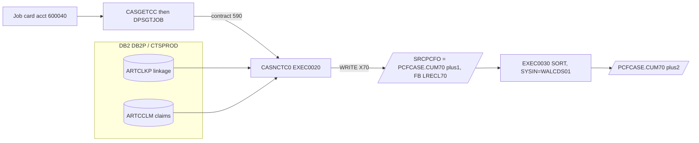

# CASNCTC0 — End-to-End Input/Output Mapping (with Business Examples)

> Source-based mapping of **where each output byte comes from**, the surrounding **job flow**, and worked
> **business examples**. Evidence tags: **(proven)**, **(inferred)**, **(not proven)**,
> **(referenced, not available)**. Line numbers are from `CASNCTC0.txt` unless another file is named.

---

# 1. End-to-End Data Flow (proven)

`CASNCTC0` has **no input files**; its business input is DB2, its only output is one sequential file.
Its place in the job `PWTALCDS` (`PWTALCDS.txt`) is:



**Job step chain (proven, `PWTALCDS.txt`):**

| Step | Program/Proc | Role | Key DDs |
|---|---|---|---|
| `STEP0010` | `IEFBR14` | delete old closed-extract | `DD001` = `…NCTCASE.CLSD.RFMT.EXTR` (35-37) |
| `EXEC0010` | `DB2BATCH` `MEMBER=CASNCTD1` | sister program (open/closed NCTCASE files, LRECL 384) | `NCTCASO`,`TCMCASO`,`CLSDO`,`CLSDEXTO` (39-58) |
| `EXEC0020` | `DB2BATCH` `MEMBER=CASNCTC0` | **this program** | `SRCPCFO` = `…PCFCASE.CUM70(+1)` FB/70 (65-74) |
| `EXEC0030` | `SORT` | re-sort CUM70 to next generation | `SORTIN (+1)` → `SORTOUT (+2)`, `SYSIN=…CARD.CNTL(WALCDS01)` (80-88) |

**Runtime binding (proven):** `SYSTEM=DB2P`, `DATABASE=CTSPROD`, DB2 member/plan `CASNCTC0` (`PWTALCDS.txt` 65-67);
`JOBLIB=P.HMSY.LINKLIB` (26); symbolics `LPOND=P`, `DIPOND=P`, `DOPOND=P`, `ACNTR=ALT` (28-31).

---

# 2. Input (DB2) → Working-Storage → Output map

## 2.1 The one and only SELECT (cursor `ART_CSR`, proven 196-215)

```sql
SELECT  D.RECIP_MA_NUM, C.CASE_ID, D.ICN_NUM, D.PREV_ICN_NUM, D.CLMST_RF
FROM    ARTCLKP C
JOIN    ARTCCLM D
  ON   (C.CONTEXT_CD = :CLKP-CONTEXT-CD  OR :CASE-CONTEXT-CD1 OR :CASE-CONTEXT-CD2
     OR  :CASE-CONTEXT-CD3 OR :CASE-CONTEXT-CD4 OR :CASE-CONTEXT-CD5 OR :CASE-CONTEXT-CD6)
  AND   C.CLAIM_ID  = D.CLAIM_ID
  AND   C.CONTEXT_CD = D.CONTEXT_CD
FOR READ ONLY
```

* `C` = `ARTCLKP` (linkage), `D` = `ARTCCLM` (claims). **(proven, 203-204.)**
* Selection is by **context code list** (the 7 host vars); join is by **CLAIM_ID + CONTEXT_CD**. **(proven.)**
* **No status/amount/date/type predicate** → all matching claims returned. **(proven — absence.)**

## 2.2 FETCH targets and the column → field → byte chain (proven 408-443)

| # | DB2 column (source) | DCLGEN type | Host var (`FETCH INTO`) | Null ind. (bound, untested) | Format step | Output field (bytes) |
|---|---|---|---|---|---|---|
| 1 | `ARTCCLM.RECIP_MA_NUM` | `VARCHAR(20)` | `CCLM-RECIP-MA-NUM` | `WS-RECIP-MANUM-IND` | `…-T(1:-L)`→`WS-MOVE`→`(1:20)` (434-436) | `HST-RECIPIENT-ID-NUM` (1-20) |
| 2 | `ARTCLKP.CASE_ID` | `DECIMAL(12,0)` | `CLKP-CASE-ID` | — | `MOVE` numeric (437) | `HST-HMS-CASE-KEY` (21-29) |
| 3 | `ARTCCLM.ICN_NUM` | `VARCHAR(20) NOT NULL` | `CCLM-ICN-NUM` | — | `…-T(1:-L)`→`WS-MOVE`→`(1:20)` (438-439) | `HST-ICN` (30-49) |
| 4 | `ARTCCLM.PREV_ICN_NUM` | `VARCHAR(20)` | `CCLM-PREV-ICN-NUM` | `WS-PREV-ICN-NUM-IND` | `…-T(1:-L)`→`WS-MOVE`→`(1:20)` (440-441) | `HST-FORMER-ICN` (50-69) |
| 5 | `ARTCCLM.CLMST_RF` | `VARCHAR(10)` | `CCLM-CLMST-RF` | `WS-CLMST-RF-NULL-IND` | `…-T(1:-L)`→`WS-MOVE`→`(1:1)` (442-443) | `HST-XACTION-STATUS` (70) |

## 2.3 Contract → context-code derivation (proven 241-306)

```
Job card acct code ──DPSGTJOB──▶ WS-JOBACCT-1 ──CASGETCC EVALUATE──▶ HMS-3BYTE-CONTRACT-NUM
                                                              │
                                       CASNCTC0 EVALUATE ─────┘──▶ WS-CONTEXT-CD (+ CD1..CD6)
                                                              │
                                    UNSTRING (trim spaces) ───┘──▶ :CLKP-CONTEXT-CD, :CASE-CONTEXT-CD1..6 (VARCHAR)
```

`UNSTRING WS-CONTEXT-CDn DELIMITED BY ALL SPACES INTO …-T COUNT IN …-L` (354-381) sets each VARCHAR's text and
length before `OPEN` (384). **(proven.)**

---

# 3. Output Record Layout (as written)

**File `SRCPCF-OUT` / DD `SRCPCFO` — `RECFM=FB, LRECL=70` (FD 56-62; JCL 74).** Written by
`WRITE CLMO-RECORD FROM WS-HSTI-RECORD` (333).

| Off | Len | Field | PIC | Content rule |
|---:|---:|---|---|---|
| 1 | 20 | `HST-RECIPIENT-ID-NUM` | `X(20)` | `RECIP_MA_NUM`, left-justified, space-padded |
| 21 | 9 | `HST-HMS-CASE-KEY` | `9(09)` | `CASE_ID`, numeric, zero-filled to 9 (low-order 9 digits) |
| 30 | 20 | `HST-ICN` | `X(20)` | `ICN_NUM`, left-justified, space-padded |
| 50 | 20 | `HST-FORMER-ICN` | `X(20)` | `PREV_ICN_NUM`, left-justified, space-padded |
| 70 | 1 | `HST-XACTION-STATUS` | `X(01)` | first character of `CLMST_RF` |

**Relationship to `CLMPREFX.txt` (proven group name + matching layout):** the written group wraps `03 HST-CLMPRFX`
(line 67); its five sub-fields equal the first five fields of the `CLMPREFX` copybook (`CLMPREFX.txt` 2-6) in name,
order, and PIC. The `HST-CLMPRFX` group name is direct evidence this is the *claim-prefix* layout. The copybook's
later fields (`CLM-FROM-DATE`, `RX-WRITTEN-DATE`, `CLAIM-TRANS-TYPE`, …) are **not** populated by this program, so
`CASNCTC0` emits the **70-byte claim-prefix** that a downstream process presumably expands. **(group name/field match
proven; downstream expansion inferred; record defined inline, not `COPY`-linked.)**

**`NCTCASE.txt` is *not* this output.** Despite the paragraph name `1300-FORMAT-NCTCASE-REC`, the `NCTCASE`
copybook is a much larger, different layout (client id, names, settlement amounts, …). The JCL shows
`NCTCASE.RFMT` (LRECL 384) is produced by the **`CASNCTD1`** step, not by `CASNCTC0`. **(proven mismatch;
paragraph naming is an open question — logic §8.3.)**

---

# 4. Business Examples (end-to-end)

> Business meaning of codes is **not proven**; state abbreviations below come from the modification-history
> comments in `CASNCTC0.txt` (e.g., line 22 "NYT", line 24 "WVT", line 30 "ADD CONTEXT CTSTRSNM"), used only to
> label examples. Values are dummy.

## Example A — Alabama run (the actual JCL configuration) → records written

**This is the configuration in `PWTALCDS.txt`.** *(proven chain)*

1. Job card `//PWTALCDS JOB (600040,ALT)…` — accounting code `600040` (line 1).
2. `CASGETCC` `EVALUATE WS-JOBACCT-1 WHEN '600040' MOVE '590'` (`CASGETCC.txt` 202-203) → `HMS-3BYTE-CONTRACT-NUM = '590'`, `CASGETCC-RETURN-CODE = '0'`.
3. `CASNCTC0` `EVALUATE '590'` (293-296) → `WS-CONTEXT-CD='CTSCASAL'`, `CD1='CTSESTAL'`, `CD2='CTSTRSAL'`, `CD3..6='ZZ…'`.
4. Cursor selects `ARTCCLM`/`ARTCLKP` rows where `CONTEXT_CD ∈ {CTSCASAL, CTSESTAL, CTSTRSAL}` and keys join.

**Dummy matching row → output:**
```
IN : RECIP_MA_NUM="AL0009988"  CASE_ID=778899  ICN_NUM="2024050000123"
     PREV_ICN_NUM=" " (empty)  CLMST_RF="O"     CONTEXT_CD="CTSTRSAL"
OUT: |AL0009988___________|000778899|2024050000123_______|____________________|O|
```
Written to `P.HMS.TPL.ALT.IR.PCFCASE.CUM70(+1)`; then `EXEC0030` sorts it into `(+2)`.

## Example B — New York claim (contract 320) → matched on an extra context code

1. (Hypothetical job whose accounting code maps to `320`; `CASGETCC.txt` 134-135 shows `'601361' → '320'`.)
2. `EVALUATE '320'` sets seven codes incl. `CD2='CTSCASEX-NY'` (260).
3. Dummy claim with `CONTEXT_CD='CTSCASEX-NY'` matches via the CD2 OR-term.

```
IN : RECIP_MA_NUM="NY123456789012345678"(20)  CASE_ID=1001  ICN_NUM="NY2024ICN0001"
     PREV_ICN_NUM="NY2023ICN0009"  CLMST_RF="CLOSED"(6)  CONTEXT_CD="CTSCASEX-NY"
OUT: |NY123456789012345678|000001001|NY2024ICN0001_______|NY2023ICN0009_______|C|
```
*Note:* `RECIP_MA_NUM` fills all 20 bytes; `CLMST_RF="CLOSED"` → status byte `C` (first char only).

## Example C — Unknown contract → abend

1. Job accounting code unmapped → `CASGETCC` `WHEN OTHER MOVE '000'` (`CASGETCC.txt` 224-225), RC `'0'`.
2. `CASNCTC0` `EVALUATE '000'` → `WHEN OTHER` (303) → `DISPLAY '** ERR: UNKNOWN HMS-3BYTE-CONTRACT-NUM **'` → `Z9999` → `ILBOABN0` abend **3645**.

```
OUT: (no CUM70 records)   Job step: ABEND U3645
```

## Example D — No claims match → empty generation, RC 04

1. Valid contract (say `645` WV), but no `ARTCCLM`/`ARTCLKP` rows match the context codes.
2. First `FETCH` → `+100`, `REC-WRITE-CTR=0` → warning + `MOVE 04 TO WS-RETURN-CODE` (418-425).

```
OUT: PCFCASE.CUM70(+1) created with 0 records
     RETURN-CODE = 04
     SYSOUT: "NUMBER OF RECORDS  WRITTEN.......... :          0"
```
> The SORT step (`EXEC0030`) still runs on the empty `(+1)` generation; its behavior on empty input is governed
> by `WALCDS01` **(referenced, not available)**.

## Example E — CASGETCC failure → abend 0999

1. `DPSGTJOB` cannot read the job card → `CASGETCC` returns `CASGETCC-RETURN-CODE ≠ '0'`.
2. `CASNCTC0`: `MOVE +0999 TO DUMP-CODE` → `Z9999` → `ILBOABN0` abend **0999** (244-247, 475).

---

# 5. Transformation Reference (quick table)

| Transformation | Rule | Evidence |
|---|---|---|
| VARCHAR → fixed char | `…-T (1:…-L)` into `WS-MOVE X(20)`, then `WS-MOVE(1:n)` into target; left-justified, space-padded | 434-443 |
| Status compression | `CLMST_RF` (≤10) → **1** char (`WS-MOVE(1:1)`) | 442-443 |
| Case key | `DECIMAL(12,0)` → `9(09)` numeric (low-order 9 digits; possible truncation) | 437; `ARTCLKP.txt` 37 |
| Context code trim | `UNSTRING … DELIMITED BY ALL SPACES` → VARCHAR text+length | 354-381 |
| Unused context slot | default `'ZZZZZZZZZZZZZZZZ'` ⇒ non-matching in cursor | 251-256 (inferred non-match) |
| Row → record | one `WRITE` per fetched row; no filtering/aggregation | 331-335 |
| Counters | `REC-WRITE-CTR` reported; `OPEN-NCTC-REC-CTR` inert; `CLOSED-/OTHER-NCTC-REC-CTR` dead | §logic 4.4 |

---

# 6. Proven vs Inferred (mapping-specific)

**Proven**
* The five-column SELECT, its join/selection predicates, and `FOR READ ONLY` (196-215).
* Exact column→host-var→output-byte mapping and the first-char status rule (408-443; §2.2, §3).
* Output DD `SRCPCFO` = GDG `…PCFCASE.CUM70(+1)`, `FB/70`; upstream `CASNCTD1` step; downstream SORT to `(+2)` (`PWTALCDS.txt`).
* Contract chain `600040 → 590 → CTSCASAL/ESTAL/TRSAL` for the shipped JCL (JCL 1; `CASGETCC.txt` 202-203; `CASNCTC0` 293-296).

**Inferred**
* That a downstream process expands the remaining `CLMPRFX` fields beyond the 70-byte `HST-CLMPRFX` prefix (the prefix group name itself is proven, §3).
* `'ZZ…'` sentinels neutralize unused context terms (§5).
* `CASE_ID`/NULL edge behaviors (illustrations S18/S19).

**Not proven / referenced-not-available**
* Business meaning of `CONTEXT_CD`, `CLMST_RF`, `RECIP_MA_NUM` values.
* `DPSGTJOB`, `DSNTIAR`, `ILBOABN0`, `DB2BATCH` proc, SORT member `WALCDS01`.
* Whether the header's "2 files of closed cases" is fulfilled by the sister step `CASNCTD1` (open question).
* The `NCTCASE`-named paragraph vs the CLMPRFX record it builds (open question).
