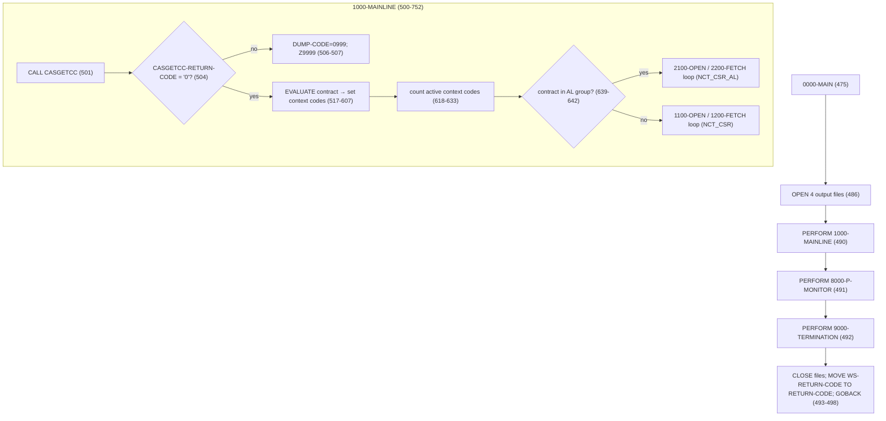

# CASNCTD1 — Program Logic Documentation

> **Evidence discipline:** Every statement below is tied to source. Line numbers in parentheses refer to
> `CASNCTD1.txt` unless another file is named. Copybooks referenced: `NCTCASE.txt`, `ARTCASE.txt`,
> `ARTINDVL.txt`, `ARTCCKP.txt`, `CASGETCC.txt`. JCL referenced: `PWTALCDS.txt`.
> Claims that cannot be proven from source are explicitly tagged **Not proven**, **Inferred**,
> **Open question**, or **Referenced but not available**.

---

## 1. Analysis Method

### 1.1 Artifacts inspected

| Artifact | File | Status | Role |
|---|---|---|---|
| Main program | `CASNCTD1.txt` (1455 lines) | Inspected in full | The program being documented |
| Output record copybook | `NCTCASE.txt` | Inspected in full | `COPY NCTCASE REPLACING ==(PREFIX)== BY ==NCTC==` (129) — the 384-byte output layout |
| DB2 DCLGEN — case | `ARTCASE.txt` | Inspected in full | `EXEC SQL INCLUDE ARTCASE` (287) — `DCLARTCASE` host structure |
| DB2 DCLGEN — individual | `ARTINDVL.txt` | Inspected in full | `EXEC SQL INCLUDE ARTINDVL` (293) — `DCLARTINDV` host structure |
| DB2 DCLGEN — case lookup | `ARTCCKP.txt` | Inspected in full | `EXEC SQL INCLUDE ARTCCKP` (299) — `DCLARTCCKP` host structure |
| Called subprogram | `CASGETCC.txt` | Inspected in full | `CALL WS-CASGETCC` (501) — resolves the 3-byte contract number |
| JCL driver | `PWTALCDS.txt` | Inspected in full | Job that runs `CASNCTD1` as step `EXEC0010` |
| SQL comm. area | `SQLCA` | **Referenced but not available** | `EXEC SQL INCLUDE SQLCA` (247) — standard DB2 include, not in repo |
| Process-monitor copybook | `PMONITOR` | **Referenced but not available** | `EXEC SQL INCLUDE PMONITOR` (251) — host layout for `MISC.P_MONITOR` |
| Job-card reader | `DPSGTJOB` | **Referenced but not available** | `CALL 'DPSGTJOB'` inside `CASGETCC.txt` (86) |
| Client-profile copybook | `CLNTPNCH` | **Referenced but not available** | `COPY CLNTPNCH` inside `CASGETCC.txt` (65) |
| DB2 error formatter | `DSNTIAR` | Standard IBM module | `CALL 'DSNTIAR'` (1439) |
| Abend routine | `ILBOABN0` | Standard module | `CALL 'ILBOABN0' USING DUMP-CODE` (1454) |

### 1.2 How logic was traced

- The `PROCEDURE DIVISION` was read paragraph-by-paragraph (`0000-MAIN` at 475 through `Z9999-ERROR-EXIT` at 1437).
- Both DB2 cursors (`NCT_CSR` 304-356, `NCT_CSR_AL` 360-470) were aligned column-by-column against their
  `FETCH … INTO` host-variable lists (811-848 and 1218-1256) to confirm which DB2 column lands in which field.
- Every `MOVE` in `1300-FORMAT-NCTCASE-REC` (867-1151) was traced from source field to `NCTC-*` output field.
- Output record byte offsets were computed from `NCTCASE.txt` and reconcile exactly to the `PIC X(384)` FD (103).
- File DD names were cross-checked against `PWTALCDS.txt` (43-58).

### 1.3 Proven vs inferred handling

- **Proven** = directly present in code/copybook/JCL (cited by line).
- **Inferred** = deduced from structure or naming, labelled as such.
- **Not proven / Open question** = the code does not establish it (e.g., business meaning of context codes,
  runtime behavior of a data-type discrepancy at one `FETCH` position).

### 1.4 Limitations

- `SQLCA`, `PMONITOR`, `DPSGTJOB`, and `CLNTPNCH` are not in the repository, so any field-level detail that
  depends on them is limited to how `CASNCTD1.txt` / `CASGETCC.txt` reference them.
- The **business meaning** of context codes (`CTSCASxx`), status codes, and case-type codes is **not proven**;
  only mechanical behavior and the developers' own comments are used.
- Actual DB2 table contents and DB2 runtime results (SQLCODE values at execution) cannot be observed from source.

---

## 2. Program Overview

### 2.1 Identity (proven)

| Attribute | Value | Evidence |
|---|---|---|
| `PROGRAM-ID` | `CASNCTD1` | (2) |
| Author / Installation | `LLL` / `HMS` | (3-4) |
| Date written | `10/07/2003` | (5) |
| Language | Enterprise COBOL with embedded DB2 SQL | `EXEC SQL` throughout |
| Latest mod in history | `0029 07/16/25 … CTSCASNJ` | (84-85) |

### 2.2 Purpose (proven from header comments)

The program header states: *"THIS PGM WILL SELECT DATA FROM DB2 TABLES AND CREATE NEW GENERATION OF CASUALTY
CASE FILE (NCTCASE 384 FILE). IT WILL ALSO CREATE 2 FILES OF CLOSED CASES. THIS PROGRAM REPLACES PGM CASPCFM0.
OLD PROCESS WAS BASED ON CASUALTY FILE FROM THE LAN. NEW PROCESS RETRIEVES DATA FROM DB2 TABLES."* (7-14).

DB2 tables named in the header: `DB2AR01.ARTCASE` (case), `ARTINDV` (individual), `ARTCCKP` (case lookup, "AL ONLY") (15-17).

So, mechanically: **read case + individual (+ optional case-lookup) rows from DB2 for one client/contract, reformat
each into a fixed 384-byte record, and write them to sequential output files** (main, TCM, closed, and a 9-byte
closed-key extract). It also refreshes rows in a process-monitor table `MISC.P_MONITOR` (1275-1409).

### 2.3 Technical role & invocation style (proven)

- **Batch DB2 program**, run as a job step under `PROC=DB2BATCH` (`PWTALCDS.txt` 39-40), `SYSTEM=DB2P`,
  `DATABASE=CTSPROD`, DB2 member/plan `CASNCTD1`.
- It is a **main program**: it ends with `GOBACK` after `MOVE WS-RETURN-CODE TO RETURN-CODE` (497-498) and sets
  the job-step return code.
- It **calls** `CASGETCC` (subprogram, 501), `DSNTIAR` (1439), and `ILBOABN0` (1454).

### 2.4 Upstream / downstream dependencies

- **Upstream (proven, `PWTALCDS.txt`):** `STEP0010 EXEC PGM=IEFBR14` deletes the previous closed-extract dataset
  (`…NCTCASE.CLSD.RFMT.EXTR`, 35-37) before `CASNCTD1` runs in `EXEC0010` (39-40). The job card accounting code
  `600040` (line 1) is fed through `CASGETCC` → contract `590` (`CASGETCC.txt` 202-203).
- **Downstream (partly proven):** In the same job, `EXEC0020` runs the sibling program `CASNCTC0`
  (`PWTALCDS.txt` 65-67) which reads a different file (`PCFCASE`). Which job(s) consume `CASNCTD1`'s
  `NCTCASE.RFMT`, `TCMCASE.RFMT`, and `NCTCASE.CLSD.RFMT` generations is **not proven from source**.

---

## 3. Inputs, Outputs, and Dependencies

### 3.1 Files — `SELECT` / `FD` (proven)

CASNCTD1 declares **no input files**; all business input comes from DB2. It declares **four output files**:

| Logical (SELECT) | `ASSIGN TO` (DD) | FD record | LRECL | Dataset (`PWTALCDS.txt`) | Content |
|---|---|---|---|---|---|
| `NCTC-OUT` (91) | `NCTCASO` | `NCTCASE-RECORD PIC X(384)` (98-103) | 384 | `P.HMS.TPL.ALT.IR.NCTCASE.RFMT(+1)` (43-46) | **Every** formatted case record |
| `TCM-OUT` (92) | `TCMCASO` | `TCMCASE-RECORD PIC X(384)` (105-110) | 384 | `P.HMS.TPL.ALT.IR.TCMCASE.RFMT(+1)` (47-50) | Records for **TCM contracts** only, with original incident date |
| `CLSD-OUT` (93) | `CLSDO` | `CLOSED-RECORD PIC X(384)` (112-117) | 384 | `P.HMS.TPL.ALT.IR.NCTCASE.CLSD.RFMT(+1)` (51-54) | Records whose status = `C` (closed) |
| `CLSD-EXTR-OUT` (94) | `CLSDEXTO` | `CLSD-EXTRACT-RECORD PIC X(09)` (119-124) | 9 | `P.HMS.TPL.ALT.IW.NCTCASE.CLSD.RFMT.EXTR` (55-58) | 9-digit case key of each closed record |

All four are opened `OUTPUT` together (486-489) and closed together (493-496).

### 3.2 DB2 objects (proven)

| Object | Type | Usage | Evidence |
|---|---|---|---|
| `ARTCASE` (`A`) | table | `SELECT`/`FETCH` (both cursors) | 342, 399, 452 |
| `ARTINDV` (`I`) | table | `SELECT`/`FETCH` (both cursors); joined on `INDV_ID` + `CLIENT_CD` | 343, 352-354 |
| `ARTCCKP` (`L`) | table | second leg of the `NCT_CSR_AL` `UNION`, filtered `CASLK_RF = 'MA_NUM'` | 454, 466-468 |
| `MISC.P_MONITOR` | table | `UPDATE` (1276-1284) and `INSERT` (1384-1398) | process-monitor rows |
| `NCT_CSR` | cursor | main path; joins `ARTCASE`+`ARTINDV` | 304-356 |
| `NCT_CSR_AL` | cursor | AL/multi-state path; `UNION` adding `ARTCCKP` | 360-470 |

> **Note (Inferred):** `ARTINDVL.txt` declares `IND.ARTINDV_L2` (12) but the COBOL comment says the declaration
> is *"FOR TABLE DB2AR01.ARTINDV"* (76) and the SQL references `ARTINDV` (343). The exact base object vs.
> alias/synonym mapping is **not proven from source**.

### 3.3 Copybooks / includes (proven presence)

| Include/Copy | Line | In repo? | Provides |
|---|---|---|---|
| `NCTCASE` (with `(PREFIX)`→`NCTC`) | 129 | Yes | `WS-NCTCASE-RECORD` = output layout |
| `SQLCA` | 247 | No | SQLCODE, SQLERRD, etc. |
| `PMONITOR` | 251 | No | `PMONITOR-*` host fields for `MISC.P_MONITOR` |
| `ARTCASE` | 287 | Yes | `DCLARTCASE` |
| `ARTINDVL` | 293 | Yes | `DCLARTINDV` |
| `ARTCCKP` | 299 | Yes | `DCLARTCCKP` |

### 3.4 Called programs (proven)

| Program | How called | Passing | Purpose (proven) |
|---|---|---|---|
| `CASGETCC` | `CALL WS-CASGETCC` (dynamic, name in `WS-CASGETCC` = `'CASGETCC'`, 218) | `CASGETCC-CALLING-AREA` (219-224) | Returns 3-byte contract number + return code |
| `DSNTIAR` | `CALL 'DSNTIAR'` (1439) | `SQLCA`, `ERROR-MESSAGE`, `ERROR-LINE-LENGTH` | Formats DB2 error text |
| `ILBOABN0` | `CALL 'ILBOABN0'` (1454) | `DUMP-CODE` | Forces an abend |

`CASGETCC` in turn `CALL 'DPSGTJOB'` (`CASGETCC.txt` 86) to read job-card accounting info, then `EVALUATE WS-JOBACCT-1`
to map an accounting code to a contract number (`CASGETCC.txt` 110-227).

### 3.5 Control-card / profile dependencies

- **Job-card accounting code is the effective control input.** The contract is not read from a parm/SYSIN card;
  it is derived from the JCL job-card accounting field via `CASGETCC` → `DPSGTJOB`. (`PWTALCDS.txt` line 1;
  `CASGETCC.txt` 86-227.)
- No `SELECT` for a control-card file exists in `CASNCTD1`. **(Proven by absence.)**

### 3.6 Important status codes & flags (proven)

| Name | Def line | Meaning in code |
|---|---|---|
| `SQLCODE` | via `SQLCA` | `+0` ok, `+100` end/none, `-904/-911/-913` retriable, other → abend |
| `NCT-CSR-FLAG` (88s `START-OF-NCT-CSR`='S', `END-OF-NCT-CSR`='E') | 135-137 | Cursor state machine |
| `TIME-OUT-CTR` | 232 | Open-retry counter; `>= 5` aborts |
| `WS-RETURN-CODE` | 134 | `00` normal, `04` = "no matching records" (858, 1266) → job step RC |
| `CASGETCC-RETURN-CODE` | 224 | `'0'` = contract resolved; else abend `0999` (504-507) |
| `DUMP-CODE` | 132 (`+3645`) | Abend code passed to `ILBOABN0`; overridden to `+0999` on CASGETCC failure (506) |

---

## 4. Data Structures and Important Fields

### 4.1 Output record `WS-NCTCASE-RECORD` (proven, `NCTCASE.txt`, 384 bytes)

Populated in `1300-FORMAT-NCTCASE-REC`. Byte offsets computed from the copybook and reconciling to `PIC X(384)`:

| Bytes | Field | PIC | Populated from |
|---|---|---|---|
| 1-6 | `NCTC-HMS-CLIENT-ID` | X(06) | `WS-MOVE(1:6)` = shortened context code (1048) |
| 7-15 | `NCTC-HMS-CASE-KEY` | 9(09) | `CASE-CASE-ID` (1050) |
| 16-35 | `NCTC-RECIPIENT-ID-NUM` | X(20) | `INDV-MA-NUM-TEXT(1:len)` (1127-1128) |
| 36-44 | `NCTC-CASE-SOURCE-CODE` | 9(09) | `WS-MOVE(1:9)` from `CASE-CASE-SOURCE-CD` (1112-1114) |
| 45-48 | `NCTC-CASE-TYPE-CODE` | 9(04) | `WS-MOVE(1:4)` from `CASE-CASE-TYPE-CD` (1102-1103) |
| 49 | `NCTC-CASE-STATUS-CODE` | X(01) | `WS-MOVE(1:1)` from `CASE-CASE-STATUS-CD` (1104-1106) — drives O/C/other routing |
| 50-53 | `NCTC-CASE-STAGE-CODE` | 9(04) | `CASE-CASE-STAGE-CD` (1110-1111) |
| 54-57 | `NCTC-CASE-PRIORITY-CODE` | 9(04) | `CASE-CASE-PRIORITY-CD` (1107-1109) |
| 58-67 | `NCTC-CASE-OPEN-DATE` | X(10) | `CASE-CASE-OPEN-DT` (1100) |
| 68-77 | `NCTC-CASE-CLOSE-DATE` | X(10) | `CASE-CASE-CLOSE-DT` (1101) |
| 78-102 | `NCTC-LAST-NAME` | X(25) | `INDV-LAST-NM` (1134) |
| 103-122 | `NCTC-FIRST-NAME` | X(20) | `INDV-FIRST-NM` (1135) |
| 123 | `NCTC-MIDDLE-INIT` | X(01) | `INDV-MI-NM` (1136) |
| 124 | `NCTC-SEX` | X(01) | `WS-MOVE(1:1)` from `INDV-GENCD-RF` (1138-1139) |
| 125-133 | `NCTC-SSN` | X(09) | `INDV-SSN-NUM` (1133) |
| 134-143 | `NCTC-DATE-OF-BIRTH` | X(10) | `INDV-DOB-DT` (1137) |
| 144 | `NCTC-MARITAL-STATUS` | X(01) | `WS-MOVE(1:1)` from `INDV-MARST-RF` (1140-1141) |
| 145-159 | `NCTC-SETTLEMENT-AMT` | S9(13)V9(02) | `CASE-SETTLEMENT-AMT` (1124) |
| 160-174 | `NCTC-EXPENSES-AMT` | S9(13)V9(02) | `CASE-EXPENSES-AMT` (1116) |
| 175-189 | `NCTC-COMPROMISE-AMT` | S9(13)V9(02) | `CASE-COMPROMISE-AMT` (1115) |
| 190-204 | `NCTC-LIEN-MEDICAID-AMT` | S9(13)V9(02) | `CASE-LIEN-MEDICAID-AMT` (1120) |
| 205-219 | `NCTC-LIEN-ADJUST-AMT` | S9(13)V9(02) | `CASE-LIEN-ADJUST-AMT` (1118) |
| 220-229 | `NCTC-LIEN-NOTICE-DATE` | X(10) | `CASE-LIEN-NOTICE-DT` (1121) |
| 230-239 | `NCTC-LIEN-RELEASE-DATE` | X(10) | `CASE-LIEN-RELEASE-DT` (1122) |
| 240-249 | `NCTC-INCIDENT-DATE` | X(10) | `WS-NEW-FROM-DATE` (computed, 1099); **overwritten** to `CASE-INCIDENT-DT` for TCM writes (671/720) |
| 250-259 | `NCTC-CLAIMS-THRU-DATE` | X(10) | `CASE-DOS-TO-DT` (1062) |
| 260 | `NCTC-REGISTERED-IND` | X(01) | `SPACES` (1142) |
| 261 | `NCTC-ALL-CLAIMS-IND` | X(01) | `SPACES` (1142-1143) |
| 262 | `NCTC-THERAPY-IND` | X(01) | `SPACES` (1142-1144) |
| 263-267 | `NCTC-ATTOR-FEE-PCT` | 9V9(04) | `CASE-ATTORNEY-FEE-PCT` (1125) |
| 268-282 | `NCTC-FEE-ADJUST-AMT` | S9(13)V9(02) | `CASE-FEE-ADJUST-AMT` (1117) |
| 283-288 | `NCTC-WEL-NUM` | X(06) | `WS-MOVE(1:6)` from `CASE-WEL-NUMBER-CD` (1060-1061) |
| 289-298 | `NCTC-LIKELY-SETTLE-DATE` | X(10) | `CASE-LIKELY-SETTLE-DT` (1123) |
| 299-313 | `NCTC-LIEN-HMO-AMT` | S9(13)V9(02) | `CASE-LIEN-HMO-AMT` (1119) |
| 314-319 | `NCTC-CASE-WORKER-IPKEY` | 9(06) | `WS-MOVE(1:6)` from `CASE-USER-CD` (1054-1055) |
| 320-329 | `NCTC-COUNTY-CODE` | X(10) | `WS-MOVE(1:10)` from `CASE-COUNTY-CD` (1058-1059) |
| 330-355 | `NCTC-LAST-UPDATE-TMS` | X(26) | `CASE-LAST-UPDATE-DTM` (1126) |
| 356-384 | `NCTC-MF-HIT-DATA` group | 29 | See redefine below |

Bytes 356-384 are a group `NCTC-MF-HIT-DATA` (`NCTCASE.txt` 42-46) **redefined** as `NCTC-FILLER-1`
(`NCTCASE.txt` 47-50). The program uses the **redefine**, not the MF-HIT fields:

| Bytes | Redefine field | PIC | Populated from |
|---|---|---|---|
| 356-367 | `NCTC-INDV-ID` | 9(12) | `CASE-INDV-ID` (1052, mod 0003) |
| 368-372 | `NCTC-CLIENT-CD` | X(05) | derived from `CCKP-DATA-AMT` (1129-1132, mod 0014) |
| 373-384 | `NCTC-FILLER-2` | X(12) | `SPACES` (1149) |

> The MF-HIT sub-fields (`NCTC-MF-HIT-IND`, `-MF-HITS-LAST-RUN`, `-MF-HITS-CUMMULATIVE`, `-MF-HIT-LAST-DTS`)
> are **defined but not populated** here — the moves to them are commented out (1145-1148, mod 0003).

### 4.2 Contract → context routing fields (`WORKING-STORAGE`, proven)

| Field | Def | Role |
|---|---|---|
| `HMS-3BYTE-CONTRACT-NUM` | 220 | 3-byte contract from `CASGETCC`; drives the master `EVALUATE` (517) and cursor routing (639) |
| `WS-CONTEXT-CD` … `WS-CONTEXT-CD6` | 183-189 | Up to 7 context codes selected per contract |
| `WS-CASUALTY-CODE` (88 `CASUALTY-CONTRACT`) | 143, 151-182 | Set of context codes treated as "casualty" for date math |
| `WS-CASUALTY-CODE` (88 `TCM-CONTRACT`) | 144-150 | `CTSCASCT`, `CTSCASNV`, `CTSCASAL` → also written to `TCMCASO` |
| `WS-EDIT-FROM-DATE` (88 `VALID-FROM-DATE` = `'1800-01-01'` THRU `'2199-12-31'`) | 139-141 | Validity gate for date math |
| `WS-TOTAL-CONTEXT-CDS` | 234 | Count of active context codes (1..7), computed 618-633 |

### 4.3 DB2 host-variable groups (from DCLGENs)

- `DCLARTCASE` (`ARTCASE.txt` 48-143): variable-length columns use the DB2 `-L` (length) + `-T` (text) pair,
  e.g. `CASE-CONTEXT-CD-L` / `CASE-CONTEXT-CD-T` (49-53). Amounts are `COMP-3`; dates are `X(10)`.
- `DCLARTINDV` (`ARTINDVL.txt` 78-281): fields used are `INDV-INDV-ID`, `INDV-CLIENT-CD`, `INDV-MA-NUM(-LEN/-TEXT)`,
  `INDV-SSN-NUM`, `INDV-LAST-NM`, `INDV-FIRST-NM`, `INDV-MI-NM`, `INDV-DOB-DT`, `INDV-GENCD-RF`, `INDV-MARST-RF`.
- `DCLARTCCKP` (`ARTCCKP.txt` 28-68): `CCKP-DATA-TXT` (lookup MA text) and `CCKP-DATA-AMT` are the ones used.

### 4.4 Counters (`WS-COUNTERS`, 226-235, proven)

| Counter | Incremented at | Reported at 9000 |
|---|---|---|
| `REC-WRITE-CTR` | every `NCTCASO` write (668, 717) | "NUMBER OF RECORDS WRITTEN" (1417-1419) |
| `TCM-WRITE-CTR` | every `TCMCASO` write (673, 722) | "NUMBER OF TCM RECORDS WRITTEN" (1420-1422) |
| `OPEN-NCTC-REC-CTR` | status `O` (678, 727) | "NUMBER OF OPEN RECORDS WRITTEN" (1423-1425) |
| `CLOSED-NCTC-REC-CTR` | status `C` (680, 729) | "NUMBER OF CLOSED RECORDS WRITTEN" (1426-1428) |
| `OTHER-NCTC-REC-CTR` | any other status (686, 735) | "NUMBER OF OTHER RECORDS WRITTEN" (1429-1431) |

### 4.5 Match / selection keys (proven)

- **Selection (both cursors):** `A.CONTEXT_CD` IN the up-to-7 context host variables **AND** `A.CLIENT_CD = :CASE-CLIENT-CD`
  **AND** `I.CLIENT_CD = :INDV-CLIENT-CD` (344-354, 401-411).
- **Join:** `A.INDV_ID = I.INDV_ID` and `A.CLIENT_CD = I.CLIENT_CD` (352-354).
- **AL-cursor extra join (UNION leg):** `L.CONTEXT_CD = A.CONTEXT_CD AND L.CASE_ID = A.CASE_ID AND L.CASLK_RF = 'MA_NUM'`
  (466-468).
- **No status/amount/date/type predicate** exists → the SQL returns open *and* closed cases; status is applied
  later in COBOL. **(Proven by absence.)**

---

## 5. Processing Logic

### 5.1 Control-flow overview (proven)



### 5.2 `0000-MAIN` — driver (475-498)

1. Display banners; capture compile date/time via `FUNCTION WHEN-COMPILED` and reformat it (478-485).
2. `OPEN OUTPUT` all four files (486-489).
3. `PERFORM 1000-MAINLINE` (the whole extract), then `8000-P-MONITOR`, then `9000-TERMINATION` (490-492).
4. `CLOSE` all four files (493-496), `MOVE WS-RETURN-CODE TO RETURN-CODE`, `GOBACK` (497-498).

### 5.3 `1000-MAINLINE` — contract resolution + cursor routing (500-752)

**5.3.1 Resolve contract (501-510).** `CALL CASGETCC`. If `CASGETCC-RETURN-CODE NOT = '0'`, set `DUMP-CODE = +0999`
and `GO TO Z9999-ERROR-EXIT` (abend). Otherwise `HMS-3BYTE-CONTRACT-NUM` holds the contract.

**5.3.2 Map contract → context codes (511-616).** `WS-CONTEXT-CD1..CD6` are pre-loaded with the placeholder
`'ZZZZZZZZZZZZZZZZ'` (511-516). Then `EVALUATE HMS-3BYTE-CONTRACT-NUM` (517-607) assigns one or more `CTS…`
context codes per contract. Selected proven mappings:

| Contract | Context codes assigned | Lines |
|---|---|---|
| `300` | `CTSCASTST` (tagged `TEST` in cols 1-6) | 518-519 |
| `309` | `CTSESTMI` | 520-521 |
| `313` | `CTSCASFL`, `CTSESTFL`, `CTSTRSFL`, `CTSCASMT-FL` | 522-526 |
| `316` | `CTSCASIA`, `CTSESTIA` | 527-529 |
| `317` | `CTSWRCCA` | 530-531 |
| `319` | `CTSCASCT` | 532-533 |
| `320` | `CTSCASNY`, `CTSCASNYC`, `CTSCASEX-NY`, `CTSESTNY`, `CTSESTEX-NY`, `CTSCASNYOP1`, `CTSESTNYOP1` | 534-541 |
| `326` | `CTSCASCO`, `CTSESTCO`, `CTSCASCO-HCPF` | 542-545 |
| `330` | `CTSCASAR` | 546-547 |
| `333` | `CTSCASKY`, `CTSESTKY` | 548-550 |
| `335` | `CTSCASKS`, `CTSESTKS` | 551-553 |
| `341` / `535` | `CTSCASOH` | 554-557 |
| `358` | `CTSCASNV`, `CTSESTNV`, `CTSTRSNV`, `CTSTFRNV` | 558-562 |
| `359` | `CTSCASNM`, `CTSESTNM`, `CTSTRSNM` | 563-566 |
| `395`/`396`/`444`/`534`/`537`/`547`/`561`/`585`/`593`/`633` | one/two state codes each | 567-597 |
| `564` | `CTSCASTN` | 584-586 and 602 |
| `590` | `CTSCASAL`, `CTSESTAL`, `CTSTRSAL` | 590-593 |
| `645` | `CTSCASWV`, `CTSESTWV`, `CTSCASCH-WV` | 598-601 |
| `303` | `CTSCASNJ` | 603 |
| `WHEN OTHER` | display "UNKNOWN HMS-3BYTE-CONTRACT-NUM", `GO TO Z9999-ERROR-EXIT` | 604-606 |

> **Open question:** `564` appears **twice** — as a modification-`0004`-tagged `WHEN '564'` that only sets
> `WS-CONTEXT-CD1` in a commented line then sets `WS-CONTEXT-CD` (584-586), and again as an
> `0027`-tagged `WHEN '564' MOVE 'CTSCASTN' TO WS-CONTEXT-CD` (602). In standard COBOL, the **first** matching
> `WHEN` wins, so 602 is unreachable; both set `WS-CONTEXT-CD = 'CTSCASTN'`, so the net effect is the same.
> Whether the compiler flags the duplicate literal is **not proven from source**.

**5.3.3 Count active context codes (618-633).** `EVALUATE TRUE` returns the position of the first field still
equal to `'ZZZ…'`; if none are placeholders → `7`. Result in `WS-TOTAL-CONTEXT-CDS` (used later by P-MONITOR).

**5.3.4 Route to a cursor (635-750).** `INITIALIZE DCLARTCASE DCLARTINDV DCLARTCCKP` (635-637), then:

```
IF HMS-3BYTE-CONTRACT-NUM = '590' '320' '341' '313' '330' '358' '359' '645' '535' '564' '303'  (639-642)
   → AL path:  2100-OPEN-NCT-CSR / 2200-FETCH-NCT-CSR   (NCT_CSR_AL)
ELSE
   → standard path: 1100-OPEN-NCT-CSR / 1200-FETCH-NCT-CSR (NCT_CSR)
```

Both paths share the same loop shape:

1. `PERFORM <open> UNTIL START-OF-NCT-CSR OR TIME-OUT-CTR >= 5` (654-655 / 703-704). If `TIME-OUT-CTR >= 5`,
   `GO TO Z9999-ERROR-EXIT` (656-658 / 705-707).
2. `PERFORM UNTIL END-OF-NCT-CSR` (660 / 709): fetch one row; if not end:
   - `PERFORM 1300-FORMAT-NCTCASE-REC` (665 / 714),
   - `WRITE NCTCASE-RECORD FROM WS-NCTCASE-RECORD`; `ADD 1 TO REC-WRITE-CTR` (667-668 / 716-717),
   - **TCM branch** (670-674 / 719-723): `IF TCM-CONTRACT` → `MOVE CASE-INCIDENT-DT TO NCTC-INCIDENT-DATE`,
     `WRITE TCMCASE-RECORD FROM WS-NCTCASE-RECORD`, `ADD +1 TO TCM-WRITE-CTR`,
   - **status branch** `EVALUATE TRUE` (676-687 / 725-736):
     `O` → `OPEN-NCTC-REC-CTR`+1; `C` → `CLOSED-NCTC-REC-CTR`+1, `WRITE CLOSED-RECORD`, move 9-digit key to
     `CLSD-EXTRACT-RECORD`, `WRITE CLSD-EXTRACT-RECORD`; otherwise `OTHER-NCTC-REC-CTR`+1,
   - `INITIALIZE DCLARTCASE DCLARTINDV DCLARTCCKP` (688 / 737).
3. `EXEC SQL CLOSE <cursor>`; on non-zero SQLCODE → abend (692-701 / 741-749).

### 5.4 Open paragraphs `1100-OPEN-NCT-CSR` (754-806) and `2100-OPEN-NCT-CSR` (1153-1212)

- Each `UNSTRING`s the context-code fields on `ALL SPACES` into the DB2 `-T`/`-L` host pairs (755-782 / 1154-1183),
  producing the varchar length/text used by the cursor predicate.
- Sets client key: `MOVE HMS-3BYTE-CONTRACT-NUM TO CASE-CLIENT-CD INDV-CLIENT-CD` (783-784). **Exception:** in
  `2100`, if contract = `'535'`, it moves `'341'` instead (1185-1191, mod 0020) — i.e., **OH CareSource (535) queries
  under client `341`** while its context code is still `CTSCASOH`.
- `EXEC SQL OPEN <cursor>` then `EVALUATE SQLCODE`:
  - `+0` → `SET START-OF-NCT-CSR TO TRUE`,
  - `-904` / `-911` / `-913` → display error, `ADD 1 TO TIME-OUT-CTR`, `GO TO <open-exit>` (retry),
  - `OTHER` → abend via `Z9999-ERROR-EXIT` (787-805 / 1193-1211).

> Comment at 794/1200: *"UNFORTUNATELY WE WILL NEVER RECEIVE -913 IN OUR INSTALLATION"* — developer note; kept as-is.

### 5.5 Fetch paragraphs `1200-FETCH-NCT-CSR` (808-865) and `2200-FETCH-NCT-CSR` (1214-1273)

- `INITIALIZE` the DCL host areas, then `EXEC SQL FETCH … INTO` the host-variable list (differs by cursor).
- `EVALUATE SQLCODE`:
  - `+0` → continue,
  - `+100` → `SET END-OF-NCT-CSR TO TRUE`; **if `REC-WRITE-CTR = ZERO`** display "NO MATCHING RECS FOUND" and
    `MOVE 04 TO WS-RETURN-CODE` (852-859 / 1260-1267),
  - `OTHER` → abend.
- **Column→host difference:** `NCT_CSR_AL` fetches **two extra** positions vs `NCT_CSR`:
  position 29 = `INDV-MA-NUM` (from `I.MA_NUM` in leg 1 / `L.DATA_TXT` in leg 2), position 30 = `CCKP-DATA-AMT`
  (from `I.CLIENT_CD`). See §6 R11 and §8 for the data-type note.

### 5.6 `1300-FORMAT-NCTCASE-REC` (867-1151)

1. **Context-code shortening.** `MOVE CASE-CONTEXT-CD-T(1:len) TO WS-MOVE` (868). For contracts `320`, `313`, `326`,
   `358`, `645`, `564`, a contract-specific `EVALUATE WS-MOVE` maps the long context code to a 6-char code
   (876-1047). Examples: `320` `CTSCASEX-NY`→`CTSCEN`, `CTSCASNYC`→`CTSCCN`, `CTSESTNY`→`CTSECN`,
   `CTSESTEX-NY`→`CTSEEN`, `CTSCASNYOP1`→`CTSCON`, `CTSESTNYOP1`→`CTSEON`, else→`CTSCAS` (877-907);
   `313` maps `…FL` variants to `CTSCAS`/`CTSEST`/`CTSTRS`/`CTSMST` (927-948); `326` maps `CTSCASCO-HCPF`→`CTSHCP`
   (955-974); `645` maps `CTSCASCH-WV`→`CTSCHP` (1010-1030). Then `MOVE WS-MOVE(1:6) TO NCTC-HMS-CLIENT-ID` (1048).
2. **Direct case moves** for key/id/worker/county/wel/claims-thru (1050-1062).
3. **Incident-date computation (mod 0015, 1064-1099).** `WS-CASUALTY-CODE = CASE-CONTEXT-CD-T`;
   `WS-EDIT-FROM-DATE = WS-NEW-FROM-DATE = CASE-DOS-FROM-DT`.
   - If `VALID-FROM-DATE` (DOS-from between 1800 and 2199): if `CASUALTY-CONTRACT` →
     `WS-NEW-FROM-DATE = DATE(DOS-from) - 60 DAYS` (SQL `SET`, 1073-1076); else keep DOS-from.
   - Else set `WS-EDIT-FROM-DATE = CASE-INCIDENT-DT`; if that is valid and casualty →
     `INCIDENT - 60 DAYS`; else keep `CASE-INCIDENT-DT`.
   - `MOVE WS-NEW-FROM-DATE TO NCTC-INCIDENT-DATE` (1099).
4. **Remaining case moves**: open/close dates, type/status/priority/stage/source (with fixed truncations), and all
   amounts (1100-1126).
5. **Individual moves**: `MA-NUM`→recipient, name fields, DOB, `GENCD-RF`(1:1)→sex, `MARST-RF`(1:1)→marital
   (1127-1141).
6. **Client-code derivation (mod 0014, 1129-1132):** `CCKP-DATA-AMT → ALT-CLIENT-CD → ALT-CLIENT-CD-NUM(5:3) →
   ALT-CLIENT-CD-CHAR → NCTC-CLIENT-CD`.
7. **Indicators/filler:** `SPACES` to `NCTC-REGISTERED-IND`, `-ALL-CLAIMS-IND`, `-THERAPY-IND`, `NCTC-FILLER-2`
   (1142-1150); `NCTC-INDV-ID = CASE-INDV-ID` (1052).

### 5.7 `8000-P-MONITOR` (1275-1320) and `8100-P-MONITOR-INS` (1322-1411)

- `UPDATE MISC.P_MONITOR SET START_DTM=CURRENT TIMESTAMP, END_DTM=NULL, TASK_STEP_TXT='LOAD', STATUS_TXT='RUNNING',
  DATA_CNT=0 WHERE CLIENT_CD = :HMS-3BYTE-CONTRACT-NUM AND PROCESS_NM LIKE 'CLKP_LOAD_DURATION_%'` (1276-1284).
- On `SQLCODE +0`: compare `SQLERRD(3)` (rows updated) with `WS-TOTAL-CONTEXT-CDS`; if unequal, insert the missing
  context rows via `8100` (1294-1305, mod 0021), then `COMMIT`.
- On `SQLCODE +100` (no rows): insert 7 context rows via `PERFORM 8100 … 7 TIMES` (1310-1313).
- On other SQLCODE: abend (1314-1317).
- `8100-P-MONITOR-INS` selects the next context code (`WS-CONTEXT-CD`, then `CASE-CONTEXT-CD1-T`..`CD6-T`), skipping
  those still equal to `'ZZZ…'` (1323-1363), builds `PROCESS_NM = 'CLKP_LOAD_DURATION_' + context`,
  sets the varchar lengths, and `INSERT`s a row into `MISC.P_MONITOR` (1365-1398); `COMMIT` on success (1400-1409).

> `PMONITOR` copybook is not in the repo, so the exact column list of `MISC.P_MONITOR` and the `PMONITOR-*`
> field pictures are **referenced but not available**.

### 5.8 `9000-TERMINATION` (1413-1435) and `Z9999-ERROR-EXIT` (1437-1455)

- `9000` displays the five counters via edited field `NUM-REC-OUT` and a "NORMAL END" banner.
- `Z9999` — if `SQLCODE NOT = +0`, `CALL 'DSNTIAR'` and display 7 formatted error lines (1438-1451); then display
  "ABENDED", `CALL 'ILBOABN0' USING DUMP-CODE` (default `+3645`, or `+0999` from the CASGETCC path), `GOBACK`.

---

## 6. Extracted Business Logic

> Business intent statements are limited to what the code and the developers' own comments prove.

- **R1 — Contract gate (routing).** *When the job runs*, the contract is taken from the job-card accounting code
  via `CASGETCC`; **if it cannot be resolved (`CASGETCC-RETURN-CODE ≠ '0'`), the program abends** with dump `0999`
  (501-507).
- **R2 — Unknown contract.** *When the resolved contract is not in the `EVALUATE` list*, the program displays
  "UNKNOWN … CONTRACT" and abends (604-606).
- **R3 — Multi-context selection.** *For a given contract*, the system selects DB2 case rows whose `CONTEXT_CD`
  matches **any** of the (up to seven) context codes configured for that contract, **and** whose `CLIENT_CD`
  equals the contract (344-354).
- **R4 — Status-agnostic selection, status-driven distribution.** The SQL applies **no** status filter; **every**
  matched case is written to `NCTCASO` (667/716). Then: **when status = `O`** it is counted open; **when status =
  `C`** it is additionally written to `CLSDO` and its 9-digit key to `CLSDEXTO`; **otherwise** it is counted "other"
  (676-687 / 725-736).
- **R5 — TCM contracts get a parallel file with the original incident date.** *When the context code is a TCM
  contract* (`CTSCASCT`, `CTSCASNV`, `CTSCASAL`), the record is **also** written to `TCMCASO`, after
  `NCTC-INCIDENT-DATE` is reset to the **original** `CASE-INCIDENT-DT` (670-674 / 719-723; mod 0015 comment 52-54).
- **R6 — Casualty incident-date roll-back of 60 days.** *When a contract is a "casualty" context and the driving
  date is valid*, `NCTC-INCIDENT-DATE` on `NCTCASO` is set to the date **minus 60 days**, preferring `DOS_FROM_DT`
  and falling back to `INCIDENT_DT`; non-casualty contracts keep the un-shifted date (1064-1099; mod 0015 comment 44-54).
- **R7 — AL/multi-state path pulls every MA number.** *For contracts `590,320,341,313,330,358,359,645,535,564,303`*,
  the `NCT_CSR_AL` cursor `UNION`s the individual's `MA_NUM` with each `ARTCCKP` lookup row where `CASLK_RF='MA_NUM'`,
  so **one case can emit multiple records — one per MA number** (360-470; mod 0007 comment 32-34).
- **R8 — Context-code compression for the 6-byte output key.** *For contracts whose context codes exceed 6
  characters* (`320,313,326,358,645,564`), the long `CTS…` code is mapped to a fixed 6-char code before being placed
  in `NCTC-HMS-CLIENT-ID` (876-1048; mods 0017/0019/0024/0025/0026/0027).
- **R9 — OH CareSource (535) reuses OH (341) data.** *When contract = `535`*, the cursor is opened with client
  `341` although the context stays `CTSCASOH` (1185-1191, mod 0020).
- **R10 — "No data" is a warning, not an abend.** *When the first fetch returns `+100` with `REC-WRITE-CTR = 0`*,
  the program writes empty files, sets **RC 04**, and ends normally (852-859 / 1260-1267).
- **R11 — Client code on the output.** `NCTC-CLIENT-CD` is derived from cursor column 30 (`CCKP-DATA-AMT`), via
  `ALT-CLIENT-CD-NUM(5:3)` (1129-1132). See §8 for the CHAR-vs-decimal caveat and the standard-path value.
- **R12 — DB2 contention tolerance.** *When `OPEN` returns `-904/-911/-913`*, retry up to 5 attempts; the 6th
  aborts the run (654-658, 787-805).
- **R13 — Process-monitor refresh.** The run marks its `MISC.P_MONITOR` `CLKP_LOAD_DURATION_*` rows `RUNNING` and
  inserts rows for any context code not yet monitored (1275-1409).

Selected decision table (status routing, per fetched record):

| `NCTC-CASE-STATUS-CODE` | `NCTCASO` | `TCMCASO` (if `TCM-CONTRACT`) | `CLSDO` | `CLSDEXTO` | Counter |
|---|---|---|---|---|---|
| `O` | write | write | — | — | `OPEN-NCTC-REC-CTR` |
| `C` | write | write | write | write (9-byte key) | `CLOSED-NCTC-REC-CTR` |
| any other | write | write | — | — | `OTHER-NCTC-REC-CTR` |

---

## 7. Error Handling and Edge Cases

| Condition | Detection | Handling | Evidence |
|---|---|---|---|
| CASGETCC failure | `CASGETCC-RETURN-CODE NOT = '0'` | `DUMP-CODE=+0999`, abend | 504-507 |
| Unknown contract | `EVALUATE … WHEN OTHER` | display + abend | 604-606 |
| DB2 open contention | SQLCODE `-904/-911/-913` | retry, count in `TIME-OUT-CTR`; 5th failure → abend | 787-805, 654-658 |
| DB2 fetch/close/update/insert error | SQLCODE = OTHER | `MOVE SQLCODE TO WS-SQLCODE`, display, abend | 860-863, 1268-1272, 696-700, 745-748, 1314-1317, 1405-1408 |
| No rows found | SQLCODE `+100` and `REC-WRITE-CTR=0` | warn, `RC=04`, normal end | 852-859, 1260-1267 |
| P-MONITOR row missing | SQLCODE `+100` on UPDATE | insert 7 rows | 1310-1313 |
| Abend path | `Z9999-ERROR-EXIT` | `DSNTIAR` format + 7 lines, `ILBOABN0` with `DUMP-CODE` | 1437-1455 |

**Edge cases proven in code:**

- Empty result set → all four files are created but hold zero records (files still opened/closed), RC 04.
- `TIME-OUT-CTR` is `PIC S9(01)` (232); the loop guard `>= 5` stops before overflow.
- For the standard (non-AL) path, `DCLARTCCKP` is initialized but never fetched, so `CCKP-DATA-AMT` stays `0`
  (see §8) — this affects `NCTC-CLIENT-CD`.

---

## 8. Proven vs Inferred vs Unknown

### 8.1 Proven from source

- The four output files, their DDs, LRECLs, and datasets (91-124; `PWTALCDS.txt` 43-58).
- The two cursors, their joins/predicates, and the exact `FETCH` column→host alignment (304-470, 811-848, 1218-1256).
- Contract→context mappings and cursor routing list (517-607, 639-642).
- Every output field's source `MOVE` in `1300` (867-1151) and the 384-byte layout (`NCTCASE.txt`).
- Status routing to counters/`CLSDO`/`CLSDEXTO`; TCM parallel write with original incident date (667-687, 670-674).
- Casualty 60-day date roll-back with DOS-from → incident fallback (1064-1099).
- Retry-on-contention, "no data → RC 04", abend behavior (787-805, 852-859, 1437-1455).
- P-MONITOR update/insert flow (1275-1409).

### 8.2 Inferred from structure/usage

- **Business intent** of R5/R6/R7/R8 is inferred from field names + the developers' modification comments (36-85).
- `ARTINDV` vs the DCLGEN header `IND.ARTINDV_L2` (`ARTINDVL.txt` 12, 76) implies a synonym/alias; the mapping is inferred.
- The purpose of `NCTC-CLIENT-CD` (a 3-digit client/contract code in the output) is inferred from the `(5:3)`
  substring and the `ALT-CLIENT-CD` naming (1129-1132).

### 8.3 Open questions / not proven

- **Data-type discrepancy at AL-cursor column 30.** `I.CLIENT_CD` (`CHAR(5)`) is fetched into `:CCKP-DATA-AMT`
  (`PIC S9(7)V9(2) COMP-3`) (390-391/444, 1247-1248). Whether DB2 implicitly converts the numeric client string to
  the packed host field or raises an SQL error at run time is **not proven from source**. If it converts as the
  code's downstream use assumes, `NCTC-CLIENT-CD` receives the last 3 digits of the client code; on the **standard
  (non-AL) path** `CCKP-DATA-AMT` is never fetched and stays `0`, so `NCTC-CLIENT-CD` resolves to `'000'`.
- **Business meaning** of context codes (`CTSCAS…`), status letters (`O`/`C`), case types, priorities, stages,
  and sources — **not proven**; only the letters/values themselves are known.
- **Downstream consumers** of `NCTCASE.RFMT`, `TCMCASE.RFMT`, `NCTCASE.CLSD.RFMT` — **not proven** (no consuming
  job is in the repo).
- **`564` duplicate `WHEN`** (584-586 vs 602): net effect identical (`CTSCASTN`); compiler diagnostics not proven.
- Layouts of `SQLCA`, `PMONITOR`, `DPSGTJOB`, `CLNTPNCH` — **referenced but not available**.
