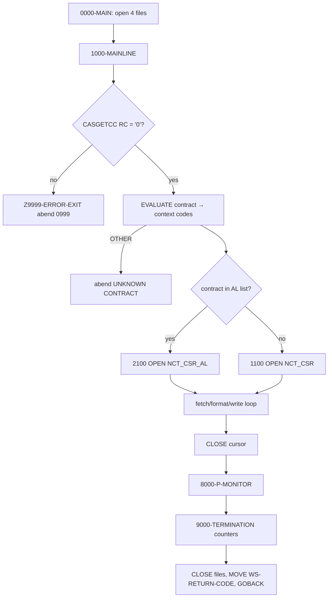
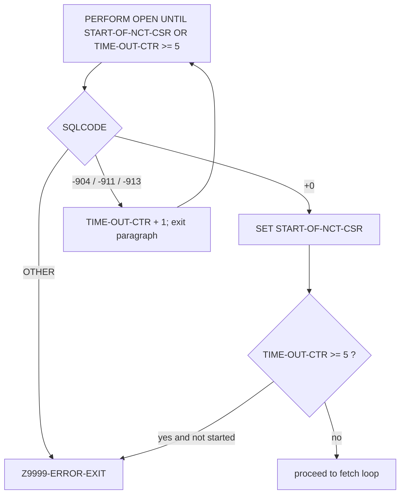
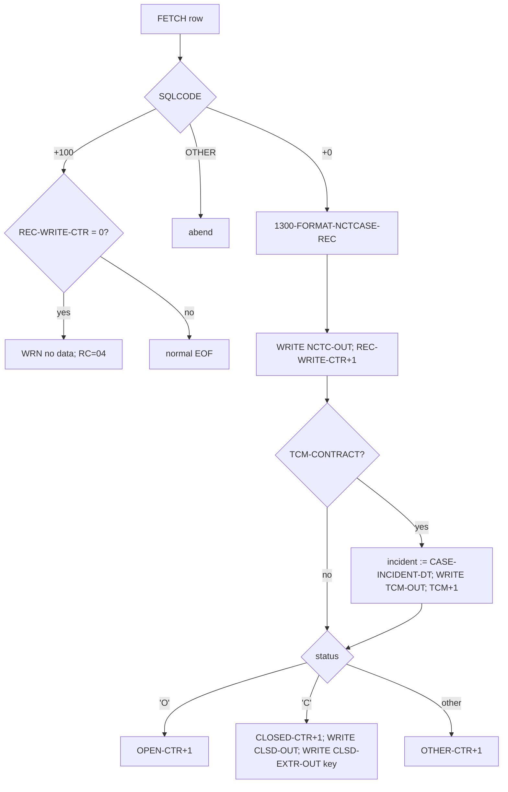
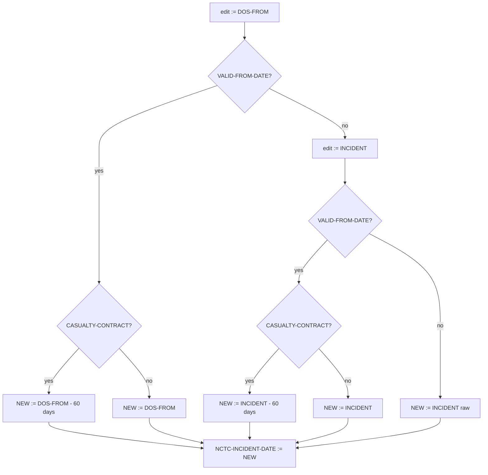
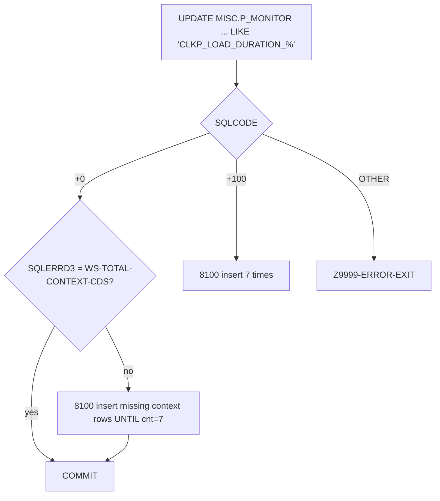

# CASNCTD1 — Illustration Document (Dummy Data)

> Companion to `CASNCTD1.logic.md`. All sample records below use **dummy data** invented for
> illustration. They demonstrate the behaviour **coded** in `CASNCTD1.txt`.
> **No‑hallucination note:** because the DB2 DCLGEN copybooks (`ARTCASE`, `ARTINDVL`, `ARTCCKP`,
> `PMONITOR`) are **not in the repository**, exact host-variable pictures are unknown. Sample DB2
> values are therefore shown as plausible strings/numbers consistent with the SQL `SELECT` lists and
> the `NCTCASE` output picture clauses; they are **not** claimed to be production values.

---

# 1. Illustration Scope

- **What is illustrated:** every meaningful coded branch — contract/context mapping, cursor routing,
  OPEN retry, FETCH EOF/no-data, the incident-date decision table, context-code shortening, TCM
  duplication, status (O/C/other) routing + closed-key extract, Alabama `ARTCCKP` MA lookup, and the
  P‑Monitor update/insert paths.
- **How dummy data was created:** each example fixes the input fields that the relevant branch tests
  (`HMS-3BYTE-CONTRACT-NUM`, `CASE-CONTEXT-CD`, `CASE-CASE-STATUS-CD`, `CASE-DOS-FROM-DT`,
  `CASE-INCIDENT-DT`, `SQLCODE`, `SQLERRD(3)`) and leaves other fields at neutral sample values.
- **Source structures used:** field names/positions from the `NCTCASE` copybook; branch conditions
  and literals directly from `CASNCTD1.txt` (line numbers cited).
- **What cannot be fully illustrated:** exact byte-level packing of amount fields and the precise
  content of DCLGEN host fields (copybooks absent). Amounts are shown as human-readable numbers; the
  physical zoned/`PIC S9(13)V9(02)` encoding is noted but not byte-rendered.

**Canonical dummy case row** used as the baseline for many scenarios (values chosen for illustration):

| Host variable | Dummy value |
|---|---|
| `CASE-CONTEXT-CD` | `CTSCASCT` |
| `CASE-CASE-ID` | `123456789` |
| `CASE-INDV-ID` | `000000045678` |
| `CASE-USER-CD` | `JSMITH` |
| `CASE-COUNTY-CD` | `HARTFORD` |
| `CASE-WEL-NUMBER-CD` | `W12345` |
| `CASE-DOS-FROM-DT` | `2016-03-15` |
| `CASE-DOS-TO-DT` | `2016-06-30` |
| `CASE-INCIDENT-DT` | `2016-02-01` |
| `CASE-CASE-OPEN-DT` | `2016-04-01` |
| `CASE-CASE-CLOSE-DT` | `0001-01-01` (open → blankish) |
| `CASE-CASE-TYPE-CD` | `10` |
| `CASE-CASE-STATUS-CD` | `O` |
| `CASE-CASE-PRIORITY-CD` | `2` |
| `CASE-CASE-STAGE-CD` | `3` |
| `CASE-CASE-SOURCE-CD` | `5` |
| `CASE-SETTLEMENT-AMT` | `100000.00` |
| `CASE-EXPENSES-AMT` | `1500.00` |
| `CASE-LIEN-MEDICAID-AMT` | `25000.00` |
| `CASE-ATTORNEY-FEE-PCT` | `0.3333` |
| `CASE-LAST-UPDATE-DTM` | `2016-05-01-12.00.00.000000` |
| `INDV-MA-NUM` | `MA123456789` |
| `INDV-SSN-NUM` | `123456789` |
| `INDV-LAST-NM` | `SMITH` |
| `INDV-FIRST-NM` | `JOHN` |
| `INDV-MI-NM` | `A` |
| `INDV-DOB-DT` | `1970-01-15` |
| `INDV-GENCD-RF` | `M` |
| `INDV-MARST-RF` | `S` |

---

# 2. Scenario Catalog

| # | Scenario | Trigger (source) | Coded outcome |
|---|---|---|---|
| S1 | Contract retrieved OK | `CASGETCC-RETURN-CODE = '0'` (504) | continue |
| S2 | Contract retrieval fails | `CASGETCC-RETURN-CODE NOT= '0'` (504) | abend, dump `0999` |
| S3 | Known contract | matched `WHEN` (528–603) | context codes set |
| S4 | Unknown contract | `WHEN OTHER` (604) | abend |
| S5 | Standard cursor route | contract not in AL list (639) → ELSE | use `NCT_CSR` |
| S6 | AL cursor route | contract in AL list (639) | use `NCT_CSR_AL` |
| S7 | OH CareSource remap | contract `535` (1185) | DB2 client forced to `341` |
| S8 | OPEN success | `SQLCODE +0` (789) | `START-OF-NCT-CSR` |
| S9 | OPEN retry | `SQLCODE -904/-911/-913` (791–793) | `TIME-OUT-CTR+1`, retry |
| S10 | OPEN gives up | `TIME-OUT-CTR >= 5` (656/705) | abend |
| S11 | OPEN fatal | OPEN `OTHER` (801) | abend |
| S12 | Row fetched | `FETCH SQLCODE +0` (850) | format + write |
| S13 | Normal EOF | `FETCH +100`, `REC-WRITE-CTR>0` (852) | end loop, RC 00 |
| S14 | No data | `FETCH +100`, `REC-WRITE-CTR=0` (854) | warn, RC 04 |
| S15 | FETCH fatal | FETCH `OTHER` (860) | abend |
| S16 | Context shortening | contract 320/313/326/358/645/564 (876…1047) | 6-char client id |
| S17 | Incident −60 (DOS valid, casualty) | 1069+1071 | `DOS-FROM − 60` |
| S18 | Incident kept (DOS valid, non‑casualty) | 1069+1077 | `DOS-FROM` |
| S19 | Incident −60 (DOS invalid, INC valid, casualty) | 1080+1085 | `INCIDENT − 60` |
| S20 | Incident kept (DOS invalid, INC valid, non‑casualty) | 1080+1091 | `INCIDENT` |
| S21 | Incident raw (both invalid) | 1094 | `INCIDENT` raw |
| S22 | Alabama client reformat | 1129–1132 | `NCTC-CLIENT-CD` from `CCKP-DATA-AMT` |
| S23 | Status Open | `NCTC-CASE-STATUS-CODE='O'` (677) | open counter |
| S24 | Status Closed | `='C'` (679) | closed counter + `CLSD-OUT` + `CLSD-EXTR-OUT` |
| S25 | Status Other | `WHEN OTHER` (685) | other counter |
| S26 | TCM duplicate | `TCM-CONTRACT` (670) | extra `TCM-OUT`, original incident date |
| S27 | Closed **and** TCM | S24 + S26 same row | `CLSD-OUT` carries original incident date (ordering) |
| S28 | AL MA-number lookup | `NCT_CSR_AL` UNION leg (413–468) | MA number from `ARTCCKP.DATA_TXT` |
| S29 | Monitor update, counts equal | `SQLERRD(3)=WS-TOTAL-CONTEXT-CDS` (1300) | update only, commit |
| S30 | Monitor update, new context | `SQLERRD(3)≠total` (1300) | insert missing rows |
| S31 | Monitor row absent | UPDATE `SQLCODE +100` (1310) | insert 7 |
| S32 | Monitor fatal | UPDATE/INSERT `OTHER` (1314/1405) | abend |
| S33 | Normal termination | reach `9000` | counters displayed |

---

# 3. Dummy Data Examples

### S2 — Contract retrieval fails (abend 0999)
- **Trigger:** `CASGETCC` returns `CASGETCC-RETURN-CODE = '9'`.
- **Path:** lines 504–508 → `MOVE +0999 TO DUMP-CODE` → `Z9999-ERROR-EXIT`.
- **Result:** `DISPLAY '** ERR: RETRIEVE CONTRACT NUMBER **'`, `DISPLAY '***** PGM CASNCTD1
  ABENDED *****'`, `CALL 'ILBOABN0' USING DUMP-CODE` (dump `0999`). No output records.

### S4 — Unknown contract (abend)
- **Trigger:** `HMS-3BYTE-CONTRACT-NUM = '999'` (no matching `WHEN`).
- **Path:** `WHEN OTHER` (604–606) → `DISPLAY '** ERR: UNKNOWN HMS-3BYTE-CONTRACT-NUM **'` →
  `Z9999-ERROR-EXIT` → abend `3645` (SQLCODE is `+0`, so `DSNTIAR` block is skipped).

### S5/S6 — Cursor routing
| Contract | In AL list `('590','320','341','313','330','358','359','645','535','564','303')`? | Cursor |
|---|---|---|
| `319` (CTSCASCT) | No | `NCT_CSR` (standard) |
| `326` (CTSCASCO…) | No | `NCT_CSR` (standard) |
| `590` (CTSCASAL…) | Yes | `NCT_CSR_AL` |
| `320` (CTSCASNY…) | Yes | `NCT_CSR_AL` |

### S7 — OH CareSource remap (`535`)
- **Trigger:** `HMS-3BYTE-CONTRACT-NUM = '535'`, context `CTSCASOH`.
- **Path:** `2100-OPEN-NCT-CSR` line 1185 → `MOVE '341' TO CASE-CLIENT-CD INDV-CLIENT-CD`.
- **Result:** DB2 rows are selected with **client `341`**, even though the run's contract is `535`.
  Output `NCTC-HMS-CLIENT-ID` still derives from the context code (`CTSCAS`).

### S9/S10 — OPEN retry then give-up
```
Attempt 1: OPEN NCT_CSR → SQLCODE -911  → DISPLAY 'ERR: OPEN NCT_CSR, SQLCODE = -911',
           TIME-OUT-CTR = 1, 'DB2 ACCESS ATTEMPTED 1 TIME(S)'
Attempt 2: -911 → TIME-OUT-CTR = 2
Attempt 3: -911 → TIME-OUT-CTR = 3
Attempt 4: -911 → TIME-OUT-CTR = 4
Attempt 5: -911 → TIME-OUT-CTR = 5
UNTIL START-OF-NCT-CSR OR TIME-OUT-CTR >= 5  → loop ends, START not set
IF TIME-OUT-CTR >= 5 → GO TO Z9999-ERROR-EXIT (abend 3645)
```

### S13 vs S14 — EOF with vs without data
| Case | `REC-WRITE-CTR` at `+100` | Coded reaction | RC |
|---|---|---|---|
| S13 | `> 0` (e.g. 5) | set `END-OF-NCT-CSR`, no warning | `00` |
| S14 | `= 0` | `DISPLAY 'WRN: NO MATCHING RECS FOUND IN DB2AR01 TABLES'` … `MOVE 04 TO WS-RETURN-CODE` | `04` |

### S16 — Context-code shortening (contract `320`, NY)
| Fetched `CASE-CONTEXT-CD` | `WS-MOVE` after EVALUATE (876–908) | `NCTC-HMS-CLIENT-ID` (1:6) |
|---|---|---|
| `CTSCASEX-NY` | `CTSCEN` | `CTSCEN` |
| `CTSCASNYC` | `CTSCCN` | `CTSCCN` |
| `CTSESTNY` | `CTSECN` | `CTSECN` |
| `CTSESTEX-NY` | `CTSEEN` | `CTSEEN` |
| `CTSCASNYOP1` | `CTSCON` | `CTSCON` |
| `CTSESTNYOP1` | `CTSEON` | `CTSEON` |
| `CTSCASNY` (OTHER) | `CTSCAS` | `CTSCAS` |

### S17–S21 — Incident-date decision table (worked examples)
Using dummy dates; "‑60" values are exact calendar arithmetic.

| # | Contract/context | `DOS-FROM` | `INCIDENT` | Casualty? | `NCTC-INCIDENT-DATE` | Why |
|---|---|---|---|---|---|---|
| S17 | 319 / `CTSCASCT` | `2016-03-15` (valid) | `2016-02-01` | Yes | **`2016-01-15`** | valid DOS − 60 (1069→1074) |
| S18 | 316 / `CTSCASIA` | `2016-03-15` (valid) | `2016-02-01` | No | **`2016-03-15`** | valid DOS kept (1077) |
| S19 | 319 / `CTSCASCT` | `    ` (invalid) | `2016-02-01` (valid) | Yes | **`2015-12-03`** | INC − 60 (1085→1088) |
| S20 | 316 / `CTSCASIA` | `    ` (invalid) | `2016-02-01` (valid) | No | **`2016-02-01`** | INC kept (1091) |
| S21 | 316 / `CTSCASIA` | `    ` (invalid) | `    ` (invalid) | — | **`    `** (raw INC) | fallback (1095) |

> `CTSCASCT` is in the `CASUALTY-CONTRACT` 88-list (line 153) and also in `TCM-CONTRACT` (line 146);
> `CTSCASIA` is in **neither**, so it is used above as the non-casualty example.

### S22 — Alabama client-code reformat (contract `590`)
- **Trigger:** AL cursor; `CCKP-DATA-AMT` receives `I.CLIENT_CD` (FETCH position 30, line 1248).
- **Path (1129–1132):** `CCKP-DATA-AMT → ALT-CLIENT-CD (S9(7)V9(2)) → ALT-CLIENT-CD-NUM (9(7)) →
  ALT-CLIENT-CD-NUM(5:3) → ALT-CLIENT-CD-CHAR → NCTC-CLIENT-CD`.
- **Dummy:** if `CCKP-DATA-AMT` numeric value is `0000590` then `ALT-CLIENT-CD-NUM = 0000590`,
  positions 5:3 = `590`, so `NCTC-CLIENT-CD = 590` (in output bytes 368–372). *(Exact packing depends
  on the absent `ARTCCKP` DCLGEN — **inferred** from the moves.)*

### S23 — Status Open
- `CASE-CASE-STATUS-CD = 'O'` → `NCTC-CASE-STATUS-CODE = 'O'` → `ADD 1 TO OPEN-NCTC-REC-CTR`. Only the
  main `NCTC-OUT` record is written (plus TCM if applicable).

### S24 — Status Closed (three writes)
- `CASE-CASE-STATUS-CD = 'C'`, `CASE-CASE-ID = 123456789`.
- **Writes:** (1) `NCTC-OUT`; (2) `CLSD-OUT` (full 384-byte record); (3) `CLSD-EXTR-OUT` = the 9-byte
  key `123456789`. `CLOSED-NCTC-REC-CTR` +1.

### S26 — TCM duplicate (contract `319`, `CTSCASCT`)
- Main `NCTC-OUT` written with `NCTC-INCIDENT-DATE = 2016-01-15` (S17).
- `TCM-CONTRACT` true → `MOVE CASE-INCIDENT-DT (2016-02-01) TO NCTC-INCIDENT-DATE`,
  `WRITE TCMCASE-RECORD`. So **TCM record incident date = `2016-02-01`** (original), main = `2016-01-15`.

### S28 — AL MA-number lookup (UNION second leg)
- For contract `590`, a case with multiple MA numbers in `ARTCCKP` (`CASLK_RF = 'MA_NUM'`) yields one
  UNION row per lookup value; `L.DATA_TXT` fills the MA-number slot → `NCTC-RECIPIENT-ID-NUM`.
- **Dummy:** case `123456789` has `ARTCCKP` rows `DATA_TXT = MA111111111` and `MA222222222` →
  two output rows, identical except `NCTC-RECIPIENT-ID-NUM`.

### S29–S31 — P‑Monitor
| Scenario | UPDATE result | `SQLERRD(3)` vs `WS-TOTAL-CONTEXT-CDS` | Action |
|---|---|---|---|
| S29 | `+0` | `3 = 3` (e.g. contract 326) | update only, `COMMIT` |
| S30 | `+0` | `2 ≠ 3` | `PERFORM 8100-P-MONITOR-INS UNTIL cnt=7` inserts the missing context row(s) |
| S31 | `+100` | n/a | `PERFORM 8100-P-MONITOR-INS 7 TIMES` |

- **Insert build (8100):** `PROCESS_NM = 'CLKP_LOAD_DURATION_' + context code`, `CLIENT_CD = contract`,
  `TASK_STEP_TXT='LOAD'`, `STATUS_TXT='RUNNING'`, `DATA_CNT=0` (lines 1365–1398). One `INSERT` +
  `COMMIT` per real context code; `'ZZ…Z'` slots are skipped via `GO TO 8100-PM-INS-EXIT`.

---

# 4. Before / After Illustrations

## 4.1 DB2 input row → 384-byte `NCTCASE` output (contract 319, `CTSCASCT`, status `O`)

**Before (DB2 fetch, dummy — canonical row, status `O`):**
```
CONTEXT_CD=CTSCASCT  CASE_ID=123456789  INDV_ID=000000045678
DOS_FROM=2016-03-15  DOS_TO=2016-06-30  INCIDENT=2016-02-01
STATUS=O  TYPE=10  STAGE=3  PRIORITY=2  SOURCE=5
SETTLEMENT=100000.00  EXPENSES=1500.00  LIEN_MEDICAID=25000.00  ATT_FEE_PCT=0.3333
MA_NUM=MA123456789  SSN=123456789  NAME=SMITH/JOHN/A  DOB=1970-01-15  SEX=M  MARST=S
USER=JSMITH  COUNTY=HARTFORD  WEL=W12345  LAST_UPD=2016-05-01-12.00.00.000000
```

**After (`NCTC-OUT`, key fields by position; `CTSCASCT` is casualty → incident − 60):**
| Pos | Field | Value |
|---:|---|---|
| 1–6 | `NCTC-HMS-CLIENT-ID` | `CTSCAS` |
| 7–15 | `NCTC-HMS-CASE-KEY` | `123456789` |
| 16–35 | `NCTC-RECIPIENT-ID-NUM` | `MA123456789` + spaces |
| 49 | `NCTC-CASE-STATUS-CODE` | `O` |
| 240–249 | `NCTC-INCIDENT-DATE` | `2016-01-15` *(= DOS 2016-03-15 − 60)* |
| 250–259 | `NCTC-CLAIMS-THRU-DATE` | `2016-06-30` *(= DOS-TO)* |
| 78–102 | `NCTC-LAST-NAME` | `SMITH` + spaces |
| 124 | `NCTC-SEX` | `M` |
| 125–133 | `NCTC-SSN` | `123456789` |
| 356–367 | `NCTC-INDV-ID` (redefine) | `000000045678` |

**Counters after this one row:** `REC-WRITE-CTR=1`, `TCM-WRITE-CTR=1` (CTSCASCT is TCM),
`OPEN-NCTC-REC-CTR=1`.

## 4.2 Same row but status `C` — closed outputs

**After — three records emitted:**
- `NCTC-OUT`: 384 bytes, `NCTC-CASE-STATUS-CODE = 'C'`, incident `2016-01-15`.
- `TCM-OUT`: 384 bytes, incident overwritten to `2016-02-01` (TCM branch runs first).
- `CLSD-OUT`: 384 bytes — **because the TCM branch already overwrote it, incident = `2016-02-01`**.
- `CLSD-EXTR-OUT`: `123456789` (9 bytes).

> This is the S27 ordering side-effect made concrete: `CLSD-OUT` shows `2016-02-01`, not `2016-01-15`.

## 4.3 Context shortening — before/after (contract 320)
```
BEFORE  CASE-CONTEXT-CD = 'CTSESTEX-NY'
AFTER   NCTC-HMS-CLIENT-ID = 'CTSEEN'      (EVALUATE line 892)
```

## 4.4 No-data run — before/after state
```
BEFORE  first FETCH returns +100, REC-WRITE-CTR = 0
AFTER   END-OF-NCT-CSR set; WS-RETURN-CODE = 04; no output records; program ends normally (RC 04)
```

---

# 5. Flow Diagrams

## 5.1 Overall program flow


## 5.2 OPEN retry logic


## 5.3 Per-row processing (decision tree)


## 5.4 Incident-date decision tree (change 0015)


## 5.5 P‑Monitor update/insert


---

# 6. Coverage Check

| Coded branch | Illustrated? | Where |
|---|---|---|
| CASGETCC ok / fail | ✅ | S1 / S2 |
| Contract known / unknown | ✅ | S3 / S4 |
| Standard vs AL cursor | ✅ | S5 / S6 |
| `535` client remap | ✅ | S7 |
| OPEN ok / retry / give-up / fatal | ✅ | S8 / S9 / S10 / S11 |
| FETCH row / EOF / no-data / fatal | ✅ | S12 / S13 / S14 / S15 |
| Context shortening (320/313/326/358/645/564) | ✅ (320 fully; others identical pattern) | S16, §4.3 |
| Incident date — all 5 outcomes | ✅ | S17–S21 |
| Alabama client reformat | ✅ (inferred packing) | S22 |
| Status O / C / other | ✅ | S23 / S24 / S25 |
| TCM duplicate + closed ordering | ✅ | S26 / S27, §4.2 |
| AL `ARTCCKP` MA lookup UNION | ✅ | S28 |
| P‑Monitor update-equal / update-new / insert-7 / fatal | ✅ | S29 / S30 / S31 / S32 |
| Termination counters | ✅ | S33 |

## 6.1 Branches **not** fully illustrated & why
- **Per-contract 6‑char maps for 313/326/358/645/564:** only the pattern is shown (identical
  `EVALUATE` structure as 320); enumerating every literal would repeat §5.7 of the logic doc. The
  exact literals are listed there and in the source.
- **Exact byte encoding of `PIC S9(13)V9(02)` amount fields and the Alabama `CCKP-DATA-AMT`
  packing:** shown as decimal values only — the DCLGEN copybooks defining physical formats are **not
  in the repository** (`Referenced but implementation not available`).
- **`CASGETCC` internal behaviour:** cannot be illustrated (subprogram absent); only its return-code
  contract (`'0'` vs not) is exercised.
