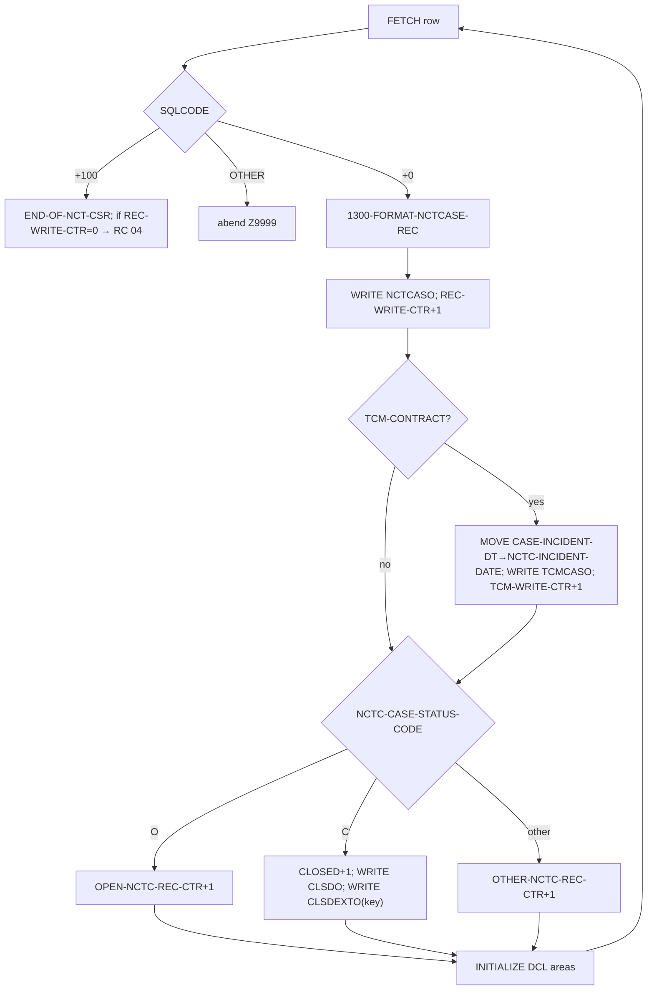
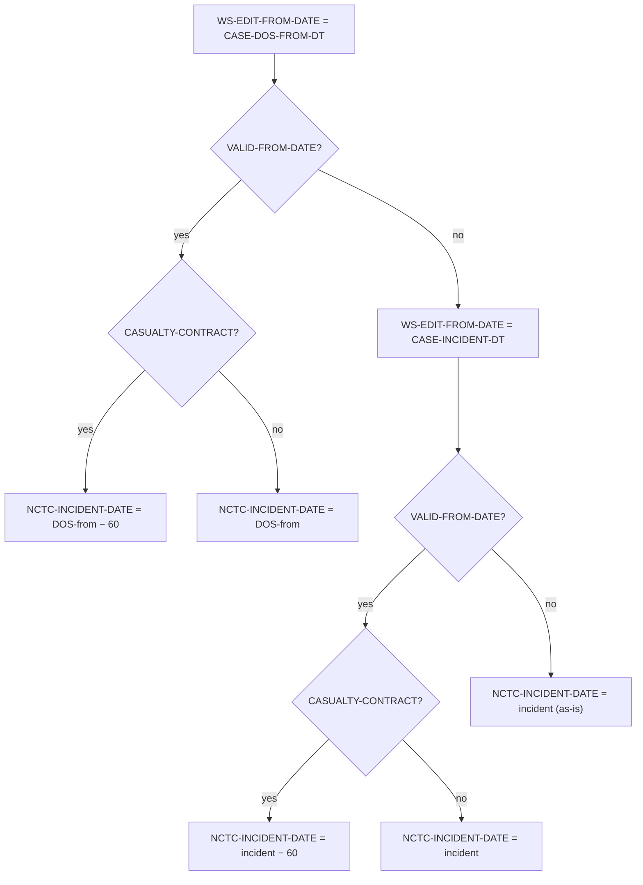
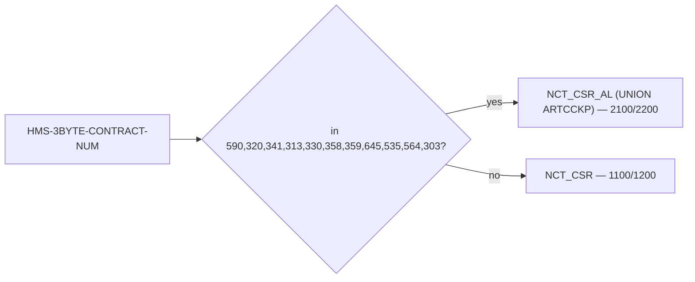

# CASNCTD1 — Illustration Document (Dummy-Data Scenarios)

> **All data in this document is invented (dummy).** It is used only to show how the **coded** logic of
> `CASNCTD1.txt` behaves. Every scenario cites the source lines that drive it. Field layouts come from
> `ARTCASE.txt`, `ARTINDVL.txt`, `ARTCCKP.txt`, and `NCTCASE.txt`. Business meanings of codes are **not proven**;
> where a label like "Alabama" is used it comes from the program's own modification comments and is only a label.

---

## 1. Illustration Scope

- **Illustrated:** contract resolution and routing, both cursor paths, status-based file distribution (open/closed/
  other), the TCM parallel file, the casualty 60-day incident-date logic (all branches), context-code shortening,
  the AL-cursor multi-MA `UNION`, the "no data → RC 04" outcome, DB2 open-contention retry, the OH-CareSource
  client remap, and the P-MONITOR update/insert branches.
- **How dummy data was created:** input rows are shown as the **host-variable values after `FETCH`** (i.e., the
  values the COBOL sees), because CASNCTD1 has no input file — its input is DB2. Values respect each column's
  `ARTCASE/ARTINDVL/ARTCCKP` type.
- **Source structures used:** `DCLARTCASE` (host `CASE-*`), `DCLARTINDV` (host `INDV-*`), `DCLARTCCKP` (host
  `CCKP-*`), and the `NCTC-*` output layout.
- **Could not be illustrated with real values:** exact DB2 SQLCODE results at run time, and the real content of
  `MISC.P_MONITOR` (its `PMONITOR` copybook is not in the repo). These are shown structurally only.

**Output record legend (from `NCTCASE.txt`, key positions used below):**

```
pos 1-6   NCTC-HMS-CLIENT-ID       (shortened context code)
pos 7-15  NCTC-HMS-CASE-KEY        (CASE-CASE-ID, 9 digits)
pos 16-35 NCTC-RECIPIENT-ID-NUM    (MA number)
pos 49    NCTC-CASE-STATUS-CODE    (O / C / other)
pos 240-249 NCTC-INCIDENT-DATE     (computed; original for TCM file)
pos 250-259 NCTC-CLAIMS-THRU-DATE  (CASE-DOS-TO-DT)
pos 356-367 NCTC-INDV-ID           (CASE-INDV-ID)
pos 368-372 NCTC-CLIENT-CD         (from CCKP-DATA-AMT / ALT-CLIENT-CD)
```

---

## 2. Scenario Catalog

| # | Scenario | Trigger | Coded at |
|---|---|---|---|
| S1 | Resolve contract, standard path | contract not in AL list | 501-510, 703-750 |
| S2 | Resolve contract, AL path | contract ∈ {590,320,341,313,330,358,359,645,535,564,303} | 639-701 |
| S3 | CASGETCC failure → abend 0999 | `CASGETCC-RETURN-CODE ≠ '0'` | 504-507 |
| S4 | Unknown contract → abend | `EVALUATE … WHEN OTHER` | 604-606 |
| S5 | Open case | `NCTC-CASE-STATUS-CODE = 'O'` | 677-678 / 726-727 |
| S6 | Closed case | `= 'C'` | 679-684 / 728-733 |
| S7 | Other status | any other value | 685-686 / 734-735 |
| S8 | TCM parallel write | `TCM-CONTRACT` true | 670-674 / 719-723 |
| S9 | Casualty date −60 (DOS-from valid) | `VALID-FROM-DATE` & `CASUALTY-CONTRACT` | 1069-1076 |
| S10 | Casualty date −60 (DOS-from invalid, incident valid) | fallback branch | 1080-1090 |
| S11 | Casualty date, both invalid | final fallback | 1094-1096 |
| S12 | Non-casualty date (no shift) | not `CASUALTY-CONTRACT` | 1077-1078 |
| S13 | Context-code shortening | contract 320/313/326/358/645/564 | 876-1047 |
| S14 | AL cursor multi-MA `UNION` | AL path; `ARTCCKP` rows with `CASLK_RF='MA_NUM'` | 412-469 |
| S15 | No matching rows → RC 04 | first fetch `+100`, `REC-WRITE-CTR=0` | 852-859 / 1260-1267 |
| S16 | Open contention then success | SQLCODE `-911` then `+0` | 791-800 |
| S17 | Open contention 5× → abend | `TIME-OUT-CTR >= 5` | 654-658 / 705-707 |
| S18 | OH CareSource remap | contract `535` → client `341` | 1185-1191 |
| S19 | P-MONITOR update, counts match | `SQLERRD(3) = WS-TOTAL-CONTEXT-CDS` | 1285-1309 |
| S20 | P-MONITOR update, counts differ → insert | `SQLERRD(3) ≠ WS-TOTAL-CONTEXT-CDS` | 1300-1305 |
| S21 | P-MONITOR row missing → insert 7 | UPDATE SQLCODE `+100` | 1310-1313 |

---

## 3. Dummy Data Examples

### S1 / S2 — Contract resolution & path selection

**S2 (AL path) — the actual JCL configuration (`PWTALCDS.txt`).**

- Trigger: job card accounting `600040` → `CASGETCC` `WHEN '600040' MOVE '590'` (`CASGETCC.txt` 202-203);
  `CASGETCC-RETURN-CODE = '0'`.
- `EVALUATE '590'` → `WS-CONTEXT-CD='CTSCASAL'`, `WS-CONTEXT-CD1='CTSESTAL'`, `WS-CONTEXT-CD2='CTSTRSAL'`, rest `ZZ…`
  (590-593).
- `590 ∈ AL list` (639) → **`NCT_CSR_AL`** path (654).

**S1 (standard path) — contract `319`.**

- `EVALUATE '319'` → `WS-CONTEXT-CD='CTSCASCT'`, CD1..6 = `ZZ…` (532-533).
- `319 ∉ AL list` → **`NCT_CSR`** path (703).

### S3 — CASGETCC failure → abend `0999`

```
CASGETCC-CALLING-AREA after CALL: HMS-3BYTE-CONTRACT-NUM="000"  CASGETCC-RETURN-CODE="9"
```
`IF CASGETCC-RETURN-CODE NOT = '0'` (504) → `MOVE +0999 TO DUMP-CODE`, `GO TO Z9999-ERROR-EXIT` → `ILBOABN0`
abend with 0999. No files receive records.

### S4 — Unknown contract → abend

```
HMS-3BYTE-CONTRACT-NUM = "777"   (resolved, return code '0', but not in EVALUATE)
```
`EVALUATE … WHEN OTHER` (604) → display `** ERR: UNKNOWN HMS-3BYTE-CONTRACT-NUM **`, abend (dump `3645`).

### S5 / S6 / S7 — Status routing (standard path, contract 319 = `CTSCASCT`)

Common dummy individual: `INDV-MA-NUM="CT0001234"`, `INDV-LAST-NM="DOE"`, `INDV-FIRST-NM="JANE"`,
`INDV-SSN-NUM="123456789"`, `INDV-DOB-DT="1980-05-01"`, `INDV-GENCD-RF-TEXT="F"`, `INDV-MARST-RF-TEXT="S"`.

| Case | `CASE-CASE-STATUS-CD-T` | Output effect |
|---|---|---|
| **S5** Open | `"O"` | write `NCTCASO`; `OPEN-NCTC-REC-CTR +1` |
| **S6** Closed | `"C"` | write `NCTCASO`; write `CLSDO`; write `CLSDEXTO` (9-byte key); `CLOSED-NCTC-REC-CTR +1` |
| **S7** Other | `"X"` | write `NCTCASO`; `OTHER-NCTC-REC-CTR +1` |

**S6 dummy — closed case:**
```
IN  (host after FETCH):
    CASE-CONTEXT-CD-T="CTSCASCT"  CASE-CASE-ID=000778899  CASE-CASE-STATUS-CD-T="C"
    CASE-DOS-TO-DT="2024-03-31"   CASE-INCIDENT-DT="2024-01-15" CASE-DOS-FROM-DT="2024-01-20"
    INDV-MA-NUM="CT0001234"

NCTCASO record (key positions):
    [1-6]=CTSCAS  [7-15]=000778899  [16-..]=CT0001234           [49]=C
    [250-259]=2024-03-31
CLSDO  record: identical 384-byte image
CLSDEXTO record (9 bytes): 000778899
Counters: REC-WRITE-CTR +1, CLOSED-NCTC-REC-CTR +1
```
(Driven by 679-684; `CLSD-EXTRACT-RECORD = NCTC-HMS-CASE-KEY`, 682-684.)

> `CTSCASCT` is in **both** `CASUALTY-CONTRACT` and `TCM-CONTRACT` (146, 153), so S6 also triggers S8; see next.

### S8 — TCM parallel write with original incident date (contract 319, `CTSCASCT`)

`CTSCASCT` satisfies `TCM-CONTRACT` (144-146). For the S6 record above, after the `NCTCASO` write:

```
IF TCM-CONTRACT (670) → MOVE CASE-INCIDENT-DT TO NCTC-INCIDENT-DATE (671)
                        WRITE TCMCASE-RECORD FROM WS-NCTCASE-RECORD (672)

NCTCASO [240-249] = <computed date>   (see S9: 2024-01-20 minus 60 = 2023-11-21)
TCMCASO [240-249] = 2024-01-15        (original CASE-INCIDENT-DT)
TCM-WRITE-CTR +1
```

Because the `MOVE` at 671 changes `WS-NCTCASE-RECORD` **before** the closed-file `EVALUATE`, the `CLSDO` copy for a
TCM+closed case carries the **original** incident date too (write order 667→671→681). *(Proven by statement order.)*

### S9 / S10 / S11 / S12 — Incident-date computation (mod 0015, 1064-1099)

`WS-CASUALTY-CODE = CASE-CONTEXT-CD` (1064). `CTSCASCT` ∈ `CASUALTY-CONTRACT` (153).

| # | `CASE-DOS-FROM-DT` | `CASE-INCIDENT-DT` | Casualty? | `NCTC-INCIDENT-DATE` on `NCTCASO` | Branch |
|---|---|---|---|---|---|
| S9 | `2024-01-20` (valid) | `2024-01-15` | yes | `2023-11-21` (DOS-from − 60) | 1069-1076 |
| S10 | `0001-01-01` (invalid) | `2024-01-15` (valid) | yes | `2023-11-16` (incident − 60) | 1080-1090 |
| S11 | `0001-01-01` (invalid) | `0001-01-01` (invalid) | yes | `0001-01-01` (incident as-is) | 1094-1096 |
| S12 | `2024-01-20` (valid) | `2024-01-15` | **no** (e.g. `CTSESTKY`) | `2024-01-20` (DOS-from, no shift) | 1077-1078 |

> "valid" = `WS-EDIT-FROM-DATE` within `'1800-01-01'..'2199-12-31'` (`VALID-FROM-DATE`, 140-141). The `−60 DAYS`
> is computed by DB2 `SET :WS-NEW-FROM-DATE = DATE(:WS-EDIT-FROM-DATE) - 60 DAYS` (1073-1076); the exact result
> dates above are illustrative arithmetic.

### S13 — Context-code shortening

| Contract | `CASE-CONTEXT-CD-T` (from DB2) | `WS-MOVE` after `EVALUATE` | `NCTC-HMS-CLIENT-ID` | Lines |
|---|---|---|---|---|
| 320 | `CTSCASEX-NY` | `CTSCEN` | `CTSCEN` | 880-881 |
| 320 | `CTSCASNYC` | `CTSCCN` | `CTSCCN` | 884-885 |
| 320 | `CTSESTNY` | `CTSECN` | `CTSECN` | 888-889 |
| 320 | `CTSCASNY` (default) | `CTSCAS` | `CTSCAS` | 904-905 |
| 313 | `CTSCASMT-FL` | `CTSMST` | `CTSMST` | 942-943 |
| 326 | `CTSCASCO-HCPF` | `CTSHCP` | `CTSHCP` | 967-968 |
| 645 | `CTSCASCH-WV` | `CTSCHP` | `CTSCHP` | 1022-1023 |
| 358 | `CTSTFRNV` | `CTSTFR` | `CTSTFR` | 997-998 |
| 564 | `CTSCASTN` | `CTSCAS` | `CTSCAS` | 1039-1040 |

For all other contracts, `NCTC-HMS-CLIENT-ID = CASE-CONTEXT-CD-T(1:6)` unchanged (868, 1048).

### S14 — AL cursor `UNION`: one case → multiple MA-number records (contract 590)

DB2 rows the AL cursor returns for a single case `000900001` (context `CTSCASAL`):

```
Leg 1 (ARTINDV):  MA_NUM="AL0009988"         (I.MA_NUM        → INDV-MA-NUM, col 29)
Leg 2 (ARTCCKP):  DATA_TXT="AL0007777"        (L.DATA_TXT      → INDV-MA-NUM, col 29)
                  CASLK_RF="MA_NUM"           (filter 468)
Both legs col 30 = I.CLIENT_CD="00590"        (→ CCKP-DATA-AMT, see note)
```

Result — **two** `NCTCASO` records for the same `CASE-CASE-ID=000900001`, differing only in
`NCTC-RECIPIENT-ID-NUM`:

```
rec 1: [7-15]=000900001  [16-35]=AL0009988...
rec 2: [7-15]=000900001  [16-35]=AL0007777...
```

`NCTC-CLIENT-CD` derivation (1129-1132): `CCKP-DATA-AMT → ALT-CLIENT-CD → ALT-CLIENT-CD-NUM(5:3) → NCTC-CLIENT-CD`.

> **Open question (from source):** col 30 is `I.CLIENT_CD` which is `CHAR(5)` (`ARTCASE/ARTINDVL`), fetched into
> `:CCKP-DATA-AMT` (`S9(7)V9(2) COMP-3`). If DB2 converts the numeric client string `"00590"` to the packed field,
> then `ALT-CLIENT-CD-NUM = 0000590`, `(5:3) = "590"`, so `NCTC-CLIENT-CD = "590"`. Whether the CHAR→decimal fetch
> converts or errors at run time is **not proven from source**.

### S15 — No matching rows → RC 04, empty files

First `FETCH` returns `SQLCODE +100` while `REC-WRITE-CTR = 0` (852-855 / 1260-1263):
```
DISPLAY 'WRN: NO MATCHING RECS FOUND IN DB2AR01 TABLES'
MOVE 04 TO WS-RETURN-CODE            → job step RC = 04
```
All four files are opened and closed with **zero** records; program ends normally (9000), not via abend.

### S16 / S17 — DB2 open contention

**S16 (recover):** `OPEN NCT_CSR` returns `-911`; `ADD 1 TO TIME-OUT-CTR` (now 1), `GO TO 1100-OPEN-EXIT` (797-800);
`PERFORM … UNTIL START-OF-NCT-CSR OR TIME-OUT-CTR >= 5` retries; next `OPEN` returns `+0` → `START-OF-NCT-CSR` →
processing continues.

**S17 (abort):** `OPEN` returns `-904` five consecutive times → `TIME-OUT-CTR = 5` → loop ends without start →
`IF TIME-OUT-CTR >= 5 GO TO Z9999-ERROR-EXIT` (656-658) → abend.

### S18 — OH CareSource (535) queried under client 341

```
HMS-3BYTE-CONTRACT-NUM = "535"   →  EVALUATE '535' → WS-CONTEXT-CD = "CTSCASOH"  (556-557)
2100-OPEN: IF '535' → MOVE '341' TO CASE-CLIENT-CD INDV-CLIENT-CD  (1185-1187)
```
So `NCT_CSR_AL` filters `A.CLIENT_CD = '341'` and `A.CONTEXT_CD = 'CTSCASOH'`.

### S19 / S20 / S21 — P-MONITOR (`8000` / `8100`)

Assume contract `590`, so active context codes = `{CTSCASAL, CTSESTAL, CTSTRSAL}` → `WS-TOTAL-CONTEXT-CDS = 3`
(618-633).

- **S19 (update, counts match):** `UPDATE … WHERE CLIENT_CD='590' AND PROCESS_NM LIKE 'CLKP_LOAD_DURATION_%'`
  returns `SQLCODE +0`, `SQLERRD(3)=3`. `3 = WS-TOTAL-CONTEXT-CDS` → no inserts → `COMMIT` (1300 false, 1307-1309).
- **S20 (update, counts differ → insert):** `SQLERRD(3)=2` (only 2 monitor rows existed). `2 ≠ 3` (1300) →
  `WS-WRITTEN-CONTEXT-CNT = 2`, `PERFORM 8100 … UNTIL = 7`. `8100` `WHEN 2` moves `CASE-CONTEXT-CD2-T` (`CTSTRSAL`)
  → `INSERT` `PROCESS_NM='CLKP_LOAD_DURATION_CTSTRSAL'` (1333-1335, 1373-1398). (`ZZ…` placeholders are skipped,
  1336-1338.)
- **S21 (row missing):** `UPDATE` returns `SQLCODE +100` → `MOVE 0 TO WS-WRITTEN-CONTEXT-CNT`,
  `PERFORM 8100 … 7 TIMES` (1310-1313). `8100` inserts `CLKP_LOAD_DURATION_CTSCASAL`, `…CTSESTAL`, `…CTSTRSAL`,
  then hits a `ZZ…` placeholder for CD3 and `GO TO 8100-PM-INS-EXIT` early on subsequent passes.

---

## 4. Before/After Illustrations

### 4.1 Standard closed casualty case (S6+S8+S9) — contract 319 `CTSCASCT`

**Before (DB2 host values after `FETCH NCT_CSR`):**
```
CASE-CONTEXT-CD-T = "CTSCASCT"
CASE-CASE-ID      = 000778899
CASE-INDV-ID      = 000000445566
CASE-DOS-FROM-DT  = "2024-01-20"
CASE-INCIDENT-DT  = "2024-01-15"
CASE-DOS-TO-DT    = "2024-03-31"
CASE-CASE-STATUS-CD-T = "C"
INDV-MA-NUM       = "CT0001234"
INDV-LAST-NM      = "DOE"     INDV-FIRST-NM = "JANE"  INDV-MI-NM = "A"
INDV-SSN-NUM      = "123456789"  INDV-DOB-DT = "1980-05-01"
INDV-GENCD-RF     = "F"       INDV-MARST-RF = "S"
```

**After (records produced):**
```
NCTCASO (384): [1-6]=CTSCAS [7-15]=000778899 [16-35]=CT0001234___________
               [49]=C  [78-102]=DOE...  [103-122]=JANE...  [123]=A [124]=F [144]=S
               [125-133]=123456789 [134-143]=1980-05-01
               [240-249]=2023-11-21  (DOS-from 2024-01-20 − 60)   [250-259]=2024-03-31
               [356-367]=000000445566 (NCTC-INDV-ID)
TCMCASO (384): same image EXCEPT [240-249]=2024-01-15 (original incident date)
CLSDO   (384): same image as written at that moment (incident date = original, see S8 note)
CLSDEXTO (9):  000778899
Counters: REC-WRITE-CTR+1, TCM-WRITE-CTR+1, CLOSED-NCTC-REC-CTR+1
```

### 4.2 AL multi-MA open case (S5+S14) — contract 590 `CTSCASAL`

**Before → After (two output records from one case):**
```
Case 000900001 / context CTSCASAL / status O
 ├─ ARTINDV MA_NUM  "AL0009988" → NCTCASO rec#1 [16-35]=AL0009988  [49]=O
 └─ ARTCCKP DATA_TXT "AL0007777" → NCTCASO rec#2 [16-35]=AL0007777  [49]=O
Both: [1-6]=CTSCAS  [7-15]=000900001
Because CTSCASAL is TCM-CONTRACT (149): each also written to TCMCASO.
OPEN-NCTC-REC-CTR += 2 ; REC-WRITE-CTR += 2 ; TCM-WRITE-CTR += 2
```

### 4.3 Rejected / skipped outcomes

| Outcome | What is written | Line |
|---|---|---|
| CASGETCC failure (S3) | nothing; abend 0999 | 506-507 |
| Unknown contract (S4) | nothing; abend 3645 | 604-606 |
| No rows (S15) | four empty files; RC 04 | 852-859 |
| 5× contention (S17) | nothing usable; abend | 656-658 |

---

## 5. Flow Diagrams

### 5.1 Per-record processing (both loops share this shape)



### 5.2 Incident-date decision tree (mod 0015)



### 5.3 Cursor routing



---

## 6. Coverage Check

| Coded branch | Illustrated? | Where |
|---|---|---|
| Standard cursor path | ✅ | S1, 4.1 |
| AL cursor path (`UNION`) | ✅ | S2, S14, 4.2 |
| CASGETCC failure abend | ✅ | S3 |
| Unknown-contract abend | ✅ | S4 |
| Status `O` / `C` / other | ✅ | S5 / S6 / S7 |
| Closed-extract 9-byte write | ✅ | S6, 4.1 |
| TCM parallel write + original incident date | ✅ | S8, 4.1 |
| Casualty date −60, all 4 branches | ✅ | S9-S12 |
| Context-code shortening (320/313/326/358/645/564) | ✅ | S13 |
| No-data → RC 04 | ✅ | S15 |
| Open contention recover / abort | ✅ | S16 / S17 |
| OH CareSource 535 → client 341 | ✅ | S18 |
| P-MONITOR update-match / update-insert / insert-7 | ✅ | S19 / S20 / S21 |
| `WHEN OTHER` context default in shortening `EVALUATE`s | ✅ (implicit) | S13 (default rows) |

**Branches intentionally not given a numeric-value illustration (and why):**

- **Exact DB2 SQLCODE values** (e.g., which of `-904/-911/-913` occurs) — determined by DB2 at run time, **not
  provable from source**; shown structurally in S16/S17.
- **`MISC.P_MONITOR` row images** — the `PMONITOR` copybook is not in the repo, so column values cannot be shown;
  only `PROCESS_NM` (built at 1373-1375) and the fixed `TASK='LOAD'`/`STATUS='RUNNING'` values are shown.
- **`DSNTIAR` message text** — produced by an external module (1439); content not provable from source.
- **Every individual contract mapping** (30+ `WHEN`s at 517-607) — representative contracts are illustrated; the
  full list is tabulated in `CASNCTD1.logic.md` §5.3.2.
