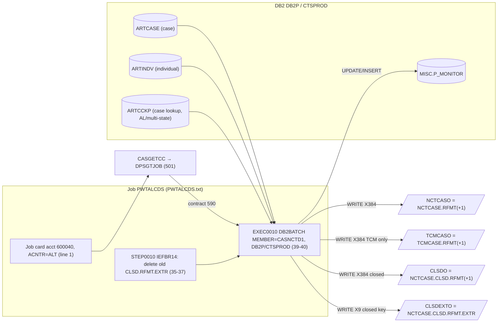

# CASNCTD1 — End-to-End Input/Output Mapping (with Business Examples)

> Strictly source-based. Line numbers refer to `CASNCTD1.txt` unless another file is named. Copybooks:
> `NCTCASE.txt`, `ARTCASE.txt`, `ARTINDVL.txt`, `ARTCCKP.txt`, `CASGETCC.txt`. JCL: `PWTALCDS.txt`.
> "Business" labels (state names, "casualty/estate/trust") come only from the program's modification comments and
> are labels, **not proven** semantics.

---

## 1. End-to-End Data Flow (proven)

`CASNCTD1` has **no input file**. Its input is **DB2**; its outputs are **four sequential files**. The effective
"control input" is the **job-card accounting code**, resolved to a contract by `CASGETCC`→`DPSGTJOB`.



**Job step chain (proven, `PWTALCDS.txt`):**

| Step | Program/Proc | Role | Key DDs / datasets |
|---|---|---|---|
| `STEP0010` | `IEFBR14` | delete prior closed-extract | `DD001` = `P.HMS.TPL.ALT.IW.NCTCASE.CLSD.RFMT.EXTR`, `DISP=(MOD,DELETE,DELETE)` (36-37) |
| `EXEC0010` | `DB2BATCH MEMBER=CASNCTD1` | **this program** | `NCTCASO`,`TCMCASO`,`CLSDO`,`CLSDEXTO` (43-58) |
| `EXEC0020` | `DB2BATCH MEMBER=CASNCTC0` | sibling (reads `PCFCASE`, not these files) | `SRCPCFO` (65-74) |
| `EXEC0030` | `SORT` | sorts the `CUM70` file from `EXEC0020` | `SORTIN`→`SORTOUT`, `SYSIN=…CARD.CNTL(WALCDS01)` (80-88) |

**Runtime binding (proven, `PWTALCDS.txt`):** `SYSTEM=DB2P`, `DATABASE=CTSPROD`, DB2 member/plan `CASNCTD1`
(39-40); `JOBLIB=P.HMSY.LINKLIB` (26); symbolics `LPOND=P`, `DIPOND=P`, `DOPOND=P`, `ACNTR=ALT` (28-31);
accounting `600040` → contract `590` (`CASGETCC.txt` 202-203).

---

## 2. Input (DB2) → Working-Storage → Output map

### 2.1 The two cursors (selection = context list + client; proven)

**`NCT_CSR` (standard, 304-356)** joins `ARTCASE A` + `ARTINDV I`:
```sql
SELECT A.CONTEXT_CD, A.CASE_ID, A.INDV_ID, VALUE(A.USER_CD,' '), …,
       I.MA_NUM, I.SSN_NUM, I.LAST_NM, I.FIRST_NM, I.MI_NM, CHAR(I.DOB_DT), I.GENCD_RF, I.MARST_RF
FROM   ARTCASE A, ARTINDV I
WHERE (A.CONTEXT_CD = :CASE-CONTEXT-CD OR …CD1..CD6)          -- up to 7 codes (344-350)
  AND  A.CLIENT_CD = :CASE-CLIENT-CD                          -- (351)
  AND  A.INDV_ID   = I.INDV_ID  AND  I.CLIENT_CD = :INDV-CLIENT-CD  AND  A.CLIENT_CD = I.CLIENT_CD
FOR READ ONLY                                                  -- (352-355)
```

**`NCT_CSR_AL` (AL/multi-state, 360-470)** = the same first leg **plus** `I.CLIENT_CD` (col 30), **`UNION`**ed with a
second leg that swaps `I.MA_NUM` for `L.DATA_TXT` and adds `ARTCCKP L` (`L.CONTEXT_CD=A.CONTEXT_CD AND
L.CASE_ID=A.CASE_ID AND L.CASLK_RF='MA_NUM'`, 466-468). This is how one case yields **one record per MA number**.

- **No status / amount / date / type predicate** in either cursor → all matching cases returned; distribution is
  decided later in COBOL. **(Proven by absence.)**

### 2.2 FETCH column → host field → output byte chain

Column order is identical for the shared columns; the AL cursor inserts **`I.CLIENT_CD`** at position 30.

| Col | `NCT_CSR` source | `NCT_CSR_AL` source | Host variable | → `NCTC-*` output (bytes) |
|---:|---|---|---|---|
| 1 | `A.CONTEXT_CD` | same | `CASE-CONTEXT-CD` | shortened → `NCTC-HMS-CLIENT-ID` (1-6) |
| 2 | `A.CASE_ID` | same | `CASE-CASE-ID` | `NCTC-HMS-CASE-KEY` (7-15); `CLSD-EXTRACT-RECORD` (9) |
| 3 | `A.INDV_ID` | same | `CASE-INDV-ID` | `NCTC-INDV-ID` (356-367) |
| 4 | `A.USER_CD` | same | `CASE-USER-CD` | `NCTC-CASE-WORKER-IPKEY` (314-319) |
| 5 | `A.COUNTY_CD` | same | `CASE-COUNTY-CD` | `NCTC-COUNTY-CODE` (320-329) |
| 6 | `A.WEL_NUMBER_CD` | same | `CASE-WEL-NUMBER-CD` | `NCTC-WEL-NUM` (283-288) |
| 7 | `A.DOS_FROM_DT` | same | `CASE-DOS-FROM-DT` | drives incident-date calc (→ 240-249) |
| 8 | `A.DOS_TO_DT` | same | `CASE-DOS-TO-DT` | `NCTC-CLAIMS-THRU-DATE` (250-259) |
| 9 | `A.INCIDENT_DT` | same | `CASE-INCIDENT-DT` | incident calc / TCM override (240-249) |
| 10 | `A.CASE_OPEN_DT` | same | `CASE-CASE-OPEN-DT` | `NCTC-CASE-OPEN-DATE` (58-67) |
| 11 | `A.CASE_CLOSE_DT` | same | `CASE-CASE-CLOSE-DT` | `NCTC-CASE-CLOSE-DATE` (68-77) |
| 12 | `A.CASE_TYPE_CD` | same | `CASE-CASE-TYPE-CD` | `NCTC-CASE-TYPE-CODE` (45-48) |
| 13 | `A.CASE_STATUS_CD` | same | `CASE-CASE-STATUS-CD` | `NCTC-CASE-STATUS-CODE` (49) — **routing key** |
| 14 | `A.CASE_PRIORITY_CD` | same | `CASE-CASE-PRIORITY-CD` | `NCTC-CASE-PRIORITY-CODE` (54-57) |
| 15 | `A.CASE_STAGE_CD` | same | `CASE-CASE-STAGE-CD` | `NCTC-CASE-STAGE-CODE` (50-53) |
| 16 | `A.CASE_SOURCE_CD` | same | `CASE-CASE-SOURCE-CD` | `NCTC-CASE-SOURCE-CODE` (36-44) |
| 17 | `A.COMPROMISE_AMT` | same | `CASE-COMPROMISE-AMT` | `NCTC-COMPROMISE-AMT` (175-189) |
| 18 | `A.EXPENSES_AMT` | same | `CASE-EXPENSES-AMT` | `NCTC-EXPENSES-AMT` (160-174) |
| 19 | `A.FEE_ADJUST_AMT` | same | `CASE-FEE-ADJUST-AMT` | `NCTC-FEE-ADJUST-AMT` (268-282) |
| 20 | `A.LIEN_ADJUST_AMT` | same | `CASE-LIEN-ADJUST-AMT` | `NCTC-LIEN-ADJUST-AMT` (205-219) |
| 21 | `A.LIEN_HMO_AMT` | same | `CASE-LIEN-HMO-AMT` | `NCTC-LIEN-HMO-AMT` (299-313) |
| 22 | `A.LIEN_MEDICAID_AMT` | same | `CASE-LIEN-MEDICAID-AMT` | `NCTC-LIEN-MEDICAID-AMT` (190-204) |
| 23 | `A.LIEN_NOTICE_DT` | same | `CASE-LIEN-NOTICE-DT` | `NCTC-LIEN-NOTICE-DATE` (220-229) |
| 24 | `A.LIEN_RELEASE_DT` | same | `CASE-LIEN-RELEASE-DT` | `NCTC-LIEN-RELEASE-DATE` (230-239) |
| 25 | `A.LIKELY_SETTLE_DT` | same | `CASE-LIKELY-SETTLE-DT` | `NCTC-LIKELY-SETTLE-DATE` (289-298) |
| 26 | `A.SETTLEMENT_AMT` | same | `CASE-SETTLEMENT-AMT` | `NCTC-SETTLEMENT-AMT` (145-159) |
| 27 | `A.ATTORNEY_FEE_PCT` | same | `CASE-ATTORNEY-FEE-PCT` | `NCTC-ATTOR-FEE-PCT` (263-267) |
| 28 | `A.LAST_UPDATE_DTM` | same | `CASE-LAST-UPDATE-DTM` | `NCTC-LAST-UPDATE-TMS` (330-355) |
| 29 | `I.MA_NUM` | **`L.DATA_TXT`** (leg 2) / `I.MA_NUM` (leg 1) | `INDV-MA-NUM` | `NCTC-RECIPIENT-ID-NUM` (16-35) |
| 30 | *(absent)* | **`I.CLIENT_CD`** | `CCKP-DATA-AMT` | → `ALT-CLIENT-CD(5:3)` → `NCTC-CLIENT-CD` (368-372) |
| 31 | `I.SSN_NUM` | same | `INDV-SSN-NUM` | `NCTC-SSN` (125-133) |
| 32 | `I.LAST_NM` | same | `INDV-LAST-NM` | `NCTC-LAST-NAME` (78-102) |
| 33 | `I.FIRST_NM` | same | `INDV-FIRST-NM` | `NCTC-FIRST-NAME` (103-122) |
| 34 | `I.MI_NM` | same | `INDV-MI-NM` | `NCTC-MIDDLE-INIT` (123) |
| 35 | `I.DOB_DT` | same | `INDV-DOB-DT` | `NCTC-DATE-OF-BIRTH` (134-143) |
| 36 | `I.GENCD_RF` | same | `INDV-GENCD-RF` | `NCTC-SEX` (124, first char) |
| 37 | `I.MARST_RF` | same | `INDV-MARST-RF` | `NCTC-MARITAL-STATUS` (144, first char) |

> **Col-30 caveat (Open question):** `I.CLIENT_CD` is `CHAR(5)`; the host variable `CCKP-DATA-AMT` is
> `S9(7)V9(2) COMP-3`. The CHAR→packed-decimal fetch behavior is **not proven from source** (see `CASNCTD1.logic.md`
> §8.3). On the **standard path** the column is never fetched, so `CCKP-DATA-AMT` stays `0` (re-initialized each
> loop, 635-637/737) and `NCTC-CLIENT-CD` resolves to `"000"`.

### 2.3 Contract → context-code derivation (proven, 517-607)

`CASGETCC` returns `HMS-3BYTE-CONTRACT-NUM`; the master `EVALUATE` assigns 1-7 context codes; those codes become
the cursor's `CONTEXT_CD` predicate **and** (after 6-char shortening) the output key `NCTC-HMS-CLIENT-ID`. Cursor
choice is by the AL list at 639-642.

| Contract | Context code(s) | Cursor | Client key used |
|---|---|---|---|
| 319 | `CTSCASCT` | `NCT_CSR` | `319` |
| 326 | `CTSCASCO`,`CTSESTCO`,`CTSCASCO-HCPF` | `NCT_CSR` | `326` |
| 590 | `CTSCASAL`,`CTSESTAL`,`CTSTRSAL` | `NCT_CSR_AL` | `590` |
| 320 | 7 NY codes (534-541) | `NCT_CSR_AL` | `320` |
| 535 | `CTSCASOH` | `NCT_CSR_AL` | **`341`** (1185-1187) |

---

## 3. Output Record Layout (as written) — `NCTCASE.txt`, 384 bytes

| Bytes | Field | Source (host / literal) |
|---|---|---|
| 1-6 | `NCTC-HMS-CLIENT-ID` | shortened context code (`WS-MOVE(1:6)`, 1048) |
| 7-15 | `NCTC-HMS-CASE-KEY` | `CASE-CASE-ID` (1050) |
| 16-35 | `NCTC-RECIPIENT-ID-NUM` | `INDV-MA-NUM-TEXT` (1127) |
| 36-44 | `NCTC-CASE-SOURCE-CODE` | `CASE-CASE-SOURCE-CD` (1112) |
| 45-48 | `NCTC-CASE-TYPE-CODE` | `CASE-CASE-TYPE-CD` (1102) |
| 49 | `NCTC-CASE-STATUS-CODE` | `CASE-CASE-STATUS-CD`(1:1) (1104) |
| 50-53 | `NCTC-CASE-STAGE-CODE` | `CASE-CASE-STAGE-CD` (1110) |
| 54-57 | `NCTC-CASE-PRIORITY-CODE` | `CASE-CASE-PRIORITY-CD` (1107) |
| 58-67 | `NCTC-CASE-OPEN-DATE` | `CASE-CASE-OPEN-DT` (1100) |
| 68-77 | `NCTC-CASE-CLOSE-DATE` | `CASE-CASE-CLOSE-DT` (1101) |
| 78-102 | `NCTC-LAST-NAME` | `INDV-LAST-NM` (1134) |
| 103-122 | `NCTC-FIRST-NAME` | `INDV-FIRST-NM` (1135) |
| 123 | `NCTC-MIDDLE-INIT` | `INDV-MI-NM` (1136) |
| 124 | `NCTC-SEX` | `INDV-GENCD-RF`(1:1) (1138) |
| 125-133 | `NCTC-SSN` | `INDV-SSN-NUM` (1133) |
| 134-143 | `NCTC-DATE-OF-BIRTH` | `INDV-DOB-DT` (1137) |
| 144 | `NCTC-MARITAL-STATUS` | `INDV-MARST-RF`(1:1) (1140) |
| 145-159 | `NCTC-SETTLEMENT-AMT` | `CASE-SETTLEMENT-AMT` (1124) |
| 160-174 | `NCTC-EXPENSES-AMT` | `CASE-EXPENSES-AMT` (1116) |
| 175-189 | `NCTC-COMPROMISE-AMT` | `CASE-COMPROMISE-AMT` (1115) |
| 190-204 | `NCTC-LIEN-MEDICAID-AMT` | `CASE-LIEN-MEDICAID-AMT` (1120) |
| 205-219 | `NCTC-LIEN-ADJUST-AMT` | `CASE-LIEN-ADJUST-AMT` (1118) |
| 220-229 | `NCTC-LIEN-NOTICE-DATE` | `CASE-LIEN-NOTICE-DT` (1121) |
| 230-239 | `NCTC-LIEN-RELEASE-DATE` | `CASE-LIEN-RELEASE-DT` (1122) |
| 240-249 | `NCTC-INCIDENT-DATE` | computed `WS-NEW-FROM-DATE` (1099) / original for TCM (671) |
| 250-259 | `NCTC-CLAIMS-THRU-DATE` | `CASE-DOS-TO-DT` (1062) |
| 260-262 | `NCTC-REGISTERED-IND`, `-ALL-CLAIMS-IND`, `-THERAPY-IND` | `SPACES` (1142) |
| 263-267 | `NCTC-ATTOR-FEE-PCT` | `CASE-ATTORNEY-FEE-PCT` (1125) |
| 268-282 | `NCTC-FEE-ADJUST-AMT` | `CASE-FEE-ADJUST-AMT` (1117) |
| 283-288 | `NCTC-WEL-NUM` | `CASE-WEL-NUMBER-CD` (1060) |
| 289-298 | `NCTC-LIKELY-SETTLE-DATE` | `CASE-LIKELY-SETTLE-DT` (1123) |
| 299-313 | `NCTC-LIEN-HMO-AMT` | `CASE-LIEN-HMO-AMT` (1119) |
| 314-319 | `NCTC-CASE-WORKER-IPKEY` | `CASE-USER-CD` (1054) |
| 320-329 | `NCTC-COUNTY-CODE` | `CASE-COUNTY-CD` (1058) |
| 330-355 | `NCTC-LAST-UPDATE-TMS` | `CASE-LAST-UPDATE-DTM` (1126) |
| 356-367 | `NCTC-INDV-ID` | `CASE-INDV-ID` (1052) |
| 368-372 | `NCTC-CLIENT-CD` | `ALT-CLIENT-CD` chain (1129-1132) |
| 373-384 | `NCTC-FILLER-2` | `SPACES` (1149) |

**Output file targeting per record (proven, 667-687 / 716-736):**

| File (DD) | LRECL | Which records |
|---|---|---|
| `NCTCASO` | 384 | **every** formatted record |
| `TCMCASO` | 384 | only when context ∈ `TCM-CONTRACT` (`CTSCASCT`,`CTSCASNV`,`CTSCASAL`); incident date = original |
| `CLSDO` | 384 | only when `NCTC-CASE-STATUS-CODE = 'C'` |
| `CLSDEXTO` | 9 | only when `= 'C'`; content = `NCTC-HMS-CASE-KEY` (9 digits) |

---

## 4. Business Examples (end-to-end)

> Codes' business meaning is **not proven**; state labels come from `CASNCTD1.txt` modification comments (e.g.,
> "AL" 36-37, "NY" 40, "WV" 41). Values are dummy.

### Example A — Alabama run (the actual JCL configuration) → records written

1. Job card `//PWTALCDS JOB (600040,ALT)…` — accounting `600040` (`PWTALCDS.txt` 1).
2. `CASGETCC` `WHEN '600040' MOVE '590'` (`CASGETCC.txt` 202-203) → `HMS-3BYTE-CONTRACT-NUM='590'`,
   `CASGETCC-RETURN-CODE='0'`.
3. `EVALUATE '590'` → context `CTSCASAL/CTSESTAL/CTSTRSAL`; `590 ∈ AL list` → `NCT_CSR_AL` (590-593, 639).
4. Cursor returns each case's `MA_NUM` (leg 1) and each `ARTCCKP` `MA_NUM` lookup (leg 2).

**Dummy matched case → output:**
```
IN : CONTEXT_CD=CTSCASAL  CASE_ID=900001  INDV_ID=445566  STATUS=O
     DOS_FROM=2024-02-10  INCIDENT=2024-02-01  DOS_TO=2024-04-30  MA_NUM=AL0009988  CLIENT_CD=00590
OUT NCTCASO: [1-6]=CTSCAS [7-15]=000900001 [16-35]=AL0009988 [49]=O [240-249]=2023-12-12 (DOS_FROM−60)
             [250-259]=2024-04-30 [356-367]=000000445566 [368-372]=590
OUT TCMCASO: same, EXCEPT [240-249]=2024-02-01 (original incident; CTSCASAL is TCM-CONTRACT)
Counters: REC-WRITE-CTR+1, TCM-WRITE-CTR+1, OPEN-NCTC-REC-CTR+1
```
Written to `P.HMS.TPL.ALT.IR.NCTCASE.RFMT(+1)` and `…TCMCASE.RFMT(+1)`.

### Example B — Closed New York casualty (contract 320) → NCTCASO + CLSDO + CLSDEXTO

1. Contract `320` (hypothetical accounting code; `CASGETCC.txt` 134-135 shows `'601361'→'320'`).
2. `EVALUATE '320'` sets 7 NY context codes (534-541); `320 ∈ AL list` → `NCT_CSR_AL`.
3. A returned case with `CONTEXT_CD=CTSCASEX-NY`, `STATUS='C'`:
```
1300 shortening: CTSCASEX-NY → CTSCEN  (880-881)  → NCTC-HMS-CLIENT-ID = CTSCEN
IN : CASE_ID=810100 STATUS=C DOS_TO=2024-05-31
OUT NCTCASO: [1-6]=CTSCEN [7-15]=000810100 [49]=C
OUT CLSDO  : same 384-byte image
OUT CLSDEXTO (9): 000810100
Counters: REC-WRITE-CTR+1, CLOSED-NCTC-REC-CTR+1
```
(`CTSCASEX-NY` is **not** a `TCM-CONTRACT`, so no `TCMCASO` write.)

### Example C — Unknown contract → abend

Accounting code maps (or defaults) to a contract not in the `EVALUATE`, e.g. `HMS-3BYTE-CONTRACT-NUM='000'`
(`CASGETCC` `WHEN OTHER MOVE '000'`, `CASGETCC.txt` 224-225). `EVALUATE … WHEN OTHER` (604) →
`GO TO Z9999-ERROR-EXIT` → `ILBOABN0` abend (dump `3645`). No output records.

### Example D — No claims match → empty generation, RC 04

Contract resolves fine, but the first `FETCH` returns `+100` with `REC-WRITE-CTR=0` (852-859 / 1260-1267):
```
DISPLAY 'WRN: NO MATCHING RECS FOUND …'  ;  MOVE 04 TO WS-RETURN-CODE
```
All four generations are created empty; step ends with **RC 04** (not an abend).

### Example E — CASGETCC failure → abend `0999`

`CALL CASGETCC` returns `CASGETCC-RETURN-CODE='9'` → `MOVE +0999 TO DUMP-CODE`, `GO TO Z9999-ERROR-EXIT`
(504-507) → abend `0999`. No output records.

### Example F — OH CareSource (535) queried under client 341

`EVALUATE '535' MOVE 'CTSCASOH'` (556-557); in `2100`, `IF '535' MOVE '341' TO CASE-CLIENT-CD INDV-CLIENT-CD`
(1185-1187). So DB2 is filtered `CLIENT_CD='341' AND CONTEXT_CD='CTSCASOH'`, but the run is driven by contract 535.

---

## 5. Transformation Reference (quick table)

| Transformation | Rule | Lines |
|---|---|---|
| Context → 6-char output key | contract-specific `EVALUATE WS-MOVE`; else first 6 chars | 876-1048 |
| Incident date | casualty → date − 60 (DOS-from, else incident); non-casualty → unshifted; invalid → incident as-is | 1064-1099 |
| TCM incident date | overwrite with original `CASE-INCIDENT-DT` before `TCMCASO` write | 671 / 720 |
| Sex | `INDV-GENCD-RF`(1:1) | 1138-1139 |
| Marital status | `INDV-MARST-RF`(1:1) | 1140-1141 |
| Client code | `CCKP-DATA-AMT` → `ALT-CLIENT-CD-NUM(5:3)` → `NCTC-CLIENT-CD` | 1129-1132 |
| Closed-key extract | `NCTC-HMS-CASE-KEY` (9 digits) → `CLSD-EXTRACT-RECORD` | 682-684 / 731-733 |
| Fixed truncations | type(1:4), status(1:1), priority(1:4), stage(1:4), source(1:9), county(1:10), wel(1:6), worker(1:6) | 1054-1114 |

**Status → file/counter distribution (proven):**

| `NCTC-CASE-STATUS-CODE` | NCTCASO | TCMCASO* | CLSDO | CLSDEXTO | Counter |
|---|---|---|---|---|---|
| `O` | ✅ | ✅ if TCM | — | — | `OPEN-NCTC-REC-CTR` |
| `C` | ✅ | ✅ if TCM | ✅ | ✅ | `CLOSED-NCTC-REC-CTR` |
| other | ✅ | ✅ if TCM | — | — | `OTHER-NCTC-REC-CTR` |

\* TCM = context ∈ {`CTSCASCT`,`CTSCASNV`,`CTSCASAL`} (144-150).

---

## 6. Proven vs Inferred (mapping-specific)

**Proven**

- File DDs, LRECLs, datasets, and step order (`PWTALCDS.txt` 35-88; `CASNCTD1.txt` 91-124).
- Full column→host→byte chain for both cursors (§2.2; 304-470, 811-848, 1218-1256, 867-1151).
- Status/TCM/closed distribution and counters (667-687 / 716-736, 1413-1435).
- Contract→context→client-key derivation incl. the `535`→`341` remap (517-607, 1185-1191).
- Accounting `600040`→`590` for the shipped JCL (`CASGETCC.txt` 202-203; `PWTALCDS.txt` 1).

**Inferred**

- Business labels (state/casualty/estate/trust) — from modification comments only.
- Intent of `NCTC-CLIENT-CD` = 3-digit client code — from the `(5:3)` substring and `ALT-CLIENT-CD` naming.
- `ARTINDV` ↔ DCLGEN `IND.ARTINDV_L2` synonym relationship (`ARTINDVL.txt` 12/76).

**Not proven / Open questions**

- Runtime result of fetching `CHAR(5) I.CLIENT_CD` into packed `CCKP-DATA-AMT` (col 30).
- Downstream consumers of `NCTCASE.RFMT`, `TCMCASE.RFMT`, `NCTCASE.CLSD.RFMT` (no consuming job in repo).
- Contents/layout of `MISC.P_MONITOR` (copybook `PMONITOR` not in repo).
- Whether every contract in `CASNCTD1`'s `EVALUATE` can actually be produced by `CASGETCC` (the two lists differ).
