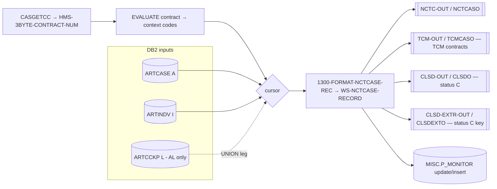

# CASNCTD1 — End-to-End Input / Output Mapping

> Strictly source-based I/O mapping for `CASNCTD1.txt`, with business examples.
> Line numbers refer to `CASNCTD1.txt`; output positions refer to the `NCTCASE` copybook (prefix
> `NCTC`, total 384 bytes). Items that depend on copybooks **not in the repository** (`ARTCASE`,
> `ARTINDVL`, `ARTCCKP`, `PMONITOR` DCLGENs) are flagged **inferred** / **not proven**.

---

# 1. Scope

`CASNCTD1` reads casualty **case** + **individual** data from DB2 and produces up to four sequential
output files per row. This document traces **each DB2 column → COBOL host variable → output field
(byte position) → transformation**, then gives full end-to-end **business examples**.

---

# 2. End-to-End Data Flow



---

# 3. Input Inventory

## 3.1 Control / run inputs
| Input | Source | Used for |
|---|---|---|
| `HMS-3BYTE-CONTRACT-NUM` (X03) | returned by `CASGETCC` (call line 501) | selects context codes + cursor + DB2 client filter |
| `CASGETCC-RETURN-CODE` (X01) | returned by `CASGETCC` | `'0'` = ok; else abend 0999 |

## 3.2 DB2 input columns (from the cursor `SELECT` lists)
`ARTCASE A` columns (all wrapped in `VALUE(...,default)` in SQL so nulls become space/zero):
`CONTEXT_CD, CASE_ID, INDV_ID, USER_CD, COUNTY_CD, WEL_NUMBER_CD, DOS_FROM_DT, DOS_TO_DT,
INCIDENT_DT, CASE_OPEN_DT, CASE_CLOSE_DT, CASE_TYPE_CD, CASE_STATUS_CD, CASE_PRIORITY_CD,
CASE_STAGE_CD, CASE_SOURCE_CD, COMPROMISE_AMT, EXPENSES_AMT, FEE_ADJUST_AMT, LIEN_ADJUST_AMT,
LIEN_HMO_AMT, LIEN_MEDICAID_AMT, LIEN_NOTICE_DT, LIEN_RELEASE_DT, LIKELY_SETTLE_DT, SETTLEMENT_AMT,
ATTORNEY_FEE_PCT, LAST_UPDATE_DTM`.
`ARTINDV I` columns: `MA_NUM, (CLIENT_CD – AL cursor only), SSN_NUM, LAST_NM, FIRST_NM, MI_NM, DOB_DT,
GENCD_RF, MARST_RF`.
`ARTCCKP L` (AL cursor UNION leg only): `DATA_TXT` (mapped into the MA-number position),
filtered `CASLK_RF = 'MA_NUM'`.

**Join / filter keys (proven):** `A.INDV_ID = I.INDV_ID`, `A.CLIENT_CD = I.CLIENT_CD`,
`A.CLIENT_CD = :CASE-CLIENT-CD`, `I.CLIENT_CD = :INDV-CLIENT-CD`, `A.CONTEXT_CD IN (:CD..:CD6)`;
AL UNION adds `L.CONTEXT_CD = A.CONTEXT_CD AND L.CASE_ID = A.CASE_ID AND L.CASLK_RF = 'MA_NUM'`.

---

# 4. Output Inventory

| File | DDNAME | Record | Len | When written | Counter |
|---|---|---|---|---|---|
| `NCTC-OUT` | `NCTCASO` | `NCTCASE-RECORD` | 384 | every fetched row | `REC-WRITE-CTR` |
| `TCM-OUT` | `TCMCASO` | `TCMCASE-RECORD` | 384 | `TCM-CONTRACT` true | `TCM-WRITE-CTR` |
| `CLSD-OUT` | `CLSDO` | `CLOSED-RECORD` | 384 | status `'C'` | `CLOSED-NCTC-REC-CTR` |
| `CLSD-EXTR-OUT` | `CLSDEXTO` | `CLSD-EXTRACT-RECORD` | 9 | status `'C'` | (same rows) |

`TCM-OUT`, `CLSD-OUT` are the **same 384-byte `WS-NCTCASE-RECORD` image** as `NCTC-OUT` at the moment
of their write (see §7 for the incident-date difference). `CLSD-EXTR-OUT` is just the 9-digit case key.

---

# 5. Field-Level Mapping — `NCTC-OUT` (main record)

Legend for **Transform**: *direct* = plain `MOVE`; *trunc(n)* = moved via `WS-MOVE` then first *n*
bytes taken; *calc* = computed; *const* = literal/space.

| DB2 column (alias) | Host variable | → Output field | Pos | Transform | Source line |
|---|---|---|---|---|---|
| `A.CONTEXT_CD` | `CASE-CONTEXT-CD` | `NCTC-HMS-CLIENT-ID` | 1–6 | shorten context → `WS-MOVE(1:6)` | 868–1048 |
| `A.CASE_ID` | `CASE-CASE-ID` | `NCTC-HMS-CASE-KEY` | 7–15 | direct | 1050 |
| `A.INDV_ID` | `CASE-INDV-ID` | `NCTC-INDV-ID` (redefine) | 356–367 | direct | 1052 |
| `A.USER_CD` | `CASE-USER-CD` | `NCTC-CASE-WORKER-IPKEY` | 314–319 | trunc(6) | 1054–1055 |
| `A.COUNTY_CD` | `CASE-COUNTY-CD` | `NCTC-COUNTY-CODE` | 320–329 | trunc(10) | 1058–1059 |
| `A.WEL_NUMBER_CD` | `CASE-WEL-NUMBER-CD` | `NCTC-WEL-NUM` | 283–288 | trunc(6) | 1060–1061 |
| `A.DOS_FROM_DT` | `CASE-DOS-FROM-DT` | `NCTC-INCIDENT-DATE` | 240–249 | **calc** (§7) | 1064–1099 |
| `A.DOS_TO_DT` | `CASE-DOS-TO-DT` | `NCTC-CLAIMS-THRU-DATE` | 250–259 | direct | 1062 |
| `A.INCIDENT_DT` | `CASE-INCIDENT-DT` | `NCTC-INCIDENT-DATE` (fallback) + TCM | 240–249 | **calc**/direct | 1081–1095 / 671 |
| `A.CASE_OPEN_DT` | `CASE-CASE-OPEN-DT` | `NCTC-CASE-OPEN-DATE` | 58–67 | direct | 1100 |
| `A.CASE_CLOSE_DT` | `CASE-CASE-CLOSE-DT` | `NCTC-CASE-CLOSE-DATE` | 68–77 | direct | 1101 |
| `A.CASE_TYPE_CD` | `CASE-CASE-TYPE-CD` | `NCTC-CASE-TYPE-CODE` | 45–48 | trunc(4) | 1102–1103 |
| `A.CASE_STATUS_CD` | `CASE-CASE-STATUS-CD` | `NCTC-CASE-STATUS-CODE` | 49 | trunc(1) — **routing key** | 1104–1106 |
| `A.CASE_PRIORITY_CD` | `CASE-CASE-PRIORITY-CD` | `NCTC-CASE-PRIORITY-CODE` | 54–57 | trunc(4) | 1107–1109 |
| `A.CASE_STAGE_CD` | `CASE-CASE-STAGE-CD` | `NCTC-CASE-STAGE-CODE` | 50–53 | trunc(4) | 1110–1111 |
| `A.CASE_SOURCE_CD` | `CASE-CASE-SOURCE-CD` | `NCTC-CASE-SOURCE-CODE` | 36–44 | trunc(9) | 1112–1114 |
| `A.COMPROMISE_AMT` | `CASE-COMPROMISE-AMT` | `NCTC-COMPROMISE-AMT` | 175–189 | direct | 1115 |
| `A.EXPENSES_AMT` | `CASE-EXPENSES-AMT` | `NCTC-EXPENSES-AMT` | 160–174 | direct | 1116 |
| `A.FEE_ADJUST_AMT` | `CASE-FEE-ADJUST-AMT` | `NCTC-FEE-ADJUST-AMT` | 268–282 | direct | 1117 |
| `A.LIEN_ADJUST_AMT` | `CASE-LIEN-ADJUST-AMT` | `NCTC-LIEN-ADJUST-AMT` | 205–219 | direct | 1118 |
| `A.LIEN_HMO_AMT` | `CASE-LIEN-HMO-AMT` | `NCTC-LIEN-HMO-AMT` | 299–313 | direct | 1119 |
| `A.LIEN_MEDICAID_AMT` | `CASE-LIEN-MEDICAID-AMT` | `NCTC-LIEN-MEDICAID-AMT` | 190–204 | direct | 1120 |
| `A.LIEN_NOTICE_DT` | `CASE-LIEN-NOTICE-DT` | `NCTC-LIEN-NOTICE-DATE` | 220–229 | direct | 1121 |
| `A.LIEN_RELEASE_DT` | `CASE-LIEN-RELEASE-DT` | `NCTC-LIEN-RELEASE-DATE` | 230–239 | direct | 1122 |
| `A.LIKELY_SETTLE_DT` | `CASE-LIKELY-SETTLE-DT` | `NCTC-LIKELY-SETTLE-DATE` | 289–298 | direct | 1123 |
| `A.SETTLEMENT_AMT` | `CASE-SETTLEMENT-AMT` | `NCTC-SETTLEMENT-AMT` | 145–159 | direct | 1124 |
| `A.ATTORNEY_FEE_PCT` | `CASE-ATTORNEY-FEE-PCT` | `NCTC-ATTOR-FEE-PCT` | 263–267 | direct | 1125 |
| `A.LAST_UPDATE_DTM` | `CASE-LAST-UPDATE-DTM` | `NCTC-LAST-UPDATE-TMS` | 330–355 | direct | 1126 |
| `I.MA_NUM` *(or `L.DATA_TXT` in AL UNION leg)* | `INDV-MA-NUM` | `NCTC-RECIPIENT-ID-NUM` | 16–35 | trunc(len) | 1127–1128 |
| `I.CLIENT_CD` *(AL cursor only)* | `CCKP-DATA-AMT` | `NCTC-CLIENT-CD` (redefine) | 368–372 | reformat (§6.2) | 1129–1132 |
| `I.SSN_NUM` | `INDV-SSN-NUM` | `NCTC-SSN` | 125–133 | direct | 1133 |
| `I.LAST_NM` | `INDV-LAST-NM` | `NCTC-LAST-NAME` | 78–102 | direct | 1134 |
| `I.FIRST_NM` | `INDV-FIRST-NM` | `NCTC-FIRST-NAME` | 103–122 | direct | 1135 |
| `I.MI_NM` | `INDV-MI-NM` | `NCTC-MIDDLE-INIT` | 123 | direct | 1136 |
| `I.DOB_DT` | `INDV-DOB-DT` | `NCTC-DATE-OF-BIRTH` | 134–143 | direct | 1137 |
| `I.GENCD_RF` | `INDV-GENCD-RF` | `NCTC-SEX` | 124 | trunc(1) | 1138–1139 |
| `I.MARST_RF` | `INDV-MARST-RF` | `NCTC-MARITAL-STATUS` | 144 | trunc(1) | 1140–1141 |

## 5.1 Output-only / constant fields (no DB2 source)
| Output field | Pos | Value | Line |
|---|---|---|---|
| `NCTC-REGISTERED-IND` | 260 | `SPACES` | 1142 |
| `NCTC-ALL-CLAIMS-IND` | 261 | `SPACES` | 1143 |
| `NCTC-THERAPY-IND` | 262 | `SPACES` | 1144 |
| `NCTC-FILLER-2` | 373–384 | `SPACES` | 1149 |
| `NCTC-MF-HIT-*` sub-fields (356–384) | — | **not populated** (only in commented-out code 1145–1148); overlaid by the `NCTC-INDV-ID`/`NCTC-CLIENT-CD` redefine | 1145–1149 |

---

# 6. Cursor-Specific Differences

## 6.1 `NCT_CSR` (standard) vs `NCT_CSR_AL` (Alabama-style)
| Aspect | `NCT_CSR` | `NCT_CSR_AL` |
|---|---|---|
| Tables | `ARTCASE A`, `ARTINDV I` | same **UNION** `ARTCASE A`, `ARTINDV I`, `ARTCCKP L` |
| Extra column | — | leg 1 selects `I.CLIENT_CD`; leg 2 selects `L.DATA_TXT` (MA position) |
| FETCH position 30 | `INDV-SSN-NUM` | `CCKP-DATA-AMT` (receives `I.CLIENT_CD`), then `INDV-SSN-NUM` at 31 |
| MA number source | `I.MA_NUM` | `I.MA_NUM` (leg 1) **or** `L.DATA_TXT` (leg 2) |
| Contracts | all not in AL list | 590, 320, 341, 313, 330, 358, 359, 645, 535, 564, 303 |
| Paragraphs | 1100 / 1200 | 2100 / 2200 |

## 6.2 Alabama `NCTC-CLIENT-CD` reformat (proven moves; packing inferred)
```
CCKP-DATA-AMT  --MOVE-->  ALT-CLIENT-CD (S9(7)V9(2))
ALT-CLIENT-CD  --MOVE-->  ALT-CLIENT-CD-NUM (9(7))
ALT-CLIENT-CD-NUM(5:3) --MOVE--> ALT-CLIENT-CD-CHAR (X(5))
ALT-CLIENT-CD-CHAR --MOVE--> NCTC-CLIENT-CD (X(5), pos 368-372)
```
Exact bytes depend on `CCKP-DATA-AMT`'s picture in the absent `ARTCCKP` DCLGEN → **inferred**.
For the **standard** cursor, `CCKP-DATA-AMT` is re-`INITIALIZE`d each row (main loop lines 635/688/737)
and never fetched, so `NCTC-CLIENT-CD` is derived from that initialized value (**inferred:** low-value
/ zeros → a `000`-like string).

---

# 7. Derived Output Files — What Differs From `NCTC-OUT`

The write order per row is: **NCTC-OUT → (TCM-OUT) → (CLSD-OUT + CLSD-EXTR-OUT)** (lines 667–684 /
716–733). Because the TCM branch overwrites `NCTC-INCIDENT-DATE` in place, the four images can differ
only in the incident-date field:

| File | Incident date (pos 240–249) | Condition |
|---|---|---|
| `NCTC-OUT` | `WS-NEW-FROM-DATE` (calc, §5/§ logic doc 5.6.1) | always |
| `TCM-OUT` | `CASE-INCIDENT-DT` (original) | only `TCM-CONTRACT` (CTSCASCT/CTSCASNV/CTSCASAL) |
| `CLSD-OUT` | equals whatever is in the record **at write time** | status `'C'`; **if the row is also TCM, this is the original incident date** |
| `CLSD-EXTR-OUT` | n/a (9-byte key only) | status `'C'` |

`CLSD-EXTRACT-RECORD` = `NCTC-HMS-CASE-KEY` = `A.CASE_ID` (lines 682–684 / 731–733).

---

# 8. P_MONITOR I/O Mapping (`MISC.P_MONITOR`)

## 8.1 UPDATE (8000, lines 1276–1284)
| Column | Set to |
|---|---|
| `START_DTM` | `CURRENT TIMESTAMP` |
| `END_DTM` | `NULL` |
| `TASK_STEP_TXT` | `'LOAD'` |
| `STATUS_TXT` | `'RUNNING'` |
| `DATA_CNT` | `0` |
| **WHERE** | `CLIENT_CD = :HMS-3BYTE-CONTRACT-NUM AND PROCESS_NM LIKE 'CLKP_LOAD_DURATION_%'` |

## 8.2 INSERT (8100, lines 1383–1398) — one row per real context code
| Host value | Set from |
|---|---|
| `PMONITOR-PROCESS-NM` | `'CLKP_LOAD_DURATION_'` + context code (lines 1373–1375) |
| `START_DTM` | `CURRENT TIMESTAMP` |
| `PMONITOR-CLIENT-CD` | `HMS-3BYTE-CONTRACT-NUM` (1376) |
| `PMONITOR-TASK-STEP-TXT` | `'LOAD'` (1378) |
| `PMONITOR-STATUS-TXT` | `'RUNNING'` (1379) |
| `PMONITOR-DATA-CNT` | `0` (1380) |
| `PMONITOR-CONTEXT-CD` | current context code (1325–1362) |
| task-desc / param-list | `SPACES` (1381–1382) |

> The `INSERT ... VALUES` list (line 1384) is **positional** with 12 values; the target column order
> is defined by the absent `PMONITOR`/table DDL → **not proven from source**.

---

# 9. Business Examples (End-to-End)

### Example A — Connecticut casualty, open case (contract `319`, `CTSCASCT`)
- **Route:** not in AL list → `NCT_CSR`; `CASUALTY-CONTRACT` **and** `TCM-CONTRACT` true.
- **Input (dummy):** `CASE_ID=123456789`, `DOS_FROM=2016-03-15`, `INCIDENT=2016-02-01`, `STATUS=O`,
  `MA_NUM=MA123456789`, name `SMITH/JOHN/A`.
- **Output `NCTC-OUT`:** `NCTC-HMS-CLIENT-ID='CTSCAS'`, `HMS-CASE-KEY=123456789`,
  `RECIPIENT-ID-NUM='MA123456789'`, `STATUS='O'`, **`INCIDENT-DATE=2016-01-15`** (DOS−60),
  `CLAIMS-THRU-DATE=2016-06-30`.
- **Output `TCM-OUT`:** identical **except `INCIDENT-DATE=2016-02-01`** (original).
- **Files:** NCTC-OUT ✔, TCM-OUT ✔, CLSD-OUT ✗ (open), CLSD-EXTR-OUT ✗. Counters: `REC=1, TCM=1, OPEN=1`.

### Example B — New York, closed case with long context (contract `320`, `CTSCASEX-NY`)
- **Route:** in AL list → `NCT_CSR_AL`; context shortening `CTSCASEX-NY→CTSCEN` (line 892);
  `CTSCASEX-NY` **not** in casualty 88-list → incident date **not** −60.
- **Input (dummy):** `CASE_ID=222222222`, `DOS_FROM=2019-07-01`, `STATUS=C`.
- **Output `NCTC-OUT`:** `NCTC-HMS-CLIENT-ID='CTSCEN'`, `STATUS='C'`, `INCIDENT-DATE=2019-07-01`.
- **Files:** NCTC-OUT ✔, TCM-OUT ✗ (not a TCM code), CLSD-OUT ✔ (incident `2019-07-01`),
  CLSD-EXTR-OUT = `222222222`. Counters: `REC=1, CLOSED=1`.

### Example C — Alabama, multiple MA numbers (contract `590`, `CTSCASAL`)
- **Route:** AL list → `NCT_CSR_AL`; `CTSCASAL` is casualty **and** TCM.
- **Input (dummy):** case `333333333` with two `ARTCCKP` `MA_NUM` lookups
  `DATA_TXT=MA111111111`, `MA222222222`; `DOS_FROM=2020-01-10`; `STATUS=O`; `I.CLIENT_CD=590`.
- **Output:** **two** `NCTC-OUT` rows (UNION leg 2), differing only in
  `RECIPIENT-ID-NUM` (`MA111111111` / `MA222222222`); `INCIDENT-DATE=2019-11-11` (DOS−60);
  `NCTC-CLIENT-CD` reformatted from `CCKP-DATA-AMT` (§6.2, inferred). Each row also written to
  `TCM-OUT` with `INCIDENT-DATE=2020-01-10`. Counters: `REC=2, TCM=2, OPEN=2`.

### Example D — Iowa, non-casualty (contract `316`, `CTSCASIA`)
- **Route:** not in AL list → `NCT_CSR`; `CTSCASIA` **not** casualty, **not** TCM.
- **Input (dummy):** `DOS_FROM=2016-03-15`, `STATUS=O`.
- **Output `NCTC-OUT`:** `NCTC-HMS-CLIENT-ID='CTSCAS'` (first 6 of `CTSCASIA`),
  `INCIDENT-DATE=2016-03-15` (unchanged, non-casualty). No TCM, no closed outputs.

### Example E — OH CareSource client remap (contract `535`, `CTSCASOH`)
- **Route:** AL list → `NCT_CSR_AL`; **DB2 filter client forced to `341`** (line 1186).
- **Effect:** rows are selected as if client `341`; output `NCTC-HMS-CLIENT-ID` still derives from
  `CTSCASOH` → `CTSCAS`. Demonstrates that the **selection client** and the **output client id** can
  differ for `535`.

### Example F — No matching data (any contract)
- First `FETCH` returns `+100` with `REC-WRITE-CTR = 0` → warning displayed, `WS-RETURN-CODE = 04`,
  no output records, program ends normally with **RC 04**.

---

# 10. Operational Outcomes (I/O-affecting)

| Outcome | Input trigger | Output effect | RC |
|---|---|---|---|
| Normal load | rows returned | records in NCTC-OUT (+TCM/CLSD as applicable) | 00 |
| Empty load | first FETCH `+100`, 0 written | no data records; warning | 04 |
| Contract error | `CASGETCC-RETURN-CODE ≠ '0'` | none | abend 0999 |
| Unknown contract | `EVALUATE ... WHEN OTHER` | none | abend 3645 |
| DB2 timeout ×5 | OPEN `-904/-911/-913` five times | none | abend 3645 |
| DB2 fatal | any unhandled `SQLCODE` | partial output possible before abend | abend 3645 |

---

# 11. Proven vs Inferred (mapping-specific)

**Proven:** every DB2 column → host variable → output field/position row in §5; the write conditions
for each file; the P_MONITOR UPDATE column/value set and WHERE; the context-shortening literals; the
incident-date calculation; the closed-key extract source.

**Inferred / not proven:**
- Exact `PIC`/length and physical encoding of every `CASE-*`, `INDV-*`, `CCKP-*`, `PMONITOR-*` host
  field (DCLGENs absent) — sample values in §9 are illustrative only.
- The Alabama `NCTC-CLIENT-CD` byte result (depends on `CCKP-DATA-AMT` picture).
- The `MISC.P_MONITOR` positional `INSERT` column order.
- Business/state meaning of context codes beyond what program comments state.
