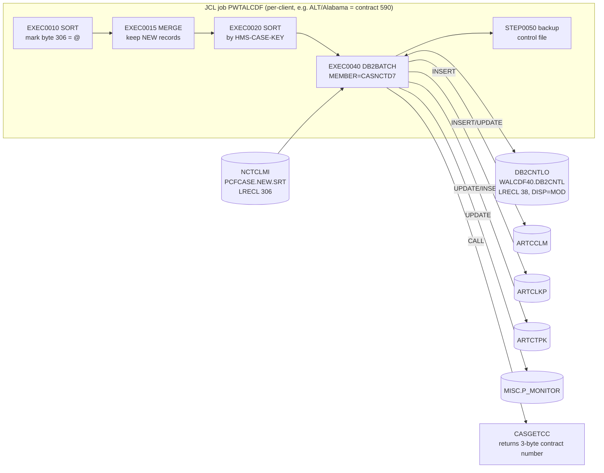
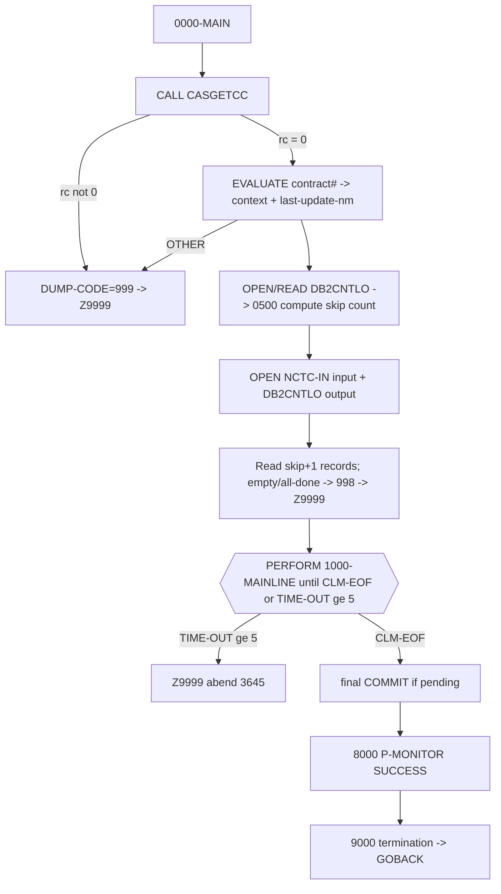

# CASNCTD7 — Logic Documentation

> **Source of truth:** `CASNCTD7.txt` (1,400 numbered source lines) plus the one copybook that is present in the repository, `NCTCLMS4.txt`, and the JCL/control‑card members that reference the program.
> All line numbers in this document refer to the numbered listing in `CASNCTD7.txt`.
> Statements are labelled **[PROVEN]**, **[INFERRED]**, or **[UNKNOWN / NOT PROVEN]** where the distinction matters.

---

# 1. Analysis Method

## 1.1 Artifacts inspected

| Artifact | Status | Role in this analysis |
|---|---|---|
| `CASNCTD7.txt` | Present (full source, 1,400 lines) | Primary subject program |
| `NCTCLMS4.txt` | Present (37 lines) | Input record layout, pulled in via `COPY NCTCLMS4 REPLACING ==(PREFIX)== BY ==CLM==` (line 86) |
| `PWTALCDF.txt` | Present (JCL) | Batch job that executes CASNCTD7 (step `EXEC0040`, `MEMBER=CASNCTD7`, line 153) |
| `WALCDF00/13/14/15/16.txt` | Present (IDCAMS / DFSORT control cards) | Upstream steps that build/curate the input file and the control file |
| `WZCA010.txt` | Present (control card) | Documents acceptable `CREATE-SOURCE` values (context only) |
| `ARTCCLM`, `ARTCLKP`, `CARTCTPK`/`ARTCTPK`, `PMONITOR`, `SQLCA` | **Absent** | DB2 DCLGEN / SQL copybooks brought in by `EXEC SQL INCLUDE` (lines 202–213). **Referenced but implementation not available.** |
| `CASGETCC` | **Absent** | Sub‑program called at line 235. **Referenced but implementation not available.** |
| `DSNTIAR`, `ILBOABN0` | **Absent (IBM‑supplied)** | IBM DB2 message formatter / abend routine, called at lines 1379 and 1399. |

## 1.2 How logic was traced

1. Read the program top‑to‑bottom: `IDENTIFICATION` → `ENVIRONMENT` → `DATA` → `PROCEDURE` divisions.
2. Resolved the single `COPY` (`NCTCLMS4`) and confirmed the expanded 306‑byte record equals the `FD … RECORD CONTAINS 306 CHARACTERS` declaration (line 83). The field lengths in `NCTCLMS4.txt` sum to exactly **306** bytes.
3. Cross‑checked field byte offsets against the DFSORT cards: `WALCDF13` sorts on `(21,09,ZD)` = `HMS-CASE-KEY`, and `WALCDF16` writes the file‑mark to byte `306`. Both are consistent with the record layout derived from `NCTCLMS4`.
4. Mapped every `EXEC SQL` block to the DB2 table it touches and traced the `EVALUATE SQLCODE` after each.
5. Enumerated every `CLM-*` (input) field reference and every `CCLM-*` / `CLKP-*` / `CTPK-*` / `PMONITOR-*` host‑variable reference.

## 1.3 Proven vs inferred handling

- **[PROVEN]** = directly present in the source (a statement, literal, `PIC`, `EVALUATE`, `MOVE`, SQL text, or a JCL DD).
- **[INFERRED]** = a reasonable deduction from structure/usage where the defining artifact is missing (e.g., the shape of a DB2 host variable whose DCLGEN copybook is not in the repo, deduced from its `-T`/`-L`/`-TEXT`/`-LEN` suffixes and its use in SQL).
- **[UNKNOWN / NOT PROVEN]** = cannot be established from the material provided.

## 1.4 Limitations

- The five `EXEC SQL INCLUDE` copybooks are **not in the repository**. Consequently the exact column data types, lengths, null‑ability, and the precise host‑variable sub‑field pictures for `ARTCCLM`, `ARTCLKP`, `ARTCTPK`, and `P_MONITOR` **cannot be proven**; they are described from SQL usage only.
- `CASGETCC` is **not in the repository**; its internal logic (how the 3‑byte contract number is obtained) **cannot be proven**. Only its calling interface and the meaning the caller assigns to its return code are proven.
- Business intent is only asserted where a source comment or literal supports it. Where naming *suggests* meaning but the code does not confirm it, this is flagged.

---

# 2. Program Overview

## 2.1 Purpose (from source comments) — [PROVEN]

Lines 6–13 state:

```
* THIS PGM WILL UPDATE DB2 TABLES FROM THE NEW CURRENT GDG OF
* PCFCASE CLAIMS FILE (NCTCLMS1 300 FILE).
*  DB2 TABLES USED :  DB2AR01.ARTCTPK - PRIMARY KEY TABLE
*                             ARTCCLM - CLAIM TABLE
*                             ARTCLKP - CLAIM LOOKUP TABLE
```

So the program reads a flat **PCFCASE claims file** and applies each record to three DB2 tables: **ARTCTPK** (primary‑key/next‑number control), **ARTCCLM** (claim), and **ARTCLKP** (claim‑to‑case lookup). It also updates a **`MISC.P_MONITOR`** row (lines 1189–1258) — process monitoring.

## 2.2 Technical role — [PROVEN]

- **Batch DB2 program.** It runs under the `DB2BATCH` cataloged procedure (`PWTALCDF` line 152–153: `EXEC PROC=DB2BATCH … MEMBER=CASNCTD7,DATABASE=CTSPROD`), i.e., bound to a DB2 plan and executed via the DB2 TSO batch attach.
- **Main program**, not a subprogram: it ends the normal path with `GOBACK` (line 323) after opening/closing its own files and it is named as the plan `MEMBER` in JCL. It in turn **calls** sub‑programs `CASGETCC`, `DSNTIAR`, and `ILBOABN0`.
- **Sequential read / keyed DB2 update** design with a **commit + checkpoint‑file restart** mechanism.

## 2.3 Business role — [PROVEN in part]

The consistent naming and comments (claims, ICN, recipient, provider, diagnosis codes, charge/paid amounts, "CASUALTY", "ESTATES", state contexts) show this is part of a **healthcare Third‑Party‑Liability / Case‑Tracking "claims to DB2" load** (`PWTALCDF` header line 7: *"CASUALTY 'TO DB2' PROJECT"*). Precise downstream business use of the loaded rows is **not proven** from this program alone.

## 2.4 Invocation & dependencies — [PROVEN]



- **Upstream:** the sorted/deduplicated PCFCASE "new" file. `PWTALCDF` builds it: `EXEC0010` marks the current‑generation file (`WALCDF16`: byte 306 = `'@'`), `EXEC0015` merges current(‑1)+current and keeps only "new" records (`WALCDF15`), `EXEC0020` sorts by `HMS-CASE-KEY` (`WALCDF13`).
- **Downstream:** the DB2 tables `ARTCCLM`, `ARTCLKP`, `ARTCTPK` and the monitor table `MISC.P_MONITOR`; plus the checkpoint file `DB2CNTLO` (used for restart and later backed up by `STEP0050`).

---

# 3. Inputs, Outputs, and Dependencies

## 3.1 Files (`SELECT` / `FD`) — [PROVEN]

| Logical name | `ASSIGN TO` (DDNAME) | FD facts | JCL DSN (from `PWTALCDF`) | Direction |
|---|---|---|---|---|
| `NCTC-IN` (line 73) | `NCTCLMI` | 306‑char fixed, `RECORDING MODE F`, record `NCTCLAIM-RECORD` (lines 79–85) | `…IR.PCFCASE.NEW.SRT` (line 156) | **Input** (read‑only) |
| `CNTL-IO` (line 75) | `DB2CNTLO` | `CNTL-RECORD PIC X(38)` fixed (lines 89–94) | `…IR.WALCDF40.DB2CNTL`, `DISP=(MOD,KEEP,KEEP)` (line 158) | **Input then Output** (checkpoint file) |

Notes:
- The program **opens `CNTL-IO` twice**: first `OPEN INPUT` to read prior checkpoints (line 283), then `OPEN … OUTPUT CNTL-IO` (line 289) to append new checkpoints. Because the JCL uses `DISP=MOD`, output is appended to the existing file. **[PROVEN]**
- An older `CNTL-OUT` (`DB2CNTLO`) definition is commented out (lines 74, 88, 288, 321); change tag `0004` converted it to a single read/write `CNTL-IO`. **[PROVEN]**
- `WS-CONTROL-RECORD` (the record moved to/from the file) is 40 bytes wide but the file record `CNTL-RECORD` is `PIC X(38)`; on `WRITE … FROM` the last 2 bytes are truncated. See §4.4. **[PROVEN]**

## 3.2 DB2 objects touched — [PROVEN (that they are touched); column detail INFERRED]

| DB2 object | Statement(s) | Line(s) |
|---|---|---|
| `ARTCCLM C, ARTCLKP L` (join) | `SELECT L.CLAIM_ID` (existence probe) | 708–719 |
| `ARTCCLM` | `UPDATE` | 767–796 |
| `ARTCCLM` | `INSERT` | 914–975 |
| `ARTCLKP` | `INSERT` | 1039–1060 |
| `ARTCTPK` | `UPDATE PK_NEXT_NUM = PK_NEXT_NUM + 1` | 823–829 |
| `ARTCTPK` | `SELECT PK_NEXT_NUM - 1 …` | 858–868 |
| `ARTCTPK` | `INSERT` (first row for a context) | 1093–1110 |
| `MISC.P_MONITOR` | `UPDATE` (0..6 statements) | 1189–1258 |
| `SYSIBM.SYSDUMMY1` | `SELECT DISTINCT(CURRENT TIMESTAMP)` | 1147–1151 |
| — | `COMMIT` | 1137, 1266 |
| — | `ROLLBACK` | 888, 1025, 1074, 1392 |

## 3.3 Copybooks — [PROVEN they are included; content only partly available]

| Copybook | Mechanism | Present? |
|---|---|---|
| `NCTCLMS4` | `COPY … REPLACING (PREFIX) BY CLM` (line 86) | **Yes** |
| `SQLCA` | `EXEC SQL INCLUDE SQLCA` (line 202) | No (IBM‑standard) |
| `CARTCTPK` | `EXEC SQL INCLUDE CARTCTPK` (line 205; replaced `ARTCTPK` per tag `0009`) | **No** |
| `ARTCCLM` | `EXEC SQL INCLUDE ARTCCLM` (line 207) | **No** |
| `ARTCLKP` | `EXEC SQL INCLUDE ARTCLKP` (line 209) | **No** |
| `PMONITOR` | `EXEC SQL INCLUDE PMONITOR` (line 211–213) | **No** |

## 3.4 Called programs — [PROVEN interface; internals unknown]

| Called | How | Meaning to caller |
|---|---|---|
| `CASGETCC` (via `WS-CASGETCC`, line 166/235) | `CALL WS-CASGETCC USING CASGETCC-CALLING-AREA` | Returns `HMS-3BYTE-CONTRACT-NUM` (client/contract id) and `CASGETCC-RETURN-CODE`. Non‑`'0'` ⇒ fatal (lines 238–242). Internals **not proven**. |
| `DSNTIAR` (line 1379) | `CALL 'DSNTIAR' USING SQLCA, ERROR-MESSAGE, ERROR-LINE-LENGTH` | IBM DB2 routine that formats `SQLCA` into printable message lines. |
| `ILBOABN0` (line 1399) | `CALL 'ILBOABN0' USING DUMP-CODE` | IBM routine that forces a user abend with the numeric `DUMP-CODE`. |
| `DPSGTCON` (lines 228–233) | **Commented out** (tag `0007`) | Former contract‑retrieval routine, superseded by `CASGETCC`. Not active. |

## 3.5 Control‑card / profile dependencies — [PROVEN]

- The **checkpoint/control file** `DB2CNTLO` (see §3.1 and §5.3) is both a dependency and an output. Its first byte (`CNTL-PROC-FLAG`) is set to `'N'` by the upstream DFSORT step `EXEC0030`/`WALCDF14` (`OUTREC FIELDS=(1:1C'N',2:2,37)`) to force full reprocessing on a restart from that step (see §5.3, §7). **[PROVEN]**
- `WZCA010.txt` documents acceptable `CREATE-SOURCE` values (`00`=TPL MEDICAID, `01`=CO DSS, `02`=CA OTHER 35). CASNCTD7 only maps `00` and `01` (lines 683–688); see §6. This card is a **profile/reference**, not read by CASNCTD7 directly. **[PROVEN / INFERRED usage]**

## 3.6 Important status codes and flags — [PROVEN]

| Symbol | Definition | Use |
|---|---|---|
| `SQLCODE` (in `SQLCA`) | DB2 return code | Every `EVALUATE SQLCODE` |
| `CLM-EOF` (88, line 101) | `WS-CLM-EOF-FLAG = 'Y'` | Ends main loop |
| `CNTL-EOF` (88, line 103) | `WS-CNTL-EOF-FLAG = 'Y'` | Ends control‑file read loop |
| `CNTL-PROC-FLAG` (line 153) | `'-'` normal / `'N'` bypass | Restart behavior |
| `CASGETCC-RETURN-CODE` (line 172) | `'0'` = OK | Startup validation |
| `DUMP-CODE` (line 98) | `+3645` default; set to `+0999` or `+0998` | User abend code passed to `ILBOABN0` |
| `TIME-OUT-CTR` (line 187) | 0..5 | DB2 unavailable retry counter |
| `SQL-NOT-COMMITED-YET-CTR` (line 178) | count since last commit | Commit trigger / mid‑LUW guard |
| `SQL-COMMIT-FREQ` (line 104) | `+300` | Commit frequency |

---

# 4. Data Structures and Important Fields

## 4.1 Input record `NCTCLAIM-RECORD` (`CLM-` prefix) — [PROVEN] (from `NCTCLMS4.txt`, expanded with prefix `CLM`)

| # | Field | PIC | Bytes | Used by CASNCTD7? |
|---|---|---|---|---|
| 1 | `CLM-RECIPIENT-ID-NUM` | X(20) | 1–20 | Yes → `CCLM-RECIP-MA-NUM` (line 558) |
| 2 | `CLM-HMS-CASE-KEY` | 9(09) | 21–29 | Yes → `CLKP-CASE-ID` (line 541); sort key |
| 3 | `CLM-ICN` | X(20) | 30–49 | Yes → `CCLM-ICN-NUM` (line 536) |
| 4 | `CLM-FORMER-ICN` | X(20) | 50–69 | Yes → `CCLM-PREV-ICN-NUM` (line 552) |
| 5 | `CLM-CLAIM-STATUS` | X(01) | 70 | Yes → `CCLM-CLMST-RF` (line 573); part of SELECT key |
| 6 | `CLM-TRANSACTION-TYPE` | X(01) | 71 | Yes → `CCLM-TRNTP-RF` (line 576) |
| 7 | `CLM-CLAIM-TYPE` | X(03) | 72–74 | Yes → `CCLM-CLMTP-RF` (579); `='12'` branch (615) |
| 8 | `CLM-UNITS-OF-SERVICE` | X(05) | 75–79 | Yes → `CCLM-UNITS-NUM` (584) |
| 9 | `CLM-CHARGE-AMT` | Z(06)9.99- | 80–90 | Yes → de‑edit → `CCLM-CHARGE-AMT` (589) |
| 10 | `CLM-PAID-AMT` | Z(06)9.99- | 91–101 | Yes → de‑edit → `CCLM-PAID-AMT` (591) |
| 11 | `CLM-DOR-A` (CC+DOR) | 9(02)+9(06) | 102–109 | Yes → `CCLM-REMIT-DT` (594) |
| 12 | `CLM-SERVICE-DATE-FROM-A` | 9(02)+9(06) | 110–117 | Yes → `CCLM-SERVICE-FROM-DT` (600) |
| 13 | `CLM-SERVICE-DATE-TO-A` | 9(02)+9(06) | 118–125 | Yes → `CCLM-SERVICE-TO-DT` (609) |
| 14 | `CLM-LAST-NAME` | X(12) | 126–137 | **No** (defined, not used) |
| 15 | `CLM-FIRST-NAME` | X(07) | 138–144 | **No** |
| 16 | `CLM-MI` | X(01) | 145 | **No** |
| 17 | `CLM-PROVIDER-NUM` | X(15) | 146–160 | Yes → `CCLM-PROVIDER-ID` (568) |
| 18 | `CLM-PROVIDER-NAME` | X(35) | 161–195 | **No** |
| 19 | `CLM-HMS-CLIENT-ID` | X(06) | 196–201 | Yes → context derivation (373, 382, 428, 456, 485, 510) |
| 20 | `CLM-SVC-CODE` | X(11) | 202–212 | Yes → `CCLM-NDCCD-RF` or `CCLM-ICD9P-RF` (616/621) |
| 21 | `CLM-SVC-DESC` | X(35) | 213–247 | **No** |
| 22 | `CLM-PRIMARY-DIAG-CODE` | X(07) | 248–254 | Yes → `CCLM-ICD9D-RF` (631–655) |
| 23 | `CLM-PRIMARY-DIAG-DESC` | X(35) | 255–289 | **No** |
| 24 | `CLM-SECOND-DIAG-CODE` | X(07) | 290–296 | Yes → `CCLM-ICD9D-2ND-RF` (657–681) |
| 25 | `CLM-CREATE-SOURCE` | X(02) | 297–298 | Yes → `CCLM-CREATE-SOURCE-NM` (683–688) |
| 26 | `CLM-FILLER` | X(02) | 299–300 | **No** |
| 27 | `CLM-USER-RELATED` | X(01) | 301 | **No** |
| 28 | `CLM-CDE-ICD-VERSION` | X(02) | 302–303 | Yes → `CCLM-ICD-VERSION` (690) |
| 29 | `CLM-AGENCY-CODE` | X(02) | 304–305 | Yes → `CCLM-AGENCY-CD` (695) |
| 30 | `CLM-SYSTEM-RELATED` | X(01) | 306 | **No** in program; used **upstream** as the `'@'` mark byte (WALCDF16) |

Total = **306** bytes (matches `FD` line 83). **[PROVEN]**

## 4.2 DB2 host‑variable groups — [INFERRED shape, PROVEN usage]

The `CCLM-`, `CLKP-`, and `CTPK-` variables come from the missing DCLGEN copybooks. Their **VARCHAR** members are used as `-T`/`-TEXT` (character) plus `-L`/`-LEN` (length); fixed columns are used directly. Examples proven from usage:

- `CCLM-CONTEXT-CD` (VARCHAR: `-T` text + `-L` length) — lines 529–534.
- `CCLM-ICN-NUM`, `CCLM-PREV-ICN-NUM`, `CCLM-RECIP-MA-NUM`, `CCLM-PROVIDER-ID`, `CCLM-CLMTP-RF`, `CCLM-UNITS-NUM`, `CCLM-ICD9P-RF`, `CCLM-NDCCD-RF`, `CCLM-ICD9D-RF`, `CCLM-ICD9D-2ND-RF`, `CCLM-ICD-VERSION`, `CCLM-AGENCY-CD`, `CCLM-LAST-UPDATE-NM` — all populated via `UNSTRING … COUNT IN` (VARCHAR pattern).
- `CCLM-CLMST-RF`, `CCLM-TRNTP-RF` — set to length `1` explicitly (lines 574, 577).
- `CCLM-CHARGE-AMT`, `CCLM-PAID-AMT` — numeric (fed from `WS-DE-EDIT S9(07)V99`).
- `CCLM-REMIT-DT`, `CCLM-SERVICE-FROM-DT`, `CCLM-SERVICE-TO-DT` — 10‑byte `CCYY-MM-DD` character dates (built by reference‑modification, lines 594–613).
- `CCLM-CLAIM-ID`, `CLKP-CLAIM-ID` — numeric claim id (set from `CTPK-PK-NEXT-NUM`, lines 911–912).
- `CLKP-CASE-ID` — case id (from `CLM-HMS-CASE-KEY`, line 541).
- `CTPK-PK-NEXT-NUM`, `CTPK-PK-MASK-TXT`, `CTPK-LAST-UPDATE-NM(-TEXT/-LEN)`, `CTPK-LAST-UPDATE-DTM` — primary‑key control columns.

Exact pictures/lengths of these columns are **[UNKNOWN / NOT PROVEN]** (copybooks absent).

## 4.3 Working‑storage scenario‑driving fields — [PROVEN]

| Field | PIC / value | Purpose |
|---|---|---|
| `HMS-3BYTE-CONTRACT-NUM` | X(03) | Client/contract id from `CASGETCC`; drives context `EVALUATE` |
| `WS-CONTEXT-CD` | X(16) | Derived context code (e.g. `CTSCASNY`) |
| `WS-CONTEXT-CD6` | X(06) | Temp for client‑id override (contracts 326/590/359/645) |
| `WS-LAST-UPDATE-NM` | X(08) | "Who updated" stamp (e.g. `WALCDF40`) written to all tables |
| `WS-DE-EDIT` | S9(07)V99 | De‑edits `Z(06)9.99-` amounts to numeric |
| `WK-DIAG-CODE`, `WS-DIAG-CODE-4*` | X(7)/redefs | Diagnosis‑code reformatting (dot removal), tag `0010` |
| `COUNT-M` | S9(3) COMP‑3 | Char count before `'.'` in a diag code |
| `WS-CONTEXT-CD-1..5` + `…-CNT` | X(16) / S9(12) | Track inserts for up to 5 distinct contexts (P‑Monitor) |
| `REC-READ-CTR` | S9(07) | Input records read (incl. skipped) |
| `SQL-INSERT-CTR` / `SQL-UPDATE-CTR` | S9(9)/S9(7) | Per‑LUW insert/update counts |
| `SQL-…-COMMITTED-CTR` / `SQL-TOT-COMMITTED-CTR` | — | Cumulative committed counts |
| `SQL-NOT-COMMITED-YET-CTR` | S9(05) | Since‑last‑commit count |
| `TIME-OUT-CTR` | S9(01) | DB2 retry counter (abend at 5) |
| `WS-STATUS-TXT` | X(20) `'SUCCESS'` | Fed to `P_MONITOR.STATUS_TXT` |

## 4.4 Checkpoint record `WS-CONTROL-RECORD` — [PROVEN]

```
01 WS-CONTROL-RECORD.                          bytes
   05 CNTL-PROC-FLAG        PIC X(01) '-'        1
   05 NUM-REC-OUT          PIC ZZZ,ZZZ,ZZ9      2–12  (11 print positions)
   05 FILLER               PIC X(02) '++'      13–14
   05 WS-CURRENT-TIMESTAMP PIC X(26)           15–40
```
Group length = 40; file record `CNTL-RECORD` = `PIC X(38)`, so a `WRITE CNTL-RECORD FROM WS-CONTROL-RECORD` (line 1164) stores only the first 38 bytes (the last 2 timestamp bytes are truncated). **[PROVEN]**

## 4.5 Match / key fields — [PROVEN]

- **Existence probe key (lines 712–718):** `C.CONTEXT_CD = :CCLM-CONTEXT-CD` **AND** `C.ICN_NUM = :CCLM-ICN-NUM` **AND** `C.CLMST_RF = :CCLM-CLMST-RF` (claim status, added by tag `0012`) joined to `L.CONTEXT_CD = :CLKP-CONTEXT-CD` **AND** `L.CASE_ID = :CLKP-CASE-ID`, with `C.CONTEXT_CD = L.CONTEXT_CD` and `C.CLAIM_ID = L.CLAIM_ID`.
- **`ARTCCLM` UPDATE key (lines 793–795):** `CONTEXT_CD` + `CLAIM_ID` + `ICN_NUM`.
- **`ARTCTPK` key (lines 827–828 / 866–867):** `CONTEXT_CD` + `PK_TYPE_CD = 'CLM'`.
- **`ARTCLKP` INSERT (lines 1039–1058):** rows keyed by `CONTEXT_CD` + `CASE_ID` + `CLAIM_ID` (values supplied).

---

# 5. Processing Logic



## 5.1 `0000-MAIN` — initialization & startup validation (lines 218–323) — [PROVEN]

1. Display compile date/time (`FUNCTION WHEN-COMPILED`, lines 220–227).
2. `CALL 'CASGETCC'` to obtain `HMS-3BYTE-CONTRACT-NUM`; if `CASGETCC-RETURN-CODE NOT = '0'` → display error, `DUMP-CODE = +0999`, `GO TO Z9999-ERROR-EXIT` (lines 235–242).
3. `EVALUATE HMS-3BYTE-CONTRACT-NUM` to set the **base** `WS-CONTEXT-CD` and `WS-LAST-UPDATE-NM` (lines 246–279). `WHEN OTHER` → error, `DUMP-CODE = +0999`, abend.
4. Read the control file to compute how many input records were already processed (`0500-CREATE-INFILE-CRP`), then close it (lines 283–285).
5. `OPEN INPUT NCTC-IN` and `OPEN OUTPUT CNTL-IO` (append) (lines 287–289).
6. **Skip/prime loop** (lines 290–306): `CRP-IN = WS-CNTL-RECS-OUT-TOT + 1`; `PERFORM CRP-IN TIMES READ NCTC-IN`. Reaching `AT END` here means the whole file was already processed (or is empty): display the appropriate message, `DUMP-CODE = +0998`, abend. Otherwise the `(skip+1)`‑th record is now current.
7. `PERFORM 1000-MAINLINE UNTIL CLM-EOF OR TIME-OUT-CTR >= 5` (lines 308–309).
8. If `TIME-OUT-CTR >= 5` → abend (lines 310–312). Else, if uncommitted work remains → final `1900-IMPLICIT-COMMIT` (313–315).
9. `P_MONITOR` = SUCCESS, `9000-TERMINATION`, close files, `GOBACK` (316–323).

### Contract → context mapping (lines 246–279) — [PROVEN]

| `HMS-3BYTE-CONTRACT-NUM` | `WS-CONTEXT-CD` (base) | `WS-LAST-UPDATE-NM` | Note |
|---|---|---|---|
| `320` | `CTSCASNY` | `WNYCDF40` | NY (further sub‑mapped, §5.4a) |
| `300` | `CTSCASTST` | `WTTCDF40` | Tagged `TEST` |
| `326` | `CTSCASCO` | `WCOCDF40` | client‑id override (§5.4) |
| `341` | `CTSCASOH` | `WOHCDF40` | OH |
| `535` | `CTSCASOH` | `WCXCDF40` | OH CareSource → also sets `ALT_CLIENT_CD='535'` |
| `313` | `CTSCASFL` | `WFLCDF40` | FL (further sub‑mapped, §5.4b) |
| `319` | `CTSCASCT` | `WCTCDF40` | CT |
| `317` | `CTSWRCCA` | `WCACDF40` | CA |
| `590` | `CTSCASAL` | `WALCDF40` | AL, client‑id override (§5.4) |
| `330` | `CTSCASAR` | `WARCDF40` | AR |
| `358` | `CTSCASNV` | `WNVCDF40` | NV (further sub‑mapped, §5.4c) |
| `359` | `CTSCASNM` | `WNMCDF40` | NM, client‑id override (§5.4) |
| `645` | `CTSCASWV` | `WWVCDF40` | WV, override **and** sub‑map (§5.4d) |
| `564` | `CTSCASTN` | `WWVCDF40` | TN, sub‑mapped (§5.4e). **Uses `WWVCDF40`** — see §8 Open Question |
| any other | — | — | error, abend 999 |

## 5.2 `0500-CREATE-INFILE-CRP` — restart skip count (lines 325–357) — [PROVEN]

- Reads the control file record‑by‑record `INTO WS-CONTROL-RECORD`.
- For each record whose `CNTL-PROC-FLAG = '-'`: move its `NUM-REC-OUT` into `WS-CNTL-RECS-OUT`; if it is greater than the running hold, update the hold; otherwise (counter reset — a new run began) add the previous hold to `WS-CNTL-RECS-OUT-TOT` and restart the hold. At `AT END`, add the final hold to the total.
- Net effect: `WS-CNTL-RECS-OUT-TOT` = **total records committed across all prior runs** = the number to skip.
- If `CNTL-PROC-FLAG = 'N'` (set by `WALCDF14`) the skip accumulation is bypassed (total stays 0 ⇒ reprocess from the beginning) and it displays `"BYPASS DB2 CONTROL FILE PROCESSING"`.
- An empty control file (`AT END` on first read) ⇒ `"DB2 CONTROL FILE IS EMPTY"` and total 0.

## 5.3 `1000-MAINLINE` — per‑record processing (lines 359–763) — [PROVEN]

For the current input record:

1. `INITIALIZE DCLARTCTPK DCLARTCCLM DCLARTCLKP` (line 360) — clears the host structures.
2. **Derive `WS-CONTEXT-CD`** (see §5.4).
3. **Map fields** into host variables (lines 523–704): context/ICN/former‑ICN/recipient/provider/claim‑type/units via `UNSTRING … COUNT` (VARCHAR); claim‑status & transaction‑type as length‑1; amounts via de‑edit; three dates reformatted to `CCYY-MM-DD`; service/diagnosis codes (§5.5); `CREATE-SOURCE` name (§6); ICD version; agency code; `ALT_CLIENT_CD` for contract 535.
4. **Existence probe** (`SELECT L.CLAIM_ID …`, lines 708–719) and `EVALUATE SQLCODE`:
   - `+0` (row found) → `1100-UPDATE-ARTCCLM`.
   - `+100` (not found) → `1200-INSERT-ARTCCLM`.
   - `-811` (>1 row) → display, abend (3645).
   - `-904/-911/-913` (resource/deadlock/timeout) → if nothing pending this LUW, `+1 TIME-OUT-CTR` and `GO TO 1000-MAINLINE-EXIT` (retry same record); else abend (3645).
   - `OTHER` → abend (3645).
5. `ADD +1 TO SQL-NOT-COMMITED-YET-CTR`; if `>= SQL-COMMIT-FREQ (300)` → `1900-IMPLICIT-COMMIT` (lines 752–757).
6. `READ NCTC-IN` (line 759): `AT END SET CLM-EOF`; else `+1 REC-READ-CTR`.

> On the retry `GO TO 1000-MAINLINE-EXIT` path the trailing `READ` is skipped, so the *same* record is re‑derived and re‑probed on the next loop iteration. **[PROVEN]**

## 5.4 Context‑code derivation detail — [PROVEN]

After the base `EVALUATE` (§5.1), additional rules refine `WS-CONTEXT-CD`:

- **Client‑id first‑6 override (lines 368–375):** for contracts **`326`, `590`, `359`, `645`** (contract `313` is commented out) → `MOVE CLM-HMS-CLIENT-ID TO WS-CONTEXT-CD (1:6)`. Positions 7–8 keep the state suffix from the base context; positions 9–16 stay spaces. Example: base `CTSCASCO` with client‑id `CTSEST` ⇒ `CTSESTCO` (CO estate). This implements tag `0003` ("ESTATE CASES FOR CO").

- **(a) NY, contract `320` (lines 381–404):** `EVALUATE CLM-HMS-CLIENT-ID` → `CTSCEN`→`CTSCASEX-NY`; `CTSCCN`→`CTSCASNYC`; `CTSECN`→`CTSESTNY`; `CTSEEN`→`CTSESTEX-NY`; `OTHER`→`CTSCASNY`.
- **(b) FL, contract `313` (lines 427–450):** `CTSCAS`→`CTSCASFL`; `CTSEST`→`CTSESTFL`; `CTSTRS`→`CTSTRSFL`; `CTSMST`→`CTSCASMT-FL`; `OTHER`→`CTSCASFL`.
- **(c) NV, contract `358` (lines 455–479):** `CTSCAS`→`CTSCASNV`; `CTSEST`→`CTSESTNV`; `CTSTRS`→`CTSTRSNV`; `CTSTFR`→`CTSTFRNV`; `OTHER`→`CTSCASNV`.
- **(d) WV, contract `645` (lines 484–504):** `CTSCAS`→`CTSCASWV`; `CTSEST`→`CTSESTWV`; `CTSCHP`→`CTSCASCH-WV`; `OTHER`→`CTSCASWV`. (Runs *after* the first‑6 override, so this `EVALUATE` sets the final value.)
- **(e) TN, contract `564` (lines 509–521):** `CTSCAS`→`CTSCASTN`; `OTHER`→`CTSCASTN`.

Then the final `WS-CONTEXT-CD` is `UNSTRING`‑ed (delimited by all spaces) into the VARCHAR text/length for all three tables (lines 523–534).

## 5.5 Service‑ and diagnosis‑code handling — [PROVEN]

- **Service code (lines 615–629):** if `CLM-CLAIM-TYPE = '12'` → `UNSTRING CLM-SVC-CODE` into `CCLM-NDCCD-RF` (NDC drug code). Else → into `CCLM-ICD9P-RF` (procedure code); and if the resulting length `> +10`, force it to `10` (tag `0020`, to fit the column).
- **Primary diagnosis (lines 631–655):** copy `CLM-PRIMARY-DIAG-CODE` to `WK-DIAG-CODE`; count characters before the first `'.'` into `COUNT-M`. If `COUNT-M = 3` (format `nnn.xx`), rebuild without the dot (`nnn`+`xx`) and `UNSTRING` into `CCLM-ICD9D-RF`. Else, if there is a leading space, shift left one, then `UNSTRING` the code as‑is into `CCLM-ICD9D-RF`.
- **Secondary diagnosis (lines 657–681):** identical logic into `CCLM-ICD9D-2ND-RF`.

## 5.6 `1100-UPDATE-ARTCCLM` (lines 765–819) — [PROVEN]

`UPDATE ARTCCLM SET <all business columns>, LAST_UPDATE_DTM = CURRENT TIMESTAMP WHERE CONTEXT_CD/CLAIM_ID/ICN_NUM`. `EVALUATE SQLCODE`: `+0` → `+1 SQL-UPDATE-CTR`; `-904/-911/-913` → retry/abend as in §5.3.4; `OTHER` → abend. **Only `ARTCCLM` is changed on the update path** (no lookup/PK rows created).

## 5.7 `1200-INSERT-ARTCCLM` (lines 821–1089) — [PROVEN]

1. `UPDATE ARTCTPK SET PK_NEXT_NUM = PK_NEXT_NUM + 1, LAST_UPDATE_NM, LAST_UPDATE_DTM WHERE CONTEXT_CD AND PK_TYPE_CD='CLM'` (823–829). `+100` (no PK row yet) → `1210-INSERT-ARTCTPK`.
2. `SELECT PK_NEXT_NUM - 1, LAST_UPDATE_NM, LAST_UPDATE_DTM INTO …` (858–868) — the just‑incremented value minus 1 is the id to assign.
3. **Concurrency guard** (902–909): if `CTPK-LAST-UPDATE-NM-TEXT(1:len) NOT = WS-LAST-UPDATE-NM` ⇒ another application touched `ARTCTPK` in this LUW ⇒ display + abend.
4. `MOVE CTPK-PK-NEXT-NUM TO CCLM-CLAIM-ID, CLKP-CLAIM-ID` (911–912).
5. `INSERT INTO ARTCCLM (…) VALUES (…)` (914–975). `+0` → `+1 SQL-INSERT-CTR` and update the distinct‑context counters (§5.8).
6. `INSERT INTO ARTCLKP (CONTEXT_CD, CASE_ID, CLAIM_ID, RELATE_IND='0', LAST_UPDATE_NM, LAST_UPDATE_DTM=CURRENT TIMESTAMP, IS_AUTO_CHECKED='N', CREATE_NM, CREATE_DTM=CURRENT TIMESTAMP)` (1039–1060).

Each SQL step has the same `-904/-911/-913` retry (with `ROLLBACK` of the partial insert) and `OTHER`→abend handling.

## 5.8 Distinct‑context insert counters (lines 976–1014) — [PROVEN behavior]

Inside the `ARTCCLM` INSERT `WHEN +0` only: for each empty slot (`…-CNT = 0`), seed `WS-CONTEXT-CD-n` with the current context; then a nested `IF` chain increments the `…-CNT` of the first slot whose context equals the current one. Observable result: **insert counts are accumulated for up to 5 distinct context codes in order of first appearance**; a 6th distinct context is not counted. These counts feed `P_MONITOR` (§5.10) and the end‑of‑job report (§5.11). (Updates are **not** counted here.)

## 5.9 `1900-IMPLICIT-COMMIT` (lines 1136–1173) — [PROVEN]

`EXEC SQL COMMIT`; non‑zero `SQLCODE` ⇒ abend. Obtain `CURRENT TIMESTAMP` from `SYSIBM.SYSDUMMY1` (fallback `FUNCTION CURRENT-DATE` if that `SELECT` fails). Set `CNTL-PROC-FLAG = '-'`, `ADD SQL-NOT-COMMITED-YET-CTR TO SQL-TOT-COMMITTED-CTR`, move the total to `NUM-REC-OUT`, and **`WRITE CNTL-RECORD FROM WS-CONTROL-RECORD`** (a checkpoint). Roll insert/update counts into the committed totals and reset the per‑LUW counters (`SQL-NOT-COMMITED-YET-CTR`, `SQL-INSERT-CTR`, `SQL-UPDATE-CTR`, `TIME-OUT-CTR`).

## 5.10 `8000-P-MONITOR` (lines 1175–1285) — [PROVEN]

Sets `PMONITOR-STATUS-TXT` from `WS-STATUS-TXT`, then issues an `UPDATE MISC.P_MONITOR` for the client’s duration row (`PROCESS_NM LIKE 'CLKP_LOAD_DURATION_%'`), followed by up to five more `UPDATE`s — one per non‑blank distinct context `WS-CONTEXT-CD-1..5` (each guarded so an unchanged/blank slot is skipped) — setting `DATA_CNT` to that context’s insert count and `STATUS_TXT`. `EVALUATE SQLCODE`: `+0` → display + `COMMIT`; `+100` → display "row non‑existent" (no abend); `OTHER` → display, reset `SQLCODE` to 0, **continue** (the abend `GO TO` is commented out). So P‑Monitor failures are **non‑fatal**.

## 5.11 Termination & counters — [PROVEN]

`9000-TERMINATION` (1335) calls `9100-DISPLAY-COUNTERS` (1341–1375), which prints: records read (incl. skipped), inserted `ARTCCLM` committed, per‑context (1st–5th) committed, updated committed, and total committed. Normal end prints `"PGM CASNCTD7 NORMAL END"`.

## 5.12 `Z9999-ERROR-EXIT` (lines 1377–1400) — [PROVEN]

If `SQLCODE NOT = 0`, call `DSNTIAR` and print 7 message lines. `EXEC SQL ROLLBACK`. Print counters. Set `WS-STATUS-TXT = 'FAILURE'` and run `8000-P-MONITOR`. `CALL 'ILBOABN0' USING DUMP-CODE` (user abend), then `GOBACK`.

---

# 6. Extracted Business Logic

Expressed as rules; each cites its source lines.

1. **Client resolution.** *The program shall obtain the 3‑byte client/contract number from `CASGETCC`; if it cannot (`return‑code ≠ '0'`), it shall abend with user code 999.* (235–242)
2. **Known‑client requirement.** *Only the contract numbers enumerated in the `EVALUATE` (300, 313, 317, 319, 320, 326, 330, 341, 358, 359, 535, 564, 590, 645) are processed; any other value abends with user code 999.* (246–279)
3. **Context code = client + state/line‑of‑business.** *The stored `CONTEXT_CD` is derived from the contract number and, for multi‑line clients (NY, FL, NV, WV, and the client‑id‑override contracts CO/AL/NM), from the record’s `CLM-HMS-CLIENT-ID`.* (368–521)
4. **Casualty is the default line of business.** *When a client’s `CLM-HMS-CLIENT-ID` matches no specific value, the context defaults to the client’s CASUALTY code (e.g., `CTSCASNY`, `CTSCASFL`, `CTSCASNV`, `CTSCASWV`, `CTSCASTN`).* (401–402, 447–448, 476–477, 501–502, 518–519)
5. **CareSource flag.** *When the contract is `535`, `ALT_CLIENT_CD` shall be set to `'535'`; otherwise it is spaces.* (700–704)
6. **Match rule (update vs insert).** *A claim already exists when a row matches on `CONTEXT_CD`, `ICN_NUM`, and `CLMST_RF` in `ARTCCLM` joined to `ARTCLKP` on `CONTEXT_CD`+`CASE_ID`+`CLAIM_ID`. If it exists, update it; if it does not, insert a new claim and its lookup row.* (708–724)
7. **Claim id assignment.** *A new claim id is obtained by incrementing `ARTCTPK.PK_NEXT_NUM` for the context and using the value minus 1; the first claim for a brand‑new context seeds `ARTCTPK` with `PK_NEXT_NUM = 2`.* (823–836, 858–868, 911–912, 1093–1110)
8. **Duplicate/ambiguous key.** *If the existence probe returns more than one row (`SQLCODE -811`), the program shall abend (no automatic resolution).* (725–730)
9. **Amount normalization.** *Charge and paid amounts arrive display‑edited (`Z(06)9.99-`) and shall be de‑edited to signed numeric before storage.* (589–592)
10. **Date normalization.** *`CCYYMMDD` dates (DOR, service‑from, service‑to) shall be stored as `CCYY-MM-DD`.* (594–613)
11. **Drug vs procedure code routing.** *When `CLAIM-TYPE = '12'` the service code is stored as an NDC code (`NDCCD_RF`); otherwise as a procedure code (`ICD9P_RF`) truncated to 10 characters.* (615–629)
12. **Diagnosis‑code formatting.** *A diagnosis code of the form `nnn.xx` shall be stored with the decimal point removed (`nnnxx`); otherwise a single leading space is stripped and the code stored as‑is.* (631–681)
13. **Create‑source naming.** *`CREATE-SOURCE = '00'` shall store `'STANDARD MEDICAID'`; `'01'` shall store `'DSS'`; any other value leaves the name blank.* (683–688)
14. **Restart resumption.** *On a restart, the program shall skip the number of records already committed (derived from the control file) and resume with the next record.* (325–357, 290–306)
15. **Bypass‑skip control.** *When the control file’s first byte is `'N'`, the program shall reprocess the input from the beginning.* (332, 348–350; `WALCDF14`)
16. **No‑data completion.** *If every input record has already been processed (or the file is empty), the program shall end via the error exit with user code 998 (documented as a good/no‑data completion by tag `0011`).* (293–303)
17. **Commit cadence & checkpoint.** *The program shall commit every 300 successful record operations and, at each commit, append a checkpoint record (cumulative committed count + timestamp) to the control file.* (104, 752–757, 1136–1173)
18. **DB2 contention tolerance.** *On resource/lock/timeout (`-904/-911/-913`) with no pending work, the program shall retry the same record up to 5 times; after the 5th it shall abend with user code 3645 so the job can be restarted from the last commit.* (309–312, 731–745, 800–818, 837–855, 875–901, 1015–1036, 1064–1088)
19. **Concurrency integrity.** *If another application updates `ARTCTPK` for the same context within the current unit of work (the `LAST_UPDATE_NM` no longer matches this run), the program shall abend.* (902–909)
20. **Process monitoring.** *At success and at failure, the program shall stamp `MISC.P_MONITOR` for the client (and per context) with end time, status, and per‑context counts; monitor failures do not stop the job.* (316–318, 1175–1285, 1396–1398)

---

# 7. Error Handling and Edge Cases

| Condition | Detection | Program response | User abend code |
|---|---|---|---|
| `CASGETCC` failure | `CASGETCC-RETURN-CODE ≠ '0'` (238) | display, abend | **0999** |
| Unknown contract | `EVALUATE … WHEN OTHER` (275) | display, abend | **0999** |
| Input empty / all already processed | `AT END` in prime loop (293) | display, abend (documented as good/no‑data) | **0998** |
| Probe returns >1 row | `SQLCODE -811` (725) | display ICN/prev‑ICN, abend | **3645** (default) |
| DB2 resource/lock/timeout, nothing pending | `-904/-911/-913` & `SQL-NOT-COMMITED-YET-CTR = 0` | `+1 TIME-OUT-CTR`, `ROLLBACK` (insert paths), retry same record | — (until 5) |
| Same, but work pending in LUW | `-904/-911/-913` & counter ≠ 0 | abend | **3645** |
| 5th DB2 timeout | `TIME-OUT-CTR >= 5` (310) | abend for restart | **3645** |
| Any other SQL error on SELECT/UPDATE/INSERT | `WHEN OTHER` | move `SQLCODE`, display, abend | **3645** |
| Unsuccessful `COMMIT` | `SQLCODE ≠ 0` (1138) | display, abend | **3645** |
| `ARTCTPK` intervened in LUW | name mismatch (902) | display, abend | **3645** |
| `P_MONITOR` row missing / error | `+100` / `OTHER` (1268/1275) | display only, **continue** | — |
| Restart from `EXEC0030` | `CNTL-PROC-FLAG='N'` | reprocess from start | — |

Operational restart note (from `PWTALCDF` lines 142–150): **only** user completion code **3645** should trigger a restart of step `EXEC0040` (resume from last commit); *"do not restart more than twice — contact a programmer."* Restarting from `EXEC0030` (which sets the flag to `'N'`) reprocesses the whole file. **[PROVEN]**

Edge cases worth flagging:
- **998 uses the error exit.** Because 998 is raised via `Z9999-ERROR-EXIT`, the run performs a `ROLLBACK` and stamps `P_MONITOR` as `'FAILURE'` even though tag `0011` calls 998 a *good* completion. The scheduler is expected to treat 998 as acceptable. **[PROVEN behavior; intent is an open question — §8]**
- **Checkpoint truncation.** The 26‑byte timestamp in `WS-CONTROL-RECORD` is truncated to 24 bytes on write (38‑byte record). Harmless to the restart logic, which only reads `CNTL-PROC-FLAG` and `NUM-REC-OUT`. **[PROVEN]**
- **`CREATE-SOURCE = '02'`** (allowed by `WZCA010`) is **not** mapped ⇒ `CREATE_SOURCE_NM` stored blank. **[PROVEN]**

---

# 8. Proven vs Inferred vs Unknown

## 8.1 Proven from source
- All control flow, `EVALUATE`/`IF` branches, SQL statements, `SQLCODE` handling, counters, commit/restart logic, abend codes, and the input record layout (§4.1 sums to 306, matching the `FD`).
- DDNAME↔DSN mapping, the runstream, and the restart rule (from `PWTALCDF`); byte offsets corroborated by `WALCDF13`/`WALCDF16`.
- The contract→context table and all client‑id sub‑mappings (§5.1, §5.4).

## 8.2 Inferred from structure/usage
- The internal shape of the DB2 host variables (`CCLM-*`, `CLKP-*`, `CTPK-*`, `PMONITOR-*`) — VARCHAR (`-T/-L`) vs fixed — deduced from `MOVE`/`UNSTRING … COUNT` usage and SQL, because the DCLGEN copybooks are absent.
- That the distinct‑context counters track "up to 5 context codes seen, in first‑appearance order" — deduced by tracing the seed/increment logic (§5.8); the field names *suggest* this is per‑context reporting, and the code’s behavior matches.
- The healthcare/TPL casualty business domain (from consistent naming + `PWTALCDF` header).

## 8.3 Open questions / not proven
- **Contract `564` (TN) uses `WWVCDF40`** as `WS-LAST-UPDATE-NM` (line 274) — the same value as WV (`645`). Whether this is intentional or a copy/paste from the WV block **cannot be proven** from the source.
- **Exact DB2 column datatypes/lengths/nullability** for `ARTCCLM`, `ARTCLKP`, `ARTCTPK`, `P_MONITOR` — **unknown** (copybooks absent).
- **`CASGETCC` internals** (how the contract number is determined) — **unknown** (program absent).
- **`P_MONITOR` full row/key semantics** (e.g., how `CLKP_LOAD_DURATION_%` rows are pre‑created) — only the `UPDATE`s are visible; the insert path (`8100-P-MONITOR-INS`) is entirely commented out (lines 1287–1333). **Not proven.**
- Whether user code **998** should leave `P_MONITOR` at `'FAILURE'` (see §7). **Open question.**
- The `00XX`/`WAS 0018` create‑column changes for `ARTCCLM` (`CREATE_NM`/`CREATE_DTM`) are **commented out** (lines 942–943, 972–973) and thus **not active** in this source.
