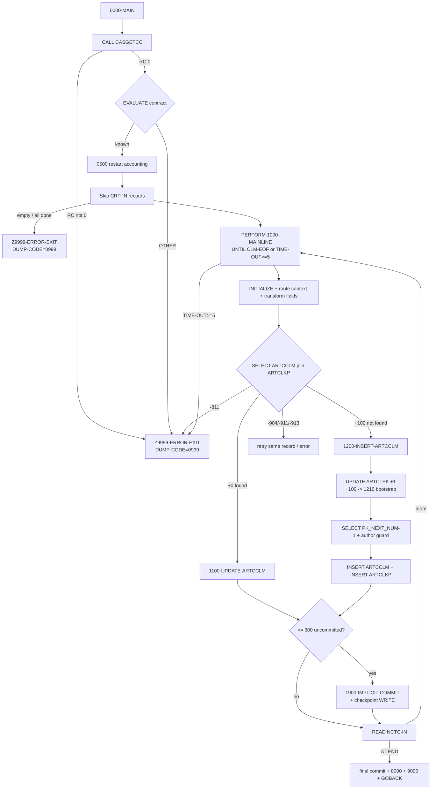

# CASNCTD7 — Program Logic Documentation

> **Source-availability notice (read first).**
> This documentation analyzes the COBOL program **`CASNCTD7.txt`** and its dependent copybooks as
> they exist in this repository on branch **`Job-details`** (commit `2d32802`). The program is
> **not** present in the working tree of the current branch
> (`copilot/generate-documentation-cobol-program`), so — following the established convention used by
> the sibling `CASNCTD9.*` documents — the generated `.md` files are placed at the **repository
> root** while the analyzed source is read from `Job-details`.
>
> **All line numbers below refer to `CASNCTD7.txt`** as stored on `Job-details`
> (retrievable with `git show origin/Job-details:CASNCTD7.txt`).
>
> Unlike some sibling programs, the input-record copybook and the three DB2 DCLGENs **are available**
> in this repository (see §1.1), so field data types, lengths, and byte offsets are **proven**, not
> inferred. The `PMONITOR` copybook, `SQLCA`, JCL, and the called load modules are **not** available
> and are handled per the "do not hallucinate" rule.

---

# 1. Analysis Method

## 1.1 Artifacts inspected

| Artifact | Status | Evidence |
|---|---|---|
| `CASNCTD7.txt` (COBOL source, 1,400 lines) | **Available** (`Job-details`) | `IDENTIFICATION DIVISION. PROGRAM-ID. CASNCTD7.` (lines 1-2) |
| Copybook `NCTCLMS4` (input claim record) | **Available** (`Job-details`) | `COPY NCTCLMS4 REPLACING ==(PREFIX)== BY ==CLM==` (line 86) |
| DCLGEN `ARTCCLM` (claim table, `CCLM-*`) | **Available** (`Job-details`) | `EXEC SQL INCLUDE ARTCCLM` (line 207) |
| DCLGEN `ARTCLKP` (claim-lookup table, `CLKP-*`) | **Available** (`Job-details`) | `EXEC SQL INCLUDE ARTCLKP` (line 209) |
| DCLGEN `CARTCTPK` (primary-key table `ARTCTPK`, `CTPK-*`) | **Available** (`Job-details`) | `EXEC SQL INCLUDE CARTCTPK` (line 205) |
| Subprogram `CASGETCC` (source) | **Available** (`Job-details`) | `CALL WS-CASGETCC USING CASGETCC-CALLING-AREA` (line 235) |
| Copybook `PMONITOR` (`PMONITOR-*` host vars) | **Referenced, not available** | `EXEC SQL INCLUDE PMONITOR` (lines 211-213) |
| `SQLCA` (DB2 comm area, `SQLCODE`) | **Referenced, not available** (standard IBM) | `EXEC SQL INCLUDE SQLCA` (line 202) |
| Called modules `DSNTIAR`, `ILBOABN0` | **Referenced, not available** (system) | `CALL` (lines 1379, 1399) |
| Called module `DPSGTCON` | **Present only as comments** | lines 228-233 (commented out) |
| JCL / control cards / GDG definitions | **Not available** | No JCL exists in the repository |

## 1.2 How logic was traced
- Read every division top-to-bottom: `IDENTIFICATION` (1-69), `ENVIRONMENT`/`FILE-CONTROL` (70-75),
  `DATA`/`FILE SECTION` (77-94), `WORKING-STORAGE` (96-215), `PROCEDURE DIVISION` (217-1400).
- Followed every `PERFORM`, `GO TO`, `EVALUATE`, and `IF` to establish paragraph sequencing.
- Traced each embedded `EXEC SQL` statement (the seven executable statements are numbered `1.`–`7.` in
  the source margin) and its `SQLCODE` handling.
- Cross-checked every host-variable name against the **available** DCLGENs (`ARTCCLM`, `ARTCLKP`,
  `CARTCTPK`) and the input copybook (`NCTCLMS4`), so column data types are cited from source.
- Verified the input record length: the `NCTCLMS4` fields sum to **306** bytes, matching
  `FD NCTC-IN … RECORD CONTAINS 306 CHARACTERS` (line 83). See §4.1.

## 1.3 Proven vs inferred handling
- **Proven** = directly present in `CASNCTD7`, in an available copybook/DCLGEN, or in `CASGETCC`.
- **Inferred from structure/usage** = deduced from how a field is used where the defining member is
  absent (e.g., all `PMONITOR-*` host variables).
- **DB2-standard (external knowledge)** = the meanings of `SQLCODE` values (`+100` = not found,
  `-811` = >1 row, `-904` = resource unavailable, `-911`/`-913` = deadlock/timeout). These are
  labelled as external, not as claims made by the source.
- **Not proven / Open question** = cannot be established from the present source (e.g., JCL DD-to-
  dataset bindings, GDG policy, how abend codes map to step return codes, `PMONITOR` field layout).

## 1.4 Limitations
1. **`PMONITOR` copybook absent.** The layout of the `PMONITOR-*` host variables (used in
   `8000-P-MONITOR`) is not in the repo; those fields are documented by usage only.
2. **No JCL / GDG / control-card definitions.** DD-name to dataset bindings, GDG generation policy,
   and the operational meaning of user abend codes `3645`/`0999`/`0998` are **not provable** from
   source.
3. **Called programs are black boxes** at run time. `CASGETCC` source *is* available (so its output
   contract is documented in §3.4), but `DSNTIAR`, `ILBOABN0`, and the modules `CASGETCC` itself
   calls (`DPSGTJOB`, copybook `CLNTPNCH`) are not.
4. Comments in the source were used **only** where consistent with executed code, and are labelled as
   comments when cited.

---

# 2. Program Overview

## 2.1 Identity (proven)

| Attribute | Value | Evidence |
|---|---|---|
| `PROGRAM-ID` | `CASNCTD7` | line 2 |
| Author / Installation | `LLL` / `HMS` | lines 3-4 |
| Date written | `10/07/2003` | line 5 |
| Latest change tag | `0029` (03/22/23, add context `CASCASTN` for TN) | lines 67-68 |
| Prior notable change | `11/6/15 … CLONE OF CASNCTD2` | line 35 |

## 2.2 Purpose (proven from header comments + code)
The program header states: *"THIS PGM WILL UPDATE DB2 TABLES FROM THE NEW CURRENT GDG OF PCFCASE
CLAIMS FILE (NCTCLMS1 300 FILE)."* (lines 6-8). The executable code confirms it reads a sequential
claims file and **inserts or updates** rows in DB2 claim tables.

DB2 tables named in the header (lines 10-12) and confirmed in code:
- `DB2AR01.ARTCTPK` — **primary-key (sequence) table** (`UPDATE ARTCTPK … PK_NEXT_NUM = PK_NEXT_NUM + 1`, lines 823-829).
- `ARTCCLM` — **claim table** (`SELECT`/`UPDATE`/`INSERT`, lines 708-719, 767-796, 914-975).
- `ARTCLKP` — **claim lookup table** (`INSERT`, lines 1039-1060; also part of the driving `SELECT` join).

Also updated: `MISC.P_MONITOR` — **process-monitor table** (lines 1189-1260).

## 2.3 Technical role & invocation style (proven)
- **Batch program / DB2 load step.** It terminates normally with `GOBACK` (line 323) and forces a
  user abend with `CALL 'ILBOABN0' USING DUMP-CODE` (line 1399) on error — consistent with a **batch
  program run as a JCL job step**. It is **not** CICS (no `EXEC CICS`).
- Whether `CASNCTD7` is the top-level step program or is itself `CALL`ed is **not proven** (no JCL).
  It reads one input file, maintains three DB2 claim tables, writes one control/restart file, updates
  a monitor table, and abends with a user completion code on error.

## 2.4 Upstream / downstream dependencies

| Direction | Dependency | Evidence | Proof level |
|---|---|---|---|
| Upstream | Sequential "PCFCASE claims" file on DD `NCTCLMI` | `SELECT NCTC-IN ASSIGN TO NCTCLMI` (line 73) | **Proven** (DD + 306-byte layout) |
| Upstream | 3-byte contract id from subprogram `CASGETCC` | `CALL WS-CASGETCC` (line 235) | **Proven** call and contract-mapping table |
| Up/Down | Control/restart file on DD `DB2CNTLO` | `SELECT CNTL-IO ASSIGN TO DB2CNTLO` (line 75); read in `0500`, written in `1900` | **Proven** |
| Downstream | DB2 tables `ARTCTPK`, `ARTCCLM`, `ARTCLKP` | SQL statements | **Proven** |
| Downstream | `MISC.P_MONITOR` monitoring rows | SQL updates (1189-1260) | **Proven** |
| Downstream | DB2 error formatter `DSNTIAR`; abend `ILBOABN0` | `CALL` (1379, 1399) | **Proven** call |

---

# 3. Inputs, Outputs, and Dependencies

## 3.1 Files (`SELECT` / `FD`)

| Logical name | DD (ASSIGN) | Open mode(s) | FD facts | Record area |
|---|---|---|---|---|
| `NCTC-IN` | `NCTCLMI` | `INPUT` (line 287) | `LABEL RECORDS STANDARD`, `BLOCK 0`, `RECORDING MODE F`, `RECORD CONTAINS 306 CHARACTERS` (79-84) | `01 NCTCLAIM-RECORD` filled by `COPY NCTCLMS4 REPLACING ==(PREFIX)== BY ==CLM==` (85-86) |
| `CNTL-IO` | `DB2CNTLO` | `INPUT` then `OUTPUT` (283, 289) | `LABEL RECORDS STANDARD`, `BLOCK 0`, `RECORDING MODE F` (89-93) | `01 CNTL-RECORD PIC X(38)` (94) |

> **Proven quirk — control record size.** The write buffer `WS-CONTROL-RECORD` (lines 151-156) is
> `CNTL-PROC-FLAG X(01)` + `NUM-REC-OUT PIC ZZZ,ZZZ,ZZ9` (11) + `FILLER X(02)` + `WS-CURRENT-TIMESTAMP
> X(26)` = **40 bytes**, but the FD record `CNTL-RECORD` is `PIC X(38)`. `WRITE CNTL-RECORD FROM
> WS-CONTROL-RECORD` (line 1164) therefore truncates the **low-order 2 bytes of the timestamp**;
> `READ … INTO WS-CONTROL-RECORD` (326, 342) pads those 2 bytes with spaces. Only `CNTL-PROC-FLAG`
> and `NUM-REC-OUT` are re-read on restart (§5.3), so the truncation does not affect restart accounting.
> *(Byte counts proven; operational impact assessed as none.)*

## 3.2 DB2 objects

| Object | Role | Operations in program | Evidence |
|---|---|---|---|
| `ARTCCLM` | Claim detail | `SELECT` (join), `UPDATE`, `INSERT` | 708-719, 767-796, 914-975 |
| `ARTCLKP` | Claim ↔ case lookup | `SELECT` (join), `INSERT` | 708-719, 1039-1060 |
| `ARTCTPK` | Per-context claim sequence (primary-key generator) | `UPDATE +1`, `SELECT next-1`, `INSERT` (bootstrap) | 823-829, 858-868, 1093-1110 |
| `MISC.P_MONITOR` | Run/monitor telemetry | `UPDATE` (general + per context) | 1189-1260 |
| `SYSIBM.SYSDUMMY1` | Timestamp source | `SELECT DISTINCT(CURRENT TIMESTAMP)` | 1147-1151 |

There is **no COBOL `SORT`/`MERGE`** verb, and **no file `DELETE`/`REWRITE`**. The only file output
verb is `WRITE CNTL-RECORD` (line 1164). All claim-level insert/update ordering is delegated to DB2.

## 3.3 Copybooks / includes

| Member | Purpose (per usage) | Availability |
|---|---|---|
| `NCTCLMS4` | Input claim record (`CLM-*` fields, 306 bytes) | **Available** (`Job-details`) |
| `ARTCCLM` | Host vars for `ARTCCLM` (`CCLM-*`, group `DCLARTCCLM`, 31 columns) | **Available** |
| `ARTCLKP` | Host vars for `ARTCLKP` (`CLKP-*`, group `DCLARTCLKP`, 12 columns) | **Available** |
| `CARTCTPK` | Host vars for `ARTCTPK` (`CTPK-*`, group `DCLARTCTPK`, 8 columns) | **Available** |
| `SQLCA` | DB2 status area (`SQLCODE`) | Not available (standard IBM) |
| `PMONITOR` | Host vars for `P_MONITOR` (`PMONITOR-*`) | **Not available** |

## 3.4 Called programs

| Program | How invoked | Interface used | Notes |
|---|---|---|---|
| `CASGETCC` | `CALL WS-CASGETCC USING CASGETCC-CALLING-AREA` (235); `WS-CASGETCC PIC X(08) VALUE 'CASGETCC'` (166) | 80-byte area: `HMS-3BYTE-CONTRACT-NUM X(03)` + 76 filler + `CASGETCC-RETURN-CODE X(01)` (167-172) | Supplies the 3-byte contract/client id that drives all routing. `'0'` = success (238). Source available: it calls `DPSGTJOB`, reads the job accounting code, and `EVALUATE`s it to a contract number (`CASGETCC.txt` lines 110-227). |
| `DPSGTCON` | **Commented out** (228-233; area 159-164) | — | Superseded by `CASGETCC` (change `0007`). Not executed. |
| `DSNTIAR` | `CALL 'DSNTIAR' USING SQLCA ERROR-MESSAGE ERROR-LINE-LENGTH` (1379-1381) | Formats `SQLCA` into `ERROR-MESSAGE` lines | Error path only. |
| `ILBOABN0` | `CALL 'ILBOABN0' USING DUMP-CODE` (1399) | `DUMP-CODE` | Forces user abend with the code in `DUMP-CODE`. |

## 3.5 Control-card / profile dependencies
- **Restart control file** `DB2CNTLO` (`CNTL-IO`): carries prior-run committed counts; drives how
  many input records are skipped on restart (§5.3, §5.4). **Proven.**
- `CASNCTD7` has **no** `ARTSPRF`/preferences cursor and **no** RX-encounter exclusion table (contrast
  with the cloned relative `CASNCTD9`). Verified: no `ARTSPRF`, `PREFERENCE`, or exclusion logic in
  source.

## 3.6 Important status codes & flags

| Name | Definition | Meaning in program | Evidence |
|---|---|---|---|
| `DUMP-CODE` | `PIC S9(04) COMP VALUE +3645` | User abend code passed to `ILBOABN0`. Default `3645`; overridden to `+0999` (contract errors) or `+0998` (no data) | 98, 231, 240, 277, 302, 1399 |
| `CLM-EOF` (88 of `WS-CLM-EOF-FLAG`) | `VALUE 'Y'` | Input-file EOF; ends main loop | 100-101, 309, 760 |
| `CNTL-EOF` (88 of `WS-CNTL-EOF-FLAG`) | `VALUE 'Y'` | Control-file EOF | 102-103, 331, 343 |
| `SQL-COMMIT-FREQ` | `PIC S9(05) COMP-3 VALUE +300` | Commit every 300 uncommitted DB2 ops | 104, 755 |
| `SQL-NOT-COMMITED-YET-CTR` | `PIC S9(05) COMP-3` | Uncommitted DB2 ops in current LUW | 178, 752, 755, 313 |
| `TIME-OUT-CTR` | `PIC S9(01) COMP-3` | DB2 contention retry counter; `>= 5` ⇒ abort | 187, 309-311, 738 |
| `SQLCODE` | from `SQLCA` | DB2 result of every `EXEC SQL` | throughout |

DB2 `SQLCODE` values the program explicitly branches on: `+0`, `+100`, `-811`, `-904`, `-911`,
`-913` (see §7). Their standard IBM meanings are noted as **DB2-standard** where used.

---

# 4. Data Structures and Important Fields

## 4.1 Input record `NCTCLAIM-RECORD` — copybook `NCTCLMS4`, prefix `CLM` (proven, 306 bytes)

Layout with **proven** PIC clauses (from `NCTCLMS4`) and computed byte offsets (sum = 306 = FD length):

| # | Field (`CLM-`) | PIC | Len | Bytes | Used by logic? |
|---|---|---|---|---|---|
| 1 | `RECIPIENT-ID-NUM` | `X(20)` | 20 | 1-20 | ✔ → `RECIP_MA_NUM` (558-562) |
| 2 | `HMS-CASE-KEY` | `9(09)` | 9 | 21-29 | ✔ → `CLKP-CASE-ID` (541) |
| 3 | `ICN` | `X(20)` | 20 | 30-49 | ✔ → `ICN_NUM` (536-539) + match key |
| 4 | `FORMER-ICN` | `X(20)` | 20 | 50-69 | ✔ → `PREV_ICN_NUM` (552-555) |
| 5 | `CLAIM-STATUS` | `X(01)` | 1 | 70 | ✔ → `CLMST_RF` (573-574) + match key |
| 6 | `TRANSACTION-TYPE` | `X(01)` | 1 | 71 | ✔ → `TRNTP_RF` (576-577) |
| 7 | `CLAIM-TYPE` | `X(03)` | 3 | 72-74 | ✔ **drives** NDC-vs-ICD9P branch (615) + `CLMTP_RF` |
| 8 | `UNITS-OF-SERVICE` | `X(05)` | 5 | 75-79 | ✔ → `UNITS_NUM` (584-587) |
| 9 | `CHARGE-AMT` | `Z(06)9.99-` | 11 | 80-90 | ✔ → `CHARGE_AMT` (589-590) |
| 10 | `PAID-AMT` | `Z(06)9.99-` | 11 | 91-101 | ✔ → `PAID_AMT` (591-592) |
| 11 | `DOR-A` (`CC 9(02)`+`DOR 9(06)`) | 8 digits | 8 | 102-109 | ✔ → `REMIT_DT` (594-598) |
| 12 | `SERVICE-DATE-FROM-A` | 8 digits | 8 | 110-117 | ✔ → `SERVICE_FROM_DT` (600-607) |
| 13 | `SERVICE-DATE-TO-A` | 8 digits | 8 | 118-125 | ✔ → `SERVICE_TO_DT` (609-613) |
| 14 | `LAST-NAME` | `X(12)` | 12 | 126-137 | ✘ **defined only** (not referenced) |
| 15 | `FIRST-NAME` | `X(07)` | 7 | 138-144 | ✘ **defined only** |
| 16 | `MI` | `X(01)` | 1 | 145 | ✘ **defined only** |
| 17 | `PROVIDER-NUM` | `X(15)` | 15 | 146-160 | ✔ → `PROVIDER_ID` (568-571) |
| 18 | `PROVIDER-NAME` | `X(35)` | 35 | 161-195 | ✘ **defined only** |
| 19 | `HMS-CLIENT-ID` | `X(06)` | 6 | 196-201 | ✔ **drives** multi-context routing (368-521) |
| 20 | `SVC-CODE` | `X(11)` | 11 | 202-212 | ✔ → `NDCCD_RF` or `ICD9P_RF` (615-629) |
| 21 | `SVC-DESC` | `X(35)` | 35 | 213-247 | ✘ **defined only** |
| 22 | `PRIMARY-DIAG-CODE` | `X(07)` | 7 | 248-254 | ✔ → `ICD9D_RF` (reformatted, 631-655) |
| 23 | `PRIMARY-DIAG-DESC` | `X(35)` | 35 | 255-289 | ✘ **defined only** |
| 24 | `SECOND-DIAG-CODE` | `X(07)` | 7 | 290-296 | ✔ → `ICD9D_2ND_RF` (657-681) |
| 25 | `CREATE-SOURCE` | `X(02)` | 2 | 297-298 | ✔ **drives** `CREATE_SOURCE_NM` map (683-688) |
| 26 | `FILLER` | `X(02)` | 2 | 299-300 | — |
| 27 | `USER-RELATED` | `X(01)` | 1 | 301 | ✘ **defined only** |
| 28 | `CDE-ICD-VERSION` | `X(02)` | 2 | 302-303 | ✔ → `ICD_VERSION` (690-693) |
| 29 | `AGENCY-CODE` | `X(02)` | 2 | 304-305 | ✔ → `AGENCY_CD` (695-698) |
| 30 | `SYSTEM-RELATED` | `X(01)` | 1 | 306 | ✘ **defined only** |

> **Proven "defined-only" fields.** `LAST-NAME`, `FIRST-NAME`, `MI`, `PROVIDER-NAME`, `SVC-DESC`,
> `PRIMARY-DIAG-DESC`, `USER-RELATED`, `SYSTEM-RELATED` are part of the record but are **never
> referenced** anywhere in `CASNCTD7` (verified by name search). The program propagates only coded
> identifiers/amounts/dates to DB2 and drops the descriptive name/description text.

## 4.2 Routing / context fields (WORKING-STORAGE)

| Field | PIC / source | Role | Drives behavior? |
|---|---|---|---|
| `HMS-3BYTE-CONTRACT-NUM` | `X(03)` (in `CASGETCC-CALLING-AREA`, 168) | 3-byte contract/client id from `CASGETCC` | **Yes** — main `EVALUATE` (246-279) and multiple `IF`s |
| `WS-CONTEXT-CD` | `X(16)` (112) | Resolved DB2 context code | **Yes** — persisted to all 3 tables; counted for monitor |
| `WS-CONTEXT-CD-1 … -5` | `X(16)` (113-117) | Distinct context codes seen (for counting/monitor) | Yes — counter routing (980-1014) |
| `WS-CONTEXT-CD6` | `X(06)` (118) | First-6 client-id overlay for multi-context contracts | **Yes** (373-374) |
| `WS-LAST-UPDATE-NM` | `X(08)` (119) | Update-author stamp per contract | **Yes** — written to tables; concurrency check (902) |
| `WS-UNSTRING-T` / `WS-UNSTRING-L` | `X(20)` / `S9(4) COMP` (120-121) | Work fields for context `UNSTRING` (text + length) | Yes (523-534) |

## 4.3 Amount / date / diagnosis helpers (WORKING-STORAGE)

| Field | PIC | Role |
|---|---|---|
| `WS-DE-EDIT` | `S9(07)V99` (122) | De-edits display amounts back to numeric before packing (589-592) |
| `WK-DIAG-CODE` | `X(7)` (123) | Work copy of a diagnosis code |
| `WS-DIAG-CODE-4` REDEFINES → `-41 X(3)`, `FILLER X`, `-42 X(3)` (124-127) | redefine | Splits `nnn.nn` around the `.` |
| `WS-DIAG-CODE-412` → `-411 X(3)`, `-422 X(3)`; `WS-DIAG-CODE-N` REDEFINES as `X(6)` (128-132) | redefine | Rejoins the two 3-char halves without the `.` |
| `COUNT-M` | `S9(3) COMP-3` (133) | Count of characters before the first `.` |
| `WS-STATUS-TXT` | `X(20) VALUE 'SUCCESS'` (134) | Monitor status text (`SUCCESS`/`FAILURE`) |

## 4.4 Counters (WORKING-STORAGE, `WS-COUNTERS` 174-192)

| Field | PIC | Meaning |
|---|---|---|
| `REC-READ-CTR` | `S9(07) COMP-3` (175) | Input records read (incl. skipped on restart) |
| `SQL-INSERT-CTR` / `SQL-INSERT-COMMITTED-CTR` | `S9(09) COMP-3` (176, 179) | `ARTCCLM` inserts in LUW / committed total |
| `SQL-UPDATE-CTR` / `SQL-UPDATE-COMMITTED-CTR` | `S9(07) COMP-3` (177, 185) | `ARTCCLM` updates in LUW / committed total |
| `SQL-NOT-COMMITED-YET-CTR` | `S9(05) COMP-3` (178) | Uncommitted ops in current LUW; commit trigger |
| `WS-CONTEXT-CD-1-CNT … -5-CNT` | `S9(12) COMP-3` (180-184) | Per-context insert counts (for `P_MONITOR`) |
| `SQL-TOT-COMMITTED-CTR` | `S9(07) COMP-3` (186) | Total committed — written to control record |
| `TIME-OUT-CTR` | `S9(01) COMP-3` (187) | DB2 contention retry counter |
| `WS-CNTL-RECS-OUT / -HOLD / -TOT` | `S9(07) COMP-3` (107-109) | Restart accounting (§5.3) |
| `CRP-IN` | `S9(07) COMP-3` (110) | Restart "skip count + 1" loop bound (290) |

## 4.5 DB2 host-variable groups (from **available** DCLGENs — proven column types)

**`DCLARTCCLM` / `CCLM-*`** (`ARTCCLM`, 31 columns). Columns written by this program and their DB2
types:

| Column | DB2 type | Host var | Source of value |
|---|---|---|---|
| `CONTEXT_CD` | `VARCHAR(16) NOT NULL` | `CCLM-CONTEXT-CD` (-T/-L) | `WS-CONTEXT-CD` unstrung (525-534) |
| `CLAIM_ID` | `DECIMAL(12,0) NOT NULL` | `CCLM-CLAIM-ID` | `CTPK-PK-NEXT-NUM` (911) / SELECT target (710) |
| `ICN_NUM` | `VARCHAR(20) NOT NULL` | `CCLM-ICN-NUM` | `CLM-ICN` (536-539) |
| `PREV_ICN_NUM` | `VARCHAR(20)` | `CCLM-PREV-ICN-NUM` | `CLM-FORMER-ICN` (552-555) |
| `RECIP_MA_NUM` | `VARCHAR(20)` | `CCLM-RECIP-MA-NUM` | `CLM-RECIPIENT-ID-NUM` (558-562) |
| `PROVIDER_ID` | `VARCHAR(15) NOT NULL` | `CCLM-PROVIDER-ID` | `CLM-PROVIDER-NUM` (568-571) |
| `CLMST_RF` | `VARCHAR(10)` | `CCLM-CLMST-RF` | `CLM-CLAIM-STATUS` (len 1) (573-574) |
| `TRNTP_RF` | `VARCHAR(10)` | `CCLM-TRNTP-RF` | `CLM-TRANSACTION-TYPE` (len 1) (576-577) |
| `CLMTP_RF` | `VARCHAR(10)` | `CCLM-CLMTP-RF` | `CLM-CLAIM-TYPE` (579-582) |
| `UNITS_NUM` | `VARCHAR(10)` | `CCLM-UNITS-NUM` | `CLM-UNITS-OF-SERVICE` (584-587) |
| `CHARGE_AMT` | `DECIMAL(15,2)` | `CCLM-CHARGE-AMT` | `CLM-CHARGE-AMT` via `WS-DE-EDIT` (589-590) |
| `PAID_AMT` | `DECIMAL(15,2)` | `CCLM-PAID-AMT` | `CLM-PAID-AMT` via `WS-DE-EDIT` (591-592) |
| `REMIT_DT` | `DATE` | `CCLM-REMIT-DT` `X(10)` | `CLM-DOR-A` reformatted (594-598) |
| `SERVICE_FROM_DT` | `DATE` | `CCLM-SERVICE-FROM-DT` | `CLM-SERVICE-DATE-FROM-A` (600-607) |
| `SERVICE_TO_DT` | `DATE` | `CCLM-SERVICE-TO-DT` | `CLM-SERVICE-DATE-TO-A` (609-613) |
| `ICD9P_RF` | `VARCHAR(10)` | `CCLM-ICD9P-RF` | `CLM-SVC-CODE` when type ≠ `'12'` (capped 10) (621-628) |
| `ICD9D_RF` | `VARCHAR(10)` | `CCLM-ICD9D-RF` | `CLM-PRIMARY-DIAG-CODE` reformatted (631-655) |
| `ICD9D_2ND_RF` | `VARCHAR(10)` | `CCLM-ICD9D-2ND-RF` | `CLM-SECOND-DIAG-CODE` reformatted (657-681) |
| `NDCCD_RF` | `VARCHAR(15)` | `CCLM-NDCCD-RF` | `CLM-SVC-CODE` when type = `'12'` (616-619) |
| `LAST_UPDATE_NM` | `VARCHAR(8) NOT NULL` | `CCLM-LAST-UPDATE-NM` | `WS-LAST-UPDATE-NM` (543-547) |
| `LAST_UPDATE_DTM` | `TIMESTAMP NOT NULL` | — | `CURRENT TIMESTAMP` literal (787, 967) |
| `CREATE_SOURCE_NM` | `CHAR(20)` | `CCLM-CREATE-SOURCE-NM` | `CLM-CREATE-SOURCE` map (683-688) |
| `ICD_VERSION` | `VARCHAR(2)` | `CCLM-ICD-VERSION` | `CLM-CDE-ICD-VERSION` (690-693) |
| `ALT_CLIENT_CD` | `CHAR(5)` | `CCLM-ALT-CLIENT-CD` | `'535'` if contract 535 else spaces (700-704) |
| `AGENCY_CD` | `VARCHAR(2)` | `CCLM-AGENCY-CD` | `CLM-AGENCY-CODE` (695-698) |

> `ARTCCLM` columns **present in the DCLGEN but never written** by `CASNCTD7`: `CARRIER_CD`,
> `LOGICAL_DELETE_IND`, `ERROR_CD`, `COUNTY_CD`, `ENC_IND`, `MCO_CD`, `RX_WRITTEN_DT`. The DCLGEN's
> `CREATE_NM`/`CREATE_DTM` are **not** columns; the program's commented-out `CREATE_NM`/`CREATE_DTM`
> (942-943, 972-973) are inactive. *(Contrast with `CASNCTD9`, which does populate `RX_WRITTEN_DT`
> and `COUNTY_CD`.)*

**`DCLARTCLKP` / `CLKP-*`** (`ARTCLKP`, 12 columns) — written columns: `CONTEXT_CD` (`VARCHAR(16)`),
`CASE_ID` (`DECIMAL(12,0)`, from `CLM-HMS-CASE-KEY`), `CLAIM_ID` (`DECIMAL(12,0)`), `RELATE_IND`
(`CHAR(1)`, literal `'0'`), `LAST_UPDATE_NM`, `LAST_UPDATE_DTM` (`CURRENT TIMESTAMP`),
`IS_AUTO_CHECKED` (`CHAR(1)`, literal `'N'`), `CREATE_NM` (from `CLKP-CREATE-NM`), `CREATE_DTM`
(`CURRENT TIMESTAMP`). Columns not written: `RELATE_PRCNT`, `DISPUTE_CLM_IND`, `COMMENTS`.

**`DCLARTCTPK` / `CTPK-*`** (`ARTCTPK`, 8 columns) — `CONTEXT_CD` (`VARCHAR(16)`), `PK_TYPE_CD`
(`VARCHAR(8)`, literal `'CLM'`), `PK_DSC` (`VARCHAR(255)`, literal `'CASE TRACKING SYSTEM CLAIM'`),
`PK_MASK_TXT` (`CHAR(16)`, from `CTPK-PK-MASK-TXT`), `PK_NEXT_NUM` (`DECIMAL(16,0)`), `LAST_UPDATE_NM`,
`LAST_UPDATE_DTM`. Column not written by program logic: `LOCK_IND`.

**`PMONITOR-*`** — host vars for `MISC.P_MONITOR` (`PMONITOR-STATUS-TXT` with `-LEN`/`-TEXT`,
`PMONITOR-STATUS-TXT-LEN`, etc.). Copybook **absent**; documented by usage only (§5.10).

## 4.6 Key match / update / sequence keys (proven from SQL)

| Purpose | Keys | Evidence |
|---|---|---|
| Driving **match** (exists?) | `ARTCCLM`: `CONTEXT_CD`, `ICN_NUM`, `CLMST_RF`; `ARTCLKP`: `CONTEXT_CD`, `CASE_ID`; join `CONTEXT_CD` + `CLAIM_ID` | 712-718 |
| **UPDATE** key | `ARTCCLM`: `CONTEXT_CD`, `CLAIM_ID`, `ICN_NUM` | 793-795 |
| **Sequence** key | `ARTCTPK`: `CONTEXT_CD`, `PK_TYPE_CD='CLM'` | 827-828, 866-867 |
| **P_MONITOR** key | `CLIENT_CD` (= contract), `CONTEXT_CD`, `PROCESS_NM LIKE 'CLKP_LOAD_DURATION_%'` | 1194-1195, 1204-1206 |

---

# 5. Processing Logic

Paragraph inventory (proven): `0000-MAIN`, `0500-CREATE-INFILE-CRP`, `1000-MAINLINE`,
`1100-UPDATE-ARTCCLM`, `1200-INSERT-ARTCCLM`, `1210-INSERT-ARTCTPK`, `1900-IMPLICIT-COMMIT`,
`8000-P-MONITOR`, `9000-TERMINATION`, `9100-DISPLAY-COUNTERS`, `Z9999-ERROR-EXIT`.
(`8100-P-MONITOR-INS` is fully commented out, lines 1287-1333.)

## 5.1 Initialization & contract resolution — `0000-MAIN` (218-323)
1. Display program banner using `FUNCTION WHEN-COMPILED` reformatted (219-227).
2. `CALL WS-CASGETCC ('CASGETCC')` to obtain `HMS-3BYTE-CONTRACT-NUM` (235-236). If
   `CASGETCC-RETURN-CODE NOT = '0'`, set `DUMP-CODE = +0999` and `GO TO Z9999-ERROR-EXIT` (238-242).
3. **`EVALUATE HMS-3BYTE-CONTRACT-NUM`** (246-279) maps contract → (`WS-CONTEXT-CD`,
   `WS-LAST-UPDATE-NM`):

   | Contract | `WS-CONTEXT-CD` | `WS-LAST-UPDATE-NM` | Note |
   |---|---|---|---|
   | `320` | `CTSCASNY` | `WNYCDF40` | NY (further sub-routed, §5.5.1) |
   | `300` | `CTSCASTST` | `WTTCDF40` | tagged `TEST` in source (line 249) |
   | `326` | `CTSCASCO` | `WCOCDF40` | CO (multi-context overlay, §5.5.1) |
   | `341` | `CTSCASOH` | `WOHCDF40` | OH |
   | `535` | `CTSCASOH` | `WCXCDF40` | OH CareSource (`ALT_CLIENT_CD='535'`) |
   | `313` | `CTSCASFL` | `WFLCDF40` | FL (further sub-routed) |
   | `319` | `CTSCASCT` | `WCTCDF40` | CT |
   | `317` | `CTSWRCCA` | `WCACDF40` | CA |
   | `590` | `CTSCASAL` | `WALCDF40` | AL (multi-context overlay) |
   | `330` | `CTSCASAR` | `WARCDF40` | AR |
   | `358` | `CTSCASNV` | `WNVCDF40` | NV (further sub-routed) |
   | `359` | `CTSCASNM` | `WNMCDF40` | NM (multi-context overlay) |
   | `645` | `CTSCASWV` | `WWVCDF40` | WV (further sub-routed) |
   | `564` | `CTSCASTN` | `WWVCDF40` | TN — **note the author name is `WWVCDF40`** (line 274), the same literal as WV; recorded as-is from source |
   | **OTHER** | *(none)* | — | `DUMP-CODE=+0999`, `GO TO Z9999-ERROR-EXIT` (275-278) |

4. Open the restart file and perform restart accounting (§5.3-§5.4), then run the main loop (§5.5).

## 5.2 (No preferences/exclusion phase)
`CASNCTD7` has **no** `0600`-style preferences load and **no** RX-encounter exclusion — those exist
only in the cloned relative `CASNCTD9`. Every claim that reaches the insert path is inserted (subject
only to DB2 outcome). *(Proven by absence; verified no `ARTSPRF`/exclusion code.)*

## 5.3 Restart accounting — `0500-CREATE-INFILE-CRP` (283-357)
- `OPEN INPUT CNTL-IO`; `PERFORM 0500-CREATE-INFILE-CRP`; `CLOSE CNTL-IO` (283-285).
- `0500` reads the first control record `INTO WS-CONTROL-RECORD`; `AT END` displays *"DB2 CONTROL FILE
  IS EMPTY"* and exits (326-330).
- `PERFORM UNTIL CNTL-EOF` (331-346): for records with `CNTL-PROC-FLAG = '-'`, move `NUM-REC-OUT` into
  `WS-CNTL-RECS-OUT`; if it is greater than `WS-CNTL-RECS-OUT-HOLD`, keep it in `-HOLD`; otherwise add
  `-HOLD` into `WS-CNTL-RECS-OUT-TOT` and reset `-HOLD`. `AT END` adds the final `-HOLD` into `-TOT`.
  Net result: `WS-CNTL-RECS-OUT-TOT` = number of input records already committed by prior runs.
- If the last control record's `CNTL-PROC-FLAG = 'N'`, it displays *"BYPASS DB2 CONTROL FILE
  PROCESSING"* (348-350); because the accumulation is guarded by `= '-'`, a `'N'` flag leaves
  `WS-CNTL-RECS-OUT-TOT = 0`, i.e. **no records skipped** (full reprocess). *(Intent inferred from
  structure; not stated in source.)*
- Display *"n PREVIOUSLY PROCESSED RECORDS WILL BE SKIPPED"* (352-356).

## 5.4 Skip previously-processed records (287-306)
- `OPEN INPUT NCTC-IN OUTPUT CNTL-IO` (287-289).
- `COMPUTE CRP-IN = WS-CNTL-RECS-OUT-TOT + 1` (290).
- `PERFORM CRP-IN TIMES: READ NCTC-IN` (291-306):
  - `AT END`: if `REC-READ-CTR = 0` ⇒ *"PCFCASE CLAIMS FILE IS EMPTY"*; else *"ALL n INPUT RECORDS …
    HAVE BEEN PROCESSED PREVIOUSLY"* (294-300). Either way `MOVE +0998 TO DUMP-CODE` and
    `GO TO Z9999-ERROR-EXIT` (302-303).
  - `NOT AT END`: `ADD 1 TO REC-READ-CTR` (304).
- The `+1` leaves the first *unprocessed* record in the buffer so the first `1000-MAINLINE` iteration
  processes it before the next `READ`.

> The `+0998` case is annotated by change `0011` (lines 30-31) as *"RC 0998 GOOD COMPLETION WHEN THERE
> IS NO DATA IN THE INPUT FILE NCTC-IN."* Mechanically the code still routes through
> `Z9999-ERROR-EXIT` (rollback, `P_MONITOR`=`FAILURE`, `ILBOABN0` with `0998`). How `0998` is treated
> as a *good* completion is external (JCL/operations) and **not proven** from source.

## 5.5 Main loop — driver + `1000-MAINLINE` (308-763)
- `PERFORM 1000-MAINLINE THRU 1000-MAINLINE-EXIT UNTIL CLM-EOF OR TIME-OUT-CTR >= 5` (308-309).
- After the loop: if `TIME-OUT-CTR >= 5` ⇒ `GO TO Z9999-ERROR-EXIT` (310-312); if uncommitted work
  remains, final `1900-IMPLICIT-COMMIT` (313-315); set `PMONITOR-STATUS-TXT-LEN=7` and
  `WS-STATUS-TXT='SUCCESS'`, `PERFORM 8000-P-MONITOR` and `9000-TERMINATION`; `CLOSE` files; `GOBACK`
  (316-323).

### 5.5.1 Per-record field preparation (`1000-MAINLINE`, 359-704)
1. `INITIALIZE DCLARTCTPK DCLARTCCLM DCLARTCLKP` (360) — clears all target host vars each cycle.
2. **Multi-context overlay** — `IF HMS-3BYTE-CONTRACT-NUM = '326' OR '590' OR '359' OR '645'`
   (368-375): `MOVE CLM-HMS-CLIENT-ID TO WS-CONTEXT-CD6`, then `WS-CONTEXT-CD6 TO WS-CONTEXT-CD(1:6)`
   — overlays the first 6 chars of the context with the client id (positions 7-8 retain the state
   code from the `EVALUATE` default). *(Note: `313` was removed from this list — line 370 comment.)*
3. **Contract `320` (NY)** — `EVALUATE CLM-HMS-CLIENT-ID` (381-404):
   `CTSCEN→CTSCASEX-NY`, `CTSCCN→CTSCASNYC`, `CTSECN→CTSESTNY`, `CTSEEN→CTSESTEX-NY`,
   **OTHER→`CTSCASNY`**.
4. **Contract `313` (FL)** — `EVALUATE CLM-HMS-CLIENT-ID` (427-450):
   `CTSCAS→CTSCASFL`, `CTSEST→CTSESTFL`, `CTSTRS→CTSTRSFL`, `CTSMST→CTSCASMT-FL`, **OTHER→`CTSCASFL`**.
5. **Contract `358` (NV)** — `EVALUATE CLM-HMS-CLIENT-ID` (455-479):
   `CTSCAS→CTSCASNV`, `CTSEST→CTSESTNV`, `CTSTRS→CTSTRSNV`, `CTSTFR→CTSTFRNV`, **OTHER→`CTSCASNV`**.
6. **Contract `645` (WV)** — `EVALUATE CLM-HMS-CLIENT-ID` (484-504):
   `CTSCAS→CTSCASWV`, `CTSEST→CTSESTWV`, `CTSCHP→CTSCASCH-WV`, **OTHER→`CTSCASWV`**.
7. **Contract `564` (TN)** — `EVALUATE CLM-HMS-CLIENT-ID` (509-521):
   `CTSCAS→CTSCASTN`, **OTHER→`CTSCASTN`**.

   > **Proven sequencing nuance for `645`.** Because `645` appears in **both** the overlay `IF`
   > (step 2) **and** its own `EVALUATE` (step 6), the overlay runs first and is then **fully
   > overwritten** by the `EVALUATE`'s `MOVE … TO WS-CONTEXT-CD`. The overlay therefore has **no net
   > effect for `645`**. For `326`/`590`/`359` (overlay-only, no `EVALUATE`) the overlay result
   > stands: `WS-CONTEXT-CD = <client-id first 6> + <state code in positions 7-8>`; the exact
   > composed value is data-dependent on `CLM-HMS-CLIENT-ID`.

8. `UNSTRING WS-CONTEXT-CD DELIMITED BY ALL SPACES` → text+length into
   `CCLM/CTPK/CLKP CONTEXT-CD` (523-534).
9. Copy/convert input fields into host vars (536-704):
   - `UNSTRING` `CLM-ICN`→`CCLM-ICN-NUM`, `CLM-FORMER-ICN`→`CCLM-PREV-ICN-NUM`,
     `CLM-RECIPIENT-ID-NUM`→`CCLM-RECIP-MA-NUM`, `CLM-PROVIDER-NUM`→`CCLM-PROVIDER-ID`,
     `CLM-CLAIM-TYPE`→`CCLM-CLMTP-RF`, `CLM-UNITS-OF-SERVICE`→`CCLM-UNITS-NUM`,
     `CLM-CDE-ICD-VERSION`→`CCLM-ICD-VERSION`, `CLM-AGENCY-CODE`→`CCLM-AGENCY-CD`.
   - `MOVE CLM-HMS-CASE-KEY TO CLKP-CASE-ID` (541).
   - `WS-LAST-UPDATE-NM` + literal length `8` → `CCLM/CTPK/CLKP LAST-UPDATE-NM` and `CLKP-CREATE-NM`
     (543-550).
   - `CLM-CLAIM-STATUS`→`CCLM-CLMST-RF` (len 1); `CLM-TRANSACTION-TYPE`→`CCLM-TRNTP-RF` (len 1)
     (573-577).
   - **Amounts:** `CLM-CHARGE-AMT`/`CLM-PAID-AMT` → `WS-DE-EDIT (S9(7)V99)` → `CCLM-CHARGE-AMT`/
     `CCLM-PAID-AMT` (589-592). This de-edits the display-formatted input into packed decimal.
   - **Dates** reformat `CCYYMMDD → CCYY-MM-DD`: `CLM-DOR-A`→`CCLM-REMIT-DT`,
     `CLM-SERVICE-DATE-FROM-A`→`CCLM-SERVICE-FROM-DT`, `CLM-SERVICE-DATE-TO-A`→`CCLM-SERVICE-TO-DT`
     (594-613).
   - **Service code split by claim type** (615-629): if `CLM-CLAIM-TYPE = '12'` → `CLM-SVC-CODE` to
     `CCLM-NDCCD-RF` (NDC); else → `CCLM-ICD9P-RF` (procedure), and if `CCLM-ICD9P-RF-L > +10` force
     length to `+10` (626-628, change `0020`).
   - **Diagnosis codes** primary→`CCLM-ICD9D-RF` (631-655) and secondary→`CCLM-ICD9D-2ND-RF`
     (657-681): `INSPECT … TALLYING COUNT-M FOR CHARACTERS BEFORE INITIAL '.'`; if `COUNT-M = 3`,
     strip the `.` by concatenating the two 3-char halves (`WS-DIAG-CODE-N`); else, if `COUNT-M > 0`
     and the first char is a space, left-shift one position; then `UNSTRING`.
   - `EVALUATE CLM-CREATE-SOURCE` (683-688): `'00'→'STANDARD MEDICAID'`, `'01'→'DSS'` into
     `CCLM-CREATE-SOURCE-NM`. **No `WHEN OTHER`** ⇒ any other value leaves it as the `INITIALIZE`d
     value (spaces).
   - `ALT_CLIENT_CD`: if contract `535` → `'535'` else spaces (700-704).

### 5.5.2 Driving decision — does the claim already exist? (708-750)
`EXEC SQL SELECT L.CLAIM_ID INTO :CCLM-CLAIM-ID FROM ARTCCLM C, ARTCLKP L WHERE …` matches on
`C.CONTEXT_CD`, `C.ICN_NUM`, `C.CLMST_RF` (added by change `0012`, line 714), `L.CONTEXT_CD`,
`L.CASE_ID`, plus the `C↔L` join (`CONTEXT_CD` + `CLAIM_ID`). Then `EVALUATE SQLCODE`:

| `SQLCODE` | Action | Lines |
|---|---|---|
| `+0` (found) | `PERFORM 1100-UPDATE-ARTCCLM` | 721-722 |
| `+100` (not found) | `PERFORM 1200-INSERT-ARTCCLM` | 723-724 |
| `-811` (>1 row) | Display "MULTIPLE CLAIM_ID FOR ICN_NUM …"; `GO TO Z9999-ERROR-EXIT` | 725-730 |
| `-904`/`-911`/`-913` | Contention handling (§7.2) | 731-745 |
| OTHER | Error exit | 746-749 |

### 5.5.3 Commit cadence & next read (752-762)
- `ADD +1 TO SQL-NOT-COMMITED-YET-CTR`; if `>= SQL-COMMIT-FREQ (300)` ⇒ `1900-IMPLICIT-COMMIT`.
- `READ NCTC-IN`: `AT END SET CLM-EOF`; `NOT AT END ADD 1 TO REC-READ-CTR`.

## 5.6 Update path — `1100-UPDATE-ARTCCLM` (765-819)
- `UPDATE ARTCCLM SET …` (all claim columns in §4.5, `LAST_UPDATE_DTM = CURRENT TIMESTAMP`)
  `WHERE CONTEXT_CD = :CCLM-CONTEXT-CD AND CLAIM_ID = :CCLM-CLAIM-ID AND ICN_NUM = :CCLM-ICN-NUM`
  (767-796).
- `SQLCODE +0` ⇒ `ADD +1 TO SQL-UPDATE-CTR` (798-799); `-904/-911/-913` contention (800-813); OTHER
  error exit (814-817). **No** `ARTCLKP`/`ARTCTPK` change on the update path.

## 5.7 Insert path — `1200-INSERT-ARTCCLM` (821-1089)
1. **Bump sequence** `UPDATE ARTCTPK SET PK_NEXT_NUM = PK_NEXT_NUM + 1, LAST_UPDATE_NM = :…,
   LAST_UPDATE_DTM = CURRENT TIMESTAMP WHERE CONTEXT_CD = :… AND PK_TYPE_CD = 'CLM'` (823-829).
   `SQLCODE +100` (no PK row yet) ⇒ `PERFORM 1210-INSERT-ARTCTPK` (bootstrap, 833-836).
2. **Read the number to use** `SELECT PK_NEXT_NUM - 1, LAST_UPDATE_NM, LAST_UPDATE_DTM INTO
   :CTPK-PK-NEXT-NUM, :CTPK-LAST-UPDATE-NM, :CTPK-LAST-UPDATE-DTM …` (858-868). Contention here may
   `ROLLBACK` if `TIME-OUT-CTR < 5` (887-889).
3. **Concurrency guard** (902-909): if `CTPK-LAST-UPDATE-NM-TEXT(1:CTPK-LAST-UPDATE-NM-LEN) NOT =
   WS-LAST-UPDATE-NM` ⇒ display *"UNCOMMITTED INTERVENTION TO ARTCTPK"* and `GO TO Z9999-ERROR-EXIT`.
4. `MOVE CTPK-PK-NEXT-NUM TO CCLM-CLAIM-ID CLKP-CLAIM-ID` (911-912).
5. **`INSERT INTO ARTCCLM (…) VALUES (…)`** (914-975), `LAST_UPDATE_DTM = CURRENT TIMESTAMP`. On `+0`:
   `ADD +1 TO SQL-INSERT-CTR` and register `WS-CONTEXT-CD` into the first free `WS-CONTEXT-CD-1..5`
   slot, then increment that slot's counter (980-1014).
6. **`INSERT INTO ARTCLKP (…) VALUES (…)`** with `RELATE_IND='0'`, `IS_AUTO_CHECKED='N'`,
   `CREATE_NM=:CLKP-CREATE-NM`, `CREATE_DTM=CURRENT TIMESTAMP` (1039-1060). *(Unlike `ARTCCLM`, the
   `ARTCLKP` `CREATE_NM`/`CREATE_DTM` columns are **active** here — change `0026`, lines 1047-1048.)*
7. Every insert's `-904/-911/-913` path may `ROLLBACK` + retry (`TIME-OUT-CTR`) or error exit (§7.2).

## 5.8 PK bootstrap — `1210-INSERT-ARTCTPK` (1091-1134)
`INSERT INTO ARTCTPK (CONTEXT_CD, 'CLM', 'CASE TRACKING SYSTEM CLAIM', :CTPK-PK-MASK-TXT, +2,
:CTPK-LAST-UPDATE-NM, CURRENT TIMESTAMP)` — creates the sequence row for a context that has none,
seeding `PK_NEXT_NUM = +2` (so the subsequent `PK_NEXT_NUM - 1 = 1` is the first claim id). On `+0`
displays *"NEW PK_TYPE_CD = 'CLM' INSERTED TO ARTCTPK"* (1112-1114).

> `CTPK-PK-MASK-TXT` is only ever `INITIALIZE`d (line 360, → spaces); the program does not otherwise
> populate it, so the bootstrap inserts `PK_MASK_TXT` = spaces. *(Proven from absence of any other
> `MOVE` to `CTPK-PK-MASK-TXT`.)*

## 5.9 Commit & checkpoint — `1900-IMPLICIT-COMMIT` (1136-1173)
- `EXEC SQL COMMIT`; non-zero ⇒ error exit (1137-1142).
- Get timestamp via `SELECT DISTINCT(CURRENT TIMESTAMP) INTO :WS-CURRENT-TIMESTAMP FROM
  SYSIBM.SYSDUMMY1` (1147-1151); on failure fall back to `MOVE FUNCTION CURRENT-DATE`
  (1153-1159). *(Change `0002`: the earlier `SET :ts = CURRENT TIMESTAMP` did not work on the NT
  server, lines 20-21.)*
- Write restart checkpoint: `MOVE '-' TO CNTL-PROC-FLAG`; `ADD SQL-NOT-COMMITED-YET-CTR TO
  SQL-TOT-COMMITTED-CTR`; `MOVE SQL-TOT-COMMITTED-CTR TO NUM-REC-OUT`; `WRITE CNTL-RECORD FROM
  WS-CONTROL-RECORD` (1161-1164).
- Roll LUW counters into committed totals (1166-1167); zero the LUW counters and `TIME-OUT-CTR`
  (1169-1172).

## 5.10 Monitoring — `8000-P-MONITOR` (1175-1285)
- Displays the five `WS-CONTEXT-CD-n` codes and counts (1176-1185).
- `UPDATE MISC.P_MONITOR SET END_DTM=CURRENT TIMESTAMP, TASK_STEP_TXT='LOAD',
  STATUS_TXT=:PMONITOR-STATUS-TXT, DATA_CNT=0 WHERE CLIENT_CD=:HMS-3BYTE-CONTRACT-NUM AND
  PROCESS_NM LIKE 'CLKP_LOAD_DURATION_%'` (1189-1196) — a general row (`DATA_CNT=0`).
- Then up to five per-context `UPDATE`s (one per distinct `WS-CONTEXT-CD-1..5`, each guarded
  `NOT = SPACES` and `NOT =` the previous code) setting `DATA_CNT` to that context's count
  (1198-1260).
- `EVALUATE SQLCODE`: `+0` ⇒ display "UPDATED P-MONITOR" and `COMMIT` (1262-1267); `+100` ⇒ display
  "P-MONITOR ROW NON-EXISTANT …" (1268-1272); OTHER ⇒ display error and `MOVE 0 TO SQLCODE` — it
  **does not abend** (the `GO TO Z9999-ERROR-EXIT` is commented out, line 1282).

## 5.11 Termination & counters — `9000` / `9100` (1335-1375)
`9100-DISPLAY-COUNTERS` prints: records read (incl. skipped), inserted committed, the five per-context
committed counts, updated committed, and total committed. `9000` adds *"PGM CASNCTD7 NORMAL END"*.

## 5.12 Error exit — `Z9999-ERROR-EXIT` (1377-1400)
If `SQLCODE NOT = +0`, `CALL 'DSNTIAR'` and display 7 formatted lines; `EXEC SQL ROLLBACK`;
`9100-DISPLAY-COUNTERS`; *"PGM CASNCTD7 ABENDED"*; set `WS-STATUS-TXT='FAILURE'`,
`PERFORM 8000-P-MONITOR`; finally `CALL 'ILBOABN0' USING DUMP-CODE` (user abend), then `GOBACK`.

### Control-flow (proven)

---

# 6. Extracted Business Logic

> Expressed as rules; each cites source lines. "Context code" = the CTS context a claim is loaded
> under; "RX claim" = `CLM-CLAIM-TYPE = '12'`.

## 6.1 Routing rules
- **BR-R1** When `CASGETCC` returns the contract id, the system shall map it to a context code and an
  update-author name per the table in §5.1. *(246-279)*
- **BR-R2** When the contract is **not** in the known list, the program shall abend with user code
  `0999`. *(275-278)*
- **BR-R3** When `CASGETCC` returns a non-`'0'` return code, the program shall abend with user code
  `0999`. *(238-242)*
- **BR-R4** For contracts `326`/`590`/`359`/`645`, the first 6 characters of the context code shall be
  taken from `CLM-HMS-CLIENT-ID`; for `645` this overlay is subsequently overwritten by its own
  client-id `EVALUATE`. *(368-375, 484-504)*
- **BR-R5** For NY (`320`), the specific context is chosen by `CLM-HMS-CLIENT-ID`
  (`CTSCEN/CTSCCN/CTSECN/CTSEEN`), defaulting to `CTSCASNY`. *(381-404)*
- **BR-R6** For FL (`313`), the context is chosen by `CLM-HMS-CLIENT-ID`
  (`CTSCAS/CTSEST/CTSTRS/CTSMST`), defaulting to `CTSCASFL`. *(427-450)*
- **BR-R7** For NV (`358`), the context is chosen by `CLM-HMS-CLIENT-ID`
  (`CTSCAS/CTSEST/CTSTRS/CTSTFR`), defaulting to `CTSCASNV`. *(455-479)*
- **BR-R8** For WV (`645`), the context is chosen by `CLM-HMS-CLIENT-ID`
  (`CTSCAS/CTSEST/CTSCHP`), defaulting to `CTSCASWV`. *(484-504)*
- **BR-R9** For TN (`564`), the context is `CTSCASTN` for `CTSCAS` and for any other client id
  (both `WHEN` arms map to `CTSCASTN`). *(509-521)*
- **BR-R10** For OH CareSource (`535`) the system shall stamp `ALT_CLIENT_CD = '535'`; otherwise
  `ALT_CLIENT_CD` is spaces. Both `341` and `535` use context `CTSCASOH`. *(255-256, 700-704)*

## 6.2 Match / upsert rules
- **BR-M1** A claim is considered *existing* when a row is found joining `ARTCCLM`+`ARTCLKP` on
  matching `CONTEXT_CD`, `ICN_NUM`, `CLMST_RF`, and `CASE_ID`. *(708-719)*
- **BR-M2** When the claim exists, the system shall **update** `ARTCCLM` only. *(721-722, 767-796)*
- **BR-M3** When the claim does not exist, the system shall **insert** a new `ARTCCLM` row and a new
  `ARTCLKP` row. *(723-724, 914-1060)*
- **BR-M4** When more than one matching claim exists (`-811`), the program shall abend
  (data-integrity guard). *(725-730)*

## 6.3 Insert / sequence rules
- **BR-I1** New claim ids are drawn from `ARTCTPK.PK_NEXT_NUM` per context: bump `+1`, then use
  `PK_NEXT_NUM - 1`. *(823-911)*
- **BR-I2** If a context has no sequence row, the system shall create one seeded at `+2`
  (first id = 1). *(833-836, 1093-1110)*
- **BR-I3** Before using the sequence, the system shall verify the sequence row's `LAST_UPDATE_NM`
  equals its own author name; a mismatch means concurrent intervention and the program abends.
  *(902-909)*
- **BR-I4** Every inserted claim also creates an `ARTCLKP` row with `RELATE_IND='0'`,
  `IS_AUTO_CHECKED='N'`, and `CREATE_NM`/`CREATE_DTM` populated. *(1039-1060)*

## 6.4 Field transformation rules
- **BR-T1** Amounts `CHARGE_AMT`/`PAID_AMT` pass through `WS-DE-EDIT S9(7)V99` (display de-edit to
  packed decimal). *(589-592)*
- **BR-T2** Dates are converted `CCYYMMDD → CCYY-MM-DD` for `REMIT_DT`, `SERVICE_FROM_DT`,
  `SERVICE_TO_DT`. *(594-613)*
- **BR-T3** Service code routes to `NDCCD_RF` for RX (`'12'`) or `ICD9P_RF` otherwise, capped at 10.
  *(615-629)*
- **BR-T4** Diagnosis codes with exactly 3 characters before a decimal point (`COUNT-M=3`, e.g.
  `250.01`) have the `.` stripped (→`25001`); otherwise, only when there is at least one character
  before the `.` **and** the first character is a space is a single leading space trimmed; all other
  values (including no-dot codes) pass through unchanged. *(631-681)*
- **BR-T5** `CREATE_SOURCE_NM` is `'STANDARD MEDICAID'` for `'00'`, `'DSS'` for `'01'`, else spaces
  (no default). *(683-688)*
- **BR-T6** The context code stored to all three tables is the trailing-space-trimmed token of
  `WS-CONTEXT-CD` (via `UNSTRING … DELIMITED BY ALL SPACES` text+length). *(523-534)*

## 6.5 Checkpoint / restart rules
- **BR-C1** The system commits every `300` DB2 operations and once more at end of file. *(755, 313)*
- **BR-C2** Each commit writes a checkpoint (cumulative committed count) to the control file with
  `CNTL-PROC-FLAG='-'`. *(1161-1164)*
- **BR-C3** On restart, the system skips the number of input records recorded as already committed.
  *(287-306, 0500)*
- **BR-C4** A control record flagged `'N'` bypasses skipping (full reprocess). *(348-350; intent
  inferred)*

## 6.6 Monitoring rules
- **BR-P1** At normal end the system updates `MISC.P_MONITOR` with `STATUS_TXT='SUCCESS'`; on the
  error path with `'FAILURE'`. *(316-318, 1396-1398)*
- **BR-P2** Monitor update failures do **not** abort the load — the program continues after a
  `+100`/error on `P_MONITOR`. *(1268-1283)*

---

# 7. Error Handling and Edge Cases

## 7.1 File status
- **No explicit `FILE STATUS` fields** are declared for `NCTC-IN` or `CNTL-IO`. EOF is handled via
  `AT END` clauses only (294-303, 327-330, 343-344, 760). Non-EOF physical I/O errors are **not**
  trapped in code ⇒ they would raise a runtime file-status abend handled by the language runtime, not
  by the program. **(Open question:** behaviour on a physical I/O error is not defined in source.)

## 7.2 DB2 contention (`-904` unavailable resource / `-911` deadlock-rollback / `-913` deadlock-no-rollback — DB2-standard meanings)
Uniform pattern at each DB2 statement (e.g., 731-745, 800-813, 837-850, 875-896, 1015-1031,
1064-1080, 1115-1128):
- If `SQL-NOT-COMMITED-YET-CTR = 0` (nothing uncommitted): `ADD 1 TO TIME-OUT-CTR`, display the
  attempt, (for the insert-family statements) `ROLLBACK` when `TIME-OUT-CTR < 5`, then
  `GO TO 1000-MAINLINE-EXIT` → the **same record is retried** (the trailing `READ` is skipped). After
  **5** attempts the driver aborts (`TIME-OUT-CTR >= 5`, lines 309-312).
- Else (work already pending in the LUW): `GO TO Z9999-ERROR-EXIT` immediately (cannot safely retry).

## 7.3 Return / abend codes (`DUMP-CODE` → `ILBOABN0`)

| Code | Trigger | Evidence |
|---|---|---|
| `3645` (default) | Any error path that does **not** reset `DUMP-CODE` (most SQL errors, `-811`, author mismatch, contention mid-LUW, failed commit) | 98 default; many `GO TO Z9999-ERROR-EXIT` |
| `0999` | `CASGETCC` RC ≠ `'0'`; unknown contract | 240, 277 |
| `0998` | Input empty / all records already processed (intended "good" no-data completion per comment `0011`) | 302, 30-31 |

## 7.4 Data-integrity guards
- `-811` on the driving SELECT ⇒ abort ("MULTIPLE CLAIM_ID FOR ICN_NUM"). *(725-730)*
- `ARTCTPK` author mismatch ⇒ abort ("UNCOMMITTED INTERVENTION TO ARTCTPK"). *(902-909)*

## 7.5 Monitoring resilience
- `8000-P-MONITOR` **does not abend** on a missing/failed monitor row (the `GO TO Z9999-ERROR-EXIT`
  is commented out, line 1282); it only displays a message so the main load result is preserved.

> **Observed quirk (proven):** in the `WHEN OTHER` arm of `8000-P-MONITOR` (1275-1282), the
> `DISPLAY 'ERR: 8000-P-MONITOR, SQLCODE = ' WS-SQLCODE` prints `WS-SQLCODE` **before** it is refreshed
> (the subsequent `MOVE 0 TO SQLCODE` / `MOVE SQLCODE TO WS-SQLCODE` set it to zero). The displayed
> value is therefore the previously held `WS-SQLCODE`, not the failing monitor `SQLCODE`.

## 7.6 Edge cases (proven from code)
- Contract `300` is a **TEST** route (context `CTSCASTST`), tagged `TEST` in the source margin
  (line 249).
- `CREATE_SOURCE` other than `'00'/'01'` ⇒ `CREATE_SOURCE_NM` left as spaces (no `WHEN OTHER`, 683-688).
- Diagnosis reformat depends on `COUNT-M` = characters before the first `'.'` (and, when no `'.'` is
  present, **all** characters of the `X(7)` field are counted — so a no-dot code yields `COUNT-M=7`,
  not `0`). When `COUNT-M ≠ 3` and either the first character is not a space or `COUNT-M=0`
  (leading-dot code), the value is `UNSTRING`ed as-is with no left-shift (644-654). *(COUNT-M values
  verified empirically with GnuCOBOL: `V700`→7, `250.01`→3, `.123`→0.)*
- Service code longer than 10 (non-`'12'`) ⇒ length forced to 10 (626-628).
- `WS-CONTEXT-CD` counting is capped at **5** distinct codes (`WS-CONTEXT-CD-1..5`); a 6th distinct
  code would not be separately counted for `P_MONITOR` (980-1014). *(Proven from the fixed 5-slot
  structure.)*

---

# 8. Proven vs Inferred vs Unknown

## 8.1 Proven from source
- `PROGRAM-ID CASNCTD7`; batch/DB2; `GOBACK` normal end; `ILBOABN0` abend. *(2, 323, 1399)*
- File `SELECT`/`FD` for `NCTC-IN` (`NCTCLMI`, **306 bytes — layout fully proven from `NCTCLMS4`**)
  and `CNTL-IO` (`DB2CNTLO`, FD `X(38)` vs 40-byte buffer). *(73-94, §4.1)*
- The seven executable `EXEC SQL` statements, their tables, keys, and `SQLCODE` branches. *(708-1260)*
- Contract→context routing table and the NY/FL/NV/WV/TN sub-routing and multi-context overlay,
  including the `645` overlay-then-overwrite sequencing. *(246-521)*
- All field transformations in `1000-MAINLINE` (amounts, dates, service/diagnosis codes, create-source).
- Column data types of `ARTCCLM`, `ARTCLKP`, `ARTCTPK` (from **available** DCLGENs) and which columns
  are/are not written.
- Commit cadence (`300`), restart skipping, abend codes `3645/0999/0998`, monitor resilience.
- `CASGETCC` output contract (3-byte contract id + return code) from its **available** source.

## 8.2 Inferred from structure / usage
- Layout/behaviour of the `PMONITOR-*` host variables (copybook absent) — documented from usage.
- Restart-accounting intent in `0500` (hold/reset accumulation) and the `'N'` bypass semantics.
- Standard IBM meanings of `SQLCODE` values (labelled DB2-standard).
- The composed business meaning of overlaid multi-context codes (`326/590/359`) — only the byte
  overlay itself is proven; the resulting code's meaning is data-dependent.

## 8.3 Open questions / not proven
- JCL: DD-to-dataset bindings, GDG generation policy, and how the operating environment interprets
  abend codes `0998/0999/3645` (e.g., whether `0998` is mapped to a "good" step return code).
- Internals of `CASGETCC`'s callees (`DPSGTJOB`, copybook `CLNTPNCH`), `DSNTIAR`, `ILBOABN0`.
- Physical I/O-error (non-EOF) behaviour for the two files (no `FILE STATUS` coded).
- Whether `CASNCTD7` is the top-level step program or a called sub-step (no JCL).
- The exact `P_MONITOR` table column definitions (needs `PMONITOR` copybook / DDL).
- Whether the `564`→`WWVCDF40` author name is intentional or a copy artifact (source shows the literal
  `WWVCDF40`; intent not stated).
