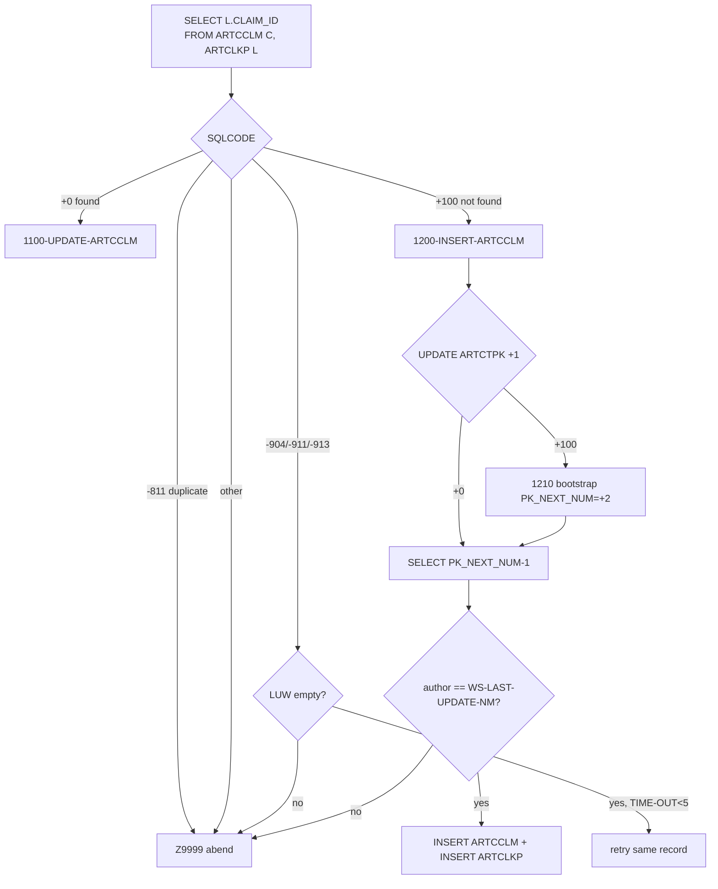
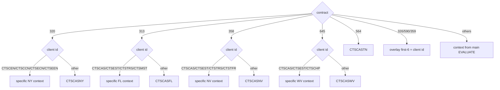
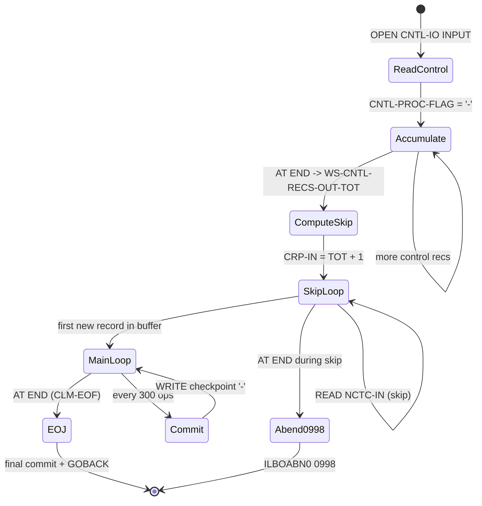

# CASNCTD7 — Illustration Document (Dummy / Sample Data)

> **Source-availability notice.** All examples below are derived from the **actual** source of
> `CASNCTD7.txt` and its available copybooks (`NCTCLMS4`, `ARTCCLM`, `ARTCLKP`, `CARTCTPK`,
> `CASGETCC`) on branch **`Job-details`**. Line numbers refer to `CASNCTD7.txt` on that branch.
> Dummy field values are **fabricated for illustration**; the field *names*, *lengths*, *offsets*,
> transformation logic, and control flow are **proven** from source. Where a data item's definition
> is not available (e.g., the `PMONITOR` copybook, JCL/GDG), the illustration says so explicitly and
> does not invent values.

---

# 1. Illustration Scope

| Aspect | What is illustrated | Basis |
|---|---|---|
| Contract routing | All 14 known contracts + the unknown-contract abend | `EVALUATE HMS-3BYTE-CONTRACT-NUM` (246-279) |
| Client-id sub-routing | NY, FL, NV, WV, TN branch tables + defaults | 381-521 |
| Multi-context overlay | `326/590/359` overlay + the `645` overlay-then-overwrite nuance | 368-375, 484-504 |
| Alt-client stamp | `535` → `ALT_CLIENT_CD='535'` | 700-704 |
| Upsert decision | UPDATE (found), INSERT (not found), `-811` duplicate | 708-750 |
| Sequence handling | `ARTCTPK` bump, bootstrap, author guard | 823-911 |
| Field transforms | amounts, dates, NDC-vs-ICD9P, diagnosis reformat, create-source | 589-688 |
| Checkpoint/commit | 300-op commit + control-record write | 752-757, 1136-1173 |
| Restart | skip previously-committed records | 287-357 |
| Contention | retry same record vs mid-LUW abort | 731-745 etc. |
| No-data completion | `0998` empty / all-processed | 294-303 |
| Monitoring | `P_MONITOR` update + missing-row resilience | 1189-1285 |

**How dummy data was created.** Each sample "input record" is built field-by-field from the proven
`NCTCLMS4` layout (§4.1 of the logic doc; 306 bytes). Only fields that the program actually reads are
given meaningful values; **defined-but-unused** fields (`LAST-NAME`, `PROVIDER-NAME`, `SVC-DESC`,
`PRIMARY-DIAG-DESC`, etc.) are shown as `…` because the program never inspects them.

**What could not be illustrated.**
- Exact `P_MONITOR` row contents/column layout — `PMONITOR` copybook not available.
- Real dataset/GDG generations and how abend codes map to JCL step return codes — no JCL in repo.
- `CASGETCC` internal job-accounting lookup values — only its output contract is used here.

---

# 2. Scenario Catalog

| ID | Scenario | Trigger (proven) | Expected path |
|---|---|---|---|
| S1 | Known contract → context/author | `HMS-3BYTE-CONTRACT-NUM` in list | routes, continues (246-274) |
| S2 | Unknown contract | contract not in `EVALUATE` | abend `0999` (275-278) |
| S3 | `CASGETCC` failure | return code ≠ `'0'` | abend `0999` (238-242) |
| S4 | NY client-id sub-routing | contract `320`, various `CLM-HMS-CLIENT-ID` | context per 381-404 |
| S5 | FL client-id sub-routing | contract `313` | context per 427-450 |
| S6 | NV client-id sub-routing | contract `358` | context per 455-479 |
| S7 | WV client-id sub-routing (+overlay overwrite) | contract `645` | context per 484-504 |
| S8 | TN client-id routing | contract `564` | context `CTSCASTN` (509-521) |
| S9 | Multi-context overlay (no EVALUATE) | contract `326`/`590`/`359` | first-6 = client id (368-375) |
| S10 | Alt-client stamp | contract `535` | `ALT_CLIENT_CD='535'` (700-704) |
| S11 | Existing claim → UPDATE | driving SELECT `SQLCODE +0` | `1100-UPDATE-ARTCCLM` (721-722) |
| S12 | New claim → INSERT | driving SELECT `SQLCODE +100` | `1200-INSERT-ARTCCLM` (723-724) |
| S13 | Duplicate claim | driving SELECT `SQLCODE -811` | abend (725-730) |
| S14 | First claim for a context | `ARTCTPK` bump `SQLCODE +100` | bootstrap `1210` (833-836) |
| S15 | Concurrency intervention | `CTPK-LAST-UPDATE-NM` mismatch | abend (902-909) |
| S16 | RX service code | `CLM-CLAIM-TYPE='12'` | `NDCCD_RF` (616-619) |
| S17 | Non-RX service code (cap 10) | `CLM-CLAIM-TYPE≠'12'` | `ICD9P_RF` capped 10 (621-628) |
| S18 | Diagnosis `nnn.nn` | 3 chars before `.` | strip `.` (639-648) |
| S19 | Diagnosis leading-space | >0 chars before `.`, first is space | left-shift 1 (649-654) |
| S20 | Diagnosis no reformat (no dot) | >0 chars before `.`, first **not** space | UNSTRING as-is (649-654) |
| S21 | Create-source map | `'00'`/`'01'`/other | text/`DSS`/spaces (683-688) |
| S22 | Amount de-edit | any `CHARGE/PAID` | packed via `WS-DE-EDIT` (589-592) |
| S23 | Date reformat | any date field | `CCYY-MM-DD` (594-613) |
| S24 | Commit cadence | 300 uncommitted ops | `1900-IMPLICIT-COMMIT` (752-757) |
| S25 | Restart skip | control file committed count > 0 | skip N records (287-306) |
| S26 | Empty / all processed | input EOF during skip | abend `0998` (294-303) |
| S27 | DB2 contention retry | `-904/-911/-913`, LUW empty | retry same record (731-745) |
| S28 | DB2 contention mid-LUW | `-904/-911/-913`, LUW not empty | abend (742-744) |
| S29 | Normal end of job | input EOF in main loop | final commit + monitor + `GOBACK` (760, 313-323) |
| S30 | Monitor row missing | `P_MONITOR` `SQLCODE +100` | display, **no abend** (1268-1272) |

---

# 3. Dummy Data Examples

> **Compact record notation.** Fields are shown as `name=value`; unused fields shown as `…`.
> The 306-byte record positions are per logic-doc §4.1. `bC` in a date means century bytes.

## S1 — Known contract routing
**Trigger:** `CASGETCC` returns `HMS-3BYTE-CONTRACT-NUM = '341'` (OH). *(246, 253-254)*

| Step | Result |
|---|---|
| `EVALUATE` arm `341` | `WS-CONTEXT-CD='CTSCASOH'`, `WS-LAST-UPDATE-NM='WOHCDF40'` |
| Next | continue to restart accounting and main loop |

Representative outputs across contracts (proven table):

| Contract | Context | Author |
|---|---|---|
| `320` | `CTSCASNY` | `WNYCDF40` |
| `300` (TEST) | `CTSCASTST` | `WTTCDF40` |
| `326` | `CTSCASCO` | `WCOCDF40` |
| `341` | `CTSCASOH` | `WOHCDF40` |
| `535` | `CTSCASOH` | `WCXCDF40` |
| `313` | `CTSCASFL` | `WFLCDF40` |
| `319` | `CTSCASCT` | `WCTCDF40` |
| `317` | `CTSWRCCA` | `WCACDF40` |
| `590` | `CTSCASAL` | `WALCDF40` |
| `330` | `CTSCASAR` | `WARCDF40` |
| `358` | `CTSCASNV` | `WNVCDF40` |
| `359` | `CTSCASNM` | `WNMCDF40` |
| `645` | `CTSCASWV` | `WWVCDF40` |
| `564` | `CTSCASTN` | `WWVCDF40` (author literal as coded, line 274) |

## S2 — Unknown contract → abend 0999
**Trigger:** `HMS-3BYTE-CONTRACT-NUM = '999'` (not in list). *(275-278)*
**Result:** `MOVE +0999 TO DUMP-CODE`, `GO TO Z9999-ERROR-EXIT` → `ROLLBACK`, `P_MONITOR='FAILURE'`,
`CALL 'ILBOABN0' USING DUMP-CODE` (user abend 0999). No rows are written.

## S3 — CASGETCC failure → abend 0999
**Trigger:** `CASGETCC-RETURN-CODE = '8'` (≠ `'0'`). *(238-242)*
**Result:** same abend-0999 path as S2. Contract routing never runs.

## S4 — NY (320) client-id sub-routing
**Input (key fields):** contract `320`; `CLM-HMS-CLIENT-ID` varies. *(381-404)*

| `CLM-HMS-CLIENT-ID` | Resulting `WS-CONTEXT-CD` |
|---|---|
| `CTSCEN` | `CTSCASEX-NY` |
| `CTSCCN` | `CTSCASNYC` |
| `CTSECN` | `CTSESTNY` |
| `CTSEEN` | `CTSESTEX-NY` |
| anything else (e.g. `CTSZZZ`) | `CTSCASNY` (default) |

**Dummy record (NY, default arm):**
```
RECIPIENT-ID-NUM=MA0000001234        HMS-CASE-KEY=000123456 ICN=ICN2024NY0000000001
FORMER-ICN=<spaces> CLAIM-STATUS=P TRANSACTION-TYPE=A CLAIM-TYPE=011 UNITS=00001
CHARGE-AMT=    100.00  PAID-AMT=     80.00  DOR-A=20240115 SVC-FROM=20240101 SVC-TO=20240101
… PROVIDER-NUM=PRV000000123 … HMS-CLIENT-ID=CTSZZZ SVC-CODE=99213 …
PRIMARY-DIAG-CODE=250.01 SECOND-DIAG-CODE=<spaces> CREATE-SOURCE=00 CDE-ICD-VERSION=0 AGENCY-CODE=NY …
```
→ `WS-CONTEXT-CD='CTSCASNY'` (default), amounts/dates transformed as in S22/S23,
`CCLM-ICD9D-RF='25001'` (S18), `CREATE_SOURCE_NM='STANDARD MEDICAID'` (S21).

## S5 — FL (313) client-id sub-routing *(427-450)*

| `CLM-HMS-CLIENT-ID` | `WS-CONTEXT-CD` |
|---|---|
| `CTSCAS` | `CTSCASFL` |
| `CTSEST` | `CTSESTFL` |
| `CTSTRS` | `CTSTRSFL` |
| `CTSMST` | `CTSCASMT-FL` |
| other | `CTSCASFL` (default) |

## S6 — NV (358) client-id sub-routing *(455-479)*

| `CLM-HMS-CLIENT-ID` | `WS-CONTEXT-CD` |
|---|---|
| `CTSCAS` | `CTSCASNV` |
| `CTSEST` | `CTSESTNV` |
| `CTSTRS` | `CTSTRSNV` |
| `CTSTFR` | `CTSTFRNV` |
| other | `CTSCASNV` (default) |

## S7 — WV (645) sub-routing, and the overlay-overwrite nuance *(368-375, 484-504)*
`645` is in the overlay `IF` **and** has its own `EVALUATE`.

| Order | Operation | Effect on `WS-CONTEXT-CD` |
|---|---|---|
| 1 | overlay `IF` (368-375) | first 6 chars ← `CLM-HMS-CLIENT-ID` |
| 2 | `EVALUATE CLM-HMS-CLIENT-ID` (484-504) | **full `MOVE`** overwrites entire field |

| `CLM-HMS-CLIENT-ID` | Final `WS-CONTEXT-CD` |
|---|---|
| `CTSCAS` | `CTSCASWV` |
| `CTSEST` | `CTSESTWV` |
| `CTSCHP` | `CTSCASCH-WV` |
| other | `CTSCASWV` (default) |

**Net:** the overlay has **no effect** for `645` (proven by sequence). Illustrated to show why the
composed value for `326/590/359` differs (S9).

## S8 — TN (564) routing *(509-521)*
Both `WHEN 'CTSCAS'` and `WHEN OTHER` map to `CTSCASTN`; author `WWVCDF40` (as coded). Any TN record
lands in context `CTSCASTN`.

## S9 — Multi-context overlay without an EVALUATE (326 / 590 / 359) *(368-375)*
**Trigger:** contract `326`, `CLM-HMS-CLIENT-ID='ABC123'`. No client-id `EVALUATE` exists for `326`,
so the overlay stands.

| Field | Before overlay | After overlay |
|---|---|---|
| `WS-CONTEXT-CD` | `CTSCASCO` (from main EVALUATE, line 251) | `ABC123CO` (pos 1-6 = client id, pos 7-8 = `CO` retained) |

> The composed value's *business* meaning is **data-dependent / inferred**; only the byte overlay is
> proven. The stored context is then trimmed by `UNSTRING … DELIMITED BY ALL SPACES` (523-534).

## S10 — Alt-client stamp (535) *(255-256, 700-704)*
**Trigger:** contract `535`. **Result:** context `CTSCASOH` (shared with `341`), author `WCXCDF40`,
and `CCLM-ALT-CLIENT-CD='535'`. For every other contract `ALT_CLIENT_CD` = spaces.

## S11 — Existing claim → UPDATE *(708-722, 767-796)*
**Setup:** a row already exists in `ARTCCLM`+`ARTCLKP` for `CONTEXT_CD='CTSCASNY'`,
`ICN_NUM='ICN2024NY0000000001'`, `CLMST_RF='P'`, `CASE_ID=123456`.
**Driving SELECT** returns that `CLAIM_ID` with `SQLCODE=+0`.
**Action:** `UPDATE ARTCCLM SET <all mapped columns>, LAST_UPDATE_DTM=CURRENT TIMESTAMP WHERE
CONTEXT_CD='CTSCASNY' AND CLAIM_ID=<found> AND ICN_NUM='ICN2024NY0000000001'`; `SQL-UPDATE-CTR += 1`.
No `ARTCLKP`/`ARTCTPK` change.

## S12 — New claim → INSERT *(723-724, 821-1060)*
**Setup:** no matching row (`SQLCODE=+100`).
**Action sequence:**
1. `UPDATE ARTCTPK SET PK_NEXT_NUM = PK_NEXT_NUM + 1 … WHERE CONTEXT_CD='CTSCASNY' AND PK_TYPE_CD='CLM'`.
2. `SELECT PK_NEXT_NUM - 1 …` → e.g. `CTPK-PK-NEXT-NUM = 100045`.
3. Author guard passes (`CTPK-LAST-UPDATE-NM = 'WNYCDF40'`).
4. `MOVE 100045 TO CCLM-CLAIM-ID CLKP-CLAIM-ID`.
5. `INSERT INTO ARTCCLM (…) VALUES (…)` → `SQL-INSERT-CTR += 1`, context registered in a
   `WS-CONTEXT-CD-n` slot.
6. `INSERT INTO ARTCLKP (…)` with `RELATE_IND='0'`, `IS_AUTO_CHECKED='N'`, `CREATE_NM='WNYCDF40'`,
   `CREATE_DTM=CURRENT TIMESTAMP`.

## S13 — Duplicate claim → abend *(725-730)*
**Trigger:** driving SELECT returns `SQLCODE=-811` (more than one matching `CLAIM_ID`).
**Result:** `DISPLAY 'MULTIPLE CLAIM_ID FOR ICN_NUM …'`, `GO TO Z9999-ERROR-EXIT` → abend `3645`
(default). No upsert performed.

## S14 — First claim for a context → PK bootstrap *(833-836, 1093-1110)*
**Trigger:** `UPDATE ARTCTPK … +1` returns `SQLCODE=+100` (no sequence row for the context yet).
**Result:** `PERFORM 1210-INSERT-ARTCTPK` inserts
`(CONTEXT_CD, 'CLM', 'CASE TRACKING SYSTEM CLAIM', PK_MASK_TXT=<spaces>, PK_NEXT_NUM=+2,
LAST_UPDATE_NM, CURRENT TIMESTAMP)`; message *"NEW PK_TYPE_CD = 'CLM' INSERTED TO ARTCTPK"*. The
subsequent `SELECT PK_NEXT_NUM - 1` yields **1** — the first claim id for that context.

## S15 — Concurrency intervention → abend *(902-909)*
**Trigger:** after `SELECT PK_NEXT_NUM - 1`, `CTPK-LAST-UPDATE-NM-TEXT(1:len) = 'XXOTHER'`, which is
**not** the program's own `WS-LAST-UPDATE-NM='WNYCDF40'`.
**Result:** `DISPLAY 'UNCOMMITTED INTERVENTION TO ARTCTPK …'`, `GO TO Z9999-ERROR-EXIT` → abend.

## S16 — RX service code → NDC *(615-619)*
**Trigger:** `CLM-CLAIM-TYPE='12'`, `CLM-SVC-CODE='00071015523'`.
**Result:** `CCLM-NDCCD-RF='00071015523'` (NDC column populated); `CCLM-ICD9P-RF` left blank.

## S17 — Non-RX service code, cap at 10 *(621-628)*
**Trigger:** `CLM-CLAIM-TYPE='011'`, `CLM-SVC-CODE='ABCDEFGHIJK'` (11 chars).
**Result:** `CCLM-ICD9P-RF='ABCDEFGHIJK'` but length forced to 10 ⇒ stored as `'ABCDEFGHIJ'`
(`CCLM-ICD9P-RF-L=+10`). NDC column left blank.

## S18 — Diagnosis `nnn.nn` (3 before dot) → strip dot *(639-648)*
**Trigger:** `CLM-PRIMARY-DIAG-CODE='250.01'` ⇒ `COUNT-M=3`.
**Before → After:** `250.01` → `25001` in `CCLM-ICD9D-RF`. (Halves `250` + `01` rejoined without `.`.)

## S19 — Diagnosis with a leading space → left-shift *(649-654)*
**Trigger:** `CLM-PRIMARY-DIAG-CODE=' V70.0'` (leading space, `COUNT-M>0`, first char space).
**Result:** shifted one position left before `UNSTRING` (`'V70.0'` used).

## S20 — Diagnosis needing no reformat (no dot, no leading space) → as-is *(649-654)*
**Trigger:** `CLM-SECOND-DIAG-CODE='V700'` (no `.`). Because `INSPECT … TALLYING COUNT-M FOR
CHARACTERS BEFORE INITIAL '.'` counts **all** character positions when no `.` is present, `COUNT-M=7`
(the full `X(7)` width), which is `> 0` but `≠ 3`; the first character `'V'` is not a space, so no
left-shift occurs.
**Result:** `CCLM-ICD9D-2ND-RF='V700'` (no reformat).

> *(Empirically verified with GnuCOBOL: `V700`→`COUNT-M=7`, `250.01`→`COUNT-M=3`, and a leading-dot
> code such as `.123`→`COUNT-M=0`. The rare `COUNT-M=0` leading-dot case also falls through to
> UNSTRING-as-is because the `COUNT-M > 0` guard is false.)*

## S21 — Create-source mapping *(683-688)*

| `CLM-CREATE-SOURCE` | `CCLM-CREATE-SOURCE-NM` |
|---|---|
| `00` | `STANDARD MEDICAID` |
| `01` | `DSS` |
| `07` (any other) | *spaces* (no `WHEN OTHER`) |

## S22 — Amount de-edit *(589-592)*
**Trigger:** `CLM-CHARGE-AMT='    100.00 '` (display `Z(06)9.99-`), `CLM-PAID-AMT='     80.00 '`.
**Result:** de-edited via `WS-DE-EDIT S9(7)V99` → `CCLM-CHARGE-AMT=100.00`, `CCLM-PAID-AMT=80.00`
(packed to `DECIMAL(15,2)`).

## S23 — Date reformat *(594-613)*
**Trigger:** `CLM-DOR-A='20240115'`. **Result:** `CCLM-REMIT-DT='2024-01-15'`. Same pattern for
`SERVICE_FROM_DT` / `SERVICE_TO_DT`.

## S24 — Commit cadence (300) *(752-757, 1136-1173)*
**Trigger:** the 300th uncommitted op (`SQL-NOT-COMMITED-YET-CTR >= 300`).
**Result:** `PERFORM 1900-IMPLICIT-COMMIT` → `COMMIT`; obtain timestamp; `WRITE CNTL-RECORD FROM
WS-CONTROL-RECORD` with `CNTL-PROC-FLAG='-'` and `NUM-REC-OUT=<cumulative committed>`; roll counters;
zero LUW counters and `TIME-OUT-CTR`.

**Checkpoint control record (dummy):**
```
'-'  '     12,300'  '++'  '2024-01-15-10.30.00.1234'   <- low-order 2 timestamp bytes truncated to X(38)
```

## S25 — Restart skip *(287-357)*
**Setup:** control file's last committed count = `12,300`.
**Result:** `0500` accumulates `WS-CNTL-RECS-OUT-TOT=12300`; `CRP-IN=12301`; the loop `READ`s and
**skips** 12,300 records, leaving record 12,301 in the buffer for the first `1000-MAINLINE`.

## S26 — Empty / all previously processed → 0998 *(294-303)*
**Trigger A:** input file empty ⇒ `REC-READ-CTR=0` ⇒ *"PCFCASE CLAIMS FILE IS EMPTY"*.
**Trigger B:** all records already processed ⇒ *"ALL n INPUT RECORDS … PROCESSED PREVIOUSLY"*.
**Result (both):** `MOVE +0998 TO DUMP-CODE`, `GO TO Z9999-ERROR-EXIT`. *(Comment `0011` labels 0998
a "good completion"; the mechanical path is still the error exit — external interpretation not
proven.)*

## S27 — DB2 contention, LUW empty → retry same record *(731-745)*
**Trigger:** driving SELECT `SQLCODE=-911`, `SQL-NOT-COMMITED-YET-CTR=0`.
**Result:** `ADD 1 TO TIME-OUT-CTR`, display attempt, `GO TO 1000-MAINLINE-EXIT` (skips the trailing
`READ`) ⇒ **same record retried**. After 5 attempts `TIME-OUT-CTR>=5` ⇒ driver aborts.

## S28 — DB2 contention, work pending → abend *(742-744)*
**Trigger:** `SQLCODE=-911` but `SQL-NOT-COMMITED-YET-CTR>0`.
**Result:** cannot safely retry ⇒ `GO TO Z9999-ERROR-EXIT` → abend `3645`.

## S29 — Normal end of job *(760, 313-323)*
**Trigger:** `READ NCTC-IN` hits `AT END` ⇒ `SET CLM-EOF`. Loop ends.
**Result:** if uncommitted work remains, final `1900-IMPLICIT-COMMIT`; `WS-STATUS-TXT='SUCCESS'`,
`PERFORM 8000-P-MONITOR`; `9000-TERMINATION` ("PGM CASNCTD7 NORMAL END"); `CLOSE`; `GOBACK`.

## S30 — Monitor row missing → no abend *(1268-1272)*
**Trigger:** `UPDATE MISC.P_MONITOR …` returns `SQLCODE=+100`.
**Result:** *"P-MONITOR ROW NON-EXISTANT …"* displayed; the program **continues** (the abend
`GO TO Z9999-ERROR-EXIT` is commented out, line 1282). Load result is preserved.

---

# 4. Before / After Illustrations

## 4.1 INSERT — full input → DB2 rows (New York example)
**Input record (dummy, contract `320`, client `CTSZZZ` → default `CTSCASNY`):**
```
RECIPIENT-ID-NUM = MA0000001234
HMS-CASE-KEY     = 000123456
ICN              = ICN2024NY0000000001
FORMER-ICN       = <spaces>
CLAIM-STATUS     = P
TRANSACTION-TYPE = A
CLAIM-TYPE       = 011
UNITS-OF-SERVICE = 00001
CHARGE-AMT       =     100.00
PAID-AMT         =      80.00
DOR-A            = 20240115
SERVICE-FROM-A   = 20240101
SERVICE-TO-A     = 20240101
PROVIDER-NUM     = PRV000000123
HMS-CLIENT-ID    = CTSZZZ
SVC-CODE         = 99213
PRIMARY-DIAG     = 250.01
SECOND-DIAG      = <spaces>
CREATE-SOURCE    = 00
CDE-ICD-VERSION  = 0
AGENCY-CODE      = NY
(LAST-NAME/FIRST-NAME/MI/PROVIDER-NAME/SVC-DESC/DIAG-DESC = … not read)
```

**After transforms → `ARTCCLM` INSERT (mapped columns):**
```
CONTEXT_CD        = CTSCASNY
CLAIM_ID          = 100045          (from ARTCTPK PK_NEXT_NUM-1)
ICN_NUM           = ICN2024NY0000000001
PREV_ICN_NUM      = <null/space>
RECIP_MA_NUM      = MA0000001234
PROVIDER_ID       = PRV000000123
CLMST_RF          = P
TRNTP_RF          = A
CLMTP_RF          = 011
UNITS_NUM         = 00001
CHARGE_AMT        = 100.00
PAID_AMT          = 80.00
REMIT_DT          = 2024-01-15
SERVICE_FROM_DT   = 2024-01-01
SERVICE_TO_DT     = 2024-01-01
ICD9P_RF          = 99213           (non-'12' → procedure, ≤10)
ICD9D_RF          = 25001           (250.01 → dot stripped)
ICD9D_2ND_RF      = <blank>
NDCCD_RF          = <blank>
LAST_UPDATE_NM    = WNYCDF40
LAST_UPDATE_DTM   = CURRENT TIMESTAMP
CREATE_SOURCE_NM  = STANDARD MEDICAID
ICD_VERSION       = 0
ALT_CLIENT_CD     = <spaces>        (not 535)
AGENCY_CD         = NY
```

**Companion `ARTCLKP` INSERT:**
```
CONTEXT_CD=CTSCASNY  CASE_ID=123456  CLAIM_ID=100045
RELATE_IND=0  IS_AUTO_CHECKED=N  LAST_UPDATE_NM=WNYCDF40
LAST_UPDATE_DTM=CURRENT TIMESTAMP  CREATE_NM=WNYCDF40  CREATE_DTM=CURRENT TIMESTAMP
```

## 4.2 UPDATE — re-arrival of the same claim
**Input:** same `ICN=ICN2024NY0000000001`, `CLAIM-STATUS=P`, `CASE=123456`, but `PAID-AMT` now
`100.00`. Driving SELECT finds the row (`SQLCODE +0`).
**After:** `ARTCCLM` row updated in place — `PAID_AMT 80.00 → 100.00`, `LAST_UPDATE_DTM` refreshed;
`CLAIM_ID` unchanged; **no** new `ARTCLKP`/`ARTCTPK` row.

## 4.3 RX vs non-RX service code (before/after)

| Input | `CLAIM-TYPE` | `SVC-CODE` | `NDCCD_RF` | `ICD9P_RF` |
|---|---|---|---|---|
| RX | `12` | `00071015523` | `00071015523` | *(blank)* |
| Non-RX | `011` | `ABCDEFGHIJK` (11) | *(blank)* | `ABCDEFGHIJ` (cap 10) |

## 4.4 Multi-context overlay (326) before/after

| Field | Before overlay | After overlay | Stored (trimmed) |
|---|---|---|---|
| `WS-CONTEXT-CD` | `CTSCASCO` | `ABC123CO` (client `ABC123`) | `ABC123CO` |

## 4.5 Rejected / skipped outcomes

| Outcome | Cause | Effect |
|---|---|---|
| Rejected (abend) | unknown contract (S2), CASGETCC fail (S3), `-811` (S13), author mismatch (S15), mid-LUW contention (S28) | `ROLLBACK`, `P_MONITOR='FAILURE'`, `ILBOABN0` |
| Skipped | restart already-committed records (S25) | not re-read into mainline |
| No-op continue | `P_MONITOR` missing (S30), monitor OTHER error | display only, load continues |

---

# 5. Flow Diagrams

## 5.1 Upsert decision (proven)


## 5.2 Client-id routing decision tree (proven)


## 5.3 Restart / checkpoint state (proven)


---

# 6. Coverage Check

| Coded branch / behaviour | Illustrated? | Scenario |
|---|---|---|
| Known contract routing (all 14) | ✔ | S1 |
| Unknown contract abend `0999` | ✔ | S2 |
| CASGETCC failure abend `0999` | ✔ | S3 |
| NY / FL / NV / WV / TN sub-routing + defaults | ✔ | S4-S8 |
| Multi-context overlay (326/590/359) | ✔ | S9 |
| `645` overlay-then-overwrite nuance | ✔ | S7 |
| Alt-client `535` | ✔ | S10 |
| UPDATE (found) | ✔ | S11 |
| INSERT (not found) incl. `ARTCLKP` | ✔ | S12, §4.1 |
| Duplicate `-811` | ✔ | S13 |
| PK bump / bootstrap `1210` | ✔ | S12, S14 |
| Author-guard intervention | ✔ | S15 |
| RX (NDC) vs non-RX (ICD9P cap 10) | ✔ | S16, S17 |
| Diagnosis reformat: dot-strip / leading-space / no-dot | ✔ | S18, S19, S20 |
| Create-source `00/01/other` | ✔ | S21 |
| Amount de-edit / date reformat | ✔ | S22, S23 |
| Commit cadence 300 + checkpoint write | ✔ | S24 |
| Restart skip | ✔ | S25 |
| Empty / all-processed `0998` | ✔ | S26 |
| Contention retry vs mid-LUW abend | ✔ | S27, S28 |
| Normal EOJ | ✔ | S29 |
| Monitor missing-row resilience | ✔ | S30 |

## Branches intentionally **not** given fabricated data (with reason)
- **`P_MONITOR` per-context UPDATE contents** — the `PMONITOR` copybook is not available, so exact
  column values cannot be shown without inventing them. The control-flow (which contexts get updated
  and the success/failure `STATUS_TXT`) *is* illustrated (S30, §6.6 of logic doc).
- **`8100-P-MONITOR-INS`** — fully commented out (lines 1287-1333); not executable, so no runtime
  scenario exists.
- **`DPSGTCON` path** — commented out (228-233); superseded by `CASGETCC`. No runtime scenario.
- **Physical (non-EOF) I/O errors** — no `FILE STATUS` coded (logic-doc §7.1); behaviour is
  runtime-defined, not illustrable from source.
- **JCL/GDG generation, abend-to-RC mapping** — no JCL in repository.

**Conclusion:** every branch in `CASNCTD7` that *materially changes data or control flow* and is
provable from source has at least one dummy-data illustration above. Remaining omissions are limited
to unexecutable (commented-out) code and behaviours defined outside the available source, each listed
with its reason.
