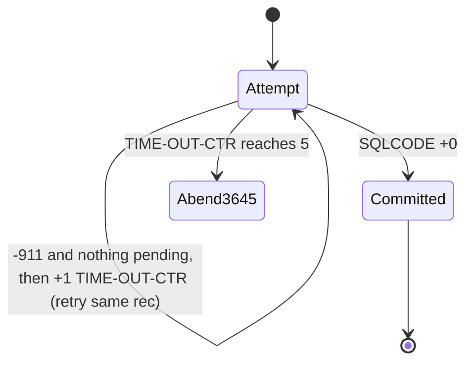
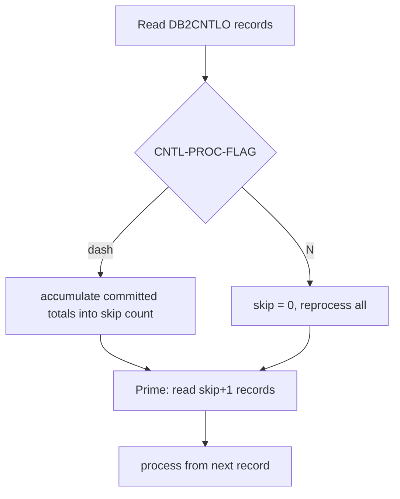
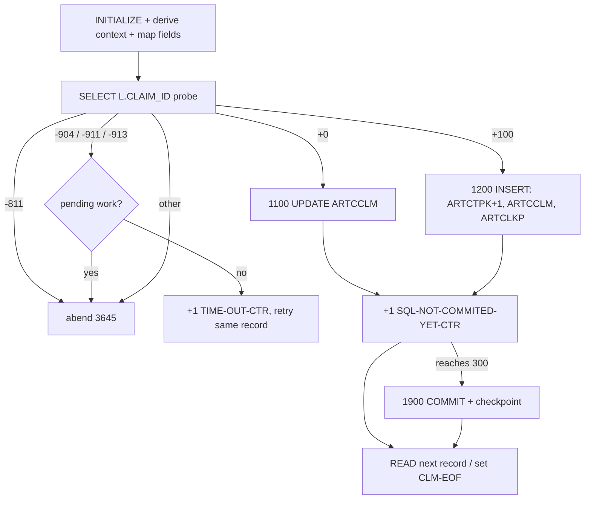
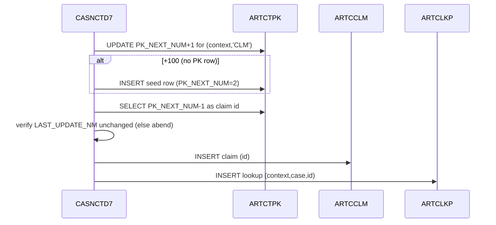
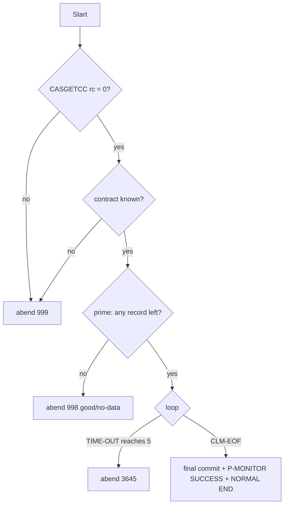

# CASNCTD7 — Illustration Document (Dummy‑Data Scenarios)

> Companion to **`CASNCTD7.logic.md`**. Every example here is **derived from the source** (`CASNCTD7.txt` + copybook `NCTCLMS4.txt` + JCL `PWTALCDF.txt` / control cards). Sample values are **fictional** and chosen to trigger specific coded branches. Line numbers refer to `CASNCTD7.txt`.
>
> **Caveat:** the DB2 DCLGEN copybooks (`ARTCCLM`, `ARTCLKP`, `ARTCTPK`, `PMONITOR`) are **not in the repository**, so the "after" DB2 rows are shown at the **column level as manipulated by the program’s SQL** — exact stored datatypes/lengths are not proven.

---

# 1. Illustration Scope

## 1.1 What is illustrated
Every materially behavior‑changing branch coded in CASNCTD7:
- Startup: `CASGETCC` OK / failure; known / unknown contract.
- Context derivation: base map, client‑id first‑6 override (CO/AL/NM), and the NY/FL/NV/WV/TN sub‑maps.
- Core decision: **existence probe** → **UPDATE** (`SQLCODE +0`) vs **INSERT** (`+100`) vs `-811` vs `-904/-911/-913` vs OTHER.
- Insert internals: `ARTCTPK` increment, first‑context seed insert, `ARTCCLM` insert, `ARTCLKP` insert, distinct‑context counting.
- Field transforms: amount de‑edit, date reformat, drug‑vs‑procedure routing, ICD dot‑removal, create‑source naming, `ALT_CLIENT_CD` for 535.
- Commit/checkpoint at 300; restart skip; bypass‑skip (`'N'`).
- End states: normal end, and the three abend codes 999 / 998 / 3645.
- `P_MONITOR` success/failure stamping.

## 1.2 How the dummy data was built
A **canonical 306‑byte** `NCTCLAIM-RECORD` is defined once (§3, "Base record") using the byte offsets proven in `CASNCTD7.logic.md` §4.1. Each scenario changes only the fields relevant to its branch and shows the resulting host‑variable values and SQL effect.

## 1.3 What cannot be illustrated
- Exact on‑disk/DB2 byte images of `ARTCCLM`/`ARTCLKP`/`ARTCTPK`/`P_MONITOR` rows — copybooks absent.
- Real `CASGETCC` output — only the caller’s use of it is shown.
- `8100-P-MONITOR-INS` (commented out, lines 1287–1333) — dead code, not illustrated.

---

# 2. Scenario Catalog

| # | Scenario | Trigger | Path | Illustrated in |
|---|---|---|---|---|
| S1 | New claim → INSERT | probe `SQLCODE +100` | 1200 | §3.1, §4.1 |
| S2 | Existing claim → UPDATE | probe `SQLCODE +0` | 1100 | §3.2, §4.2 |
| S3 | First claim for a context → seed `ARTCTPK` | `ARTCTPK` UPDATE `+100` | 1210 | §3.3 |
| S4 | Ambiguous key (duplicate) | probe `SQLCODE -811` | abend 3645 | §3.4 |
| S5 | DB2 timeout retry then abend | `-911` ×5 | retry→3645 | §3.5 |
| S6 | Unknown contract | `EVALUATE OTHER` | abend 999 | §3.6 |
| S7 | `CASGETCC` failure | rc ≠ '0' | abend 999 | §3.6 |
| S8 | Empty / fully‑processed file | prime `AT END` | abend 998 | §3.7 |
| S9 | CO estate via client‑id override | contract 326 + `CTSEST` | context `CTSESTCO` | §3.8 |
| S10 | NY sub‑map | contract 320 + `CTSECN` | context `CTSESTNY` | §3.8 |
| S11 | FL mass‑tort sub‑map | contract 313 + `CTSMST` | context `CTSCASMT-FL` | §3.8 |
| S12 | NV TEFRA sub‑map | contract 358 + `CTSTFR` | context `CTSTFRNV` | §3.8 |
| S13 | WV CHIP sub‑map (+override) | contract 645 + `CTSCHP` | context `CTSCASCH-WV` | §3.8 |
| S14 | Drug code routing | `CLAIM-TYPE = '12'` | `NDCCD_RF` | §3.9 |
| S15 | Procedure code >10 truncation | else + len>10 | `ICD9P_RF` len 10 | §3.9 |
| S16 | ICD dot removal | diag `250.00` | `25000` | §3.10 |
| S17 | ICD leading‑space strip / as‑is | diag ` E118` | `E118` | §3.10 |
| S18 | Amount de‑edit (neg) | charge `-` sign | numeric | §3.11 |
| S19 | Date reformat | `20240115` | `2024-01-15` | §3.11 |
| S20 | Create‑source map | `00` / `01` / `02` | name / name / blank | §3.12 |
| S21 | CareSource alt‑client | contract 535 | `ALT_CLIENT_CD='535'` | §3.12 |
| S22 | Commit + checkpoint at 300 | `SQL-NOT-COMMITED-YET-CTR >= 300` | 1900 | §3.13, §4.3 |
| S23 | Restart skip | control file totals | skip N | §3.14 |
| S24 | Bypass‑skip | `CNTL-PROC-FLAG='N'` | reprocess all | §3.14 |
| S25 | Distinct‑context counters | multiple contexts | CD‑1..5 | §3.15 |
| S26 | Normal end + P‑Monitor SUCCESS | `CLM-EOF` | 9000/8000 | §3.16 |

---

# 3. Dummy Data Examples

## Base record (canonical `NCTCLAIM-RECORD`, 306 bytes) — [derived from `NCTCLMS4.txt`]

| Field | Bytes | Dummy value |
|---|---|---|
| `CLM-RECIPIENT-ID-NUM` | 1–20 | `MA1234567890        ` |
| `CLM-HMS-CASE-KEY` | 21–29 | `000456789` |
| `CLM-ICN` | 30–49 | `ICN20240001         ` |
| `CLM-FORMER-ICN` | 50–69 | `ICN20230009         ` |
| `CLM-CLAIM-STATUS` | 70 | `P` |
| `CLM-TRANSACTION-TYPE` | 71 | `A` |
| `CLM-CLAIM-TYPE` | 72–74 | `11 ` |
| `CLM-UNITS-OF-SERVICE` | 75–79 | `00003` |
| `CLM-CHARGE-AMT` | 80–90 | `    150.00 ` |
| `CLM-PAID-AMT` | 91–101 | `    120.00 ` |
| `CLM-DOR-A` | 102–109 | `20240220` |
| `CLM-SERVICE-DATE-FROM-A` | 110–117 | `20240115` |
| `CLM-SERVICE-DATE-TO-A` | 118–125 | `20240115` |
| `CLM-LAST-NAME` | 126–137 | `DOE         ` |
| `CLM-FIRST-NAME` | 138–144 | `JANE   ` |
| `CLM-MI` | 145 | `Q` |
| `CLM-PROVIDER-NUM` | 146–160 | `PRV0001234     ` |
| `CLM-PROVIDER-NAME` | 161–195 | `GENERAL HOSPITAL …` |
| `CLM-HMS-CLIENT-ID` | 196–201 | `CTSCAS` |
| `CLM-SVC-CODE` | 202–212 | `99213      ` |
| `CLM-SVC-DESC` | 213–247 | `OFFICE VISIT …` |
| `CLM-PRIMARY-DIAG-CODE` | 248–254 | `250.00 ` |
| `CLM-PRIMARY-DIAG-DESC` | 255–289 | `DIABETES …` |
| `CLM-SECOND-DIAG-CODE` | 290–296 | `4019   ` |
| `CLM-CREATE-SOURCE` | 297–298 | `00` |
| `CLM-FILLER` | 299–300 | `  ` |
| `CLM-USER-RELATED` | 301 | ` ` |
| `CLM-CDE-ICD-VERSION` | 302–303 | `10` |
| `CLM-AGENCY-CODE` | 304–305 | `AA` |
| `CLM-SYSTEM-RELATED` | 306 | `@` |

Assume the run is for **contract `320` (NY)** unless a scenario says otherwise, so base map (line 247) gives `WS-CONTEXT-CD = CTSCASNY`, `WS-LAST-UPDATE-NM = WNYCDF40`.

---

## 3.1 S1 — New claim → INSERT (probe `+100`) — [PROVEN path]
- **Trigger:** No `ARTCCLM/ARTCLKP` row matches `CONTEXT_CD=CTSCASNY`, `ICN_NUM=ICN20240001`, `CLMST_RF=P`, `CASE_ID=000456789` (lines 708–719) ⇒ `SQLCODE +100` ⇒ `1200-INSERT-ARTCCLM` (line 724).
- **Effect:**
  1. `UPDATE ARTCTPK SET PK_NEXT_NUM = PK_NEXT_NUM + 1 …` (say 5000 → 5001).
  2. `SELECT PK_NEXT_NUM - 1` ⇒ `CTPK-PK-NEXT-NUM = 5000` ⇒ `CCLM-CLAIM-ID = CLKP-CLAIM-ID = 5000`.
  3. `INSERT INTO ARTCCLM` with the mapped values below.
  4. `INSERT INTO ARTCLKP (CTSCASNY, 000456789, 5000, RELATE_IND '0', IS_AUTO_CHECKED 'N', …)`.
  5. `SQL-INSERT-CTR + 1`; distinct‑context counters updated (§3.15).
- **Resulting `ARTCCLM` column values (host vars):**

| Column | Value | From |
|---|---|---|
| `CONTEXT_CD` | `CTSCASNY` (len 8) | 529–534 |
| `CLAIM_ID` | `5000` | 911 |
| `ICN_NUM` | `ICN20240001` | 536 |
| `PREV_ICN_NUM` | `ICN20230009` | 552 |
| `RECIP_MA_NUM` | `MA1234567890` | 558 |
| `PROVIDER_ID` | `PRV0001234` | 568 |
| `CLMST_RF` | `P` (len 1) | 573 |
| `TRNTP_RF` | `A` (len 1) | 576 |
| `CLMTP_RF` | `11` | 579 |
| `UNITS_NUM` | `00003` | 584 |
| `CHARGE_AMT` | `150.00` | 589 |
| `PAID_AMT` | `120.00` | 591 |
| `REMIT_DT` | `2024-02-20` | 594 |
| `SERVICE_FROM_DT` | `2024-01-15` | 600 |
| `SERVICE_TO_DT` | `2024-01-15` | 609 |
| `ICD9P_RF` | `99213` (claim‑type ≠ 12) | 621 |
| `ICD9D_RF` | `25000` (dot removed) | 631–655 |
| `ICD9D_2ND_RF` | `4019` | 657–681 |
| `NDCCD_RF` | (blank; not claim‑type 12) | 616 |
| `LAST_UPDATE_NM` | `WNYCDF40` | 543 |
| `LAST_UPDATE_DTM` | `CURRENT TIMESTAMP` | 967 |
| `CREATE_SOURCE_NM` | `STANDARD MEDICAID` | 685 |
| `ICD_VERSION` | `10` | 690 |
| `ALT_CLIENT_CD` | (blank; not 535) | 703 |
| `AGENCY_CD` | `AA` | 695 |

- **Why:** probe found no existing claim, so a new id is minted and both the claim and its case‑lookup are inserted.

## 3.2 S2 — Existing claim → UPDATE (probe `+0`) — [PROVEN path]
- **Trigger:** a matching row already exists ⇒ `SQLCODE +0` ⇒ `1100-UPDATE-ARTCCLM` (line 722). `CCLM-CLAIM-ID` is set to the found `L.CLAIM_ID` (line 710).
- **Effect:** `UPDATE ARTCCLM SET PREV_ICN_NUM, RECIP_MA_NUM, PROVIDER_ID, CLMST_RF, TRNTP_RF, CLMTP_RF, UNITS_NUM, CHARGE_AMT, PAID_AMT, REMIT_DT, SERVICE_FROM_DT, SERVICE_TO_DT, ICD9P_RF, ICD9D_RF, ICD9D_2ND_RF, NDCCD_RF, LAST_UPDATE_NM, LAST_UPDATE_DTM=CURRENT TIMESTAMP, CREATE_SOURCE_NM, ICD_VERSION, ALT_CLIENT_CD, AGENCY_CD WHERE CONTEXT_CD=CTSCASNY AND CLAIM_ID=<found> AND ICN_NUM=ICN20240001` (767–796). `SQL-UPDATE-CTR + 1`.
- **No** `ARTCLKP`/`ARTCTPK` change on this path (no new id, no new lookup row).

### Before/after (ARTCCLM, illustrative)
| | `CHARGE_AMT` | `PAID_AMT` | `LAST_UPDATE_DTM` |
|---|---|---|---|
| Before | `140.00` | `100.00` | (prior) |
| After | `150.00` | `120.00` | new `CURRENT TIMESTAMP` |

## 3.3 S3 — First claim for a brand‑new context → seed `ARTCTPK` — [PROVEN]
- **Trigger:** step 1 of INSERT does `UPDATE ARTCTPK … WHERE CONTEXT_CD=<new> AND PK_TYPE_CD='CLM'` and gets `SQLCODE +100` (no row) ⇒ `1210-INSERT-ARTCTPK` (line 836).
- **Effect:** `INSERT INTO ARTCTPK (CONTEXT_CD, PK_TYPE_CD='CLM', PK_DSC='CASE TRACKING SYSTEM CLAIM', PK_MASK_TXT, PK_NEXT_NUM=+2, LAST_UPDATE_NM, LAST_UPDATE_DTM)` (1093–1110), then displays `"WRN: NEW PK_TYPE_CD = 'CLM' INSERTED TO ARTCTPK"`. The subsequent `SELECT PK_NEXT_NUM-1` yields `1`, so the very first claim id for a new context is **1**.

## 3.4 S4 — Ambiguous key (`-811`) → abend 3645 — [PROVEN]
- **Trigger:** the probe matches more than one row ⇒ `SQLCODE -811` (line 725).
- **Effect:** displays `ERR: SELECT FROM ARTCCLM, SQLCODE = -811`, `MULTIPLE CLAIM_ID FOR ICN_NUM = ICN20240001`, `MULTI CLAIMID PREV ICN_NUM = ICN20230009`, then `GO TO Z9999-ERROR-EXIT` (727–730). `DUMP-CODE` stays **3645**. `DSNTIAR` prints the SQL message, `ROLLBACK`, `P_MONITOR='FAILURE'`, then abend via `CALL 'ILBOABN0' USING DUMP-CODE` (DUMP-CODE=3645).

## 3.5 S5 — DB2 timeout retry, then abend — [PROVEN]
- **Trigger:** probe/insert returns `-911` while `SQL-NOT-COMMITED-YET-CTR = 0` (fresh since last commit).
- **Effect each time:** `+1 TIME-OUT-CTR`, display `DB2 ACCESS ATTEMPTED n TIME(S)`, `GO TO 1000-MAINLINE-EXIT` (no `READ`), so the same record is re‑attempted. When `TIME-OUT-CTR` reaches **5**, the main loop’s `UNTIL … TIME-OUT-CTR >= 5` ends and `0000-MAIN` does `GO TO Z9999-ERROR-EXIT` ⇒ abend **3645** (lines 309–312). Operator restarts step `EXEC0040`; the skip logic resumes from the last commit.



## 3.6 S6/S7 — Unknown contract / `CASGETCC` failure → abend 999 — [PROVEN]
- **S6:** `CASGETCC` returns e.g. `'999'` (not in the `EVALUATE`) ⇒ `WHEN OTHER` (line 275) ⇒ display `** ERR: UNKNOWN HMS-3BYTE-CONTRACT-NUM **`, `DUMP-CODE=+0999`, abend.
- **S7:** `CASGETCC-RETURN-CODE = '8'` (≠ '0') ⇒ display `** ERR: RETRIEVE CONTRACT NUMBER **`, `DUMP-CODE=+0999`, abend (lines 238–242).
- In both, `SQLCODE` is 0, so `DSNTIAR` is **not** called; `ROLLBACK`, `P_MONITOR='FAILURE'`, then abend via `CALL 'ILBOABN0' USING DUMP-CODE` (DUMP-CODE=999).

## 3.7 S8 — Empty / fully‑processed file → abend 998 — [PROVEN]
- **Trigger:** in the prime loop (`PERFORM CRP-IN TIMES READ NCTC-IN`) an `AT END` occurs (lines 292–303).
  - If `REC-READ-CTR = 0` ⇒ `** ERR: PCFCASE CLAIMS FILE IS EMPTY.`
  - Else ⇒ `** ERR: ALL <n> INPUT RECORDS` / `HAVE BEEN PROCESSED PREVIOUSLY.`
- `DUMP-CODE=+0998`, `GO TO Z9999-ERROR-EXIT`. Per tag `0011` this is a **good/no‑data** completion, but mechanically it still `ROLLBACK`s and stamps `P_MONITOR='FAILURE'` (see logic doc §7).

## 3.8 S9–S13 — Context derivation variants — [PROVEN]

| # | Contract | `CLM-HMS-CLIENT-ID` | Rule (lines) | Final `WS-CONTEXT-CD` |
|---|---|---|---|---|
| S9 | 326 (CO) | `CTSEST` | first‑6 override (373–374); base `CTSCASCO` → pos 7‑8 `CO` | `CTSESTCO` |
| S9b | 326 (CO) | `CTSCAS` | same | `CTSCASCO` |
| S10 | 320 (NY) | `CTSECN` | NY sub‑map (393–394) | `CTSESTNY` |
| S10b | 320 (NY) | `CTSCEN` | (385–386) | `CTSCASEX-NY` |
| S10c | 320 (NY) | `CTSCCN` | (389–390) | `CTSCASNYC` |
| S10d | 320 (NY) | `XXXXXX` | OTHER (401–402) | `CTSCASNY` |
| S11 | 313 (FL) | `CTSMST` | FL sub‑map (443–444) | `CTSCASMT-FL` |
| S11b | 313 (FL) | `CTSTRS` | (439–440) | `CTSTRSFL` |
| S12 | 358 (NV) | `CTSTFR` | NV sub‑map (472–473) | `CTSTFRNV` |
| S13 | 645 (WV) | `CTSCHP` | override then WV sub‑map (496–497) | `CTSCASCH-WV` |
| S13b | 590 (AL) | `CTSEST` | first‑6 override; base `CTSCASAL` | `CTSESTAL` |
| S13c | 359 (NM) | `CTSCAS` | first‑6 override; base `CTSCASNM` | `CTSCASNM` |

*Explanation:* for the override contracts (326/590/359/645) the leading 6 characters of the context become the record’s client‑id, keeping the 2‑char state suffix from the base; NY/FL/NV/WV/TN have explicit `EVALUATE`s that set the whole context (WV runs both, the `EVALUATE` winning).

## 3.9 S14/S15 — Service‑code routing — [PROVEN]
- **S14 (drug):** `CLM-CLAIM-TYPE = '12'`, `CLM-SVC-CODE = '00093' ` ⇒ `UNSTRING` into `CCLM-NDCCD-RF` (`NDCCD_RF`); `CCLM-ICD9P-RF` left blank (lines 615–619).
- **S15 (procedure, long):** `CLAIM-TYPE = '11'`, `CLM-SVC-CODE = '1234567890X'` (11 chars) ⇒ into `CCLM-ICD9P-RF`; length computed `11 > 10` ⇒ forced to **10** (`CCLM-ICD9P-RF-L = 10`), so only `1234567890` is stored (lines 621–628).

## 3.10 S16/S17 — Diagnosis‑code formatting — [PROVEN]
| Input `CLM-PRIMARY-DIAG-CODE` | `COUNT-M` (before `.`) | Rule | Stored `ICD9D_RF` |
|---|---|---|---|
| `250.00 ` | 3 | dot‑removal (636–642): `250`+`00` | `25000` |
| ` E118  ` | (leading space) | leading‑space strip (645–649) then as‑is | `E118` |
| `V700   ` | 4 (no dot) | as‑is (651–654) | `V700` |

Secondary diagnosis uses the identical logic into `ICD9D_2ND_RF` (657–681). In the Base record, secondary `4019` (no dot) ⇒ stored `4019`.

## 3.11 S18/S19 — Amount de‑edit & date reformat — [PROVEN]
- **S18 (negative charge):** `CLM-CHARGE-AMT = '     50.00-'` ⇒ `MOVE` to `WS-DE-EDIT (S9(07)V99)` de‑edits to numeric **‑50.00** ⇒ `CCLM-CHARGE-AMT = -50.00` (lines 589–590).
- **S19 (dates):** `CLM-DOR-A = 20240220` ⇒ `CCLM-REMIT-DT = '2024-02-20'`; `CLM-SERVICE-DATE-FROM-A = 20240115` ⇒ `'2024-01-15'`; likewise `SERVICE_TO_DT` (594–613).

Before/after (single field):
```
CLM-DOR-A (packed as CCYYMMDD): 2 0 2 4 0 2 2 0
CCLM-REMIT-DT (CCYY-MM-DD)    : 2 0 2 4 - 0 2 - 2 0
```

## 3.12 S20/S21 — Create‑source & CareSource — [PROVEN]
| `CLM-CREATE-SOURCE` | Stored `CREATE_SOURCE_NM` (683–688) |
|---|---|
| `00` | `STANDARD MEDICAID` |
| `01` | `DSS` |
| `02` | (blank — not mapped) |

- **S21:** contract **535** ⇒ `CCLM-ALT-CLIENT-CD = '535'` (line 701); any other contract ⇒ blank (line 703). Note contract 535 also base‑maps to `CTSCASOH` with `WS-LAST-UPDATE-NM = WCXCDF40`.

## 3.13 S22 — Commit + checkpoint at 300 — [PROVEN]
- After the 300th successful record since the last commit, `SQL-NOT-COMMITED-YET-CTR >= SQL-COMMIT-FREQ (300)` ⇒ `1900-IMPLICIT-COMMIT` (755–756):
  - `COMMIT`; get `CURRENT TIMESTAMP`; `CNTL-PROC-FLAG='-'`; add to `SQL-TOT-COMMITTED-CTR`; `WRITE CNTL-RECORD` (a checkpoint); roll up insert/update committed counts; reset per‑LUW counters.
- **Checkpoint record written (`DB2CNTLO`, 38 bytes):**
```
-         300 ++2024-02-20-08.30.00.1234   (last 2 timestamp bytes truncated)
^flag     ^NUM-REC-OUT ^'++' ^timestamp(24 shown)
```

## 3.14 S23/S24 — Restart skip & bypass — [PROVEN]
- **S23 (skip):** control file contains prior checkpoints; `0500-CREATE-INFILE-CRP` computes `WS-CNTL-RECS-OUT-TOT = 600` (e.g., two runs of 300). Then `CRP-IN = 601`; the prime loop reads 601 records (skipping the 600 already committed) and processing resumes with record **601**.
- **S24 (bypass):** upstream `WALCDF14` set byte 1 of the control record to `'N'`. `0500` sees `CNTL-PROC-FLAG='N'`, does not accumulate skips (total stays 0), prints `BYPASS DB2 CONTROL FILE PROCESSING`, so processing starts from record **1** (full reprocess).



## 3.15 S25 — Distinct‑context insert counters — [PROVEN behavior]
Run for a multi‑context client, inserts arriving in context order **A, A, B, A, C** (A=`CTSCASWV`, B=`CTSESTWV`, C=`CTSCASCH-WV`):

| Insert | Context | CD‑1/‑CNT | CD‑2/‑CNT | CD‑3/‑CNT |
|---|---|---|---|---|
| 1 | A | A / 1 | A / 0 | A / 0 |
| 2 | A | A / 2 | A / 0 | A / 0 |
| 3 | B | A / 2 | B / 1 | B / 0 |
| 4 | A | A / 3 | B / 1 | A / 0 |
| 5 | C | A / 3 | B / 1 | C / 1 |

Final counts: A=3, B=1, C=1 (lines 976–1014). These feed the per‑context `P_MONITOR` updates (1198–1260) and the end report (1351–1364). A 6th distinct context would not be counted.

## 3.16 S26 — Normal end + P‑Monitor SUCCESS — [PROVEN]
- On `CLM-EOF`, `0000-MAIN` does a final commit if needed, sets `WS-STATUS-TXT='SUCCESS'`, runs `8000-P-MONITOR` (updates `MISC.P_MONITOR` rows with end time, `TASK_STEP_TXT='LOAD'`, `STATUS_TXT='SUCCESS'`, per‑context `DATA_CNT`, then `COMMIT`), runs `9000-TERMINATION` (prints counters + `PGM CASNCTD7 NORMAL END`), closes files, `GOBACK`.

---

# 4. Before/After Illustrations

## 4.1 New claim (S1) — input record → DB2 rows
```
INPUT  NCTCLAIM-RECORD (key fields): CONTEXT via 320→CTSCASNY, ICN=ICN20240001,
       STATUS=P, CASE=000456789, CHARGE=150.00, DOR=20240220, DIAG=250.00, CLMTYPE=11
PROBE  SELECT L.CLAIM_ID ... -> SQLCODE +100 (not found)
AFTER  ARTCTPK: PK_NEXT_NUM 5000 -> 5001 ; assigned CLAIM_ID = 5000
       ARTCCLM: (CTSCASNY, 5000, ICN20240001, ... CHARGE_AMT 150.00, REMIT_DT 2024-02-20,
                 ICD9P_RF 99213, ICD9D_RF 25000, CREATE_SOURCE_NM 'STANDARD MEDICAID')  [INSERTED]
       ARTCLKP: (CTSCASNY, 000456789, 5000, RELATE_IND '0', IS_AUTO_CHECKED 'N')          [INSERTED]
```

## 4.2 Existing claim (S2) — rewrite
```
PROBE  SELECT L.CLAIM_ID ... -> SQLCODE +0 (found, CLAIM_ID=5000)
AFTER  ARTCCLM row (CTSCASNY,5000,ICN20240001): business columns overwritten,
       LAST_UPDATE_DTM = CURRENT TIMESTAMP   [UPDATED]
       ARTCLKP / ARTCTPK: unchanged
```

## 4.3 Checkpoint file (S22/S23)
```
Before restart (DB2CNTLO):  "-        300 ++<ts>"   "-        600 ++<ts>"
0500 computes skip total = 600  ->  CRP-IN = 601  ->  first processed input record = #601
```

## 4.4 Rejected/abend outcomes
| Scenario | Outcome record/state |
|---|---|
| S4 `-811` | no row changed this record; `ROLLBACK`; abend 3645 |
| S6/S7 | no DB2 work; abend 999 |
| S8 | no DB2 work; abend 998 (good/no‑data) |
| S5 (during retries) | partial insert `ROLLBACK`ed each `-911`; final abend 3645 |

---

# 5. Flow Diagrams

## 5.1 Per‑record decision (1000‑MAINLINE)


## 5.2 Insert sub‑flow (1200)


## 5.3 Job/end‑state decision tree


---

# 6. Coverage Check

| Coded branch | Illustrated? | Where |
|---|---|---|
| Probe `+0` / `+100` / `-811` / `-904/-911/-913` / OTHER | ✅ | S1,S2,S4,S5 |
| `ARTCTPK` update `+0` / seed `+100` | ✅ | S1,S3 |
| `ARTCCLM` insert & `ARTCLKP` insert | ✅ | S1 |
| `1100` update path | ✅ | S2 |
| Base contract map (all 14 values) | ✅ (table) | logic §5.1; S9–S13 sample |
| Client‑id first‑6 override (326/590/359/645) | ✅ | S9, S13b, S13c |
| NY/FL/NV/WV/TN sub‑maps | ✅ | S10–S13 |
| Claim‑type 12 vs else (NDC vs ICD9P) | ✅ | S14,S15 |
| ICD9P >10 truncation | ✅ | S15 |
| Diag dot‑removal / leading‑space / as‑is | ✅ | S16,S17 |
| Amount de‑edit (incl. negative) | ✅ | S18 |
| Date reformat ×3 | ✅ | S19 |
| Create‑source 00/01/other | ✅ | S20 |
| `ALT_CLIENT_CD` 535 | ✅ | S21 |
| Commit at 300 + checkpoint write | ✅ | S22 |
| Restart skip / bypass `'N'` | ✅ | S23,S24 |
| Distinct‑context counters (5 slots) | ✅ | S25 |
| Abends 999 / 998 / 3645 | ✅ | S6,S7,S8,S4,S5 |
| Normal end + P‑Monitor SUCCESS/FAILURE | ✅ | S26 (+ abend rows) |

**Branches intentionally not deep‑illustrated (with reason):**
- `SYSIBM.SYSDUMMY1` timestamp fallback to `FUNCTION CURRENT-DATE` (lines 1153–1159): purely a timestamp‑source fallback; no data‑path effect — noted, not separately dummy‑valued.
- `8100-P-MONITOR-INS` (1287–1333): **commented out** dead code — excluded by design.
- Exact `P_MONITOR` row images: **cannot** be shown (copybook absent) — represented by the columns the `UPDATE`s set.

All materially behavior‑changing branches proven in the source are covered above.
