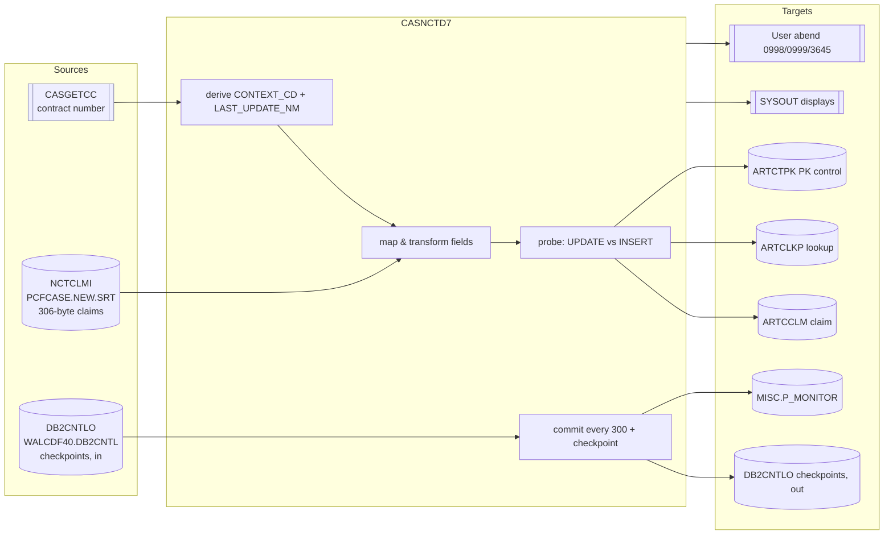

# CASNCTD7 — End‑to‑End Input/Output Mapping

> Companion to **`CASNCTD7.logic.md`** and **`CASNCTD7_illustrations.md`**.
> This document traces every data element from the **physical inputs** (files, DDNAMEs, the calling subroutine) through the **program transformations** to the **physical/logical outputs** (DB2 tables, the checkpoint file, the monitor table, SYSOUT, and the abend code), with **business examples**.
> Evidence = `CASNCTD7.txt` (line refs), `NCTCLMS4.txt`, `PWTALCDF.txt`, and the `WAL*` control cards. Items that cannot be proven (absent copybooks/subprogram) are flagged **[NOT PROVEN]**.

---

# 1. End‑to‑End Picture



---

# 2. Physical Input/Output Inventory

## 2.1 DDNAME ↔ dataset ↔ COBOL (from `PWTALCDF` step `EXEC0040`) — [PROVEN]

| DDNAME | Dataset (symbolics resolved for ALT) | DISP | COBOL name | LRECL |
|---|---|---|---|---|
| `NCTCLMI` | `P.HMS.TPL.ALT.IR.PCFCASE.NEW.SRT` | `SHR` | `NCTC-IN` (`SELECT`, line 73) | 306 |
| `DB2CNTLO` | `P.HMS.TPL.ALT.IR.WALCDF40.DB2CNTL` | `(MOD,KEEP,KEEP)` | `CNTL-IO` (`SELECT`, line 75) | 38 |
| `SYSPRINT`/`SYSOUT`/`SYSTSPRT`/`DSNTRACE` | SYSOUT | — | `DISPLAY` output | — |

- The `DB2BATCH` proc supplies the DB2 plan/attach; `MEMBER=CASNCTD7`, `DATABASE=CTSPROD`, `SYSTEM=DB2P` (lines 152–153).
- `NCTCLMI` is the product of the upstream sort chain (`EXEC0010`→`EXEC0015`→`EXEC0020`): current‑generation PCFCASE, deduped against prior generation, sorted by `HMS-CASE-KEY`.

## 2.2 Logical inputs that are not files — [PROVEN interface]

| Input | Source | Consumed at | Effect |
|---|---|---|---|
| `HMS-3BYTE-CONTRACT-NUM` | `CASGETCC` (CALL, line 235) | context `EVALUATE` (246) | selects `CONTEXT_CD` + `LAST_UPDATE_NM` |
| `CASGETCC-RETURN-CODE` | `CASGETCC` | line 238 | `≠'0'` ⇒ abend 999 |
| Prior checkpoints | `DB2CNTLO` (read, 325–346) | `0500` | how many input records to skip |

## 2.3 Outputs — [PROVEN they are written; column detail per §4]

| Target | Type | Written by | Notes |
|---|---|---|---|
| `ARTCCLM` | DB2 table | `UPDATE` (767) / `INSERT` (914) | claim data |
| `ARTCLKP` | DB2 table | `INSERT` (1039) | context+case→claim lookup (new claims only) |
| `ARTCTPK` | DB2 table | `UPDATE` (823) / `INSERT` (1093) | per‑context next claim id |
| `MISC.P_MONITOR` | DB2 table | `UPDATE` (1189–1258) | run monitoring |
| `DB2CNTLO` | flat file | `WRITE` (1164) | checkpoint per commit |
| SYSOUT | print | `DISPLAY` throughout | progress, errors, counters |
| Return/abend | — | `GOBACK` / `ILBOABN0` | 0 normal; 0998/0999/3645 abend |

---

# 3. Field‑Level Input → Output Mapping (`ARTCCLM`)

Legend for the "Transform" column: **UNSTRING** = token up to first space + its length into a VARCHAR host var; **len1** = stored as length‑1; **deedit** = numeric‑edited→numeric; **date** = `CCYYMMDD`→`CCYY-MM-DD`; **direct** = moved unchanged.

| Input field (`NCTCLMS4`, `CLM-`) | Bytes | Transform (lines) | Host var (`CCLM-`) | `ARTCCLM` column |
|---|---|---|---|---|
| derived `WS-CONTEXT-CD` | — | UNSTRING (525–534) | `CONTEXT-CD` | `CONTEXT_CD` |
| (assigned id) | — | from `CTPK-PK-NEXT-NUM` (911) | `CLAIM-ID` | `CLAIM_ID` |
| `ICN` | 30–49 | UNSTRING (536) | `ICN-NUM` | `ICN_NUM` |
| `FORMER-ICN` | 50–69 | UNSTRING (552) | `PREV-ICN-NUM` | `PREV_ICN_NUM` |
| `RECIPIENT-ID-NUM` | 1–20 | UNSTRING (558) | `RECIP-MA-NUM` | `RECIP_MA_NUM` |
| `PROVIDER-NUM` | 146–160 | UNSTRING (568) | `PROVIDER-ID` | `PROVIDER_ID` |
| `CLAIM-STATUS` | 70 | len1 (573–574) | `CLMST-RF` | `CLMST_RF` |
| `TRANSACTION-TYPE` | 71 | len1 (576–577) | `TRNTP-RF` | `TRNTP_RF` |
| `CLAIM-TYPE` | 72–74 | UNSTRING (579) | `CLMTP-RF` | `CLMTP_RF` |
| `UNITS-OF-SERVICE` | 75–79 | UNSTRING (584) | `UNITS-NUM` | `UNITS_NUM` |
| `CHARGE-AMT` | 80–90 | deedit (589–590) | `CHARGE-AMT` | `CHARGE_AMT` |
| `PAID-AMT` | 91–101 | deedit (591–592) | `PAID-AMT` | `PAID_AMT` |
| `DOR-A` | 102–109 | date (594–598) | `REMIT-DT` | `REMIT_DT` |
| `SERVICE-DATE-FROM-A` | 110–117 | date (600–607) | `SERVICE-FROM-DT` | `SERVICE_FROM_DT` |
| `SERVICE-DATE-TO-A` | 118–125 | date (609–613) | `SERVICE-TO-DT` | `SERVICE_TO_DT` |
| `SVC-CODE` (if `CLAIM-TYPE='12'`) | 202–212 | UNSTRING (616–619) | `NDCCD-RF` | `NDCCD_RF` |
| `SVC-CODE` (else) | 202–212 | UNSTRING, cap len 10 (621–628) | `ICD9P-RF` | `ICD9P_RF` |
| `PRIMARY-DIAG-CODE` | 248–254 | dot‑strip/space‑strip (631–655) | `ICD9D-RF` | `ICD9D_RF` |
| `SECOND-DIAG-CODE` | 290–296 | dot‑strip/space‑strip (657–681) | `ICD9D-2ND-RF` | `ICD9D_2ND_RF` |
| `CREATE-SOURCE` | 297–298 | map 00/01 (683–688) | `CREATE-SOURCE-NM` | `CREATE_SOURCE_NM` |
| `CDE-ICD-VERSION` | 302–303 | UNSTRING (690) | `ICD-VERSION` | `ICD_VERSION` |
| `AGENCY-CODE` | 304–305 | UNSTRING (695) | `AGENCY-CD` | `AGENCY_CD` |
| contract=535? | — | `'535'`/spaces (700–704) | `ALT-CLIENT-CD` | `ALT_CLIENT_CD` |
| `WS-LAST-UPDATE-NM` | — | direct (543) | `LAST-UPDATE-NM` | `LAST_UPDATE_NM` |
| `CURRENT TIMESTAMP` | — | DB2 (787/967) | — | `LAST_UPDATE_DTM` |

**Input fields NOT mapped anywhere (defined only):** `LAST-NAME`, `FIRST-NAME`, `MI`, `PROVIDER-NAME`, `SVC-DESC`, `PRIMARY-DIAG-DESC`, `FILLER`, `USER-RELATED`, `SYSTEM-RELATED` (byte 306 is used *upstream* as the `'@'` mark by `WALCDF16`). — [PROVEN: 0 references in program]

## 3.1 `ARTCLKP` INSERT mapping (new claims only) — [PROVEN]
| Column | Value | Line |
|---|---|---|
| `CONTEXT_CD` | `:CLKP-CONTEXT-CD` (= derived context) | 1050 |
| `CASE_ID` | `:CLKP-CASE-ID` (= `CLM-HMS-CASE-KEY`, 541) | 1051 |
| `CLAIM_ID` | `:CLKP-CLAIM-ID` (= assigned id, 912) | 1052 |
| `RELATE_IND` | literal `'0'` | 1053 |
| `LAST_UPDATE_NM` | `:CLKP-LAST-UPDATE-NM` (= `WS-LAST-UPDATE-NM`) | 1054 |
| `LAST_UPDATE_DTM` | `CURRENT TIMESTAMP` | 1055 |
| `IS_AUTO_CHECKED` | literal `'N'` (tag 0019) | 1056 |
| `CREATE_NM` | `:CLKP-CREATE-NM` (= `WS-LAST-UPDATE-NM`, 546) | 1057 |
| `CREATE_DTM` | `CURRENT TIMESTAMP` | 1058 |

## 3.2 `ARTCTPK` mapping — [PROVEN]
| Operation | Columns | Line |
|---|---|---|
| UPDATE (bump id) | `PK_NEXT_NUM = PK_NEXT_NUM + 1`, `LAST_UPDATE_NM`, `LAST_UPDATE_DTM` WHERE `CONTEXT_CD`, `PK_TYPE_CD='CLM'` | 823–828 |
| SELECT (read id) | `PK_NEXT_NUM - 1`, `LAST_UPDATE_NM`, `LAST_UPDATE_DTM` | 858–867 |
| INSERT (seed) | `CONTEXT_CD`, `PK_TYPE_CD='CLM'`, `PK_DSC='CASE TRACKING SYSTEM CLAIM'`, `PK_MASK_TXT`, `PK_NEXT_NUM=+2`, `LAST_UPDATE_NM`, `LAST_UPDATE_DTM` | 1093–1108 |

## 3.3 `MISC.P_MONITOR` mapping — [PROVEN]
| Column | Value | Line |
|---|---|---|
| `END_DTM` | `CURRENT TIMESTAMP` | 1190/1200/… |
| `TASK_STEP_TXT` | `'LOAD'` | 1191 |
| `STATUS_TXT` | `:PMONITOR-STATUS-TXT` (`'SUCCESS'` or `'FAILURE'`) | 1192 |
| `DATA_CNT` | `0` (duration row) or `:WS-CONTEXT-CD-n-CNT` | 1193/1203/… |
| WHERE | `CLIENT_CD = :HMS-3BYTE-CONTRACT-NUM` AND (`CONTEXT_CD = :WS-CONTEXT-CD-n`) AND `PROCESS_NM LIKE 'CLKP_LOAD_DURATION_%'` | 1194–1206 |

---

# 4. Data‑Type / Length Notes

- Input `CHARGE-AMT`/`PAID-AMT` are **display‑edited** `Z(06)9.99-` (11 bytes, trailing sign). The de‑edit target `WS-DE-EDIT` is `S9(07)V99`, so the largest representable magnitude is `9999999.99` and negatives are preserved. **[PROVEN]**
- Dates on input are `9(08)` (CC + YYMMDD split as `9(02)`+`9(06)`); output is a 10‑char `CCYY-MM-DD` string. No validity checking is performed on the date digits. **[PROVEN]**
- VARCHAR host variables carry a text part and a 2‑byte length part (`-T`/`-L` or `-TEXT`/`-LEN`); the length is set by `UNSTRING … COUNT IN` or a literal. Exact maxima are **[NOT PROVEN]** (DCLGEN absent).
- `CLMST_RF` and `TRNTP_RF` are stored with length **1** regardless of input padding. **[PROVEN]**

---

# 5. Business Examples (end‑to‑end)

## Example A — New Alabama casualty claim (INSERT)
**Business context:** Alabama TPL casualty daily load (`PWTALCDF`, contract 590 ⇒ `WS-LAST-UPDATE-NM=WALCDF40`).

**Input (`NCTCLMI`, key fields):**
```
RECIPIENT-ID-NUM = AL987654321
HMS-CASE-KEY     = 000112233
ICN              = ICNAL2024777
CLAIM-STATUS     = P
CLAIM-TYPE       = 11
CHARGE-AMT       =     980.00
PAID-AMT         =     640.25
DOR-A            = 20240301
SERVICE-DATE-FROM/TO = 20240210 / 20240212
HMS-CLIENT-ID    = CTSCAS
SVC-CODE         = 99285
PRIMARY-DIAG     = 786.50
CREATE-SOURCE    = 00
CDE-ICD-VERSION  = 09
AGENCY-CODE      = AL
```
**Processing:** contract 590 → base `CTSCASAL`; client‑id override (line 373) replaces first 6 with `CTSCAS` ⇒ context stays `CTSCASAL`. Probe → `+100` (new).

**Output:**
- `ARTCTPK` (`CTSCASAL`,`CLM`): `PK_NEXT_NUM` bumped; assigned `CLAIM_ID` = value‑1.
- `ARTCCLM` **INSERT**: `CONTEXT_CD=CTSCASAL`, `ICN_NUM=ICNAL2024777`, `CLMST_RF=P`, `CHARGE_AMT=980.00`, `PAID_AMT=640.25`, `REMIT_DT=2024-03-01`, `SERVICE_FROM_DT=2024-02-10`, `SERVICE_TO_DT=2024-02-12`, `ICD9P_RF=99285`, `ICD9D_RF=78650` (dot stripped), `CREATE_SOURCE_NM='STANDARD MEDICAID'`, `ICD_VERSION=09`, `AGENCY_CD=AL`, `LAST_UPDATE_NM=WALCDF40`.
- `ARTCLKP` **INSERT**: (`CTSCASAL`,`000112233`,`CLAIM_ID`,`RELATE_IND '0'`,`IS_AUTO_CHECKED 'N'`).
- Counters: `SQL-INSERT-CTR +1`; context `CTSCASAL` count +1.

## Example B — Re‑sent claim (UPDATE)
Same key as Example A arrives again next run with `PAID-AMT = 700.00`. Probe → `+0` (found). `ARTCCLM` **UPDATE** sets `PAID_AMT=700.00` and refreshes `LAST_UPDATE_DTM`; `ARTCLKP`/`ARTCTPK` untouched; `SQL-UPDATE-CTR +1`.

**Before/After (ARTCCLM):**
```
Before: PAID_AMT=640.25  LAST_UPDATE_DTM=2024-03-01-...
After : PAID_AMT=700.00  LAST_UPDATE_DTM=<new timestamp>
```

## Example C — Florida estate claim (context sub‑map)
Contract 313, `HMS-CLIENT-ID = CTSEST` ⇒ FL `EVALUATE` (line 435) ⇒ `CONTEXT_CD = CTSESTFL`. The claim then follows the same INSERT/UPDATE decision using `CTSESTFL` as the context key. Business meaning: the claim is filed under Florida **Estates**, not Casualty.

## Example D — Pharmacy (drug) claim routing
`CLAIM-TYPE = 12`, `SVC-CODE = 00093-0123` ⇒ routed to `NDCCD_RF` (NDC), with `ICD9P_RF` left blank (lines 615–619). Business meaning: drug claims record the National Drug Code rather than a procedure code.

## Example E — Ohio CareSource (alt‑client flag)
Contract 535 ⇒ base `CTSCASOH`, `LAST_UPDATE_NM=WCXCDF40`, and `ALT_CLIENT_CD='535'` (line 701). Business meaning: distinguishes CareSource‑Ohio rows from standard Ohio (341) rows that share context `CTSCASOH`.

## Example F — No new data (good/no‑data completion)
The weekly file contains only records already loaded. The prime loop hits `AT END`, prints `ALL <n> INPUT RECORDS HAVE BEEN PROCESSED PREVIOUSLY.`, and abends **0998** (tag 0011 = good/no‑data). Operationally treated as success; nothing is inserted/updated.

## Example G — DB2 briefly unavailable (restart)
During load, DB2 returns `-911` five times on the same record ⇒ abend **3645**. Per `PWTALCDF` note (lines 142–150), TOS restarts step `EXEC0040`; the checkpoint file lets CASNCTD7 skip everything already committed and resume mid‑file.

---

# 6. Output‑by‑Trigger Summary (decision table)

| Trigger (proven) | ARTCCLM | ARTCLKP | ARTCTPK | Checkpoint | End state |
|---|---|---|---|---|---|
| probe `+0` | UPDATE | — | — | at 300 | continue |
| probe `+100` | INSERT | INSERT | UPDATE (+seed if `+100`) | at 300 | continue |
| probe `-811` | — | — | — | — | abend 3645 |
| `-904/-911/-913`, none pending | rolled back if partial | rolled back if partial | rolled back if partial | — | retry (≤5) |
| `-904/-911/-913`, pending / other SQL error | — | — | — | — | abend 3645 |
| `CASGETCC rc≠'0'` / unknown contract | — | — | — | — | abend 999 |
| prime `AT END` | — | — | — | — | abend 998 |
| `CLM-EOF` | (as processed) | (as processed) | (as processed) | final commit | NORMAL END + P‑Monitor SUCCESS |

---

# 7. Traceability / Evidence Index

| Claim in this doc | Evidence |
|---|---|
| DDNAME↔DSN, restart rule | `PWTALCDF.txt` lines 152–163, 142–150 |
| 306‑byte record & offsets | `NCTCLMS4.txt` (sums to 306); `WALCDF13` (key@21), `WALCDF16` (mark@306) |
| Context map & sub‑maps | `CASNCTD7.txt` 246–279, 368–521 |
| Field transforms | `CASNCTD7.txt` 523–704 |
| Probe / UPDATE / INSERT | `CASNCTD7.txt` 708–1089 |
| Commit/checkpoint/restart | `CASNCTD7.txt` 104, 290–357, 752–757, 1136–1173 |
| P‑Monitor | `CASNCTD7.txt` 1175–1285 |
| Abend codes | `CASNCTD7.txt` 98, 240, 277, 302, 1377–1400 |
| **Not proven** (DB2 column types, `CASGETCC` internals, `P_MONITOR` key setup) | copybooks/subprogram absent from repo |
