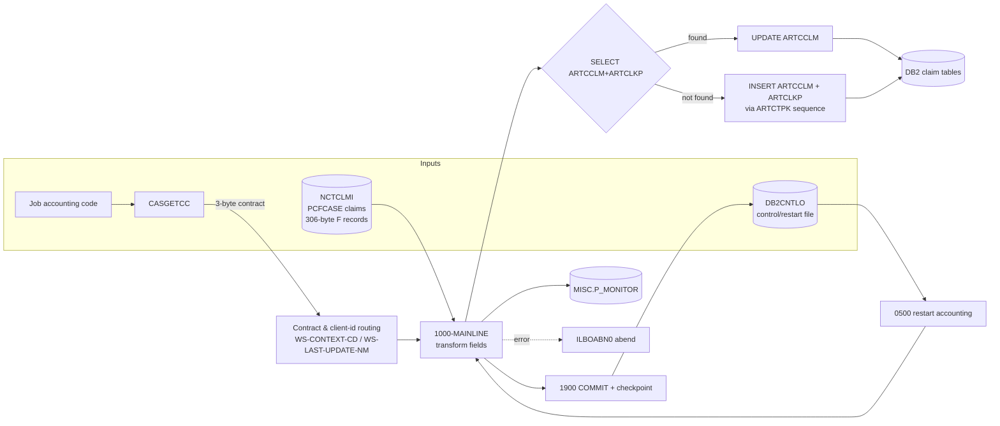

# CASNCTD7 — End-to-End Input/Output Mapping

> **Source-availability notice.** This mapping is built from the **available** source of `CASNCTD7.txt`
> and its copybooks (`NCTCLMS4`, `ARTCCLM`, `ARTCLKP`, `CARTCTPK`, `CASGETCC`) on branch
> **`Job-details`**. Line numbers refer to `CASNCTD7.txt` on that branch. Column data types are taken
> from the **available** DCLGENs. Items whose defining artifact is absent (`PMONITOR`, JCL/GDG) are
> marked accordingly and never fabricated.

---

# 1. End-to-End Data Flow

**Data stores touched (proven):**

| Store | DD / name | Direction | Verb(s) |
|---|---|---|---|
| PCFCASE claims | `NCTCLMI` (`NCTC-IN`) | in | `READ` |
| Control/restart | `DB2CNTLO` (`CNTL-IO`) | in (0500) then out (1900) | `READ` / `WRITE` |
| `ARTCCLM` | DB2 | in/out | `SELECT`/`UPDATE`/`INSERT` |
| `ARTCLKP` | DB2 | in/out | `SELECT`(join)/`INSERT` |
| `ARTCTPK` | DB2 | in/out | `UPDATE`/`SELECT`/`INSERT` |
| `MISC.P_MONITOR` | DB2 | out | `UPDATE` |
| `SYSIBM.SYSDUMMY1` | DB2 | in | `SELECT` (timestamp) |

---

# 2. Input → Working-Storage → DB2 Column Map

Legend for **field lifecycle** (the distinction the task requires):
**D** = defined, **P** = populated from input, **C** = checked/drives a branch, **O** = output to DB2,
**U** = unused (defined only).

## 2.1 `ARTCCLM` (claim table) — column sources

| Input field (`CLM-`) | Bytes | Transform | WS / host var | `ARTCCLM` column (type) | Lifecycle | Lines |
|---|---|---|---|---|---|---|
| `RECIPIENT-ID-NUM` | 1-20 | UNSTRING | `CCLM-RECIP-MA-NUM` | `RECIP_MA_NUM VARCHAR(20)` | P,O | 558-562 |
| `HMS-CASE-KEY` | 21-29 | move | `CLKP-CASE-ID` (→ARTCLKP) | *(see §2.2)* | P,O | 541 |
| `ICN` | 30-49 | UNSTRING | `CCLM-ICN-NUM` | `ICN_NUM VARCHAR(20) NN` | P,C,O | 536-539 |
| `FORMER-ICN` | 50-69 | UNSTRING | `CCLM-PREV-ICN-NUM` | `PREV_ICN_NUM VARCHAR(20)` | P,O | 552-555 |
| `CLAIM-STATUS` | 70 | len 1 | `CCLM-CLMST-RF` | `CLMST_RF VARCHAR(10)` | P,C,O | 573-574 |
| `TRANSACTION-TYPE` | 71 | len 1 | `CCLM-TRNTP-RF` | `TRNTP_RF VARCHAR(10)` | P,O | 576-577 |
| `CLAIM-TYPE` | 72-74 | UNSTRING / branch | `CCLM-CLMTP-RF` | `CLMTP_RF VARCHAR(10)` | P,C,O | 579-582, 615 |
| `UNITS-OF-SERVICE` | 75-79 | UNSTRING | `CCLM-UNITS-NUM` | `UNITS_NUM VARCHAR(10)` | P,O | 584-587 |
| `CHARGE-AMT` | 80-90 | de-edit | `WS-DE-EDIT`→`CCLM-CHARGE-AMT` | `CHARGE_AMT DECIMAL(15,2)` | P,O | 589-590 |
| `PAID-AMT` | 91-101 | de-edit | `WS-DE-EDIT`→`CCLM-PAID-AMT` | `PAID_AMT DECIMAL(15,2)` | P,O | 591-592 |
| `DOR-A` | 102-109 | CCYYMMDD→CCYY-MM-DD | `CCLM-REMIT-DT` | `REMIT_DT DATE` | P,O | 594-598 |
| `SERVICE-DATE-FROM-A` | 110-117 | date reformat | `CCLM-SERVICE-FROM-DT` | `SERVICE_FROM_DT DATE` | P,O | 600-607 |
| `SERVICE-DATE-TO-A` | 118-125 | date reformat | `CCLM-SERVICE-TO-DT` | `SERVICE_TO_DT DATE` | P,O | 609-613 |
| `PROVIDER-NUM` | 146-160 | UNSTRING | `CCLM-PROVIDER-ID` | `PROVIDER_ID VARCHAR(15) NN` | P,O | 568-571 |
| `HMS-CLIENT-ID` | 196-201 | routing driver | `WS-CONTEXT-CD` (+overlay) | `CONTEXT_CD VARCHAR(16) NN` | P,C,O | 368-534 |
| `SVC-CODE` | 202-212 | branch on claim type | `CCLM-NDCCD-RF` **or** `CCLM-ICD9P-RF` | `NDCCD_RF VARCHAR(15)` / `ICD9P_RF VARCHAR(10)` | P,C,O | 615-629 |
| `PRIMARY-DIAG-CODE` | 248-254 | dot/space reformat | `CCLM-ICD9D-RF` | `ICD9D_RF VARCHAR(10)` | P,O | 631-655 |
| `SECOND-DIAG-CODE` | 290-296 | dot/space reformat | `CCLM-ICD9D-2ND-RF` | `ICD9D_2ND_RF VARCHAR(10)` | P,O | 657-681 |
| `CREATE-SOURCE` | 297-298 | EVALUATE map | `CCLM-CREATE-SOURCE-NM` | `CREATE_SOURCE_NM CHAR(20)` | P,C,O | 683-688 |
| `CDE-ICD-VERSION` | 302-303 | UNSTRING | `CCLM-ICD-VERSION` | `ICD_VERSION VARCHAR(2)` | P,O | 690-693 |
| `AGENCY-CODE` | 304-305 | UNSTRING | `CCLM-AGENCY-CD` | `AGENCY_CD VARCHAR(2)` | P,O | 695-698 |
| *(derived)* | — | contract `535`? | `CCLM-ALT-CLIENT-CD` | `ALT_CLIENT_CD CHAR(5)` | C,O | 700-704 |
| *(derived)* | — | contract map | `WS-LAST-UPDATE-NM`→`CCLM-LAST-UPDATE-NM` | `LAST_UPDATE_NM VARCHAR(8) NN` | O | 543-547 |
| *(literal)* | — | — | `CURRENT TIMESTAMP` | `LAST_UPDATE_DTM TIMESTAMP NN` | O | 787, 967 |

**`ARTCCLM` columns never written** (DCLGEN-present, not populated): `CARRIER_CD`,
`LOGICAL_DELETE_IND`, `ERROR_CD`, `COUNTY_CD`, `ENC_IND`, `MCO_CD`, `RX_WRITTEN_DT`. *(Proven by
absence in both the `INSERT` list (914-975) and `UPDATE` set (767-796).)*

**Input fields never used** (D,U only): `LAST-NAME` (126-137), `FIRST-NAME` (138-144), `MI` (145),
`PROVIDER-NAME` (161-195), `SVC-DESC` (213-247), `PRIMARY-DIAG-DESC` (255-289), `USER-RELATED` (301),
`SYSTEM-RELATED` (306), `FILLER` (299-300).

## 2.2 `ARTCLKP` (claim ↔ case lookup) — column sources (INSERT only)

| Column (type) | Value source | Lines |
|---|---|---|
| `CONTEXT_CD VARCHAR(16) NN` | `CLKP-CONTEXT-CD` (from `WS-CONTEXT-CD`) | 525-534 |
| `CASE_ID DECIMAL(12,0) NN` | `CLKP-CASE-ID` (from `CLM-HMS-CASE-KEY`) | 541 |
| `CLAIM_ID DECIMAL(12,0) NN` | `CLKP-CLAIM-ID` (from `CTPK-PK-NEXT-NUM`) | 912 |
| `RELATE_IND CHAR(1) NN` | literal `'0'` | 1039-1060 |
| `IS_AUTO_CHECKED CHAR(1)` | literal `'N'` | 1039-1060 |
| `LAST_UPDATE_NM VARCHAR(8) NN` | `CLKP-LAST-UPDATE-NM` (from `WS-LAST-UPDATE-NM`) | 543-550 |
| `LAST_UPDATE_DTM TIMESTAMP NN` | `CURRENT TIMESTAMP` | 1039-1060 |
| `CREATE_NM VARCHAR(8)` | `CLKP-CREATE-NM` (from `WS-LAST-UPDATE-NM`) | 549-550 |
| `CREATE_DTM TIMESTAMP` | `CURRENT TIMESTAMP` | 1039-1060 |

Columns not written: `RELATE_PRCNT`, `DISPUTE_CLM_IND`, `COMMENTS`.

## 2.3 `ARTCTPK` (per-context claim sequence) — column sources

| Column (type) | Value on bootstrap INSERT (1093-1110) | On UPDATE (823-829) |
|---|---|---|
| `CONTEXT_CD VARCHAR(16) NN` | `CTPK-CONTEXT-CD` | key |
| `PK_TYPE_CD VARCHAR(8) NN` | literal `'CLM'` | key `= 'CLM'` |
| `PK_DSC VARCHAR(255) NN` | literal `'CASE TRACKING SYSTEM CLAIM'` | — |
| `PK_MASK_TXT CHAR(16) NN` | `CTPK-PK-MASK-TXT` (spaces — only INITIALIZEd) | — |
| `PK_NEXT_NUM DECIMAL(16,0) NN` | literal `+2` | `= PK_NEXT_NUM + 1` |
| `LAST_UPDATE_NM VARCHAR(8) NN` | `CTPK-LAST-UPDATE-NM` | `= WS-LAST-UPDATE-NM` |
| `LAST_UPDATE_DTM TIMESTAMP NN` | `CURRENT TIMESTAMP` | `= CURRENT TIMESTAMP` |

Column not written by program logic: `LOCK_IND`.

## 2.4 `MISC.P_MONITOR` — UPDATE set (host vars from **absent** `PMONITOR` copybook)

| Column set | Value | Lines |
|---|---|---|
| `END_DTM` | `CURRENT TIMESTAMP` | 1189-1196 |
| `TASK_STEP_TXT` | `'LOAD'` | 1189-1196 |
| `STATUS_TXT` | `:PMONITOR-STATUS-TXT` (`'SUCCESS'`/`'FAILURE'`) | 1189-1196 |
| `DATA_CNT` | `0` (general row) or per-context count | 1196, 1198-1260 |
| **WHERE** | `CLIENT_CD = :HMS-3BYTE-CONTRACT-NUM AND PROCESS_NM LIKE 'CLKP_LOAD_DURATION_%'` (+ `CONTEXT_CD` per context) | 1194-1206 |

> The `PMONITOR-*` host-variable layout is **not available**; only the SQL statement text proves these
> columns/values.

---

# 3. Output Record Layouts

## 3.1 Control / restart record (`CNTL-IO`, DD `DB2CNTLO`)

**Write buffer `WS-CONTROL-RECORD` (151-156):**

| Sub-field | PIC | Bytes | Value at checkpoint |
|---|---|---|---|
| `CNTL-PROC-FLAG` | `X(01)` | 1 | `'-'` (committed) — or `'N'`/`' '` per operations |
| `NUM-REC-OUT` | `ZZZ,ZZZ,ZZ9` | 11 | cumulative committed record count |
| `FILLER` | `X(02)` | 2 | `'++'` |
| `WS-CURRENT-TIMESTAMP` | `X(26)` | 26 | commit timestamp |
| **Buffer total** | | **40** | |

**FD record `CNTL-RECORD`:** `PIC X(38)` (94).

> **Proven byte mismatch:** buffer = 40 bytes but FD = 38 ⇒ `WRITE CNTL-RECORD FROM WS-CONTROL-RECORD`
> (1164) **drops the low-order 2 timestamp bytes**; `READ … INTO` (326, 342) pads them with spaces.
> Restart only re-reads `CNTL-PROC-FLAG` and `NUM-REC-OUT`, so the loss of 2 timestamp bytes has **no**
> functional impact on restart. *(Contrast: the sibling `CASNCTD9` doc claimed these sum to 38; that is
> incorrect for this program — the arithmetic here is proven from the PICs.)*

## 3.2 `ARTCCLM` INSERT column order (914-975, proven)
`CONTEXT_CD, CLAIM_ID, ICN_NUM, PREV_ICN_NUM, RECIP_MA_NUM, PROVIDER_ID, CLMST_RF, TRNTP_RF,
CLMTP_RF, UNITS_NUM, CHARGE_AMT, PAID_AMT, REMIT_DT, SERVICE_FROM_DT, SERVICE_TO_DT, ICD9P_RF,
ICD9D_RF, ICD9D_2ND_RF, NDCCD_RF, LAST_UPDATE_NM, LAST_UPDATE_DTM, CREATE_SOURCE_NM, ICD_VERSION,
ALT_CLIENT_CD, AGENCY_CD` (`CREATE_NM`/`CREATE_DTM` are **commented out**, 942-943, 972-973).

## 3.3 `ARTCLKP` INSERT column order (1039-1060, proven)
`CONTEXT_CD, CASE_ID, CLAIM_ID, RELATE_IND, IS_AUTO_CHECKED, LAST_UPDATE_NM, LAST_UPDATE_DTM,
CREATE_NM, CREATE_DTM` (`CREATE_NM`/`CREATE_DTM` **active** — change `0026`).

## 3.4 `ARTCTPK` INSERT column order (1093-1110, proven)
`CONTEXT_CD, PK_TYPE_CD, PK_DSC, PK_MASK_TXT, PK_NEXT_NUM, LAST_UPDATE_NM, LAST_UPDATE_DTM`.

---

# 4. Business Examples (End-to-End)

## 4.1 New York new claim (contract 320) → INSERT
| Stage | Value |
|---|---|
| Contract (from `CASGETCC`) | `320` → context `CTSCASNY`, author `WNYCDF40` |
| Client id | `CTSZZZ` → NY default arm → `CTSCASNY` |
| Driving SELECT | `SQLCODE +100` (new) |
| Sequence | `ARTCTPK` bump → `CLAIM_ID = PK_NEXT_NUM-1` |
| Output | 1 `ARTCCLM` row + 1 `ARTCLKP` row (see §4.1 of illustrations doc) |
| Counters | `SQL-INSERT-CTR += 1`, context slot count += 1 |

## 4.2 Re-arrival of an existing claim → UPDATE
| Stage | Value |
|---|---|
| Match keys | `CONTEXT_CD='CTSCASNY'`, `ICN_NUM`, `CLMST_RF`, `CASE_ID` all match |
| Driving SELECT | `SQLCODE +0` |
| Output | `ARTCCLM` row updated in place; `LAST_UPDATE_DTM` refreshed; no new lookup/sequence row |
| Counters | `SQL-UPDATE-CTR += 1` |

## 4.3 Ohio contracts — 341 vs 535 (shared context, different alt-client)
| Contract | Context | Author | `ALT_CLIENT_CD` |
|---|---|---|---|
| `341` | `CTSCASOH` | `WOHCDF40` | spaces |
| `535` | `CTSCASOH` | `WCXCDF40` | `'535'` |

Both write to the same context; only `535` stamps `ALT_CLIENT_CD='535'` (700-704).

## 4.4 State sub-routing (TN / WV / NV) quick view
| Contract | Client id | Final context |
|---|---|---|
| `564` (TN) | any | `CTSCASTN` |
| `645` (WV) | `CTSCHP` | `CTSCASCH-WV` |
| `645` (WV) | other | `CTSCASWV` |
| `358` (NV) | `CTSTFR` | `CTSTFRNV` |
| `358` (NV) | other | `CTSCASNV` |

## 4.5 Restart run
| Stage | Value |
|---|---|
| Control file last committed | `12,300` (`CNTL-PROC-FLAG='-'`) |
| `0500` result | `WS-CNTL-RECS-OUT-TOT = 12300` |
| Skip loop | `CRP-IN = 12301` → skip 12,300 records |
| First processed | input record 12,301 |
| `'N'` flag variant | skip bypassed → full reprocess from record 1 |

---

# 5. Transformation Quick-Reference

| Transform | Rule | Lines |
|---|---|---|
| Context routing | contract → base context; client id → specific context; `326/590/359` overlay first-6 | 246-521 |
| Context trim | `UNSTRING WS-CONTEXT-CD DELIMITED BY ALL SPACES` (text+len) | 523-534 |
| Amounts | display `Z(06)9.99-` → `WS-DE-EDIT S9(7)V99` → `DECIMAL(15,2)` | 589-592 |
| Dates | `CCYYMMDD` → `CCYY-MM-DD` | 594-613 |
| Service code | type `'12'` → `NDCCD_RF`; else `ICD9P_RF` (len ≤ 10) | 615-629 |
| Diagnosis | 3 chars before `.` → strip `.`; else leading-space → shift 1; then UNSTRING | 631-681 |
| Create source | `'00'`→`STANDARD MEDICAID`, `'01'`→`DSS`, other→spaces | 683-688 |
| Alt client | contract `535` → `'535'`, else spaces | 700-704 |
| Claim id | `ARTCTPK.PK_NEXT_NUM` bump, use `PK_NEXT_NUM-1` | 823-911 |

---

# 6. Proven / Inferred / Unknown (for this mapping)

**Proven**
- Every input→WS→DB2 column mapping in §2 (from source + available DCLGENs).
- INSERT/UPDATE column orders and the control-record byte mismatch in §3.
- The business routing examples in §4 (from the `EVALUATE`/`IF` logic).

**Inferred from structure / usage**
- `MISC.P_MONITOR` column *values* are read from the SQL text, but the `PMONITOR-*` host-variable
  layout is inferred (copybook absent).
- The `'N'` control-flag "full reprocess" behaviour (accumulation guarded by `= '-'`).

**Unknown / not proven**
- Physical dataset names, GDG generation policy, and DD-to-dataset bindings (no JCL).
- Whether abend codes `0998/0999/3645` map to specific JCL step return codes.
- The `MISC.P_MONITOR` table's actual column definitions (needs `PMONITOR` copybook / DDL).
- Internals of `DSNTIAR`, `ILBOABN0`, and `CASGETCC`'s callees.
