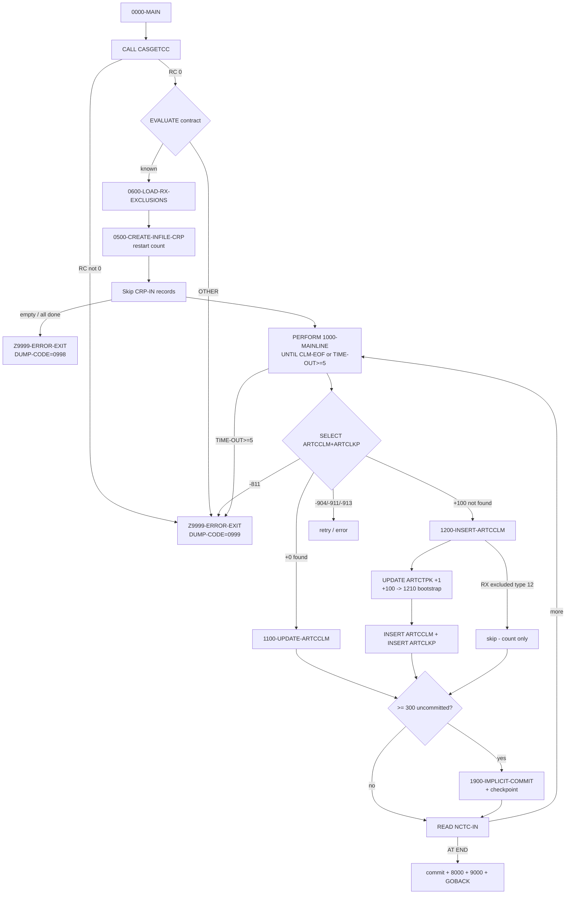

# CASNCTD9 — Program Logic Documentation

> **Source-availability / naming notice (read first).**
> The task prompt asked for analysis of **`CASNCTC0.txt`**. That file **does not exist** in this
> repository — it is absent from the working tree, from every branch, and from every object in
> git history (verified with `git rev-list --all --objects`). The **only** COBOL program that has
> ever existed in this repository is **`CASNCTD9`**, uploaded as `CASNCTD9_Version2.txt` in commit
> `251e7705a7eaf429f2354ec6f35937d58bbbf1ac` ("Add files via upload", 2026-09-17) and later removed
> by PR #1 ("Delete CASNCTD9_Version2.txt").
>
> Because the governing instruction is **"do not hallucinate under any circumstance,"** this
> documentation analyzes the program that actually exists (`CASNCTD9`) and is named after it.
> Fabricating a program called `CASNCTC0` would violate that instruction. If you actually have a
> separate `CASNCTC0` program, please add it to the repo and re-run; this document cannot describe
> source that is not present.
>
> **All line numbers below refer to `CASNCTD9_Version2.txt` as stored in commit `251e770`**
> (retrievable with `git show 251e770:CASNCTD9_Version2.txt`).

---

# 1. Analysis Method

## 1.1 Artifacts inspected
| Artifact | Status | Evidence |
|---|---|---|
| `CASNCTD9_Version2.txt` (COBOL source, 1,578 lines) | **Available** (via git commit `251e770`) | `IDENTIFICATION DIVISION. PROGRAM-ID. CASNCTD9.` (lines 1-2) |
| Copybook `NCTCLMS9` (input record layout) | **Referenced, not available** | `COPY NCTCLMS9 REPLACING ==(PREFIX)== BY ==CLM==` (line 92) |
| DCLGEN `CARTCTPK` (table `ARTCTPK`) | **Referenced, not available** | `EXEC SQL INCLUDE CARTCTPK` (line 241) |
| DCLGEN `ARTCCLM` (claim table) | **Referenced, not available** | `EXEC SQL INCLUDE ARTCCLM` (line 243) |
| DCLGEN `ARTCLKP` (claim-lookup table) | **Referenced, not available** | `EXEC SQL INCLUDE ARTCLKP` (line 245) |
| DCLGEN `ARTSPRF` (preferences table) | **Referenced, not available** | `EXEC SQL INCLUDE ARTSPRF` (line 248) |
| Copybook `PMONITOR` (process-monitor row) | **Referenced, not available** | `EXEC SQL INCLUDE PMONITOR` (lines 250-252) |
| `SQLCA` (DB2 comm area) | **Referenced, not available** | `EXEC SQL INCLUDE SQLCA` (line 238) |
| JCL / control cards / GDG definitions | **Not available** | No JCL exists in the repository |
| Called subprograms (`CASGETCC`, `DSNTIAR`, `ILBOABN0`) | **Referenced, not available** | `CALL` statements (lines 288, 1558, 1578) |

## 1.2 How logic was traced
- Read every division top-to-bottom: `IDENTIFICATION` (1-74), `ENVIRONMENT`/`FILE-CONTROL` (76-81),
  `DATA`/`FILE SECTION` (83-100), `WORKING-STORAGE` (102-268), `PROCEDURE DIVISION` (270-1578).
- Followed every `PERFORM`, `GO TO`, `EVALUATE`, and `IF` to establish paragraph sequencing.
- Traced each embedded `EXEC SQL` statement (7 distinct statements, numbered `1.`–`7.` in the source
  margin) and its `SQLCODE` handling.
- Traced every data movement into DB2 host variables (`MOVE`, `UNSTRING`, `INITIALIZE`, `INSPECT`,
  `COMPUTE`).

## 1.3 Proven vs inferred handling
- **Proven** = directly present in `CASNCTD9` source (statement, literal, or `SQLCODE` branch).
- **Inferred from structure/usage** = deduced from how a field/host variable is used, since the
  defining copybook/DCLGEN is not in the repo (e.g., a field used as a VARCHAR `-TEXT`/`-LEN` pair).
- **Not proven / Open question** = cannot be established from the present source alone (e.g., exact
  `PIC` clauses and byte offsets of `CLM-*` input fields, JCL DD names, meaning of external return
  codes).
- Standard DB2 `SQLCODE` meanings (e.g., `+100` = not found) are labelled as **DB2-standard
  (external knowledge)**, not as claims made by the source, wherever they appear.

## 1.4 Limitations
1. **No copybooks.** The physical layouts of the input record (`NCTCLMS9`) and of every DB2 table
   (`ARTCCLM`, `ARTCLKP`, `ARTCTPK`, `ARTSPRF`, `P_MONITOR`) are **not** in the repo. Field data
   types, lengths, and positions are therefore *not provable*; they are described by how the program
   uses them.
2. **No JCL / GDG / control-card definitions.** DD-name to dataset bindings, GDG generation policy,
   and the operational meaning of user abend codes are **not provable** from source.
3. **Called programs are black boxes.** `CASGETCC`, `DSNTIAR`, `ILBOABN0` behaviour is only known by
   how `CASNCTD9` calls them and inspects their return fields.
4. Comments in the source were used **only** where they are consistent with the executed code, and
   are labelled as comments when cited.

---

# 2. Program Overview

## 2.1 Identity (proven)
| Attribute | Value | Evidence |
|---|---|---|
| `PROGRAM-ID` | `CASNCTD9` | line 2 |
| Author / Installation | `JXZ` / `HMS` | lines 3-4 |
| Date written | `10/19/2020` | line 5 |
| Latest change tags | `0027` (07/10/25, populate `RX_WRITTEN_DT`) and `0028` (09/15/25, NY RX-encounter exclusion) | lines 67-74 |

## 2.2 Purpose (proven from header comments + code)
The program header states: *"THIS PGM WILL UPDATE DB2 TABLES FROM THE NEW CURRENT GDG OF PCFCASE
CLAIMS FILE (NCTCLMS1 300 FILE). THIS PROGRAM CLONED FROM CASNCTD7 FOR NY ONLY"* (lines 6-9). The
executable code confirms it reads a sequential claims file and **inserts or updates** rows in DB2
claim tables.

DB2 tables named in the header (lines 11-14) and confirmed in code:
- `DB2AR01.ARTCTPK` — **primary-key (sequence) table** (`UPDATE ARTCTPK … PK_NEXT_NUM = PK_NEXT_NUM + 1`, line 932-938).
- `ARTCCLM` — **claim table** (SELECT/UPDATE/INSERT, lines 781-791, 851-883, 1035-1101).
- `ARTCLKP` — **claim lookup table** (INSERT, lines 1179-1200; part of the driving SELECT join).
- `CTSPROD.SEC.ARTSPRF` — **preferences table** (cursor read, lines 259-266, 434-472).

Also updated: `MISC.P_MONITOR` — **process-monitor table** (lines 1333-1430).

## 2.3 Technical role & invocation style
- **Batch subprogram / main load step.** It uses `GOBACK` (line 377) as its normal terminator and
  `CALL 'ILBOABN0'` (line 1578) to force a user abend — consistent with a **batch program run as a
  JCL job step**. Whether it is the top-level program of the step or itself CALLed is **not proven**
  (no JCL). It is **not** a CICS program (no `EXEC CICS`).
- Reads one input file, maintains DB2 tables, writes one control file, and abends with a user
  completion code on error.

## 2.4 Upstream / downstream dependencies
| Direction | Dependency | Evidence | Proof level |
|---|---|---|---|
| Upstream | Sequential "PCFCASE claims" file on DD `NCTCLMI` | `SELECT NCTC-IN ASSIGN TO NCTCLMI` (line 79) | **Proven** (DD name), record content **inferred** (copybook absent) |
| Upstream | Contract number from subprogram `CASGETCC` | `CALL WS-CASGETCC USING CASGETCC-CALLING-AREA` (line 288) | **Proven** call; contents **inferred** |
| Upstream | Preferences in `CTSPROD.SEC.ARTSPRF` | cursor `ARTSPRF-CSR` (lines 259-266) | **Proven** query; row semantics per comments |
| Up/Down | Control/restart file on DD `DB2CNTLO` | `SELECT CNTL-IO ASSIGN TO DB2CNTLO` (line 81); read in `0500`, written in `1900` | **Proven** |
| Downstream | DB2 tables `ARTCTPK`, `ARTCCLM`, `ARTCLKP` | SQL statements | **Proven** |
| Downstream | `MISC.P_MONITOR` monitoring rows | SQL updates (lines 1333-1430) | **Proven** |
| Downstream | DB2 error formatter `DSNTIAR`; abend `ILBOABN0` | `CALL` (lines 1558, 1578) | **Proven** call |

---

# 3. Inputs, Outputs, and Dependencies

## 3.1 Files (`SELECT` / `FD`)
| Logical name | DD (ASSIGN) | Open mode(s) | FD facts | Record area |
|---|---|---|---|---|
| `NCTC-IN` | `NCTCLMI` | `INPUT` (lines 341) | `LABEL RECORDS STANDARD`, `RECORDING MODE F`, `RECORD CONTAINS 316 CHARACTERS` (lines 85-90) | `01 NCTCLAIM-RECORD` populated by `COPY NCTCLMS9 REPLACING ==(PREFIX)== BY ==CLM==` (lines 91-92) |
| `CNTL-IO` | `DB2CNTLO` | `INPUT` then `OUTPUT` (lines 337, 343) | `LABEL RECORDS STANDARD`, `RECORDING MODE F` (lines 95-99) | `01 CNTL-RECORD PIC X(38)` (line 100) |

> **Note (proven):** the input record length was changed to **316** by change tag `0027` (line 89).
> The internal field breakdown of the 316-byte record is defined in `NCTCLMS9`, which is **not
> available**; individual `CLM-*` fields are therefore documented by usage only (Section 4).

## 3.2 DB2 objects
| Object | Role | Operations in program | Evidence |
|---|---|---|---|
| `ARTCCLM` | Claim detail | `SELECT` (join), `UPDATE`, `INSERT` | lines 781-791, 851-905, 1035-1176 |
| `ARTCLKP` | Claim ↔ case lookup | `SELECT` (join), `INSERT` | lines 784-791, 1179-1228 |
| `ARTCTPK` | Per-context claim sequence (primary-key generator) | `UPDATE +1`, `SELECT next-1`, `INSERT` (bootstrap) | lines 932-1018, 1233-1273 |
| `CTSPROD.SEC.ARTSPRF` | Preferences | `SELECT` via cursor `ARTSPRF-CSR` | lines 259-266, 434-472 |
| `MISC.P_MONITOR` | Run/monitor telemetry | `UPDATE` (per context) | lines 1333-1430 |
| `SYSIBM.SYSDUMMY1` | Timestamp source | `SELECT CURRENT TIMESTAMP` | lines 1287-1291 |

## 3.3 Copybooks / includes
| Member | Purpose (per usage) | Availability |
|---|---|---|
| `NCTCLMS9` | Input claim record (`CLM-*` fields) | Not available |
| `SQLCA` | DB2 status area (`SQLCODE`) | Not available (standard IBM) |
| `CARTCTPK` | Host vars for `ARTCTPK` (`CTPK-*`) | Not available |
| `ARTCCLM` | Host vars for `ARTCCLM` (`CCLM-*`, group `DCLARTCCLM`) | Not available |
| `ARTCLKP` | Host vars for `ARTCLKP` (`CLKP-*`, group `DCLARTCLKP`) | Not available |
| `ARTSPRF` | Host vars for preferences (`NAME-CD`, `VALUE-TXT`, `CONTEXT-CD`) | Not available |
| `PMONITOR` | Host vars for `P_MONITOR` (`PMONITOR-*`) | Not available |

## 3.4 Called programs
| Program | How invoked | Interface used | Notes |
|---|---|---|---|
| `CASGETCC` | `CALL WS-CASGETCC USING CASGETCC-CALLING-AREA` (line 288); `WS-CASGETCC VALUE 'CASGETCC'` (line 200) | `HMS-3BYTE-CONTRACT-NUM`, `CASGETCC-RETURN-CODE` (lines 201-206) | Supplies the 3-byte contract/client id that drives all routing. `'0'` = success (line 291). |
| `DPSGTCON` | **Commented out** (lines 281-286, 193-198) | — | Superseded by `CASGETCC` (change `0007`). Not executed. |
| `DSNTIAR` | `CALL 'DSNTIAR' USING SQLCA ERROR-MESSAGE ERROR-LINE-LENGTH` (line 1558) | Formats `SQLCA` into `ERROR-MESSAGE` lines | Only on error path. |
| `ILBOABN0` | `CALL 'ILBOABN0' USING DUMP-CODE` (line 1578) | `DUMP-CODE` | Forces user abend with the code in `DUMP-CODE`. |

## 3.5 Control-card / profile dependencies
- **Restart control file** `DB2CNTLO` (`CNTL-IO`): carries prior-run committed counts; drives how
  many input records are skipped on restart (Sections 5.3, 5.9). **Proven.**
- **Preferences profile** `CTSPROD.SEC.ARTSPRF`: rows where `NAME_CD =
  'NY_RX_ENCOUNTER_EXCLUSION'` and `UPPER(VALUE_TXT) = 'TRUE'` list context codes whose RX
  (`CLM-CLAIM-TYPE = '12'`) claims must be excluded from insert (lines 259-266, 431-434, 916-930).
  **Proven.**

## 3.6 Important status codes & flags
| Name | Definition | Meaning in program | Evidence |
|---|---|---|---|
| `DUMP-CODE` | `PIC S9(04) COMP VALUE +3645` | User abend code passed to `ILBOABN0`. Default `3645`; set to `+0999` (contract errors) or `+0998` (no-data) | lines 104, 284, 293, 328, 356, 1578 |
| `CLM-EOF` (88 of `WS-CLM-EOF-FLAG`) | `VALUE 'Y'` | Input file EOF; ends main loop | lines 106-107, 833, 363 |
| `CNTL-EOF` (88) | `VALUE 'Y'` | Control file EOF | lines 108-109, 397 |
| `SQL-COMMIT-FREQ` | `PIC S9(05) COMP-3 VALUE +300` | Commit every 300 uncommitted DB2 ops | lines 110, 828 |
| `TIME-OUT-CTR` | `PIC S9(01) COMP-3` | DB2 contention retry counter; `>= 5` ⇒ abort | lines 223, 363-366, 811 |
| `SQL-NOT-COMMITED-YET-CTR` | `PIC S9(05) COMP-3` | Uncommitted DB2 ops in current LUW | lines 212, 825, 828, 367 |
| `RX-EXCL-FOUND` / `RX-EXCL-NOT-FOUND` (88) | of `WS-RX-EXCL-FOUND-SW` | Current claim matches an RX-exclusion context | lines 160-162, 915-930 |
| `CSR-EOF` / `CSR-NOT-EOF` (88) | of `WS-CSR-EOF-SW` | Preferences cursor EOF | lines 163-165, 462-463 |
| `SQLCODE` | from `SQLCA` | DB2 result of every `EXEC SQL` | throughout |

DB2 `SQLCODE` values the program explicitly branches on: `+0`, `+100`, `-811`, `-904`, `-911`,
`-913` (see Section 7). Their standard IBM meanings are noted as **DB2-standard** where used.

---

# 4. Data Structures and Important Fields

> Copybook layouts are **not available**; the tables below list fields **as used by the program**.
> "Defined?" means the field name appears (in `WORKING-STORAGE` it is defined here; `CLM-/CCLM-/…`
> come from absent copybooks). "Drives behavior?" flags fields whose value changes a branch.

## 4.1 Routing / context fields (WORKING-STORAGE, defined here)
| Field | PIC / value | Role | Drives behavior? |
|---|---|---|---|
| `HMS-3BYTE-CONTRACT-NUM` | `PIC X(03)` (in `CASGETCC-CALLING-AREA`, line 202) | 3-byte contract/client id from `CASGETCC` | **Yes** — main `EVALUATE` (299-330) and multiple `IF`s |
| `WS-CONTEXT-CD` | `PIC X(16)` (line 118) | Resolved DB2 context code | **Yes** — persisted to all 3 tables; RX-exclusion compare |
| `WS-LAST-UPDATE-NM` | `PIC X(08)` (line 127) | Update-author stamp per contract | **Yes** — written to tables; concurrency check (line 1011) |
| `WS-CONTEXT-CD-1 … -7` | `PIC X(16)` (119-125) | Distinct context codes seen (for counting/monitor) | Yes — counter routing (1106-1154) |
| `WS-CONTEXT-CD6` | `PIC X(06)` (line 126) | First-6 client-id overlay for multi-context contracts | **Yes** (504-505) |

## 4.2 RX-exclusion table (WORKING-STORAGE, change `0028`)
| Field | PIC / value | Role |
|---|---|---|
| `WS-RX-EXCL-TABLE` (line 152) | group | Holds excluded context codes |
| `WS-RX-EXCL-CNT` | `S9(04) COMP` (153) | Count of loaded exclusions |
| `WS-RX-EXCL-MAX` | `S9(04) COMP VALUE +50` (154) | Capacity guard |
| `WS-RX-EXCL-ENTRY OCCURS 50` → `WS-RX-EXCL-CONTEXT-CD PIC X(16)` (156-157) | table | One excluded context per entry |
| `WS-RX-EXCL-SKIP-CTR` | `S9(07) COMP-3` (166) | Count of RX inserts skipped |

## 4.3 Diagnosis-code parsing helpers (WORKING-STORAGE, change `0010`)
| Field | PIC | Role |
|---|---|---|
| `WK-DIAG-CODE` | `X(7)` (131) | Work copy of a diagnosis code |
| `WS-DIAG-CODE-4` REDEFINES → `WS-DIAG-CODE-41 X(3)`, `FILLER X`, `WS-DIAG-CODE-42 X(3)` (132-135) | redefine | Splits `nnn.nn` around the `.` |
| `WS-DIAG-CODE-412` → `-411 X(3)`, `-422 X(3)`; `WS-DIAG-CODE-N` REDEFINES as `X(6)` (136-140) | redefine | Rejoins the two 3-char halves without the `.` |
| `COUNT-M` | `S9(3) COMP-3` (141) | Count of characters before the first `.` |

## 4.4 Counters (WORKING-STORAGE)
| Field | PIC | Meaning |
|---|---|---|
| `REC-READ-CTR` | `S9(07) COMP-3` (209) | Input records read (incl. skipped on restart) |
| `SQL-INSERT-CTR` / `SQL-INSERT-COMMITTED-CTR` | `S9(09) COMP-3` (210, 213) | `ARTCCLM` inserts in LUW / committed total |
| `SQL-UPDATE-CTR` / `SQL-UPDATE-COMMITTED-CTR` | `S9(07) COMP-3` (211, 221) | `ARTCCLM` updates in LUW / committed total |
| `SQL-TOT-COMMITTED-CTR` | `S9(07) COMP-3` (222) | Total committed (insert+update) — written to control record |
| `WS-CONTEXT-CD-1-CNT … -7-CNT` | `S9(12) COMP-3` (214-220) | Per-context insert counts (for `P_MONITOR`) |
| `WS-CNTL-RECS-OUT / -HOLD / -TOT` | `S9(07) COMP-3` (113-115) | Restart accounting (Section 5.3) |
| `CRP-IN` | `S9(07) COMP-3` (116) | Restart "skip count + 1" loop bound (line 344) |

## 4.5 DB2 host-variable groups (from absent DCLGENs — inferred by usage)
- **`DCLARTCCLM` / `CCLM-*`** — claim table host vars. `INITIALIZE`d each cycle (line 491). VARCHAR
  columns are used as `-TEXT`/`-LEN` (short form `-T`/`-L`) pairs, e.g. `CCLM-CONTEXT-CD-T` +
  `CCLM-CONTEXT-CD-L` (lines 598-603). Columns touched: see Section 3.2 and the INSERT list
  (lines 1035-1064).
- **`DCLARTCLKP` / `CLKP-*`** — lookup host vars: `CLKP-CONTEXT-CD`, `CLKP-CASE-ID`, `CLKP-CLAIM-ID`,
  `CLKP-LAST-UPDATE-NM` (lines 788-789, 1190-1194).
- **`DCLARTCTPK` / `CTPK-*`** — sequence host vars: `CTPK-CONTEXT-CD`, `CTPK-PK-NEXT-NUM`,
  `CTPK-LAST-UPDATE-NM(-TEXT/-LEN)`, `CTPK-LAST-UPDATE-DTM`, `CTPK-PK-MASK-TXT` (lines 971-976, 1011,
  1242-1247).
- **`ARTSPRF` host vars** — `NAME-CD-TEXT`/`NAME-CD-LEN`, `CONTEXT-CD-TEXT`/`CONTEXT-CD-LEN`
  (lines 431-432, 444, 454-456).
- **`PMONITOR-*`** — `PMONITOR-STATUS-TXT(-TEXT/-LEN)` etc. (lines 330-331, 1330-1336).

## 4.6 Key match / sort / update keys (proven from SQL)
| Purpose | Keys | Evidence |
|---|---|---|
| Driving **match** (exists?) | `ARTCCLM`: `CONTEXT_CD`, `ICN_NUM`, `CLMST_RF`; `ARTCLKP`: `CONTEXT_CD`, `CASE_ID`; join `CONTEXT_CD` + `CLAIM_ID` | lines 785-791 |
| **UPDATE** key | `ARTCCLM`: `CONTEXT_CD`, `CLAIM_ID`, `ICN_NUM` | lines 880-882 |
| **Sequence** key | `ARTCTPK`: `CONTEXT_CD`, `PK_TYPE_CD='CLM'` | lines 936-937, 975-976 |
| **Preferences** filter | `ARTSPRF`: `NAME_CD`, `UPPER(VALUE_TXT)='TRUE'`, order by `CONTEXT_CD` | lines 263-265 |
| **P_MONITOR** key | `CLIENT_CD` (= contract), `CONTEXT_CD`, `PROCESS_NM LIKE 'CLKP_LOAD_DURATION_%'` | lines 1338-1350 |

There is **no COBOL `SORT`/`MERGE`** verb in the program; ordering is delegated to DB2 (`ORDER BY`,
line 265). No file `DELETE`/`REWRITE`; the control file is sequentially `WRITE`n (line 1304).

---

# 5. Processing Logic

Paragraph inventory (proven): `0000-MAIN`, `0500-CREATE-INFILE-CRP`, `0600-LOAD-RX-EXCLUSIONS`,
`1000-MAINLINE`, `1100-UPDATE-ARTCCLM`, `1200-INSERT-ARTCCLM`, `1210-INSERT-ARTCTPK`,
`1900-IMPLICIT-COMMIT`, `8000-P-MONITOR`, `9000-TERMINATION`, `9100-DISPLAY-COUNTERS`,
`Z9999-ERROR-EXIT`. (`8100-P-MONITOR-INS` is fully commented out, lines 1457-1503.)

## 5.1 Initialization & contract resolution — `0000-MAIN` (271-335)
1. Display program banner with `FUNCTION WHEN-COMPILED` reformatted (273-280).
2. `CALL 'CASGETCC'` to obtain `HMS-3BYTE-CONTRACT-NUM` (288). If `CASGETCC-RETURN-CODE NOT = '0'`,
   set `DUMP-CODE = +0999` and `GO TO Z9999-ERROR-EXIT` (291-295).
3. **`EVALUATE HMS-3BYTE-CONTRACT-NUM`** (299-330) maps contract → (`WS-CONTEXT-CD`,
   `WS-LAST-UPDATE-NM`):

   | Contract | `WS-CONTEXT-CD` | `WS-LAST-UPDATE-NM` |
   |---|---|---|
   | `320` | `CTSCASNY` | `WNYCDF40` |
   | `300` (TEST) | `CTSCASTST` | `WTTCDF40` |
   | `326` | `CTSCASCO` | `WCOCDF40` |
   | `341` | `CTSCASOH` | `WOHCDF40` |
   | `535` | `CTSCASOH` | `WCXCDF40` |
   | `313` | `CTSCASFL` | `WFLCDF40` |
   | `319` | `CTSCASCT` | `WCTCDF40` |
   | `317` | `CTSWRCCA` | `WCACDF40` |
   | `590` | `CTSCASAL` | `WALCDF40` |
   | `330` | `CTSCASAR` | `WARCDF40` |
   | `358` | `CTSCASNV` | `WNVCDF40` |
   | `359` | `CTSCASNM` | `WNMCDF40` |
   | `645` | `CTSCASWV` | `WWVCDF40` |
   | **OTHER** | *(none)* | Sets `DUMP-CODE=+0999`, `GO TO Z9999-ERROR-EXIT` (326-329) |

## 5.2 Load RX exclusions — `0600-LOAD-RX-EXCLUSIONS` (426-488)
- `MOVE 'NY_RX_ENCOUNTER_EXCLUSION' TO NAME-CD-TEXT`, `MOVE +25 TO NAME-CD-LEN` (431-432).
- `OPEN ARTSPRF-CSR`; non-zero `SQLCODE` ⇒ error exit (434-439).
- `FETCH` loop (`PERFORM UNTIL CSR-EOF`, 441-470):
  - `SQLCODE +0`: if `WS-RX-EXCL-CNT < WS-RX-EXCL-MAX (50)`, store fetched `CONTEXT-CD-TEXT
    (1:CONTEXT-CD-LEN)` (space-padded to 16) into next `WS-RX-EXCL-CONTEXT-CD` entry (448-457); else
    warn "table full" (459-460).
  - `SQLCODE +100`: `SET CSR-EOF TO TRUE` (462-463).
  - other: error exit (464-468).
- `CLOSE ARTSPRF-CSR` (non-zero ⇒ warn only, 472-476); display loaded count and entries (478-487).

## 5.3 Restart accounting — open control file & `0500-CREATE-INFILE-CRP` (337-411)
- `OPEN INPUT CNTL-IO`; `PERFORM 0500-CREATE-INFILE-CRP`; `CLOSE CNTL-IO` (337-339).
- `0500` reads every control record `INTO WS-CONTROL-RECORD` (379-400). For records with
  `CNTL-PROC-FLAG = '-'` it accumulates `NUM-REC-OUT` values into `WS-CNTL-RECS-OUT-TOT` using a
  hold/reset pattern (`WS-CNTL-RECS-OUT-HOLD`) that resets when a smaller count is seen (386-399).
  Net result: `WS-CNTL-RECS-OUT-TOT` = number of input records already committed by prior runs.
- If the last control record's `CNTL-PROC-FLAG = 'N'`, it displays *"BYPASS DB2 CONTROL FILE
  PROCESSING"* (402-404); because the accumulation is guarded by `= '-'`, a `'N'` flag leaves
  `WS-CNTL-RECS-OUT-TOT = 0`, i.e. **no records skipped** (full reprocess). *(Intent inferred from
  structure/usage; not stated in source.)*

## 5.4 Skip previously-processed records (341-360)
- `OPEN INPUT NCTC-IN OUTPUT CNTL-IO` (341-343).
- `COMPUTE CRP-IN = WS-CNTL-RECS-OUT-TOT + 1` (344).
- `PERFORM CRP-IN TIMES: READ NCTC-IN` (345-360):
  - `AT END`: if `REC-READ-CTR = 0` ⇒ *"PCFCASE CLAIMS FILE IS EMPTY"*; else *"ALL n INPUT RECORDS
    HAVE BEEN PROCESSED PREVIOUSLY"* (348-354). Either way `MOVE +0998 TO DUMP-CODE` and
    `GO TO Z9999-ERROR-EXIT` (356-357).
  - `NOT AT END`: `ADD 1 TO REC-READ-CTR` (358).

> The `+0998` case is annotated by change `0011` (lines 32-34) as *"RC 0998 GOOD COMPLETION WHEN
> THERE IS NO DATA IN THE INPUT FILE."* Mechanically the code still routes through
> `Z9999-ERROR-EXIT` (rollback, `P_MONITOR` = `FAILURE`, `ILBOABN0` with `0998`). How `0998` is
> treated as a *good* completion is external (JCL/operations) and **not proven** from source.

## 5.5 Main loop — `0000-MAIN` driver + `1000-MAINLINE` (362-836)
- `PERFORM 1000-MAINLINE THRU 1000-MAINLINE-EXIT UNTIL CLM-EOF OR TIME-OUT-CTR >= 5` (362-363).
- After the loop: if `TIME-OUT-CTR >= 5` ⇒ `GO TO Z9999-ERROR-EXIT` (364-366); if uncommitted work
  remains, final `1900-IMPLICIT-COMMIT` (367-369); set `WS-STATUS-TXT='SUCCESS'`, `PERFORM
  8000-P-MONITOR` and `9000-TERMINATION`; `CLOSE` files; `GOBACK` (370-377).

### 5.5.1 Per-record field preparation (`1000-MAINLINE`, 490-778)
1. `INITIALIZE DCLARTCTPK DCLARTCCLM DCLARTCLKP` (491) — clears all target host vars each cycle.
2. **Multi-context contracts** `326/590/359/645`: `MOVE CLM-HMS-CLIENT-ID TO WS-CONTEXT-CD6`, then
   `WS-CONTEXT-CD6 TO WS-CONTEXT-CD (1:6)` (499-506) — overlays the first 6 chars of the context with
   the client id (positions 7-8 retain the `EVALUATE` default).
3. **Contract `320` (NY)** — `EVALUATE CLM-HMS-CLIENT-ID` (512-544):
   `CTSCEN→CTSCASEX-NY`, `CTSCCN→CTSCASNYC`, `CTSECN→CTSESTNY`, `CTSEEN→CTSESTEX-NY`,
   `CTSCON→CTSCASNYOP1`, `CTSEON→CTSESTNYOP1`, **OTHER→`CTSCASNY`**.
4. **Contract `313` (FL)** — `EVALUATE CLM-HMS-CLIENT-ID` (567-590):
   `CTSCAS→CTSCASFL`, `CTSEST→CTSESTFL`, `CTSTRS→CTSTRSFL`, `CTSMST→CTSCASMT-FL`, **OTHER→`CTSCASFL`**.
5. `UNSTRING WS-CONTEXT-CD DELIMITED BY ALL SPACES` → text+length into `CCLM/CTPK/CLKP CONTEXT-CD`
   (592-603).
6. Copy/convert input claim fields into `CCLM-*` host vars (605-777):
   - `UNSTRING` of `CLM-ICN`→`CCLM-ICN-NUM`, `CLM-FORMER-ICN`→`CCLM-PREV-ICN-NUM`,
     `CLM-RECIPIENT-ID-NUM`→`CCLM-RECIP-MA-NUM`, `CLM-PROVIDER-NUM`→`CCLM-PROVIDER-ID`,
     `CLM-CLAIM-TYPE`→`CCLM-CLMTP-RF`, `CLM-UNITS-OF-SERVICE`→`CCLM-UNITS-NUM`,
     `CLM-CDE-ICD-VERSION`→`CCLM-ICD-VERSION`, `CLM-AGENCY-CODE`→`CCLM-AGENCY-CD`.
   - `MOVE CLM-HMS-CASE-KEY TO CLKP-CASE-ID` (610).
   - `WS-LAST-UPDATE-NM` and literal length `8` → `CCLM/CTPK/CLKP LAST-UPDATE-NM` (612-620).
   - `CLM-CLAIM-STATUS`→`CCLM-CLMST-RF` (len 1); `CLM-TRANSACTION-TYPE`→`CCLM-TRNTP-RF` (len 1)
     (644-648).
   - Amounts: `CLM-CHARGE-AMT`/`CLM-PAID-AMT` → `WS-DE-EDIT (S9(7)V99)` → `CCLM-CHARGE-AMT`/
     `CCLM-PAID-AMT` (660-663).
   - Dates reformatted `CCYYMMDD` → `CCYY-MM-DD`: `CLM-DOR-A`→`CCLM-REMIT-DT`,
     `CLM-SERVICE-DATE-FROM-A`→`CCLM-SERVICE-FROM-DT`, `CLM-SERVICE-DATE-TO-A`→`CCLM-SERVICE-TO-DT`
     (665-684).
   - **Service code split by claim type** (686-700): if `CLM-CLAIM-TYPE = '12'` → `CLM-SVC-CODE` to
     `CCLM-NDCCD-RF` (NDC); else → `CCLM-ICD9P-RF` (procedure), and if `CCLM-ICD9P-RF-L > +10` force
     length to `+10` (697-699, change `0020`).
   - **Diagnosis codes** primary→`CCLM-ICD9D-RF` (702-726) and secondary→`CCLM-ICD9D-2ND-RF`
     (728-752): count chars before `'.'`; if exactly `3`, strip the `'.'` (join the two 3-char
     halves); else, if any chars before `'.'` and first char is a space, left-shift one; then
     `UNSTRING`.
   - `EVALUATE CLM-CREATE-SOURCE` (754-759): `'00'→'STANDARD MEDICAID'`, `'01'→'DSS'` into
     `CCLM-CREATE-SOURCE-NM` (no `WHEN OTHER` ⇒ any other value leaves it as the `INITIALIZE`d value,
     i.e. spaces).
   - `MOVE CLM-COUNTY-CD TO CCLM-COUNTY-CD` (771).
   - `ALT_CLIENT_CD`: if contract `535` → `'535'` else spaces (773-777).

### 5.5.2 Driving decision — does the claim already exist? (781-823)
`EXEC SQL SELECT L.CLAIM_ID INTO :CCLM-CLAIM-ID FROM ARTCCLM C, ARTCLKP L WHERE …` matches on
`CONTEXT_CD`, `ICN_NUM`, `CLMST_RF`, `CASE_ID` and the `C↔L` join. Then `EVALUATE SQLCODE`:
| `SQLCODE` | Action |
|---|---|
| `+0` (found) | `PERFORM 1100-UPDATE-ARTCCLM` |
| `+100` (not found) | `PERFORM 1200-INSERT-ARTCCLM` |
| `-811` (>1 row) | Display "MULTIPLE CLAIM_ID…"; `GO TO Z9999-ERROR-EXIT` (798-803) |
| `-904/-911/-913` | Contention handling (Section 7.2) |
| OTHER | Error exit (819-822) |

### 5.5.3 Commit cadence & next read (825-835)
- `ADD +1 TO SQL-NOT-COMMITED-YET-CTR`; if `>= SQL-COMMIT-FREQ (300)` ⇒ `1900-IMPLICIT-COMMIT`.
- `READ NCTC-IN`: `AT END SET CLM-EOF`; `NOT AT END ADD 1 TO REC-READ-CTR`.

## 5.6 Update path — `1100-UPDATE-ARTCCLM` (838-906)
- Build `RX_WRITTEN_DT` null indicator: if `CLM-RX-WRITTEN-DATE` is spaces/zeros/low-values ⇒ value
  spaces + indicator `-1` (NULL); else value = date + indicator `+1` (840-850).
- `UPDATE ARTCCLM SET …` (all claim columns, `LAST_UPDATE_DTM = CURRENT TIMESTAMP`,
  `RX_WRITTEN_DT = (:val :ind)`) `WHERE CONTEXT_CD/CLAIM_ID/ICN_NUM` (851-883).
- `SQLCODE +0` ⇒ `ADD +1 TO SQL-UPDATE-CTR` (885-886); `-904/-911/-913` contention (887-900); OTHER
  error exit (901-904).

> **Business-relevant nuance (proven):** the RX-exclusion check lives **only** in the insert path
> (`1200`), not here. An *already-existing* matching claim is **updated** even if it is an RX
> (`'12'`) claim in an excluded context.

## 5.7 Insert path — `1200-INSERT-ARTCCLM` (908-1229)
1. **RX-encounter exclusion** (915-930): `SET RX-EXCL-NOT-FOUND`; if `CLM-CLAIM-TYPE = '12'` and
   `WS-RX-EXCL-CNT > 0`, scan `WS-RX-EXCL-CONTEXT-CD(1..cnt)` for `WS-CONTEXT-CD`; if found,
   `ADD +1 TO WS-RX-EXCL-SKIP-CTR` and `GO TO 1200-INSERT-EXIT` (**skip both inserts**).
2. **Bump sequence** `UPDATE ARTCTPK SET PK_NEXT_NUM = PK_NEXT_NUM + 1 …` (932-938). `SQLCODE +100`
   (no PK row yet) ⇒ `PERFORM 1210-INSERT-ARTCTPK` (bootstrap, 942-945).
3. **Read the number to use** `SELECT PK_NEXT_NUM - 1 …` into `CTPK-PK-NEXT-NUM` +
   `CTPK-LAST-UPDATE-NM` + `CTPK-LAST-UPDATE-DTM` (967-977).
4. **Concurrency guard** (1011-1018): if `CTPK-LAST-UPDATE-NM-TEXT(1:len) NOT = WS-LAST-UPDATE-NM`
   ⇒ "UNCOMMITTED INTERVENTION TO ARTCTPK" and `GO TO Z9999-ERROR-EXIT`.
5. `MOVE CTPK-PK-NEXT-NUM TO CCLM-CLAIM-ID CLKP-CLAIM-ID` (1020-1021); rebuild `RX_WRITTEN_DT`
   indicator (1022-1033).
6. **`INSERT INTO ARTCCLM (…) VALUES (…)`** (1035-1101). On `+0`: `ADD +1 TO SQL-INSERT-CTR` and
   register `WS-CONTEXT-CD` into the first free `WS-CONTEXT-CD-1..7` slot then increment its counter
   (1103-1154).
7. **`INSERT INTO ARTCLKP (…) VALUES (…)`** with `RELATE_IND='0'`, `IS_AUTO_CHECKED='N'` (1179-1200).
8. Every insert’s `-904/-911/-913` path may `ROLLBACK` + retry (`TIME-OUT-CTR`) or error exit
   (Section 7.2).

## 5.8 PK bootstrap — `1210-INSERT-ARTCTPK` (1231-1274)
`INSERT INTO ARTCTPK (CONTEXT_CD,'CLM','CASE TRACKING SYSTEM CLAIM',:mask,+2,:name,CURRENT
TIMESTAMP)` — creates the sequence row for a context with none, seeding `PK_NEXT_NUM = +2` (so the
subsequent `PK_NEXT_NUM - 1 = 1` is the first claim id). On `+0` displays *"NEW PK_TYPE_CD = 'CLM'
INSERTED"* (1252-1254).

## 5.9 Commit & checkpoint — `1900-IMPLICIT-COMMIT` (1276-1313)
- `EXEC SQL COMMIT`; non-zero ⇒ error exit (1277-1282).
- Get timestamp via `SELECT DISTINCT(CURRENT TIMESTAMP) FROM SYSIBM.SYSDUMMY1`; on failure fall back
  to `FUNCTION CURRENT-DATE` (1287-1299).
- Write restart checkpoint: `MOVE '-' TO CNTL-PROC-FLAG`, add LUW count to `SQL-TOT-COMMITTED-CTR`,
  `MOVE … TO NUM-REC-OUT`, `WRITE CNTL-RECORD FROM WS-CONTROL-RECORD` (1301-1304).
- Roll LUW counters into committed totals; zero the LUW counters and `TIME-OUT-CTR` (1306-1312).

## 5.10 Monitoring — `8000-P-MONITOR` (1315-1455)
`UPDATE MISC.P_MONITOR` a general row (`DATA_CNT = 0`) and then one row per distinct
`WS-CONTEXT-CD-1..7` (guarded so identical adjacent codes are not double-updated), keyed by
`CLIENT_CD = HMS-3BYTE-CONTRACT-NUM`, `CONTEXT_CD`, `PROCESS_NM LIKE 'CLKP_LOAD_DURATION_%'`, setting
`STATUS_TXT` (`SUCCESS`/`FAILURE`), `END_DTM = CURRENT TIMESTAMP`, `TASK_STEP_TXT='LOAD'`. `SQLCODE
+0` ⇒ `COMMIT`; `+100` ⇒ display "P-MONITOR ROW NON-EXISTANT"; OTHER ⇒ display (does **not** abend —
`GO TO Z9999-ERROR-EXIT` is commented out at 1452).

## 5.11 Termination & counters — `9000`/`9100` (1505-1554)
`9100-DISPLAY-COUNTERS` prints read count, inserted/updated/total committed, per-context counts, and
"NY RX ENCOUNTER CLAIMS EXCLUDED (SKIPPED)". `9000` adds *"PGM CASNCTD9 NORMAL END"*.

## 5.12 Error exit — `Z9999-ERROR-EXIT` (1556-1578)
If `SQLCODE NOT = +0`, `CALL 'DSNTIAR'` and display 7 formatted lines; `EXEC SQL ROLLBACK`;
`9100-DISPLAY-COUNTERS`; *"PGM CASNCTD9 ABENDED"*; set `WS-STATUS-TXT='FAILURE'`, `PERFORM
8000-P-MONITOR`; finally `CALL 'ILBOABN0' USING DUMP-CODE` (user abend).

### Control-flow (proven)

---

# 6. Extracted Business Logic

> Expressed as rules; each cites source lines. "Context code" = the CTS context the claim is loaded
> under; "RX claim" = `CLM-CLAIM-TYPE = '12'`.

## 6.1 Routing rules
- **BR-R1** When `CASGETCC` returns the contract id, the system shall map it to a context code and an
  update-author name per the table in 5.1. *(299-330)*
- **BR-R2** When the contract is **not** in the known list, the program shall abend with user code
  `0999`. *(326-329)*
- **BR-R3** For contracts `326/590/359/645`, the first 6 characters of the context code shall be
  taken from `CLM-HMS-CLIENT-ID`. *(499-506)*
- **BR-R4** For NY (`320`), the specific context is chosen by `CLM-HMS-CLIENT-ID`
  (`CTSCEN/CTSCCN/CTSECN/CTSEEN/CTSCON/CTSEON`), defaulting to `CTSCASNY`. *(512-544)*
- **BR-R5** For FL (`313`), the specific context is chosen by `CLM-HMS-CLIENT-ID`
  (`CTSCAS/CTSEST/CTSTRS/CTSMST`), defaulting to `CTSCASFL`. *(567-590)*
- **BR-R6** For OH CareSource (`535`) the system shall stamp `ALT_CLIENT_CD = '535'`; otherwise
  `ALT_CLIENT_CD` is spaces. *(773-777)* Both `341` and `535` use context `CTSCASOH`. *(306-309)*

## 6.2 Match / upsert rules
- **BR-M1** A claim is considered *existing* when a row is found joining `ARTCCLM`+`ARTCLKP` on
  matching `CONTEXT_CD`, `ICN_NUM`, `CLMST_RF`, and `CASE_ID`. *(781-791)*
- **BR-M2** When the claim exists, the system shall **update** `ARTCCLM` (BR-U*). *(794-795)*
- **BR-M3** When the claim does not exist, the system shall **insert** a new claim and lookup row
  (BR-I*). *(796-797)*
- **BR-M4** When more than one matching claim exists (`-811`), the program shall abend (data-integrity
  guard). *(798-803)*

## 6.3 Insert / sequence rules
- **BR-I1** New claim ids are drawn from `ARTCTPK.PK_NEXT_NUM` per context: bump `+1`, then use
  `PK_NEXT_NUM - 1`. *(932-1020)*
- **BR-I2** If a context has no sequence row, the system shall create one seeded at `+2`
  (first id = 1). *(1233-1249)*
- **BR-I3** Before using the sequence, the system shall verify the sequence row's `LAST_UPDATE_NM`
  equals its own author name; a mismatch means concurrent intervention and the program abends.
  *(1011-1018)*
- **BR-I4** Every inserted claim also creates an `ARTCLKP` row with `RELATE_IND='0'` and
  `IS_AUTO_CHECKED='N'`. *(1179-1200)*

## 6.4 Exclusion / duplicate / special-case rules
- **BR-X1** When an RX claim (`'12'`) would be **inserted** and its context is in the
  `NY_RX_ENCOUNTER_EXCLUSION` preference list, the system shall **skip the insert** (both `ARTCCLM`
  and `ARTCLKP`) and count it as excluded. *(915-930, 1548-1550)*
- **BR-X2** RX exclusion does **not** apply to updates — existing RX claims are still updated.
  *(exclusion code only in `1200`, not `1100`)*
- **BR-X3** Preference rows are honoured only when `NAME_CD='NY_RX_ENCOUNTER_EXCLUSION'` **and**
  `UPPER(VALUE_TXT)='TRUE'`. *(263-264)*
- **BR-X4** At most **50** exclusion contexts are honoured; extras are ignored with a warning.
  *(448-461)*

## 6.5 Field transformation rules
- **BR-T1** Amounts `CHARGE_AMT`/`PAID_AMT` pass through `WS-DE-EDIT S9(7)V99` (2-decimal scaling).
  *(660-663)*
- **BR-T2** Dates are converted `CCYYMMDD → CCYY-MM-DD` for `REMIT_DT`, `SERVICE_FROM_DT`,
  `SERVICE_TO_DT`. *(665-684)*
- **BR-T3** Service code routes to `NDCCD_RF` for RX (`'12'`) or `ICD9P_RF` otherwise (capped at 10).
  *(686-700)*
- **BR-T4** Diagnosis codes with exactly 3 characters before a decimal point have the `.` stripped;
  a single leading space is trimmed otherwise. *(702-752)*
- **BR-T5** `CREATE_SOURCE_NM` is `'STANDARD MEDICAID'` for `'00'`, `'DSS'` for `'01'`, else spaces.
  *(754-759)*
- **BR-T6** `RX_WRITTEN_DT` is stored NULL when the input date is spaces/zeros/low-values, else the
  input value. *(840-850, 1022-1033)*

## 6.6 Checkpoint / restart rules
- **BR-C1** The system commits every `300` DB2 operations and at end of file. *(828, 367)*
- **BR-C2** Each commit writes a checkpoint (cumulative committed count) to the control file.
  *(1301-1304)*
- **BR-C3** On restart, the system skips the number of input records recorded as already committed.
  *(344-360, 0500)*
- **BR-C4** A control record flagged `'N'` bypasses skipping (full reprocess). *(402-404; inferred)*

---

# 7. Error Handling and Edge Cases

## 7.1 File status
- **No explicit `FILE STATUS` fields** are declared for `NCTC-IN` or `CNTL-IO`. EOF is handled via
  `AT END` clauses only (lines 347-357, 380-383, 396-399, 832-834). I/O errors other than EOF are
  **not** trapped in code ⇒ they would raise a runtime file-status abend handled by the runtime, not
  by the program. **(Open question:** behaviour on a physical I/O error is not defined in source.)

## 7.2 DB2 contention (`-904` unavailable resource / `-911` deadlock-rollback / `-913` deadlock-no-rollback — DB2-standard meanings)
Uniform pattern at each DB2 statement (e.g., 804-818, 887-900, 946-959, 984-1005, 1155-1171,
1204-1220, 1255-1268):
- If `SQL-NOT-COMMITED-YET-CTR = 0` (nothing uncommitted): `ADD 1 TO TIME-OUT-CTR`, display attempt,
  (for some statements) `ROLLBACK`, then `GO TO 1000-MAINLINE-EXIT` → the **same record is retried**
  (the trailing `READ` is skipped). After **5** attempts the driver aborts (`TIME-OUT-CTR >= 5`,
  lines 363-366).
- Else (work already pending in the LUW): `GO TO Z9999-ERROR-EXIT` immediately (cannot safely retry).

## 7.3 Return / abend codes (`DUMP-CODE` → `ILBOABN0`)
| Code | Trigger | Evidence |
|---|---|---|
| `3645` (default) | Any error path that does **not** reset `DUMP-CODE` (most SQL errors, `-811`, concurrency, timeout, failed commit) | line 104 default; many `GO TO Z9999-ERROR-EXIT` |
| `0999` | `CASGETCC` RC ≠ `'0'`; unknown contract | lines 293, 328 |
| `0998` | Input empty / all records already processed (intended "good" no-data completion per comment `0011`) | lines 356, 32-34 |

## 7.4 Data-integrity guards
- `-811` on the driving SELECT ⇒ abort ("MULTIPLE CLAIM_ID FOR ICN_NUM"). *(798-803)*
- `ARTCTPK` author mismatch ⇒ abort (uncommitted intervention). *(1011-1018)*

## 7.5 Monitoring resilience
- `8000-P-MONITOR` **does not abend** on a missing/failed monitor row (the `GO TO Z9999-ERROR-EXIT`
  is commented out, line 1452); it only displays a message so the main load result is preserved.

## 7.6 Edge cases (proven from code)
- Contract `300` is a **TEST** route (context `CTSCASTST`), tagged `TEST` in the sequence area
  (302-303).
- `CREATE_SOURCE` other than `'00'/'01'` ⇒ `CREATE_SOURCE_NM` left as spaces (no `WHEN OTHER`).
- Diagnosis code with `0` chars before `'.'` ⇒ no left-shift, `UNSTRING` as-is (714-725).
- Exclusion table beyond 50 entries ⇒ extra rows ignored with warning (458-461).

---

# 8. Proven vs Inferred vs Unknown

## 8.1 Proven from source
- `PROGRAM-ID CASNCTD9`; batch/DB2; `GOBACK` normal end; `ILBOABN0` abend. *(2, 377, 1578)*
- File `SELECT`/`FD` for `NCTC-IN` (`NCTCLMI`, 316 bytes) and `CNTL-IO` (`DB2CNTLO`, 38 bytes).
  *(79-100)*
- All 7 `EXEC SQL` statements, their tables, keys, and `SQLCODE` branches. *(781-1453)*
- Contract→context routing tables and NY/FL sub-routing. *(299-590)*
- RX-exclusion mechanism, commit cadence (`300`), restart skipping, abend codes
  `3645/0999/0998`.
- All field transformations in `1000-MAINLINE` (amounts, dates, service/diagnosis codes,
  create-source, RX-written-date null handling).

## 8.2 Inferred from structure / usage (copybooks absent)
- Data types, lengths, and byte offsets of every `CLM-*` input field (from `NCTCLMS9`).
- Column data types of `ARTCCLM/ARTCLKP/ARTCTPK/ARTSPRF/P_MONITOR` (from DCLGENs); VARCHAR
  `-TEXT`/`-LEN` handling inferred from the paired moves.
- Restart-accounting intent in `0500` (hold/reset accumulation) and the `'N'` bypass semantics.
- Standard IBM meanings of `SQLCODE` values (labelled DB2-standard).

## 8.3 Open questions / not proven
- **Where is `CASNCTC0`?** Not in this repository at all (see top notice). Its logic cannot be
  documented from source.
- Exact record layout of the 316-byte input (needs `NCTCLMS9`).
- JCL: DD-to-dataset bindings, GDG policy, and how the operating environment interprets abend codes
  `0998/0999/3645` (e.g., whether `0998` is mapped to a "good" step return code).
- Behaviour of `CASGETCC`, `DSNTIAR`, `ILBOABN0` internals.
- Physical I/O-error (non-EOF) behaviour for the two files (no `FILE STATUS` coded).
- Whether the program is the top-level step program or a called sub-step (no JCL).
