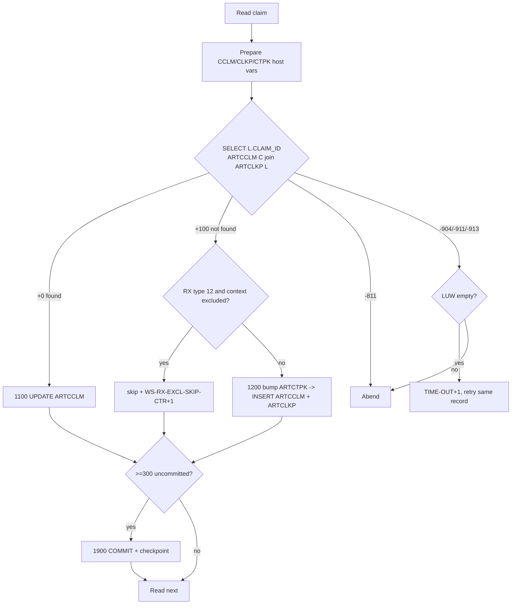
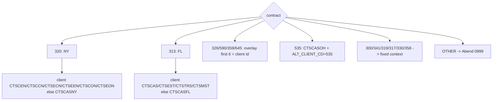
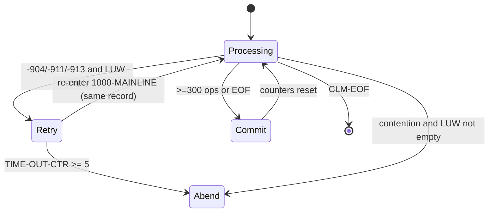

# CASNCTD9 — Illustration Document (Dummy-Data Walkthroughs)

> **Source-availability / naming notice (read first).**
> The task prompt asked for `CASNCTC0.txt`. **No such program exists in this repository** (verified
> across the working tree, all branches, and every git object). The only COBOL program that ever
> existed here is **`CASNCTD9`** (`CASNCTD9_Version2.txt`, commit `251e770`, later deleted in PR #1).
> To honour the "**do not hallucinate**" rule, these illustrations are built from the **real**
> `CASNCTD9` source. Line numbers refer to `git show 251e770:CASNCTD9_Version2.txt`.
>
> **Dummy-data caveat.** The input record copybook `NCTCLMS9` and every DB2 DCLGEN are **not** in the
> repo. Therefore the *field values* shown below are **illustrative placeholders** chosen to exercise
> each coded branch. Their **positions/lengths are not asserted** (unknown layout); only the
> **branch behaviour** they trigger is proven from code.

---

# 1. Illustration Scope

| Aspect | Detail |
|---|---|
| Program illustrated | `CASNCTD9` (real source) |
| Scenarios illustrated | Every materially-branching path in `0000-MAIN`, `0600`, `0500`, `1000-MAINLINE`, `1100`, `1200`, `1210`, `1900`, `8000`, `Z9999` |
| How dummy data was created | Field *names* taken verbatim from `MOVE`/`UNSTRING`/`EXEC SQL` usage; *values* invented to satisfy the exact `IF`/`EVALUATE`/`SQLCODE` conditions in the code |
| Source structures used | `EVALUATE HMS-3BYTE-CONTRACT-NUM` (299-330); NY/FL `EVALUATE CLM-HMS-CLIENT-ID` (512-590); driving `SELECT` (781-823); `1100`/`1200`/`1210` SQL; RX exclusion (915-930); transforms (605-777) |
| Could **not** be illustrated with real bytes | Exact input record image (needs `NCTCLMS9`); real DB2 column types; real contract value returned by `CASGETCC`; JCL return-code mapping of abend codes |

---

# 2. Scenario Catalog

| # | Scenario | Trigger (proven) | Path | Lines |
|---|---|---|---|---|
| S1 | Known contract routing | `HMS-3BYTE-CONTRACT-NUM` in list | Set context + author | 299-325 |
| S2 | Unknown contract | contract not in list | Abend `0999` | 326-329 |
| S3 | `CASGETCC` failure | `CASGETCC-RETURN-CODE ≠ '0'` | Abend `0999` | 291-295 |
| S4 | NY sub-routing by client id | contract `320` | context per `CLM-HMS-CLIENT-ID` | 512-544 |
| S5 | FL sub-routing by client id | contract `313` | context per `CLM-HMS-CLIENT-ID` | 567-590 |
| S6 | Multi-context overlay | contract `326/590/359/645` | first-6 context = client id | 499-506 |
| S7 | OH CareSource alt-client | contract `535` | `ALT_CLIENT_CD='535'` | 773-777 |
| S8 | Load RX exclusions | preference rows exist | fill `WS-RX-EXCL-TABLE` | 426-488 |
| S9 | Existing claim → UPDATE | driving `SELECT` `SQLCODE +0` | `1100-UPDATE-ARTCCLM` | 794-795 |
| S10 | New claim → INSERT | driving `SELECT` `SQLCODE +100` | `1200-INSERT-ARTCCLM` | 796-797 |
| S11 | Duplicate claim | driving `SELECT` `SQLCODE -811` | Abend | 798-803 |
| S12 | PK bootstrap | `UPDATE ARTCTPK` `SQLCODE +100` | `1210-INSERT-ARTCTPK` | 942-945 |
| S13 | RX-encounter excluded insert | `CLM-CLAIM-TYPE='12'` & context excluded | skip both inserts, count | 915-930 |
| S14 | RX claim NDC vs procedure | `CLM-CLAIM-TYPE='12'` vs other | `NDCCD_RF` vs `ICD9P_RF(≤10)` | 686-700 |
| S15 | Diagnosis `nnn.nn` reformat | 3 chars before `.` | strip `.` | 702-713 |
| S16 | Diagnosis leading-space trim | >0 chars before `.`, first = space | left-shift 1 | 715-725 |
| S17 | Create-source mapping | `'00'`/`'01'`/other | text / text / spaces | 754-759 |
| S18 | RX-written-date NULL | spaces/zeros/low-values | store NULL (`ind −1`) | 840-850 |
| S19 | Commit cadence | `SQL-NOT-COMMITED-YET-CTR ≥ 300` | `1900` commit + checkpoint | 828-830 |
| S20 | DB2 contention retry | `SQLCODE −904/−911/−913`, LUW empty | retry same record ≤5 | 804-818 |
| S21 | Contention mid-LUW | same codes, LUW not empty | immediate abend | 815-817 |
| S22 | Empty / all-processed input | skip loop hits `AT END` | Abend `0998` | 347-357 |
| S23 | Restart skip | control file has committed counts | skip N records | 341-360, 0500 |
| S24 | Normal EOJ | `READ` `AT END` | commit, `P_MONITOR`=SUCCESS, `GOBACK` | 832-377 |
| S25 | P-MONITOR row missing | `8000` `SQLCODE +100` | display only, continue | 1438-1442 |

---

# 3. Dummy Data Examples

> **Legend.** Dummy input fields are shown with the `CLM-` prefix (they come from `NCTCLMS9`, prefix
> substituted at line 92). Values are placeholders; only the *branch* is proven.

## S1 / S9 — Known contract + existing claim → **UPDATE**
**Triggering condition:** `CASGETCC` returns `320`; a matching `ARTCCLM`+`ARTCLKP` row exists.

Dummy input claim:
```
CLM-HMS-CLIENT-ID      = 'CTSXYZ'      (not a special NY value → default)
CLM-ICN                = '2024ABC000123'
CLM-HMS-CASE-KEY       = 'CASE0000001'
CLM-CLAIM-STATUS       = 'P'
CLM-CLAIM-TYPE         = '30'          (not '12' → ICD9P path)
CLM-CHARGE-AMT         = 000150.00
CLM-PAID-AMT           = 000120.00
CLM-DOR-A              = '20240115'     (remit date)
CLM-SERVICE-DATE-FROM-A= '20240101'
CLM-SERVICE-DATE-TO-A  = '20240103'
CLM-CREATE-SOURCE      = '00'
CLM-RX-WRITTEN-DATE    = SPACES
```
| Step | Field | Value |
|---|---|---|
| Route (5.1) | `WS-CONTEXT-CD` / `WS-LAST-UPDATE-NM` | `CTSCASNY` / `WNYCDF40` |
| NY sub-route (S4) | client `CTSXYZ` → `WHEN OTHER` | `CTSCASNY` |
| Driving SELECT | `SQLCODE` | `+0` (found) |
| Path | paragraph | `1100-UPDATE-ARTCCLM` |
| RX date | indicator | `-1` (NULL) because `CLM-RX-WRITTEN-DATE = SPACES` |

**Expected result:** one `UPDATE ARTCCLM … WHERE CONTEXT_CD='CTSCASNY' AND CLAIM_ID=<found id> AND
ICN_NUM='2024ABC000123'`; `SQL-UPDATE-CTR +1`; **no** `ARTCLKP`/`ARTCTPK` change. *Why:* SELECT
returned `+0`, so the update branch runs (794-795); RX exclusion is not evaluated on update.

## S2 — Unknown contract → **Abend 0999**
`CASGETCC` returns `999` (not in the `EVALUATE`). `WHEN OTHER` displays "UNKNOWN
HMS-3BYTE-CONTRACT-NUM", `MOVE +0999 TO DUMP-CODE`, `GO TO Z9999-ERROR-EXIT` → `ILBOABN0(0999)`.
*(326-329)*

## S3 — CASGETCC failure → **Abend 0999**
`CASGETCC-RETURN-CODE = '8'`. Program displays "ERR: RETRIEVE CONTRACT NUMBER", `DUMP-CODE=+0999`,
error exit. *(291-295)*

## S4 — NY sub-routing (contract 320)
| `CLM-HMS-CLIENT-ID` | Resulting `WS-CONTEXT-CD` |
|---|---|
| `CTSCEN` | `CTSCASEX-NY` |
| `CTSCCN` | `CTSCASNYC` |
| `CTSECN` | `CTSESTNY` |
| `CTSEEN` | `CTSESTEX-NY` |
| `CTSCON` | `CTSCASNYOP1` |
| `CTSEON` | `CTSESTNYOP1` |
| anything else (e.g. `CTSZZZ`) | `CTSCASNY` (default) |
*(512-544)*

## S5 — FL sub-routing (contract 313)
| `CLM-HMS-CLIENT-ID` | Resulting `WS-CONTEXT-CD` |
|---|---|
| `CTSCAS` | `CTSCASFL` |
| `CTSEST` | `CTSESTFL` |
| `CTSTRS` | `CTSTRSFL` |
| `CTSMST` | `CTSCASMT-FL` |
| else | `CTSCASFL` (default) |
*(567-590)*

## S6 — Multi-context overlay (contract 326/590/359/645)
`HMS-3BYTE-CONTRACT-NUM='326'` → base context `CTSCASCO`. Then `CLM-HMS-CLIENT-ID='CTSEST'`
overlays positions 1-6 ⇒ `WS-CONTEXT-CD = 'CTSESTCO'` (positions 7-8 `CO` retained). *(499-506)*
*(Business meaning of the composed code is inferred; only the byte overlay is proven.)*

## S7 — OH CareSource alt-client (contract 535)
Route → `CTSCASOH` / `WCXCDF40` (308-309). Because contract `= 535`, `CCLM-ALT-CLIENT-CD='535'`
(773-774). A `341` (also `CTSCASOH`) would set `ALT_CLIENT_CD` to spaces (776).

## S8 — Load RX exclusions
`ARTSPRF` rows (dummy):
```
NAME_CD='NY_RX_ENCOUNTER_EXCLUSION'  VALUE_TXT='true'  CONTEXT_CD='CTSCASNY'
NAME_CD='NY_RX_ENCOUNTER_EXCLUSION'  VALUE_TXT='TRUE'  CONTEXT_CD='CTSCASNYC'
NAME_CD='NY_RX_ENCOUNTER_EXCLUSION'  VALUE_TXT='false' CONTEXT_CD='CTSESTNY'   <- NOT loaded
```
Cursor filters `UPPER(VALUE_TXT)='TRUE'` (264). Loaded table:
`WS-RX-EXCL-CONTEXT-CD(1)='CTSCASNY       '`, `(2)='CTSCASNYC      '`, `WS-RX-EXCL-CNT=2`.
Display: "NY_RX_ENCOUNTER_EXCLUSION CONTEXT COUNT: 2". *(431-487)*

## S10 / S12 — New claim → **INSERT** (with PK bootstrap)
**Trigger:** driving SELECT `+100`; and for this context `ARTCTPK` has no `'CLM'` row yet.
```
CLM-ICN='2024NEW000999'  CLM-HMS-CASE-KEY='CASE0000777'  CLM-CLAIM-TYPE='30'
```
| Step | Statement | Result |
|---|---|---|
| SELECT (781) | `SQLCODE +100` | go to `1200` |
| RX check (916) | type `30` ≠ `12` | not excluded |
| `UPDATE ARTCTPK +1` (932) | `SQLCODE +100` | `PERFORM 1210` |
| `1210` INSERT (1233) | seed `PK_NEXT_NUM=+2` | "NEW PK_TYPE_CD='CLM' INSERTED" |
| re-`UPDATE`/`SELECT next-1` | `PK_NEXT_NUM-1` | `CTPK-PK-NEXT-NUM = 1` |
| author guard (1011) | matches `WNYCDF40` | ok |
| INSERT `ARTCCLM` (1035) | `SQLCODE +0` | `SQL-INSERT-CTR +1`; context counter set |
| INSERT `ARTCLKP` (1179) | `RELATE_IND='0'`,`IS_AUTO_CHECKED='N'` | lookup row created |

**Expected result:** new claim id `1`; one `ARTCCLM` row, one `ARTCLKP` row, `ARTCTPK.PK_NEXT_NUM`
now `2`. *Why:* SELECT `+100` ⇒ insert branch; empty `ARTCTPK` ⇒ bootstrap seed.

## S11 — Duplicate claim → **Abend**
Driving SELECT returns `-811` (multiple `CLAIM_ID` for the same `ICN_NUM`). Program displays
"MULTIPLE CLAIM_ID FOR ICN_NUM = …" and error-exits (abend `3645`, since `DUMP-CODE` not reset).
*(798-803)*

## S13 — RX-encounter **excluded** insert
**Trigger:** `CLM-CLAIM-TYPE='12'`, resolved `WS-CONTEXT-CD='CTSCASNY'`, which is in the exclusion
table (from S8), and driving SELECT `+100` (would insert).
| Step | Result |
|---|---|
| `1200` RX scan (916-924) | `WS-CONTEXT-CD` matches entry(1) → `RX-EXCL-FOUND` |
| action (927-929) | `WS-RX-EXCL-SKIP-CTR +1`, `GO TO 1200-INSERT-EXIT` |
| DB2 effect | **none** — no `ARTCTPK`/`ARTCCLM`/`ARTCLKP` change |

**Expected result:** claim silently skipped; end-of-job counter "NY RX ENCOUNTER CLAIMS EXCLUDED
(SKIPPED) . . : 1" (1548-1550). *Contrast:* the same `'12'` claim in a **non-excluded** context, or
one that **matches an existing** row, is inserted/updated normally.

## S14 — Service code: NDC vs procedure
| Input | Branch | Target | Note |
|---|---|---|---|
| `CLM-CLAIM-TYPE='12'`, `CLM-SVC-CODE='00093' `… | `IF '12'` | `CCLM-NDCCD-RF` | NDC (687-690) |
| `CLM-CLAIM-TYPE='30'`, `CLM-SVC-CODE='99213XYZABQ'` | `ELSE` | `CCLM-ICD9P-RF`, length forced ≤ `10` | (692-699) |

## S15 / S16 — Diagnosis code reformat
| `CLM-PRIMARY-DIAG-CODE` | chars before `.` (`COUNT-M`) | Output `CCLM-ICD9D-RF` | Rule |
|---|---|---|---|
| `250.01 ` | 3 | `25001` | strip `.` (707-713) |
| ` 4019  ` | 4 (first char space) | `4019` | left-shift 1 then unstring (715-725) |
| `.9     ` | 0 | `.9` | no shift, unstring as-is (714-725) |

## S17 — Create-source mapping
| `CLM-CREATE-SOURCE` | `CCLM-CREATE-SOURCE-NM` |
|---|---|
| `00` | `STANDARD MEDICAID` |
| `01` | `DSS` |
| `07` (any other) | *(spaces — no `WHEN OTHER`)* |
*(754-759)*

## S18 — RX-written-date NULL handling
| `CLM-RX-WRITTEN-DATE` | `RX-WRITTEN-DT-VALUE` | `RX-WRITTEN-DT-INDICATOR` | Stored |
|---|---|---|---|
| `SPACES` | spaces | `-1` | SQL NULL |
| `ZEROS` | spaces | `-1` | SQL NULL |
| `LOW-VALUES` | spaces | `-1` | SQL NULL |
| `2024-02-15` | `2024-02-15` | `+1` | the value |
*(840-850 for update; identical logic 1022-1033 for insert)*

## S19 — Commit cadence + checkpoint
After 300 successful mainline cycles, `SQL-NOT-COMMITED-YET-CTR = 300 = SQL-COMMIT-FREQ` ⇒
`1900-IMPLICIT-COMMIT`: `COMMIT`; timestamp from `SYSIBM.SYSDUMMY1`; `WRITE CNTL-RECORD` with
`CNTL-PROC-FLAG='-'` and `NUM-REC-OUT = SQL-TOT-COMMITTED-CTR`; counters rolled and zeroed.
*(828-830, 1276-1312)*

## S20 / S21 — DB2 contention
- **S20 (retry):** driving SELECT `-911`, `SQL-NOT-COMMITED-YET-CTR = 0` ⇒ `TIME-OUT-CTR +1`,
  "DB2 ACCESS ATTEMPTED 1 TIME(S)", `GO TO 1000-MAINLINE-EXIT` (skips the `READ`) → same record
  retried. Fifth failure ⇒ outer loop exits and abends. *(804-818, 363-366)*
- **S21 (mid-LUW):** same code but `SQL-NOT-COMMITED-YET-CTR > 0` ⇒ immediate `Z9999-ERROR-EXIT`
  (rollback + abend). *(815-817)*

## S22 — Empty / all-previously-processed input → **Abend 0998**
During the skip loop the first (or next) `READ` hits `AT END`. If `REC-READ-CTR=0`: "PCFCASE CLAIMS
FILE IS EMPTY"; else "ALL n INPUT RECORDS HAVE BEEN PROCESSED PREVIOUSLY". `DUMP-CODE=+0998`, error
exit. *(347-357)*

## S23 — Restart skip
Control file (dummy) last checkpoint `NUM-REC-OUT = 600`, `CNTL-PROC-FLAG='-'` ⇒
`WS-CNTL-RECS-OUT-TOT = 600`; `CRP-IN = 601`; the skip loop reads 601 records (600 previously
committed + 1). Processing resumes at record 601. *(341-360)*

## S24 — Normal end of job
`READ NCTC-IN` `AT END` ⇒ `CLM-EOF`; loop ends; residual commit (`367-369`); `WS-STATUS-TXT='SUCCESS'`
→ `8000-P-MONITOR`; `9000-TERMINATION` ("PGM CASNCTD9 NORMAL END"); `CLOSE`; `GOBACK`. *(832-377)*

## S25 — P-MONITOR row missing
`8000` `UPDATE MISC.P_MONITOR` returns `+100` ⇒ display "P-MONITOR ROW NON-EXISTANT / PLEASE UPDATE
THE BUSINESS…"; program **continues** (no abend). *(1438-1442)*

---

# 4. Before/After Illustrations

## 4.1 UPDATE (S9) — `ARTCCLM` row before vs after
```
BEFORE (existing row, id 42):
  CONTEXT_CD='CTSCASNY' CLAIM_ID=42 ICN_NUM='2024ABC000123'
  PAID_AMT=100.00  CLMST_RF='D'  LAST_UPDATE_NM='WNYCDF40' LAST_UPDATE_DTM=2024-01-10-...

AFTER UPDATE (input from S9):
  PAID_AMT=120.00  CLMST_RF='P'   REMIT_DT='2024-01-15'
  SERVICE_FROM_DT='2024-01-01' SERVICE_TO_DT='2024-01-03'
  RX_WRITTEN_DT=NULL   LAST_UPDATE_DTM=CURRENT TIMESTAMP  (CONTEXT_CD/CLAIM_ID/ICN_NUM unchanged — WHERE keys)
```

## 4.2 INSERT (S10) — generated rows
```
ARTCTPK (before): (no 'CLM' row for CTSCASNY)
ARTCTPK (after 1210 + bump): CONTEXT_CD='CTSCASNY' PK_TYPE_CD='CLM' PK_NEXT_NUM=2

ARTCCLM (new):  CONTEXT_CD='CTSCASNY' CLAIM_ID=1 ICN_NUM='2024NEW000999'
                CLMST_RF/… from input, LAST_UPDATE_DTM=CURRENT TIMESTAMP
ARTCLKP (new):  CONTEXT_CD='CTSCASNY' CASE_ID='CASE0000777' CLAIM_ID=1
                RELATE_IND='0' IS_AUTO_CHECKED='N'
```

## 4.3 Skipped (S13) — RX-encounter excluded
```
INPUT:  CLM-CLAIM-TYPE='12'  context resolved='CTSCASNY' (excluded)  SELECT=+100
RESULT: no ARTCTPK / ARTCCLM / ARTCLKP writes; WS-RX-EXCL-SKIP-CTR incremented only
```

## 4.4 Checkpoint record (S19/S23) — control file
```
WS-CONTROL-RECORD after WRITE:
  CNTL-PROC-FLAG='-'  NUM-REC-OUT='       600'  '++'  WS-CURRENT-TIMESTAMP=2024-...-...
(38 bytes total, matching FD CNTL-RECORD PIC X(38))
```

---

# 5. Flow Diagrams

## 5.1 Upsert decision (driving SELECT)


## 5.2 Contract → context decision tree (proven, 299-590)


## 5.3 Contention retry state (proven, 804-818, 363-366)


---

# 6. Coverage Check

| Branch / behaviour | Illustrated? | Where |
|---|---|---|
| Contract routing (all known + OTHER) | ✅ | S1, S2, 5.2 |
| CASGETCC failure | ✅ | S3 |
| NY / FL sub-routing (all `WHEN`s + default) | ✅ | S4, S5 |
| Multi-context overlay | ✅ | S6 |
| OH `535` alt-client vs `341` | ✅ | S7 |
| RX exclusion load (TRUE/false filter, cap 50) | ✅ | S8 |
| UPDATE existing | ✅ | S9, 4.1 |
| INSERT new + PK bootstrap | ✅ | S10/S12, 4.2 |
| Duplicate `-811` | ✅ | S11 |
| RX-encounter exclusion skip | ✅ | S13, 4.3 |
| Service code NDC vs procedure(≤10) | ✅ | S14 |
| Diagnosis reformat (3-before-dot / leading space / zero) | ✅ | S15, S16 |
| Create-source `00/01/other` | ✅ | S17 |
| RX-written-date NULL vs value | ✅ | S18 |
| Commit cadence + checkpoint | ✅ | S19, 4.4 |
| Contention retry vs mid-LUW abend | ✅ | S20, S21, 5.3 |
| Empty / all-processed input (`0998`) | ✅ | S22 |
| Restart skip | ✅ | S23 |
| Normal EOJ | ✅ | S24 |
| P-MONITOR row missing | ✅ | S25 |

## 6.1 Not illustrated with concrete bytes (reason)
- **Exact input record image** — `NCTCLMS9` layout not in repo; only field *usage* is known.
- **Real DB2 column domains/lengths** — DCLGENs not in repo.
- **Real contract value + `CASGETCC` behaviour** — subprogram not in repo.
- **`0500` multi-generation restart accumulation** — mechanically described (S23); the exact
  hold/reset math across many GDG generations is data-dependent and its *intent* is inferred.
- **JCL return-code mapping** of abend codes `0998/0999/3645` — no JCL in repo.
- **`8000-P-MONITOR` per-context UPDATE fan-out** — shown conceptually (S24/S25); the exact set of
  emitted rows depends on runtime data.
