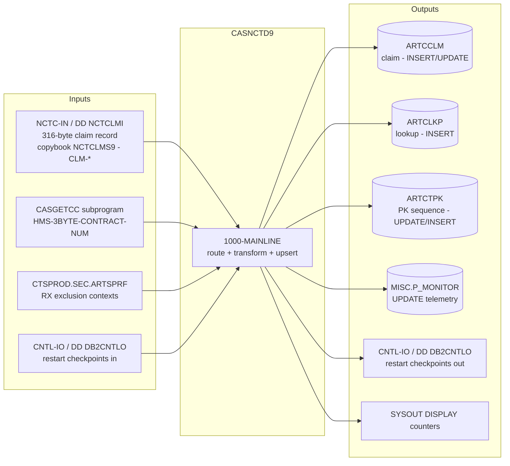

# CASNCTD9 — End-to-End Input/Output Mapping (with Business Examples)

> **Source-availability / naming notice (read first).**
> This document was requested as `CASNCTC0_io_mapping.md`. **No `CASNCTC0` program exists in this
> repository** (verified across the working tree, all branches, and every git object). The only
> COBOL program that has ever existed here is **`CASNCTD9`** (`CASNCTD9_Version2.txt`, commit
> `251e770`, deleted in PR #1). To avoid hallucination, this mapping describes the **real** program
> `CASNCTD9`. Line numbers refer to `git show 251e770:CASNCTD9_Version2.txt`.
>
> **Layout caveat.** Column data types, lengths, and byte offsets are defined in copybooks/DCLGENs
> (`NCTCLMS9`, `ARTCCLM`, `ARTCLKP`, `CARTCTPK`, `ARTSPRF`, `PMONITOR`) that are **not** in the repo.
> Everything below is derived from **how the program uses each field** in `MOVE`/`UNSTRING`/`EXEC
> SQL`. Data types are marked *(inferred)* unless a literal in code proves them.

---

# 1. End-to-End Data Flow (proven)



| Channel | Direction | Binding | Evidence |
|---|---|---|---|
| `NCTC-IN` | in | `ASSIGN TO NCTCLMI`, 316-byte fixed | 79, 85-92 |
| `CASGETCC` | in | `CALL 'CASGETCC' USING CASGETCC-CALLING-AREA` | 288 |
| `ARTSPRF` | in | cursor `ARTSPRF-CSR` | 259-266, 434-472 |
| `CNTL-IO` (read) | in | `OPEN INPUT CNTL-IO` → `0500` | 337-339 |
| `ARTCCLM` | out | INSERT/UPDATE | 851-883, 1035-1101 |
| `ARTCLKP` | out | INSERT | 1179-1200 |
| `ARTCTPK` | out | UPDATE/INSERT | 932-938, 1233-1249 |
| `P_MONITOR` | out | UPDATE | 1333-1430 |
| `CNTL-IO` (write) | out | `WRITE CNTL-RECORD` at each commit | 1304 |
| SYSOUT | out | `DISPLAY` counters/messages | 1511-1552 |

---

# 2. Input → Working-Storage → DB2 Column Map

## 2.1 Contract / context derivation
| Source | Transform | Target column(s) | Evidence |
|---|---|---|---|
| `CASGETCC` → `HMS-3BYTE-CONTRACT-NUM` | `EVALUATE` → literal | `WS-CONTEXT-CD`, `WS-LAST-UPDATE-NM` | 299-330 |
| `WS-CONTEXT-CD` | `UNSTRING … DELIMITED BY ALL SPACES` (text+len) | `ARTCCLM.CONTEXT_CD`, `ARTCTPK.CONTEXT_CD`, `ARTCLKP.CONTEXT_CD` | 592-603 |
| `CLM-HMS-CLIENT-ID` (contract 320/313) | `EVALUATE` → literal | `WS-CONTEXT-CD` (refined) | 512-590 |
| `CLM-HMS-CLIENT-ID` (contract 326/590/359/645) | overlay first 6 chars | `WS-CONTEXT-CD(1:6)` | 499-506 |
| `WS-LAST-UPDATE-NM` | `MOVE` (len 8) | `ARTCCLM/ARTCTPK/ARTCLKP.LAST_UPDATE_NM` | 612-620 |

## 2.2 Claim identity & parties
| Input field (`CLM-`) | Transform | Target column | Evidence |
|---|---|---|---|
| `CLM-ICN` | `UNSTRING` (text+len) | `ARTCCLM.ICN_NUM` | 605-608 |
| `CLM-FORMER-ICN` | `UNSTRING` | `ARTCCLM.PREV_ICN_NUM` | 623-626 |
| `CLM-HMS-CASE-KEY` | `MOVE` | `ARTCLKP.CASE_ID` | 610 |
| `CLM-RECIPIENT-ID-NUM` | `UNSTRING` | `ARTCCLM.RECIP_MA_NUM` | 629-633 |
| `CLM-PROVIDER-NUM` | `UNSTRING` | `ARTCCLM.PROVIDER_ID` | 639-642 |
| *(generated)* `CTPK-PK-NEXT-NUM − 1` | `MOVE` | `ARTCCLM.CLAIM_ID`, `ARTCLKP.CLAIM_ID` | 1020-1021 |

## 2.3 Status / type / units
| Input field | Transform | Target column | Evidence |
|---|---|---|---|
| `CLM-CLAIM-STATUS` | `MOVE`, len 1 | `ARTCCLM.CLMST_RF` | 644-645 |
| `CLM-TRANSACTION-TYPE` | `MOVE`, len 1 | `ARTCCLM.TRNTP_RF` | 647-648 |
| `CLM-CLAIM-TYPE` | `UNSTRING` | `ARTCCLM.CLMTP_RF` | 650-653 |
| `CLM-UNITS-OF-SERVICE` | `UNSTRING` | `ARTCCLM.UNITS_NUM` | 655-658 |

## 2.4 Amounts (numeric edit)
| Input field | Transform | Target column | Evidence |
|---|---|---|---|
| `CLM-CHARGE-AMT` | → `WS-DE-EDIT S9(7)V99` → | `ARTCCLM.CHARGE_AMT` | 660-661 |
| `CLM-PAID-AMT` | → `WS-DE-EDIT S9(7)V99` → | `ARTCCLM.PAID_AMT` | 662-663 |

## 2.5 Dates (`CCYYMMDD` → `CCYY-MM-DD`)
| Input field | Transform | Target column | Evidence |
|---|---|---|---|
| `CLM-DOR-A` | insert `-` at 5,8 | `ARTCCLM.REMIT_DT` | 665-669 |
| `CLM-SERVICE-DATE-FROM-A` | insert `-` at 5,8 | `ARTCCLM.SERVICE_FROM_DT` | 671-678 |
| `CLM-SERVICE-DATE-TO-A` | insert `-` at 5,8 | `ARTCCLM.SERVICE_TO_DT` | 680-684 |
| `CLM-RX-WRITTEN-DATE` | NULL if spaces/zeros/low-values, else value | `ARTCCLM.RX_WRITTEN_DT` (null-indicator) | 840-850 / 1022-1033 |

## 2.6 Clinical codes (conditional)
| Input field | Condition | Target column | Evidence |
|---|---|---|---|
| `CLM-SVC-CODE` | `CLM-CLAIM-TYPE='12'` | `ARTCCLM.NDCCD_RF` | 686-690 |
| `CLM-SVC-CODE` | else | `ARTCCLM.ICD9P_RF` (len ≤ 10) | 692-699 |
| `CLM-PRIMARY-DIAG-CODE` | strip `.` if 3 before dot; else trim leading space | `ARTCCLM.ICD9D_RF` | 702-726 |
| `CLM-SECOND-DIAG-CODE` | same rule | `ARTCCLM.ICD9D_2ND_RF` | 728-752 |
| `CLM-CDE-ICD-VERSION` | `UNSTRING` | `ARTCCLM.ICD_VERSION` | 761-764 |

## 2.7 Source / agency / geography
| Input field | Transform | Target column | Evidence |
|---|---|---|---|
| `CLM-CREATE-SOURCE` | `'00'→'STANDARD MEDICAID'`, `'01'→'DSS'`, else spaces | `ARTCCLM.CREATE_SOURCE_NM` | 754-759 |
| `CLM-AGENCY-CODE` | `UNSTRING` | `ARTCCLM.AGENCY_CD` | 766-769 |
| `CLM-COUNTY-CD` | `MOVE` | `ARTCCLM.COUNTY_CD` | 771 |
| *(contract 535?)* | `'535'` else spaces | `ARTCCLM.ALT_CLIENT_CD` | 773-777 |

## 2.8 Constant / system-generated columns
| Target column | Value | Where |
|---|---|---|
| `ARTCCLM.LAST_UPDATE_DTM` | `CURRENT TIMESTAMP` | 871, 1090 |
| `ARTCLKP.RELATE_IND` | literal `'0'` | 1193 |
| `ARTCLKP.IS_AUTO_CHECKED` | literal `'N'` | 1196 |
| `ARTCLKP.LAST_UPDATE_DTM` | `CURRENT TIMESTAMP` | 1195 |
| `ARTCTPK.PK_TYPE_CD` | literal `'CLM'` | 937, 1243 |
| `ARTCTPK.PK_DSC` | literal `'CASE TRACKING SYSTEM CLAIM'` | 1244 |
| `ARTCTPK.PK_NEXT_NUM` | `+1` bump / seed `+2` | 933, 1246 |

> **Commented-out (NOT active) columns:** `ARTCCLM.CREATE_NM`/`CREATE_DTM` and
> `ARTCLKP.CREATE_NM`/`CREATE_DTM` are present only as `*`-comments (change `00XX`, "installed at a
> later time", lines 51-54, 1065-1066, 1098-1099, 1187-1188). They are **not** written by this
> version.

---

# 3. Output Record Layouts (as written)

## 3.1 Control/restart record — `CNTL-RECORD` (`PIC X(38)`) — proven
| Sub-field | PIC | Value at write | Evidence |
|---|---|---|---|
| `CNTL-PROC-FLAG` | `X(01)` | `'-'` | 185, 1301 |
| `NUM-REC-OUT` | `ZZZ,ZZZ,ZZ9` | `SQL-TOT-COMMITTED-CTR` | 186, 1303 |
| `FILLER` | `X(02)` | `'++'` | 187 |
| `WS-CURRENT-TIMESTAMP` | `X(26)` | `CURRENT TIMESTAMP` (or `CURRENT-DATE` fallback) | 188, 1287-1299 |

## 3.2 `ARTCCLM` INSERT column order (proven from statement 5, lines 1035-1101)
`CONTEXT_CD, CLAIM_ID, ICN_NUM, PREV_ICN_NUM, RECIP_MA_NUM, PROVIDER_ID, CLMST_RF, TRNTP_RF,
CLMTP_RF, UNITS_NUM, CHARGE_AMT, PAID_AMT, REMIT_DT, SERVICE_FROM_DT, SERVICE_TO_DT, ICD9P_RF,
ICD9D_RF, ICD9D_2ND_RF, NDCCD_RF, LAST_UPDATE_NM, LAST_UPDATE_DTM, CREATE_SOURCE_NM, ICD_VERSION,
ALT_CLIENT_CD, AGENCY_CD, COUNTY_CD, RX_WRITTEN_DT`.

## 3.3 `ARTCLKP` INSERT columns (statement 6, lines 1179-1200)
`CONTEXT_CD, CASE_ID, CLAIM_ID, RELATE_IND('0'), LAST_UPDATE_NM, LAST_UPDATE_DTM, IS_AUTO_CHECKED('N')`.

## 3.4 `ARTCTPK` INSERT columns (statement 7, lines 1233-1249)
`CONTEXT_CD, PK_TYPE_CD('CLM'), PK_DSC('CASE TRACKING SYSTEM CLAIM'), PK_MASK_TXT, PK_NEXT_NUM(+2),
LAST_UPDATE_NM, LAST_UPDATE_DTM`.

## 3.5 `P_MONITOR` UPDATE set (lines 1333-1430)
`END_DTM=CURRENT TIMESTAMP, TASK_STEP_TXT='LOAD', STATUS_TXT=:PMONITOR-STATUS-TXT, DATA_CNT=<count>`
`WHERE CLIENT_CD=:HMS-3BYTE-CONTRACT-NUM [AND CONTEXT_CD=:ctx] AND PROCESS_NM LIKE
'CLKP_LOAD_DURATION_%'`.

---

# 4. Business Examples (end-to-end)

> Each example lists a dummy input, the routing/transform decisions, and the resulting DB2 effect.
> Values are illustrative (layout unknown); the branch outcomes are proven from the cited lines.

## Example A — New York casualty claim, brand-new → INSERT
**Input (dummy):**
```
CASGETCC.HMS-3BYTE-CONTRACT-NUM = '320'
CLM-HMS-CLIENT-ID   = 'CTSZZZ'          -> NY default
CLM-ICN             = '2024NY0000045'
CLM-HMS-CASE-KEY    = 'NYCASE00045'
CLM-CLAIM-STATUS    = 'P'
CLM-TRANSACTION-TYPE= 'A'
CLM-CLAIM-TYPE      = '30'              -> ICD9P path
CLM-UNITS-OF-SERVICE= '002'
CLM-CHARGE-AMT      = 000200.00
CLM-PAID-AMT        = 000180.00
CLM-DOR-A           = '20240220'
CLM-SERVICE-DATE-FROM-A = '20240210'
CLM-SERVICE-DATE-TO-A   = '20240212'
CLM-SVC-CODE        = '99213'
CLM-PRIMARY-DIAG-CODE = '250.01'
CLM-CREATE-SOURCE   = '00'
CLM-COUNTY-CD       = '036'
CLM-RX-WRITTEN-DATE = SPACES
```
**Decisions:** context `CTSCASNY`, author `WNYCDF40` (300-301); NY default (541-542); SELECT `+100`
⇒ INSERT (796-797); type ≠ `12` ⇒ `SVC-CODE`→`ICD9P_RF` (692); diag `250.01`→`25001` (707-713);
create-source `00`→`STANDARD MEDICAID` (755-756); `RX_WRITTEN_DT` NULL (842-846).

**Output (business view):**
| Table | Effect | Key values |
|---|---|---|
| `ARTCTPK` | bump (or bootstrap) | `CONTEXT_CD='CTSCASNY' PK_TYPE_CD='CLM'` |
| `ARTCCLM` | **INSERT** | `CLAIM_ID=<new>`, `ICN_NUM='2024NY0000045'`, `PAID_AMT=180.00`, `REMIT_DT='2024-02-20'`, `ICD9D_RF='25001'`, `CREATE_SOURCE_NM='STANDARD MEDICAID'`, `RX_WRITTEN_DT=NULL` |
| `ARTCLKP` | **INSERT** | `CASE_ID='NYCASE00045'`, `RELATE_IND='0'`, `IS_AUTO_CHECKED='N'` |

## Example B — Same claim arrives again with new paid amount → UPDATE
**Input:** identical keys to Example A (`CONTEXT_CD='CTSCASNY'`, `ICN_NUM='2024NY0000045'`,
`CLM-CLAIM-STATUS='P'`, `CLM-HMS-CASE-KEY='NYCASE00045'`) but `CLM-PAID-AMT=000200.00`.
**Decisions:** SELECT `+0` ⇒ `1100-UPDATE-ARTCCLM` (794-795).
**Output:** `UPDATE ARTCCLM SET PAID_AMT=200.00, LAST_UPDATE_DTM=CURRENT TIMESTAMP, … WHERE
CONTEXT_CD='CTSCASNY' AND CLAIM_ID=<id> AND ICN_NUM='2024NY0000045'`. No `ARTCLKP`/`ARTCTPK` change.

## Example C — Florida pharmacy (RX) encounter claim, excluded → SKIP
**Input:**
```
HMS-3BYTE-CONTRACT-NUM = '313'
CLM-HMS-CLIENT-ID = 'CTSCAS'   -> CTSCASFL
CLM-CLAIM-TYPE    = '12'       -> RX
CLM-SVC-CODE      = '00093-1234-56'   -> NDCCD_RF
```
Assume `ARTSPRF` lists `CTSCASFL` under `NY_RX_ENCOUNTER_EXCLUSION=TRUE` and SELECT returns `+100`.
**Decisions:** context `CTSCASFL` (571-572); would INSERT, but RX-exclusion match (916-924) ⇒
`WS-RX-EXCL-SKIP-CTR +1`, `GO TO 1200-INSERT-EXIT` (927-929).
**Output:** **no** DB2 writes; end-of-job counter "NY RX ENCOUNTER CLAIMS EXCLUDED (SKIPPED)"
increases. *(Note: exclusion never applies on the UPDATE path — an already-existing `'12'` claim in
`CTSCASFL` would still be updated.)*

## Example D — OH CareSource vs OH — alt-client differentiation
| Input contract | Context | `ALT_CLIENT_CD` |
|---|---|---|
| `341` | `CTSCASOH` | spaces |
| `535` | `CTSCASOH` | `'535'` |
Both load into the same context but `ALT_CLIENT_CD` distinguishes the CareSource (`535`) source
(306-309, 773-777).

## Example E — Restart after a mid-file failure
Prior run committed 600 records and wrote a checkpoint (`NUM-REC-OUT=600`, flag `'-'`). On rerun,
`0500` computes `WS-CNTL-RECS-OUT-TOT=600`; `CRP-IN=601`; the skip loop consumes records 1-601, and
mainline processing resumes at record 601 (341-360). If the file actually held ≤600 records, the
skip loop hits `AT END` ⇒ "ALL 600 INPUT RECORDS HAVE BEEN PROCESSED PREVIOUSLY", abend `0998`
(348-357).

---

# 5. Transformation Reference (quick table)

| # | Rule | Input → Output | Lines |
|---|---|---|---|
| T1 | Amount rescale | `CLM-CHARGE/PAID-AMT` → `S9(7)V99` → `CHARGE_AMT/PAID_AMT` | 660-663 |
| T2 | Date reformat | `CCYYMMDD` → `CCYY-MM-DD` | 665-684 |
| T3 | Svc code split | `'12'`→`NDCCD_RF`; else `ICD9P_RF` (≤10) | 686-700 |
| T4 | Diag `.` strip | `nnn.nn` → `nnnnn` | 702-713, 728-739 |
| T5 | Diag space trim | leading space removed | 715-725, 740-751 |
| T6 | Create source | `00→STANDARD MEDICAID`, `01→DSS`, else spaces | 754-759 |
| T7 | RX date null | spaces/zeros/low-values → NULL | 840-850, 1022-1033 |
| T8 | Context unstring | trim trailing spaces (text+len) | 592-603 |
| T9 | Alt client | `535`→`'535'`, else spaces | 773-777 |
| T10 | Claim id | `PK_NEXT_NUM − 1` | 967-1020 |

---

# 6. Proven vs Inferred (mapping-specific)

**Proven from source**
- Every source→target pairing in Sections 2-3 (each has a `MOVE`/`UNSTRING`/`EXEC SQL` citation).
- INSERT/UPDATE column orders and literal constants (`'0'`, `'N'`, `'CLM'`, `+2`, timestamps).
- Conditional routing of `SVC-CODE` and the two diagnosis reformatting rules.
- Control-record layout (`PIC X(38)` breakdown).

**Inferred from structure/usage**
- Data types/lengths of all `CLM-*` inputs and DB2 columns (copybooks absent); VARCHAR `-TEXT`/`-LEN`
  behaviour.
- The precise semantics of restart accumulation in `0500` (mechanically described).

**Open questions / not proven**
- Location/identity of the requested `CASNCTC0` program (absent from repo).
- Exact 316-byte input record image and field offsets (need `NCTCLMS9`).
- DB2 column domains, nullability (except `RX_WRITTEN_DT`, proven nullable via indicator).
- JCL DD-to-dataset bindings and how abend codes `0998/0999/3645` map to step return codes.
