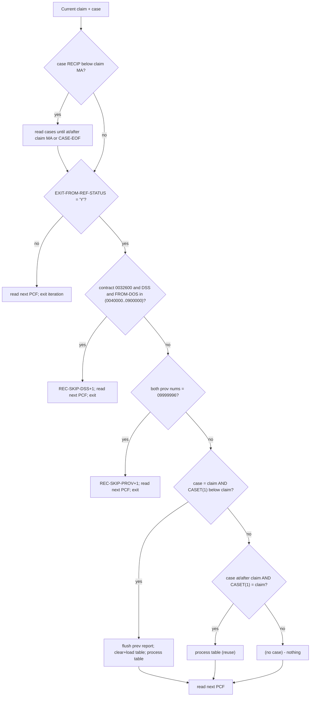
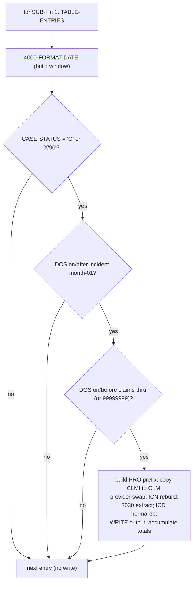
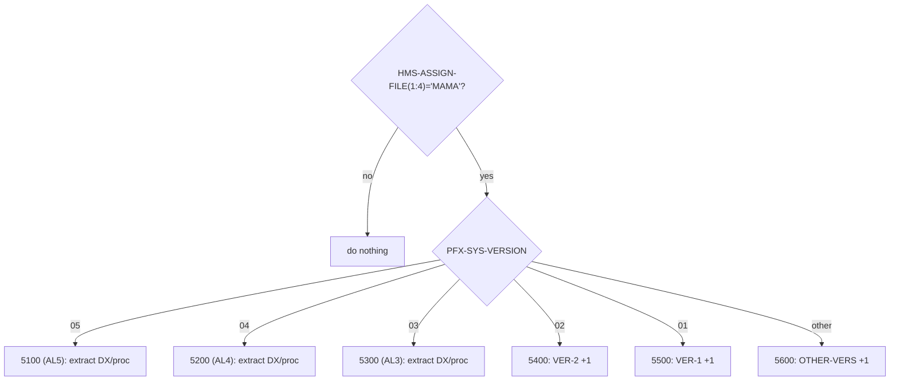
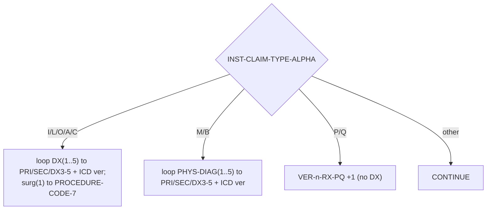

# CASPCFAL — Illustration Document (Dummy Data)

> Companion to `CASPCFAL.txt_logic.md`. Every example below uses **fabricated / dummy** data. No real claim, case, or
> Medicaid data is used or available. Values are chosen only to exercise the **coded** branches, and each field is
> derived from the copybook `PIC` clauses cited in the logic document.
>
> **Non-hallucination note:** the *paths and results* shown are proven from the program source (line references match the
> logic doc). The *field values* are illustrative placeholders. Anything that cannot be produced from source is marked
> **Not illustrable from source**.

---

# 1. Illustration Scope

* **Illustrated:** every branch that materially changes behavior — the three claim-skip filters, case-file
  advancement, table (re)load vs reuse, the open-case + date-window match, one-to-many output, provider swap, ICN
  rebuild, ICD-version normalization, the `MAMA` version dispatch, the claim-type-alpha code extraction, the report
  detail/overflow/trailer lines, and end-of-job counters.
* **Dummy data derivation:** field widths/types come from `TPLPREFX`, `FDPCF602`, `FDPCF601`, `NCTCASE`, `CLMPREFX`,
  `FDALINH5`/`FDALPHY5`. Alphanumerics are shown space-padded to their `PIC X(n)`; packed dates are shown as their
  logical `YYYYMMDD`/`YYYYMM` value.
* **Not illustrable from source:** actual byte offsets of every field inside `CLMI-CLIENT-DATA`, real ICN formats, and
  the true contents of files not present (`FDPCF600`, `FDALCLMS`, etc.). These are flagged where relevant.

Legend used in record blocks: `‹spaces›` = blank field, `|` separates conceptual fields (not physical columns).

---

# 2. Scenario Catalog

| # | Scenario | Trigger (proven) | Coded at |
|---|---|---|---|
| S1 | Claim excluded — referral status not `'Y'` | `PFX-SYS-EXIT-FROM-REF-STATUS ≠ 'Y'` | 372–375 |
| S2 | Claim excluded — DSS in date range | contract `0032600` + `DSS` + `0040000 < FROM-DOS < 0900000` | 377–389 |
| S3 | Claim excluded — placeholder provider | both prov nums `= '09999996'` | 391–396 |
| S4 | Case file advanced past old recipients | `CASE-RECIPIENT-ID-NUM < PFX-APP-MEDICAID-NO` | 365–368 |
| S5 | New matching recipient → load table + process | key `=` and `CASET(1) <` claim key | 398–417 |
| S6 | Same recipient, next claim → reuse table | key `≥` and `CASET(1) =` claim key | 420–424 |
| S7 | Claim key has no case → skipped | neither branch true | fall-through 426 |
| S8 | Matched: open case + DOS in window → write | status `'O'/X'96'` + window | 457–461, 655 |
| S9 | Not matched: case closed | `CASE-STATUS-CODE` not `'O'/X'96'` | 457–458 |
| S10 | Not matched: DOS before incident | `DOS < WS-INCIDENT-DATE-NEW-RE` | 460 |
| S11 | Not matched: DOS after thru | `DOS > WS-CLM-THRU-DATE-N` | 461 |
| S12 | Open-ended case (blank thru date) | `CASET-CLAIMS-THRU-DATE = SPACES` → `99999999` | 737–743 |
| S13 | One claim → many cases (multiple writes) | ≥2 open in-window cases in table | loop 415–417 |
| S14 | Provider swap in output | `PROV = '09999996'` + contract `0032600` | 484–488 |
| S15a | ICN rebuild — numeric non-zero suffix | `PB`/`DT` + `0032600` + not `DSS` + suffix numeric ≠ 0 | 626–643 |
| S15b | ICN rebuild skipped — suffix `00` | same gates but suffix `= 0` | 631–632 |
| S16 | ICD version → `'10'` vs `'9'` | `CLM-CDE-ICD-VERSION` `'0 '`/`' 0'` else other | 646–653 |
| S17 | Version dispatch v05/v04/v03 extract | `MAMA` + version | 686–705 |
| S18 | Version dispatch v02/v01/other count-only | `MAMA` + version | 706–719 |
| S19 | Non-`MAMA` client → no extraction | `PFX-SYS-HMS-ASSIGN-FILE(1:4) ≠ 'MAMA'` | 686 |
| S20a | Claim-type INST (`I/L/O/A/C`) → DX+surg | `ALn-INST-CLAIM-TYPE-ALPHA` | 751–812 |
| S20b | Claim-type PHYS (`M/B`) → DX | same field | 813–862 |
| S20c | Claim-type RX (`P/Q`) → count only | same field | 863–865 |
| S20d | Claim-type OTHER → nothing | `WHEN OTHER` | 866–867 |
| S21 | Report detail line (normal) | `SIZE-OK` at flush | 1216–1229 |
| S22 | Report overflow line | `SIZE-ERROR` | 1230–1234 |
| S23 | Report trailer — no matches | `REC-WRITE-CTR = 0` | 1355–1358 |
| S24 | Open-case matched counted once | `CASE-PCF-MATCH-FLAG = 'N'` | 468–471 |
| S25 | End-of-job counters + no-match compute | termination | 1255–1342 |

---

# 3. Dummy Data Examples

### Shared dummy keys

```
Dummy Medicaid/recipient key (X20):  "MA000001            "   (trailing spaces to 20)
Dummy HMS-CASE-KEY (9/09):           000000501
Dummy HMS-CLIENT-ID (X6):            AL0001
```

---

## S1 — Claim excluded because referral status ≠ 'Y'

* **Trigger:** `PFX-SYS-EXIT-FROM-REF-STATUS = 'N'` (line 372).
* **Dummy PCF claim (prefix fields only):**

  ```
  PFX-APP-MEDICAID-NO           = "MA000001            "
  PFX-SYS-EXIT-FROM-REF-STATUS  = 'N'      <-- not 'Y'
  PFX-APP-DATE-OF-SERVICE       = 20100615
  ```
* **Path:** Step B fires → `PERFORM 1500-READ-SRCPCF-IN` → `GO TO 2000-MAINLINE-EXIT`.
* **Result:** no output, no report change; next PCF read. `PCF-REC-READ-CTR` already counted it at read time.
* **Why:** only `= 'Y'` claims are eligible; everything else is passed over.

## S2 — Claim excluded (DSS, service year in exclusion range)

* **Trigger:** contract `0032600` + `CLMI-PM-USER-AREA(27:3)='DSS'` + `0040000 < CLMI-CLAIM-FROM-DOS < 0900000`.
* **Dummy claim:**

  ```
  PFX-SYS-EXIT-FROM-REF-STATUS = 'Y'
  CLMI-PCF-CONTRACT-NUM        = "0032600"
  CLMI-PM-USER-AREA            = "PB........................DSS..........."   (cols 27-29 = "DSS")
  CLMI-CLAIM-FROM-DOS          = 050101      (0YYMMDD → YY=05 → 2005, in (0040000,0900000))
  ```
* **Path:** Step C fires → `ADD 1 TO REC-SKIP-DSS` → read next PCF → exit.
* **Result:** skipped; `REC-SKIP-DSS` +1 (reported as `NUMBER OF SKIPPED DSS RECORDS > 2003`).
* **Contrast (included):** `CLMI-CLAIM-FROM-DOS = 000101` (year 2000 → not in range) would **not** be skipped by S2.

## S3 — Claim excluded (placeholder provider on both numbers)

* **Trigger:** `CLMI-PROV-OF-SVC-NUM = '09999996'` **and** `CLMI-PAY-TO-PROV-NUM = '09999996'`.
* **Dummy claim:**

  ```
  PFX-SYS-EXIT-FROM-REF-STATUS = 'Y'
  CLMI-PROV-OF-SVC-NUM         = "09999996       "
  CLMI-PAY-TO-PROV-NUM         = "09999996       "
  ```
* **Path:** Step D fires → `ADD 1 TO REC-SKIP-PROV` → read next PCF → exit.
* **Result:** skipped; `REC-SKIP-PROV` +1 (`NUMBER OF SKIPPED PCF RECORDS PR0V=09999996`).
* **Note:** if only *one* of the two equals `09999996`, S3 does **not** fire (both are required); see S14 for the
  single-provider case which instead triggers a *swap* during output.

## S4 — Case file advanced past earlier recipients

* **Trigger:** current case sorts before the claim: `CASE-RECIPIENT-ID-NUM < PFX-APP-MEDICAID-NO`.
* **Dummy state:**

  ```
  Current claim  PFX-APP-MEDICAID-NO  = "MA000005            "
  Current case   CASE-RECIPIENT-ID-NUM = "MA000001            "   <-- smaller
  ```
* **Path:** Step A loops `1600-READ-CASEFL-IN` until case recipient `≥ "MA000005"` or `CASE-EOF`.
* **Result:** case cursor moves forward; open cases read along the way are counted in `OPEN-CASES-READ-CTR`.

## S5 — New matching recipient: build table then match

* **Trigger:** `CASE-RECIPIENT-ID-NUM = PFX-APP-MEDICAID-NO` **and** `CASET-RECIPIENT-ID-NUM(1) < PFX-APP-MEDICAID-NO`
  (the table still holds a previous recipient).
* **Dummy case stream for recipient `MA000005` (two cases, then a new recipient):**

  ```
  Case A: RECIP="MA000005" CASE-KEY=000000801 STATUS='O' INCIDENT="2010-01-10" THRU="2010-12-31"
  Case B: RECIP="MA000005" CASE-KEY=000000802 STATUS='O' INCIDENT="2011-03-01" THRU="2011-09-30"
  Case C: RECIP="MA000006" ...                                  <-- different recipient (stops the load)
  ```
* **Path:** flush previous recipient's report line if pending (400–404) → clear table → `3010` loads Case A into
  slot 1, Case B into slot 2, reads Case C, sees a greater recipient → `TABLE-ENTRIES = 2`, `RECIPIENT-END` → then
  `3020` runs for slots 1..2.
* **Result:** `TABLE-ENTRIES = 2`; the current claim is now matched against Cases A and B (see S8/S13).

## S6 — Same recipient, next claim reuses the loaded table

* **Trigger:** `CASE-RECIPIENT-ID-NUM ≥ PFX-APP-MEDICAID-NO` **and** `CASET-RECIPIENT-ID-NUM(1) = PFX-APP-MEDICAID-NO`.
* **Dummy state:** table already holds `MA000005` (from S5); the next PCF claim also has `PFX-APP-MEDICAID-NO="MA000005"`.
* **Path:** the `ELSE IF` branch (420–424) runs `3020` only — **no reload**.
* **Result:** second claim matched against the same two cases without re-reading the case file.

## S7 — Claim key has no matching case (skipped)

* **Trigger:** neither Step-E branch is true (e.g. claim key sits between two recipients that both have cases, but this
  exact key has none).
* **Dummy state:**

  ```
  Claim PFX-APP-MEDICAID-NO   = "MA000004            "
  Case  CASE-RECIPIENT-ID-NUM = "MA000005            "   (> claim; advanced in S4 already)
  CASET-RECIPIENT-ID-NUM(1)   = "MA000003            "   (previous recipient, < claim)
  ```
* **Path:** first branch false (`CASE ≠ claim`), second branch false (`CASET(1) ≠ claim`); fall through to read next
  PCF (426).
* **Result:** claim produces no output — correctly ignored because no case exists for it.

## S8 — Matched: open case + DOS inside window → output written

* **Trigger:** `CASET-CASE-STATUS-CODE(1)='O'` and `WS-INCIDENT-DATE-NEW-RE ≤ PFX-APP-DATE-OF-SERVICE ≤ WS-CLM-THRU-DATE-N`.
* **Dummy inputs:**

  ```
  Claim: PFX-APP-MEDICAID-NO="MA000005" DOS=20100615 CLMI-ICN="ICN0000000000000001 "
         CLMI-PCF-MA-NUM="MA000005" CLMI-TOT-MA-PAID-HDR=+001234.56  XACTION-STATUS='B'
  Case A: CASE-KEY=000000801 STATUS='O' INCIDENT="2010-01-10" THRU="2010-12-31" CLIENT-ID="AL0001"
  ```
  Derived window: lower = `20100101` (month start, day forced 01), upper = `20101231`. `20100101 ≤ 20100615 ≤ 20101231` ✓.
* **Path:** 457–461 true → build `PRO` prefix, copy `CLMI→CLM`, `REC-WRITE-CTR +1`, `3030`, ICD normalize,
  `WRITE CLMO-RECORD`.
* **Result (output prefix, dummy):**

  ```
  PRO-RECIPIENT-ID-NUM = "MA000005"       (from CLMI-PCF-MA-NUM)
  PRO-HMS-CASE-KEY     = 000000801        (from CASET-HMS-CASE-KEY(1))
  PRO-CLIENT-ID        = "AL0001"         (chg 0012)
  PRO-CREATE-SOURCE    = "00"             (from WZCA010 control card)
  PRO-ICN              = "ICN0000000000000001 "
  PRO-CLM-FROM-DATE    = 20100615         (from PFX-APP-DATE-OF-SERVICE)
  PRO-INCIDENT-DATE    = 20100100         (day 00 — see logic §5.7 note)
  PRO-CLM-THRU-DATE    = 20101231
  ```
* **Per-case totals:** `WS-TOT-PCF-REC-MATCH = 1`, `WS-TOT-PCF-MA-PAID = 1234.56`; `OPEN-CASES-MATCH-OK-CTR +1`.

## S9 — Not matched: case is closed

* **Trigger:** `CASET-CASE-STATUS-CODE(1)` not `'O'` and not `X'96'` (e.g. `'C'`).
* **Dummy:** Case A as S8 but `STATUS='C'`.
* **Path:** 457–458 false → the entire match/write block is skipped.
* **Result:** no output; no per-case totals; this closed case contributes to `OPEN-CASES-*` **not at all** (it was
  never open).

## S10 — Not matched: DOS before incident month

* **Trigger:** `PFX-APP-DATE-OF-SERVICE < WS-INCIDENT-DATE-NEW-RE`.
* **Dummy:** `DOS = 20091231`, incident `"2010-01-10"` → lower bound `20100101`. `20091231 < 20100101`.
* **Path:** 460 false → no write.
* **Result:** claim not written for this case.

## S11 — Not matched: DOS after claims-thru

* **Trigger:** `PFX-APP-DATE-OF-SERVICE > WS-CLM-THRU-DATE-N`.
* **Dummy:** `DOS = 20110101`, thru `"2010-12-31"` → upper `20101231`. `20110101 > 20101231`.
* **Path:** 461 false → no write.

## S12 — Open-ended case (blank thru date)

* **Trigger:** `CASET-CLAIMS-THRU-DATE(1) = SPACES` → `MOVE '99999999' TO WS-CLM-THRU-DATE` (743).
* **Dummy:** INCIDENT `"2010-01-10"`, THRU `"          "` (blank), `DOS = 20250101`.
* **Path:** upper bound becomes `99999999`; `20100101 ≤ 20250101 ≤ 99999999` ✓ → **matched**.
* **Result:** any claim on/after the incident month matches; the case never "expires".

## S13 — One claim, many matching cases → multiple output records

* **Trigger:** two open, in-window cases in the table (Cases A & B from S5), one claim with `DOS=20110401`.
* **Window check:** A `20100101..20101231` → `20110401` **outside** (no write for A); B `20110301..20110930` →
  `20110401` **inside** (write for B).
* **Variation to show multiple writes:** claim `DOS=20100615` with a *third* case B′
  `INCIDENT="2010-06-01" THRU="2010-06-30"` also open → both A (`20100101..20101231`) and B′ (`20100601..20100630`)
  contain `20100615` → **two** output records, one per case key:

  ```
  Output 1: PRO-HMS-CASE-KEY = 000000801  (Case A)
  Output 2: PRO-HMS-CASE-KEY = <B' key>   (Case B')
  ```
* **Result:** `REC-WRITE-CTR +2`, `WS-TOT-PCF-REC-MATCH +2`, `WS-TOT-PCF-MA-PAID += 2 × paid`; `OPEN-CASES-MATCH-OK-CTR`
  +1 for each distinct case's first match.

## S14 — Provider swap during output build

* **Trigger:** `CLMI-PROV-OF-SVC-NUM = '09999996'` **and** `CLMI-PCF-CONTRACT-NUM = '0032600'` (and note S3 did **not**
  fire because `CLMI-PAY-TO-PROV-NUM ≠ '09999996'`).
* **Dummy:**

  ```
  CLMI-PROV-OF-SVC-NUM  = "09999996       "
  CLMI-PAY-TO-PROV-NUM  = "PAYTO0001      "
  CLMI-PCF-CONTRACT-NUM = "0032600"
  ```
* **Path:** 484–488 → `MOVE CLMI-PAY-TO-PROV-NUM TO CLMI-PROV-OF-SVC-NUM` **before** the field-by-field copy.
* **Result (before/after):**

  ```
  Before swap: CLMI-PROV-OF-SVC-NUM = "09999996"
  After swap : CLMI-PROV-OF-SVC-NUM = "PAYTO0001"   → then copied to CLM-PROV-OF-SVC-NUM in output
  ```

## S15a — ICN suffix rebuild (numeric, non-zero suffix)

* **Trigger:** `CLMI-PM-USER-AREA(1:2)` is `'PB'` or `'DT'`, `CLMI-PCF-CONTRACT-NUM='0032600'`,
  `CLMI-PM-USER-AREA(27:3) ≠ 'DSS'`, `CLMI-PCF-HMS-ICN-SUFFIX` numeric and `≠ 0`.
* **Dummy:**

  ```
  CLMI-PM-USER-AREA        = "PB.......................XYZ..........."   (cols27-29="XYZ", not "DSS")
  CLMI-PCF-CONTRACT-NUM    = "0032600"
  CLMI-ICN                 = "ICN0000000000012  "   (first 17 chars used)
  CLMI-PCF-HMS-ICN-SUFFIX  = "07"                    (numeric, non-zero)
  ```
* **Path:** 630–641 → `WS-ICN-17 = ICN(1:17)`, `WS-ICN-02 = "07"`, `WS-ICN-GROUP-19` → `PRO-ICN` and `CLM-ICN`.
* **Result:**

  ```
  Before: PRO-ICN = "ICN0000000000000012 " (plain 20-char ICN)
  After : PRO-ICN = <ICN(1:17)> || "07"    (17 + 2 = 19 chars, position 18-19 replaced by suffix)
  ```
  **Note:** the exact 17/2 split is proven from `WS-ICN-17 PIC X(17)` + `WS-ICN-02 PIC X(02)` (lines 88–89); the literal
  ICN content is dummy.

## S15b — ICN rebuild skipped (suffix = 00)

* **Trigger:** same gates as S15a but `CLMI-PCF-HMS-ICN-SUFFIX = "00"` → `CLMI-PCF-HMS-ICN-SUFFIX-N = 0`.
* **Path:** 631–632 `IF … = 0 → CONTINUE` (no rebuild).
* **Result:** `PRO-ICN`/`CLM-ICN` keep the plain `CLMI-ICN` moved at lines 474/521. No suffix appended.

## S16 — ICD-version normalization on output

* **Trigger:** value left in `CLM-CDE-ICD-VERSION` after extraction.
* **Cases (646–653):**

  | Extracted `CLM-CDE-ICD-VERSION` | Written value |
  |---|---|
  | `'0 '` | `'10'` (ICD-10) |
  | `' 0'` | `'10'` (ICD-10) |
  | anything else (incl. `'9'`, spaces) | `'9'` (ICD-9) |
* **Post-write reset:** `MOVE '9' TO CLM-CDE-ICD-VERSION` (657) so the field starts at `'9'` for the next record.

## S17 — Version dispatch that extracts (v05 / v04 / v03)

* **Trigger:** `PFX-SYS-HMS-ASSIGN-FILE(1:4)='MAMA'` and `PFX-SYS-VERSION` in {`05`,`04`,`03`}.
* **Dummy:** `PFX-SYS-HMS-ASSIGN-FILE = "MAMA "`, `PFX-SYS-VERSION = "05"`.
* **Path:** `3030` → move `CLMI-CLIENT-DATA` into `AL5` inst/phys/rx areas → `PERFORM 5100`.
* **Result:** diagnosis/procedure codes extracted per S20a–d; the matching `VER-5-*` counters increment.

## S18 — Version dispatch that only counts (v02 / v01 / other)

* **Trigger:** `MAMA` + `PFX-SYS-VERSION` = `02` (or `01`, or any other value).
* **Path:** `5400`/`5500`/`5600` → `ADD 1 TO VER-2` / `VER-1` / `OTHER-VERS` only; header comment
  `ICD-10 SEGMENTS ARE NOT BEING CREATED`.
* **Result:** the claim is still written (S8 already wrote it); no DX/procedure extraction occurs.

## S19 — Non-`MAMA` client file → no extraction at all

* **Trigger:** `PFX-SYS-HMS-ASSIGN-FILE(1:4) ≠ 'MAMA'` (e.g. `"ALAB "`).
* **Path:** the `IF` at 686 is false; `EVALUATE` is skipped; no `VER-*`/`OTHER-VERS` increment.
* **Result:** output DX/procedure fields keep whatever the field-by-field copy produced (input 5-char DX left as-is in
  the 7-char output field). **Note:** the exact residual content is data-dependent — **Not fully illustrable from
  source**.

## S20 — Claim-type-alpha routing inside 5100 (version 5 shown)

Discriminator: `AL5-INST-CLAIM-TYPE-ALPHA` (byte in the client image).

### S20a — Institutional (`I`,`L`,`O`,`A`,`C`)

* **Dummy:** `AL5-INST-CLAIM-TYPE-ALPHA='I'`; `AL5-INST-DIAG(1)="A419   "`, `AL5-INST-CDE-ICD-VERSION(1)='0'`;
  `AL5-INST-DIAG(2)="E1165  "`; `AL5-INST-HDR-SURG-CD(1)="0DTJ4ZZ"`.
* **Path:** loop 1..5 over `INST-DIAG`; index-1 loop over `INST-HDR-SURG-CD`.
* **Result mapping:**

  | Source | → Output |
  |---|---|
  | `INST-DIAG(1)="A419"` | `CLM-PRI-DX = "A419"` |
  | `INST-DIAG(2)="E1165"` | `CLM-SEC-DX = "E1165"` |
  | `INST-DIAG(3..5)` (blank) | `CLM-DX-3/4/5` unchanged |
  | `INST-CDE-ICD-VERSION(1)='0'` | `CLM-CDE-ICD-VERSION='0'` → later normalized to `'10'` (S16) |
  | `INST-HDR-SURG-CD(1)="0DTJ4ZZ"` | `CLM-PROCEDURE-CODE-7="0DTJ4ZZ"` |
  * counters: `VER-5-INST-ILOAC` +1 per non-blank DX slot; `VER-5-PROC-CD` +1 for the surg code.

### S20b — Physician (`M`,`B`)

* **Dummy:** `AL5-INST-CLAIM-TYPE-ALPHA='M'`; `AL5-PHYS-DIAG(1)="Z1231  "` ver `'0'`.
* **Path:** loop 1..5 over `PHYS-DIAG`.
* **Result:** `CLM-PRI-DX="Z1231"`, `CLM-CDE-ICD-VERSION='0'`→`'10'`; counter `VER-5-PROF-MB` +1.
  (No surgery-code loop in the physician branch.)

### S20c — Pharmacy / RX (`P`,`Q`)

* **Dummy:** `AL5-INST-CLAIM-TYPE-ALPHA='P'`.
* **Path:** `ADD +1 TO VER-5-RX-PQ` only.
* **Result:** no DX/procedure fields touched (RX has no diagnosis — comment line 676).

### S20d — Any other claim-type alpha

* **Dummy:** `AL5-INST-CLAIM-TYPE-ALPHA='X'`.
* **Path:** `WHEN OTHER → CONTINUE`.
* **Result:** nothing extracted, no counter changes.

## S21 — Report detail line (normal totals)

* **Trigger:** flush of a recipient with `WS-TOT-PCF-REC-MATCH = 3`, `WS-TOT-PCF-MA-PAID = 3703.68`, `SIZE-OK`.
* **Output (`MATCHO`, 80 bytes, conceptual columns):**

  ```
   * MA000005              *          3 *      $3,703.68 *
     ^CASE ID                 ^records     ^$$ MA PAID
  ```
* **Why:** `2100` edits the count and dollar totals (left-justified via `INSPECT` space count) into the header columns.

## S22 — Report overflow line

* **Trigger:** a `SIZE ERROR` occurred while accumulating (`SIZE-ERROR` true), so `2100` takes the ELSE path.
* **Output:**

  ```
   * MA000005              TOO MANY MATCHES, $$ PAID NOT AVAILABLE !
  ```
* **Why:** `WS-TOT-PCF-REC-MATCH` is `S9(5) COMP-3` (max 99,999) and `WS-TOT-PCF-MA-PAID` is `S9(11)V99`; exceeding
  these trips `ON SIZE ERROR` (662, 665) and prints the fallback message; `SIZE-OK` is then reset.

## S23 — Report trailer when nothing matched

* **Trigger:** `REC-WRITE-CTR = 0` at termination.
* **Output (from `9100`):**

  ```
       NO MATCHED PCF RECORDS FOUND
  ‹blank line›
  ********************************************************************************
  ```
* **Why:** guard at 1355 emits the message before the standard blank + asterisk trailer lines.

## S24 — Open case counted as matched only once

* **Trigger:** two claims for `MA000005` both match Case A (same case key), `CASE-PCF-MATCH-FLAG(1)` starts `'N'`.
* **Path:** first match → `OPEN-CASES-MATCH-OK-CTR +1`, flag set `'Y'`; second match → flag already `'Y'` → **not**
  counted again (468–471).
* **Result:** `OPEN-CASES-MATCH-OK-CTR` counts distinct matched **cases**, while `REC-WRITE-CTR` counts every written
  record (here +2).

## S25 — End-of-job counter block

* **Dummy run totals:**

  ```
  PCF-REC-READ-CTR         = 1,000
  REC-SKIP-PROV            =    12   (S3)
  REC-SKIP-DSS             =     8   (S2)
  CASE-REC-READ-CTR        =   400
  OPEN-CASES-READ-CTR      =   150
  OPEN-CASES-MATCH-OK-CTR  =    90   (S24)
  OPEN-CASES-NO-MATCH-CTR  =    60   = 150 - 90  (COMPUTE line 1255-1257)
  REC-WRITE-CTR            =   140   (S8/S13)
  VER-5-INST-ILOAC …       = per S20
  ```
* **Result:** printed to SYSOUT under the labels listed in logic §5.11; `OPEN-CASES-NO-MATCH-CTR` is derived, not
  independently counted.

---

# 4. Before / After Illustrations

## 4.1 Claim → matched output record (S8, happy path)

```
INPUT  (WS-CLMI-RECORD, dummy, prefix + selected CLMI fields)
  PFX-APP-MEDICAID-NO          = "MA000005            "
  PFX-SYS-EXIT-FROM-REF-STATUS = 'Y'
  PFX-APP-DATE-OF-SERVICE      = 20100615
  PFX-SYS-HMS-ASSIGN-FILE      = "MAMA "     PFX-SYS-VERSION = "05"
  CLMI-PCF-MA-NUM              = "MA000005            "
  CLMI-ICN                     = "ICN0000000000000001 "
  CLMI-PROV-OF-SVC-NUM         = "PROV000123     "
  CLMI-TOT-MA-PAID-HDR         = +0001234.56
  CLMI-CDE?/DX via client data → PRI-DX "A419", ICD ver "0"

CASE TABLE slot 1 (dummy)
  CASET-RECIPIENT-ID-NUM(1) = "MA000005"  STATUS='O'
  CASET-HMS-CASE-KEY(1)     = 000000801   CASET-HMS-CLIENT-ID(1)="AL0001"
  CASET-INCIDENT-DATE(1)    = "2010-01-10" CASET-CLAIMS-THRU-DATE(1)="2010-12-31"
```
```
OUTPUT (WS-SRCPCF-OUT → CLMO-RECORD, 754 bytes, dummy)
  PRO-RECIPIENT-ID-NUM = "MA000005"      PRO-HMS-CASE-KEY = 000000801
  PRO-CLIENT-ID        = "AL0001"        PRO-CREATE-SOURCE = "00"
  PRO-ICN              = "ICN0000000000000001 "
  PRO-CLM-FROM-DATE    = 20100615        PRO-INCIDENT-DATE = 20100100  (day 00)
  PRO-CLM-THRU-DATE    = 20101231        PRO-XACTION-STATUS = <from CLMI>
  CLM-PRI-DX           = "A419"          CLM-CDE-ICD-VERSION = "10"    (normalized from "0")
  CLM-PROV-OF-SVC-NUM  = "PROV000123"
```

## 4.2 Provider swap (S14)

```
BEFORE:  CLMI-PROV-OF-SVC-NUM = "09999996"   CLMI-PAY-TO-PROV-NUM = "PAYTO0001"
AFTER :  CLMI-PROV-OF-SVC-NUM = "PAYTO0001"  → CLM-PROV-OF-SVC-NUM = "PAYTO0001"
```

## 4.3 ICN rebuild (S15a) vs skip (S15b)

```
S15a suffix "07":  PRO-ICN/CLM-ICN = <ICN chars 1-17> || "07"
S15b suffix "00":  PRO-ICN/CLM-ICN = <plain CLMI-ICN>            (unchanged)
```

## 4.4 Skipped/rejected outcomes (no output record)

| Scenario | Record fate | Counter touched |
|---|---|---|
| S1 referral ≠ 'Y' | dropped, next PCF | none (only PCF read ctr) |
| S2 DSS in range | dropped, next PCF | `REC-SKIP-DSS` |
| S3 both prov `09999996` | dropped, next PCF | `REC-SKIP-PROV` |
| S9/S10/S11 no window/closed | no write for that case | none |
| S7 no case for key | dropped, next PCF | none |

---

# 5. Flow Diagrams

## 5.1 Mainline per-claim decision flow (2000-MAINLINE)



## 5.2 Per-table-entry match & write (3020-READ-CASE-TABLE)



## 5.3 Client-version dispatch (3030-REVIEW-MAMA-VERS)



## 5.4 Claim-type-alpha routing (inside 5100/5200/5300)



---

# 6. Coverage Check

| Coded branch | Illustrated? | Scenario(s) |
|---|---|---|
| Step A case advance (365–368) | ✅ | S4 |
| Step B referral gate (372–375) | ✅ | S1 |
| Step C DSS skip (377–389) | ✅ | S2 |
| Step D provider skip (391–396) | ✅ | S3 |
| Step E branch 1 load+process (398–417) | ✅ | S5 |
| Step E branch 2 reuse (420–424) | ✅ | S6 |
| Step E no-match fall-through (426) | ✅ | S7 |
| Table load stop condition (443–447) | ✅ | S5 |
| Open-case gate (457–458) | ✅ | S8 / S9 |
| Date lower bound (460) | ✅ | S8 / S10 |
| Date upper bound (461) | ✅ | S8 / S11 |
| Blank thru → 99999999 (743) | ✅ | S12 |
| Multiple writes per claim (415–417) | ✅ | S13 |
| Provider swap (484–488) | ✅ | S14 |
| ICN rebuild non-zero / zero (626–643) | ✅ | S15a / S15b |
| ICD version normalize (646–653) | ✅ | S16 |
| Version dispatch 05/04/03 (688–705) | ✅ | S17 |
| Version dispatch 02/01/other (706–719) | ✅ | S18 |
| Non-MAMA path (686) | ✅ | S19 |
| Claim-type INST/PHYS/RX/other (751–867) | ✅ | S20a–d |
| Report detail (1216–1229) | ✅ | S21 |
| Report overflow (1230–1234) | ✅ | S22 |
| Report trailer no-match (1355–1358) | ✅ | S23 |
| Open-case matched-once flag (468–471) | ✅ | S24 |
| Termination counters + compute (1255–1342) | ✅ | S25 |

## Branches intentionally not illustrated with distinct data

| Item | Reason |
|---|---|
| `PFX-NET-CLAIM-TRANS-TYPE = 'D'` alt (373) | **Commented out / inert** — cannot execute. |
| v2/v1 extraction bodies (1128–1192, etc.) | **Commented out** — only the counter increments (S18) are live. |
| `5200`/`5300` byte-for-byte examples | Structurally identical to `5100` (S20); only the `AL4`/`AL3` prefix and `VER-4/3-*` counters differ. |
| Exact field offsets within `CLMI-CLIENT-DATA` / real ICN internals | **Not illustrable from source** — depends on data and on layouts not present. |

**Summary:** all live, behavior-changing branches in `CASPCFAL` are represented by at least one dummy-data scenario.
The only omissions are code that is commented out (cannot run) or field-content details that the source does not
determine.
