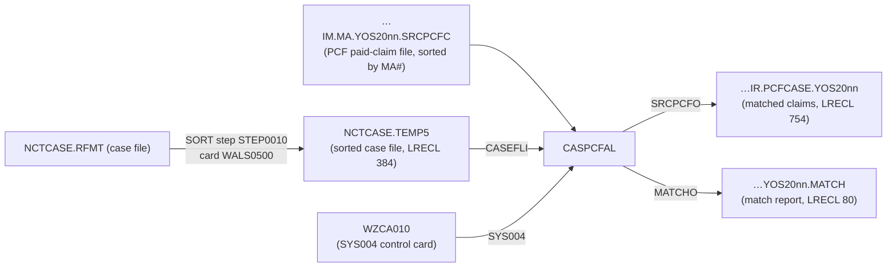

# CASPCFAL — Program Logic Documentation

> Source of record: `CASPCFAL.txt` (COBOL, 1366 lines) plus its `COPY` copybooks and the JCL that invokes it.
> This document is **strictly source-based**. Every statement is tied to source evidence (file + line). Where something
> cannot be proven from the available source it is explicitly flagged as **Inferred**, **Open question**, or
> **Referenced but not available**.

---

# 1. Analysis Method

## 1.1 Artifacts inspected

| Artifact | Role | Evidence |
|---|---|---|
| `CASPCFAL.txt` | The COBOL program analyzed | `PROGRAM-ID. CASPCFAL.` (line 2) |
| `TPLPREFX.txt` | Copybook — claim **input** prefix (127-byte HMS TPL prefix), prefix `PFX` | `COPY TPLPREFX REPLACING ==(PFX)== BY ==PFX==` (line 106) |
| `FDPCF602.txt` | Copybook — claim **input** "HMS 600" area, prefix `CLMI` | `COPY FDPCF602 REPLACING ==(PREFIX)== BY ==CLMI==` (line 109) |
| `NCTCASE.txt` | Copybook — case-record layout, used twice: table prefix `CASET` and read-buffer prefix `CASE` | lines 97, 153 |
| `CLMPREFX.txt` | Copybook — claim **output** prefix, prefix `PRO` | `COPY CLMPREFX REPLACING ==(PREFIX)== BY ==PRO==` (line 160) |
| `FDPCF601.txt` | Copybook — claim **output** "HMS 601" area (ICD-10 sized), prefix `CLM` | `COPY FDPCF601 REPLACING ==(PREFIX)== BY ==CLM==` (line 166) |
| `FDALINH5/4/3.txt` | Copybook — Alabama ("AL") **institutional** client-side layout, prefixes `AL5/AL4/AL3` | lines 116, 118, 120 |
| `FDALPHY5/4/3.txt` | Copybook — Alabama **physician** client-side layout, prefixes `AL5/AL4/AL3` | lines 127, 129, 131 |
| `FDALRXR5/4/3.txt` | Copybook — Alabama **pharmacy/RX** client-side layout, prefixes `AL5/AL4/AL3` | lines 138, 140, 142 |
| `PWTALY05.txt` … `PWTALY17.txt` | JCL jobs that `EXEC PGM=CASPCFAL`, one per year-of-service (YOS2005–YOS2017) | `//EXEC0020 EXEC PGM=CASPCFAL` (PWTALY05 line 57) |
| `WZCA010.txt` | Control-card member fed to `SYS004` (create-source value) | `//SYS004 DD DSN=P.HMSY.CARD.CNTL(WZCA010)` (PWTALY05 line 70) |
| `WALS0500.txt` | Sort control card used **upstream** to sort/filter the case file (external to the program) | PWTALY05 line 43 |

## 1.2 How logic was traced

1. Read the four divisions of `CASPCFAL.txt` end-to-end.
2. Expanded each `COPY … REPLACING` mentally to resolve the real field names (`PFX-…`, `CLMI-…`, `CASE-…`,
   `CASET-…`, `PRO-…`, `CLM-…`, `AL5/AL4/AL3-…`).
3. Followed `PROCEDURE DIVISION` paragraph flow from `0000-MAIN` through every `PERFORM … THRU …` target.
4. Cross-checked record sizes declared in the `FD`s against copybook byte-counts and against the JCL `LRECL`s.
5. Confirmed invocation, DD-to-file mapping, and the control card by reading the JCL (`PWTALY05`).

## 1.3 Proven vs inferred handling

* **Proven** = literally present in the COBOL/copybook/JCL source (cited by line).
* **Inferred** = a reasonable reading of naming/structure/usage, not a literal statement — always labeled.
* **Open question / not available** = a dependency exists in source but the definitive artifact or intent is not
  present — always labeled.

## 1.4 Limitations

* Field-level **data content** is never provided (no data files); all record values in the companion illustration
  document are dummy data derived from copybook PICs.
* Business *intent* is only asserted where a comment or code makes it explicit; otherwise it is marked Inferred.
* The exact century/date encoding of some packed date fields is described by an in-code comment (lines 379–383) and is
  reported using that comment rather than independently proven.

---

# 2. Program Overview

## 2.1 Purpose (proven)

The program's own abstract states its purpose (lines 7–10):

> `THIS PROGRAM EXTRACTS PCF CLAIM DATA BASED ON CASE DATA FROM CAS2000 SYSTEM`

Concretely, the code reads a **PCF (Paid Claim File)** input and a **case file**, both keyed by recipient/Medicaid
number, matches claims to open cases whose date-of-service falls within the case's incident-to-thru window, and writes
the matched claims (reformatted into the "HMS 601" / ICD-10 output layout) plus a per-case match-summary report.

## 2.2 Technical role (proven)

* **Batch main program.** `PROCEDURE DIVISION.` begins at line 280; `0000-MAIN` (line 282) performs init, a mainline
  loop, and termination, ending with `STOP RUN` (line 289).
* **No sub-program calls.** There is **no `CALL`** statement anywhere in the program (verified by search).
* **No in-program sort/merge/rewrite/delete.** There is **no `SORT`, `MERGE`, `RELEASE`, `RETURN`, `REWRITE`,
  `DELETE`, or `START`** verb (verified by search). All ordering is done by external SORT steps in JCL; the program is a
  pure sequential reader/writer.

## 2.3 Business role

* **Proven from JCL:** each `PWTALYnn` job matches an NCTCASE file to one **year-of-service** PCF file
  (`…IM.MA.YOS20nn.SRCPCFC`) and creates `…IR.PCFCASE.YOS20nn` (matched PCF + prefix) plus a `…YOS20nn.MATCH` report
  (PWTALY05 lines 6–8, 57–69). The `ACNTR=ALT` symbolic and the "AL"/Alabama copybooks indicate an Alabama TPL
  (Third-Party Liability) casualty-recovery context.
* **Inferred (not proven in the COBOL):** the extracted matched claims support recovering Medicaid dollars paid on
  claims that fall inside an open casualty/liability case window. The `MATCHO` report tallies "PCF TOT $$ MA PAID" per
  case, consistent with a recovery/lien use. Labeled **Inferred** because the COBOL contains no statement of intent.

## 2.4 Invocation style (proven)

Batch step: `//EXEC0020 EXEC PGM=CASPCFAL` (PWTALY05 line 57). Invoked once per year-of-service job. Same program, same
control card `WZCA010`, different input PCF file per job.

## 2.5 Upstream / downstream dependencies



* **Upstream (proven from JCL):** case file sorted in `STEP0010` with card `WALS0500`
  (`SORT FIELDS=(16,35,CH,A,7,15,CH,A)`, i.e. primarily by `RECIPIENT-ID-NUM` which is at offset 16 in `NCTCASE`); the
  PCF input DSN is sorted by MA number (`IM.MA.…SRCPCFC`). Both inputs are therefore ordered by the same
  recipient/Medicaid key — which is what the program's match logic requires.
* **Downstream (proven from JCL):** `SRCPCFO` → `…IR.PCFCASE.YOS20nn`; `MATCHO` → `…YOS20nn.MATCH`.
  **Inferred (from sibling JCL `PWTALCDF` comments):** the `PCFCASE` output is later loaded to DB2 claim tables. Labeled
  Inferred because that step is not in `CASPCFAL`.

---

# 3. Inputs, Outputs, and Dependencies

## 3.1 Files (`SELECT` / `FD`)

| Logical file | `ASSIGN` name | Mode | Record (FD) | Size | JCL DD (proven) | Direction |
|---|---|---|---|---|---|---|
| `SRCPCF-IN` | `SRCPCFI` | `RECORD IS VARYING 4..32752 DEPENDING ON PCF-DEP`, mode S (lines 39–47) | `CLMI-RECORD` | `PIC X(32752)` | `SRCPCFI` (PWTALY05 58) | Input (PCF claims) |
| `CASEFL-IN` | `CASEFLI` | `RECORDING MODE F` (lines 49–53) | `CASE-RECORD` | `PIC X(384)` | `CASEFLI` (PWTALY05 60) | Input (cases) |
| `SRCPCF-OUT` | `SRCPCFO` | `RECORDING MODE F` (lines 56–61) | `CLMO-RECORD` | `PIC X(754)` | `SRCPCFO` (PWTALY05 61) | Output (matched claims) |
| `CASE-PCF-MATCH` | `MATCHO` | `RECORDING MODE F` (lines 64–69) | `MATCH-RECORD` | `PIC X(80)` | `MATCHO` (PWTALY05 66) | Output (report) |
| `CNTL-CARDS` | `SYS004` | `RECORD CONTAINS 80`, mode F (lines 34–38) | `CNTL-REC` | `PIC X(80)` | `SYS004` = `WZCA010` (PWTALY05 70) | Input (control card) |

Record sizes reconcile with the JCL: case `LRECL=384`, output `LRECL=754`, report `LRECL=80` (PWTALY05 lines 41, 65, 69).

## 3.2 Copybooks (all `COPY` statements)

| Copybook | Prefix substituted | Where mapped |
|---|---|---|
| `NCTCASE` | `CASET` (table entry) | `WS-CASE-TABLE` occurs 30 (lines 95–98) |
| `TPLPREFX` | `PFX` | claim-input prefix in `WS-CLMI-RECORD` (line 106) |
| `FDPCF602` | `CLMI` | claim-input HMS-600 area (line 109) |
| `NCTCASE` | `CASE` | claim-input read buffer `WS-CASE-RECORD` (line 153) |
| `CLMPREFX` | `PRO` | output prefix in `WS-SRCPCF-OUT` (line 160) |
| `FDPCF601` | `CLM` | output HMS-601 area (line 166) |
| `FDALINH5`,`FDALINH4`,`FDALINH3` | `AL5`,`AL4`,`AL3` | institutional client layouts (lines 116–120) |
| `FDALPHY5`,`FDALPHY4`,`FDALPHY3` | `AL5`,`AL4`,`AL3` | physician client layouts (lines 126–131) |
| `FDALRXR5`,`FDALRXR4`,`FDALRXR3` | `AL5`,`AL4`,`AL3` | pharmacy/RX client layouts (lines 137–142) |

**Referenced but not available / commented out:** `FDALINHD`, `FDALCLMS`, `FDALPHYS`, `FDALRXRX`, `FDPCF600` are named
only in comments (lines 122–146, 163) and are **not** compiled in. Version‑2 and version‑1 processing paragraphs are
present but their body is commented out (see §5.9).

## 3.3 Called programs

None. **No `CALL` in the program** (verified). It is self-contained.

## 3.4 Control-card / profile dependency (proven)

* `CNTL-CARDS` (DD `SYS004`) is read in `1650-READ-CARDS` (lines 342–353). Card layout `CARD-REC` (lines 179–184):
  `CARD-TAG X(1)` · `FILLER X(2)` · `CARD-COMMENT X(30)` · `FILLER X(1)` · `CARD-DATA X(2)`.
* When `CARD-TAG = '1'` the program `DISPLAY`s the card and moves `CARD-DATA(1:2)` into `WS-SAVE-CREATE-SOURCE`
  (lines 348–350).
* The physical card is `WZCA010` (PWTALY05 line 70). Its data line maps exactly to the layout:

  ```
  col: 1        4                             35
       1. ENTER VALUE FOR CREATE-SOURCE:      00;
       ^tag     ^CARD-COMMENT(30)             ^CARD-DATA(2)='00'
  ```

  so `WS-SAVE-CREATE-SOURCE = '00'`. `WZCA010`'s own comments define `00 = TPL MEDICAID`, `01 = CO DSS`, `02 = CA OTHER 35`.
  This value is later stamped into every output record as `PRO-CREATE-SOURCE` (lines 472–473).

## 3.5 Important status codes / flags

| Flag / 88 | Definition | Meaning in logic |
|---|---|---|
| `PCF-EOF` (88 of `WS-PCF-EOF-SW`) | value `'Y'` (lines 200–201) | set at PCF `AT END` (line 320); ends mainline loop |
| `CASE-EOF` (88 of `WS-CASE-EOF-SW`) | value `'Y'` (lines 202–203) | set at case `AT END` (line 331); also ends mainline loop (chg 0013) |
| `END-OF-CARDS` (88 of `EOC-SWITCH`) | value `'Y'` (lines 198–199) | set at card `AT END` (line 344); ends card read loop |
| `RECIPIENT-END` (88 of `WS-RECIPIENT-SW`) | value `'Y'` (lines 204–205) | set when a new recipient is reached while loading the table (line 447) |
| `SIZE-OK` / `SIZE-ERROR` (88 of `WS-SIZE-ERROR-FLAG`) | `'N'` / `'Y'` (lines 274–276) | trips when per-case accumulators overflow (lines 662, 665) |
| `CASE-PCF-MATCH-FLAG(SUB-I)` | `X(01)` per table entry (line 98) | `'N'`→not yet matched, `'Y'`→matched; gates open-case match counter (lines 468–471) |

**Note — no `FILE STATUS`:** none of the `SELECT`s declare a `FILE STATUS` field, and there is no `USE`/declarative.
Only `AT END` is handled; any other I/O error relies on the runtime's default abend behavior (see §7).

---

# 4. Data Structures and Important Fields

## 4.1 Claim input record — `WS-CLMI-RECORD` (read from `SRCPCF-IN`)

Structure (lines 104–111):

```
WS-CLMI-RECORD
├─ PFX-…            (TPLPREFX)   127 bytes  – system/netting/application prefix incl. SORT-KEY
├─ CLMI-HMS-600     (FDPCF602)   ~600 bytes – the reformatted paid-claim data
└─ CLMI-CLIENT-DATA PIC X(32025)            – raw client-side (Alabama) claim image
```
127 + 600 + 32025 = 32752, matching the `FD` max and `PCF-DEP` value (line 207).

### Decision-driving `PFX` fields (TPLPREFX)

| Field | PIC | Used at | Behavior |
|---|---|---|---|
| `PFX-APP-MEDICAID-NO` | `X(20)` (TPLPREFX 59) | lines 365,367,398,399,420,421 | **primary match key** vs case recipient id |
| `PFX-APP-DATE-OF-SERVICE` | `9(08) COMP-3` (TPLPREFX 61) | lines 460,461,478 | claim DOS compared to case date window; copied to output |
| `PFX-SYS-EXIT-FROM-REF-STATUS` | `X(01)` (TPLPREFX 34) | line 372 | **inclusion gate**: must equal `'Y'` to process |
| `PFX-SYS-HMS-ASSIGN-FILE` | `X(05)` (TPLPREFX 28) | line 686 | first 4 chars `= 'MAMA'` selects client-parse path |
| `PFX-SYS-VERSION` | `X(02)` (TPLPREFX 29) | lines 688–718 | selects AL5/AL4/AL3 (or v2/v1/other) parse |
| `PFX-NET-CLAIM-TRANS-TYPE` | `X(01)` (TPLPREFX 41) | line 373 (commented) | **not active** — the `'D'` test is commented out |

### Decision-driving `CLMI` fields (FDPCF602)

| Field | PIC | Used at | Behavior |
|---|---|---|---|
| `CLMI-PCF-CONTRACT-NUM` | `X(07)` (602:263) | 377,485,628 | `'0032600'` in DSS-skip, provider-swap, ICN-reformat gates |
| `CLMI-PM-USER-AREA` | `X(40)` (602:293) | 378,626,627,629 | `(27:3)='DSS'` and `(1:2)='PB'/'DT'` gates |
| `CLMI-CLAIM-FROM-DOS` | `9(06) COMP-3` (602:152) | 384,385 | DSS-skip date-range test |
| `CLMI-PROV-OF-SVC-NUM` | `X(15)` (602:45) | 391,484,486 | provider-skip and provider-swap |
| `CLMI-PAY-TO-PROV-NUM` | `X(15)` (602:230) | 392,486 | provider-skip and swap source |
| `CLMI-PCF-HMS-ICN-SUFFIX` / `-N` | `X(02)` / redef `9(02)` (602:385–388) | 630,631,635 | ICN suffix reformat |
| `CLMI-ICN` | `X(20)` (602:144) | 474,634 | output ICN / suffix rebuild |
| `CLMI-PCF-MA-NUM` | `X(20)` (602:44) | 463,492 | recipient id written to output |
| `CLMI-TOT-MA-PAID-HDR` | `S9(7)V99 COMP-3` (602:217) | 664 | accumulated into per-case `$$ MA PAID` |
| `CLMI-PROCEDURE-CODE-5` | `X(05)` (602:48) | 494 | moved into 7-byte output proc code |

## 4.2 Case record — `NCTCASE` (prefixes `CASE` read buffer, `CASET` table)

Total 384 bytes. Fields that matter to behavior:

| Field | PIC | Used at | Behavior |
|---|---|---|---|
| `…-RECIPIENT-ID-NUM` | `X(20)` (NCTCASE 7) | throughout mainline | match key vs `PFX-APP-MEDICAID-NO` |
| `…-CASE-STATUS-CODE` | `X(01)` (NCTCASE 10) | 335, 457–458 | `'O'` or `X'96'` = **open** (see §6) |
| `…-HMS-CASE-KEY` | `9(09)` (NCTCASE 6) | 464 | written to `PRO-HMS-CASE-KEY` |
| `…-HMS-CLIENT-ID` | `X(06)` (NCTCASE 5) | 466 | written to `PRO-CLIENT-ID` (chg 0012) |
| `…-INCIDENT-DATE` | `X(10)` (NCTCASE 29) | 729–735 | parsed → window lower bound |
| `…-CLAIMS-THRU-DATE` | `X(10)` (NCTCASE 30) | 737–743 | parsed → window upper bound |

The 30-entry table (`WS-CASE-TABLE OCCURS 30`) additionally carries a per-entry `CASE-PCF-MATCH-FLAG X(01)`
(line 98) that is **not** part of `NCTCASE`.

## 4.3 Output claim record — `WS-SRCPCF-OUT` (written to `SRCPCF-OUT`)

```
WS-SRCPCF-OUT
├─ PRO-CLMPRFX  (CLMPREFX)  140 bytes – output prefix (recipient, case key, ICN, dates, create-source, client id…)
└─ CLM-HMS-601  (FDPCF601)  614 bytes – reformatted claim, ICD-10 sized (7-byte DX, PROCEDURE-CODE-7, CDE-ICD-VERSION)
```
140 + 614 = 754 = `CLMO-RECORD` size. The output copybook `FDPCF601` differs from input `FDPCF602` by enlarging the
diagnosis fields to `X(07)` (`PRI-DX`,`SEC-DX`,`DX-3/4/5`), providing `PROCEDURE-CODE-7 X(07)`, and adding
`CLM-CDE-ICD-VERSION X(02)` (FDPCF601 lines 49, 149–150, 319–321, 393) — this is the ICD-10 revision (chg header line 42).

Key `PRO` prefix fields set per match (lines 462–483): `PRO-RECIPIENT-ID-NUM`, `PRO-HMS-CASE-KEY`, `PRO-CLIENT-ID`
(chg 0012), `PRO-CREATE-SOURCE` (chg 0005), `PRO-ICN`, `PRO-FORMER-ICN`, `PRO-XACTION-STATUS`, `PRO-CLM-FROM-DATE`,
`PRO-CLAIM-TRANS-TYPE`, `PRO-INCIDENT-DATE`, `PRO-CLM-THRU-DATE`.

## 4.4 Match report record — `WS-MATCH-OUT` (written to `CASE-PCF-MATCH`)

Header layout (lines 168–177) prints columns `CASE ID`, `PCF RECORDS MATCHED`, `PCF TOT $$ MA PAID` separated by `*`.
Detail line built in `2100-WRITE-CASE-PCF-MATCH` (lines 1213–1238).

## 4.5 Working accumulators / switches

| Group | Fields | Notes |
|---|---|---|
| `WS-CASE-PCF-MATCH` (262–265) | `WS-CASE-ID X(20)`, `WS-TOT-PCF-REC-MATCH S9(5) COMP-3`, `WS-TOT-PCF-MA-PAID S9(11)V99 COMP-3` | per-case running totals for the report |
| `WS-CASE-PCF-MATCH-CTRS` (256–259) | `OPEN-CASES-READ-CTR`, `OPEN-CASES-MATCH-OK-CTR`, `OPEN-CASES-NO-MATCH-CTR` `S9(9) COMP-3` | end-of-job open-case statistics |
| `WS-COUNTERS` (210–233) | `PCF-REC-READ-CTR`, `CASE-REC-READ-CTR`, `REC-WRITE-CTR`, `REC-SKIP-PROV`, `REC-SKIP-DSS`, `TABLE-ENTRIES`, `VER-5/4/3-*`, `VER-2`, `VER-1`, `OTHER-VERS`, `SUB-I`, `NUM-REC-OUT` | volume + version counters |
| `WS-COMPARE-DATES` (235–255) | `WS-INCIDENT-DATE(-NEW)`, `WS-CLM-THRU-DATE` and numeric redefines | date-window comparison work area |
| `WK-DIAG` (188–195) | `WK-DIAG-CODE X(7)`, `WK-PROC-CODE X(7)`, `WK-ICD-VERSION X(2)` | diagnosis/procedure staging |
| `WS-ICN-GROUP-19` (87–89) | `WS-ICN-17 X(17)` + `WS-ICN-02 X(02)` | ICN suffix rebuild (chg 0008) |

---

# 5. Processing Logic

## 5.1 Top-level control — `0000-MAIN` (lines 282–290)

```
PERFORM 1000-INITIALIZE
PERFORM 2000-MAINLINE  UNTIL PCF-EOF OR CASE-EOF      *> "OR CASE-EOF" added by chg 0013
PERFORM 9000-TERMINATION
STOP RUN
```

The mainline loop is driven by the **PCF file** (each iteration consumes one claim), and stops as soon as **either**
input reaches end-of-file.

## 5.2 Initialization — `1000-INITIALIZE` (lines 294–313)

1. `OPEN INPUT SRCPCF-IN, CASEFL-IN, CNTL-CARDS; OUTPUT SRCPCF-OUT, CASE-PCF-MATCH` (297–301).
2. `INITIALIZE WS-COUNTERS` (303).
3. Prime one PCF read (`1500`) and one case read (`1600`) (305–306).
4. Read **all** control cards until `END-OF-CARDS` (`1650`) (307–308).
5. Clear the 30-entry case table (`3000` varying `SUB-I` 1→30) (309–310).
6. Write the match-report header (`1700`) (311–312).

## 5.3 Reading paragraphs

### `1500-READ-SRCPCF-IN` (317–326)
`READ SRCPCF-IN INTO WS-CLMI-RECORD; AT END SET PCF-EOF; else ADD 1 TO PCF-REC-READ-CTR`.

### `1600-READ-CASEFL-IN` (328–340)
`READ CASEFL-IN INTO WS-CASE-RECORD; AT END SET CASE-EOF; else ADD 1 TO CASE-REC-READ-CTR`. Then (chg 0004):
`IF CASE-CASE-STATUS-CODE = 'O' OR X'96' → ADD 1 TO OPEN-CASES-READ-CTR` (335–337). Every physical case read is counted
here, so `OPEN-CASES-READ-CTR` counts open cases **actually read** (which may be fewer than the whole file — see §7).

### `1650-READ-CARDS` (342–353)
`READ CNTL-CARDS INTO CARD-REC; AT END MOVE 'Y' TO EOC-SWITCH, CLOSE CNTL-CARDS`. If `CARD-TAG = '1'`, `DISPLAY` the
card and capture `CARD-DATA(1:2)` into `WS-SAVE-CREATE-SOURCE`.

### `1700-WRITE-MATCH-HEADER` (355–361)
Writes the column-title line, then a blank line, to `CASE-PCF-MATCH`.

## 5.4 Mainline matcher — `2000-MAINLINE` (363–427)

Per current claim `(PFX/CLMI)` and current case `(CASE)`:

**Step A — advance case file to the claim key (365–368):**
```
IF CASE-RECIPIENT-ID-NUM < PFX-APP-MEDICAID-NO
    PERFORM 1600-READ-CASEFL-IN
        UNTIL CASE-RECIPIENT-ID-NUM >= PFX-APP-MEDICAID-NO OR CASE-EOF
```
Skips cases whose recipient sorts before the current claim (they have no claim at/after this point).

**Step B — inclusion gate on referral status (372–375):**
```
IF PFX-SYS-EXIT-FROM-REF-STATUS NOT = 'Y'
    PERFORM 1500-READ-SRCPCF-IN
    GO TO 2000-MAINLINE-EXIT
```
Only claims with `PFX-SYS-EXIT-FROM-REF-STATUS = 'Y'` proceed; all others are read past and skipped.
(The alternative `OR PFX-NET-CLAIM-TRANS-TYPE = 'D'` on line 373 is **commented out** and inactive.)

**Step C — DSS date exclusion (377–389, chg 0010):**
```
IF CLMI-PCF-CONTRACT-NUM = '0032600' AND CLMI-PM-USER-AREA(27:3) = 'DSS'
   AND CLMI-CLAIM-FROM-DOS > 0040000 AND CLMI-CLAIM-FROM-DOS < 0900000
    ADD 1 TO REC-SKIP-DSS
    PERFORM 1500-READ-SRCPCF-IN
    GO TO 2000-MAINLINE-EXIT
```
Skips DSS claims (contract `0032600`, user-area tag `DSS`) whose from-date-of-service is inside the coded range. The
in-code comment (379–383) states the date field is `0YYMMDD` and the intent is to **exclude 2004/2005/2006…** and
**include 1990–2002** DSS claims.

**Step D — dummy provider exclusion (391–396, chg 0007/0009):**
```
IF CLMI-PROV-OF-SVC-NUM = '09999996' AND CLMI-PAY-TO-PROV-NUM = '09999996'
    ADD 1 TO REC-SKIP-PROV
    PERFORM 1500-READ-SRCPCF-IN
    GO TO 2000-MAINLINE-EXIT
```
Skips claims where **both** provider numbers are the placeholder `09999996`.

**Step E — match / (re)load the case table (398–424):**
```
IF CASE-RECIPIENT-ID-NUM = PFX-APP-MEDICAID-NO
   AND CASET-RECIPIENT-ID-NUM(1) < PFX-APP-MEDICAID-NO      *> new recipient reached
       IF WS-TOT-PCF-REC-MATCH > 0 OR SIZE-ERROR
           PERFORM 2100-WRITE-CASE-PCF-MATCH                *> flush previous recipient's report line
       PERFORM 3000-INITIALIZE-TABLE (1..30)                *> clear table
       MOVE 'N' TO WS-RECIPIENT-SW
       PERFORM 3010-LOAD-CASE-TABLE  UNTIL RECIPIENT-END    *> load all cases for this recipient
       PERFORM 3020-READ-CASE-TABLE  (1..TABLE-ENTRIES)     *> match claim to each case
ELSE
IF CASE-RECIPIENT-ID-NUM >= PFX-APP-MEDICAID-NO
   AND CASET-RECIPIENT-ID-NUM(1) = PFX-APP-MEDICAID-NO      *> table already holds this recipient
       PERFORM 3020-READ-CASE-TABLE  (1..TABLE-ENTRIES)     *> match claim to each case
```
Then **always** read the next PCF claim (`1500`, line 426).

Interpretation: the first claim of a new matching recipient triggers a full table (re)load; subsequent claims for the
same recipient reuse the loaded table. If the current case key does not equal the claim key at all (no case for this
recipient), neither branch fires and the claim is simply skipped by reading the next one.

## 5.5 Case-table build — `3000` / `3010` (431–450)

* `3000-INITIALIZE-TABLE`: `INITIALIZE WS-CASE-TABLE(SUB-I)` for `SUB-I` 1→30.
* `3010-LOAD-CASE-TABLE` (per `SUB-I`):
  1. `MOVE WS-CASE-RECORD TO WS-CASE-TABLE(SUB-I)`; `MOVE 'N' TO CASE-PCF-MATCH-FLAG(SUB-I)`.
  2. `PERFORM 1600-READ-CASEFL-IN` (read next case).
  3. `IF CASE-RECIPIENT-ID-NUM > CASET-RECIPIENT-ID-NUM(SUB-I) OR CASE-EOF` → `MOVE SUB-I TO TABLE-ENTRIES`,
     `MOVE 'Y' TO WS-RECIPIENT-SW` (stop; `RECIPIENT-END` true).

  So consecutive case records sharing the recipient id are stacked into the table; `TABLE-ENTRIES` = count loaded.

## 5.6 Claim-vs-case matching & output build — `3020-READ-CASE-TABLE` (452–673)

Per table entry `SUB-I`:

1. `PERFORM 4000-FORMAT-DATE` to build the date window for this case (see §5.7).
2. **Open-case gate:** `IF CASET-CASE-STATUS-CODE(SUB-I) = 'O' OR X'96'` (457–458).
3. **Date-window gate (chg 0001):**
   `IF PFX-APP-DATE-OF-SERVICE >= WS-INCIDENT-DATE-NEW-RE` (≥ incident month, day forced to 01)
   `AND PFX-APP-DATE-OF-SERVICE <= WS-CLM-THRU-DATE-N` (≤ claims-thru date) (460–461).
4. On a full match, build the output record:
   * `INITIALIZE PRO-CLMPRFX`; set recipient/case-key/client-id/ICN/former-ICN/xaction-status/from-date/trans-type/
     incident-date/thru-date into the `PRO` prefix (462–483).
   * **Open-case counting (chg 0004):** `IF CASE-PCF-MATCH-FLAG(SUB-I) = 'N' → ADD 1 TO OPEN-CASES-MATCH-OK-CTR;
     MOVE 'Y' TO flag` (468–471) — each open case is counted as matched only once.
   * `MOVE WS-SAVE-CREATE-SOURCE TO PRO-CREATE-SOURCE` (472–473).
   * **Provider swap (chg 0009):** `IF CLMI-PROV-OF-SVC-NUM = '09999996' AND CLMI-PCF-CONTRACT-NUM = '0032600' →
     MOVE CLMI-PAY-TO-PROV-NUM TO CLMI-PROV-OF-SVC-NUM` (484–488).
   * Field-by-field copy of ~90 `CLMI-…` values into the `CLM-…` output area (492–624) — done individually (not a group
     move) because the output layout is ICD-10-widened (comment 489–490).
   * **ICN suffix rebuild (chg 0008):** if `CLMI-PM-USER-AREA(1:2)` is `'PB'`/`'DT'`, contract `= '0032600'`, and
     user-area `(27:3) NOT = 'DSS'`, and the 2-char `CLMI-PCF-HMS-ICN-SUFFIX` is numeric and non-zero, rebuild
     `ICN = 17-char ICN + 2-char suffix` into both `PRO-ICN` and `CLM-ICN` (626–643).
   * `ADD 1 TO REC-WRITE-CTR` (644).
   * `PERFORM 3030-REVIEW-MAMA-VERS` to pull DX/procedure codes from client-side data (645; see §5.8).
   * **ICD version normalization (646–653):** `EVALUATE TRUE` on `CLM-CDE-ICD-VERSION`: `'0 '` or `' 0'` → `'10'`;
     `WHEN OTHER` → `'9'`.
   * `WRITE CLMO-RECORD FROM WS-SRCPCF-OUT` (655).
   * `MOVE '9' TO CLM-CDE-ICD-VERSION` after write (657).
   * **Per-case accumulation (659–669):** `IF SIZE-OK` → `MOVE CASET-RECIPIENT-ID-NUM(1) TO WS-CASE-ID`,
     `ADD 1 TO WS-TOT-PCF-REC-MATCH ON SIZE ERROR SET SIZE-ERROR`,
     `ADD CLMI-TOT-MA-PAID-HDR TO WS-TOT-PCF-MA-PAID ON SIZE ERROR SET SIZE-ERROR`.

Because this runs once per open+in-window case in the table, **one claim can be written multiple times** — one output
record per matching open case (each with that case's `HMS-CASE-KEY`).

## 5.7 Date-window build — `4000-FORMAT-DATE` (725–746)

* `INITIALIZE WS-COMPARE-DATES` (zeros the work area).
* If `CASET-INCIDENT-DATE(SUB-I) NOT = SPACES`: `UNSTRING … DELIMITED BY '-' OR '  ' INTO WS-IN-YYYY, WS-IN-MM`
  (only year and month are captured; day is left `00`).
* (chg 0001) `MOVE WS-INCIDENT-DATE-N TO WS-INCIDENT-DATE-NEW; MOVE 01 TO WS-IN-NEW-DD` → comparison lower bound is
  `YYYYMM01`.
* If `CASET-CLAIMS-THRU-DATE(SUB-I) NOT = SPACES`: `UNSTRING … INTO WS-THRU-YYYY, WS-THRU-MM, WS-THRU-DD`;
  **else** `MOVE '99999999' TO WS-CLM-THRU-DATE` (open-ended upper bound).

**Precise behavior note (proven):** the value stored to the **output** `PRO-INCIDENT-DATE` is `WS-INCIDENT-DATE`
(day `00`, line 482), whereas the **comparison** uses `WS-INCIDENT-DATE-NEW-RE` (day `01`, line 460). The two differ by
the day component by design of chg 0001.

## 5.8 Client-version dispatch — `3030-REVIEW-MAMA-VERS` (675–723)

* `INITIALIZE` the AL5/AL4/AL3 institutional, physician and RX areas (682–684).
* Only if `PFX-SYS-HMS-ASSIGN-FILE(1:4) = 'MAMA'` (686): `EVALUATE PFX-SYS-VERSION`:

| `PFX-SYS-VERSION` | Action | Paragraph |
|---|---|---|
| `'05'` | move `CLMI-CLIENT-DATA` into `AL5` inst/phys/rx, extract codes | `5100` (692) |
| `'04'` | same via `AL4` | `5200` (698) |
| `'03'` | same via `AL3` | `5300` (704) |
| `'02'` | count only | `5400` → `ADD 1 TO VER-2` (710, 1126) |
| `'01'` | count only | `5500` → `ADD 1 TO VER-1` (716, 1200) |
| `WHEN OTHER` | count only | `5600` → `ADD 1 TO OTHER-VERS` (719, 1208) |

If the assign-file is not `MAMA`, none of the above runs (no code extraction, no version counter).

## 5.9 Code extraction — `5100/5200/5300` (748–1121) and stubs `5400/5500/5600` (1123–1211)

`5100` (v5), `5200` (v4), `5300` (v3) are structurally identical apart from the `AL5/AL4/AL3` prefix. Each does
`EVALUATE TRUE` on the **institutional** claim-type alpha byte (`ALn-INST-CLAIM-TYPE-ALPHA`):

| `…-INST-CLAIM-TYPE-ALPHA` | Path | Fields read | Output targets | Counter |
|---|---|---|---|---|
| `'I' 'L' 'O' 'A' 'C'` (institutional) | loop 1..5 over `ALn-INST-DIAG(n)`/`ALn-INST-CDE-ICD-VERSION(n)`; then index 1 of `ALn-INST-HDR-SURG-CD` | DX→`CLM-PRI-DX`,`CLM-SEC-DX`,`CLM-DX-3/4/5`; ICD→`CLM-CDE-ICD-VERSION`; surg→`CLM-PROCEDURE-CODE-7` | `VER-n-INST-ILOAC`, `VER-n-PROC-CD` |
| `'M' 'B'` (physician) | loop 1..5 over `ALn-PHYS-DIAG(n)`/`ALn-PHYS-CDE-ICD-VERSION(n)` | DX→`CLM-PRI-DX…CLM-DX-5`; ICD→`CLM-CDE-ICD-VERSION` | `VER-n-PROF-MB` |
| `'P' 'Q'` (pharmacy/RX) | none (RX has no DX) | — | `VER-n-RX-PQ` |
| `WHEN OTHER` | `CONTINUE` (no action) | — | — |

Each non-blank diagnosis/ICD position is copied only when not spaces (`IF … NOT EQUAL SPACES`). `5400` (v2), `5500`
(v1), `5600` (other) contain only a counter increment; their extraction code is commented out and their headers state
`ICD-10 SEGMENTS ARE NOT BEING CREATED`.

## 5.10 Per-case report line — `2100-WRITE-CASE-PCF-MATCH` (1213–1240)

* `MOVE WS-CASE-ID TO MATCH-CASE-ID-OUT`.
* If `SIZE-OK`: edit `WS-TOT-PCF-REC-MATCH` and `WS-TOT-PCF-MA-PAID` into display fields (left-justified using
  `INSPECT … TALLYING … FOR ALL SPACES`) → `MATCH-TOT-PCF-REC-OUT`, `MATCH-TOT-PCF-MA-PAID-OUT`.
* Else (a size error occurred): `MOVE 'TOO MANY MATCHES, $$ PAID NOT AVAILABLE !'` into the line and reset `SIZE-OK`.
* `WRITE MATCH-RECORD`; then `INITIALIZE WS-CASE-PCF-MATCH`, `WS-MATCH-PROCESS-FIELDS`; blank `WS-MATCH-OUT`.

## 5.11 Termination — `9000-TERMINATION` (1242–1351) and trailer `9100` (1353–1364)

* Flush the **last** recipient's report line if `WS-TOT-PCF-REC-MATCH > 0 OR SIZE-ERROR` (1245–1248). The in-code
  comment (1249–1251) explains this is needed because on PCF EOF the final matched case is never flushed from mainline.
* `9100-WRITE-MATCH-TRAILER`: if `REC-WRITE-CTR = 0` write `'NO MATCHED PCF RECORDS FOUND'`; then a blank line and a line
  of `'*'`.
* `COMPUTE OPEN-CASES-NO-MATCH-CTR = OPEN-CASES-READ-CTR - OPEN-CASES-MATCH-OK-CTR` (1255–1257).
* `DISPLAY` a full counter block (1259–1343) then `CLOSE` all four remaining files (1345–1348). `CNTL-CARDS` was already
  closed at card EOF (line 345).

### Counters displayed (SYSOUT)

| Counter | Label (verbatim) | Source line |
|---|---|---|
| `PCF-REC-READ-CTR` | `NUMBER OF PCF RECORDS READ` | 1267–1269 |
| `REC-SKIP-PROV` | `NUMBER OF SKIPPED PCF RECORDS PR0V=09999996` | 1270–1272 |
| `REC-SKIP-DSS` | `NUMBER OF SKIPPED DSS RECORDS > 2003` | 1273–1275 |
| `CASE-REC-READ-CTR` | `NUMBER OF CASE RECORDS READ` | 1276–1278 |
| `OPEN-CASES-READ-CTR` | `NUMBER OF OPEN CASE RECORDS READ` | 1279–1281 |
| `OPEN-CASES-MATCH-OK-CTR` | `NUMBER OF OPEN CASE RECORDS MATCHED TO PCF` | 1282–1284 |
| `OPEN-CASES-NO-MATCH-CTR` | `NUMBER OF OPEN CASE RECORDS NOT MATCHED TO PCF` | 1285–1287 |
| `REC-WRITE-CTR` | `PCF RECORDS MATCHED TO OPEN CASES AND WRITTEN` | 1288–1291 |
| `VER-5-INST-ILOAC` … `VER-3-RX-PQ` | per-version INST/PROC/PROF/RX updated counts | 1292–1327 |
| `VER-2`, `VER-1`, `OTHER-VERS` | version 2 / 1 / other counts | 1328–1342 |

---

# 6. Extracted Business Logic

Rules below are direct translations of the coded conditions (all cited above).

**Inclusion / exclusion**

1. **Referral status inclusion:** *When* `PFX-SYS-EXIT-FROM-REF-STATUS = 'Y'`, the claim is eligible for matching;
   *otherwise* the claim is skipped (Step B).
2. **DSS date exclusion:** *When* a claim is contract `0032600`, user-area tag `DSS`, and `CLMI-CLAIM-FROM-DOS` is
   between `0040000` and `0900000` (exclusive), the claim is skipped and counted in `REC-SKIP-DSS`. Per the in-code
   comment this excludes service years 2004+ and keeps 1990–2002 DSS claims (Step C).
3. **Placeholder-provider exclusion:** *When* both `CLMI-PROV-OF-SVC-NUM` and `CLMI-PAY-TO-PROV-NUM` = `09999996`, the
   claim is skipped and counted in `REC-SKIP-PROV` (Step D).

**Matching / routing**

4. **Key match:** a claim is considered against a recipient's cases only *when* `PFX-APP-MEDICAID-NO` equals the case
   `RECIPIENT-ID-NUM` (Step E). Both inputs are pre-sorted on this key (JCL).
5. **Open-case rule:** a case participates in matching only *when* `CASE-STATUS-CODE = 'O'` or `X'96'`. `'O'` is EBCDIC
   uppercase "O"; `X'96'` is EBCDIC lowercase "o" — i.e. both upper/lower "o" mean **open** (Inferred meaning from the
   two literals; the *values* are proven).
6. **Date-window rule:** a claim matches a case *when* `incident-month-start ≤ PFX-APP-DATE-OF-SERVICE ≤ claims-thru-date`.
   If the case has no thru date, the upper bound is `99999999` (matches everything on/after the incident month).
7. **One-to-many output:** *when* a claim matches N open, in-window cases for the recipient, N output records are
   written (one per case).

**Field-level output rules**

8. **Create-source stamping:** every output record's `PRO-CREATE-SOURCE` is set from the `CARD-TAG='1'` control card
   (`'00'` per `WZCA010` = "TPL MEDICAID").
9. **Provider substitution:** *when* `CLMI-PROV-OF-SVC-NUM = '09999996'` and contract `= '0032600'`, the pay-to provider
   replaces the service provider in the output.
10. **ICN suffix rebuild:** *when* user-area starts `PB`/`DT`, contract `= '0032600'`, user-area `(27:3) ≠ 'DSS'`, and
    the ICN suffix is numeric and non-zero, the output ICN becomes the 17-char ICN concatenated with the 2-char suffix.
11. **ICD version normalization:** the output `CLM-CDE-ICD-VERSION` is set to `'10'` when the extracted version reads
    `'0 '`/`' 0'`, otherwise `'9'`; it is then reset to `'9'` after each write.
12. **Diagnosis/procedure extraction** depends on the client file being `MAMA` and its version:
    * v05/v04/v03 → extract up to 5 diagnoses + ICD version (institutional or physician per claim-type alpha) and one
      institutional surgery/procedure code;
    * `'P'/'Q'` (RX) → no diagnosis extraction;
    * v02/v01/other → no ICD-10 segment creation, count only.

**Reporting rules**

13. **Per-case tally:** for each matched case the report shows the case id, count of PCF records matched, and total
    `CLMI-TOT-MA-PAID-HDR` accumulated.
14. **Overflow fallback:** *when* the per-case count or dollar accumulation overflows (`SIZE ERROR`), the report line
    prints `TOO MANY MATCHES, $$ PAID NOT AVAILABLE !` instead of the numbers.
15. **No-match trailer:** *when* nothing was written (`REC-WRITE-CTR = 0`), the report prints `NO MATCHED PCF RECORDS
    FOUND`.

---

# 7. Error Handling and Edge Cases

| Area | Behavior | Evidence |
|---|---|---|
| End-of-file | `AT END` handled for all three inputs via 88 switches; mainline stops on `PCF-EOF OR CASE-EOF` | 320, 331, 344, 286–287 |
| File status | **No `FILE STATUS`, no declaratives.** Non-EOF I/O errors are not trapped; the runtime default (typically an abend) applies | `SELECT`s 26–30 (no status clause) |
| Numeric overflow | Per-case `count`/`$` adds are guarded with `ON SIZE ERROR SET SIZE-ERROR`; the report then prints a "too many matches" message and resets `SIZE-OK` | 659–669, 1216–1234 |
| Incomplete case file | By design (chg 0013) the job stops at PCF EOF **or** case EOF; the termination `DISPLAY` warns `THE CASE FILE MAY NOT HAVE BEEN READ TO COMPLETION`; open cases never read are not counted as no-match | 1263–1265 |
| Last-recipient flush | Final report line is written in `9000` because mainline cannot flush it after PCF EOF | 1245–1251 |
| Table capacity | `WS-CASE-TABLE` has **30** entries; `3010`/`3020` vary `SUB-I` with **no explicit `SUB-I > 30` guard**. A recipient with >30 case records would drive the subscript past the table. **Open question / not proven** whether upstream data can exceed 30 per recipient | 96, 406–417, 438–447 |
| Missing dates | Blank incident date → lower bound stays year/month `0000-00` (from `INITIALIZE`); blank thru date → `99999999` | 727–743 |
| Non-`MAMA` client file | `3030` does nothing (no extraction, no version counter) — DX/procedure output fields keep whatever the field-by-field copy left | 686 |
| Commented-out logic | The `PFX-NET-CLAIM-TRANS-TYPE = 'D'` alternative (373) and all v2/v1 extraction (1128–1192, etc.) are inert | 373, 1128–1192 |

---

# 8. Proven vs Inferred vs Unknown

## 8.1 Proven from source
* Program is batch main `CASPCFAL`, no `CALL`, no in-program `SORT/MERGE/REWRITE/DELETE` (divisions + verb search).
* Five files with the exact `ASSIGN`/`FD`/size shown in §3.1; JCL DD mapping and `LRECL`s (PWTALY05).
* Control card `SYS004 = WZCA010`, `CARD-TAG='1'` → `CARD-DATA(1:2)` → `PRO-CREATE-SOURCE` (`'00'`).
* All match, skip, date-window, provider-swap, ICN-rebuild, ICD-version and code-extraction conditions exactly as cited.
* All counters and their SYSOUT labels; report header/detail/trailer content.
* Record-size arithmetic: TPLPREFX=127, CLMPREFX(PRO)=140, case=384, output=754, PCF max=32752.

## 8.2 Inferred from structure / usage
* **Business purpose** of the extract (Medicaid/TPL casualty recovery) — consistent with copybook names, `ACNTR=ALT`,
  the `$$ MA PAID` tally, and the `PWTALCDF`/DB2 sibling job, but not stated in `CASPCFAL`.
* **`CASE-STATUS-CODE` `'O'`/`X'96'` = "open"** — the *values* are proven; "open" is inferred from the code path
  (`OPEN-CASES-*` counters) and EBCDIC upper/lower "o".
* **Inputs are sorted by the same key** — proven from JCL DSN names and the `WALS0500` sort card, inferred to be the
  exact ordering the matcher assumes.
* **`MAMA` = client file type + version** — supported by the copybook comment (677–680), treated as inferred labeling.

## 8.3 Open questions / not available
* Definitions/layouts of `FDPCF600`, `FDALINHD`, `FDALCLMS`, `FDALPHYS`, `FDALRXRX`, `FDALINH2/1` — **referenced only in
  comments**, not compiled, not present.
* Exact century semantics of packed date fields (`0YYMMDD`) are described by comment only (379–383); the boundary
  years are as the comment states, not independently verified against data.
* Whether a recipient can have **> 30** case records (table-overflow protection) — **not proven**.
* The precise upstream/downstream data lineage beyond the JCL shown (e.g., who builds `SRCPCFC`, who consumes
  `PCFCASE`) — **not available** in the analyzed artifacts (only hinted by sibling JCL).
