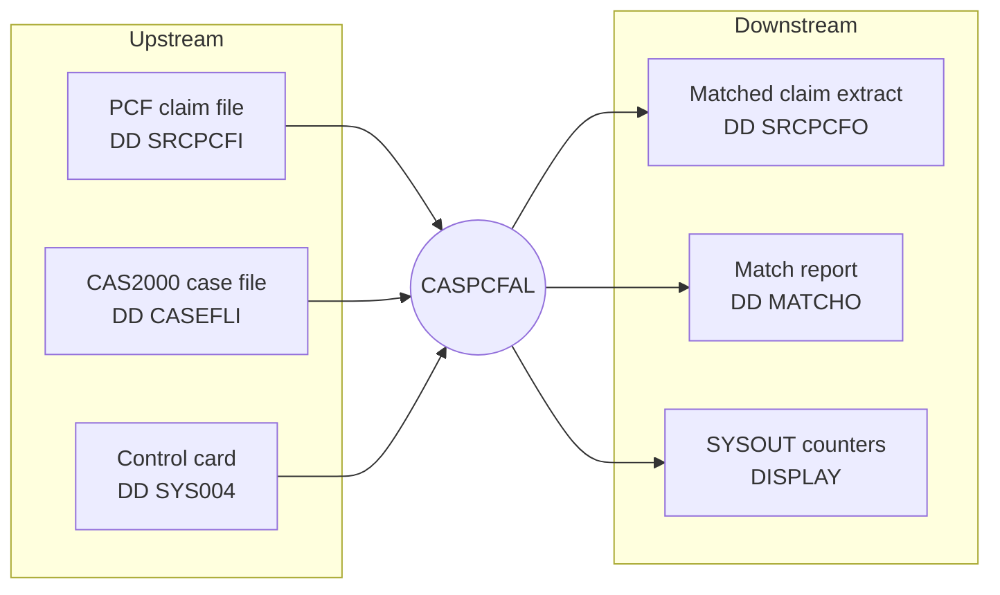
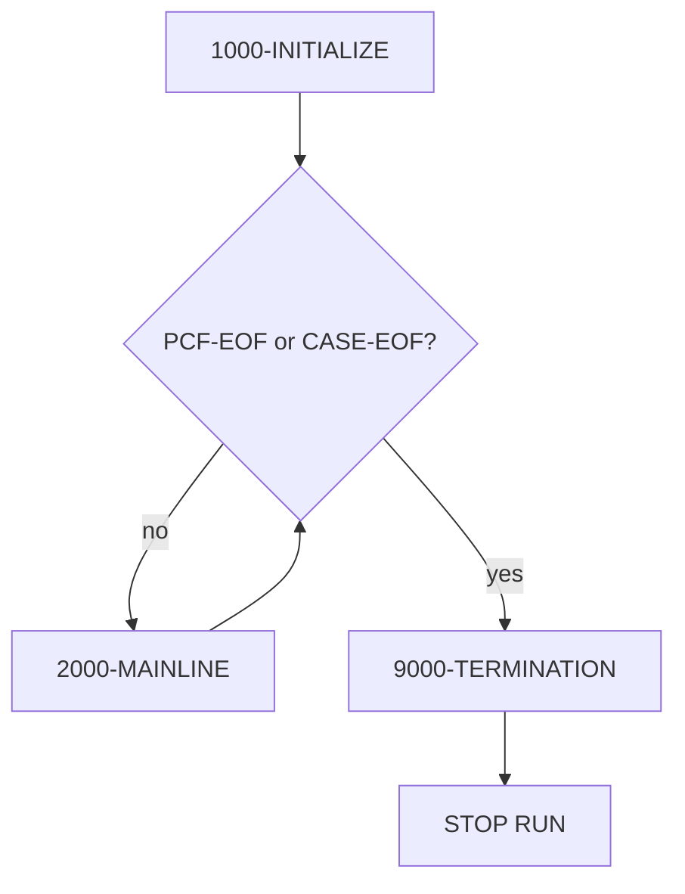

# CASPCFAL — Logic Document

> **Program:** `CASPCFAL` &nbsp;|&nbsp; **Source file:** `CASPCFAL.txt` (1366 lines)
> **Author (source):** `BJW` &nbsp;|&nbsp; **Installation (source):** `HMS` &nbsp;|&nbsp; **Date-Written (source):** `07/02/2015`
>
> This document is **strictly source-based**. Every statement is tied to evidence from `CASPCFAL.txt` or its copybooks. Where something cannot be proven from source, it is explicitly marked **Not proven from source**, **Inferred from structure/usage**, **Open question**, or **Referenced but implementation not available**.

---

# 1. Analysis Method

## 1.1 Artifacts inspected

| Artifact | Type | Role (from source) | Evidence |
|---|---|---|---|
| `CASPCFAL.txt` | COBOL program | Main program analyzed | `PROGRAM-ID. CASPCFAL` (line 2) |
| `NCTCASE` | Copybook | CAS2000 case record layout; used twice (`CASE` current record, `CASET` in-memory table) | `COPY NCTCASE` (lines 97, 153) |
| `TPLPREFX` | Copybook | HMS TPL prefix (`PFX`) — first 127 bytes of PCF claim | `COPY TPLPREFX` (line 106) |
| `FDPCF602` | Copybook | PCF claim body **input** area (`CLMI`, 600 bytes) | `COPY FDPCF602` (line 109) |
| `FDPCF601` | Copybook | PCF claim body **output** area (`CLM`, ICD-10 widened) | `COPY FDPCF601` (line 166) |
| `CLMPREFX` | Copybook | Output prefix (`PRO`) | `COPY CLMPREFX` (line 160) |
| `FDALINH5/4/3` | Copybooks | Client-side **institutional** layout (`AL5/AL4/AL3`) | `COPY FDALINH5/4/3` (lines 116,118,120) |
| `FDALPHY5/4/3` | Copybooks | Client-side **professional** layout (`AL5/AL4/AL3`) | `COPY FDALPHY5/4/3` (lines 127,129,131) |
| `FDALRXR5/4/3` | Copybooks | Client-side **pharmacy** layout (`AL5/AL4/AL3`) | `COPY FDALRXR5/4/3` (lines 138,140,142) |

All copybooks listed above were physically read from the repository (same `Job-details` tree that holds `CASPCFAL.txt`).

## 1.2 How logic was traced
- Read the four divisions top-to-bottom; expanded each `COPY … REPLACING` mentally using the actual copybook text.
- Followed `PERFORM … THRU … EXIT` paragraph sequencing from `0000-MAIN` (lines 282–290).
- Traced every `READ`/`WRITE`, `IF`/`EVALUATE`, `MOVE`, `ADD`, `COMPUTE`, `UNSTRING`, `INSPECT`, `INITIALIZE`, and 88-level condition used in branching.
- Cross-checked field PICs and lengths against copybooks (e.g., ICD-10 widening of DX/procedure fields).

## 1.3 Proven vs inferred handling
- **Proven** = directly present in code/copybook (quoted field/paragraph/line).
- **Inferred** = a reasonable consequence of structure or usage that is not literally stated (e.g., "input files must be pre-sorted"). Marked as such.
- **Not proven** = not determinable from the provided source (e.g., JCL DD → dataset bindings).

## 1.4 Limitations
- **No JCL / run-deck is present** in the repository for this program. File-to-dataset bindings for the `ASSIGN` names (`SRCPCFI`, `CASEFLI`, `SRCPCFO`, `MATCHO`, `SYS004`) are **Referenced but implementation not available**.
- The program contains **no `FILE STATUS` clauses** (see §7). Diagnosis of I/O errors beyond `AT END` cannot be described because none is coded.
- `CLMI-CLIENT-DATA` client-side content beyond the fields the program reads (claim-type-alpha, diagnosis, ICD version, surgery code) is not interpreted by the program and is not documented field-by-field here.

---

# 2. Program Overview

## 2.1 Purpose (proven)
From the program abstract (lines 7–11):

```
*   THIS PROGRAM EXTRACTS PCF CLAIM DATA BASED ON
*   CASE DATA FROM CAS2000 SYSTEM
```

The program reads a **PCF (Paid Claim File)** input, reads a **CAS2000 case file**, and writes out only those claims that **match an open case** for the same recipient within a date window. It also writes a **match summary report**.

## 2.2 Technical role (proven)
- **Batch, sequential match/extract** program. It is a `PROGRAM-ID` with `PROCEDURE DIVISION` and no `USING` phrase (line 280), ending in `STOP RUN` (line 289).
- **Invocation style:** main batch program / job step. **Proven** it is not a called subprogram (no `LINKAGE SECTION`, no `PROCEDURE DIVISION USING`, no `ENTRY`).
- No `CALL`, `SORT`, `MERGE`, `REWRITE`, or file `DELETE` verbs exist (verified by search). It is strictly read → transform → write.

## 2.3 Business role (proven from abstract + code)
- Identifies Medicaid **PCF claims** that belong to **open CAS2000 cases** (e.g., third-party-liability / estate-recovery style case matching) for the same **recipient (Medicaid) number**, and only when the claim's **date of service falls within the case's incident-to-thru window**.
- Produces (a) an **extract file** of matched claims reformatted into the output layout, and (b) a **human-readable match report** listing, per case-id, the number of PCF records matched and the total MA (Medicaid) dollars paid.
- Mod history (lines 17–20) shows targeted maintenance: `0012 UPDATE CLIENT-ID IN OUTPUT FILE`, `0013 STOP PROCESSING WHEN CASE-EOF OCCURS`. **Business intent beyond these code-confirmed facts is not asserted.**

## 2.4 Lineage (proven)
- `*0000 07/02/15 BJW … ORIGINAL CLONED FROM CASPCFM1` (line 17). So this program is a clone/variant of `CASPCFM1` (the `AL` in the name aligns with the "AL" client-side copybooks it uses). **`CASPCFM1` source is not in scope here.**

## 2.5 Upstream / downstream dependencies



- **Upstream ordering (Inferred from structure/usage):** both `SRCPCF-IN` (by `PFX-APP-MEDICAID-NO`) and `CASEFL-IN` (by `…-RECIPIENT-ID-NUM`) must be **pre-sorted ascending** on the recipient key. Evidence: the mainline advances the case file only while `CASE-RECIPIENT-ID-NUM < PFX-APP-MEDICAID-NO` (lines 365–368) and the table loader stops when the next case key becomes greater (lines 443–447). The program itself does **no** internal sort. The sort step is **Not proven from source** (no JCL provided).

---

# 3. Inputs, Outputs, and Dependencies

## 3.1 Files (`SELECT` / `FD`) — proven

| Logical file | `ASSIGN TO` (DD) | Mode / length | Direction | Record buffer | Evidence |
|---|---|---|---|---|---|
| `SRCPCF-IN` | `SRCPCFI` | Varying 4–32752, `RECORDING MODE S`, `DEPENDING ON PCF-DEP` | Input | `CLMI-RECORD PIC X(32752)`; read `INTO WS-CLMI-RECORD` | lines 26, 41–48, 319 |
| `CASEFL-IN` | `CASEFLI` | Fixed, `RECORDING MODE F` | Input | `CASE-RECORD PIC X(384)`; read `INTO WS-CASE-RECORD` | lines 27, 51–56, 330 |
| `SRCPCF-OUT` | `SRCPCFO` | Fixed, `RECORDING MODE F` | Output | `CLMO-RECORD PIC X(754)`; write `FROM WS-SRCPCF-OUT` | lines 28, 59–64, 655 |
| `CASE-PCF-MATCH` | `MATCHO` | Fixed, `RECORDING MODE F` | Output | `MATCH-RECORD PIC X(80)`; write `FROM WS-MATCH-OUT`/`WS-MATCH-PROCESS…` | lines 29, 67–72, 357/1235 |
| `CNTL-CARDS` | `SYS004` | 80 chars, `RECORDING MODE F`, `LABEL RECORDS OMITTED` | Input | `CNTL-REC PIC X(80)`; read `INTO CARD-REC` | lines 30, 35–39, 343 |

Notes (proven):
- `PCF-DEP PIC 9(05) VALUE 32752` (line 207) is **never modified** in the Procedure Division, so the varying-length "depends on" resolves to a constant 32752.
- The `FD CASEFL-IN` line says `DATA RECORD IS CLMI-RECORD` (line 55) although its `01` is `CASE-RECORD`. This is a **documentary inconsistency** in the `FD` clause only; because `READ … INTO WS-CASE-RECORD` is used, behavior is unaffected. **(Observation.)**

## 3.2 Copybooks — proven
See §1.1. Key `REPLACING` prefixes:

| Copybook | Prefix used | Meaning |
|---|---|---|
| `NCTCASE` | `CASET` (line 97) | in-memory case table entry |
| `NCTCASE` | `CASE` (line 153) | current case record just read |
| `TPLPREFX` | `PFX` (line 106) | claim prefix (system/netting/application keys) |
| `FDPCF602` | `CLMI` (line 109) | claim body as read (input) |
| `FDPCF601` | `CLM` (line 166) | claim body as written (output) |
| `CLMPREFX` | `PRO` (line 160) | output prefix |
| `FDALINH5/4/3` | `AL5/AL4/AL3` | institutional client layout |
| `FDALPHY5/4/3` | `AL5/AL4/AL3` | professional client layout |
| `FDALRXR5/4/3` | `AL5/AL4/AL3` | pharmacy client layout |

## 3.3 Linkage structures
**None.** There is no `LINKAGE SECTION` and no `PROCEDURE DIVISION USING`. (Proven by absence.)

## 3.4 Called programs
**None.** No `CALL` statement exists. (Proven by absence.)

## 3.5 Control-card / profile dependency — proven

`1650-READ-CARDS` (lines 342–353) reads `SYS004` until end of file. The card layout (lines 179–184):

```
01  CARD-REC.
    05 CARD-TAG      PIC X(01)
    05 FILLER        PIC X(02)
    05 CARD-COMMENT  PIC X(30)
    05 FILLER        PIC X(1)
    05 CARD-DATA     PIC X(02)
```

Behaviour: **only** a card whose `CARD-TAG = '1'` is used; when found, the program `DISPLAY`s the card and moves `CARD-DATA(1:2)` into `WS-SAVE-CREATE-SOURCE` (lines 348–350). That saved value later becomes `PRO-CREATE-SOURCE` in every output record (lines 472–473). Cards with any other tag are read and ignored. If no `'1'` card is present, `WS-SAVE-CREATE-SOURCE` stays `SPACES` (its initialized value, line 186). **The card's actual business content is a 2-character "create source" code — the specific valid values are Not proven from source** (no data provided).

## 3.6 Important status codes / flags — proven

| Flag / 88 | Value(s) | Set where | Checked where | Effect |
|---|---|---|---|---|
| `PCF-EOF` (`WS-PCF-EOF-SW`) | `'Y'` | `1500` AT END (320) | `0000-MAIN` UNTIL (286) | ends main loop |
| `CASE-EOF` (`WS-CASE-EOF-SW`) | `'Y'` | `1600` AT END (331) | main loop / loaders (287, 368, 444) | ends main loop (mod 0013), stops catch-up & table load |
| `END-OF-CARDS` (`EOC-SWITCH`) | `'Y'` | `1650` AT END (344) | init loop UNTIL (308) | ends card read loop |
| `RECIPIENT-END` (`WS-RECIPIENT-SW`) | `'Y'` | `3010` (447) | table-load UNTIL (412) | stops loading table for a recipient |
| `SIZE-OK`/`SIZE-ERROR` (`WS-SIZE-ERROR-FLAG`) | `'N'`/`'Y'` | `ON SIZE ERROR` (662,665); reset (1233) | 400, 659, 1216, 1245 | overflow guard on per-recipient totals |
| `WS-PROCESSED-SW` | `'N'` (init) | — | — | **Declared but never referenced** (line 206) — dead field |

---

# 4. Data Structures and Important Fields

## 4.1 Claim input record `WS-CLMI-RECORD` (32752 bytes) — proven
Three pieces (lines 104–111):

| Part | Copybook (prefix) | Size | Source note |
|---|---|---|---|
| Prefix | `TPLPREFX` (`PFX`) | 127 | comment "1ST 127 IS A 20" (line 105); copybook header "RECORD LENGTH: 127" |
| Body | `FDPCF602` (`CLMI`) as `CLMI-HMS-600` | 600 | comment "2ND 600 IS A 20" (line 108) |
| Client remainder | `CLMI-CLIENT-DATA PIC X(32025)` | 32025 | line 111 |

**Key `PFX` fields used in logic (from `TPLPREFX`):**

| Field | PIC | Used for |
|---|---|---|
| `PFX-SYS-HMS-ASSIGN-FILE` | `X(05)` | `(1:4) = 'MAMA'` gate (line 686) |
| `PFX-SYS-VERSION` | `X(02)` | version routing `'05'..'01'` (lines 688–712) |
| `PFX-SYS-EXIT-FROM-REF-STATUS` | `X(01)` | inclusion gate `NOT = 'Y'` → skip (line 372) |
| `PFX-NET-CLAIM-TRANS-TYPE` | `X(01)` | moved to `PRO-CLAIM-TRANS-TYPE` (line 480) |
| `PFX-APP-MEDICAID-NO` | `X(20)` | **match key** vs case recipient (lines 365,398,420) |
| `PFX-APP-DATE-OF-SERVICE` | `9(08) COMP-3` | **date-window key**; moved to `PRO-CLM-FROM-DATE` (lines 460,461,478) |

## 4.2 Case record / case table — proven
`NCTCASE` (384 bytes). Current record uses prefix `CASE-…`; the table uses prefix `CASET-…`.

- Table: `01 NCTCASE. 03 WS-CASE-TABLE OCCURS 30 TIMES.` + `COPY NCTCASE (CASET)` + `05 CASE-PCF-MATCH-FLAG PIC X(01)` (lines 95–99). So each of the 30 entries = 384 case bytes + 1 match-flag byte.

**Key case fields used in logic:**

| Field (table form) | PIC | Used for |
|---|---|---|
| `CASE-RECIPIENT-ID-NUM` / `CASET-RECIPIENT-ID-NUM(n)` | `X(20)` | match key vs `PFX-APP-MEDICAID-NO` |
| `CASE-CASE-STATUS-CODE` / `CASET-CASE-STATUS-CODE(n)` | `X(01)` | open-case test `= 'O' OR X'96'` (lines 335,457–458) |
| `CASET-HMS-CASE-KEY(n)` | `9(09)` | → `PRO-HMS-CASE-KEY` (line 464) |
| `CASET-HMS-CLIENT-ID(n)` | `X(06)` | → `PRO-CLIENT-ID` (mod 0012, line 466) |
| `CASET-INCIDENT-DATE(n)` | `X(10)` | lower date bound (unstrung, line 730) |
| `CASET-CLAIMS-THRU-DATE(n)` | `X(10)` | upper date bound (unstrung, line 738) |
| `CASE-PCF-MATCH-FLAG(n)` | `X(01)` | one-time "matched" marker per case (lines 441,468–470) |

## 4.3 Output record `WS-SRCPCF-OUT` (754 bytes) — proven
Two parts (lines 159–166):

| Part | Copybook (prefix) | Note |
|---|---|---|
| Prefix | `CLMPREFX` (`PRO`) | recipient/case/ICN/date/create-source/client-id |
| Body | `FDPCF601` (`CLM`) as `CLM-HMS-601` | ICD-10-widened claim body |

**Why a field-by-field copy (not a group move):** `FDPCF601` widens diagnosis and procedure fields for ICD-10 vs. `FDPCF602`:

| Field | `FDPCF602` (input `CLMI`) | `FDPCF601` (output `CLM`) |
|---|---|---|
| `PROCEDURE-CODE-5` / `-7` | `X(05)` | `X(07)` |
| `PRI-DX`, `SEC-DX`, `DX-3/4/5` | `X(05)` | `X(07)` |
| `CDE-ICD-VERSION` | *absent* | `X(02)` (new, line 393 of `FDPCF601`) |

The source comment confirms the intent (lines 489–490): `*  IN PLACE OF THIS MOVE WE MOVE THE RECORD BY COLUMN` / `*  MOVE CLMI-HMS-600 TO CLM-HMS-601`.

## 4.4 Match report structures — proven
- `WS-MATCH-OUT` header titles (lines 168–177): `* CASE ID * PCF RECORDS MATCHED * PCF TOT $$ MA PAID *`.
- `WS-CASE-PCF-MATCH` accumulators (lines 262–265): `WS-CASE-ID X(20)`, `WS-TOT-PCF-REC-MATCH S9(5) COMP-3`, `WS-TOT-PCF-MA-PAID S9(11)V99 COMP-3`.
- Edit fields (lines 268–269): `WS-CONVERT-MATCH PIC ZZZZ9`, `WS-CONVERT-PCF-PAID PIC $$$,$$$,$$$,$$9.99`.

## 4.5 Counters — proven (all `PIC 9(09)` unless noted; `WS-COUNTERS` lines 210–233, match ctrs 256–259)

| Counter | Increment site | Meaning (from DISPLAY text §5.9) |
|---|---|---|
| `PCF-REC-READ-CTR` | every PCF read (323) | claims read |
| `CASE-REC-READ-CTR` | every case read (334) | case records read |
| `REC-WRITE-CTR` | each matched claim written (644) | claims written |
| `REC-SKIP-PROV` | dummy-provider skip (393) | skipped, prov `09999996` |
| `REC-SKIP-DSS` | DSS skip (386) | skipped DSS > 2003 |
| `TABLE-ENTRIES` | set in table load (445) | case rows loaded for current recipient |
| `OPEN-CASES-READ-CTR` `S9(9)COMP-3` | open case read (336) | open cases read |
| `OPEN-CASES-MATCH-OK-CTR` `S9(9)COMP-3` | first match per case (469) | open cases matched |
| `OPEN-CASES-NO-MATCH-CTR` `S9(9)COMP-3` | `COMPUTE` (1255) | read − matched |
| `VER-5/4/3-INST-ILOAC`, `-PROC-CD`, `-PROF-MB`, `-RX-PQ` | in 5100/5200/5300 | per-version diag/proc/rx tallies |
| `VER-2`, `VER-1`, `OTHER-VERS` | 5400/5500/5600 | version tallies (no ICD-10 build) |
| `SUB-I` | loop index | table subscript |
| `NUM-REC-OUT` `PIC ZZZ,ZZZ,ZZ9` | — | edited counter for DISPLAY |

## 4.6 Date work area `WS-COMPARE-DATES` — proven (lines 235–255)
- `WS-INCIDENT-DATE` = `YYYY MM DD` with numeric redefine `WS-INCIDENT-DATE-N` `9(08)`.
- `WS-INCIDENT-DATE-NEW` (mod 0001) = `YYYY MM DD` with redefine `WS-INCIDENT-DATE-NEW-RE` `9(08)` — the value actually compared.
- `WS-CLM-THRU-DATE` = `YYYY MM DD` with redefine `WS-CLM-THRU-DATE-N` `9(08)`.

---

# 5. Processing Logic

Top-level driver `0000-MAIN` (lines 282–290):

```
PERFORM 1000-INITIALIZE
PERFORM 2000-MAINLINE UNTIL PCF-EOF OR CASE-EOF     (mod 0013 added CASE-EOF)
PERFORM 9000-TERMINATION
STOP RUN
```



## 5.1 Initialization — `1000-INITIALIZE` (lines 294–315)
1. `OPEN INPUT SRCPCF-IN CASEFL-IN CNTL-CARDS` and `OUTPUT SRCPCF-OUT CASE-PCF-MATCH`.
2. `INITIALIZE WS-COUNTERS`.
3. Prime reads: `1500-READ-SRCPCF-IN` (first claim), `1600-READ-CASEFL-IN` (first case).
4. `PERFORM 1650-READ-CARDS UNTIL END-OF-CARDS` — consume the control-card file, capturing the `'1'` card's `CARD-DATA` into `WS-SAVE-CREATE-SOURCE`.
5. `PERFORM 3000-INITIALIZE-TABLE VARYING SUB-I 1..30` — clear the 30-entry case table.
6. `PERFORM 1700-WRITE-MATCH-HEADER` — write report title line + a blank line.

## 5.2 Reads

### `1500-READ-SRCPCF-IN` (317–326)
`READ SRCPCF-IN INTO WS-CLMI-RECORD; AT END SET PCF-EOF`; otherwise `ADD 1 TO PCF-REC-READ-CTR`.

### `1600-READ-CASEFL-IN` (328–340)
`READ CASEFL-IN INTO WS-CASE-RECORD; AT END SET CASE-EOF`; otherwise `ADD 1 TO CASE-REC-READ-CTR`; then (mod 0004):
```
IF CASE-CASE-STATUS-CODE = 'O' OR X'96'
   ADD 1 TO OPEN-CASES-READ-CTR
```
So every read case that is **open** (`'O'` or `X'96'`) is counted.

### `1650-READ-CARDS` (342–353)
`READ CNTL-CARDS INTO CARD-REC; AT END MOVE 'Y' TO EOC-SWITCH, CLOSE CNTL-CARDS`. If `CARD-TAG = '1'`: `DISPLAY CARD-REC` and `MOVE CARD-DATA(1:2) TO WS-SAVE-CREATE-SOURCE`.

## 5.3 Match header — `1700-WRITE-MATCH-HEADER` (355–361)
Writes the titled header record, then blanks `WS-MATCH-OUT` and writes a blank line.

## 5.4 Mainline — `2000-MAINLINE` (363–427)

Executed once per iteration until `PCF-EOF` or `CASE-EOF`.

```mermaid
flowchart TD
  A[Start with current claim PFX-APP-MEDICAID-NO] --> B{CASE-RECIPIENT-ID-NUM < claim MA-NO?}
  B -- yes --> B1[Read case file forward<br/>until case >= claim OR CASE-EOF] --> C
  B -- no --> C{PFX-SYS-EXIT-FROM-REF-STATUS = 'Y'?}
  C -- no --> C1[read next PCF; exit iteration]
  C -- yes --> D{DSS skip?<br/>contract 0032600 & PM(27:3)='DSS'<br/>& 0040000 < FROM-DOS < 0900000}
  D -- yes --> D1[ADD REC-SKIP-DSS; read next PCF; exit]
  D -- no --> E{Dummy provider?<br/>PROV=09999996 AND PAY-TO=09999996}
  E -- yes --> E1[ADD REC-SKIP-PROV; read next PCF; exit]
  E -- no --> F{New recipient?<br/>case = claim AND table1 < claim}
  F -- yes --> F1[flush prior match if any] --> F2[init table] --> F3[load table for recipient] --> F4[process claim vs table] --> Z
  F -- no --> G{Same recipient already loaded?<br/>case >= claim AND table1 = claim}
  G -- yes --> G1[process claim vs table] --> Z
  G -- no --> Z[read next PCF]
```

### 5.4.1 Case catch-up (365–368)
```
IF CASE-RECIPIENT-ID-NUM < PFX-APP-MEDICAID-NO
    PERFORM 1600-READ-CASEFL-IN
       UNTIL CASE-RECIPIENT-ID-NUM >= PFX-APP-MEDICAID-NO OR CASE-EOF
```
Advances the case file so the current case key is not behind the claim key.

### 5.4.2 Inclusion gate on referral status (372–375)
```
IF (PFX-SYS-EXIT-FROM-REF-STATUS NOT = 'Y')
   PERFORM 1500-READ-SRCPCF-IN
   GO TO 2000-MAINLINE-EXIT
```
Only claims with `PFX-SYS-EXIT-FROM-REF-STATUS = 'Y'` proceed; all others are skipped (next claim read). The alternative `OR (PFX-NET-CLAIM-TRANS-TYPE = 'D')` on line 373 is **commented out** (`PCM **`) — **inactive**.

### 5.4.3 DSS exclusion (mod 0010, lines 377–389)
```
IF CLMI-PCF-CONTRACT-NUM = '0032600' AND
   CLMI-PM-USER-AREA(27:3) = 'DSS'  AND
   CLMI-CLAIM-FROM-DOS > 0040000 AND
   CLMI-CLAIM-FROM-DOS < 0900000
   ADD 1 TO REC-SKIP-DSS
   PERFORM 1500-READ-SRCPCF-IN
   GO TO 2000-MAINLINE-EXIT
```
Source comment (379–383): `CLMI-CLAIM-FROM-DOS` is numeric `0YYMMDD`; the range excludes service years ~2004+ while including 1990–2002. Matching DSS claims are skipped and counted.

### 5.4.4 Dummy-provider exclusion (mod 0007/0009, lines 391–396)
```
IF CLMI-PROV-OF-SVC-NUM = '09999996' AND
   CLMI-PAY-TO-PROV-NUM = '09999996'
   ADD 1 TO REC-SKIP-PROV
   PERFORM 1500-READ-SRCPCF-IN
   GO TO 2000-MAINLINE-EXIT
```
Claims whose service **and** pay-to provider are both `09999996` are skipped and counted.

### 5.4.5 Recipient-group handling (398–424)
```
IF CASE-RECIPIENT-ID-NUM = PFX-APP-MEDICAID-NO
AND CASET-RECIPIENT-ID-NUM(1) < PFX-APP-MEDICAID-NO      *> new recipient
    IF WS-TOT-PCF-REC-MATCH > 0 OR SIZE-ERROR
        PERFORM 2100-WRITE-CASE-PCF-MATCH               *> flush previous recipient
    END-IF
    PERFORM 3000-INITIALIZE-TABLE 1..30                 *> clear table
    MOVE 'N' TO WS-RECIPIENT-SW
    PERFORM 3010-LOAD-CASE-TABLE UNTIL RECIPIENT-END    *> load this recipient's cases
    PERFORM 3020-READ-CASE-TABLE 1..TABLE-ENTRIES       *> process claim vs each case
ELSE
IF CASE-RECIPIENT-ID-NUM >= PFX-APP-MEDICAID-NO
AND CASET-RECIPIENT-ID-NUM(1) = PFX-APP-MEDICAID-NO     *> same recipient already loaded
    PERFORM 3020-READ-CASE-TABLE 1..TABLE-ENTRIES.
```
Then `PERFORM 1500-READ-SRCPCF-IN` (line 426) reads the next claim.

Interpretation (proven from the two conditions):
- **First claim of a new recipient** (case key equals claim key but the loaded table still belongs to an earlier recipient) → flush the prior recipient's report line, rebuild the table, and process.
- **Subsequent claims of the same recipient** (table already holds that recipient) → just process against the existing table.
- **Claim with no matching open-recipient case** → neither branch fires; the claim is read past without output. (Consequence of the conditions; **Inferred from structure/usage**.)

### 5.4.6 Table clear — `3000-INITIALIZE-TABLE` (431–436)
`INITIALIZE WS-CASE-TABLE(SUB-I)` for the given subscript.

### 5.4.7 Table load — `3010-LOAD-CASE-TABLE` (438–450)
```
MOVE WS-CASE-RECORD TO WS-CASE-TABLE(SUB-I)
MOVE 'N' TO CASE-PCF-MATCH-FLAG(SUB-I)
PERFORM 1600-READ-CASEFL-IN
IF CASE-RECIPIENT-ID-NUM > CASET-RECIPIENT-ID-NUM(SUB-I) OR CASE-EOF
    MOVE SUB-I TO TABLE-ENTRIES
    MOVE 'Y'   TO WS-RECIPIENT-SW
```
Loads consecutive case rows sharing the same recipient id into slots 1..n; stops when the next case row's recipient becomes greater (or EOF), recording `TABLE-ENTRIES = n`. (**Note:** with `OCCURS 30`, a recipient having more than 30 case rows would exceed the table; there is **no explicit guard** — see §7.)

### 5.4.8 Claim-vs-case processing — `3020-READ-CASE-TABLE` (452–673)
For each table entry `SUB-I`:
1. `PERFORM 4000-FORMAT-DATE` (build the incident/thru comparison dates for this case row).
2. **Open-case gate:** `IF CASET-CASE-STATUS-CODE(SUB-I) = 'O' OR X'96'`.
3. **Lower bound (mod 0001):** `IF PFX-APP-DATE-OF-SERVICE >= WS-INCIDENT-DATE-NEW-RE`.
4. **Upper bound:** `IF PFX-APP-DATE-OF-SERVICE <= WS-CLM-THRU-DATE-N`.
5. When all three hold → **build and write the output record** (see §5.5).

### `4000-FORMAT-DATE` (725–746)
```
INITIALIZE WS-COMPARE-DATES
IF CASET-INCIDENT-DATE(SUB-I) NOT = SPACES
    UNSTRING CASET-INCIDENT-DATE(SUB-I) DELIMITED BY '-' OR '  '
        INTO WS-IN-YYYY WS-IN-MM
    MOVE WS-INCIDENT-DATE-N TO WS-INCIDENT-DATE-NEW.
MOVE 01 TO WS-IN-NEW-DD.
IF CASET-CLAIMS-THRU-DATE(SUB-I) NOT = SPACES
    UNSTRING CASET-CLAIMS-THRU-DATE(SUB-I) DELIMITED BY '-' OR '  '
        INTO WS-THRU-YYYY WS-THRU-MM WS-THRU-DD
ELSE MOVE '99999999' TO WS-CLM-THRU-DATE.
```
Proven behaviour:
- The incident `UNSTRING` fills only **year and month**; the day is not captured and remains `00` from `INITIALIZE`. So `WS-INCIDENT-DATE-N` = `YYYYMM00` (this is what is moved to `PRO-INCIDENT-DATE`, line 482), while the **comparison** value `WS-INCIDENT-DATE-NEW-RE` = `YYYYMM01` (day forced to 01, line 735).
- When the case incident date is blank, `WS-INCIDENT-DATE-NEW-RE` = `00000001` → effectively **no lower bound**.
- When the case claims-thru date is blank, `WS-CLM-THRU-DATE` = `99999999` → effectively **no upper bound**.
- `MOVE 01 TO WS-IN-NEW-DD` executes unconditionally (the preceding `IF` is closed by the period on line 734).

## 5.5 Output-record build (inside `3020`, lines 462–669)

When a claim matches an open case in-window:
1. `INITIALIZE PRO-CLMPRFX`, then set prefix fields: `PRO-RECIPIENT-ID-NUM = CLMI-PCF-MA-NUM`; `PRO-HMS-CASE-KEY = CASET-HMS-CASE-KEY(n)`; `PRO-CLIENT-ID = CASET-HMS-CLIENT-ID(n)` (mod 0012); `PRO-CREATE-SOURCE = WS-SAVE-CREATE-SOURCE` (mod 0005); `PRO-ICN`, `PRO-FORMER-ICN`, `PRO-XACTION-STATUS`, `PRO-CLM-FROM-DATE = PFX-APP-DATE-OF-SERVICE`, `PRO-CLAIM-TRANS-TYPE = PFX-NET-CLAIM-TRANS-TYPE`, `PRO-INCIDENT-DATE = WS-INCIDENT-DATE`, `PRO-CLM-THRU-DATE = WS-CLM-THRU-DATE`.
2. **One-time case-match count (mod 0004):**
   ```
   IF CASE-PCF-MATCH-FLAG(SUB-I) = 'N'
       ADD 1 TO OPEN-CASES-MATCH-OK-CTR
       MOVE 'Y' TO CASE-PCF-MATCH-FLAG(SUB-I)
   ```
   Ensures each open case is counted as "matched" only once regardless of how many claims match it.
3. **Provider substitution (mod 0009, lines 484–488):**
   ```
   IF CLMI-PROV-OF-SVC-NUM = '09999996' AND CLMI-PCF-CONTRACT-NUM = '0032600'
       MOVE CLMI-PAY-TO-PROV-NUM TO CLMI-PROV-OF-SVC-NUM
   ```
   (Applied before the body copy so the output receives the substituted provider.)
4. **Body copy:** ~110 `MOVE CLMI-… TO CLM-…` statements (lines 492–624) rebuild `CLM-HMS-601` column-by-column (needed due to ICD-10 field widening, §4.3).
5. **ICN suffix reformat (mod 0008, lines 626–643):**
   ```
   IF (CLMI-PM-USER-AREA(1:2) = 'PB' OR 'DT') AND
      CLMI-PCF-CONTRACT-NUM = '0032600' AND
      CLMI-PM-USER-AREA(27:3) NOT = 'DSS'
      IF CLMI-PCF-HMS-ICN-SUFFIX IS NUMERIC
         IF CLMI-PCF-HMS-ICN-SUFFIX-N = 0  CONTINUE
         ELSE build 19-char ICN = CLMI-ICN(1:17) || suffix(2)
              → PRO-ICN and CLM-ICN
   ```
   For `PB`/`DT` user-area claims on contract `0032600` (non-DSS) with a non-zero numeric suffix, the ICN is re-expressed as first-17 + 2-digit suffix.
6. `ADD 1 TO REC-WRITE-CTR`.
7. `PERFORM 3030-REVIEW-MAMA-VERS` (§5.6) to overlay ICD diagnosis / procedure codes.
8. **ICD version stamp (lines 646–653):**
   ```
   EVALUATE TRUE
     WHEN CLM-CDE-ICD-VERSION = '0 '  MOVE '10' TO CLM-CDE-ICD-VERSION
     WHEN CLM-CDE-ICD-VERSION = ' 0'  MOVE '10' TO CLM-CDE-ICD-VERSION
     WHEN OTHER                       MOVE '9'  TO CLM-CDE-ICD-VERSION
   ```
9. `WRITE CLMO-RECORD FROM WS-SRCPCF-OUT`.
10. `MOVE '9' TO CLM-CDE-ICD-VERSION` (reset after write, line 657).
11. **Accumulate per-recipient totals (guarded):**
    ```
    IF SIZE-OK
       MOVE CASET-RECIPIENT-ID-NUM(1) TO WS-CASE-ID
       ADD 1 TO WS-TOT-PCF-REC-MATCH  ON SIZE ERROR SET SIZE-ERROR TO TRUE
       ADD CLMI-TOT-MA-PAID-HDR TO WS-TOT-PCF-MA-PAID ON SIZE ERROR SET SIZE-ERROR
    ```

## 5.6 Version routing & diagnosis extraction — `3030-REVIEW-MAMA-VERS` (675–723)
```
INITIALIZE INST-REC5 PROF-REC5 RX-REC5 INST-REC4 … INST-REC3 …
IF PFX-SYS-HMS-ASSIGN-FILE(1:4) = 'MAMA'
   EVALUATE TRUE
     WHEN PFX-SYS-VERSION = '05' → move CLMI-CLIENT-DATA to AL5 recs; PERFORM 5100
     WHEN '04' → AL4 recs; PERFORM 5200
     WHEN '03' → AL3 recs; PERFORM 5300
     WHEN '02' → PERFORM 5400        (ADD 1 TO VER-2; ICD-10 not built)
     WHEN '01' → PERFORM 5500        (ADD 1 TO VER-1)
     WHEN OTHER → PERFORM 5600       (ADD 1 TO OTHER-VERS)
```
If `PFX-SYS-HMS-ASSIGN-FILE(1:4)` is not `'MAMA'`, no diagnosis extraction occurs (record still written with copied fields only). **(Proven by absence of an `ELSE`.)**

### `5100/5200/5300-PROCESS-RECS` (748–1121) — versions 05/04/03
Structurally identical, differing only in prefix (`AL5/AL4/AL3`) and counters (`VER-5/4/3`). For version 5 (`5100`):
```
EVALUATE TRUE
  WHEN AL5-INST-CLAIM-TYPE-ALPHA = 'I' OR 'L' OR 'O' OR 'A' OR 'C'   *> institutional
    loop WS-LPR 1..5 over AL5-INST-DIAG / AL5-INST-CDE-ICD-VERSION:
        1→CLM-PRI-DX, 2→CLM-SEC-DX, 3→CLM-DX-3, 4→CLM-DX-4, 5→CLM-DX-5
        (non-space diag / version copied; ICD version → CLM-CDE-ICD-VERSION)
        ADD 1 TO VER-5-INST-ILOAC per populated diag
    loop WS-LPR 1..1 over AL5-INST-HDR-SURG-CD: 1→CLM-PROCEDURE-CODE-7; ADD 1 TO VER-5-PROC-CD
  WHEN AL5-INST-CLAIM-TYPE-ALPHA = 'M' OR 'B'                        *> professional
    loop WS-LPR 1..5 over AL5-PHYS-DIAG / AL5-PHYS-CDE-ICD-VERSION → same DX mapping
        ADD 1 TO VER-5-PROF-MB
  WHEN AL5-INST-CLAIM-TYPE-ALPHA = 'P' OR 'Q'                        *> pharmacy
    ADD 1 TO VER-5-RX-PQ        (no diagnosis; RX has none — comment line 676)
  WHEN OTHER → CONTINUE
```
Copybook facts: `AL{n}-INST-HDR-DIAG OCCURS 14` (only first 5 read); `AL{n}-INST-HDR-SURG-CODES OCCURS 5` (only first 1 read); `…-DIAG PIC X(07)`, `…-CDE-ICD-VERSION PIC X(01)`, `…-HDR-SURG-CD PIC X(07)`.

### `5400/5500/5600-PROCESS-RECS` (1123–1211) — versions 02/01/other
Only tally counters (`VER-2`, `VER-1`, `OTHER-VERS`). Comments state `ICD-10 SEGMENTS ARE NOT BEING CREATED` (lines 1124, 1198, 1206); the version-02 extraction code is retained but fully commented out.

## 5.7 Per-recipient report line — `2100-WRITE-CASE-PCF-MATCH` (1213–1240)
```
MOVE WS-CASE-ID TO MATCH-CASE-ID-OUT
IF SIZE-OK
   MOVE WS-TOT-PCF-REC-MATCH TO WS-CONVERT-MATCH (ZZZZ9), strip leading spaces
        → MATCH-TOT-PCF-REC-OUT
   MOVE WS-TOT-PCF-MA-PAID   TO WS-CONVERT-PCF-PAID ($ edited), strip leading spaces
        → MATCH-TOT-PCF-MA-PAID-OUT
ELSE
   MOVE 'TOO MANY MATCHES, $$ PAID NOT AVAILABLE !' TO WS-MATCH-OUT(27:)
   SET SIZE-OK TO TRUE
WRITE MATCH-RECORD FROM WS-MATCH-OUT
INITIALIZE WS-CASE-PCF-MATCH WS-MATCH-PROCESS-FIELDS
MOVE SPACES TO WS-MATCH-OUT
```
Leading-space stripping uses `INSPECT … TALLYING COUNT-M/COUNT-P FOR ALL SPACES` then a reference-modified move.

## 5.8 Termination — `9000-TERMINATION` (1242–1351)
1. **Flush the last recipient** (lines 1245–1248): `IF WS-TOT-PCF-REC-MATCH > 0 OR SIZE-ERROR → PERFORM 2100`. Source comment (1249–1251) explains this catches the very last matched case-id when `PCF-EOF` is hit before the next matched case-id appears.
2. `PERFORM 9100-WRITE-MATCH-TRAILER`.
3. `COMPUTE OPEN-CASES-NO-MATCH-CTR = OPEN-CASES-READ-CTR - OPEN-CASES-MATCH-OK-CTR` (mod 0004).
4. `DISPLAY` the counter block (lines 1259–1343), including the mod-0013 note: `PROCESSING STOPS AT END OF PCF INPUT FILE` / `THE CASE FILE MAY NOT HAVE BEEN READ TO COMPLETION`.
5. `CLOSE SRCPCF-IN CASEFL-IN SRCPCF-OUT CASE-PCF-MATCH`.

## 5.9 Report trailer — `9100-WRITE-MATCH-TRAILER` (1353–1364)
```
IF REC-WRITE-CTR = 0
   MOVE 'NO MATCHED PCF RECORDS FOUND' TO WS-MATCH-OUT(6:)
   WRITE MATCH-RECORD FROM WS-MATCH-OUT
MOVE SPACES TO WS-MATCH-OUT ; WRITE           *> blank line
MOVE ALL '*' TO WS-MATCH-OUT ; WRITE          *> separator line of asterisks
```

---

# 6. Extracted Business Logic

Rules below are expressed in business terms and each cites its source.

| # | Rule (business statement) | Source |
|---|---|---|
| BR-01 | **Match key.** A claim is associated to a case only when the claim's Medicaid number (`PFX-APP-MEDICAID-NO`) equals the case recipient id (`…-RECIPIENT-ID-NUM`). | 365,398,420 |
| BR-02 | **Only "exited-from-referral-status" claims are processed.** When `PFX-SYS-EXIT-FROM-REF-STATUS` is not `'Y'`, the claim is skipped. | 372–375 |
| BR-03 | **Exclude DSS claims for service years ~2004+.** When contract = `0032600`, user-area(27:3) = `DSS`, and `CLMI-CLAIM-FROM-DOS` (0YYMMDD) is `> 0040000` and `< 0900000`, skip and count `REC-SKIP-DSS`. | 377–389 |
| BR-04 | **Exclude dummy-provider claims.** When both service provider and pay-to provider = `09999996`, skip and count `REC-SKIP-PROV`. | 391–396 |
| BR-05 | **Open-case only.** A claim is written only if the matched case's status is `'O'` or `X'96'` (open). | 335,457–458 |
| BR-06 | **Date window (lower).** Claim `PFX-APP-DATE-OF-SERVICE` must be `>=` the case incident year-month with day forced to `01`. Blank incident date ⇒ no lower bound. | 460,730–735 |
| BR-07 | **Date window (upper).** Claim date of service must be `<=` the case claims-thru date; blank thru date ⇒ `99999999` (no upper bound). | 461,737–743 |
| BR-08 | **Output identity.** Output recipient = `CLMI-PCF-MA-NUM`; case key = `CASET-HMS-CASE-KEY`; client id = `CASET-HMS-CLIENT-ID`; create-source = control-card value. | 463–473 |
| BR-09 | **Count each open case once as matched.** First qualifying claim per case sets `CASE-PCF-MATCH-FLAG='Y'` and increments `OPEN-CASES-MATCH-OK-CTR`. | 468–471 |
| BR-10 | **Provider substitution.** For service provider `09999996` on contract `0032600`, substitute `CLMI-PAY-TO-PROV-NUM` into the (output) service provider. | 484–488 |
| BR-11 | **ICN suffix expansion.** For `PB`/`DT` user-area claims on contract `0032600` (non-DSS) with a non-zero numeric ICN suffix, rebuild ICN as first-17 + 2-digit suffix. | 626–643 |
| BR-12 | **ICD-10 diagnosis/procedure carry-over** happens only for `MAMA` files, versions 03/04/05, and only for institutional (`I/L/O/A/C`) and professional (`M/B`) claim types; pharmacy (`P/Q`) carries none. | 686–720, 748–1121 |
| BR-13 | **ICD version stamp.** Output `CLM-CDE-ICD-VERSION` is set to `'10'` when the carried version indicator was `'0 '`/`' 0'`, else `'9'`; then reset to `'9'` after each write. | 646–657 |
| BR-14 | **Per-recipient report line.** For each recipient with ≥1 matched claim, write case-id, count of matched PCF records, and total MA paid. | 398–404,1213–1240 |
| BR-15 | **Overflow protection.** If accumulating the per-recipient count/paid overflows, set `SIZE-ERROR`; the report line then shows `TOO MANY MATCHES, $$ PAID NOT AVAILABLE !`. | 659–669,1216–1234 |
| BR-16 | **No-match trailer.** If no claims were written at all (`REC-WRITE-CTR = 0`), the report states `NO MATCHED PCF RECORDS FOUND`. | 1355–1358 |
| BR-17 | **Early stop on case EOF (mod 0013).** The main loop ends when either the PCF file or the case file reaches EOF; remaining PCF records may go unprocessed (acknowledged in the DISPLAY note). | 286–287,1263–1265 |
| BR-18 | **Create-source from control card.** The 2-char `CARD-DATA` of the `'1'`-tagged `SYS004` card is stamped on every output record as `PRO-CREATE-SOURCE`. | 342–350,472–473 |

**Duplicate handling / delete handling:** No de-duplication logic and no record deletion logic exist (no `DELETE`/`REWRITE`; `CLMI-SYS-DELETE-STATUS`/`CLMI-PCF-LOGICAL-DELETE-IND` are merely copied to the output, not acted upon). **(Proven by absence.)**

---

# 7. Error Handling and Edge Cases

| Area | Source behaviour | Notes |
|---|---|---|
| **File status** | **No `FILE STATUS` clause** on any `SELECT`; the only I/O condition handled is `AT END` on the three input reads. | Open/close/write failures are **not** trapped in code → would raise a runtime abend under normal COBOL/JCL. **(Proven by absence.)** |
| **PCF EOF** | `SET PCF-EOF` (320) ends main loop. | normal termination |
| **Case EOF** | `SET CASE-EOF` (331) ends main loop (mod 0013); also stops catch-up (368) and table load (444). | mod 0013 note displayed at EOJ |
| **Arithmetic overflow** | `ON SIZE ERROR` on the two per-recipient `ADD`s sets `SIZE-ERROR` (662,665). | report line switches to the "TOO MANY MATCHES" message (1230–1233) |
| **Blank case dates** | Incident blank ⇒ lower bound `00000001`; thru blank ⇒ upper bound `99999999`. | §5.4 / `4000-FORMAT-DATE` |
| **Non-`MAMA` client file** | No diagnosis extraction (no `ELSE` after the `MAMA` gate). | record still written |
| **Version 01/02/other** | Only counted; no ICD-10 segments built (comments 1124/1198/1206). | |
| **Claim with no matching case** | Falls through both branches in §5.4.5 → not written. | **Inferred from structure/usage** |
| **>30 case rows per recipient** | `WS-CASE-TABLE OCCURS 30` with **no explicit subscript-limit test** in `3010`/`3020`. | **Open question / risk:** behaviour beyond 30 depends on runtime `SSRANGE`; not guarded in source. |
| **`WS-PROCESSED-SW`** | Declared (206) but never set or tested. | dead field |

---

# 8. Proven vs Inferred vs Unknown

## 8.1 Proven from source
- Program identity, five files and their DD `ASSIGN` names, record lengths, and buffers (§3.1).
- The full paragraph flow `0000 → 1000 → 2000* → 9000` and every branch quoted in §5.
- Match key = Medicaid no vs recipient id; open-case gate `'O'`/`X'96'`; date-window rule with day-forced-to-01 and blank-date defaults.
- All exclusion rules (referral status, DSS, dummy provider) and their counters.
- Version routing (`MAMA` + `PFX-SYS-VERSION`) and the per-claim-type diagnosis/procedure carry-over for versions 03/04/05.
- Output prefix population, provider substitution, ICN suffix reformat, ICD version stamp.
- Report header/line/trailer content and the EOJ counter DISPLAY block.
- Absence of `CALL`/`SORT`/`MERGE`/`REWRITE`/`DELETE`/`FILE STATUS`/`LINKAGE`.

## 8.2 Inferred from structure/usage
- Both input files are **pre-sorted ascending** on the recipient key (required by the catch-up + table-load logic). The sort itself is external.
- Claims with no matching open case are silently passed over (consequence of the §5.4.5 conditions).
- `X'96'` represents an alternate "open" status encoding alongside `'O'` (both treated identically as open); the exact business meaning of `X'96'` is not stated in source.

## 8.3 Open questions / not proven
- **JCL / dataset bindings** for `SRCPCFI`, `CASEFLI`, `SRCPCFO`, `MATCHO`, `SYS004` — **Referenced but implementation not available** (no JCL in repo).
- **Valid values / meaning of the control-card `CARD-DATA` create-source code** — not proven (no sample card/spec).
- **Business meaning** of magic values `0032600` (contract), `09999996` (provider), and `X'96'` (status) beyond how the code uses them — not proven.
- **Behaviour when a recipient has >30 case rows** — not guarded in source (§7).
- `CASPCFM1` (the cloned-from origin) and the client-side content of `CLMI-CLIENT-DATA` beyond the fields read — out of scope / not provided.
