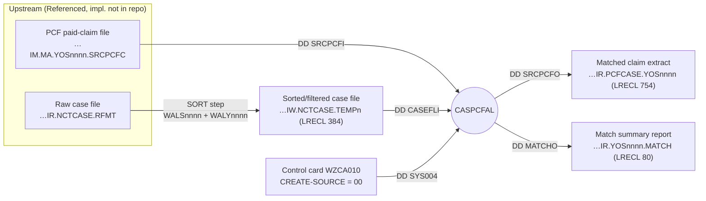
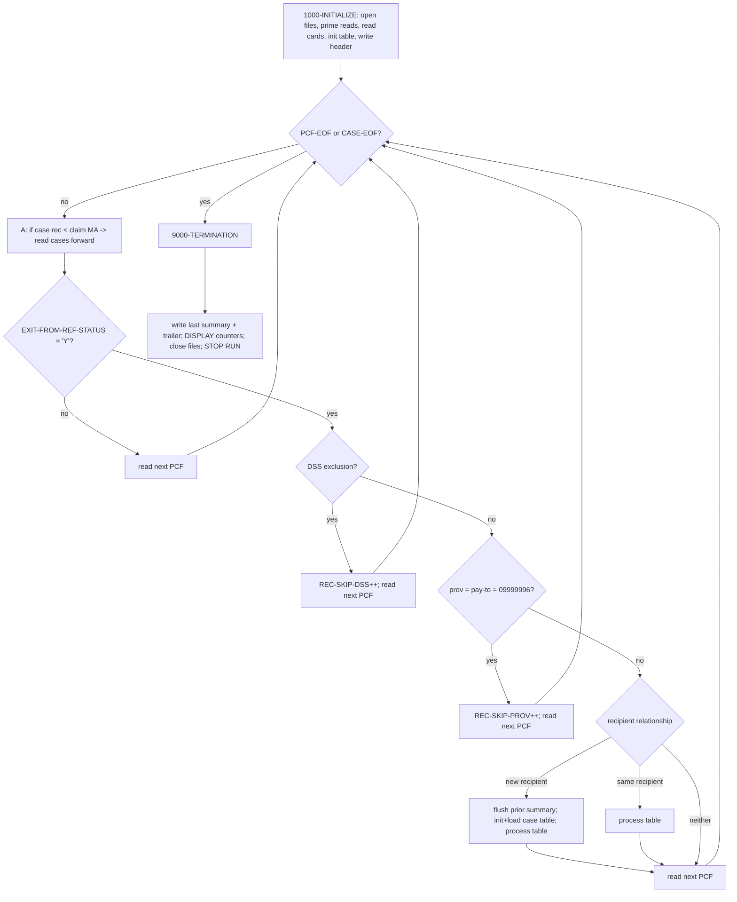

# CASPCFAL — Program Logic Documentation

> **Source of truth:** COBOL program `CASPCFAL.txt` (PROGRAM-ID `CASPCFAL`) and its dependent
> copybooks, control card, and JCL, all taken from branch `Job-details` of this repository.
> This document is **strictly source-based**. Every statement is tied to evidence in the source.
> Where something cannot be proven from the available source it is explicitly marked
> **Not proven from source**, **Inferred from structure/usage**, **Open question**, or
> **Referenced but implementation not available**.

---

# 1. Analysis Method

## 1.1 Artifacts inspected

| Artifact | File | Role in analysis | Evidence |
|---|---|---|---|
| Main program | `CASPCFAL.txt` | The analyzed COBOL program | `PROGRAM-ID. CASPCFAL.` (line 2) |
| Case layout copybook | `NCTCASE.txt` | Layout of case input record **and** in-memory case table | `COPY NCTCASE REPLACING ==(PREFIX)== BY ==CASET==` (l.97) and `==CASE==` (l.153) |
| PCF prefix copybook | `TPLPREFX.txt` | 127-byte prefix of the incoming paid-claim (PCF) record; holds the match keys | `COPY TPLPREFX REPLACING ==(PFX)== BY ==PFX==` (l.106) |
| Input claim copybook | `FDPCF602.txt` | 600-byte HMS claim area of the **input** record | `COPY FDPCF602 REPLACING ==(PREFIX)== BY ==CLMI==` (l.109) |
| Output claim copybook | `FDPCF601.txt` | 616-byte HMS claim area of the **output** record (ICD-10 widened) | `COPY FDPCF601 REPLACING ==(PREFIX)== BY ==CLM==` (l.166) |
| Output prefix copybook | `CLMPREFX.txt` | 140-byte prefix of the output record | `COPY CLMPREFX REPLACING ==(PREFIX)== BY ==PRO==` (l.160) |
| Client-side copybooks | `FDALINH5/4/3.txt`, `FDALPHY5/4/3.txt`, `FDALRXR5/4/3.txt` | Alabama Institutional / Physician / Pharmacy layouts, versions 5,4,3 | `COPY FDALINH5 … ==AL5==` (l.116) etc. |
| Control card | `WZCA010.txt` | Supplies the `CREATE-SOURCE` value read on DD `SYS004` | JCL `//SYS004 DD DSN=P.HMSY.CARD.CNTL(WZCA010)` (`PWTALY05.txt`) |
| JCL (driver jobs) | `PWTALY05.txt` … `PWTALY17.txt` | Run `PGM=CASPCFAL`; give DD→dataset mapping | `//EXEC0020 EXEC PGM=CASPCFAL` (`PWTALY05.txt` l.57) |
| Sort/select cards | `WALS0500.txt`…`WALS1700.txt`, `WALY0500.txt` | Pre-sort/filter the case file for each year-of-service run | `//SYSIN DD …(WALS0500)` in the SORT step |

## 1.2 How logic was traced
- The `PROCEDURE DIVISION` was read top-to-bottom starting at `0000-MAIN` (l.282) and every
  `PERFORM … THRU …` target paragraph was followed.
- Every `COPY … REPLACING` was expanded manually by substituting the prefix token, so that
  program references such as `CLMI-…`, `CLM-…`, `PRO-…`, `PFX-…`, `CASE-…`, `CASET-…`,
  `AL5-…/AL4-…/AL3-…` were resolved back to their copybook field definitions.
- Record lengths were confirmed against the `FD` clauses, the copybook lengths, and the JCL
  `DCB=(…,LRECL=…)` values. COMP-3 field lengths were computed as `CEIL((digits+1)/2)`.
- Control-card meaning was confirmed by reading `WZCA010.txt` and mapping its columns onto the
  `CARD-REC` layout (l.179–184).

## 1.3 How "proven" vs "inferred" was handled
- **Proven** = directly present in code, copybook, control card, or JCL (quoted).
- **Inferred from structure/usage** = a conclusion that necessarily follows from proven facts
  (e.g., arithmetic on record lengths) but is not stated verbatim.
- **Not proven / Open question** = plausible but unconfirmed by the supplied artifacts.
- Naming conventions (e.g., "MAMA", "DSS") are **not** treated as facts unless code confirms behavior.

## 1.4 Limitations
- The upstream jobs that **build** the PCF input file (`…IM.MA.YOS2005.SRCPCFC`) and the raw case
  file (`…IR.NCTCASE.RFMT`) are **Referenced but implementation not available** in this repo
  (JCL comments mention `CASNCTC1`/`CASNCTC0`, which are separate programs).
- The program contains **no `CALL`** statements; there are no external subprograms to trace.
- EBCDIC-specific literal `X'96'` is interpreted only where code compares against it (see §7.5).

---

# 2. Program Overview

## 2.1 Purpose (Proven)
`CASPCFAL` **extracts PCF (Paid Claim File) claim data based on case data**. This is stated in the
program abstract:

```
* THIS PROGRAM EXTRACTS PCF CLAIM DATA BASED ON
* CASE DATA FROM CAS2000 SYSTEM           (CASPCFAL.txt l.9–10)
```

Behaviorally (proven by the procedure code), the program is a **sequential match/merge** of two
inputs that are ordered by Medicaid recipient number:
- an incoming **paid-claim file** (PCF) — DD `SRCPCFI`, and
- a **case file** — DD `CASEFLI`,

and for every paid claim whose recipient/date qualifies against an **open** case, it writes a
reformatted claim record to the output extract (DD `SRCPCFO`) and accumulates a per-case match
summary report (DD `MATCHO`).

## 2.2 Technical role (Proven)
- Batch program. `PROCEDURE DIVISION` performs `1000-INITIALIZE`, then loops `2000-MAINLINE`
  `UNTIL PCF-EOF OR CASE-EOF`, then `9000-TERMINATION`, then `STOP RUN` (l.284–289).
- Invocation style: **batch step / main program**, invoked from JCL as `EXEC PGM=CASPCFAL`
  (`PWTALY05.txt` l.57). No linkage section exists, so it is **not** a called subprogram.

## 2.3 Business role
- **Proven from copybook comment:** the claim prefix copybook is titled
  `H M S   T P L   P R E F I X` (`TPLPREFX.txt` l.2). **TPL = Third-Party Liability** context.
- **Proven from copybook comments:** the client-side records are `ALABAMA CLAIMS FILE`
  Institutional/Physician/Pharmacy (`FDALINH5.txt` l.2, `FDALPHY5.txt` l.2, `FDALRXR5.txt` l.2).
- **Inferred from structure/usage:** the case file carries lien/settlement fields
  (`…-LIEN-MEDICAID-AMT`, `…-SETTLEMENT-AMT`, `…-INCIDENT-DATE`, `…-CLAIMS-THRU-DATE` in
  `NCTCASE.txt`), consistent with **casualty/estate/TPL recovery case tracking**. The precise
  business program name is **not stated** → **Open question**.

## 2.4 Upstream / downstream dependencies



**Proven** from `PWTALY05.txt` (STEP0010 sorts the case file with `WALS0500`/`WALY0500`; STEP0020
runs `CASPCFAL`). **Inferred:** the PCF file is pre-sorted by recipient number upstream (the match
logic requires it — see §5), but the sort of the PCF file is **not** present in the supplied JCL.

---

# 3. Inputs, Outputs, and Dependencies

## 3.1 Files (`SELECT` / `FD`) — Proven

| Logical name | DD (ASSIGN) | FD organisation | Record length | Direction | Dataset (from `PWTALY05.txt`) |
|---|---|---|---|---|---|
| `SRCPCF-IN` | `SRCPCFI` | `RECORD IS VARYING 4–32752 DEPENDING ON PCF-DEP`, `RECORDING MODE S` (l.43–45) | up to 32752 | Input (paid claims) | `…IM.MA.YOS2005.SRCPCFC(0)` |
| `CASEFL-IN` | `CASEFLI` | `RECORDING MODE F` (l.53) | 384 (`CASE-RECORD PIC X(384)`, l.56) | Input (cases) | `…IW.NCTCASE.TEMP5`, `DCB … LRECL=384` |
| `SRCPCF-OUT` | `SRCPCFO` | `RECORDING MODE F` (l.61) | 754 (`CLMO-RECORD PIC X(754)`, l.64) | Output (matched claims) | `…IR.PCFCASE.YOS2005(+1)`, `DCB … LRECL=754` |
| `CASE-PCF-MATCH` | `MATCHO` | `RECORDING MODE F` (l.69) | 80 (`MATCH-RECORD PIC X(80)`, l.72) | Output (report) | `…IR.YOS2005.MATCH`, `DCB … LRECL=80` |
| `CNTL-CARDS` | `SYS004` | `RECORD CONTAINS 80`, `RECORDING MODE F` (l.35–39) | 80 (`CNTL-REC PIC X(80)`) | Input (control) | `P.HMSY.CARD.CNTL(WZCA010)` |

> **Note (Proven):** `PCF-DEP` (the `DEPENDING ON` field) is initialised to `32752`
> (`PCF-DEP PIC 9(05) VALUE 32752`, l.207); a commented alternative value `4400` exists (l.208).

## 3.2 Copybooks — Proven

| Copybook | Prefix used | What it defines |
|---|---|---|
| `NCTCASE` | `CASET-` (table), `CASE-` (input rec) | 384-byte case record layout |
| `TPLPREFX` | `PFX-` | 127-byte PCF system/netting/application prefix (match keys) |
| `FDPCF602` | `CLMI-` | 600-byte input HMS claim area |
| `FDPCF601` | `CLM-` | 616-byte output HMS claim area (ICD-10 widened) |
| `CLMPREFX` | `PRO-` | 140-byte output prefix |
| `FDALINH5/4/3` | `AL5-/AL4-/AL3-` | Institutional (UB) client layouts by version |
| `FDALPHY5/4/3` | `AL5-/AL4-/AL3-` | Physician client layouts by version |
| `FDALRXR5/4/3` | `AL5-/AL4-/AL3-` | Pharmacy client layouts by version |

## 3.3 Linkage structures
- **None.** There is no `LINKAGE SECTION` and no `PROCEDURE DIVISION USING` (Proven by absence).

## 3.4 Called programs
- **None.** No `CALL` statement exists in `CASPCFAL.txt` (Proven by absence).

## 3.5 Control-card / profile dependency — Proven
The control card is read from DD `SYS004` (`CNTL-CARDS`) in `1650-READ-CARDS` (l.342–353). Layout
`CARD-REC` (l.179–184):

| Field | PIC | Columns | Meaning |
|---|---|---|---|
| `CARD-TAG` | `X(01)` | 1 | Card selector; only `'1'` is honoured |
| `FILLER` | `X(02)` | 2–3 | — |
| `CARD-COMMENT` | `X(30)` | 4–33 | Free text |
| `FILLER` | `X(01)` | 34 | — |
| `CARD-DATA` | `X(02)` | 35–36 | Value consumed by the program |

Behaviour (Proven, l.348–350): when `CARD-TAG = '1'`, the program `DISPLAY`s the card and moves
`CARD-DATA(1:2)` into `WS-SAVE-CREATE-SOURCE`. Content of `WZCA010.txt`:

```
****************************************************************
***   ACCEPTABLE VALUES FOR CLAIM SOURCE ARE:                 **
***      00 =  TPL MEDICAID                                   **
***      01 =  CO DSS                                         **
***      02 =  CA OTHER 35                                    **
1. ENTER VALUE FOR CREATE-SOURCE: 00;                         **
```

So `WS-SAVE-CREATE-SOURCE = '00'` for this card, later written into `PRO-CREATE-SOURCE`
(l.472–473). The mapping `00=TPL MEDICAID / 01=CO DSS / 02=CA OTHER 35` is **documented in the
card comment** (Proven from `WZCA010.txt`); the program itself does **not** enforce those values.

## 3.6 Important status codes / flags — Proven

| Flag / 88-level | Definition | Set when |
|---|---|---|
| `PCF-EOF` (88 of `WS-PCF-EOF-SW`) | `VALUE 'Y'` (l.201) | `SRCPCF-IN` at end (l.320) |
| `CASE-EOF` (88 of `WS-CASE-EOF-SW`) | `VALUE 'Y'` (l.203) | `CASEFL-IN` at end (l.331) |
| `END-OF-CARDS` (88 of `EOC-SWITCH`) | `VALUE 'Y'` (l.199) | control card EOF (l.344) |
| `RECIPIENT-END` (88 of `WS-RECIPIENT-SW`) | `VALUE 'Y'` (l.205) | end of a recipient's case group (l.447) |
| `SIZE-OK` / `SIZE-ERROR` (88 of `WS-SIZE-ERROR-FLAG`) | `'N'` / `'Y'` (l.275–276) | ADD overflow on match counters (l.662, l.665) |

> **Note:** the program does **not** declare `FILE STATUS` fields for any file; end-of-file is
> handled only through the `AT END` clauses (see §7).

---

# 4. Data Structures and Important Fields

## 4.1 Case record / case table — `NCTCASE` (Proven)
Read into `WS-CASE-RECORD` (prefix `CASE-`, l.152) and buffered into `WS-CASE-TABLE` (prefix
`CASET-`, `OCCURS 30 TIMES`, l.95–98). One extra byte is appended to each **table** entry:

```
01  NCTCASE.
    03  WS-CASE-TABLE   OCCURS 30 TIMES.
    COPY NCTCASE REPLACING ==(PREFIX)== BY ==CASET==.
        05  CASE-PCF-MATCH-FLAG     PIC X(01).          (l.95–98)
```

Fields that drive behaviour:

| Field (table = `CASET-`) | PIC | Role in logic |
|---|---|---|
| `…-HMS-CLIENT-ID` | `X(06)` | Copied to `PRO-CLIENT-ID` (l.466) |
| `…-HMS-CASE-KEY` | `9(09)` | Copied to `PRO-HMS-CASE-KEY` (l.464) |
| `…-RECIPIENT-ID-NUM` | `X(20)` | **Match key** vs `PFX-APP-MEDICAID-NO`; also to `WS-CASE-ID` (l.660) |
| `…-CASE-STATUS-CODE` | `X(01)` | **Open-case test** = `'O'` or `X'96'` (l.335, l.457–458) |
| `…-INCIDENT-DATE` | `X(10)` | Lower bound of match date window (l.729–735) |
| `…-CLAIMS-THRU-DATE` | `X(10)` | Upper bound of match date window (l.737–743) |
| `CASE-PCF-MATCH-FLAG` | `X(01)` | Per-case "already matched" switch (l.441, 468–470) |

> Full 384-byte field list is in the input/output mapping document.

## 4.2 PCF prefix — `TPLPREFX` (prefix `PFX-`) (Proven)

| Field | PIC | Role |
|---|---|---|
| `PFX-SYS-HMS-ASSIGN-FILE` | `X(05)` | `(1:4)='MAMA'` gate for client-side processing (l.686) |
| `PFX-SYS-VERSION` | `X(02)` | Selects client layout version 05/04/03/02/01 (l.687–719) |
| `PFX-SYS-EXIT-FROM-REF-STATUS` | `X(01)` | Must be `'Y'` to keep a claim (l.372) |
| `PFX-NET-CLAIM-TRANS-TYPE` | `X(01)` | Copied to `PRO-CLAIM-TRANS-TYPE` (l.480); has 88s incl. `PAID/VOID/ADJUSTMENT/DENIAL/…` |
| `PFX-APP-MEDICAID-NO` | `X(20)` | **Primary match key** (recipient number) |
| `PFX-APP-DATE-OF-SERVICE` | `9(08) COMP-3` | Date compared to case window (l.460–461); to `PRO-CLM-FROM-DATE` (l.478) |
| `PFX-SORT-KEY` | group | `APP-MEDICAID-NO` + `APP-PROVIDER-NO` + `APP-DATE-OF-SERVICE` |

## 4.3 Input vs output claim area — `FDPCF602` (`CLMI-`) vs `FDPCF601` (`CLM-`) (Proven)
Structurally the two copybooks are the same field sequence; the **output** copybook widens the
ICD-related fields and adds two trailing fields (chg 015/016):

| Field | Input `FDPCF602` | Output `FDPCF601` |
|---|---|---|
| `…-PROCEDURE-CODE-5` / `-7` | `X(05)` | `X(07)` (renamed `-7`) |
| `…-PRI-DX`, `-SEC-DX`, `-DX-3/4/5` | `X(05)` | `X(07)` |
| `…-CDE-ICD-VERSION` | *(absent)* | `X(02)` (new) |
| `…-AGENCY-CD` | *(absent)* | `X(02)` (new) |
| Computed length | **600** | **616** |

Claim-driving fields:

| Field | PIC | Role |
|---|---|---|
| `CLMI-PCF-CONTRACT-NUM` | `X(07)` | `'0032600'` used in DSS-skip (l.377) and ICN-suffix (l.628) and provider-swap (l.485) |
| `CLMI-PM-USER-AREA` | `X(40)` | `(27:3)` tested for `'DSS'`; `(1:2)` tested for `'PB'/'DT'` (l.378, 626–629) |
| `CLMI-CLAIM-FROM-DOS` | `9(06) COMP-3` | DSS-skip date range test (l.384–385) |
| `CLMI-PROV-OF-SVC-NUM` | `X(15)` | `'09999996'` dummy-provider skip (l.391) and provider-swap (l.484) |
| `CLMI-PAY-TO-PROV-NUM` | `X(15)` | `'09999996'` dummy-provider skip (l.392); swapped into svc-num (l.486) |
| `CLMI-TOT-MA-PAID-HDR` | `S9(7)V99 COMP-3` | Added to `WS-TOT-PCF-MA-PAID` per match (l.664) |
| `CLMI-PCF-HMS-ICN-SUFFIX(-N)` | `X(02)` / `9(02)` | ICN reformat suffix (l.630–640) |
| `CLMI-ICN` | `X(20)` | Base ICN; to `PRO-ICN`/`CLM-ICN` |

## 4.4 Output prefix — `CLMPREFX` (prefix `PRO-`) (Proven)

| Field | PIC | Populated from |
|---|---|---|
| `PRO-RECIPIENT-ID-NUM` | `X(20)` | `CLMI-PCF-MA-NUM` (l.463) |
| `PRO-HMS-CASE-KEY` | `9(09)` | `CASET-HMS-CASE-KEY(SUB-I)` (l.464) |
| `PRO-CLIENT-ID` | `X(06)` | `CASET-HMS-CLIENT-ID(SUB-I)` (l.466, chg 0012) |
| `PRO-ICN` / `PRO-FORMER-ICN` | `X(20)` | `CLMI-ICN` / `CLMI-FORMER-ICN` (l.474–475) |
| `PRO-XACTION-STATUS` | `X(01)` | `CLMI-XACTION-STATUS` (l.476) |
| `PRO-CLM-FROM-DATE` | `9(08)` | `PFX-APP-DATE-OF-SERVICE` (l.478) |
| `PRO-CLAIM-TRANS-TYPE` | `X(01)` | `PFX-NET-CLAIM-TRANS-TYPE` (l.480) |
| `PRO-INCIDENT-DATE` | `9(08)` | `WS-INCIDENT-DATE` (l.482) |
| `PRO-CLM-THRU-DATE` | `9(08)` | `WS-CLM-THRU-DATE` (l.483) |
| `PRO-CREATE-SOURCE` | `X(02)` | `WS-SAVE-CREATE-SOURCE` (control card) (l.472) |

## 4.5 Client-side layouts — `FDALINH/PHY/RXR` (Proven)
Fields the program actually reads (all versions 3/4/5 expose the same names; lengths differ):

| Field (version prefix `ALx-`) | PIC | Used in |
|---|---|---|
| `…-INST-CLAIM-TYPE-ALPHA` | `X(01)` | `EVALUATE` in 5100/5200/5300 (l.751, 876, 1001) |
| `…-INST-HDR-DIAG … -INST-DIAG` | `X(07)` | Diagnosis extraction (occurs 14; program reads 1–5) |
| `…-INST-CDE-ICD-VERSION` | `X(01)` | ICD version per diagnosis |
| `…-INST-HDR-SURG-CD` | `X(07)` | Surgical/procedure code (occurs 5; program reads 1) |
| `…-PHYS-CLAIM-TYPE-ALPHA` | `X(01)` | Physician branch (`'M'/'B'`) |
| `…-PHYS-DIAG`, `…-PHYS-CDE-ICD-VERSION` | `X(07)`/`X(01)` | Physician diagnosis extraction |
| `…-RX-CLAIM-TYPE-ALPHA` | `X(01)` | Pharmacy branch (`'P'/'Q'`) — count only |

## 4.6 Counters and switches — Proven
`WS-COUNTERS` (l.210–233) holds record and version tallies used only for the end-of-job `DISPLAY`
report:

| Counter | Meaning (from its `DISPLAY` text in 9000) |
|---|---|
| `PCF-REC-READ-CTR` | PCF records read (l.323) |
| `CASE-REC-READ-CTR` | Case records read (l.334) |
| `REC-SKIP-PROV` | Skipped, provider `09999996` (l.393) |
| `REC-SKIP-DSS` | Skipped DSS > 2003 (l.386) |
| `REC-WRITE-CTR` | PCF records matched & written (l.644) |
| `TABLE-ENTRIES` | # case rows loaded for current recipient (l.445) |
| `VER-5/4/3-INST-ILOAC`, `-PROC-CD`, `-PROF-MB`, `-RX-PQ` | per-version processing tallies |
| `VER-2`, `VER-1`, `OTHER-VERS` | version 02 / 01 / other tallies |
| `OPEN-CASES-READ-CTR`, `OPEN-CASES-MATCH-OK-CTR`, `OPEN-CASES-NO-MATCH-CTR` | open-case audit counters (l.256–259) |

Match accumulators (`WS-CASE-PCF-MATCH`, l.262–265): `WS-CASE-ID X(20)`,
`WS-TOT-PCF-REC-MATCH S9(5) COMP-3`, `WS-TOT-PCF-MA-PAID S9(11)V99 COMP-3`.

---

# 5. Processing Logic

## 5.1 Top-level control — `0000-MAIN` (Proven, l.282–290)
```
PERFORM 1000-INITIALIZE   THRU 1000-INITIALIZE-EXIT
PERFORM 2000-MAINLINE     THRU 2000-MAINLINE-EXIT
        UNTIL PCF-EOF  OR  CASE-EOF          (OR CASE-EOF added by chg 0013)
PERFORM 9000-TERMINATION  THRU 9000-TERMINATION-EXIT
STOP RUN
```

## 5.2 Initialization — `1000-INITIALIZE` (Proven, l.294–313)
1. `OPEN` inputs `SRCPCF-IN`, `CASEFL-IN`, `CNTL-CARDS`; outputs `SRCPCF-OUT`, `CASE-PCF-MATCH`.
2. `INITIALIZE WS-COUNTERS`.
3. Prime read one PCF record (`1500-READ-SRCPCF-IN`) and one case record (`1600-READ-CASEFL-IN`).
4. Read **all** control cards until `END-OF-CARDS` (`1650-READ-CARDS`), capturing `CREATE-SOURCE`.
5. `INITIALIZE` all 30 table entries (`3000-INITIALIZE-TABLE`, VARYING 1..30).
6. Write the two-line match-report header (`1700-WRITE-MATCH-HEADER`).

### Read paragraphs
- `1500-READ-SRCPCF-IN` (l.317–324): `READ … INTO WS-CLMI-RECORD`; `AT END SET PCF-EOF`; else
  `ADD 1 TO PCF-REC-READ-CTR`.
- `1600-READ-CASEFL-IN` (l.328–338): `READ … INTO WS-CASE-RECORD`; `AT END SET CASE-EOF`; else
  `ADD 1 TO CASE-REC-READ-CTR`, and **if** `CASE-CASE-STATUS-CODE = 'O' OR X'96'` then
  `ADD 1 TO OPEN-CASES-READ-CTR` (chg 0004).
- `1650-READ-CARDS` (l.342–353): reads a card; `AT END` sets `EOC-SWITCH='Y'` and `CLOSE`s the file;
  when `CARD-TAG='1'`, `DISPLAY`s it and stores `CARD-DATA(1:2)` → `WS-SAVE-CREATE-SOURCE`.

## 5.3 Main match loop — `2000-MAINLINE` (Proven, l.363–427)
Executed once per PCF record until `PCF-EOF OR CASE-EOF`. Steps in order:

**Step A — catch the case file up to the claim (l.365–368):**
```
IF CASE-RECIPIENT-ID-NUM < PFX-APP-MEDICAID-NO
   PERFORM 1600-READ-CASEFL-IN
      UNTIL CASE-RECIPIENT-ID-NUM >= PFX-APP-MEDICAID-NO OR CASE-EOF
```

**Step B — status filter (l.372–375):**
```
IF (PFX-SYS-EXIT-FROM-REF-STATUS NOT = 'Y')
   PERFORM 1500-READ-SRCPCF-IN
   GO TO 2000-MAINLINE-EXIT
```
*(the `OR PFX-NET-CLAIM-TRANS-TYPE = 'D'` alternative on l.373 is commented out.)*

**Step C — DSS exclusion (l.377–389):**
```
IF CLMI-PCF-CONTRACT-NUM = '0032600' AND CLMI-PM-USER-AREA(27:3) = 'DSS'
   AND CLMI-CLAIM-FROM-DOS > 0040000 AND CLMI-CLAIM-FROM-DOS < 0900000
   ADD 1 TO REC-SKIP-DSS ; read next PCF ; GO TO exit
```
The source comment (l.379–383) explains the `0YYMMDD` date format and that this excludes DOS
years 2004+ while including 1990–2002.

**Step D — dummy-provider exclusion (l.391–396):**
```
IF CLMI-PROV-OF-SVC-NUM = '09999996' AND CLMI-PAY-TO-PROV-NUM = '09999996'
   ADD 1 TO REC-SKIP-PROV ; read next PCF ; GO TO exit
```

**Step E — recipient matching (l.398–424):**
```
IF   CASE-RECIPIENT-ID-NUM = PFX-APP-MEDICAID-NO
AND  CASET-RECIPIENT-ID-NUM(1) < PFX-APP-MEDICAID-NO      *> new recipient
     IF WS-TOT-PCF-REC-MATCH > 0 OR SIZE-ERROR
        PERFORM 2100-WRITE-CASE-PCF-MATCH                 *> flush prior case summary
     END-IF
     PERFORM 3000-INITIALIZE-TABLE (1..30)
     MOVE 'N' TO WS-RECIPIENT-SW
     PERFORM 3010-LOAD-CASE-TABLE  VARYING SUB-I ... UNTIL RECIPIENT-END
     PERFORM 3020-READ-CASE-TABLE  VARYING SUB-I ... UNTIL SUB-I > TABLE-ENTRIES
ELSE
IF   CASE-RECIPIENT-ID-NUM >= PFX-APP-MEDICAID-NO
AND  CASET-RECIPIENT-ID-NUM(1) = PFX-APP-MEDICAID-NO      *> same recipient already buffered
     PERFORM 3020-READ-CASE-TABLE  VARYING SUB-I ... UNTIL SUB-I > TABLE-ENTRIES
```
**Step F — advance to the next claim (l.426):** `PERFORM 1500-READ-SRCPCF-IN`.

> **Interpretation (Inferred from usage):** Step E buffers all consecutive case rows that share the
> claim's recipient number into `WS-CASE-TABLE`, then evaluates *each* buffered case against the
> current claim. Because `3010` reads one row **past** the group, `CASET-…(1)` holds the buffered
> recipient while `CASE-…` holds the look-ahead row; the two branches distinguish "first claim for
> this recipient" (load then process) from "subsequent claims for the same recipient" (process only).

### Case-table build — `3010-LOAD-CASE-TABLE` (Proven, l.438–450)
```
MOVE WS-CASE-RECORD TO WS-CASE-TABLE(SUB-I)
MOVE 'N'            TO CASE-PCF-MATCH-FLAG(SUB-I)
PERFORM 1600-READ-CASEFL-IN
IF CASE-RECIPIENT-ID-NUM > CASET-RECIPIENT-ID-NUM(SUB-I) OR CASE-EOF
   MOVE SUB-I TO TABLE-ENTRIES
   MOVE 'Y'   TO WS-RECIPIENT-SW      *> RECIPIENT-END
```

### Per-case evaluation — `3020-READ-CASE-TABLE` (Proven, l.452–670)
For each buffered entry `SUB-I`:
1. `PERFORM 4000-FORMAT-DATE` to build the comparison window from that case.
2. **Open-case gate:** `IF CASET-CASE-STATUS-CODE(SUB-I) = 'O' OR = X'96'`.
3. **Date-window gate:**
   `IF PFX-APP-DATE-OF-SERVICE >= WS-INCIDENT-DATE-NEW-RE`
   `AND PFX-APP-DATE-OF-SERVICE <= WS-CLM-THRU-DATE-N`.
4. When both gates pass (a **match**):
   - `INITIALIZE PRO-CLMPRFX`; populate `PRO-…` prefix fields (l.462–483).
   - **First-time match bookkeeping** (chg 0004, l.468–471): if `CASE-PCF-MATCH-FLAG(SUB-I)='N'`
     then `ADD 1 TO OPEN-CASES-MATCH-OK-CTR` and set the flag to `'Y'`.
   - `MOVE WS-SAVE-CREATE-SOURCE TO PRO-CREATE-SOURCE`.
   - **Provider swap** (chg 0009, l.484–488): if `CLMI-PROV-OF-SVC-NUM='09999996'` AND
     `CLMI-PCF-CONTRACT-NUM='0032600'`, move `CLMI-PAY-TO-PROV-NUM` into `CLMI-PROV-OF-SVC-NUM`.
   - Field-by-field `MOVE CLMI-… TO CLM-…` copying the whole HMS claim area (l.492–624).
   - **ICN suffix reformat** (chg 0008, l.626–643): see §6 rule R-08.
   - `ADD 1 TO REC-WRITE-CTR`; `PERFORM 3030-REVIEW-MAMA-VERS`.
   - **ICD version finalisation** (l.646–653): `EVALUATE TRUE` — if `CLM-CDE-ICD-VERSION = '0 '`
     or `' 0'` → `'10'`; `WHEN OTHER` → `'9'`.
   - `WRITE CLMO-RECORD FROM WS-SRCPCF-OUT` (l.655).
   - `MOVE '9' TO CLM-CDE-ICD-VERSION` (reset, l.657).
   - **Match accumulation** (l.659–666): if `SIZE-OK`, set `WS-CASE-ID = CASET-RECIPIENT-ID-NUM(1)`,
     `ADD 1 TO WS-TOT-PCF-REC-MATCH` and `ADD CLMI-TOT-MA-PAID-HDR TO WS-TOT-PCF-MA-PAID`, each with
     `ON SIZE ERROR SET SIZE-ERROR TO TRUE`.

### Date window build — `4000-FORMAT-DATE` (Proven, l.725–746)
- `INITIALIZE WS-COMPARE-DATES` (zeros).
- If `CASET-INCIDENT-DATE(SUB-I) NOT = SPACES`: `UNSTRING … DELIMITED BY '-' OR '  '` INTO
  `WS-IN-YYYY`, `WS-IN-MM` **(only two receivers — the day is not parsed)**.
- `MOVE WS-INCIDENT-DATE-N TO WS-INCIDENT-DATE-NEW`; `MOVE 01 TO WS-IN-NEW-DD` (chg 0001) →
  effective lower bound `WS-INCIDENT-DATE-NEW-RE = YYYYMM01`.
- If `CASET-CLAIMS-THRU-DATE(SUB-I) NOT = SPACES`: `UNSTRING …` INTO `WS-THRU-YYYY/MM/DD`;
  `ELSE MOVE '99999999' TO WS-CLM-THRU-DATE` (open-ended upper bound).

### Version dispatch — `3030-REVIEW-MAMA-VERS` (Proven, l.675–723)
```
INITIALIZE INST-REC5 PROF-REC5 RX-REC5 INST-REC4 … INST-REC3 …
IF PFX-SYS-HMS-ASSIGN-FILE(1:4) = 'MAMA'
   EVALUATE TRUE
     WHEN PFX-SYS-VERSION = '05' → move CLMI-CLIENT-DATA to *REC5 ; PERFORM 5100
     WHEN '04' → *REC4 ; PERFORM 5200
     WHEN '03' → *REC3 ; PERFORM 5300
     WHEN '02' → PERFORM 5400          *> ICD-10 segments NOT created (l.1124)
     WHEN '01' → PERFORM 5500          *> ICD-10 segments NOT created (l.1198)
     WHEN OTHER → PERFORM 5600
```
If the assign file is **not** `MAMA`, none of 5100–5600 run and no client-side diagnosis/procedure
overrides are applied (Proven by the enclosing `IF`).

### Client extraction — `5100/5200/5300-PROCESS-RECS` (Proven, l.748–1121)
Identical logic per version (v5/v4/v3), keyed on the claim-type-alpha:

| Claim-type-alpha | Path | Action |
|---|---|---|
| `'I' 'L' 'O' 'A' 'C'` | Institutional | Loop occurrences 1–5 of `…-INST-DIAG`/`…-INST-CDE-ICD-VERSION`; for each non-blank, move diag to `CLM-PRI-DX`/`CLM-SEC-DX`/`CLM-DX-3`/`CLM-DX-4`/`CLM-DX-5` and the version to `CLM-CDE-ICD-VERSION`; tally `VER-x-INST-ILOAC`. Then loop occurrence 1 of `…-INST-HDR-SURG-CD` → `CLM-PROCEDURE-CODE-7`; tally `VER-x-PROC-CD`. |
| `'M' 'B'` | Physician | Loop occurrences 1–5 of `…-PHYS-DIAG`/`…-PHYS-CDE-ICD-VERSION` → same `CLM-*-DX` fields; tally `VER-x-PROF-MB`. |
| `'P' 'Q'` | Pharmacy | `ADD +1 TO VER-x-RX-PQ` only (no diagnosis; comment l.676: "RX RECORDS DO NOT HAVE DIAGNOSIS CODES"). |
| other | — | `CONTINUE` (no change). |

`5400-PROCESS-RECS` (v02) only `ADD +1 TO VER-2` (the extraction body is commented out, l.1126–1192).
`5500-PROCESS-RECS` (v01) only `ADD +1 TO VER-1`. `5600-PROCESS-RECS` only `ADD +1 TO OTHER-VERS`.

## 5.4 Per-case summary — `2100-WRITE-CASE-PCF-MATCH` (Proven, l.1213–1240)
- `MOVE WS-CASE-ID TO MATCH-CASE-ID-OUT`.
- If `SIZE-OK`: edit `WS-TOT-PCF-REC-MATCH` (via `WS-CONVERT-MATCH`) and `WS-TOT-PCF-MA-PAID`
  (via `WS-CONVERT-PCF-PAID`, `$$$,$$$,$$$,$$9.99`) into the report line, left-trimmed using
  `INSPECT … TALLYING … FOR ALL SPACES`.
- Else (`SIZE-ERROR`): write `'TOO MANY MATCHES, $$ PAID NOT AVAILABLE !'` and reset `SIZE-OK`.
- `WRITE MATCH-RECORD`; then `INITIALIZE WS-CASE-PCF-MATCH WS-MATCH-PROCESS-FIELDS`.

## 5.5 Termination — `9000-TERMINATION` (Proven, l.1242–1351)
1. If `WS-TOT-PCF-REC-MATCH > 0 OR SIZE-ERROR`: `PERFORM 2100-WRITE-CASE-PCF-MATCH` (flush the last
   case — see the source comment l.1249–1251 explaining the last-recipient edge).
2. `PERFORM 9100-WRITE-MATCH-TRAILER`.
3. `COMPUTE OPEN-CASES-NO-MATCH-CTR = OPEN-CASES-READ-CTR − OPEN-CASES-MATCH-OK-CTR` (chg 0004).
4. `DISPLAY` the full counter block (l.1259–1343), including the notice that
   *"THE PROCESSING STOPS AT END OF PCF INPUT FILE"* and *"THE CASE FILE MAY NOT HAVE BEEN READ TO
   COMPLETION."* (chg 0004).
5. `CLOSE SRCPCF-IN CASEFL-IN SRCPCF-OUT CASE-PCF-MATCH`. *(`CNTL-CARDS` was already closed in 1650.)*

## 5.6 Report trailer — `9100-WRITE-MATCH-TRAILER` (Proven, l.1353–1364)
- If `REC-WRITE-CTR = 0`: write `'NO MATCHED PCF RECORDS FOUND'`.
- Write a blank line, then a line of all `'*'`.

## 5.7 Overall flow



---

# 6. Extracted Business Logic

> Rules are expressed in business terms and traced to code. "Claim" = one PCF input record;
> "case" = one case row; "recipient number" = Medicaid number.

| ID | Rule (business statement) | Evidence |
|---|---|---|
| **R-01** | The program processes claims and cases **in ascending recipient-number order**; when the current case is behind the current claim, it advances the case file until the case recipient ≥ claim recipient (or case EOF). | l.365–368 |
| **R-02** | **Only claims with `EXIT-FROM-REF-STATUS = 'Y'` are eligible.** Any other value causes the claim to be skipped (read next, no output). | l.372–375 |
| **R-03** | **DSS exclusion:** when the claim's contract number is `'0032600'`, the PM user area positions 27–29 = `'DSS'`, and the from-date-of-service is `> 0040000` and `< 0900000`, the claim is excluded and counted in `REC-SKIP-DSS`. (Per the code comment this excludes service years 2004+ and keeps 1990–2002.) | l.377–389 |
| **R-04** | **Dummy-provider exclusion:** when both `PROV-OF-SVC-NUM` and `PAY-TO-PROV-NUM` = `'09999996'`, the claim is excluded and counted in `REC-SKIP-PROV`. | l.391–396 |
| **R-05** | A claim **matches** a case only when the case **recipient number equals** the claim Medicaid number **and** the case status is **open** (`'O'` or `X'96'`). | l.398–421, l.457–458 |
| **R-06** | A matched, open case additionally requires the claim **date of service to fall within the case window**: `INCIDENT-DATE (year+month, day forced to 01) ≤ DATE-OF-SERVICE ≤ CLAIMS-THRU-DATE`; a blank claims-thru-date makes the window open-ended (`99999999`). | l.460–461, l.729–743 |
| **R-07** | **One claim can match several open cases** for the same recipient; every qualifying buffered case produces its own output record. | l.415–424 loop over `TABLE-ENTRIES`; `3020` writes per entry |
| **R-08** | **ICN reformat:** when the PM user area starts with `'PB'` or `'DT'`, contract = `'0032600'`, and PM user area 27–29 ≠ `'DSS'`, and the HMS ICN suffix is numeric and non-zero, the 17-char ICN is concatenated with the 2-char suffix to form a 19-char ICN written to both `PRO-ICN` and `CLM-ICN`. | l.626–643 |
| **R-09** | **Provider substitution on output:** when service provider = `'09999996'` and contract = `'0032600'`, the pay-to provider number replaces the service provider number before the claim area is copied. | l.484–488 |
| **R-10** | **Create-source stamping:** every output record is stamped with the `CREATE-SOURCE` value from the `SYS004` control card (`'00'` = TPL Medicaid in `WZCA010`). | l.472–473, `WZCA010.txt` |
| **R-11** | **Client-side diagnosis/procedure enrichment** happens only when the claim's assign file starts with `'MAMA'`; the specific client layout is chosen by `SYS-VERSION` (05/04/03 extract diagnoses & surgery code; 02/01/other are counted only). | l.686–720, l.748–1211 |
| **R-12** | **Diagnosis routing:** for institutional claim types `I/L/O/A/C` (and physician types `M/B`), up to five diagnoses map to `CLM-PRI-DX, CLM-SEC-DX, CLM-DX-3, CLM-DX-4, CLM-DX-5`; the institutional first surgery code maps to `CLM-PROCEDURE-CODE-7`. Pharmacy types `P/Q` carry no diagnosis. | l.751–868 (and 5200/5300) |
| **R-13** | **ICD version indicator:** on output, `CLM-CDE-ICD-VERSION` becomes `'10'` when the extracted version is `'0'` (`'0 '`/`' 0'`), otherwise `'9'`; it is reset to `'9'` after each write. | l.646–657 |
| **R-14** | **Per-case financial summary:** for each recipient/case, the program accumulates the count of matched claims and the sum of `TOT-MA-PAID-HDR`, and writes one summary line per case to `MATCHO`. | l.659–666, l.1213–1235 |
| **R-15** | **Overflow protection:** if the match count or paid-amount accumulator overflows, `SIZE-ERROR` is set and the summary line reports `'TOO MANY MATCHES, $$ PAID NOT AVAILABLE !'` instead of totals. | l.662, 665, 1230–1233 |
| **R-16** | **Open-case audit:** open cases read are counted; the first time each open case matches a claim it is counted as matched; not-matched = read − matched. | l.335–337, 468–471, 1255–1256 |
| **R-17** | **No-match reporting:** if no PCF record was written at all, the trailer line `'NO MATCHED PCF RECORDS FOUND'` is emitted. | l.1355–1358 |
| **R-18** | **Run termination:** the job stops at end of the PCF file **or** end of the case file, whichever comes first (so the case file may be read only partially). | l.286–287, 1263–1265 |

---

# 7. Error Handling and Edge Cases

## 7.1 File status handling (Proven)
- No `FILE STATUS` clauses are declared. End-of-file is detected solely through `AT END` on
  `READ` (`SET PCF-EOF` l.320, `SET CASE-EOF` l.331, control-card EOF l.344).
- **Open question:** there is **no** I/O error handling beyond `AT END`. A physical I/O error or a
  missing/mis-defined DD is **not** trapped in code and would abend under the runtime (Not proven
  from source what the runtime does).

## 7.2 Arithmetic overflow (Proven)
`ADD 1 TO WS-TOT-PCF-REC-MATCH … ON SIZE ERROR SET SIZE-ERROR` and the same for
`WS-TOT-PCF-MA-PAID` (l.659–666). `WS-TOT-PCF-REC-MATCH` is `S9(5) COMP-3` (max 99,999) and
`WS-TOT-PCF-MA-PAID` is `S9(11)V99`. On overflow the totals are suppressed in the report (R-15).

## 7.3 Missing / blank case dates (Proven)
`4000-FORMAT-DATE` guards each `UNSTRING` with `NOT = SPACES`; a blank claims-thru-date defaults to
`'99999999'` (open-ended). A blank incident-date leaves the initialised zeros, giving a lower bound
of `00000001` after the day is forced to `01` (Inferred from `INITIALIZE` + `MOVE 01`).

## 7.4 Table capacity (Open question / Edge)
`3010-LOAD-CASE-TABLE` is performed `VARYING SUB-I FROM 1 BY 1 UNTIL RECIPIENT-END` with **no upper
bound of 30**, while `WS-CASE-TABLE` is `OCCURS 30 TIMES`. If a single recipient owns **more than 30
case rows**, `SUB-I` would exceed the table bound. **Not proven safe from source** — no explicit
guard exists; behaviour then depends on runtime bounds checking. Flagged as a migration risk.

## 7.5 Status literal `X'96'` (Inferred)
Open-case status is tested as `'O' OR X'96'` (l.335, 457–458). In EBCDIC, `X'96'` is lower-case
`'o'`; thus the test accepts upper- and lower-case "o" for "open" (Inferred from EBCDIC encoding;
the code proves only the literal comparison).

## 7.6 Output length vs record length (Inferred)
`WS-SRCPCF-OUT` = `PRO-CLMPRFX (140)` + `CLM-HMS-601 (616)` = **756** bytes, but `CLMO-RECORD` and
the DD are **754** (`LRECL=754`). On `WRITE … FROM`, the trailing 2 bytes are truncated; those 2
bytes are `CLM-AGENCY-CD` (the last field of `FDPCF601`, chg 016), which the program never
populates. `CLM-CDE-ICD-VERSION` occupies output bytes 753–754 and **is** preserved. This is
**Inferred from length arithmetic**, not stated in code.

## 7.7 Claim skipped paths always re-read (Proven)
Every exclusion path (R-02/03/04) performs `1500-READ-SRCPCF-IN` and `GO TO 2000-MAINLINE-EXIT`,
guaranteeing forward progress and preventing an infinite loop on a skipped claim.

## 7.8 Restart / recovery
- **Not proven from source.** The JCL header comments mention `RESTART=STEPNAME.PROCSTEPNAME` only as
  a commented template (`PWTALY05.txt` l.2). The program keeps no checkpoint and holds no restart
  logic (Proven by absence). GDG generations (`(+1)`, `(0)`) provide dataset-level versioning
  (Proven from JCL) but that is JCL, not program logic.

---

# 8. Proven vs Inferred vs Unknown

## 8.1 Proven from source
- Program is a batch main program with no linkage and no `CALL` (l.22–290).
- Five files, their DD names, organisations and record lengths (§3.1), matched to JCL LRECLs.
- Match keys: `PFX-APP-MEDICAID-NO` vs `CASE/CASET-RECIPIENT-ID-NUM`; open-case status `'O'/X'96'`;
  date window from `INCIDENT-DATE`/`CLAIMS-THRU-DATE` (§5, §6).
- Exclusions R-02/03/04; enrichment R-08/09/11/12/13; summary/report R-14/15/17 (§6).
- Counter semantics from their own `DISPLAY` texts (§4.6, §5.5).
- Control-card consumption of `CARD-DATA(1:2)` → `CREATE-SOURCE` (§3.5).
- Copybook lengths: `TPLPREFX`=127, `NCTCASE`=384, `FDPCF602`=600, `FDPCF601`=616, `CLMPREFX`=140.

## 8.2 Inferred from structure/usage
- Both inputs are pre-sorted ascending by recipient number (required by the match loop; the case
  sort is proven via `WALS…`, the PCF sort is not in the supplied JCL).
- The case-table buffering builds "all cases for one recipient", so one claim can fan out to
  multiple output rows (R-07).
- Output record truncates the 2-byte `CLM-AGENCY-CD` (§7.6).
- `X'96'` = EBCDIC lower-case "o" (§7.5).
- Business domain is TPL / casualty-lien recovery (copybook titles + lien/settlement case fields).

## 8.3 Open questions / not proven
- The meaning of the literal `'MAMA'` (assign-file tag) and of `SYS-VERSION` values — the code uses
  them but does not define them.
- Whether a recipient can legitimately have > 30 case rows (table-overflow safety, §7.4).
- The full upstream build of the PCF and raw case files (`CASNCTC0/CASNCTC1` are referenced in JCL
  comments only — **Referenced but implementation not available**).
- Any downstream consumer of `…IR.PCFCASE.YOSnnnn` and `…IR.YOSnnnn.MATCH` (not in repo).
- Whether the commented-out logic (`OR NET-CLAIM-TRANS-TYPE='D'` at l.373; the `5400` v02 body;
  ICD-10 handling for v01/v02) was intentionally disabled — the code shows it disabled, intent is
  **not proven**.

---

*End of `CASPCFAL_NEW logic.md`. Companion documents: `CASPCFAL_NEW_illustrations.md` (dummy-data
scenarios) and `CASPCFAL_NEW_input_output_mapping.md` (field-level I/O mapping).*
