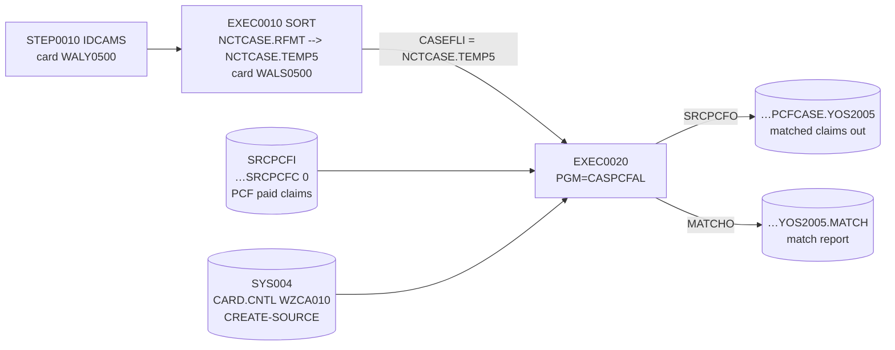
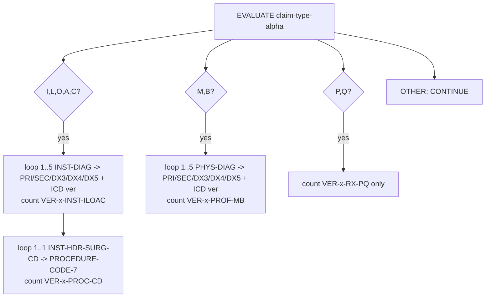
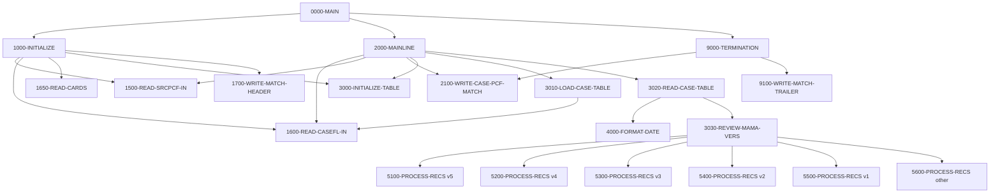

# CASPCFAL — Logic Documentation

> Source-based reverse-engineering documentation for the COBOL program **`CASPCFAL`**.
> Every statement below is tied to evidence in the analyzed source. Where something
> cannot be proven from source it is explicitly marked:
> **[Not proven from source]**, **[Open question]**, **[Inferred from structure/usage]**,
> or **[Referenced but implementation not available]**.

---

## 1. Analysis Method

### 1.1 Artifacts inspected

| Artifact | Type | How it was used in this analysis |
|---|---|---|
| `CASPCFAL.txt` | COBOL program (1366 lines) | Primary subject; all divisions read line-by-line |
| `NCTCASE.txt` | Copybook | Case record layout (used with prefixes `CASET` and `CASE`) |
| `TPLPREFX.txt` | Copybook | Claim input prefix (prefix `PFX`) |
| `FDPCF602.txt` | Copybook | Claim input body / "HMS 600" area (prefix `CLMI`) |
| `CLMPREFX.txt` | Copybook | Claim output prefix (prefix `PRO`) |
| `FDPCF601.txt` | Copybook | Claim output body / "HMS 601" area (prefix `CLM`) |
| `FDALINH5/4/3.txt` | Copybooks | Alabama **institutional** client-side layout (prefixes `AL5/AL4/AL3`) |
| `FDALPHY5/4/3.txt` | Copybooks | Alabama **physician** client-side layout (prefixes `AL5/AL4/AL3`) |
| `FDALRXR5/4/3.txt` | Copybooks | Alabama **pharmacy/RX** client-side layout (prefixes `AL5/AL4/AL3`) |
| `PWTALY05.txt` (… `PWTALY17.txt`) | JCL | Job that runs `EXEC PGM=CASPCFAL`; provides DD-name → dataset mapping |
| `WZCA010.txt` | Control card (SYS004) | `CREATE-SOURCE` control card content |
| `WALS0500.txt` | SORT control card | Sort keys / INCLUDE filter applied to the case file **before** this program |

All files are held in the repository branch `Job-details`. The program references the
copybooks through `COPY … REPLACING` statements; those copybooks were located and read
to resolve every field name used in the logic.

### 1.2 How logic was traced

* The `PROCEDURE DIVISION` was read paragraph by paragraph starting at `0000-MAIN`.
* Every `PERFORM`, `GO TO`, `IF`, `EVALUATE`, `READ`, `WRITE`, `MOVE`, `INITIALIZE`,
  `UNSTRING`, `INSPECT`, `ADD`, and `COMPUTE` was cross-referenced to its data definition
  in `WORKING-STORAGE` or the relevant copybook.
* File `SELECT`/`FD` entries were mapped to JCL DD names using `PWTALY05.txt`.
* Condition names (`88`-levels) and hex literals were resolved from their `VALUE` clauses.

### 1.3 Proven vs inferred handling

* **Proven** = directly present in the source (a statement, a `PIC`, a `VALUE`, a comment
  that matches the code).
* **Inferred** = a reasonable reading of naming/structure/usage that the code does not
  literally state (e.g., the business meaning of an abbreviation). All such items are
  labelled and collected in [Section 8](#8-proven-vs-inferred-vs-unknown).

### 1.4 Limitations

* The physical **contents** of the input datasets are not in the repository, so record
  values used in examples are illustrative (see the illustration document).
* The exact byte offset of every field inside `FDPCF601` / `FDPCF602` past the fields
  used in logic was not recomputed; only fields **referenced by the program** are asserted.
* The upstream program that *creates/sorts* the PCF input (`SRCPCFI`) is **not** in the
  inspected JCL step — see [Section 8](#8-proven-vs-inferred-vs-unknown).
* Files under `.github/agents` (if any) were intentionally not read.

---

## 2. Program Overview

### 2.1 Purpose (proven)

From the program abstract (lines 7–10):

```
*   THIS PROGRAM EXTRACTS PCF CLAIM DATA BASED ON
*   CASE DATA FROM CAS2000 SYSTEM
```

`CASPCFAL` reads a **PCF claim** file and a **case** file, matches each claim to the
case(s) of the same recipient, and for every **open** case whose date window contains the
claim's date of service it **writes a reformatted output claim record**. It also writes a
per-recipient **match report** and prints end-of-job counters.

* **PCF = Paid Claim File** — proven from `FDPCF602.txt` line 1: `TPL HMS PCF (PAID CLAIM FILE) AFTER REFMT`.

### 2.2 Technical role (proven)

* Sequential **batch master/transaction matching** program.
* `PROGRAM-ID. CASPCFAL` (line 2), `AUTHOR. BJW`, `DATE-WRITTEN. 07/02/2015` (lines 3–5).
* `0000-MAIN` ends with `STOP RUN` (line 289) → it is a **main batch program**, not a
  subprogram. There are **no `CALL` statements** anywhere in the program (verified).

### 2.3 Business role

* Extract of paid-claim data for third-party-liability (TPL) case recovery, restricted to
  **open** cases and to claims whose service date falls inside a case's incident-to-thru
  window. **[Inferred from structure/usage]** — the copybook/DSN names use `TPL`
  (`HMS T P L PREFIX`, DSN `…HMS.TPL…`) and the program keys on open-case date ranges.

### 2.4 Invocation style (proven)

`PWTALY05.txt` (and the sibling `PWTALY06`–`PWTALY17`) contains:

```
//EXEC0020 EXEC PGM=CASPCFAL
```

so the program runs as a **batch job step**. The `PWTALY##` suffix corresponds to a
**Year-Of-Service** extract (e.g. `PWTALY05` → dataset qualifier `YOS2005`). **[Inferred
from structure/usage]** for the "year of service" meaning; the `YOS2005` qualifier and the
`INCLUDE COND=(240,4,CH,LT,C'2006')` case filter are proven.

### 2.5 Upstream / downstream dependencies (proven from JCL `PWTALY05.txt`)


```mermaid
flowchart LR
    A[STEP0010 IDCAMS<br/>card WALY0500] --> B[EXEC0010 SORT<br/>NCTCASE.RFMT --> NCTCASE.TEMP5<br/>card WALS0500]
    B -->|CASEFLI = NCTCASE.TEMP5| C[EXEC0020<br/>PGM=CASPCFAL]
    D[(SRCPCFI<br/>…SRCPCFC 0<br/>PCF paid claims)] --> C
    E[(SYS004<br/>CARD.CNTL WZCA010<br/>CREATE-SOURCE)] --> C
    C -->|SRCPCFO| F[(…PCFCASE.YOS2005<br/>matched claims out)]
    C -->|MATCHO| G[(…YOS2005.MATCH<br/>match report)]
```

* **Upstream:** an IDCAMS step and a **SORT** step. The SORT (`WALS0500`) sorts the
  reformatted case file (`NCTCASE.RFMT`) and applies `INCLUDE COND=(240,4,CH,LT,C'2006')`,
  i.e. keep only cases whose `INCIDENT-DATE` year (bytes 240–243) is `< '2006'`. Its output
  `NCTCASE.TEMP5` becomes this program's `CASEFLI` input.
* **Downstream:** `SRCPCFO` (the reformatted matched-claim file, `…PCFCASE.YOS2005(+1)`)
  and `MATCHO` (the match report `…YOS2005.MATCH`). Consumers of those files are **[Not
  proven from source]** (no downstream JCL step in the inspected file).

---

## 3. Inputs, Outputs, and Dependencies

### 3.1 Files (from `FILE-CONTROL` / `FD`, lines 26–70, and JCL DD names)

| Logical file (SELECT) | DD name (ASSIGN) | FD / record | Mode | Direction | JCL dataset (PWTALY05) |
|---|---|---|---|---|---|
| `SRCPCF-IN` | `SRCPCFI` | `CLMI-RECORD` `PIC X(32752)`, `RECORD IS VARYING 4..32752 DEPENDING ON PCF-DEP` | S (spanned) | **Input** — PCF paid claims | `…IM.MA.YOS2005.SRCPCFC(0)` |
| `CASEFL-IN` | `CASEFLI` | `CASE-RECORD` `PIC X(384)` | F | **Input** — case master | `…IW.NCTCASE.TEMP5` (SORT output) |
| `SRCPCF-OUT` | `SRCPCFO` | `CLMO-RECORD` `PIC X(754)` | F | **Output** — reformatted matched claims | `…IR.PCFCASE.YOS2005(+1)` |
| `CASE-PCF-MATCH` | `MATCHO` | `MATCH-RECORD` `PIC X(80)` | F | **Output** — match report | `…IR.YOS2005.MATCH` |
| `CNTL-CARDS` | `SYS004` | `CNTL-REC` `PIC X(80)` | F | **Input** — control card | `…HMSY.CARD.CNTL(WZCA010)` |

> `PCF-DEP` (`WORKING-STORAGE`, line 207) `PIC 9(05) VALUE 32752` is the `DEPENDING ON`
> length for the variable-length spanned PCF input record.

### 3.2 Copybooks (COPY … REPLACING)

| Copybook | Replacing → prefix | Bound 01/03 group | Role |
|---|---|---|---|
| `NCTCASE` | `(PREFIX)`→`CASET` | `WS-CASE-TABLE OCCURS 30` (line 96–97) | In-memory case table (per recipient) |
| `NCTCASE` | `(PREFIX)`→`CASE` | `WS-CASE-RECORD` (line 152–153) | Look-ahead case record just read |
| `TPLPREFX` | `(PFX)`→`PFX` | `WS-CLMI-RECORD` (line 106) | Claim input **prefix** (127 bytes) |
| `FDPCF602` | `(PREFIX)`→`CLMI` | `CLMI-HMS-600` (line 107–109) | Claim input **body** ("600" area) |
| `CLMPREFX` | `(PREFIX)`→`PRO` | `WS-SRCPCF-OUT` (line 159–160) | Claim output **prefix** |
| `FDPCF601` | `(PREFIX)`→`CLM` | `CLM-HMS-601` (line 165–166) | Claim output **body** ("601" area, ICD-10 sized) |
| `FDALINH5/4/3` | `(ALT)`→`AL5/AL4/AL3` | `INST-REC5/4/3` (lines 115–120) | Client-side **institutional** overlay |
| `FDALPHY5/4/3` | `(ALT)`→`AL5/AL4/AL3` | `PROF-REC5/4/3` (lines 126–131) | Client-side **physician** overlay |
| `FDALRXR5/4/3` | `(ALT)`→`AL5/AL4/AL3` | `RX-REC5/4/3` (lines 137–142) | Client-side **pharmacy** overlay |

> Version 1 and version 2 client overlays (`INST-REC1/REC2`, etc.) are **commented out**
> (lines 121–124, 132–135, 143–146). Their processing paragraphs (`5400`, `5500`) exist but
> only bump a counter.

### 3.3 Called programs

**None.** No `CALL` statement exists in the program (verified). All logic is in-line.

### 3.4 Control-card / profile dependency (proven)

`SYS004` → `WZCA010`. Card record layout `CARD-REC` (lines 179–184):

| Field | PIC | Position | Use |
|---|---|---|---|
| `CARD-TAG` | X(01) | 1 | Selects the data line (`= '1'`) |
| `FILLER` | X(02) | 2–3 | — |
| `CARD-COMMENT` | X(30) | 4–33 | Displayed only |
| `FILLER` | X(01) | 34 | — |
| `CARD-DATA` | X(02) | 35–36 | Value moved to `WS-SAVE-CREATE-SOURCE` |

`WZCA010` content (proven):

```
1. ENTER VALUE FOR CREATE-SOURCE: 00;
```

Comment lines in the same card document the accepted values:
`00 = TPL MEDICAID`, `01 = CO DSS`, `02 = CA OTHER 35`. The chosen value (`00`) becomes
`WS-SAVE-CREATE-SOURCE`, later written to every output claim as `PRO-CREATE-SOURCE`
(lines 350, 472–473).

### 3.5 Important status codes / flags (WORKING-STORAGE lines 197–208, 274–276)

| Flag / 88-level | Values | Meaning (proven from code use) |
|---|---|---|
| `EOC-SWITCH` / `END-OF-CARDS` | `'N'`/`'Y'` | Control-card end-of-file |
| `WS-PCF-EOF-SW` / `PCF-EOF` | `'N'`/`'Y'` | PCF input end-of-file (stops mainline) |
| `WS-CASE-EOF-SW` / `CASE-EOF` | `'N'`/`'Y'` | Case input end-of-file (stops mainline, chg 0013) |
| `WS-RECIPIENT-SW` / `RECIPIENT-END` | `'N'`/`'Y'` | Signals last case for a recipient during table load |
| `WS-PROCESSED-SW` | `'N'` | Defined; **not referenced** by any statement **[Inferred: dead field]** |
| `WS-SIZE-ERROR-FLAG` / `SIZE-OK` / `SIZE-ERROR` | `'N'`/`'Y'` | Set when a per-recipient accumulator overflows (`ON SIZE ERROR`) |

> `File status` clauses: the program uses `READ … AT END` and `WRITE` **without** explicit
> `FILE STATUS` fields or `INVALID KEY` handling. There are no `FILE STATUS` data items —
> **proven** (none declared/checked). See [Section 7](#7-error-handling-and-edge-cases).

---

## 4. Data Structures and Important Fields

### 4.1 Case record — `NCTCASE` (used as `CASE-…` look-ahead and `CASET-…(n)` table)

Total length **384 bytes** (matches `CASE-RECORD PIC X(384)`). Fields that drive behaviour:

| Field (CASET/CASE prefix) | PIC | Role in logic |
|---|---|---|
| `-HMS-CLIENT-ID` | X(06) | Output as `PRO-CLIENT-ID` (chg 0012) |
| `-HMS-CASE-KEY` | 9(09) | Output as `PRO-HMS-CASE-KEY` |
| `-RECIPIENT-ID-NUM` | X(20) | **Match key** vs `PFX-APP-MEDICAID-NO`; table breaks on change |
| `-CASE-STATUS-CODE` | X(01) | `'O'` or `X'96'` = open (gate for output & open-case count) |
| `-INCIDENT-DATE` | X(10) | Parsed to `WS-INCIDENT-DATE*`; lower date bound |
| `-CLAIMS-THRU-DATE` | X(10) | Parsed to `WS-CLM-THRU-DATE`; upper date bound (`'99999999'` if blank) |
| `CASE-PCF-MATCH-FLAG` (added at table level, line 98) | X(01) | `'N'`/`'Y'` per table entry — prevents double-counting an open case as "matched" |

> `CASE-PCF-MATCH-FLAG` is **not** part of `NCTCASE`; it is added by the program as a
> 31st sub-field inside each `WS-CASE-TABLE` occurrence (line 98) so it exists per table
> entry but **not** in the `WS-CASE-RECORD` copy.

### 4.2 Claim input prefix — `TPLPREFX` (`PFX-…`, 127 bytes)

| Field | PIC | Role |
|---|---|---|
| `PFX-SYS-HMS-ASSIGN-FILE` | X(05) | `(1:4) = 'MAMA'` gates client-side ICD overlay (3030) |
| `PFX-SYS-VERSION` | X(02) | `'05'/'04'/'03'/'02'/'01'` selects overlay paragraph |
| `PFX-SYS-EXIT-FROM-REF-STATUS` | X(01) | `NOT = 'Y'` → skip claim (2000-MAINLINE) |
| `PFX-NET-CLAIM-TRANS-TYPE` | X(01) | Output as `PRO-CLAIM-TRANS-TYPE`; has `88`s (`PAID-CLAIM 'P'`, `VOID-CLAIM 'V'`, `ADJUSTMENT-CLAIM 'A'`, `DENIAL-CLAIM 'D'`, `PEND-CLAIM 'E'`, etc.) |
| `PFX-SORT-KEY` = `PFX-APP-MEDICAID-NO` X(20) + `PFX-APP-PROVIDER-NO` X(15) + `PFX-APP-DATE-OF-SERVICE` 9(08) COMP-3 | group | Establishes the ascending claim order |
| `PFX-APP-MEDICAID-NO` | X(20) | **Match key** vs case `RECIPIENT-ID-NUM` |
| `PFX-APP-DATE-OF-SERVICE` | 9(08) COMP-3 | Claim date of service (`CCYYMMDD`) compared to case date window |

### 4.3 Claim input body — `FDPCF602` (`CLMI-…`) — fields referenced in logic

| Field | PIC | Role |
|---|---|---|
| `CLMI-PCF-MA-NUM` | X(20) | Output `PRO-RECIPIENT-ID-NUM` and `CLM-PCF-MA-NUM` |
| `CLMI-PROV-OF-SVC-NUM` | X(15) | Dummy-provider skip; pay-to substitution (chg 0009) |
| `CLMI-PAY-TO-PROV-NUM` | X(15) | Dummy-provider skip; substituted into `PROV-OF-SVC-NUM` |
| `CLMI-PCF-CONTRACT-NUM` | X(07) | `'0032600'` in DSS skip, pay-to sub, ICN-suffix logic |
| `CLMI-PM-USER-AREA` | X(40) | `(1:2)='PB'/'DT'`, `(27:3)='DSS'` branch keys |
| `CLMI-CLAIM-FROM-DOS` | 9(06) COMP-3 | DSS skip range test (`0YYMMDD`) |
| `CLMI-TOT-MA-PAID-HDR` | S9(7)V99 COMP-3 | Added to `WS-TOT-PCF-MA-PAID` (per-recipient $) |
| `CLMI-ICN` / `CLMI-FORMER-ICN` | X(20) | Output ICN fields; ICN-suffix reformat |
| `CLMI-PCF-HMS-ICN-SUFFIX` (+ `-N` redefine 9(02)) | X(02) | ICN-suffix reformat (chg 0008) |
| `CLMI-PRI-DX` / `CLMI-SEC-DX` | X(05) | Copied to 7-byte output DX fields (then possibly overlaid) |
| `CLMI-DX-3/4/5` | X(05) | Copied to output; possibly overlaid |
| `CLMI-CLIENT-DATA` | X(32025) | Remainder of spanned record; re-interpreted by AL overlays |
| (≈70 further `CLMI-…` fields) | various | 1-for-1 copied to matching `CLM-…` output fields (lines 492–624) |

### 4.4 Claim output — `CLMPREFX` (`PRO-…`) + `FDPCF601` (`CLM-…`), record 754 bytes

`WS-SRCPCF-OUT` = `PRO-CLMPRFX` (output prefix) followed by `CLM-HMS-601` (`FDPCF601`).

Output-only enrichments in `FDPCF601` that do **not** exist in the input `FDPCF602`
(added by change `015`, "ICD-10 REVISIONS"):

| Output field | PIC (601) | vs input (602) |
|---|---|---|
| `CLM-PROCEDURE-CODE-7` | X(07) | input `PROCEDURE-CODE-5` X(05) |
| `CLM-PRI-DX`, `CLM-SEC-DX`, `CLM-DX-3/4/5` | X(07) | input X(05) |
| `CLM-CDE-ICD-VERSION` | X(02) | **absent** in input |
| `CLM-AGENCY-CD` | X(02) | absent in input |

This is the central reason the program re-reads `CLMI-CLIENT-DATA` through the `AL…`
copybooks: to populate the wider **7-byte** diagnosis/procedure codes and the
**ICD version** indicator that the compressed input body cannot hold.

### 4.5 Case table & counters (WORKING-STORAGE)

| Item | PIC / structure | Role |
|---|---|---|
| `WS-CASE-TABLE` | `OCCURS 30 TIMES` | Holds all cases for one recipient |
| `TABLE-ENTRIES` | 9(09) | Number of cases loaded for the current recipient |
| `SUB-I` | 9(09) | Table subscript / loop index |
| `WS-LPR` | S9(4) | Diagnosis/procedure loop index (1..5) |
| `WS-TOT-PCF-REC-MATCH` | S9(5) COMP-3 | Matched claims for current recipient (report) |
| `WS-TOT-PCF-MA-PAID` | S9(11)V99 COMP-3 | Sum of MA paid for current recipient (report) |
| `WS-CASE-ID` | X(20) | Current recipient id for the report line |
| `PCF-REC-READ-CTR`, `CASE-REC-READ-CTR`, `REC-WRITE-CTR` | 9(09) | I/O counters |
| `REC-SKIP-PROV`, `REC-SKIP-DSS` | 9(09) | Skip counters |
| `OPEN-CASES-READ-CTR`, `OPEN-CASES-MATCH-OK-CTR`, `OPEN-CASES-NO-MATCH-CTR` | S9(9) COMP-3 | Open-case reconciliation |
| `VER-5/4/3-INST-ILOAC`, `-PROC-CD`, `-PROF-MB`, `-RX-PQ`, `VER-2`, `VER-1`, `OTHER-VERS` | 9(09) | Version/segment counters |
| `WS-ICN-GROUP-19` = `WS-ICN-17` X(17) + `WS-ICN-02` X(02) | group | ICN-suffix reformat work area |

---

## 5. Processing Logic

### 5.1 Top-level control — `0000-MAIN` (lines 282–290)

```cobol
PERFORM 1000-INITIALIZE  THRU 1000-INITIALIZE-EXIT
PERFORM 2000-MAINLINE    THRU 2000-MAINLINE-EXIT
        UNTIL PCF-EOF OR CASE-EOF          *> chg 0013 added CASE-EOF
PERFORM 9000-TERMINATION THRU 9000-TERMINATION-EXIT
STOP RUN
```

The mainline repeats until **either** the PCF file **or** the case file is exhausted
(chg 0013: "STOP PROCESSING WHEN CASE-EOF OCCURS"). Consequence, stated by the program's
own comment (lines 1249–1251, 1263–1265): when PCF-EOF stops the run, **the case file may
not have been read to completion**.

### 5.2 Initialization — `1000-INITIALIZE` (lines 294–313)

1. `OPEN` inputs `SRCPCF-IN`, `CASEFL-IN`, `CNTL-CARDS`; outputs `SRCPCF-OUT`, `CASE-PCF-MATCH`.
2. `INITIALIZE WS-COUNTERS`.
3. Priming read of one PCF claim (`1500`) and one case (`1600`).
4. `PERFORM 1650-READ-CARDS UNTIL END-OF-CARDS` — read every control card; capture
   `CREATE-SOURCE`.
5. `PERFORM 3000-INITIALIZE-TABLE VARYING SUB-I 1..30` — clear the case table.
6. `PERFORM 1700-WRITE-MATCH-HEADER` — write the report header line and a blank line.

### 5.3 Reads

* **`1500-READ-SRCPCF-IN`** (317–324): `READ … INTO WS-CLMI-RECORD`; `AT END SET PCF-EOF`;
  otherwise `ADD 1 TO PCF-REC-READ-CTR`.
* **`1600-READ-CASEFL-IN`** (328–338): `READ … INTO WS-CASE-RECORD`; `AT END SET CASE-EOF`;
  otherwise `ADD 1 TO CASE-REC-READ-CTR`; **and** if `CASE-CASE-STATUS-CODE = 'O' OR X'96'`
  then `ADD 1 TO OPEN-CASES-READ-CTR`.
* **`1650-READ-CARDS`** (342–353): `READ CNTL-CARDS`; `AT END` → `EOC-SWITCH='Y'`,
  `CLOSE CNTL-CARDS`. If `CARD-TAG='1'` → `DISPLAY CARD-REC` and
  `MOVE CARD-DATA(1:2) TO WS-SAVE-CREATE-SOURCE`.

### 5.4 Match report header — `1700-WRITE-MATCH-HEADER` (355–361)

Writes `WS-MATCH-OUT` (the labelled header `* CASE ID * PCF RECORDS MATCHED * PCF TOT $$
MA PAID *`), then writes a blank line.

### 5.5 Mainline — `2000-MAINLINE` (363–427)

Executed once per PCF claim currently in `WS-CLMI-RECORD`. Ordered logic:

**Step 1 — advance the case file to the claim (365–368):**
```cobol
IF CASE-RECIPIENT-ID-NUM < PFX-APP-MEDICAID-NO
   PERFORM 1600-READ-CASEFL-IN
      UNTIL CASE-RECIPIENT-ID-NUM >= PFX-APP-MEDICAID-NO OR CASE-EOF
```
Skips case records for recipients that are *below* the claim's Medicaid number.

**Step 2 — reference-status filter (372–375):**
```cobol
IF (PFX-SYS-EXIT-FROM-REF-STATUS NOT = 'Y')
   PERFORM 1500-READ-SRCPCF-IN
   GO TO 2000-MAINLINE-EXIT.
```
Only claims with `PFX-SYS-EXIT-FROM-REF-STATUS = 'Y'` continue. All others are skipped
(next claim read). *The alternative `OR (PFX-NET-CLAIM-TRANS-TYPE = 'D')` on line 373 is
**commented out** (tag `PCM`) and therefore not active.*

**Step 3 — DSS exclusion (chg 0010, 377–389):**
```cobol
IF CLMI-PCF-CONTRACT-NUM = '0032600' AND
   CLMI-PM-USER-AREA(27:3) = 'DSS'   AND
   CLMI-CLAIM-FROM-DOS > 0040000 AND CLMI-CLAIM-FROM-DOS < 0900000
   ADD 1 TO REC-SKIP-DSS
   PERFORM 1500-READ-SRCPCF-IN
   GO TO 2000-MAINLINE-EXIT
```
The code comment explains the odd numeric test: the from-date is `0YYMMDD`, so this range
**excludes** DSS claims for service years 2004+ while **including** 1990–2002.

**Step 4 — dummy-provider exclusion (chg 0007/0009, 391–396):**
```cobol
IF CLMI-PROV-OF-SVC-NUM = '09999996' AND
   CLMI-PAY-TO-PROV-NUM = '09999996'
   ADD 1 TO REC-SKIP-PROV
   PERFORM 1500-READ-SRCPCF-IN
   GO TO 2000-MAINLINE-EXIT
```

**Step 5 — match decision (398–424):**

| Branch | Condition | Action |
|---|---|---|
| **Load new recipient** | `CASE-RECIPIENT-ID-NUM = PFX-APP-MEDICAID-NO` **AND** `CASET-RECIPIENT-ID-NUM(1) < PFX-APP-MEDICAID-NO` | If `WS-TOT-PCF-REC-MATCH > 0 OR SIZE-ERROR` → flush previous recipient (`2100`). Re-init table. `WS-RECIPIENT-SW='N'`. Load table (`3010` until `RECIPIENT-END`). Process claim vs table (`3020` for `SUB-I 1..TABLE-ENTRIES`). |
| **Reuse loaded table** | `CASE-RECIPIENT-ID-NUM >= PFX-APP-MEDICAID-NO` **AND** `CASET-RECIPIENT-ID-NUM(1) = PFX-APP-MEDICAID-NO` | Process claim vs already-loaded table (`3020` for `SUB-I 1..TABLE-ENTRIES`). |
| **No match** | neither above | No processing — claim produces no output. |

**Step 6 — read next claim (426):** `PERFORM 1500-READ-SRCPCF-IN`.

### 5.6 Table build — `3010-LOAD-CASE-TABLE` (438–450)

```cobol
MOVE WS-CASE-RECORD TO WS-CASE-TABLE(SUB-I)
MOVE 'N'            TO CASE-PCF-MATCH-FLAG(SUB-I)
PERFORM 1600-READ-CASEFL-IN
IF CASE-RECIPIENT-ID-NUM > CASET-RECIPIENT-ID-NUM(SUB-I) OR CASE-EOF
   MOVE SUB-I TO TABLE-ENTRIES
   MOVE 'Y'   TO WS-RECIPIENT-SW      *> RECIPIENT-END
```
Loads every consecutive case record sharing the same `RECIPIENT-ID-NUM`. When the next
case belongs to a **higher** recipient (or EOF), the table is complete and `TABLE-ENTRIES`
is set. See [Section 7](#7-error-handling-and-edge-cases) for the 30-entry limit.

### 5.7 Per-case claim processing — `3020-READ-CASE-TABLE` (452–673)

For each table entry `SUB-I`:

1. `PERFORM 4000-FORMAT-DATE` — derive the entry's incident/thru dates.
2. **Gate:** `IF CASET-CASE-STATUS-CODE(SUB-I) = 'O' OR X'96'` (open) …
3. … `IF PFX-APP-DATE-OF-SERVICE >= WS-INCIDENT-DATE-NEW-RE` (chg 0001) …
4. … `IF PFX-APP-DATE-OF-SERVICE <= WS-CLM-THRU-DATE-N` → **MATCH**:
   1. `INITIALIZE PRO-CLMPRFX`; move key output-prefix fields (`PRO-RECIPIENT-ID-NUM`,
      `PRO-HMS-CASE-KEY`, `PRO-CLIENT-ID`, `PRO-ICN`, `PRO-FORMER-ICN`,
      `PRO-XACTION-STATUS`, `PRO-CLM-FROM-DATE`, `PRO-CLAIM-TRANS-TYPE`,
      `PRO-INCIDENT-DATE`, `PRO-CLM-THRU-DATE`, `PRO-CREATE-SOURCE`).
   2. **Open-case match count (chg 0004):** if this entry's `CASE-PCF-MATCH-FLAG='N'`,
      `ADD 1 TO OPEN-CASES-MATCH-OK-CTR` and set the flag `'Y'` (counted once per case).
   3. **Pay-to substitution (chg 0009):** if `CLMI-PROV-OF-SVC-NUM='09999996'` **and**
      `CLMI-PCF-CONTRACT-NUM='0032600'`, move `CLMI-PAY-TO-PROV-NUM` into
      `CLMI-PROV-OF-SVC-NUM` before copying.
   4. Copy ≈70 `CLMI-…` body fields into the corresponding `CLM-…` output fields
      (lines 492–624).
   5. **ICN suffix reformat (chg 0008):** if `CLMI-PM-USER-AREA(1:2)` is `'PB'` or `'DT'`
      **and** `CLMI-PCF-CONTRACT-NUM='0032600'` **and** `CLMI-PM-USER-AREA(27:3) NOT='DSS'`
      **and** `CLMI-PCF-HMS-ICN-SUFFIX IS NUMERIC` **and** the suffix `≠ 0`, then build a
      19-char ICN = `CLMI-ICN(17)` + suffix(2) and store it in `PRO-ICN` and `CLM-ICN`.
   6. `ADD 1 TO REC-WRITE-CTR`.
   7. `PERFORM 3030-REVIEW-MAMA-VERS` — overlay ICD-10 diagnosis/procedure codes.
   8. Normalise ICD version (646–653): `'0 '`→`'10'`, `' 0'`→`'10'`, else `'9'`.
   9. `WRITE CLMO-RECORD FROM WS-SRCPCF-OUT`.
   10. Reset `CLM-CDE-ICD-VERSION` to `'9'` (line 657).
   11. **Accumulate report totals** (only when `SIZE-OK`): set `WS-CASE-ID`, `ADD 1 TO
       WS-TOT-PCF-REC-MATCH` (`ON SIZE ERROR SET SIZE-ERROR`), `ADD CLMI-TOT-MA-PAID-HDR
       TO WS-TOT-PCF-MA-PAID` (`ON SIZE ERROR SET SIZE-ERROR`).

> **Important behaviour:** because `3020` runs for *every* open, in-window case in the
> table, a **single PCF claim can produce multiple output records** — one per qualifying
> case of that recipient.

### 5.8 Date extraction — `4000-FORMAT-DATE` (725–746)

```cobol
INITIALIZE WS-COMPARE-DATES
IF CASET-INCIDENT-DATE(SUB-I) NOT = SPACES
   UNSTRING CASET-INCIDENT-DATE(SUB-I) DELIMITED BY '-' OR '  '
       INTO WS-IN-YYYY WS-IN-MM              *> note: DD not captured
MOVE WS-INCIDENT-DATE-N TO WS-INCIDENT-DATE-NEW   *> chg 0001
MOVE 01                 TO WS-IN-NEW-DD           *> force day = 01
IF CASET-CLAIMS-THRU-DATE(SUB-I) NOT = SPACES
   UNSTRING CASET-CLAIMS-THRU-DATE(SUB-I) DELIMITED BY '-' OR '  '
       INTO WS-THRU-YYYY WS-THRU-MM WS-THRU-DD
ELSE MOVE '99999999' TO WS-CLM-THRU-DATE
```

* Incident date `YYYY-MM-DD` → year+month only; day defaults to `00` from `INITIALIZE`.
* chg 0001 copies that to `WS-INCIDENT-DATE-NEW` and forces **day `01`**, so the effective
  lower bound compared against the claim is **`YYYYMM01`** (`WS-INCIDENT-DATE-NEW-RE`).
* `PRO-INCIDENT-DATE` is written from `WS-INCIDENT-DATE` (day `00`), while the **comparison**
  uses `WS-INCIDENT-DATE-NEW-RE` (day `01`). Both statements are as coded.
* A blank thru-date becomes `'99999999'` → effectively open-ended (match any later DOS).

### 5.9 ICD-10 overlay dispatch — `3030-REVIEW-MAMA-VERS` (675–723)

```cobol
INITIALIZE INST-REC5 PROF-REC5 RX-REC5 INST-REC4 … INST-REC3 …
IF PFX-SYS-HMS-ASSIGN-FILE(1:4) = 'MAMA'
   EVALUATE TRUE
     WHEN PFX-SYS-VERSION = '05' MOVE CLMI-CLIENT-DATA to INST/PROF/RX-REC5; PERFORM 5100
     WHEN '04' … PERFORM 5200
     WHEN '03' … PERFORM 5300
     WHEN '02' PERFORM 5400
     WHEN '01' PERFORM 5500
     WHEN OTHER PERFORM 5600
```
The same `CLMI-CLIENT-DATA` is redefined simultaneously as institutional, physician, and
pharmacy layouts; the claim-type letter at byte 16 (identical in all three overlays)
decides which layout to read. If the file is **not** `MAMA`, no overlay occurs.

### 5.10 Version overlays — `5100/5200/5300` (v5/v4/v3) and `5400/5500/5600`

`5100`, `5200`, `5300` are structurally identical apart from the `AL5/AL4/AL3` prefix and
`VER-5/4/3` counters:


```mermaid
flowchart TD
    S[EVALUATE claim-type-alpha] --> I{I,L,O,A,C?}
    I -- yes --> ID[loop 1..5 INST-DIAG -> PRI/SEC/DX3/DX4/DX5 + ICD ver<br/>count VER-x-INST-ILOAC]
    ID --> SG[loop 1..1 INST-HDR-SURG-CD -> PROCEDURE-CODE-7<br/>count VER-x-PROC-CD]
    S --> M{M,B?}
    M -- yes --> PD[loop 1..5 PHYS-DIAG -> PRI/SEC/DX3/DX4/DX5 + ICD ver<br/>count VER-x-PROF-MB]
    S --> P{P,Q?}
    P -- yes --> RX[count VER-x-RX-PQ only]
    S --> O[OTHER: CONTINUE]
```

* Institutional claim types `I L O A C` → map up to 5 `AL#-INST-DIAG` values to the output
  `CLM-PRI-DX / CLM-SEC-DX / CLM-DX-3 / CLM-DX-4 / CLM-DX-5` and set `CLM-CDE-ICD-VERSION`;
  map header surgical code index 1 to `CLM-PROCEDURE-CODE-7`.
* Physician claim types `M B` → map up to 5 `AL#-PHYS-DIAG` values to the same output DX
  fields.
* Pharmacy claim types `P Q` → only increment `VER-#-RX-PQ` (RX has no diagnosis — code
  comment line 676).
* `5400` (v2), `5500` (v1), `5600` (other) only increment `VER-2`, `VER-1`, `OTHER-VERS`;
  the ICD-10 detail logic is commented out with the note "ICD-10 SEGMENTS ARE NOT BEING
  CREATED" (lines 1124, 1198, 1206).

### 5.11 Per-recipient report line — `2100-WRITE-CASE-PCF-MATCH` (1213–1240)

```cobol
MOVE WS-CASE-ID TO MATCH-CASE-ID-OUT
IF SIZE-OK
   ... left-justify WS-TOT-PCF-REC-MATCH  -> MATCH-TOT-PCF-REC-OUT
   ... left-justify WS-TOT-PCF-MA-PAID    -> MATCH-TOT-PCF-MA-PAID-OUT
ELSE
   MOVE 'TOO MANY MATCHES, $$ PAID NOT AVAILABLE !' TO WS-MATCH-OUT(27:)
   SET SIZE-OK TO TRUE
WRITE MATCH-RECORD FROM WS-MATCH-OUT
INITIALIZE WS-CASE-PCF-MATCH WS-MATCH-PROCESS-FIELDS
MOVE SPACES TO WS-MATCH-OUT
```
Writes one report line per recipient with the matched-claim count and the summed MA paid,
then resets the per-recipient accumulators.

### 5.12 Termination — `9000-TERMINATION` (1242–1351) & `9100-WRITE-MATCH-TRAILER` (1353–1364)

1. Flush the final recipient if `WS-TOT-PCF-REC-MATCH > 0 OR SIZE-ERROR` (`2100`).
2. `9100` trailer: if `REC-WRITE-CTR = 0` write `'NO MATCHED PCF RECORDS FOUND'`; then a
   blank line and a line of `'*'`.
3. `COMPUTE OPEN-CASES-NO-MATCH-CTR = OPEN-CASES-READ-CTR - OPEN-CASES-MATCH-OK-CTR`.
4. `DISPLAY` the full counter block (records read/skipped/written, per-version counts).
5. `CLOSE SRCPCF-IN CASEFL-IN SRCPCF-OUT CASE-PCF-MATCH`.

---

## 6. Extracted Business Logic

Expressed as rules (each traceable to the cited lines):

**Selection / exclusion**

* **R1 — Reference status.** *When* `PFX-SYS-EXIT-FROM-REF-STATUS` is not `'Y'`, the
  program shall skip the claim (no output) and read the next claim. (372–375)
* **R2 — DSS old-year exclusion.** *When* a claim has contract `'0032600'`, user-area
  bytes 27–29 = `'DSS'`, and a 6-digit from-DOS in the open interval `0040000..0900000`
  (service years ≈2004–2089), the program shall skip it and increment `REC-SKIP-DSS`.
  (377–389)
* **R3 — Dummy provider exclusion.** *When* both `PROV-OF-SVC-NUM` and `PAY-TO-PROV-NUM` =
  `'09999996'`, the program shall skip the claim and increment `REC-SKIP-PROV`. (391–396)

**Matching**

* **R4 — Recipient match.** A claim matches a case only when the claim's
  `PFX-APP-MEDICAID-NO` equals the case `RECIPIENT-ID-NUM`. Cases are read in ascending
  recipient order; the case cursor is advanced past lower recipients. (365–424)
* **R5 — Open case only.** *When* a matched case's `CASE-STATUS-CODE` is `'O'` or `X'96'`
  (open), the claim is eligible for output; otherwise that case yields no output. (457–458)
* **R6 — Date window.** *When* the claim `PFX-APP-DATE-OF-SERVICE` is `>=` the case incident
  month-start (`YYYYMM01`) **and** `<=` the case claims-thru-date (or `99999999` if blank),
  the claim shall be written for that case. (459–461, 737–743)
* **R7 — Fan-out.** *When* a recipient has several qualifying open cases, the program shall
  write **one output claim per qualifying case**. (loop 415–417 / 3020)

**Transformation / output**

* **R8 — Create source stamp.** Every output claim shall carry `PRO-CREATE-SOURCE` = the
  `CREATE-SOURCE` value from the `SYS004` card. (350, 472–473)
* **R9 — Pay-to substitution.** *When* `PROV-OF-SVC-NUM='09999996'` and contract `'0032600'`,
  the output service provider shall be the `PAY-TO-PROV-NUM`. (484–488)
* **R10 — ICN suffix expansion.** *When* user-area starts with `'PB'`/`'DT'`, contract is
  `'0032600'`, user-area is not `'DSS'`, and the numeric ICN suffix is non-zero, the ICN
  shall become the 17-char ICN concatenated with the 2-char suffix. (626–643)
* **R11 — ICD version normalisation.** Before writing, `CLM-CDE-ICD-VERSION` shall be `'10'`
  when it held `'0 '`/`' 0'`, otherwise `'9'`; it is reset to `'9'` after each write.
  (646–657)
* **R12 — ICD-10 code enrichment.** *When* the source file is `MAMA` and version is
  `03/04/05`, the 7-byte diagnosis codes (and header surgical code for institutional
  claims) shall be taken from the client-side `AL#` layout according to the claim-type
  letter. Versions `01/02`/other only produce counters. (675–720, 5100–5600)

**Reporting**

* **R13 — Per-recipient report line.** For each recipient with at least one matched claim
  (or a size overflow), write a report line with recipient id, matched-claim count and
  summed MA paid. (400–404, 1213–1240)
* **R14 — Overflow guard.** *When* the per-recipient count or dollar accumulator overflows
  (`ON SIZE ERROR`), set `SIZE-ERROR`; the report line then shows
  `'TOO MANY MATCHES, $$ PAID NOT AVAILABLE !'` instead of totals. (659–669, 1230–1234)
* **R15 — Empty run.** *When* no output claim was written at all (`REC-WRITE-CTR = 0`), the
  trailer shall state `'NO MATCHED PCF RECORDS FOUND'`. (1355–1358)
* **R16 — Open-case reconciliation.** At end of job, report open cases read, open cases
  matched to a PCF, and (read − matched) open cases not matched. (1255–1257, 1279–1287)

---

## 7. Error Handling and Edge Cases

| Topic | Behaviour in source | Evidence |
|---|---|---|
| **File status** | No `FILE STATUS` clauses; only `READ … AT END`. An I/O error other than end-of-file is not trapped and would follow the runtime default (abend). **[Inferred from absence]** | Lines 317–346 (no status fields) |
| **PCF EOF** | `SET PCF-EOF`; mainline stops. | 320, 286 |
| **CASE EOF** | `SET CASE-EOF`; mainline stops (chg 0013). Program comment warns the case file may be only partially read. | 331, 287, 1249–1251, 1263–1265 |
| **Size overflow** | `ON SIZE ERROR SET SIZE-ERROR`; report substitutes a text message; totals not shown. | 659–669, 1230–1234 |
| **Blank incident/thru date** | Incident date not un-strung if spaces (bounds stay at `INITIALIZE` values); blank thru-date becomes `'99999999'`. | 727–743 |
| **Table capacity (30)** | `3010` loads with `VARYING SUB-I FROM 1` until recipient change/EOF; the table is `OCCURS 30`. A recipient with **> 30 cases** would drive `SUB-I` past 30 with no bounds check → subscript overflow. **[Inferred / Open question]** — not guarded in source. | 96, 410–412, 438–447 |
| **ICN suffix not numeric** | ICN reformat only runs when `CLMI-PCF-HMS-ICN-SUFFIX IS NUMERIC`; suffix `= 0` → `CONTINUE` (ICN unchanged). | 630–642 |
| **Non-`MAMA` files** | No ICD-10 overlay; output DX fields keep the 5→7 byte copied input values. | 686 |
| **Return code** | No explicit `RETURN-CODE` set; ends with `STOP RUN`. | 289 |

---

## 8. Proven vs Inferred vs Unknown

### 8.1 Proven from source

* Program is a standalone batch main (`STOP RUN`, no `CALL`).
* Five files with the DD names and datasets in §3.1 (JCL `PWTALY05`).
* Matching key is Medicaid/recipient number; date window is incident-month-start to
  claims-thru-date; only open (`'O'`/`X'96'`) cases produce output.
* Exclusion rules R1–R3; transformation rules R8–R12; report rules R13–R16.
* One PCF claim can fan out to multiple output records (per qualifying case).
* PCF = "Paid Claim File" (copybook comment).
* `CREATE-SOURCE` control-card values `00/01/02` (card `WZCA010`).
* Case SORT keys and the `< '2006'` incident-year INCLUDE filter (card `WALS0500`).

### 8.2 Inferred from structure / usage

* **TPL = Third-Party Liability** (copybook title `HMS T P L PREFIX`, DSN `HMS.TPL`).
* **MA = Medicaid / Medical Assistance** (`MA-NUM`, `TOT-MA-PAID`, card comment `TPL MEDICAID`).
* **`X'96'` = EBCDIC lowercase `'o'`**, i.e. a second representation of "open" status,
  used identically to `'O'`. (Interpretation from EBCDIC code page; usage is proven.)
* `PWTALY##` = per **Year-Of-Service** run (`YOS20##` qualifiers; `< '2006'` filter).
* The **AL/Alabama** client layouts (`FDAL…`) imply an Alabama Medicaid client. (copybook
  titles "ALABAMA CLAIMS FILE".)
* ICD version code `'0'` on the client side ⇒ output `'10'` (ICD-10), else `'9'` (ICD-9).
* `WS-PROCESSED-SW` appears to be an unused/dead field.
* The PCF input is expected pre-sorted by `PFX-SORT-KEY` (Medicaid no. ascending) for the
  merge to work; consistent with the case SORT — but the PCF pre-sort itself is not shown.

### 8.3 Open questions / not proven

* **[Referenced but implementation not available]** The upstream program that builds/sorts
  `SRCPCFI` (`…SRCPCFC(0)`) — not in the inspected JCL step; only its consumption is proven.
* **[Not proven from source]** Downstream consumers of `SRCPCFO` and `MATCHO`.
* **[Open question]** Whether a recipient can legitimately have > 30 open+closed case
  records (table overflow risk).
* **[Open question]** The precise external meaning of `PFX-SYS-EXIT-FROM-REF-STATUS = 'Y'`
  (the netting/reference sub-system that sets it is outside this program).
* **[Open question]** Business rationale for hard-coded contract `'0032600'` and provider
  `'09999996'` (values are proven; meaning is not stated in source).
* **[Not proven]** Any claim of *rewrite/delete* semantics — the program only performs
  sequential `READ` and `WRITE`; there are **no** `REWRITE` or `DELETE` statements.

---

### Appendix A — Paragraph call map


```mermaid
flowchart TD
    MAIN[0000-MAIN] --> INIT[1000-INITIALIZE]
    MAIN --> ML[2000-MAINLINE]
    MAIN --> TERM[9000-TERMINATION]
    INIT --> R15[1500-READ-SRCPCF-IN]
    INIT --> R16[1600-READ-CASEFL-IN]
    INIT --> R165[1650-READ-CARDS]
    INIT --> T3000[3000-INITIALIZE-TABLE]
    INIT --> HDR[1700-WRITE-MATCH-HEADER]
    ML --> R16
    ML --> R15
    ML --> W2100[2100-WRITE-CASE-PCF-MATCH]
    ML --> T3000
    ML --> LOAD[3010-LOAD-CASE-TABLE]
    ML --> PROC[3020-READ-CASE-TABLE]
    LOAD --> R16
    PROC --> FMT[4000-FORMAT-DATE]
    PROC --> MAMA[3030-REVIEW-MAMA-VERS]
    MAMA --> P51[5100-PROCESS-RECS v5]
    MAMA --> P52[5200-PROCESS-RECS v4]
    MAMA --> P53[5300-PROCESS-RECS v3]
    MAMA --> P54[5400-PROCESS-RECS v2]
    MAMA --> P55[5500-PROCESS-RECS v1]
    MAMA --> P56[5600-PROCESS-RECS other]
    TERM --> W2100
    TERM --> TRL[9100-WRITE-MATCH-TRAILER]
```

### Appendix B — Change-history markers found in the source

| Tag | Description (from lines 12–19 & inline) |
|---|---|
| `0000` | Original, cloned from `CASPCFM1` |
| `0001` | Incident-date rework (force day `01`; `WS-INCIDENT-DATE-NEW`) |
| `0002` | Match report file `CASE-PCF-MATCH` / size-error handling |
| `0004` | Open-case match counters & `CASE-PCF-MATCH-FLAG` |
| `0005` | Control card `SYS004` / `CREATE-SOURCE` |
| `0007` | Skip provider `09999996` |
| `0008` | ICN suffix reformat |
| `0009` | Pay-to provider substitution / dummy-provider AND condition |
| `0010` | DSS old-year skip; `REC-SKIP-DSS` |
| `0012` | Client-ID in output |
| `0013` | Stop processing when `CASE-EOF` |
| `015` | ICD-10 revisions (7-byte codes, `CDE-ICD-VERSION`) in `FDPCF601`/`FDPCF602` |
