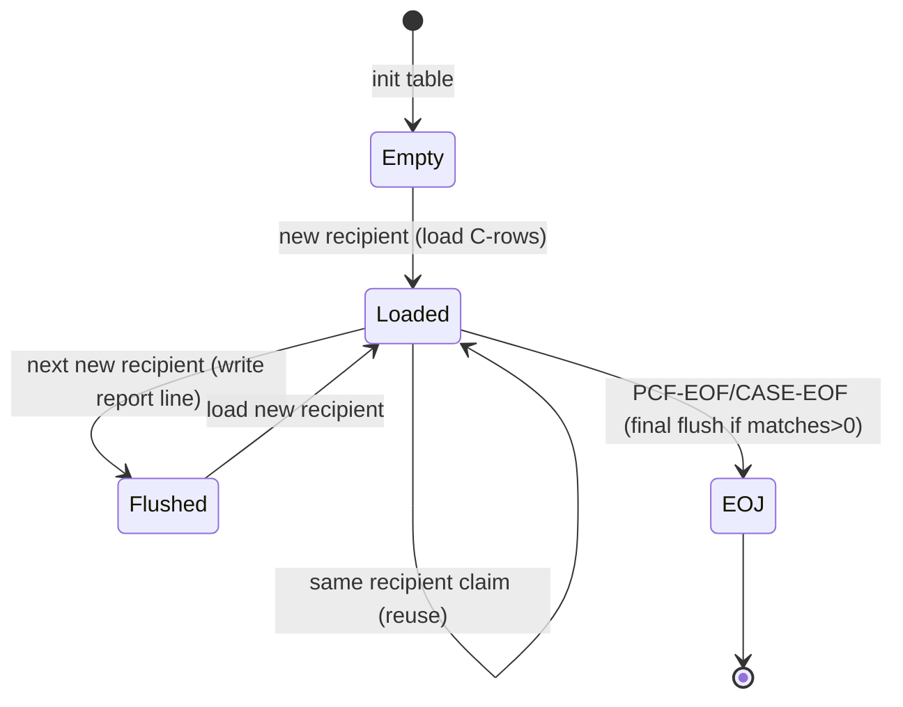

# CASPCFAL — Illustration Document (Dummy Data)

> Companion to **`CASPCFAL_NEW logic.md`**. All data below is **dummy/sample** data invented purely to illustrate coded behaviour. Field names, PICs, literals, and paragraph references are taken from `CASPCFAL.txt` and its copybooks; the **values** are fictional. Nothing here asserts real business data.

---

# 1. Illustration Scope

- **Illustrated:** every branch that materially changes behaviour — the inclusion gate, both exclusion filters, the recipient match key, open-case gate, both date-window bounds (and their blank-date defaults), the new-recipient vs same-recipient table handling, the "no matching case" fall-through, version routing (`MAMA` + versions 05/04/03/02/01/other), institutional/professional/pharmacy diagnosis handling, provider substitution, ICN-suffix reformat, ICD-version stamping, the overflow (`SIZE-ERROR`) path, and the report header/line/trailer.
- **How dummy data was built:** key fields were taken from `TPLPREFX` (`PFX`), `FDPCF602` (`CLMI`), `NCTCASE` (`CASE`/`CASET`), `CLMPREFX` (`PRO`), `FDPCF601` (`CLM`), and `FDALINH5/FDALPHY5/FDALRXR5` (`AL5`). Only the fields the program reads/writes are shown; the rest of each 32752-/754-byte record is elided as `…`.
- **Could not be fully illustrated (source limits):** exact dataset contents behind the DD names (no JCL), the real meaning/allowed values of the control-card create-source code, and the specific business meaning of magic literals `0032600`, `09999996`, `X'96'`. These are shown structurally but their real-world semantics are **not proven from source**.

**Reference key values used throughout (dummy):**

| Symbol | Field | Dummy value | Note |
|---|---|---|---|
| R1 | recipient / `PFX-APP-MEDICAID-NO` | `00000000000000000123` | 20 chars, numeric |
| R2 | recipient | `00000000000000000200` | sorts after R1 |
| R3 | recipient | `00000000000000000900` | sorts after R2 |
| — | `PFX-SYS-HMS-ASSIGN-FILE` | `MAMA5` | `(1:4) = 'MAMA'` ✔ |
| — | `PFX-SYS-EXIT-FROM-REF-STATUS` | `Y` | passes inclusion gate |

---

# 2. Scenario Catalog

| ID | Scenario | Trigger (coded condition) | Expected result | Logic ref |
|---|---|---|---|---|
| S01 | **Valid match & write** | recipient=key, open case, DOS in window | 1 output claim + report accumulation | §5.4.5 / §5.5 |
| S02 | **Referral-status skip** | `PFX-SYS-EXIT-FROM-REF-STATUS ≠ 'Y'` | claim skipped, next PCF read | BR-02 |
| S03 | **DSS exclusion** | contract `0032600` + `PM(27:3)='DSS'` + `0040000<FROM-DOS<0900000` | skipped, `REC-SKIP-DSS`++ | BR-03 |
| S04 | **Dummy-provider exclusion** | `PROV=09999996` AND `PAY-TO=09999996` | skipped, `REC-SKIP-PROV`++ | BR-04 |
| S05 | **New recipient (load table + flush prior)** | case=key AND `CASET-…(1) < key` | prior report line flushed, table reloaded | §5.4.5 |
| S06 | **Same recipient (reuse table)** | case≥key AND `CASET-…(1)=key` | processed against existing table | §5.4.5 |
| S07 | **No matching case** | neither branch condition true | claim not written | §7 |
| S08 | **Closed case** | `CASET-CASE-STATUS-CODE ≠ 'O'/X'96'` | not written | BR-05 |
| S09 | **DOS before incident** | `DOS < WS-INCIDENT-DATE-NEW-RE` | not written | BR-06 |
| S10 | **DOS after claims-thru** | `DOS > WS-CLM-THRU-DATE-N` | not written | BR-07 |
| S11 | **Blank incident date** | `CASET-INCIDENT-DATE = SPACES` | lower bound `00000001` (matches) | BR-06 |
| S12 | **Blank claims-thru date** | `CASET-CLAIMS-THRU-DATE = SPACES` | upper bound `99999999` (matches) | BR-07 |
| S13 | **V05 institutional diag** | `MAMA`,ver `05`,type `I/L/O/A/C` | DX1–5 + surg code carried; `VER-5-INST-ILOAC`/`-PROC-CD`++ | §5.6 |
| S14 | **V05 professional diag** | `MAMA`,ver `05`,type `M/B` | DX1–5 carried; `VER-5-PROF-MB`++ | §5.6 |
| S15 | **V05 pharmacy** | `MAMA`,ver `05`,type `P/Q` | no DX; `VER-5-RX-PQ`++ | §5.6 |
| S16 | **V04 / V03** | ver `04`/`03` | same as S13/S14 via `AL4`/`AL3`; `VER-4/3-*`++ | §5.6 |
| S17 | **V02 / V01 / other** | ver `02`/`01`/other | only `VER-2`/`VER-1`/`OTHER-VERS`++ (no ICD-10 build) | §5.6 |
| S18 | **Non-MAMA file** | `PFX-SYS-HMS-ASSIGN-FILE(1:4) ≠ 'MAMA'` | written, but no diagnosis extraction | §5.6 |
| S19 | **Provider substitution** | `PROV=09999996` AND contract `0032600` (pay-to ≠ 09999996) | pay-to copied into service provider | BR-10 |
| S20 | **ICN-suffix reformat** | `PM(1:2)∈{PB,DT}` + contract `0032600` + `PM(27:3)≠DSS` + numeric non-zero suffix | ICN = first17+suffix | BR-11 |
| S21 | **ICD version stamp = 10 vs 9** | carried version `'0'` ⇒ `'10'` else `'9'` | `CLM-CDE-ICD-VERSION` set then reset to `'9'` | BR-13 |
| S22 | **Overflow (SIZE-ERROR)** | per-recipient `ADD` overflows | report shows "TOO MANY MATCHES…" | BR-15 |
| S23 | **No matches at all** | `REC-WRITE-CTR = 0` at EOJ | trailer "NO MATCHED PCF RECORDS FOUND" | BR-16 |
| S24 | **Early stop on CASE-EOF** | `CASE-EOF` reached | main loop ends; DISPLAY note | BR-17 |
| S25 | **Create-source from control card** | `SYS004` card `CARD-TAG='1'` | `PRO-CREATE-SOURCE = CARD-DATA(1:2)` | BR-18 |

---

# 3. Dummy Data Examples

### Common dummy CASE file (`CASEFL-IN`, sorted ascending by recipient) 

| Slot | `…-RECIPIENT-ID-NUM` | `…-HMS-CASE-KEY` | `…-HMS-CLIENT-ID` | `…-CASE-STATUS-CODE` | `…-INCIDENT-DATE` | `…-CLAIMS-THRU-DATE` |
|---|---|---|---|---|---|---|
| C1 | R1 `…0123` | `000000501` | `CLNT01` | `O` (open) | `2015-03-15` | `2015-12-31` |
| C2 | R1 `…0123` | `000000502` | `CLNT01` | `O` (open) | `2016-01-01` | *(blank)* |
| C3 | R2 `…0200` | `000000777` | `CLNT02` | `C` (closed) | `2014-01-01` | `2014-12-31` |
| C4 | R3 `…0900` | `000000888` | `CLNT03` | `O` (open) | *(blank)* | `2020-06-30` |

---

## S01 — Valid match & write
**Dummy claim (PCF):**

| Field | Value |
|---|---|
| `PFX-APP-MEDICAID-NO` | R1 `…0123` |
| `PFX-SYS-EXIT-FROM-REF-STATUS` | `Y` |
| `PFX-SYS-HMS-ASSIGN-FILE` | `MAMA5` |
| `PFX-SYS-VERSION` | `05` |
| `PFX-NET-CLAIM-TRANS-TYPE` | `P` |
| `PFX-APP-DATE-OF-SERVICE` | `20150310` |
| `CLMI-PCF-MA-NUM` | R1 `…0123` |
| `CLMI-PCF-CONTRACT-NUM` | `1234567` |
| `CLMI-PROV-OF-SVC-NUM` | `PRV0000000001` |
| `CLMI-PAY-TO-PROV-NUM` | `PRV0000000002` |
| `CLMI-ICN` | `ICN00000000000000001` |
| `CLMI-XACTION-STATUS` | `B` |
| `CLMI-TOT-MA-PAID-HDR` | `+0000123.45` |

**Path:** catch-up (case already at R1) → gate `Y` ✔ → not DSS → not dummy-prov → new-recipient branch (table(1) was blank `< R1`) → load table with C1,C2 (`TABLE-ENTRIES=2`) → process claim vs C1 and C2.
- vs **C1**: open ✔; `20150310 >= 20150301` ✔ (incident `2015-03` → forced day 01); `20150310 <= 20151231` ✔ → **WRITE** output record #1, `REC-WRITE-CTR=1`, first match on C1 → `OPEN-CASES-MATCH-OK-CTR=1`, `CASE-PCF-MATCH-FLAG(1)='Y'`.
- vs **C2**: open ✔; `20150310 >= 20160101`? **No** → not written for C2.

**Accumulators after S01:** `WS-CASE-ID = R1`, `WS-TOT-PCF-REC-MATCH = 1`, `WS-TOT-PCF-MA-PAID = 123.45`.

> **Note (source-accurate quirk):** `PRO-INCIDENT-DATE` is `WS-INCIDENT-DATE` = `20150300` (day `00`), because `4000-FORMAT-DATE` only unstrings **year+month**; the day-`01` value is used only for the comparison (`WS-INCIDENT-DATE-NEW-RE`). See logic §5.4.

---

## S02 — Referral-status skip
Same as S01 but `PFX-SYS-EXIT-FROM-REF-STATUS = 'N'`.
**Path:** line 372 `IF (… NOT = 'Y')` true → `PERFORM 1500-READ-SRCPCF-IN` + `GO TO 2000-MAINLINE-EXIT`. **No output. No counters** except the next `PCF-REC-READ-CTR` on the follow-up read.

---

## S03 — DSS exclusion
| Field | Value |
|---|---|
| `PFX-SYS-EXIT-FROM-REF-STATUS` | `Y` |
| `CLMI-PCF-CONTRACT-NUM` | `0032600` |
| `CLMI-PM-USER-AREA` | `PB………………………DSS…` (chars 1-2 `PB`, chars 27-29 `DSS`) |
| `CLMI-CLAIM-FROM-DOS` | `0980101` → *(0YYMMDD, i.e. 1998-01-01; **example that stays in-range** `0040000 < 0980101 < 0900000`? see note)* |

> **Range mechanics (from comment lines 379–385):** the field is `0YYMMDD`. To be **excluded**, `0040000 < FROM-DOS < 0900000`. Example **excluded** value: `0050115` (year "005"→2005, month 01, day 15) → `0050115` is `>0040000` and `<0900000` ✔ → **skipped**, `REC-SKIP-DSS`++. Example **kept** value: `0980101` (year "098"→1998) → `>0900000` **false**… actually `0980101 < 0900000` is false, so **not excluded** (1998 is retained), matching the comment "INCLUDING 1990 THROUGH 2002."

**Corrected dummy (excluded) claim:** `CLMI-CLAIM-FROM-DOS = 0050115`, contract `0032600`, `PM(27:3)='DSS'` → **skipped**, `REC-SKIP-DSS = 1`.

---

## S04 — Dummy-provider exclusion
| Field | Value |
|---|---|
| `CLMI-PROV-OF-SVC-NUM` | `09999996` |
| `CLMI-PAY-TO-PROV-NUM` | `09999996` |

Both = `09999996` → line 391 true → **skipped**, `REC-SKIP-PROV = 1`. (No output.)

---

## S05 / S06 — New-recipient vs same-recipient (table lifecycle)
Feed three consecutive claims for R1, then one for R3:

| Order | Claim | `PFX-APP-MEDICAID-NO` | DOS |
|---|---|---|---|
| 1 | K1 | R1 | `20150310` |
| 2 | K2 | R1 | `20150401` |
| 3 | K3 | R3 | `20200601` |

- **K1 (S05 new recipient):** case pointer at R1; `CASET-…(1)` still blank `< R1` → **flush prior** (none yet, `WS-TOT-PCF-REC-MATCH=0` so no line) → init table → **load** C1,C2 → process (matches C1). 
- **K2 (S06 same recipient):** case pointer now at R2 (`≥ R1`) and `CASET-…(1)=R1` → **reuse table**, process K2 vs C1,C2 (matches C1: `20150401` in `[20150301,20151231]`). `WS-TOT-PCF-REC-MATCH` now `2`.
- **K3 (S05 again, new recipient R3):** case=key? catch-up advances case from R2→R3; `CASET-…(1)=R1 < R3` → **flush R1's report line** (`CASE ID=R1, matched=2, paid=sum`), init table, load C4, process (C4 blank incident ⇒ lower bound `00000001`; thru `2020-06-30`; `20200601` in window ⇒ match).

This shows: report lines are emitted **when the recipient changes** (and the final one at EOJ, §5.8).

---

## S07 — No matching case
Claim with `PFX-APP-MEDICAID-NO = 00000000000000000150` (between R1 and R2). Catch-up advances case to R2 (`≥ key`). 
- New-recipient branch: `CASE-RECIPIENT-ID-NUM(=R2) = key(150)?` **No**. 
- Same-recipient branch: `CASET-…(1) = key(150)?` **No**. 
→ Falls through both → `PERFORM 1500-READ-SRCPCF-IN`. **No output.**

---

## S08 — Closed case
Claim for **R2** (`…0200`), DOS `20140601` (inside C3's `2014` window). C3 status is `C`.
`3020`: `IF CASET-CASE-STATUS-CODE = 'O' OR X'96'` → **false** → skip the whole build. **No output**, even though the date window would have matched.

---

## S09 — DOS before incident
Claim for R1, DOS `20150215`. vs C1 incident `2015-03` → `WS-INCIDENT-DATE-NEW-RE=20150301`. `20150215 >= 20150301`? **No** → not written (vs C2 also fails). **No output.**

---

## S10 — DOS after claims-thru
Claim for R1, DOS `20160705`.
- vs C1: `20160705 <= 20151231`? **No** → not written.
- vs C2: incident `2016-01` → `20160101`; `20160705 >= 20160101` ✔; C2 thru **blank** ⇒ `99999999`; `20160705 <= 99999999` ✔ → **written vs C2**. 

*(To illustrate a pure upper-bound failure in isolation, use recipient R2/close it or a single-case recipient with a bounded thru date; against C1 alone the claim is rejected by the upper bound.)*

---

## S11 — Blank incident date (no lower bound)
Claim for **R3** (`…0900`), DOS `20200101`. C4 incident is **blank** → `WS-INCIDENT-DATE-NEW-RE = 00000001`; `20200101 >= 00000001` ✔; thru `2020-06-30` → `20200101 <= 20200630` ✔ → **written**.

---

## S12 — Blank claims-thru date (no upper bound)
Claim for R1, DOS `20990101`. vs **C2** (incident `2016-01`, thru **blank** ⇒ `99999999`): `20990101 >= 20160101` ✔; `20990101 <= 99999999` ✔ → **written**.

---

## S13 — Version 05 institutional diagnosis
Matched claim (as S01), `PFX-SYS-VERSION='05'`, `CLMI-CLIENT-DATA` interpreted as `AL5`:

| `AL5-INST-…` field | Value |
|---|---|
| `AL5-INST-CLAIM-TYPE-ALPHA` | `I` |
| `AL5-INST-DIAG(1)` / `…-CDE-ICD-VERSION(1)` | `E119   ` / `0` |
| `AL5-INST-DIAG(2)` / `(2)` | `I10    ` / `0` |
| `AL5-INST-DIAG(3..5)` | *(spaces)* |
| `AL5-INST-HDR-SURG-CD(1)` | `0SR90ZZ` |

**Effect (`5100`):**
- LPR1 → `CLM-PRI-DX='E119'`, `CLM-CDE-ICD-VERSION` set from `'0 '`; `VER-5-INST-ILOAC`++
- LPR2 → `CLM-SEC-DX='I10'`; `VER-5-INST-ILOAC`++
- LPR3–5 skipped (spaces)
- Surg loop LPR1 → `CLM-PROCEDURE-CODE-7='0SR90ZZ'`; `VER-5-PROC-CD`++
- Then §5.5 step 8: `CLM-CDE-ICD-VERSION` was `'0 '` → **`'10'`** (ICD-10); written; reset to `'9'`.

---

## S14 — Version 05 professional diagnosis
Same match, but:

| `AL5-…` field | Value |
|---|---|
| `AL5-INST-CLAIM-TYPE-ALPHA` | `M` |
| `AL5-PHYS-DIAG(1)` / `…-CDE-ICD-VERSION(1)` | `Z1231  ` / `0` |
| `AL5-PHYS-DIAG(2..5)` | *(spaces)* |

**Effect:** professional branch → `CLM-PRI-DX='Z1231'`; `VER-5-PROF-MB`++. No surgery loop in the `M/B` branch.

---

## S15 — Version 05 pharmacy (no diagnosis)
`AL5-INST-CLAIM-TYPE-ALPHA = 'P'` → pharmacy branch → only `VER-5-RX-PQ`++. No DX/procedure carried (comment "RX RECORDS DO NOT HAVE DIAGNOSIS CODES", line 676). Record still written with copied header fields.

---

## S16 — Versions 04 / 03
Identical behaviour to S13/S14 but the client overlay is `AL4`/`AL3` and counters are `VER-4-*`/`VER-3-*`. E.g. `PFX-SYS-VERSION='03'`, `AL3-INST-CLAIM-TYPE-ALPHA='L'`, `AL3-INST-DIAG(1)='A000'/‘9’` → `CLM-PRI-DX='A000'`, and step-8 EVALUATE sees `'9 '` → **`'9'`** (ICD-9); `VER-3-INST-ILOAC`++.

---

## S17 — Versions 02 / 01 / other
`PFX-SYS-VERSION='02'` → `5400` only `ADD 1 TO VER-2`. `='01'` → `5500` `VER-1`++. Anything else under `MAMA` → `5600` `OTHER-VERS`++. In all three, **no ICD-10 diagnosis segments are created** (comments 1124/1198/1206); the output record is still written with the copied header fields.

---

## S18 — Non-MAMA file
`PFX-SYS-HMS-ASSIGN-FILE = 'XYZ12'` → `(1:4)='XYZ1' ≠ 'MAMA'` → `3030` does nothing after the `INITIALIZE`. The matched record is still **written**, but DX/procedure fields remain as copied from `CLMI` (no `AL` overlay applied), and none of the `VER-*` counters increment.

---

## S19 — Provider substitution
Matched claim with:

| Field | Before | After (in output) |
|---|---|---|
| `CLMI-PROV-OF-SVC-NUM` | `09999996` | `PRV0000000055` |
| `CLMI-PAY-TO-PROV-NUM` | `PRV0000000055` | `PRV0000000055` |
| `CLMI-PCF-CONTRACT-NUM` | `0032600` | — |

Line 484: `PROV=09999996 AND contract=0032600` → `MOVE CLMI-PAY-TO-PROV-NUM TO CLMI-PROV-OF-SVC-NUM`. So `CLM-PROV-OF-SVC-NUM` (copied afterward at line 493) receives `PRV0000000055`.

> Contrast with **S04**: if *both* prov and pay-to are `09999996`, the claim is excluded **before** reaching this point.

---

## S20 — ICN-suffix reformat
| Field | Value |
|---|---|
| `CLMI-PM-USER-AREA(1:2)` | `PB` |
| `CLMI-PCF-CONTRACT-NUM` | `0032600` |
| `CLMI-PM-USER-AREA(27:3)` | `ABC` (≠ `DSS`) |
| `CLMI-ICN` | `ICN9012345678901XYZ` (17+ chars) |
| `CLMI-PCF-HMS-ICN-SUFFIX` | `07` (numeric, ≠ 0) |

Lines 626–643: conditions met, suffix numeric and non-zero → build 19-char group = `CLMI-ICN(1:17)` + `07` → `WS-ICN-GROUP-19` → `PRO-ICN` and `CLM-ICN`. (If suffix were `00`, `CONTINUE` — ICN left as-is.)

---

## S21 — ICD version stamp (10 vs 9)
Driven by the carried client ICD-version (`WK-ICD-VERSION` → `CLM-CDE-ICD-VERSION`) and the EVALUATE at 646–653:

| Carried value in `CLM-CDE-ICD-VERSION` before EVALUATE | Result written | Meaning (as coded) |
|---|---|---|
| `'0 '` | `'10'` | ICD-10 |
| `' 0'` | `'10'` | ICD-10 |
| anything else (incl. `'9 '`, spaces) | `'9'` | ICD-9 / default |

After each `WRITE`, `CLM-CDE-ICD-VERSION` is reset to `'9'` (line 657), so it never leaks into the next record.

---

## S22 — Overflow (SIZE-ERROR)
Conceptual: a recipient matches so many claims / such large `CLMI-TOT-MA-PAID-HDR` values that `ADD … TO WS-TOT-PCF-REC-MATCH` (`S9(5)`, max 99,999) or `ADD … TO WS-TOT-PCF-MA-PAID` (`S9(11)V99`) overflows → `ON SIZE ERROR SET SIZE-ERROR` (lines 662/665). When the recipient's line is written (`2100`), `SIZE-OK` is false → the line shows:

```
 *  <CASE ID>          * TOO MANY MATCHES, $$ PAID NOT AVAILABLE !
```
and `SIZE-OK` is reset to TRUE for the next recipient (line 1233).

---

## S23 — No matches at all
If the whole run writes **zero** output claims (`REC-WRITE-CTR = 0`), `9100-WRITE-MATCH-TRAILER` emits:
```
     NO MATCHED PCF RECORDS FOUND
<blank line>
********************************************************************************
```

---

## S24 — Early stop on CASE-EOF (mod 0013)
If the case file reaches EOF mid-run (e.g., PCF still has claims for higher recipients), `CASE-EOF` becomes true and `0000-MAIN`'s `UNTIL PCF-EOF OR CASE-EOF` ends the loop. Remaining PCF claims are **not** processed. The EOJ DISPLAY prints:
```
PLEASE NOTE: THE PROCESSING STOPS AT END OF PCF INPUT FILE.
THE CASE FILE MAY NOT HAVE BEEN READ TO COMPLETION.
```

---

## S25 — Create-source from control card
`SYS004` contains a card:

```
Col: 1        2..3   4..33(comment)            34   35..36
     '1'      ' '    'CREATE SOURCE = AL     '  ' '  'AL'
     ^TAG                                            ^CARD-DATA(1:2)
```
`1650-READ-CARDS`: `CARD-TAG='1'` → `MOVE CARD-DATA(1:2)='AL' TO WS-SAVE-CREATE-SOURCE`. Every matched output record then carries `PRO-CREATE-SOURCE = 'AL'` (§5.5 step 1). If no `'1'` card exists, `PRO-CREATE-SOURCE` is spaces.

---

# 4. Before / After Illustrations

## 4.1 Claim → Output extract record (S01 + S13)

**BEFORE — input claim (`WS-CLMI-RECORD`, key fields):**
```
PFX-APP-MEDICAID-NO ......... 00000000000000000123
PFX-APP-DATE-OF-SERVICE ..... 20150310
PFX-SYS-EXIT-FROM-REF-STATUS  Y
PFX-SYS-HMS-ASSIGN-FILE ..... MAMA5      PFX-SYS-VERSION 05
PFX-NET-CLAIM-TRANS-TYPE .... P
CLMI-PCF-MA-NUM ............. 00000000000000000123
CLMI-ICN ................... ICN00000000000000001
CLMI-XACTION-STATUS ........ B
CLMI-TOT-MA-PAID-HDR ....... 0000123.45
CLMI-PROCEDURE-CODE-5 ...... 99213       (X(05))
CLMI-PRI-DX / SEC-DX ....... (spaces)    (X(05) each)
client(AL5): TYPE=I  DIAG1=E119 v0  DIAG2=I10 v0  SURG1=0SR90ZZ
```

**MATCHING CASE (C1):**
```
CASET-RECIPIENT-ID-NUM(1) .. 00000000000000000123
CASET-HMS-CASE-KEY(1) ...... 000000501
CASET-HMS-CLIENT-ID(1) ..... CLNT01
CASET-CASE-STATUS-CODE(1) .. O
CASET-INCIDENT-DATE(1) ..... 2015-03-15
CASET-CLAIMS-THRU-DATE(1) .. 2015-12-31
```

**AFTER — output record (`WS-SRCPCF-OUT`, key fields):**
```
PRO-RECIPIENT-ID-NUM ....... 00000000000000000123   <- CLMI-PCF-MA-NUM
PRO-HMS-CASE-KEY ........... 000000501              <- CASET-HMS-CASE-KEY(1)
PRO-CLIENT-ID .............. CLNT01                 <- CASET-HMS-CLIENT-ID(1) (mod 0012)
PRO-CREATE-SOURCE .......... AL                     <- control card (mod 0005)
PRO-ICN .................... ICN00000000000000001   <- CLMI-ICN
PRO-XACTION-STATUS ......... B
PRO-CLM-FROM-DATE .......... 20150310               <- PFX-APP-DATE-OF-SERVICE
PRO-CLAIM-TRANS-TYPE ....... P                      <- PFX-NET-CLAIM-TRANS-TYPE
PRO-INCIDENT-DATE .......... 20150300               <- WS-INCIDENT-DATE (day 00!)
PRO-CLM-THRU-DATE .......... 20151231               <- WS-CLM-THRU-DATE
CLM-PROCEDURE-CODE-7 ....... 0SR90ZZ  (X(07))       <- AL5-INST-HDR-SURG-CD(1)
CLM-PRI-DX ................. E119     (X(07))       <- AL5-INST-DIAG(1)
CLM-SEC-DX ................. I10      (X(07))       <- AL5-INST-DIAG(2)
CLM-CDE-ICD-VERSION ........ 10                      <- '0 ' mapped to '10' (then reset '9')
```

## 4.2 Report line (`CASE-PCF-MATCH` file) after R1 flush (S05/S06)
```
 *  00000000000000000123 *                 2 *          $123.45 *
    ^MATCH-CASE-ID-OUT      ^recs matched       ^total MA paid
```
*(Leading spaces of the count/paid edit fields are stripped by the `INSPECT … TALLYING` logic in `2100`.)*

## 4.3 Skipped / rejected outcomes (no output record produced)

| Scenario | Record fate | Counter touched |
|---|---|---|
| S02 referral-status `≠Y` | discarded, next PCF read | — |
| S03 DSS in range | discarded | `REC-SKIP-DSS` |
| S04 dummy provider | discarded | `REC-SKIP-PROV` |
| S07 no matching case | discarded | — |
| S08 closed case | discarded | — |
| S09/S10 out of date window | discarded | — |

---

# 5. Flow Diagrams

## 5.1 Per-claim decision tree
```mermaid
flowchart TD
  R[Read claim] --> RS{EXIT-FROM-REF-STATUS = 'Y'?}
  RS -- No --> SK1[skip → next claim]
  RS -- Yes --> DSS{DSS in range?}
  DSS -- Yes --> SK2[REC-SKIP-DSS++ → next]
  DSS -- No --> DP{PROV & PAY-TO = 09999996?}
  DP -- Yes --> SK3[REC-SKIP-PROV++ → next]
  DP -- No --> MK{recipient key matches a loaded case group?}
  MK -- No --> SK4[no output → next]
  MK -- Yes --> LOOP[for each case row in table]
  LOOP --> OPEN{status 'O'/x96?}
  OPEN -- No --> NX[next case row]
  OPEN -- Yes --> LO{DOS >= incident(01)?}
  LO -- No --> NX
  LO -- Yes --> HI{DOS <= thru?}
  HI -- No --> NX
  HI -- Yes --> W[build + WRITE output; accumulate] --> NX
```

## 5.2 Version routing (3030)
```mermaid
flowchart TD
  A{ASSIGN-FILE(1:4)='MAMA'?} -- No --> N[no extraction]
  A -- Yes --> V{PFX-SYS-VERSION}
  V -- 05 --> P5[5100 AL5]
  V -- 04 --> P4[5200 AL4]
  V -- 03 --> P3[5300 AL3]
  V -- 02 --> P2[5400 VER-2++]
  V -- 01 --> P1[5500 VER-1++]
  V -- other --> P0[5600 OTHER-VERS++]
  P5 --> T{CLAIM-TYPE-ALPHA}
  T -- I/L/O/A/C --> INST[INST DIAG1-5 + SURG1]
  T -- M/B --> PROF[PHYS DIAG1-5]
  T -- P/Q --> RX[RX count only]
  T -- other --> C[CONTINUE]
```

## 5.3 Recipient / report state transitions


---

# 6. Coverage Check

| Coded branch / feature | Illustrated? | Scenario(s) |
|---|---|---|
| Inclusion gate (referral status) | ✅ | S01 (pass), S02 (fail) |
| DSS exclusion + `0YYMMDD` range | ✅ | S03 |
| Dummy-provider exclusion | ✅ | S04 |
| New-recipient table load + prior flush | ✅ | S05 |
| Same-recipient table reuse | ✅ | S06 |
| No-matching-case fall-through | ✅ | S07 |
| Open-case gate (`'O'`/`X'96'`) | ✅ | S08 |
| Date-window lower/upper bounds | ✅ | S09, S10 |
| Blank incident / blank thru defaults | ✅ | S11, S12 |
| Version routing 05/04/03/02/01/other | ✅ | S13–S17 |
| Institutional / professional / pharmacy types | ✅ | S13, S14, S15 |
| Non-MAMA (no extraction) | ✅ | S18 |
| Provider substitution | ✅ | S19 |
| ICN-suffix reformat (incl. suffix `00` `CONTINUE`) | ✅ | S20 |
| ICD version stamp `10`/`9` + reset | ✅ | S21, S13, S16 |
| Overflow `SIZE-ERROR` message | ✅ | S22 |
| No-match trailer | ✅ | S23 |
| Early stop on CASE-EOF | ✅ | S24 |
| Control-card create-source | ✅ | S25 |
| One-time open-case match count | ✅ | S01 (C1 flagged once) |

**Branches intentionally not given a separate dummy record (with reason):**
- `WS-PROCESSED-SW` — dead field (never set/tested); nothing to illustrate.
- Commented-out `PFX-NET-CLAIM-TRANS-TYPE='D'` alternative (line 373) and commented version-02 extraction (lines 1130–1192) — inactive code; not executed, so no behaviour to show.
- The ~110 straight `CLMI→CLM` field copies are represented collectively in the Before/After (§4.1) rather than field-by-field (see `CASPCFAL_io_mapping.md` for the full field map).
- Exact I/O-error handling — **not coded** (no `FILE STATUS`), so cannot be illustrated (see logic §7).
