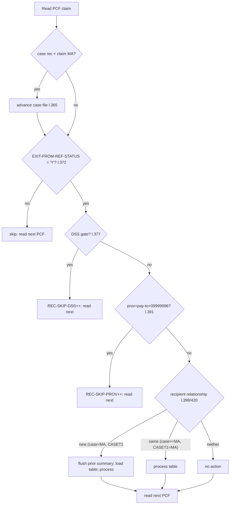
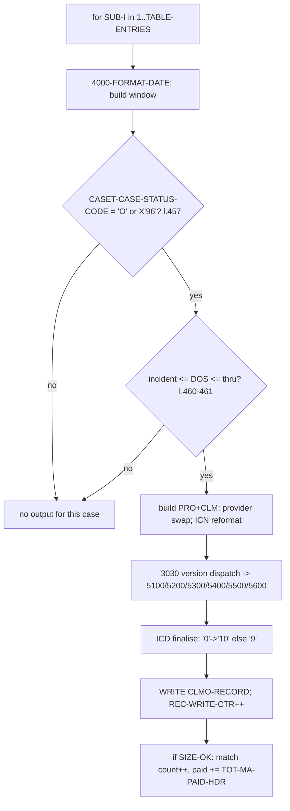
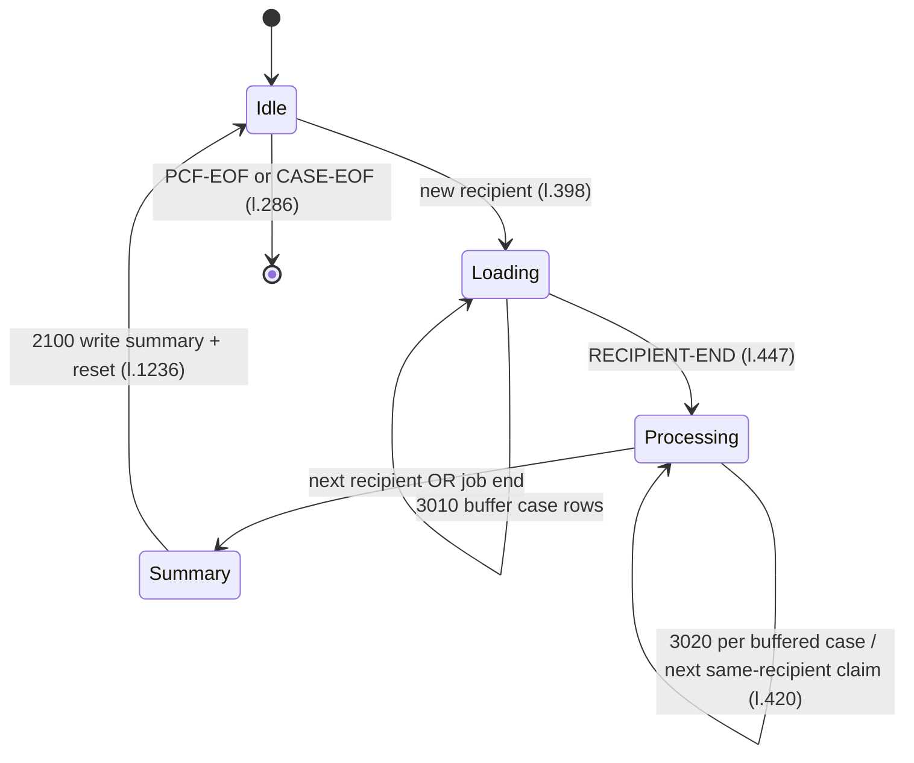
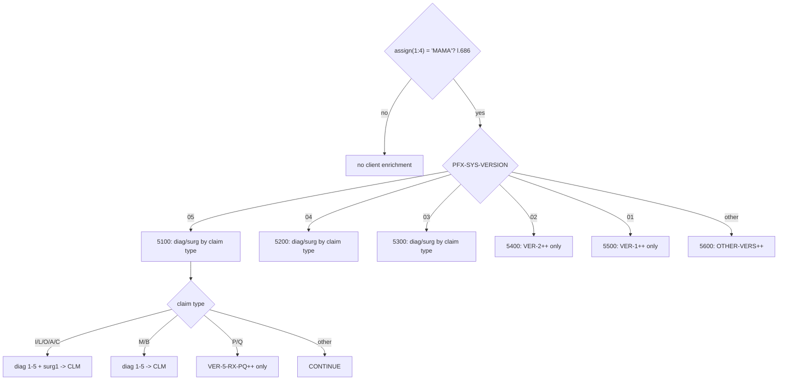

# CASPCFAL — Illustrations with Dummy / Sample Data

> Companion to `CASPCFAL_NEW logic.md`. All records below are **dummy/illustrative** data invented
> to exercise the coded scenarios. Field names and layouts are taken from the real copybooks
> (`NCTCASE`, `TPLPREFX`, `FDPCF602`, `FDPCF601`, `CLMPREFX`, `FDALINH/PHY/RXR`); the **values** are
> fictitious. Expected behaviour for each example is derived strictly from the program logic cited
> in the logic document (rule IDs `R-01…R-18`, paragraph and line references to `CASPCFAL.txt`).

---

# 1. Illustration Scope

## 1.1 What is illustrated
Every materially behaviour-changing branch coded in `CASPCFAL` is illustrated:

- the three **exclusion** paths (ref-status, DSS, dummy-provider),
- the **case-file catch-up** advance,
- **new-recipient** vs **same-recipient** table processing,
- **match success** (open case + in-window) and the two **non-match** reasons (closed case,
  out-of-window),
- **one claim → many cases** fan-out,
- **ICN reformat** and **provider substitution**,
- **version dispatch** (MAMA v05/v04/v03 institutional / physician / pharmacy; v02/v01/other; and
  non-MAMA),
- **ICD-version finalisation**,
- the **match summary** line, its **overflow** variant, and the **no-match** trailer,
- **end-of-job** on PCF-EOF / CASE-EOF and the **last-recipient flush**.

## 1.2 How the dummy data was created
- Case rows use the `NCTCASE` fields that matter: `RECIPIENT-ID-NUM`, `CASE-STATUS-CODE`,
  `INCIDENT-DATE`, `CLAIMS-THRU-DATE`, `HMS-CASE-KEY`, `HMS-CLIENT-ID`.
- Claim rows use the `TPLPREFX` (`PFX-…`) match keys plus the `FDPCF602` (`CLMI-…`) fields the code
  inspects. Only fields referenced by the program are shown; everything else is assumed spaces/zeros.
- Dates follow the formats proven in code: case dates are 10-char `YYYY-MM-DD`; `PFX-APP-DATE-OF-
  SERVICE` is numeric `YYYYMMDD`; `CLMI-CLAIM-FROM-DOS` is the `0YYMMDD` form described at l.379–383.

## 1.3 What could not be illustrated from source
- **Exact packed-decimal byte images** are not shown (COMP-3 fields); values are given logically.
- Upstream file construction and downstream consumers are **not available** (see logic §8.3), so
  end-to-end dataset content beyond this program is not illustrated.
- The literal meaning of `'MAMA'` / `SYS-VERSION` codes is not defined in source, so version
  examples show only the **coded behaviour**, not a business label.

---

# 2. Scenario Catalog

| # | Scenario | Trigger (proven) | Result |
|---|---|---|---|
| S-01 | Claim skipped — ref status | `PFX-SYS-EXIT-FROM-REF-STATUS ≠ 'Y'` (l.372) | read next PCF, no output |
| S-02 | Claim skipped — DSS | contract `0032600` + PM(27:3)=`DSS` + `0040000 < FROM-DOS < 0900000` (l.377) | `REC-SKIP-DSS`++, no output |
| S-03 | Claim skipped — dummy provider | `PROV-OF-SVC=PAY-TO-PROV='09999996'` (l.391) | `REC-SKIP-PROV`++, no output |
| S-04 | Case catch-up | `CASE-RECIPIENT-ID-NUM < PFX-APP-MEDICAID-NO` (l.365) | advance case file |
| S-05 | New recipient, match in window | case=claim MA, `CASET(1)<MA`, open, DOS in window (l.398, 457, 460) | write 1 output row + accumulate |
| S-06 | Same recipient, next claim | `CASE≥MA` and `CASET(1)=MA` (l.420) | process buffered table again |
| S-07 | Open case, DOS out of window | status open but DOS `<` incident or `>` thru (l.460–461) | no output |
| S-08 | Case not open | `CASET-CASE-STATUS-CODE ∉ {'O',X'96'}` (l.457) | no output |
| S-09 | One claim → many cases | recipient owns ≥2 open in-window cases (l.415–424) | multiple output rows |
| S-10 | ICN reformat | PM(1:2)∈{PB,DT} + contract 0032600 + PM(27:3)≠DSS + suffix numeric≠0 (l.626) | ICN = 17+2 suffix |
| S-11 | Provider substitution | `PROV-OF-SVC='09999996'` + contract `0032600` (l.484) | pay-to replaces svc num |
| S-12 | MAMA v05 institutional | assign `MAMA`, ver `05`, type `I/L/O/A/C` (l.686–751) | diag 1–5 + surg → CLM |
| S-13 | MAMA v05 physician | type `M/B` (l.813) | diag 1–5 → CLM |
| S-14 | MAMA v05 pharmacy | type `P/Q` (l.863) | `VER-5-RX-PQ`++ only |
| S-15 | Version v02 / v01 / other | ver `02`/`01`/other (l.706–719) | `VER-2/VER-1/OTHER-VERS`++, no ICD-10 |
| S-16 | Non-MAMA assign file | assign(1:4) ≠ `MAMA` (l.686) | no client enrichment |
| S-17 | ICD version finalisation | `CLM-CDE-ICD-VERSION`=`'0 '`/`' 0'` vs other (l.646) | `'10'` vs `'9'` |
| S-18 | Match summary line | recipient flush with `WS-TOT-PCF-REC-MATCH>0` (l.400, 1245) | one `MATCHO` line w/ totals |
| S-19 | Summary overflow | `SIZE-ERROR` after ADD overflow (l.662) | `TOO MANY MATCHES…` line |
| S-20 | No matches at all | `REC-WRITE-CTR = 0` at end (l.1355) | `NO MATCHED PCF RECORDS FOUND` |
| S-21 | Open-ended thru-date | `CASET-CLAIMS-THRU-DATE = SPACES` (l.743) | window upper bound `99999999` |
| S-22 | Create-source stamp | control card `CARD-TAG='1'` (l.348) | `PRO-CREATE-SOURCE`=card value |
| S-23 | End of job | `PCF-EOF OR CASE-EOF` (l.286) | terminate, flush, report |

---

# 3. Dummy Data Examples

> **Shared dummy control card** (`SYS004` = `WZCA010`), used by all examples:
> `CARD-TAG='1'`, `CARD-DATA='00'` → `WS-SAVE-CREATE-SOURCE='00'` → every output row gets
> `PRO-CREATE-SOURCE='00'` (rule R-10; see scenario S-22).

## S-01 — Claim skipped because ref status ≠ 'Y'
**Input claim (only relevant fields):**

| Field | Value |
|---|---|
| `PFX-APP-MEDICAID-NO` | `RECIP0000000000001` |
| `PFX-SYS-EXIT-FROM-REF-STATUS` | `N` |

**Path:** Step B (l.372) true → `PERFORM 1500-READ-SRCPCF-IN` → `GO TO 2000-MAINLINE-EXIT`.
**Result:** No output to `SRCPCFO`; no summary change. The claim never reaches matching.
**Why:** R-02 — only `'Y'` claims are eligible.

## S-02 — Claim skipped by DSS exclusion
**Input claim:**

| Field | Value | Note |
|---|---|---|
| `PFX-SYS-EXIT-FROM-REF-STATUS` | `Y` | passes S-01 |
| `CLMI-PCF-CONTRACT-NUM` | `0032600` | contract gate |
| `CLMI-PM-USER-AREA(27:3)` | `DSS` | DSS gate |
| `CLMI-CLAIM-FROM-DOS` | `0951015` | `0YYMMDD` → yr 1995; `0040000 < 0951015 < 0900000`? → **0951015 > 0900000 = false** |

**Careful check (proven ranges, l.384–385):** condition is `FROM-DOS > 0040000 AND < 0900000`.
- `0951015` is **not** `< 0900000` → **DSS exclusion does NOT fire** for a 1995 date.
- A value like `0051015` (yr 2005, `0YYMMDD`=005*, i.e. `0051015`) is `> 0040000` and `< 0900000`
  → **excluded** (this is the "exclude 2004+" case described in the code comment).

**Two contrasting rows:**

| Dummy row | `CLAIM-FROM-DOS` | In `(0040000,0900000)`? | Outcome |
|---|---|---|---|
| S-02a (kept) | `0921231` (1992) | `0921231 > 0900000` → no | Not excluded here (falls through to matching) |
| S-02b (skipped) | `0051015` (2005) | yes | `REC-SKIP-DSS`++, read next, no output |

**Why:** R-03. (The `0YYMMDD` encoding means larger literal years like `099*`/`092*` exceed
`0900000` and are *kept*, while `000*`–`089*` i.e. 2000–2089 fall inside the excluded band; see the
source note at l.379–383.)

## S-03 — Claim skipped: dummy service + pay-to provider
**Input claim:**

| Field | Value |
|---|---|
| `CLMI-PROV-OF-SVC-NUM` | `09999996` |
| `CLMI-PAY-TO-PROV-NUM` | `09999996` |

**Path:** Step D (l.391) true → `REC-SKIP-PROV`++ → read next → exit.
**Result:** no output. **Why:** R-04.
*(Contrast with S-11 where only `PROV-OF-SVC='09999996'` but pay-to differs — that claim is **kept**
and triggers provider substitution instead.)*

## S-04 — Case file catch-up
**State at top of `2000-MAINLINE`:**

| Item | Value |
|---|---|
| current case `CASE-RECIPIENT-ID-NUM` | `RECIP0000000000001` |
| current claim `PFX-APP-MEDICAID-NO` | `RECIP0000000000005` |

**Path:** l.365 `CASE < claim` true → `PERFORM 1600-READ-CASEFL-IN UNTIL CASE ≥ claim OR CASE-EOF`.
Case file advances past recipients 1,2,3,4 until a case with recipient ≥ `…005` (or EOF).
**Result:** no output yet; the case pointer is aligned for matching. **Why:** R-01.

## S-05 — New recipient, single open case, claim in window (happy path)
**Buffered case (loaded by `3010`):**

| `NCTCASE` field | Dummy value |
|---|---|
| `CASET-RECIPIENT-ID-NUM(1)` | `RECIP0000000000005` |
| `CASET-CASE-STATUS-CODE(1)` | `O` |
| `CASET-INCIDENT-DATE(1)` | `2001-06-15` |
| `CASET-CLAIMS-THRU-DATE(1)` | `2003-12-31` |
| `CASET-HMS-CASE-KEY(1)` | `000123456` |
| `CASET-HMS-CLIENT-ID(1)` | `CLNT01` |

**Input claim:**

| Field | Dummy value |
|---|---|
| `PFX-APP-MEDICAID-NO` | `RECIP0000000000005` |
| `PFX-SYS-EXIT-FROM-REF-STATUS` | `Y` |
| `PFX-APP-DATE-OF-SERVICE` | `20020310` |
| `PFX-SYS-HMS-ASSIGN-FILE` | `MAMAx` |
| `PFX-SYS-VERSION` | `05` |
| `CLMI-PCF-MA-NUM` | `RECIP0000000000005` |
| `CLMI-ICN` | `ICN2002031000001` |
| `CLMI-TOT-MA-PAID-HDR` | `1250.00` |
| `CLMI-XACTION-STATUS` | `B` |
| `PFX-NET-CLAIM-TRANS-TYPE` | `P` |

**Window derivation (`4000-FORMAT-DATE`):** incident `2001-06-15` → lower bound
`WS-INCIDENT-DATE-NEW-RE = 20010601` (day forced to 01); thru `2003-12-31` → `20031231`.
`20010601 ≤ 20020310 ≤ 20031231` → **in window**.

**Path:** Step E new-recipient branch → load table → `3020` → open + in-window → build & write.
**Result:** one output row to `SRCPCFO`; `REC-WRITE-CTR`=1; `OPEN-CASES-MATCH-OK-CTR`=1;
`WS-TOT-PCF-REC-MATCH`=1; `WS-TOT-PCF-MA-PAID`=1250.00. **Why:** R-05, R-06, R-14, R-16.
*(Output record shown in §4.)*

## S-06 — Same recipient, a second claim
Following S-05, the **next** PCF record is still recipient `…005` (e.g. a second service date
`20030101`, in window). At `2000-MAINLINE`, `CASE-RECIPIENT-ID-NUM` (look-ahead) ≥ `…005` and
`CASET-RECIPIENT-ID-NUM(1) = …005` → **same-recipient branch** (l.420) → `3020` runs again on the
already-buffered table → second output row; `REC-WRITE-CTR`=2; totals accumulate. **Why:** R-06.

## S-07 — Open case but claim date out of window
Reuse S-05's case (window `20010601…20031231`) with a claim `PFX-APP-DATE-OF-SERVICE = 20040101`.
`20040101 > 20031231` → date gate (l.461) false → **no output**, no accumulation. **Why:** R-06.

## S-08 — Case exists and matches recipient, but is not open
**Buffered case:** `CASET-RECIPIENT-ID-NUM(1)=RECIP0000000000005`,
`CASET-CASE-STATUS-CODE(1)='C'` (closed). Claim recipient `…005`, DOS in any range.
**Path:** `3020` open-case gate (l.457) `'C' ∉ {'O',X'96'}` → false → **no output**. **Why:** R-05.
*(This case is also **not** counted in `OPEN-CASES-READ-CTR`, since that counter only increments for
`'O'/X'96'` at read time, l.335.)*

## S-09 — One claim matches multiple open cases (fan-out)
**Buffered table for recipient `…005` (two open, in-window cases):**

| idx | `CASET-CASE-STATUS-CODE` | `INCIDENT-DATE` | `CLAIMS-THRU-DATE` | `HMS-CASE-KEY` |
|---|---|---|---|---|
| 1 | `O` | `2001-06-15` | `2003-12-31` | `000123456` |
| 2 | `o` (X'96') | `2000-01-01` | `2005-01-01` | `000777888` |

Claim recipient `…005`, DOS `20020310` (in both windows).
**Path:** `3020` loops `SUB-I` 1..`TABLE-ENTRIES`(=2); both gates pass twice → **two** output rows
(different `PRO-HMS-CASE-KEY`: `000123456` then `000777888`). `REC-WRITE-CTR`+=2;
`WS-TOT-PCF-REC-MATCH`+=2; paid amount added twice. **Why:** R-07.

## S-10 — ICN reformat (suffix append)
**Input claim:**

| Field | Value |
|---|---|
| `CLMI-PM-USER-AREA(1:2)` | `PB` |
| `CLMI-PCF-CONTRACT-NUM` | `0032600` |
| `CLMI-PM-USER-AREA(27:3)` | `ABC` (≠ `DSS`) |
| `CLMI-ICN` | `ICN00000000000017X` (≥17 chars) |
| `CLMI-PCF-HMS-ICN-SUFFIX` | `07` (numeric, ≠00) |

**Path (l.626–643):** gates pass and suffix numeric & non-zero → `WS-ICN-17 = ICN(1:17)`,
`WS-ICN-02 = '07'`, `WS-ICN-GROUP-19` → `PRO-ICN` and `CLM-ICN`.
**Result:** output ICN = first 17 chars of the source ICN concatenated with `07`.
**Edge:** if `CLMI-PCF-HMS-ICN-SUFFIX-N = 0` the code `CONTINUE`s (no reformat); non-numeric suffix
also bypasses. **Why:** R-08.

## S-11 — Provider substitution on output
**Input claim:** `CLMI-PROV-OF-SVC-NUM='09999996'`, `CLMI-PAY-TO-PROV-NUM='PROV1234567890'`,
`CLMI-PCF-CONTRACT-NUM='0032600'`. (Passes S-03 because pay-to ≠ `09999996`.)
**Path (l.484–488):** before copying the claim area, `CLMI-PAY-TO-PROV-NUM` → `CLMI-PROV-OF-SVC-NUM`.
**Result:** `CLM-PROV-OF-SVC-NUM='PROV1234567890'` on output. **Why:** R-09.

## S-12 — MAMA v05 institutional diagnosis + surgery extraction
**Input claim client area (`FDALINH5`, prefix `AL5-`):**

| Field | Value |
|---|---|
| `PFX-SYS-HMS-ASSIGN-FILE` | `MAMA1` |
| `PFX-SYS-VERSION` | `05` |
| `AL5-INST-CLAIM-TYPE-ALPHA` | `I` |
| `AL5-INST-DIAG(1)` / `…-CDE-ICD-VERSION(1)` | `S72001` / `0` |
| `AL5-INST-DIAG(2)` / `(2)` | `E119` / `0` |
| `AL5-INST-DIAG(3..5)` | spaces |
| `AL5-INST-HDR-SURG-CD(1)` | `0SR90JZ` |

**Path:** `3030` → `5100-PROCESS-RECS` (l.748). Type `I` ∈ institutional set →
`CLM-PRI-DX='S72001'`, `CLM-SEC-DX='E119'`, `CLM-CDE-ICD-VERSION` set from `'0'`;
surgery loop → `CLM-PROCEDURE-CODE-7='0SR90JZ'`. Tally `VER-5-INST-ILOAC`, `VER-5-PROC-CD`.
**Then** ICD finalisation (S-17): version `'0 '` → `CLM-CDE-ICD-VERSION='10'` before write. **Why:**
R-11, R-12, R-13.

## S-13 — MAMA v05 physician diagnosis extraction
Same as S-12 but `AL5-PHYS-CLAIM-TYPE-ALPHA='M'`, `AL5-PHYS-DIAG(1)='I10'`,
`AL5-PHYS-CDE-ICD-VERSION(1)='9'`. `5100` physician branch (l.813) → `CLM-PRI-DX='I10'`;
version `'9 '` → ICD finalisation `WHEN OTHER` → `CLM-CDE-ICD-VERSION='9'`. Tally `VER-5-PROF-MB`.

## S-14 — MAMA v05 pharmacy (count only)
`AL5-RX-CLAIM-TYPE-ALPHA='P'` (or `'Q'`). `5100` pharmacy branch (l.863) → `ADD +1 TO VER-5-RX-PQ`;
**no** diagnosis fields changed (R-12 note; comment l.676). The claim is still written (the write in
`3020` occurs regardless of client type once the case gates pass), carrying whatever `CLM-*-DX`
values existed before (typically spaces). **Why:** R-11/R-12.

## S-15 — Version v02 / v01 / other
| `PFX-SYS-VERSION` | Paragraph | Effect |
|---|---|---|
| `02` | `5400` (l.1123) | `ADD +1 TO VER-2`; ICD-10 segments **not** created (extraction commented out) |
| `01` | `5500` (l.1197) | `ADD +1 TO VER-1`; no ICD-10 segments |
| e.g. `07` | `5600` (l.1205) | `ADD +1 TO OTHER-VERS` |

In all three, the claim is written with existing `CLM-*-DX`; ICD finalisation still runs (version
stays whatever it was → typically `'9'`). **Why:** R-11.

## S-16 — Non-MAMA assign file
`PFX-SYS-HMS-ASSIGN-FILE='OTHER'` → `3030` `IF …(1:4)='MAMA'` false → none of 5100–5600 run; no
client-side diagnosis/procedure override. The claim is still written if the case gates passed, with
diagnosis fields as copied from `CLMI-*` (l.522–523) only. **Why:** R-11.

## S-17 — ICD version finalisation matrix
| `CLM-CDE-ICD-VERSION` after 3030 | `EVALUATE` result (l.646–653) | Written value |
|---|---|---|
| `'0 '` | first WHEN | `'10'` |
| `' 0'` | second WHEN | `'10'` |
| `'9 '` / anything else | WHEN OTHER | `'9'` |

After each `WRITE`, `CLM-CDE-ICD-VERSION` is reset to `'9'` (l.657). **Why:** R-13.

## S-18 — Match summary line (with totals)
After recipient `…005` finishes (next recipient starts, or job ends) with `WS-TOT-PCF-REC-MATCH=3`
and `WS-TOT-PCF-MA-PAID=3750.00`, `2100-WRITE-CASE-PCF-MATCH` emits one `MATCHO` line:

```
 * RECIP0000000000005 * 3 * $3,750.00
```
(Exact spacing follows the `WS-MATCH-OUT` template l.168–177 and the edited pictures
`WS-CONVERT-MATCH`/`WS-CONVERT-PCF-PAID`.) **Why:** R-14.

## S-19 — Summary overflow (`SIZE-ERROR`)
If a recipient matches more than 99,999 claims, `ADD 1 TO WS-TOT-PCF-REC-MATCH` overflows `S9(5)`
→ `SET SIZE-ERROR` (l.662). The summary line becomes:

```
 * RECIP0000000000005 * TOO MANY MATCHES, $$ PAID NOT AVAILABLE !
```
**Why:** R-15. *(Illustrative only — reaching 100,000 matches for one recipient is extreme.)*

## S-20 — No matches in the whole run
If no claim ever passes both case gates, `REC-WRITE-CTR=0`. `9100-WRITE-MATCH-TRAILER` (l.1355)
emits:

```
     NO MATCHED PCF RECORDS FOUND
```
followed by a blank line and a line of `'*'`. **Why:** R-17.

## S-21 — Open-ended claims-thru-date
Case with `CASET-CLAIMS-THRU-DATE(1)=SPACES`. `4000-FORMAT-DATE` (l.743) sets
`WS-CLM-THRU-DATE='99999999'`. Any claim DOS ≥ incident lower bound matches on the upper side.
**Why:** R-06 (default branch).

## S-22 — Create-source stamping
Control card `1. ENTER VALUE FOR CREATE-SOURCE: 00;` → `CARD-DATA='00'` →
`WS-SAVE-CREATE-SOURCE='00'` → each written row carries `PRO-CREATE-SOURCE='00'`. If the card value
were `01`, every output row would instead carry `01`. **Why:** R-10.

## S-23 — End of job (PCF-EOF / CASE-EOF) and last flush
When the PCF file reaches end (or the case file does), the mainline loop stops (l.286–287).
`9000-TERMINATION` flushes the final recipient's summary if `WS-TOT-PCF-REC-MATCH>0` (l.1245),
writes the trailer, computes `OPEN-CASES-NO-MATCH-CTR`, and `DISPLAY`s the counter block. **Why:**
R-18, R-16.

---

# 4. Before / After Illustrations

## 4.1 Matched claim → output extract record (from S-05)
**BEFORE — input PCF record (logical view, key fields):**

| Segment | Field | Value |
|---|---|---|
| `PFX-` prefix | `PFX-APP-MEDICAID-NO` | `RECIP0000000000005` |
| | `PFX-APP-DATE-OF-SERVICE` | `20020310` |
| | `PFX-NET-CLAIM-TRANS-TYPE` | `P` |
| `CLMI-` area | `CLMI-PCF-MA-NUM` | `RECIP0000000000005` |
| | `CLMI-ICN` | `ICN2002031000001` |
| | `CLMI-XACTION-STATUS` | `B` |
| | `CLMI-TOT-MA-PAID-HDR` | `1250.00` |

**Matched open case:** key `000123456`, client `CLNT01`, incident `2001-06-15`, thru `2003-12-31`.

**AFTER — output `SRCPCFO` record (`WS-SRCPCF-OUT`, key fields):**

| Segment | Field | Value | Source (line) |
|---|---|---|---|
| `PRO-` prefix | `PRO-RECIPIENT-ID-NUM` | `RECIP0000000000005` | `CLMI-PCF-MA-NUM` (463) |
| | `PRO-HMS-CASE-KEY` | `000123456` | `CASET-HMS-CASE-KEY(1)` (464) |
| | `PRO-CLIENT-ID` | `CLNT01` | `CASET-HMS-CLIENT-ID(1)` (466) |
| | `PRO-ICN` | `ICN2002031000001` | `CLMI-ICN` (474) |
| | `PRO-XACTION-STATUS` | `B` | `CLMI-XACTION-STATUS` (476) |
| | `PRO-CLM-FROM-DATE` | `20020310` | `PFX-APP-DATE-OF-SERVICE` (478) |
| | `PRO-CLAIM-TRANS-TYPE` | `P` | `PFX-NET-CLAIM-TRANS-TYPE` (480) |
| | `PRO-INCIDENT-DATE` | `20010615` | `WS-INCIDENT-DATE` (482) |
| | `PRO-CLM-THRU-DATE` | `20031231` | `WS-CLM-THRU-DATE` (483) |
| | `PRO-CREATE-SOURCE` | `00` | `WS-SAVE-CREATE-SOURCE` (472) |
| `CLM-` area | `CLM-PCF-MA-NUM` | `RECIP0000000000005` | `CLMI-PCF-MA-NUM` (492) |
| | `CLM-TOT-MA-PAID-HDR` | `1250.00` | `CLMI-TOT-MA-PAID-HDR` (545) |
| | `CLM-CDE-ICD-VERSION` | `10` or `9` | ICD finalisation (646–657) |

> Note `PRO-INCIDENT-DATE` carries the raw incident `20010615` (from `WS-INCIDENT-DATE`, l.482),
> whereas the **date-window lower bound** used for matching is the day-forced `20010601`
> (`WS-INCIDENT-DATE-NEW-RE`). Both are proven; they intentionally differ.

## 4.2 Skipped claim → no record (S-01/S-02b/S-03)
**BEFORE:** a PCF record meeting an exclusion trigger.
**AFTER:** nothing written to `SRCPCFO`; only the relevant skip counter increments
(`REC-SKIP-DSS` or `REC-SKIP-PROV`; ref-status skip has no dedicated counter).

## 4.3 ICN reformat (S-10)
| | ICN value |
|---|---|
| BEFORE (`CLMI-ICN`) | `ICN00000000000017X…` (20 chars) |
| AFTER (`PRO-ICN`/`CLM-ICN`) | `ICN00000000000017` + `07` = 19-char value |

## 4.4 Provider substitution (S-11)
| | `CLM-PROV-OF-SVC-NUM` |
|---|---|
| BEFORE | `09999996` |
| AFTER | `PROV1234567890` (from `CLMI-PAY-TO-PROV-NUM`) |

---

# 5. Flow Diagrams

## 5.1 Claim disposition decision tree


## 5.2 Per-case evaluation (`3020-READ-CASE-TABLE`)


## 5.3 Recipient processing state (case-table lifecycle)


## 5.4 Version dispatch (`3030-REVIEW-MAMA-VERS`)


---

# 6. Coverage Check

## 6.1 Coded branches vs illustrations

| Coded branch (paragraph / line) | Illustrated by | Covered |
|---|---|---|
| Case catch-up (l.365–368) | S-04 | ✅ |
| Ref-status skip (l.372–375) | S-01 | ✅ |
| DSS skip incl. `0YYMMDD` range (l.377–389) | S-02a/S-02b | ✅ |
| Dummy-provider skip (l.391–396) | S-03 | ✅ |
| New-recipient load+process (l.398–417) | S-05, S-09 | ✅ |
| Same-recipient process (l.420–424) | S-06 | ✅ |
| Prior-summary flush on recipient change (l.400–404) | S-18, S-23 | ✅ |
| `3010` buffer + `RECIPIENT-END` (l.438–450) | S-05, S-09 | ✅ |
| Open-case gate `'O'/X'96'` (l.457–458) | S-08 (fail), S-05/S-09 (pass) | ✅ |
| Date-window gate (l.460–461) | S-05 (pass), S-07 (fail), S-21 (open-ended) | ✅ |
| First-match audit flag (l.468–471) | S-05, S-16 note | ✅ |
| Provider swap (l.484–488) | S-11 | ✅ |
| ICN reformat + zero/non-numeric bypass (l.626–643) | S-10 | ✅ |
| Field copy `CLMI→CLM` (l.492–624) | S-05 §4.1 | ✅ |
| ICD finalisation (l.646–657) | S-12, S-13, S-17 | ✅ |
| Version dispatch MAMA/non-MAMA (l.686–720) | S-12…S-16 | ✅ |
| 5100/5200/5300 inst/phys/rx (l.748–1121) | S-12, S-13, S-14 | ✅ |
| 5400/5500/5600 v02/v01/other (l.1123–1211) | S-15 | ✅ |
| Match accumulate + overflow (l.659–666) | S-05 (ok), S-19 (overflow) | ✅ |
| `2100` summary line (l.1213–1235) | S-18, S-19 | ✅ |
| `9100` trailer / no-match (l.1353–1362) | S-20 | ✅ |
| Termination flush + counters (l.1242–1348) | S-23 | ✅ |
| Control-card create-source (l.342–350) | S-22 | ✅ |

## 6.2 Branches intentionally NOT illustrated (with reason)
- **Commented-out logic**: `OR PFX-NET-CLAIM-TRANS-TYPE='D'` (l.373) and the `5400` v02 extraction
  body (l.1130–1192) are **disabled in source**; no runtime behaviour to illustrate.
- **Physical I/O error paths**: no code exists (only `AT END`), so no error scenario can be shown
  from source (logic §7.1).
- **Table overflow (>30 case rows)**: reachable in theory (logic §7.4) but **not proven safe** and
  has no coded handler, so no defined outcome can be illustrated — flagged as a risk, not shown as a
  result.
- **Exact packed-decimal byte layouts**: omitted deliberately (illustrative values only).

## 6.3 Summary
All major, source-proven branches that change behaviour are illustrated with dummy data. The only
omissions are (a) code that is commented out, (b) conditions with no coded handler, and (c) exact
binary byte images — each explained above.

---

*End of `CASPCFAL_NEW_illustrations.md`.*
