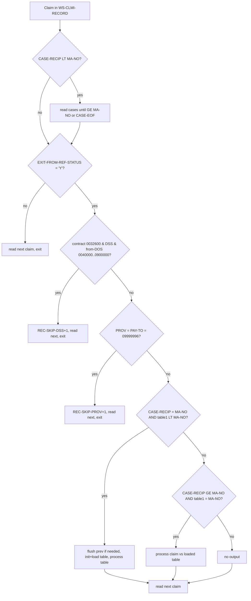
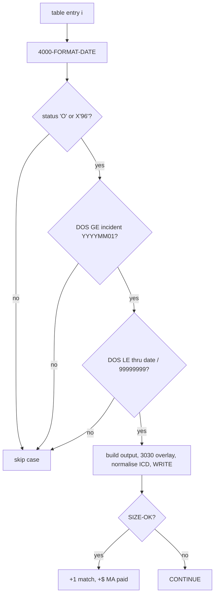
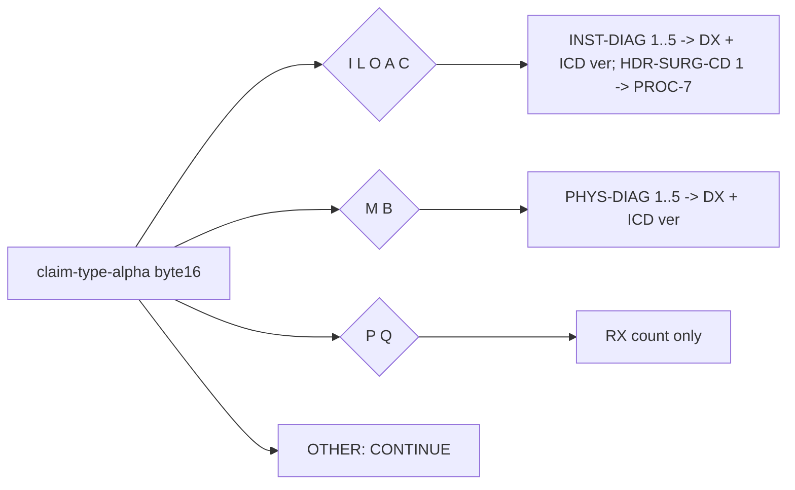
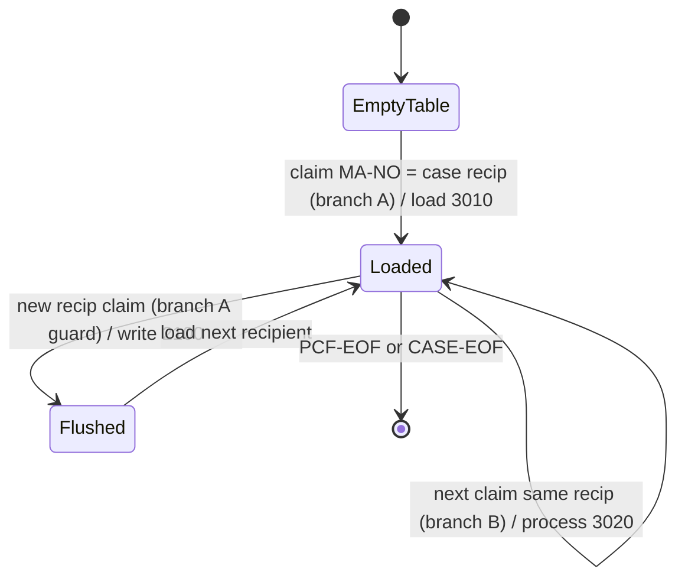

# CASPCFAL — Illustration Documentation (Dummy Data)

> Companion to **`CASPCFAL_NEW logic.md`**. Every scenario below is a coded path proven from
> `CASPCFAL.txt` and its copybooks. Data values are **dummy/illustrative** (the real input
> datasets are not in the repository). Field names, lengths, literals, and decision logic
> are taken verbatim from source. Where a value is only illustrative it is called out.

---

## 1. Illustration Scope

* **Illustrated:** every branch that materially changes behaviour — selection/exclusion
  filters, the recipient match/no-match paths, open vs non-open cases, the three date-window
  outcomes, claim-type routing (institutional / physician / pharmacy), version routing
  (v5/v4/v3 vs v2/v1/other), the `MAMA`/non-`MAMA` overlay switch, the two special
  transforms (pay-to substitution, ICN suffix), ICD-version normalisation, size overflow,
  fan-out, and the empty-run trailer.
* **How dummy data was built:** each sample record shows only the fields the program reads
  or writes, using the `PIC` and position taken from the copybooks cited in the logic
  document. Filler/unused bytes are shown as `…`.
* **Source structures used:** `NCTCASE` (case), `TPLPREFX`+`FDPCF602` (input claim),
  `CLMPREFX`+`FDPCF601` (output claim), `FDALINH5/PHY5/RXR5` (v5 client overlay),
  `WZCA010` (control card).
* **Could not be fully illustrated:** exact spanned-record byte offsets of every one of the
  ~70 copied `CLMI→CLM` fields; only logic-bearing fields are shown. The external netting
  system that sets `PFX-SYS-EXIT-FROM-REF-STATUS` is out of scope, so only its effect is
  illustrated.

### Shared dummy control card (`SYS004` = `WZCA010`)

```
Col: 1        4                             35
     1 . _ E N T E R   V A L U E ... : _ 0 0 ;
     ^tag                                 ^^CARD-DATA(1:2) = "00"
```
Result: `WS-SAVE-CREATE-SOURCE = "00"` → every output claim gets `PRO-CREATE-SOURCE = "00"`
(`00 = TPL MEDICAID`).

---

## 2. Scenario Catalog

| # | Scenario | Trigger (proven) | Output claim? | Report effect |
|---|---|---|---|---|
| S1 | Valid match — institutional v5 | open case, DOS in window, `MAMA`/`05`, type `I` | **Yes (1)** | +1 match, +$ |
| S2 | Valid match — physician v5 | same, claim type `M`/`B` | **Yes (1)** | +1 match, +$ |
| S3 | Valid match — pharmacy | claim type `P`/`Q` (no DX overlay) | **Yes (1)** | +1 match, +$ |
| S4 | Fan-out — many open cases | recipient has 2+ qualifying open cases | **Yes (n)** | +n matches |
| S5 | Non-open case skipped | `CASE-STATUS-CODE` ≠ `'O'`/`X'96'` | No | none |
| S6 | DOS before incident | `DOS < YYYYMM01` | No | none |
| S7 | DOS after thru | `DOS > CLAIMS-THRU-DATE` | No | none |
| S8 | Open-ended thru | `CLAIMS-THRU-DATE` blank → `99999999` | **Yes** | +1 match |
| S9 | Reference-status filter | `PFX-SYS-EXIT-FROM-REF-STATUS ≠ 'Y'` | No | none |
| S10 | DSS old-year skip | contract `0032600` + `DSS` + from-DOS `0040000..0900000` | No | `REC-SKIP-DSS`+1 |
| S11 | Dummy-provider skip | `PROV`=`PAY-TO`=`09999996` | No | `REC-SKIP-PROV`+1 |
| S12 | Pay-to substitution | `PROV`=`09999996` + contract `0032600` | **Yes (modified)** | +1 match |
| S13 | ICN suffix reformat | user-area `PB`/`DT` + contract `0032600` + not `DSS` + numeric non-zero suffix | **Yes (ICN changed)** | +1 match |
| S14 | ICD version `10` | `CLM-CDE-ICD-VERSION` = `'0 '`/`' 0'` | **Yes** | +1 match |
| S15 | Non-`MAMA` file | `PFX-SYS-HMS-ASSIGN-FILE(1:4) ≠ 'MAMA'` | **Yes (no DX overlay)** | +1 match |
| S16 | Version 02/01/other | `PFX-SYS-VERSION` = `02`/`01`/other | **Yes (counter only)** | +1 match; `VER-2`/`VER-1`/`OTHER-VERS`+1 |
| S17 | Size overflow | count/$ accumulator overflows | Yes, but report shows overflow text | `SIZE-ERROR` |
| S18 | Unmatched recipient | claim recipient absent from case file | No | none |
| S19 | New recipient flush | next recipient begins | (previous flushed) | report line written |
| S20 | Empty run | `REC-WRITE-CTR = 0` at EOJ | No | `'NO MATCHED PCF RECORDS FOUND'` |

---

## 3. Dummy Data Examples

> Notation: `DOS` = `PFX-APP-DATE-OF-SERVICE` (`CCYYMMDD`, `9(8) COMP-3`).
> `MA-NO` = `PFX-APP-MEDICAID-NO` (`X(20)`). Case dates are `X(10)` `YYYY-MM-DD`.

### S1 — Valid match, institutional, version 5

**Case table entry (`CASET(1)`)**
```
HMS-CLIENT-ID     : ALCL01
HMS-CASE-KEY      : 000123456
RECIPIENT-ID-NUM  : 12345678901234567890
CASE-STATUS-CODE  : O                      <- open
INCIDENT-DATE     : 2001-03-15             -> lower bound YYYYMM01 = 20010301
CLAIMS-THRU-DATE  : 2002-06-30             -> upper bound        = 20020630
CASE-PCF-MATCH-FLAG: N
```

**Input claim (prefix `PFX` + body `CLMI`)**
```
PFX-SYS-HMS-ASSIGN-FILE : MAMA
PFX-SYS-VERSION         : 05
PFX-SYS-EXIT-FROM-REF-STATUS : Y
PFX-NET-CLAIM-TRANS-TYPE: P                 (PAID-CLAIM)
PFX-APP-MEDICAID-NO     : 12345678901234567890
PFX-APP-DATE-OF-SERVICE : 20010401          (2001-04-01, in window)
CLMI-PCF-MA-NUM         : 12345678901234567890
CLMI-PROV-OF-SVC-NUM    : 222222222222222
CLMI-PCF-CONTRACT-NUM   : 0032600
CLMI-ICN                : ICN0000000000000001
CLMI-TOT-MA-PAID-HDR    : 000000150.00
CLMI-CLIENT-DATA(16:1)  : I                 (INST claim-type-alpha)
AL5-INST-DIAG(1)        : S72001            (7-byte capable)
AL5-INST-CDE-ICD-VERSION(1): 0              (=> ICD-10)
AL5-INST-HDR-SURG-CD(1) : 0SG9YZZ
```

**Decision trace**

| Check | Line | Result |
|---|---|---|
| CASE-RECIPIENT vs MA-NO | 365 | equal → no advance |
| EXIT-FROM-REF-STATUS = 'Y' | 372 | passes |
| DSS skip | 377 | not `DSS` → no skip |
| Dummy provider | 391 | not `09999996` → no skip |
| Load branch A | 398–399 | table loaded for recipient |
| Open? | 457 | `'O'` → yes |
| DOS ≥ 20010301 | 460 | `20010401 ≥ 20010301` → yes |
| DOS ≤ 20020630 | 461 | `20010401 ≤ 20020630` → yes → **MATCH** |
| Version overlay | 686–692 | `MAMA`+`05` → `5100` |
| Claim type | 751 | `I` → institutional DX path |
| ICD version normalise | 646–653 | was `'0 '` → `'10'` |

**Output claim (`SRCPCFO`, `PRO`+`CLM`)**
```
PRO-RECIPIENT-ID-NUM : 12345678901234567890   (from CLMI-PCF-MA-NUM)
PRO-HMS-CASE-KEY     : 000123456              (from CASET-HMS-CASE-KEY)
PRO-CLIENT-ID        : ALCL01                 (chg 0012)
PRO-ICN              : ICN0000000000000001
PRO-CLM-FROM-DATE    : 20010401               (from DOS)
PRO-CLAIM-TRANS-TYPE : P
PRO-INCIDENT-DATE    : 20010300               (day 00 — see logic §5.8)
PRO-CLM-THRU-DATE    : 20020630
PRO-CREATE-SOURCE    : 00
CLM-PCF-MA-NUM       : 12345678901234567890
CLM-PRI-DX           : S72001                 (from AL5-INST-DIAG(1), 7-byte)
CLM-PROCEDURE-CODE-7 : 0SG9YZZ                (from AL5-INST-HDR-SURG-CD(1))
CLM-CDE-ICD-VERSION  : 10   (written)         (reset to 9 after write, line 657)
```
Counters: `REC-WRITE-CTR`+1, `VER-5-INST-ILOAC`+1, `VER-5-PROC-CD`+1,
`WS-TOT-PCF-REC-MATCH`+1, `WS-TOT-PCF-MA-PAID`+150.00, `OPEN-CASES-MATCH-OK-CTR`+1.

---

### S2 — Valid match, physician (M/B), version 5

Same as S1 except:
```
CLMI-CLIENT-DATA(16:1) : M                  (physician claim-type-alpha)
AL5-PHYS-DIAG(1)       : E1165
AL5-PHYS-DIAG(2)       : I10
```
Trace: `5100` → `WHEN 'M' OR 'B'` (line 813) → loop maps `AL5-PHYS-DIAG(1)`→`CLM-PRI-DX`,
`(2)`→`CLM-SEC-DX`; `VER-5-PROF-MB`+1. Output DX:
```
CLM-PRI-DX : E1165
CLM-SEC-DX : I10
```
A claim record **is** written (physician path still reaches the `WRITE` at line 655).

---

### S3 — Valid match, pharmacy (P/Q)

Same envelope as S1 except `CLMI-CLIENT-DATA(16:1) = P`.
Trace: `5100` → `WHEN 'P' OR 'Q'` (line 863) → `VER-5-RX-PQ`+1 **only** (no DX overlay —
"RX RECORDS DO NOT HAVE DIAGNOSIS CODES", line 676). The output claim is still written,
carrying the diagnosis values copied straight from `CLMI-PRI-DX`/`CLMI-SEC-DX` (lines
522–523) because `3030` added no override.

---

### S4 — Fan-out: one claim, several open cases

**Case table for recipient `12345678901234567890`**
```
CASET(1): STATUS O  INCIDENT 2001-03-15  THRU 2002-06-30  CASE-KEY 000123456
CASET(2): STATUS O  INCIDENT 2001-01-01  THRU 2003-12-31  CASE-KEY 000123457
CASET(3): STATUS C  INCIDENT 2000-01-01  THRU 2005-12-31  CASE-KEY 000123458  (closed)
```
Claim `DOS = 20010401`, all envelope checks pass.

| Entry | Open? | DOS in window? | Output? |
|---|---|---|---|
| CASET(1) | O | 20010301 ≤ 20010401 ≤ 20020630 | **write #1** (CASE-KEY 000123456) |
| CASET(2) | O | 20010101 ≤ 20010401 ≤ 20031231 | **write #2** (CASE-KEY 000123457) |
| CASET(3) | C | gated out at line 457 | no |

Result: **one input claim → two output claims**; `WS-TOT-PCF-REC-MATCH` += 2;
`WS-TOT-PCF-MA-PAID` += 2 × claim MA-paid. (Demonstrates rule **R7**.)

---

### S5 — Non-open case skipped

`CASET(1)` `CASE-STATUS-CODE = 'C'`. At line 457 the open gate fails →
no output, no counters, control falls to `3020-EXIT`. (Rule **R5**.)

---

### S6 / S7 / S8 — Date-window boundaries

Case: `INCIDENT 2001-03-15` (`→ 20010301`), `THRU 2002-06-30` (`→ 20020630`).

| Case id | DOS | ≥ 20010301 | ≤ 20020630 | Outcome |
|---|---|---|---|---|
| S6 | 20010215 | no | — | **no output** (line 460 false) |
| S7 | 20020701 | yes | no | **no output** (line 461 false) |
| S8 | 20050101 with **blank** thru-date | yes | thru→`99999999` ⇒ yes | **output** (rule R6/‘open-ended’) |

---

### S9 — Reference-status filter

```
PFX-SYS-EXIT-FROM-REF-STATUS : N
```
Line 372: `NOT = 'Y'` true → `PERFORM 1500-READ-SRCPCF-IN` then `GO TO 2000-MAINLINE-EXIT`.
The claim is dropped with **no output and no skip counter**. (Rule **R1**.)

---

### S10 — DSS old-year skip

```
CLMI-PCF-CONTRACT-NUM : 0032600
CLMI-PM-USER-AREA     : "........................DSS..."   (bytes 27-29 = DSS)
CLMI-CLAIM-FROM-DOS   : 0050115     (0YYMMDD => YY=05 => 2005; 0040000<0050115<0900000)
```
Lines 377–389 all true → `REC-SKIP-DSS`+1, next claim read, **no output**. (Rule **R2**.)
Contrast: `CLMI-CLAIM-FROM-DOS = 0000115` (year 2000, `0000115 < 0040000`) → **not** skipped
(the comment's "including 1990–2002" case).

---

### S11 — Dummy-provider skip

```
CLMI-PROV-OF-SVC-NUM : 09999996
CLMI-PAY-TO-PROV-NUM : 09999996
```
Lines 391–396 true → `REC-SKIP-PROV`+1, next claim read, **no output**. (Rule **R3**.)

---

### S12 — Pay-to substitution (chg 0009)

```
CLMI-PROV-OF-SVC-NUM : 09999996
CLMI-PAY-TO-PROV-NUM : 070707070707070
CLMI-PCF-CONTRACT-NUM: 0032600
```
Note S11 does **not** fire (pay-to ≠ `09999996`). At lines 484–488
`MOVE CLMI-PAY-TO-PROV-NUM TO CLMI-PROV-OF-SVC-NUM`, so the copied output shows:
```
CLM-PROV-OF-SVC-NUM : 070707070707070   (substituted before the field copy at line 493)
```
(Rule **R9**.)

---

### S13 — ICN suffix reformat (chg 0008)

```
CLMI-PM-USER-AREA(1:2)   : PB
CLMI-PCF-CONTRACT-NUM    : 0032600
CLMI-PM-USER-AREA(27:3)  : (not DSS)
CLMI-ICN                 : ICN00000000000017     (first 17 chars used)
CLMI-PCF-HMS-ICN-SUFFIX  : 02                    (numeric, non-zero)
```
Lines 626–643 build `WS-ICN-GROUP-19 = CLMI-ICN(17) + '02'`:
```
Before:  PRO-ICN / CLM-ICN = ICN0000000000000000 (20)
After :  PRO-ICN / CLM-ICN = ICN0000000000001 7 02   -> "ICN0000000000001702" style 19-char + fill
```
Suffix `00` → `CONTINUE` (ICN unchanged); non-numeric suffix → reformat skipped. (Rule **R10**.)

---

### S14 — ICD-version normalisation

| Value of `CLM-CDE-ICD-VERSION` before line 646 | `EVALUATE` result written |
|---|---|
| `'0 '` (0 + space, from a 1-byte `'0'` overlay) | `'10'` |
| `' 0'` | `'10'` |
| anything else (e.g. `'9 '`, spaces) | `'9'` |

After the `WRITE`, line 657 resets the field to `'9'`. (Rule **R11**.)

---

### S15 — Non-`MAMA` source file

```
PFX-SYS-HMS-ASSIGN-FILE : ALPCF
```
`3030` line 686 false → **no** `EVALUATE`, **no** version paragraph, **no** DX overlay.
The output DX fields keep the values copied from `CLMI-PRI-DX`/`CLMI-SEC-DX`/`CLMI-DX-3/4/5`
(5-byte source into 7-byte target, left-justified). A claim record is still written.

---

### S16 — Version routing 02 / 01 / other

```
PFX-SYS-HMS-ASSIGN-FILE : MAMA
PFX-SYS-VERSION         : 02        (or 01, or e.g. 07)
```
| Version | Paragraph | Effect |
|---|---|---|
| `02` | `5400` | `VER-2`+1 only (ICD-10 logic commented out) |
| `01` | `5500` | `VER-1`+1 only |
| other | `5600` | `OTHER-VERS`+1 only |

Output claim is still written; only the diagnosis enrichment is absent.

---

### S17 — Size overflow

Suppose a single recipient matches so many claims that `WS-TOT-PCF-REC-MATCH` (`S9(5)`,
max 99 999) or `WS-TOT-PCF-MA-PAID` (`S9(11)V99`) overflows on an `ADD` (lines 661–666):
`ON SIZE ERROR SET SIZE-ERROR TO TRUE`. The recipient's report line (2100) then takes the
`ELSE` at line 1230:
```
 * <recipient id>       * TOO MANY MATCHES, $$ PAID NOT AVAILABLE ! ...
```
and `SIZE-OK` is reset for the next recipient. (Rule **R14**.)

---

### S18 — Unmatched recipient (claim with no case)

Claim `MA-NO = 99999999999999999999`; the case file has no such recipient. Step 1 advances
cases until `CASE-RECIPIENT-ID-NUM >= MA-NO` or EOF; then neither branch-A (line 398) nor
branch-B (line 420) is satisfied (`CASET(1)` ≠ claim number), so **no output**. Next claim
is read at line 426. (Rule **R4**, no-match path.)

---

### S19 — New-recipient flush

Sequence of claims: recipient `A` (2 matches) then recipient `B`. When the first `B` claim
triggers branch-A (line 398), the guard at line 400 sees `WS-TOT-PCF-REC-MATCH > 0` for `A`
and calls `2100`, writing `A`'s report line **before** loading `B`'s table:
```
 * A0000000000000000001  * 2                   * $150.00 ...
```
Then `A`'s accumulators are re-initialised and `B`'s table is loaded. (Rule **R13**.)

---

### S20 — Empty run

No claim matches any open case in the whole run → `REC-WRITE-CTR = 0`. In `9100`
(lines 1355–1358) the trailer is:
```
     NO MATCHED PCF RECORDS FOUND
<blank line>
********************************************************************************
```
(Rule **R15**.)

---

## 4. Before / After Illustrations

### 4.1 Input claim → output claim (S1, key fields)

| Output field | Source | Before (output area) | After |
|---|---|---|---|
| `PRO-RECIPIENT-ID-NUM` | `CLMI-PCF-MA-NUM` | (init spaces) | `12345678901234567890` |
| `PRO-HMS-CASE-KEY` | `CASET-HMS-CASE-KEY(i)` | 000000000 | `000123456` |
| `PRO-CLIENT-ID` | `CASET-HMS-CLIENT-ID(i)` | (spaces) | `ALCL01` |
| `PRO-CLM-FROM-DATE` | `PFX-APP-DATE-OF-SERVICE` | 00000000 | `20010401` |
| `PRO-CREATE-SOURCE` | `WS-SAVE-CREATE-SOURCE` | (spaces) | `00` |
| `CLM-PRI-DX` | `AL5-INST-DIAG(1)` (overlay) | `<CLMI-PRI-DX 5-byte>` | `S72001` (7-byte) |
| `CLM-PROCEDURE-CODE-7` | `AL5-INST-HDR-SURG-CD(1)` | (spaces) | `0SG9YZZ` |
| `CLM-CDE-ICD-VERSION` | normalise | `0 ` | `10` (then `9` post-write) |

### 4.2 Provider substitution (S12)

```
Before copy:  CLMI-PROV-OF-SVC-NUM = 09999996
line 486-487: CLMI-PROV-OF-SVC-NUM := CLMI-PAY-TO-PROV-NUM (070707070707070)
After copy :  CLM-PROV-OF-SVC-NUM  = 070707070707070
```

### 4.3 ICN suffix (S13)

```
Before: CLM-ICN = ICN00000000000017?? (20-byte from CLMI-ICN)
After : CLM-ICN = [CLMI-ICN first 17][suffix 2] via WS-ICN-GROUP-19
```

### 4.4 Skipped / rejected outcomes

| Scenario | Record fate | Counter |
|---|---|---|
| S9 reference status ≠ Y | dropped, next claim | none |
| S10 DSS old-year | dropped, next claim | `REC-SKIP-DSS` |
| S11 dummy provider | dropped, next claim | `REC-SKIP-PROV` |
| S5 non-open case | no write for that case | none |
| S6/S7 out-of-window | no write for that case | none |

---

## 5. Flow Diagrams

### 5.1 Mainline decision tree (per PCF claim)


```mermaid
flowchart TD
    A[Claim in WS-CLMI-RECORD] --> B{"CASE-RECIP LT MA-NO?"}
    B -- yes --> B1["read cases until GE MA-NO or CASE-EOF"]
    B -- no --> C
    B1 --> C{"EXIT-FROM-REF-STATUS = 'Y'?"}
    C -- no --> Z[read next claim, exit]
    C -- yes --> D{"contract 0032600 & DSS & from-DOS 0040000..0900000?"}
    D -- yes --> D1[REC-SKIP-DSS+1, read next, exit]
    D -- no --> E{"PROV = PAY-TO = 09999996?"}
    E -- yes --> E1[REC-SKIP-PROV+1, read next, exit]
    E -- no --> F{"CASE-RECIP = MA-NO AND table1 LT MA-NO?"}
    F -- yes --> G[flush prev if needed, init+load table, process table]
    F -- no --> H{"CASE-RECIP GE MA-NO AND table1 = MA-NO?"}
    H -- yes --> I[process claim vs loaded table]
    H -- no --> J[no output]
    G --> K[read next claim]
    I --> K
    J --> K
```

### 5.2 Per-case match test (`3020` inner gate)


```mermaid
flowchart TD
    A[table entry i] --> B[4000-FORMAT-DATE]
    B --> C{status 'O' or X'96'?}
    C -- no --> X[skip case]
    C -- yes --> D{"DOS GE incident YYYYMM01?"}
    D -- no --> X
    D -- yes --> E{"DOS LE thru date / 99999999?"}
    E -- no --> X
    E -- yes --> F[build output, 3030 overlay, normalise ICD, WRITE]
    F --> G{SIZE-OK?}
    G -- yes --> H[+1 match, +$ MA paid]
    G -- no --> I[CONTINUE]
```

### 5.3 Claim-type routing inside a version overlay (5100/5200/5300)


```mermaid
flowchart LR
    T[claim-type-alpha byte16] --> A{I L O A C}
    A --> AI[INST-DIAG 1..5 -> DX + ICD ver; HDR-SURG-CD 1 -> PROC-7]
    T --> B{M B}
    B --> BP[PHYS-DIAG 1..5 -> DX + ICD ver]
    T --> C{P Q}
    C --> CR[RX count only]
    T --> D[OTHER: CONTINUE]
```

### 5.4 Recipient/table state transitions


```mermaid
stateDiagram-v2
    [*] --> EmptyTable
    EmptyTable --> Loaded: claim MA-NO = case recip (branch A) / load 3010
    Loaded --> Loaded: next claim same recip (branch B) / process 3020
    Loaded --> Flushed: new recip claim (branch A guard) / write 2100
    Flushed --> Loaded: load next recipient
    Loaded --> [*]: PCF-EOF or CASE-EOF
```

---

## 6. Coverage Check

| Coded behaviour | Illustrated by | Covered |
|---|---|---|
| Advance case cursor (line 365) | S18, 5.1 | ✅ |
| Reference-status filter (372) | S9 | ✅ |
| DSS old-year skip (377) | S10 | ✅ |
| Dummy-provider skip (391) | S11 | ✅ |
| Branch A load (398) | S1, S19, 5.4 | ✅ |
| Branch B reuse (420) | S4 (multi-claim), 5.4 | ✅ |
| No-match path (neither branch) | S18 | ✅ |
| Open-case gate (457) | S5 | ✅ |
| Lower date bound (460) | S6 | ✅ |
| Upper date bound (461) | S7 | ✅ |
| Blank thru → 99999999 (743) | S8 | ✅ |
| Fan-out per case (415/3020) | S4 | ✅ |
| Pay-to substitution (484) | S12 | ✅ |
| ICN suffix reformat (626) | S13 | ✅ |
| ICD-version normalise (646) | S14 | ✅ |
| `MAMA` overlay on (686) | S1–S3 | ✅ |
| Non-`MAMA` (686 false) | S15 | ✅ |
| Version v5/v4/v3 routing (688–705) | S1 (v5); v4/v3 identical structure | ✅ (v4/v3 by structural equivalence) |
| Version v2/v1/other (706–719) | S16 | ✅ |
| Claim-type INST/PHYS/RX (751/813/863) | S1/S2/S3 | ✅ |
| Size overflow (661–666, 1230) | S17 | ✅ |
| Per-recipient report line (2100) | S19 | ✅ |
| Empty-run trailer (1355) | S20 | ✅ |
| Open-case reconciliation (1255) | see logic §5.12 / R16 | ✅ (described) |

**Not illustrated with distinct dummy records (and why):**

* **v4 / v3 overlays (`5200`/`5300`)** — byte-for-byte identical logic to v5 (`5100`) apart
  from the `AL4/AL3` prefix and `VER-4/VER-3` counters; S1 represents all three. *[Inferred
  equivalence — proven by side-by-side reading of the paragraphs.]*
* **Table overflow > 30 cases** — a real but **unguarded** edge (logic §7). No sample is
  given because the source contains no handling to illustrate; flagged as an open risk.
* **Non-EOF I/O errors** — no `FILE STATUS`/`INVALID KEY` handling exists to illustrate;
  flagged in logic §7.
