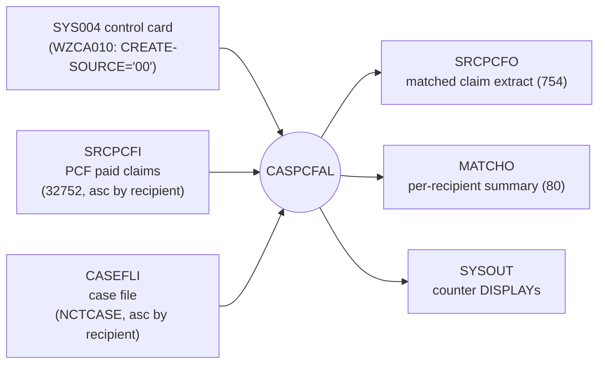

# CASPCFAL — Input / Output Mapping (Source-Based)

> Companion to `CASPCFAL_NEW logic.md` and `CASPCFAL_NEW_illustrations.md`.
> This document maps **every input source** of `CASPCFAL` to **every output it produces**, at the
> file level, the field level, and the business level, with **sample values**. All field names and
> line references are taken from `CASPCFAL.txt` and its copybooks (`TPLPREFX`, `FDPCF602`,
> `FDPCF601`, `CLMPREFX`, `NCTCASE`, `FDALINH/PHY/RXR`). Sample values are **dummy/illustrative**.
>
> Evidence convention: **Proven** = an explicit statement in code; **Inferred** = deduced from
> structure/usage; **Open** = not provable from the artifacts in the repo.

---

# 1. Purpose and Method

`CASPCFAL` is a batch match/merge that reads a **PCF paid-claim file** and a **case file**, and for
each paid claim that falls inside an **open case's** date window it writes (a) a **reformatted claim
extract** and (b) contributes to a **per-recipient match-summary report**. This document traces how
each input datum becomes an output datum.

Three mapping layers are documented:
1. **File/DD level** — which DD becomes which output (§2).
2. **Field level** — which input field populates which output field, including transformations
   (§4–§8).
3. **Business level** — worked end-to-end examples covering all business information (§9–§10) and a
   coverage matrix (§11).

---

# 2. File-Level I/O Map

Source of DD↔dataset facts: JCL `PWTALY05.txt` STEP0020 and the program's `SELECT`/`FD` clauses.

| Logical file (program) | DD name | Direction | LRECL | Record 01 | Copybook backbone |
|---|---|---|---|---|---|
| `SRCPCF-IN` | `SRCPCFI` | Input | 32752 (`PCF-DEP`, l.207) | `WS-CLMI-RECORD` | `TPLPREFX`+`FDPCF602`+client 32025 |
| `CASEFL-IN` | `CASEFLI` | Input | 384 per row (`NCTCASE`) | `WS-CASE-RECORD` | `NCTCASE` |
| `SRCPCF-OUT` | `SRCPCFO` | Output | 754 (`CLMO-RECORD`, l.64) | `WS-SRCPCF-OUT` | `CLMPREFX`+`FDPCF601` |
| `CASE-PCF-MATCH` | `MATCHO` | Output | 80 (`MATCH-RECORD`, l.72) | `WS-MATCH-OUT` | report template l.168–177 |
| control card | `SYS004` | Input | 80 (`CARD-REC`) | `CARD-REC` | control card `WZCA010` |
| operational log | `SYSOUT` | Output | n/a | `DISPLAY` lines | counters l.1259–1343 |



**Proven:** all four files and the control card are declared and used. **Inferred:** DD→dataset names
from `PWTALY05.txt`. **Open:** upstream builders of `SRCPCFI`/`CASEFLI` (referenced in JCL comments;
implementation not in repo).

---

# 3. Control-Card Input Mapping (`SYS004` → output stamp)

Source: control-card read (l.342–350) and `WZCA010.txt`.

| Card field | Position | Sample | Consumed at | Output effect |
|---|---|---|---|---|
| `CARD-TAG` | 1 | `1` | l.348 `IF CARD-TAG = '1'` | gates the load |
| `CARD-COMMENT` | 4–33 | `ENTER VALUE FOR CREATE-SOURCE` | — | ignored (comment only) |
| `CARD-DATA` | 36–37 | `00` | l.350 `MOVE CARD-DATA(1:2) TO WS-SAVE-CREATE-SOURCE` | → `PRO-CREATE-SOURCE` on every written row (l.472) |

**Business meaning of the value** (from `WZCA010` comment lines, **Inferred** — comment-sourced):
`00`=TPL MEDICAID, `01`=CO DSS, `02`=CA OTHER 35. **Proven:** only the 2-byte value is copied and
stamped; the program does not branch on its content.

---

# 4. Match-Key Mapping (how input rows are paired)

No output field; these inputs drive **whether** any output is produced.

| Purpose | Input A (claim) | Input B (case) | Compare (line) | Evidence |
|---|---|---|---|---|
| Recipient pairing | `PFX-APP-MEDICAID-NO` | `CASE-RECIPIENT-ID-NUM` / `CASET-RECIPIENT-ID-NUM` | l.365, 398, 420 | Proven |
| Open-case gate | — | `CASET-CASE-STATUS-CODE` = `'O'`/`X'96'` | l.457–458 | Proven (meaning of `X'96'` Inferred = lowercase `o`) |
| Date lower bound | `PFX-APP-DATE-OF-SERVICE` | `CASET-INCIDENT-DATE`→`WS-INCIDENT-DATE-NEW-RE` (day→01) | l.460, `4000` | Proven |
| Date upper bound | `PFX-APP-DATE-OF-SERVICE` | `CASET-CLAIMS-THRU-DATE`→`WS-CLM-THRU-DATE-N` (blank→`99999999`) | l.461, l.743 | Proven |

---

# 5. Output Record #1 — Matched Claim Extract (`SRCPCFO`)

`WS-SRCPCF-OUT` = **`PRO-CLMPRFX`** (140 bytes, `CLMPREFX`) + **`CLM-HMS-601`** (`FDPCF601`).
Computed layout length 140+616=756; the FD `CLMO-RECORD` is `PIC X(754)` → the trailing **2 bytes are
truncated** on write (**Inferred**; see logic §4.3). The prefix is rebuilt per match; the claim body
is a near-1:1 copy of the input claim body with a few overrides.

## 5.1 Prefix `PRO-` (derived / case-sourced) — the "why matched" header

| Output field (`PRO-`) | Bytes | Source | Line | Transformation | Sample |
|---|---|---|---|---|---|
| `PRO-RECIPIENT-ID-NUM` | 1–20 | `CLMI-PCF-MA-NUM` | 463 | copy | `RECIP0000000000005` |
| `PRO-HMS-CASE-KEY` | 21–29 | `CASET-HMS-CASE-KEY(SUB-I)` | 464 | copy (matched case) | `000123456` |
| `PRO-ICN` | 30–49 | `CLMI-ICN` (or reformatted, §7.2) | 474/638 | copy or ICN+suffix | `ICN2002031000001` |
| `PRO-FORMER-ICN` | 50–69 | `CLMI-FORMER-ICN` | 475 | copy | `ICNOLD0000000001` |
| `PRO-XACTION-STATUS` | 70 | `CLMI-XACTION-STATUS` | 476 | copy | `B` |
| `PRO-CLM-FROM-DATE` | 71–78 | `PFX-APP-DATE-OF-SERVICE` | 478 | copy (`YYYYMMDD`) | `20020310` |
| `PRO-RX-WRITTEN-DATE` | 79–86 | *(not moved here)* | — | left INITIALIZEd (zeros) | `00000000` |
| `PRO-CLAIM-TRANS-TYPE` | 87 | `PFX-NET-CLAIM-TRANS-TYPE` | 480 | copy | `P` |
| `PRO-INCIDENT-DATE` | 88–95 | `WS-INCIDENT-DATE` | 482 | raw incident (day **not** forced) | `20010615` |
| `PRO-CLM-THRU-DATE` | 96–103 | `WS-CLM-THRU-DATE` | 483 | thru (blank→`99999999`) | `20031231` |
| `PRO-LAST-HIT-DATE-TM` | 104–119 | *(not moved)* | — | INITIALIZEd (zeros) | `0000000000000000` |
| `PRO-CREATE-SOURCE` | 120–121 | `WS-SAVE-CREATE-SOURCE` (control card) | 472 | copy | `00` |
| `PRO-CLIENT-ID` | 122–127 | `CASET-HMS-CLIENT-ID(SUB-I)` | 466 | copy (matched case) | `CLNT01` |
| `PRO-FILLER` | 128–140 | — | 462 | `INITIALIZE PRO-CLMPRFX` → spaces | `␣␣␣…` |

**Note (Proven):** `PRO-INCIDENT-DATE` carries the *un-forced* incident date (`WS-INCIDENT-DATE`,
l.482), whereas matching uses the day-forced `WS-INCIDENT-DATE-NEW-RE`. Both are correct and
different.

## 5.2 Claim body `CLM-` (input claim → output claim, mostly 1:1)

The body is populated by an explicit **column-by-column copy** of `CLMI-*` → `CLM-*` (l.492–624; the
bulk `MOVE CLMI-HMS-600 TO CLM-HMS-601` is deliberately replaced by field moves, comment l.489–490).
Representative **business-significant** fields:

| Output (`CLM-`) | Input (`CLMI-`) | Line | Category | Sample |
|---|---|---|---|---|
| `CLM-PCF-MA-NUM` | `CLMI-PCF-MA-NUM` | 492 | recipient MA# | `RECIP0000000000005` |
| `CLM-PROV-OF-SVC-NUM` | `CLMI-PROV-OF-SVC-NUM` (possibly swapped §7.3) | 493 | provider | `PROV1234567890` |
| `CLM-TOT-MA-PAID-HDR` | `CLMI-TOT-MA-PAID-HDR` | 545 | **paid $ (feeds summary)** | `1250.00` |
| `CLM-MA-BILLED-HDR` | `CLMI-MA-BILLED-HDR` | 538 | billed $ | `1800.00` |
| `CLM-PRI-DX` | `CLMI-PRI-DX` (may be overwritten §8) | 522 | diagnosis | `S72001` |
| `CLM-SEC-DX` | `CLMI-SEC-DX` (may be overwritten §8) | 523 | diagnosis | `E119` |
| `CLM-DX-3/4/5` | `CLMI-DX-3/4/5` (may be overwritten §8) | 595–597 | diagnosis | `…` |
| `CLM-PROCEDURE-CODE-7` | `CLMI-PROCEDURE-CODE-5` (may be overwritten §8) | 494 | procedure | `0SR90JZ` |
| `CLM-CLM-TYPE` | `CLMI-CLM-TYPE` | 502 | claim type | `I` |
| `CLM-CATG-OF-SVC` | `CLMI-CATG-OF-SVC` | 504 | service category | `01` |
| `CLM-PAT-LAST-NAME` | `CLMI-PAT-LAST-NAME` | 510 | member demographics | `DOE` |
| `CLM-PAT-DOB` | `CLMI-PAT-DOB` | 514 | member demographics | `19700101` |
| `CLM-CLAIM-FROM-DOS` | `CLMI-CLAIM-FROM-DOS` | 525 | service date | `0020310` |
| `CLM-ADMIT-DATE`/`CLM-DISCH-DATE` | `CLMI-ADMIT-DATE`/`CLMI-DISCH-DATE` | 528–529 | inpatient stay | `20020308`/`20020312` |
| `CLM-PAY-TO-PROV-NUM` | `CLMI-PAY-TO-PROV-NUM` | 552 | provider | `PROV1234567890` |
| `CLM-PCF-CONTRACT-NUM` | `CLMI-PCF-CONTRACT-NUM` | 570 | contract | `0032600` |
| `CLM-PM-USER-AREA` | `CLMI-PM-USER-AREA` | 587 | source-system area | `PB…DSS…` |
| `CLM-CDE-ICD-VERSION` | derived (§7.4) | 646–657 | ICD indicator | `10` or `9` |

**Full list (Proven):** every `MOVE` at l.492–624 is a straight copy `CLMI-x → CLM-x` unless listed
as a transformation in §7–§8. Fields **not** moved are left at their `INITIALIZE`/`MOVE SPACES` state.

---

# 6. Case-File Input Mapping (`NCTCASE` → prefix + matching)

| Case input field (`CASET-`/`CASE-`) | Used for | Output target | Line |
|---|---|---|---|
| `CASE-RECIPIENT-ID-NUM` | look-ahead comparison / catch-up | — (control only) | 365 |
| `CASET-RECIPIENT-ID-NUM(SUB-I)` | table match key; `(1)` → `WS-CASE-ID` | summary CASE-ID | 456, 660 |
| `CASET-CASE-STATUS-CODE(SUB-I)` | open-case gate | — (control only) | 457 |
| `CASET-INCIDENT-DATE(SUB-I)` | date lower bound + `PRO-INCIDENT-DATE` | `PRO-INCIDENT-DATE` | 482, `4000` |
| `CASET-CLAIMS-THRU-DATE(SUB-I)` | date upper bound + `PRO-CLM-THRU-DATE` | `PRO-CLM-THRU-DATE` | 483, `4000` |
| `CASET-HMS-CASE-KEY(SUB-I)` | case identity on extract | `PRO-HMS-CASE-KEY` | 464 |
| `CASET-HMS-CLIENT-ID(SUB-I)` | client identity on extract | `PRO-CLIENT-ID` | 466 |
| `CASE-PCF-MATCH-FLAG(SUB-I)` | first-match audit (N→Y) | drives `OPEN-CASES-MATCH-OK-CTR` | 468–470 |

---

# 7. Derived / Transformed Output Fields (not simple copies)

## 7.1 Date window (`4000-FORMAT-DATE`, l.725–744)

| Output | Formula | Sample in → out |
|---|---|---|
| `WS-INCIDENT-DATE-NEW-RE` (lower bound) | `YYYY` `MM` from incident, `DD`→`01` | `2001-06-15` → `20010601` |
| `WS-CLM-THRU-DATE-N` (upper bound) | thru date digits; if `SPACES` → `99999999` | `2003-12-31` → `20031231`; blank → `99999999` |
| `PRO-INCIDENT-DATE` | raw incident digits (no day forcing) | `2001-06-15` → `20010615` |

## 7.2 ICN reformat (l.626–643) — conditional suffix append

| Condition (all Proven) | Then |
|---|---|
| `CLMI-PM-USER-AREA(1:2)∈{PB,DT}` **and** `CLMI-PCF-CONTRACT-NUM='0032600'` **and** `CLMI-PM-USER-AREA(27:3)≠'DSS'` **and** `CLMI-PCF-HMS-ICN-SUFFIX` numeric **and** `≠0` | `PRO-ICN`/`CLM-ICN` = `CLMI-ICN(1:17)` ‖ suffix(2) |
| suffix = 0, or non-numeric, or gates fail | ICN passes through unchanged |

Sample: `ICN00000000000017X` + suffix `07` → `ICN00000000000017` `07`.

## 7.3 Provider substitution (l.484–488)

| Condition | Then | Sample |
|---|---|---|
| `CLMI-PROV-OF-SVC-NUM='09999996'` **and** `CLMI-PCF-CONTRACT-NUM='0032600'` | `CLMI-PAY-TO-PROV-NUM → CLMI-PROV-OF-SVC-NUM` (so `CLM-PROV-OF-SVC-NUM` carries pay-to) | `09999996` → `PROV1234567890` |

(If **both** service and pay-to are `09999996`, the claim is skipped upstream — §R-04 — so no output.)

## 7.4 ICD version finalisation (l.646–657)

| `CLM-CDE-ICD-VERSION` after enrichment | Written value | Then reset to |
|---|---|---|
| `'0 '` or `' 0'` | `'10'` | `'9'` (post-write, l.657) |
| anything else | `'9'` | `'9'` |

---

# 8. Client-Side Enrichment Mapping (MAMA versions → `CLM` diagnosis/procedure)

Only when `PFX-SYS-HMS-ASSIGN-FILE(1:4)='MAMA'` (l.686). `CLMI-CLIENT-DATA` (32025 bytes) is
redefined through version copybooks and dispatched by `PFX-SYS-VERSION` (l.688–719). For versions
05/04/03 the claim-type-alpha selects institutional / physician / pharmacy handling.

| Version | Para | Claim type | Client input (`AL5/AL4/AL3-`) | Output (`CLM-`) | Counter |
|---|---|---|---|---|---|
| 05/04/03 | 5100/5200/5300 | `I,L,O,A,C` (institutional) | `INST-DIAG(1..5)`, `INST-HDR-SURG-CD(1)`, `INST-CDE-ICD-VERSION` | `CLM-PRI-DX`, `CLM-SEC-DX`, `CLM-DX-3/4/5`, `CLM-PROCEDURE-CODE-7`, `CLM-CDE-ICD-VERSION` | `VER-x-INST-ILOAC`, `VER-x-PROC-CD` |
| 05/04/03 | 5100/5200/5300 | `M,B` (physician) | `PHYS-DIAG(1..5)`, `PHYS-CDE-ICD-VERSION` | `CLM-PRI-DX`, `CLM-SEC-DX`, `CLM-DX-3/4/5`, `CLM-CDE-ICD-VERSION` | `VER-x-PROF-MB` |
| 05/04/03 | 5100/5200/5300 | `P,Q` (pharmacy) | *(none — no diagnosis)* | *(diagnosis unchanged)* | `VER-x-RX-PQ` |
| 02 | 5400 | — | (extraction commented out) | none | `VER-2` |
| 01 | 5500 | — | none | none | `VER-1` |
| other | 5600 | — | none | none | `OTHER-VERS` |

**Sample (v05 institutional):** `AL5-INST-DIAG(1)='S72001'`, `(2)='E119'`,
`AL5-INST-HDR-SURG-CD(1)='0SR90JZ'`, `AL5-INST-CDE-ICD-VERSION='0'`
→ `CLM-PRI-DX='S72001'`, `CLM-SEC-DX='E119'`, `CLM-PROCEDURE-CODE-7='0SR90JZ'`,
`CLM-CDE-ICD-VERSION='10'` (after finalisation).

**Open:** exact field offsets inside `5100/5200/5300` beyond the fields named above are per the client
copybooks; business meaning of `MAMA`/version numbers is not defined in source.

---

# 9. Output Record #2 — Match-Summary Report (`MATCHO`)

Template `WS-MATCH-OUT` (l.168–177); populated in `2100-WRITE-CASE-PCF-MATCH` (l.1213–1238); trailer
in `9100` (l.1353–1362).

| Report field | Positions | Source | Line | Sample |
|---|---|---|---|---|
| `MATCH-CASE-ID-OUT` | 4–23 | `WS-CASE-ID` ← `CASET-RECIPIENT-ID-NUM(1)` | 1215, 660 | `RECIP0000000000005` |
| `MATCH-TOT-PCF-REC-OUT` | 27–45 | `WS-TOT-PCF-REC-MATCH` (edited `ZZZZ9`, left-trimmed) | 1217–1222 | `3` |
| `MATCH-TOT-PCF-MA-PAID-OUT` | 49–66 | `WS-TOT-PCF-MA-PAID` (edited `$$$,$$$,$$$,$$9.99`, trimmed) | 1224–1229 | `$3,750.00` |
| overflow variant | 27– | literal `TOO MANY MATCHES, $$ PAID NOT AVAILABLE !` when `SIZE-ERROR` | 1231–1233 | — |
| no-match trailer | 6– | literal `NO MATCHED PCF RECORDS FOUND` when `REC-WRITE-CTR=0` | 1355–1357 | — |
| separators | — | blank line, then line of `'*'` | 1359–1362 | `********…` |

**Accumulation source (Proven, l.659–666):** per matched case, `WS-TOT-PCF-REC-MATCH += 1` and
`WS-TOT-PCF-MA-PAID += CLMI-TOT-MA-PAID-HDR`; both guarded by `ON SIZE ERROR → SIZE-ERROR`.

---

# 10. End-to-End Worked Example (all business information)

**Inputs**

Control card (`SYS004`): `CARD-TAG='1'`, `CARD-DATA='00'`.

PCF claim (`SRCPCFI`, business-relevant fields):

| Field | Value |
|---|---|
| `PFX-APP-MEDICAID-NO` | `RECIP0000000000005` |
| `PFX-SYS-EXIT-FROM-REF-STATUS` | `Y` |
| `PFX-APP-DATE-OF-SERVICE` | `20020310` |
| `PFX-NET-CLAIM-TRANS-TYPE` | `P` |
| `PFX-SYS-HMS-ASSIGN-FILE` | `MAMA1` |
| `PFX-SYS-VERSION` | `05` |
| `CLMI-PCF-MA-NUM` | `RECIP0000000000005` |
| `CLMI-ICN` | `ICN2002031000001` |
| `CLMI-XACTION-STATUS` | `B` |
| `CLMI-PROV-OF-SVC-NUM` | `09999996` |
| `CLMI-PAY-TO-PROV-NUM` | `PROV1234567890` |
| `CLMI-PCF-CONTRACT-NUM` | `0032600` |
| `CLMI-PM-USER-AREA` | `PB…` (27:3 = `ABC`) |
| `CLMI-PCF-HMS-ICN-SUFFIX` | `07` |
| `CLMI-TOT-MA-PAID-HDR` | `1250.00` |
| `CLMI-CLM-TYPE` / `AL5-INST-CLAIM-TYPE-ALPHA` | `I` |
| `AL5-INST-DIAG(1..2)` | `S72001`, `E119` |
| `AL5-INST-HDR-SURG-CD(1)` | `0SR90JZ` |
| `AL5-INST-CDE-ICD-VERSION` | `0` |

Case (`CASEFLI`): recipient `RECIP0000000000005`, status `O`, incident `2001-06-15`, thru
`2003-12-31`, `HMS-CASE-KEY=000123456`, `HMS-CLIENT-ID=CLNT01`.

**Processing (Proven path):** ref-status `Y` (pass) → not DSS (27:3≠`DSS`) → not dual-dummy provider
→ new recipient → load table → open + `20010601 ≤ 20020310 ≤ 20031231` (match) → provider swap
(`09999996`→`PROV1234567890`) → ICN reformat (`ICN2002031000001`+`07`) → v05 institutional diag/surg
extraction → ICD version `0`→`10` → WRITE extract → accumulate (count=1, paid=1250.00).

**Output #1 — `SRCPCFO` extract (business view):**

| Output field | Value | Origin |
|---|---|---|
| `PRO-RECIPIENT-ID-NUM` | `RECIP0000000000005` | claim MA# |
| `PRO-HMS-CASE-KEY` | `000123456` | matched case |
| `PRO-CLIENT-ID` | `CLNT01` | matched case |
| `PRO-ICN` | `ICN2002031000001`‖`07` | ICN reformat |
| `PRO-CLM-FROM-DATE` | `20020310` | service date |
| `PRO-INCIDENT-DATE` | `20010615` | case incident (raw) |
| `PRO-CLM-THRU-DATE` | `20031231` | case thru |
| `PRO-CREATE-SOURCE` | `00` | control card |
| `CLM-PROV-OF-SVC-NUM` | `PROV1234567890` | provider swap |
| `CLM-PRI-DX` / `CLM-SEC-DX` | `S72001` / `E119` | v05 institutional |
| `CLM-PROCEDURE-CODE-7` | `0SR90JZ` | v05 surgery |
| `CLM-TOT-MA-PAID-HDR` | `1250.00` | claim paid |
| `CLM-CDE-ICD-VERSION` | `10` | ICD finalisation |

**Output #2 — `MATCHO` summary line** (after recipient completes; assume 3 total matched claims,
$3,750.00):

```
 * RECIP0000000000005  * 3                   * $3,750.00        *
```

**Output #3 — `SYSOUT` counters** (excerpt, exact labels l.1268–1341):
`NUMBER OF PCF RECORDS READ`, `NUMBER OF SKIPPED PCF RECORDS PROV=09999996`,
`NUMBER OF SKIPPED DSS RECORDS > 2003`, `NUMBER OF OPEN CASE RECORDS READ / MATCHED / NOT MATCHED`,
`PCF RECORDS MATCHED TO OPEN CASES AND WRITTEN`, per-version `INST/PROC/PROF/RX` tallies, `V2`, `V1`,
`OTHER`.

---

# 11. Business-Information Coverage Matrix

| Business item | Input source | Output destination(s) | Proven? |
|---|---|---|---|
| Recipient identity | `PFX-APP-MEDICAID-NO` / `CLMI-PCF-MA-NUM` / `CASET-RECIPIENT-ID-NUM` | `PRO-RECIPIENT-ID-NUM`, `CLM-PCF-MA-NUM`, `MATCH-CASE-ID-OUT` | Proven |
| Case identity | `CASET-HMS-CASE-KEY` | `PRO-HMS-CASE-KEY` | Proven |
| Client identity | `CASET-HMS-CLIENT-ID` | `PRO-CLIENT-ID` | Proven |
| Claim identity (ICN) | `CLMI-ICN` (+ suffix) | `PRO-ICN`, `CLM-ICN` | Proven |
| Service date | `PFX-APP-DATE-OF-SERVICE` | `PRO-CLM-FROM-DATE` | Proven |
| Case window | `CASET-INCIDENT-DATE`, `CASET-CLAIMS-THRU-DATE` | `PRO-INCIDENT-DATE`, `PRO-CLM-THRU-DATE` | Proven |
| Paid amount | `CLMI-TOT-MA-PAID-HDR` | `CLM-TOT-MA-PAID-HDR`, summary `$$` total | Proven |
| Provider | `CLMI-PROV-OF-SVC-NUM` / `CLMI-PAY-TO-PROV-NUM` | `CLM-PROV-OF-SVC-NUM` (swap), `CLM-PAY-TO-PROV-NUM` | Proven |
| Diagnoses | `CLMI-PRI-DX/SEC-DX/DX-3..5` or `AL*-*-DIAG` | `CLM-PRI-DX/SEC-DX/DX-3..5` | Proven |
| Procedure / surgery | `CLMI-PROCEDURE-CODE-5` or `AL*-INST-HDR-SURG-CD` | `CLM-PROCEDURE-CODE-7` | Proven |
| ICD version | `CLMI-*`/`AL*-*-CDE-ICD-VERSION` | `CLM-CDE-ICD-VERSION` (`10`/`9`) | Proven |
| Create source | control card `CARD-DATA` | `PRO-CREATE-SOURCE` | Proven |
| Transaction type/status | `PFX-NET-CLAIM-TRANS-TYPE`, `CLMI-XACTION-STATUS` | `PRO-CLAIM-TRANS-TYPE`, `PRO-XACTION-STATUS`, `CLM-XACTION-STATUS` | Proven |
| Member demographics | `CLMI-PAT-*` | `CLM-PAT-*` | Proven |
| Contract / source system | `CLMI-PCF-CONTRACT-NUM`, `CLMI-PM-USER-AREA` | `CLM-PCF-CONTRACT-NUM`, `CLM-PM-USER-AREA` | Proven |
| Run statistics | counters | `SYSOUT` DISPLAYs | Proven |
| Business labels for source/version codes | `WZCA010` comments | — | Inferred (comment) |
| Upstream/downstream dataset content | JCL comments | — | Open (not in repo) |

---

*End of `CASPCFAL_NEW_input_output_mapping.md`.*
