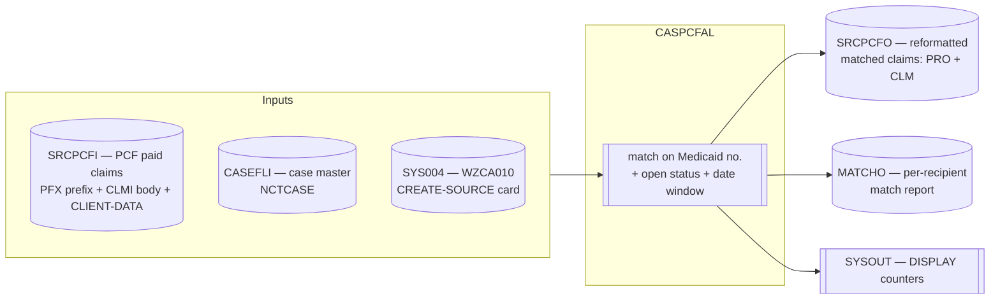

# CASPCFAL — Input / Output Mapping (with Sample Examples)

> Companion to **`CASPCFAL_NEW logic.md`** and **`CASPCFAL_NEW_illustrations.md`**.
> This document maps every business data element the program consumes to what it produces,
> with worked sample values. All field names, `PIC` clauses, literals, and line references
> are taken verbatim from `CASPCFAL.txt` and its copybooks. Illustrative values are dummy.

---

## 1. I/O Overview


```mermaid
flowchart LR
    subgraph Inputs
      P[(SRCPCFI — PCF paid claims<br/>PFX prefix + CLMI body + CLIENT-DATA)]
      C[(CASEFLI — case master<br/>NCTCASE)]
      K[(SYS004 — WZCA010<br/>CREATE-SOURCE card)]
    end
    subgraph CASPCFAL
      M[[match on Medicaid no.<br/>+ open status + date window]]
    end
    Inputs --> M
    M --> O[(SRCPCFO — reformatted<br/>matched claims: PRO + CLM)]
    M --> R[(MATCHO — per-recipient<br/>match report)]
    M --> D[[SYSOUT — DISPLAY counters]]
```

| Direction | Logical file | DDNAME | Record | Key content |
|---|---|---|---|---|
| In | `SRCPCF-IN` | `SRCPCFI` | var 4–32752 | Paid claim: `PFX` prefix, `CLMI` 600-body, `CLMI-CLIENT-DATA` |
| In | `CASEFL-IN` | `CASEFLI` | 384 | Case master (`NCTCASE`) |
| In | `CNTL-CARDS` | `SYS004` | 80 | `CREATE-SOURCE` value |
| Out | `SRCPCF-OUT` | `SRCPCFO` | 754 | Matched claim: `PRO` prefix + `CLM` 601-body |
| Out | `CASE-PCF-MATCH` | `MATCHO` | 80 | Report header / per-recipient line / trailer |
| Out | (DISPLAY) | `SYSOUT` | — | End-of-job counters |

---

## 2. Output Claim **Prefix** (`PRO-CLMPRFX`) — field sources

`INITIALIZE PRO-CLMPRFX` (line 462) runs first, then these moves:

| Output field (`PRO-`) | PIC | Source | Line | Transformation |
|---|---|---|---|---|
| `PRO-RECIPIENT-ID-NUM` | X(20) | `CLMI-PCF-MA-NUM` | 463 | straight (rename) |
| `PRO-HMS-CASE-KEY` | 9(09) | `CASET-HMS-CASE-KEY(i)` | 464–465 | from matched case |
| `PRO-ICN` | X(20) | `CLMI-ICN` | 474 | may be rebuilt by ICN-suffix (637–638) |
| `PRO-FORMER-ICN` | X(20) | `CLMI-FORMER-ICN` | 475 | straight |
| `PRO-XACTION-STATUS` | X(01) | `CLMI-XACTION-STATUS` | 476–477 | straight |
| `PRO-CLM-FROM-DATE` | 9(08) | `PFX-APP-DATE-OF-SERVICE` | 478–479 | claim DOS (`CCYYMMDD`) |
| `PRO-RX-WRITTEN-DATE` | 9(08) | *(none)* | — | **only INITIALIZE → 0** (not populated) |
| `PRO-CLAIM-TRANS-TYPE` | X(01) | `PFX-NET-CLAIM-TRANS-TYPE` | 480–481 | straight |
| `PRO-INCIDENT-DATE` | 9(08) | `WS-INCIDENT-DATE` | 482 | case incident yr+mo, **day=00** |
| `PRO-CLM-THRU-DATE` | 9(08) | `WS-CLM-THRU-DATE` | 483 | case thru date (or `99999999`) |
| `PRO-LAST-HIT-DATE-TM` | 9(16) | *(none)* | — | **only INITIALIZE → 0** |
| `PRO-CREATE-SOURCE` | X(02) | `WS-SAVE-CREATE-SOURCE` ← card | 472–473 | from `SYS004` card |
| `PRO-CLIENT-ID` | X(06) | `CASET-HMS-CLIENT-ID(i)` | 466–467 | from matched case (chg 0012) |
| `PRO-FILLER` | X(13) | *(none)* | — | spaces |

> **Migration note:** `PRO-RX-WRITTEN-DATE`, `PRO-LAST-HIT-DATE-TM`, `PRO-FILLER` are
> **defined but never populated** (they carry INITIALIZE defaults). This is proven by the
> absence of any `MOVE … TO` them.

---

## 3. Output Claim **Body** (`CLM-…`, `FDPCF601`) — field sources

The body copy is a long block of `MOVE CLMI-x TO CLM-x` (lines 492–624). Three of them
are **not** a plain same-name copy; the rest are 1:1 straight moves.

### 3.1 Transformed / notable body mappings

| Output field | Source | Line | Transformation |
|---|---|---|---|
| `CLM-PROCEDURE-CODE-7` | `CLMI-PROCEDURE-CODE-5` | 494–495 | 5-byte → **7-byte** (left-justified); may be replaced by `AL#-INST-HDR-SURG-CD(1)` in `5100/5200/5300` |
| `CLM-PROV-OF-SVC-NUM` | `CLMI-PROV-OF-SVC-NUM` | 493 | if dummy `09999996` + contract `0032600`, source is first replaced by `CLMI-PAY-TO-PROV-NUM` (484–488) |
| `CLM-ICN` | `CLMI-ICN` | 521 | may be rebuilt as 17-char ICN + 2-char suffix (639–640) |
| `CLM-PRI-DX` | `CLMI-PRI-DX` | 522 | 5→7 byte; may be overlaid by `AL#-…-DIAG(1)` |
| `CLM-SEC-DX` | `CLMI-SEC-DX` | 523 | 5→7 byte; may be overlaid by `AL#-…-DIAG(2)` |
| `CLM-DX-3` / `CLM-DX-4` / `CLM-DX-5` | `CLMI-DX-3/4/5` | 595–597 | 5→7 byte; may be overlaid by `AL#-…-DIAG(3..5)` |
| `CLM-CDE-ICD-VERSION` | *(set by overlay + normalise)* | 646–657 | `'0 '`/`' 0'`→`'10'`, else `'9'`; reset `'9'` after write |

### 3.2 Straight 1:1 body moves (`CLM-x ← CLMI-x`, same suffix)

Proven at the cited lines; every one is a direct `MOVE` with no transformation:

`PCF-MA-NUM`(492) · `PROCEDURE-CODE-MOD1`(496–497) · `PROCEDURE-CODE-MOD2`(498–499) ·
`SURGERY-DATE`(500) · `PROC-CODE-DENTAL`(501) · `CLM-TYPE`(502) · `ORIG-CLM-TYPE`(503) ·
`CATG-OF-SVC`(504) · `TYPE-OF-SVC`(505) · `PLACE-OF-SVC`(506) · `DRG`(507) ·
`LEVEL-OF-CARE-IND`(508) · `CLAIM-FORM-IND`(509) · `PAT-LAST-NAME`(510) ·
`PAT-FIRST-NAME`(511) · `PAT-MID-INIT`(512) · `PAT-SEX`(513) · `PAT-DOB`(514) ·
`XACTION-TYPE`(515) · `XACTION-STATUS`(516) · `DOR`(517) · `REMIT-ID-NUM`(518) ·
`ADJ-IND`(519) · `ADJ-REASON`(520) · `UNIT-VISITS-DAYS`(524) · `CLAIM-FROM-DOS`(525) ·
`CLAIM-THRU-DOS`(526) · `RECORD-THRU-DOS`(527) · `ADMIT-DATE`(528) · `DISCH-DATE`(529) ·
`ELIG-INPAT-DAYS`(530) · `INELIG-INPAT-DAYS`(531) · `NATURE-HSP-ADMISSION`(532–533) ·
`PAT-STATUS-CODE`(534) · `TRAUMA-IND`(535) · `TPL-ACCIDENT-IND`(536) · `PROV-CLAIM-NUM`(537) ·
`MA-BILLED-HDR`(538) · `OTHER-INS-PAID-HDR`(539–540) · `MC-COINS-DTL`(541) ·
`MC-DEDUCT-DTL`(542) · `DRG-ALLOWED`(543) · `MA-BILLED-NET-HDR`(544) · `TOT-MA-PAID-HDR`(545) ·
`MC-ALLOWED-DTL`(546) · `OTHER-INS-PAID-DTL`(547–548) · `MA-BILLED-NET-DTL`(549) ·
`MA-PAID-DTL`(550) · `PROV-TYPE`(551) · `PAY-TO-PROV-NUM`(552) · `REFER-PROV-NUM`(553) ·
`PROV-SPECIALTY`(554) · `RX-SUPPLY-DAYS`(555) · `RX-REFILL-IND`(556) · `VERSION-NUMBER`(557) ·
`PCF-MC-NUM`(558) · `MC-ATTACHMENT-IND`(559) · `MC-FORCE-IND`(560) ·
`MC-BENEFITS-EXHAUSTED`(561–562) · `FAMILY-PLANNING-IND`(563–564) · `MULTI-MATCH-IND`(565) ·
`RUNTIME-SEQ-NUM`(566) · `NUM-REV-CHARGES`(567) · `NUM-OTH-SEGS`(568) · `FILE-DATA-SOURCE`(569) ·
`PCF-CONTRACT-NUM`(570) · `CLAIM-EMERGENCY-IND`(571–572) · `STAT-DOLLARS-HDR-OR-DTL`(573–574) ·
`SUMMED-BILL-ANC-DOLLARS`(575–576) · `BILL-TYPE`(577) · `RECORD-FROM-DOS-DTL`(578–579) ·
`FORMER-ICN`(580) · `SRC-LINE-ITEM-DTL-CNT`(581–582) · `NET-DUPE-DATE`(583–584) ·
`OTP-COB-IND`(585–586) · `PM-USER-AREA`(587) · `PM-USER-AREA-2`(588) ·
`XWALKED-PROC-CODE1`(589–590) · `APPLIED-INCOME`(591) · `NUM-LEAVE-DAYS`(592) · `RATE-PAID`(593) ·
`FACILITY-PROV-NUM`(594) · `INST-ADDITIONAL-FIELDS`(598–599) · `NEW-DRG`(600) ·
`PROV-NUM-FROM-PREFIX`(601–602) · `DATE-REFORMATTED`(603) · `SYS-DELETE-STATUS`(604) ·
`STAMP-DATE-TIME`(605) · `STAMP-SEQ-NUM`(606) · `ORIG-TOT-MA-PAID-HDR`(607–608) ·
`ORIG-MA-PAID-DTL`(609–610) · `PCF-CLASSIFICATION-STAT`(611–612) ·
`PCF-CLASSIFICATION-DATE`(613–614) · `PCF-IN-PROGRESS-IND`(615–616) ·
`PCF-LOGICAL-DELETE-IND`(617–618) · `PCF-HMS-ICN-SUFFIX`(619–620) · `PCF-FILE-NAME`(621–622) ·
`PCF-VERSION-NUMBER`(623–624).

> `CLM-AGENCY-CD` (present only in `FDPCF601`, chg 015) has **no** source `MOVE` and is
> therefore left at its copybook `VALUE SPACES`. **[Proven by absence.]**

---

## 4. ICD-10 Overlay Mapping (`AL#` client data → `CLM-…`)

Only when `PFX-SYS-HMS-ASSIGN-FILE(1:4)='MAMA'` and version `03/04/05`
(`5300/5200/5100`). Source = `CLMI-CLIENT-DATA` reinterpreted as `AL#-INST` / `AL#-PHYS` /
`AL#-RX` (the byte-16 claim-type letter selects which):

| Claim type (`AL#-INST-CLAIM-TYPE-ALPHA`) | Source array | Target output fields | Counter |
|---|---|---|---|
| `I` `L` `O` `A` `C` (institutional) | `AL#-INST-DIAG(1..5)` + `AL#-INST-CDE-ICD-VERSION` | `CLM-PRI-DX`, `CLM-SEC-DX`, `CLM-DX-3`, `CLM-DX-4`, `CLM-DX-5`, `CLM-CDE-ICD-VERSION` | `VER-#-INST-ILOAC` |
| (same) header surgical | `AL#-INST-HDR-SURG-CD(1)` | `CLM-PROCEDURE-CODE-7` | `VER-#-PROC-CD` |
| `M` `B` (physician) | `AL#-PHYS-DIAG(1..5)` + `AL#-PHYS-CDE-ICD-VERSION` | `CLM-PRI-DX` … `CLM-DX-5`, `CLM-CDE-ICD-VERSION` | `VER-#-PROF-MB` |
| `P` `Q` (pharmacy) | *(none — no diagnosis)* | *(none)* | `VER-#-RX-PQ` |

Index → target (proven `EVALUATE WS-LPR`, lines 760–796 etc.):
`1→CLM-PRI-DX`, `2→CLM-SEC-DX`, `3→CLM-DX-3`, `4→CLM-DX-4`, `5→CLM-DX-5`
(each only when the source diag/version is not spaces).

---

## 5. Match Report (`MATCHO`) Mapping

| Record | Produced by | Content / source |
|---|---|---|
| **Header** | `1700` (355–359) | Fixed labels: `* CASE ID * PCF RECORDS MATCHED * PCF TOT $$ MA PAID *`, then a blank line |
| **Detail (per recipient)** | `2100` (1213–1235) | `MATCH-CASE-ID-OUT ← WS-CASE-ID` (`= CASET-RECIPIENT-ID-NUM(1)`); `MATCH-TOT-PCF-REC-OUT ← WS-TOT-PCF-REC-MATCH`; `MATCH-TOT-PCF-MA-PAID-OUT ← WS-TOT-PCF-MA-PAID` (edited). If `SIZE-ERROR`: text `'TOO MANY MATCHES, $$ PAID NOT AVAILABLE !'` |
| **Trailer** | `9100` (1353–1362) | If `REC-WRITE-CTR=0` → `'NO MATCHED PCF RECORDS FOUND'`; then blank line; then a line of `*` |

Where the report totals come from:

* `WS-TOT-PCF-REC-MATCH` = count of output claims written for the recipient (`ADD 1`, line 661).
* `WS-TOT-PCF-MA-PAID` = Σ `CLMI-TOT-MA-PAID-HDR` over those writes (`ADD`, line 664).

---

## 6. End-of-Job Counters (`SYSOUT` DISPLAY) Mapping

| Counter (source) | Incremented at | DISPLAY label (line) |
|---|---|---|
| `PCF-REC-READ-CTR` | 323 (each PCF read) | `NUMBER OF PCF RECORDS READ` (1268) |
| `REC-SKIP-PROV` | 393 | `NUMBER OF SKIPPED PCF RECORDS PR0V=09999996` (1271) |
| `REC-SKIP-DSS` | 386 | `NUMBER OF SKIPPED DSS RECORDS > 2003` (1274) |
| `CASE-REC-READ-CTR` | 334 (each case read) | `NUMBER OF CASE RECORDS READ` (1277) |
| `OPEN-CASES-READ-CTR` | 336 (open case read) | `NUMBER OF OPEN CASE RECORDS READ` (1280) |
| `OPEN-CASES-MATCH-OK-CTR` | 469 (case first matched) | `… OPEN CASE RECORDS MATCHED TO PCF` (1283) |
| `OPEN-CASES-NO-MATCH-CTR` | `= READ − MATCH-OK` (1255) | `… OPEN CASE RECORDS NOT MATCHED TO PCF` (1286/1335) |
| `REC-WRITE-CTR` | 644 (each output claim) | `PCF RECORDS MATCHED TO OPEN CASES AND WRITTEN` (1290/1338) |
| `VER-5-INST-ILOAC` | 797 | `PCF RECORDS INST ILOA OR C UPDATED V5` (1293) |
| `VER-5-PROC-CD` | 809 | `… PROC CD UPDATED V5` (1296) |
| `VER-5-PROF-MB` | 859 | `… PROF M OR B UPDATED V5` (1299) |
| `VER-5-RX-PQ` | 865 | `… RX P OR Q UPDATED V5` (1302) |
| `VER-4-INST-ILOAC / -PROC-CD / -PROF-MB / -RX-PQ` | 922/934/984/990 | `… V4` labels (1305–1315) |
| `VER-3-INST-ILOAC / -PROC-CD / -PROF-MB / -RX-PQ` | 1047/1059/1109/1115 | `… V3` labels (1317–1327) |
| `VER-2` | 1126 | `PCF RECORDS V2` (1329) |
| `VER-1` | 1200 | `PCF RECORDS V1` (1332) |
| `OTHER-VERS` | 1208 | `PCF RECORDS OTHER` (1341) |

All are edited through `NUM-REC-OUT` `PIC ZZZ,ZZZ,ZZ9` (line 233).

---

## 7. Worked End-to-End Example

### 7.1 Inputs

**Control card (`SYS004`)** → `WS-SAVE-CREATE-SOURCE = "00"`.

**Case file (`CASEFLI`, sorted ascending by recipient) — 3 records for one recipient**
```
#  CLIENT  CASE-KEY   RECIPIENT-ID-NUM      STATUS INCIDENT     THRU
1  ALCL01  000123456  20000000000000000777  O      2001-03-15   2002-06-30
2  ALCL01  000123457  20000000000000000777  O      2001-01-01   (blank)
3  ALCL01  000123458  20000000000000000777  C      2000-01-01   2005-12-31
(next) …………………………  20000000000000000999  …
```

**PCF claim (`SRCPCFI`)**
```
PFX-SYS-HMS-ASSIGN-FILE : MAMA        PFX-SYS-VERSION : 05
PFX-SYS-EXIT-FROM-REF-STATUS : Y       PFX-NET-CLAIM-TRANS-TYPE : P
PFX-APP-MEDICAID-NO     : 20000000000000000777
PFX-APP-DATE-OF-SERVICE : 20010401
CLMI-PCF-MA-NUM         : 20000000000000000777
CLMI-PROV-OF-SVC-NUM    : 333333333333333    CLMI-PCF-CONTRACT-NUM : 0032600
CLMI-ICN                : ICN0000000000000042    CLMI-TOT-MA-PAID-HDR : 000000275.50
CLMI-CLIENT-DATA(16:1)  : I    AL5-INST-DIAG(1) : J189    AL5-INST-CDE-ICD-VERSION(1): 0
```

### 7.2 Processing

* Envelope filters (ref-status Y, not DSS, not dummy provider) → **pass**.
* Branch A: load table with the 3 cases; `TABLE-ENTRIES = 3`.
* Process claim vs table:

| Case | Open? | DOS 20010401 window | Result |
|---|---|---|---|
| #1 (thru 20020630) | O | `20010301 ≤ 20010401 ≤ 20020630` | **WRITE #1** (case-key 000123456) |
| #2 (thru blank→99999999) | O | `20010101 ≤ 20010401 ≤ 99999999` | **WRITE #2** (case-key 000123457) |
| #3 | C | gated at 457 | skip |

### 7.3 Outputs

**`SRCPCFO` — two matched claims (key fields)**
```
OUT#1  PRO-RECIPIENT-ID-NUM=20000000000000000777  PRO-HMS-CASE-KEY=000123456
       PRO-CLIENT-ID=ALCL01  PRO-CLM-FROM-DATE=20010401  PRO-CREATE-SOURCE=00
       PRO-INCIDENT-DATE=20010300  PRO-CLM-THRU-DATE=20020630
       CLM-PRI-DX=J189  CLM-CDE-ICD-VERSION=10  CLM-TOT-MA-PAID-HDR=275.50
OUT#2  (same claim data)  PRO-HMS-CASE-KEY=000123457  PRO-CLM-THRU-DATE=99999999
```

**`MATCHO` — report**
```
 * CASE ID              * PCF RECORDS MATCHED * PCF TOT $$ MA PAID *
                                                                            (blank)
 * 20000000000000000777 * 2                   * $551.00               *
                                                                            (blank)
********************************************************************************
```
(`2` writes; `$275.50 × 2 = $551.00`.)

**`SYSOUT` — counters (relevant lines)**
```
NUMBER OF PCF RECORDS READ................... :           1
NUMBER OF CASE RECORDS READ.................. :           4   (3 + 1 look-ahead)
NUMBER OF OPEN CASE RECORDS READ............. :           2
NUMBER OF OPEN CASE RECORDS MATCHED TO PCF... :           2
NUMBER OF OPEN CASE RECORDS NOT MATCHED TO PCF:           0
PCF RECORDS MATCHED TO OPEN CASES AND WRITTEN :           2
PCF RECORDS INST ILOA OR C UPDATED V5        :           2
```
> `CASE-REC-READ-CTR = 4`: the 3 cases plus the one look-ahead read that detects the next
> recipient (this is how `3010` decides the recipient ended) — **[Inferred from the read
> sequence in `3010`]**; exact count depends on data ordering.

---

## 8. Business-Information Coverage

| Business element | Input source | Output target(s) | Rule |
|---|---|---|---|
| Recipient identity | `PFX-APP-MEDICAID-NO` / `CLMI-PCF-MA-NUM` | `PRO-RECIPIENT-ID-NUM`, `CLM-PCF-MA-NUM` | match key R4 |
| Case identity | `CASET-HMS-CASE-KEY`, `CASET-HMS-CLIENT-ID` | `PRO-HMS-CASE-KEY`, `PRO-CLIENT-ID` | R8/output |
| Claim identity | `CLMI-ICN`, `CLMI-FORMER-ICN` | `PRO-ICN`/`CLM-ICN`, `CLM-FORMER-ICN` | R10 ICN reformat |
| Service date | `PFX-APP-DATE-OF-SERVICE` | `PRO-CLM-FROM-DATE` | R6 window |
| Case date window | `CASET-INCIDENT-DATE`, `CASET-CLAIMS-THRU-DATE` | `PRO-INCIDENT-DATE`, `PRO-CLM-THRU-DATE` | R6 |
| Case status | `CASET-CASE-STATUS-CODE` | (gate only) | R5 open |
| Money (MA paid) | `CLMI-TOT-MA-PAID-HDR` | `CLM-TOT-MA-PAID-HDR`, report `$` | R13 |
| Transaction type | `PFX-NET-CLAIM-TRANS-TYPE` | `PRO-CLAIM-TRANS-TYPE` | output |
| Provider | `CLMI-PROV-OF-SVC-NUM`, `CLMI-PAY-TO-PROV-NUM` | `CLM-PROV-OF-SVC-NUM` | R3/R9 |
| Diagnosis (ICD-10) | `AL#-INST/PHYS-DIAG`, `AL#-…-CDE-ICD-VERSION` | `CLM-PRI-DX…DX-5`, `CLM-CDE-ICD-VERSION` | R11/R12 |
| Procedure | `AL#-INST-HDR-SURG-CD(1)` / `CLMI-PROCEDURE-CODE-5` | `CLM-PROCEDURE-CODE-7` | R12 |
| Create source | `SYS004` card (`WZCA010`) | `PRO-CREATE-SOURCE` | R8 |
| Contract routing | `CLMI-PCF-CONTRACT-NUM`, `CLMI-PM-USER-AREA` | (gates) | R2/R9/R10 |
| Version routing | `PFX-SYS-HMS-ASSIGN-FILE`, `PFX-SYS-VERSION` | (selects overlay) | R12 |

**Not carried to output (business elements consumed only as controls):**
`PFX-SYS-EXIT-FROM-REF-STATUS` (R1 filter), `CLMI-CLAIM-FROM-DOS` (R2 DSS test only —
note the *header* `CLM-CLAIM-FROM-DOS` is separately copied at line 525), `CASET-CASE-STATUS-CODE`.

**Output fields with no input source (defaults):** `PRO-RX-WRITTEN-DATE`,
`PRO-LAST-HIT-DATE-TM`, `PRO-FILLER`, `CLM-AGENCY-CD`.

---

### Evidence key

* **Proven** — everything cited with a line number above.
* **[Inferred]** — the `CASE-REC-READ-CTR` example value and the "year of service" naming.
* **[Not proven]** — real dataset values (all sample values are dummy); downstream/upstream
  programs other than the SORT/IDCAMS steps in `PWTALY05.txt`.
