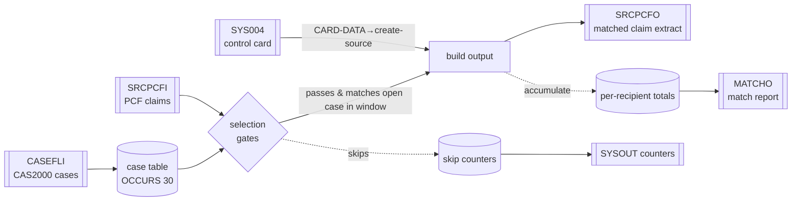

# CASPCFAL — End-to-End Input/Output Mapping (with Business Examples)

> Companion to **`CASPCFAL_NEW logic.md`** and **`CASPCFAL_NEW_illustrations.md`**. This document is the **data-lineage / field-mapping** view: for every output field the program populates, it names the **source field(s)**, the **transformation rule**, and the **source evidence** (line numbers in `CASPCFAL.txt` / copybook). It is **strictly source-based**; business meaning is asserted only where code/comments prove it. Dummy values in the worked examples are fictional and clearly labelled.

---

# 1. Purpose of this mapping
`CASPCFAL` is a **match-and-reformat extract**: it reads PCF claims and CAS2000 cases, and for each claim that matches an **open case** in a **date window**, it emits a reformatted claim record plus a per-recipient report line. This document maps:
1. **Inputs → matching/decision fields** (how records are selected),
2. **Inputs → output extract record** (`SRCPCF-OUT`, field by field),
3. **Inputs → match report** (`CASE-PCF-MATCH`),
4. **Counters → SYSOUT** DISPLAY.

---

# 2. File inventory (DD ↔ logical ↔ record)

| DD (`ASSIGN`) | Logical file | Dir | Record | Len | Buffer copybook(s) |
|---|---|---|---|---|---|
| `SRCPCFI` | `SRCPCF-IN` | In | `CLMI-RECORD` | ≤32752 (var, `MODE S`) | `TPLPREFX`(PFX)+`FDPCF602`(CLMI)+client X(32025) |
| `CASEFLI` | `CASEFL-IN` | In | `CASE-RECORD` | 384 (F) | `NCTCASE`(CASE) |
| `SYS004` | `CNTL-CARDS` | In | `CNTL-REC` | 80 (F) | inline `CARD-REC` |
| `SRCPCFO` | `SRCPCF-OUT` | Out | `CLMO-RECORD` | 754 (F) | `CLMPREFX`(PRO)+`FDPCF601`(CLM) |
| `MATCHO` | `CASE-PCF-MATCH` | Out | `MATCH-RECORD` | 80 (F) | `WS-MATCH-OUT` / `WS-MATCH-PROCESS-FIELDS` |
| *(SYSOUT)* | `DISPLAY` | Out | counter lines | — | `WS-COUNTERS` |

> DD-to-dataset bindings are **Referenced but implementation not available** (no JCL in repo).

---

# 3. End-to-end pipeline



---

# 4. Selection / matching fields (inputs → decision)

These fields never appear in the output as "copied"; they **drive whether an output is produced**.

| Decision | Source field(s) | Rule / literal | Evidence |
|---|---|---|---|
| Advance case file | `CASE-RECIPIENT-ID-NUM` vs `PFX-APP-MEDICAID-NO` | read cases while case `<` claim key | 365–368 |
| Include claim | `PFX-SYS-EXIT-FROM-REF-STATUS` | must `= 'Y'` else skip | 372–375 |
| Exclude DSS | `CLMI-PCF-CONTRACT-NUM`, `CLMI-PM-USER-AREA(27:3)`, `CLMI-CLAIM-FROM-DOS` | `='0032600'` & `='DSS'` & `0040000<dos<0900000` → skip | 377–389 |
| Exclude dummy prov | `CLMI-PROV-OF-SVC-NUM`, `CLMI-PAY-TO-PROV-NUM` | both `='09999996'` → skip | 391–396 |
| Recipient group | `CASE-RECIPIENT-ID-NUM`, `CASET-RECIPIENT-ID-NUM(1)`, `PFX-APP-MEDICAID-NO` | new vs reuse table | 398–424 |
| Open case | `CASET-CASE-STATUS-CODE(n)` | `='O' OR X'96'` | 457–458 |
| Date lower | `PFX-APP-DATE-OF-SERVICE` vs `WS-INCIDENT-DATE-NEW-RE` | `>=` (incident YYYYMM + day 01) | 460 |
| Date upper | `PFX-APP-DATE-OF-SERVICE` vs `WS-CLM-THRU-DATE-N` | `<=` (thru, or `99999999` if blank) | 461 |
| Version route | `PFX-SYS-HMS-ASSIGN-FILE(1:4)`, `PFX-SYS-VERSION` | `'MAMA'` + `'05'..'01'/other` | 686–720 |
| Claim type | `AL{5,4,3}-INST-CLAIM-TYPE-ALPHA` | `I/L/O/A/C` \| `M/B` \| `P/Q` | 751/813/863 … |

---

# 5. Output extract record `SRCPCF-OUT` (754 bytes) — field map

The output = **`PRO` prefix** (`CLMPREFX`) + **`CLM` body** (`FDPCF601`). Population happens in `3020-READ-CASE-TABLE` (462–624), `3030`/`5100`+ (diagnosis), and the ICN/ICD post-steps.

## 5.1 Prefix `PRO-CLMPRFX` (from mixed sources)

| Output field (`PRO-`) | PIC | Source | Rule | Evidence |
|---|---|---|---|---|
| `PRO-RECIPIENT-ID-NUM` | X(20) | `CLMI-PCF-MA-NUM` | move | 463 |
| `PRO-HMS-CASE-KEY` | 9(09) | `CASET-HMS-CASE-KEY(n)` | move (matched case) | 464 |
| `PRO-ICN` | X(20) | `CLMI-ICN` (or reformatted, §5.4) | move | 474 |
| `PRO-FORMER-ICN` | X(20) | `CLMI-FORMER-ICN` | move | 475 |
| `PRO-XACTION-STATUS` | X(01) | `CLMI-XACTION-STATUS` | move | 476 |
| `PRO-CLM-FROM-DATE` | 9(08) | `PFX-APP-DATE-OF-SERVICE` | move | 478 |
| `PRO-RX-WRITTEN-DATE` | 9(08) | *(none)* | left at `INITIALIZE PRO-CLMPRFX` value (462) | — |
| `PRO-CLAIM-TRANS-TYPE` | X(01) | `PFX-NET-CLAIM-TRANS-TYPE` | move | 480 |
| `PRO-INCIDENT-DATE` | 9(08) | `WS-INCIDENT-DATE` | move (day = `00`, see note) | 482 |
| `PRO-CLM-THRU-DATE` | 9(08) | `WS-CLM-THRU-DATE` | move | 483 |
| `PRO-LAST-HIT-DATE-TM` | 9(16) | *(none)* | left at INITIALIZE value | — |
| `PRO-CREATE-SOURCE` | X(02) | `WS-SAVE-CREATE-SOURCE` ← `CARD-DATA(1:2)` | move (mod 0005) | 472–473 |
| `PRO-CLIENT-ID` | X(06) | `CASET-HMS-CLIENT-ID(n)` | move (mod 0012) | 466 |
| `PRO-FILLER` | X(13) | *(none)* | INITIALIZE value | — |

> **Date note:** `WS-INCIDENT-DATE` day is `00` because `4000-FORMAT-DATE` unstrings only year+month; the day-`01` form (`WS-INCIDENT-DATE-NEW-RE`) is used only for the comparison, not for output. (logic §5.4)

## 5.2 Body `CLM-HMS-601` — straight identity copies `CLMI-x → CLM-x`
All moves below are 1:1 same-suffix copies (492–624). Where the output PIC is **wider** (ICD-10), the value is left-justified into the wider field.

```
PCF-MA-NUM            PROV-OF-SVC-NUM(§5.3)  PROCEDURE-CODE-MOD1   PROCEDURE-CODE-MOD2
SURGERY-DATE          PROC-CODE-DENTAL       CLM-TYPE              ORIG-CLM-TYPE
CATG-OF-SVC           TYPE-OF-SVC            PLACE-OF-SVC          DRG
LEVEL-OF-CARE-IND     CLAIM-FORM-IND         PAT-LAST-NAME         PAT-FIRST-NAME
PAT-MID-INIT          PAT-SEX                PAT-DOB               XACTION-TYPE
XACTION-STATUS        DOR                    REMIT-ID-NUM          ADJ-IND
ADJ-REASON            ICN(§5.4)              PRI-DX*               SEC-DX*
UNIT-VISITS-DAYS      CLAIM-FROM-DOS         CLAIM-THRU-DOS        RECORD-THRU-DOS
ADMIT-DATE            DISCH-DATE             ELIG-INPAT-DAYS       INELIG-INPAT-DAYS
NATURE-HSP-ADMISSION  PAT-STATUS-CODE        TRAUMA-IND            TPL-ACCIDENT-IND
PROV-CLAIM-NUM        MA-BILLED-HDR          OTHER-INS-PAID-HDR    MC-COINS-DTL
MC-DEDUCT-DTL         DRG-ALLOWED            MA-BILLED-NET-HDR     TOT-MA-PAID-HDR
MC-ALLOWED-DTL        OTHER-INS-PAID-DTL     MA-BILLED-NET-DTL     MA-PAID-DTL
PROV-TYPE             PAY-TO-PROV-NUM        REFER-PROV-NUM        PROV-SPECIALTY
RX-SUPPLY-DAYS        RX-REFILL-IND          VERSION-NUMBER        PCF-MC-NUM
MC-ATTACHMENT-IND     MC-FORCE-IND           MC-BENEFITS-EXHAUSTED FAMILY-PLANNING-IND
MULTI-MATCH-IND       RUNTIME-SEQ-NUM        NUM-REV-CHARGES       NUM-OTH-SEGS
FILE-DATA-SOURCE      PCF-CONTRACT-NUM       CLAIM-EMERGENCY-IND   STAT-DOLLARS-HDR-OR-DTL
SUMMED-BILL-ANC-DOLLARS  BILL-TYPE           RECORD-FROM-DOS-DTL   FORMER-ICN
SRC-LINE-ITEM-DTL-CNT NET-DUPE-DATE          OTP-COB-IND           PM-USER-AREA
PM-USER-AREA-2        XWALKED-PROC-CODE1     APPLIED-INCOME        NUM-LEAVE-DAYS
RATE-PAID             FACILITY-PROV-NUM      DX-3*                 DX-4*
DX-5*                 INST-ADDITIONAL-FIELDS NEW-DRG               PROV-NUM-FROM-PREFIX
DATE-REFORMATTED      SYS-DELETE-STATUS      STAMP-DATE-TIME       STAMP-SEQ-NUM
ORIG-TOT-MA-PAID-HDR  ORIG-MA-PAID-DTL       PCF-CLASSIFICATION-STAT  PCF-CLASSIFICATION-DATE
PCF-IN-PROGRESS-IND   PCF-LOGICAL-DELETE-IND PCF-HMS-ICN-SUFFIX    PCF-FILE-NAME
PCF-VERSION-NUMBER
```
`* PRI-DX, SEC-DX, DX-3/4/5` are copied here as-is (`X(05)→X(07)`), then **may be overwritten** by the diagnosis extraction in §5.5 if the client `AL` record supplies values.

## 5.3 Transformed / non-identity body fields

| Output field | Source | Transformation | Evidence |
|---|---|---|---|
| `CLM-PROCEDURE-CODE-7` (X07) | `CLMI-PROCEDURE-CODE-5` (X05) | **rename + widen**; later possibly overwritten by `AL{n}-INST-HDR-SURG-CD(1)` (institutional) | 494–495; 807/932/1057 |
| `CLM-PROV-OF-SVC-NUM` | `CLMI-PROV-OF-SVC-NUM` **after** substitution | if `CLMI-PROV-OF-SVC-NUM='09999996'` & contract `'0032600'` → source becomes `CLMI-PAY-TO-PROV-NUM` | 484–488, 493 |

## 5.4 ICN reformat (post-copy, mod 0008)

| Output field | Source | Rule | Evidence |
|---|---|---|---|
| `PRO-ICN` **and** `CLM-ICN` | `CLMI-ICN(1:17)` ‖ `CLMI-PCF-HMS-ICN-SUFFIX(2)` | only if `PM(1:2)∈{PB,DT}` & contract `'0032600'` & `PM(27:3)≠'DSS'` & suffix numeric & ≠0; if suffix `=0` → `CONTINUE` (unchanged) | 626–643 |

## 5.5 Diagnosis / procedure overlay (from client-side `AL` record)

Only when `PFX-SYS-HMS-ASSIGN-FILE(1:4)='MAMA'` and version ∈ {05,04,03}; `CLMI-CLIENT-DATA` is redefined as `AL{5,4,3}` records.

| Output field | Source (institutional `I/L/O/A/C`) | Source (professional `M/B`) | Rule | Evidence |
|---|---|---|---|---|
| `CLM-PRI-DX` | `AL{n}-INST-DIAG(1)` | `AL{n}-PHYS-DIAG(1)` | move if not spaces | 763/825 … |
| `CLM-SEC-DX` | `…-INST-DIAG(2)` | `…-PHYS-DIAG(2)` | move if not spaces | 770/832 … |
| `CLM-DX-3` | `…-INST-DIAG(3)` | `…-PHYS-DIAG(3)` | move if not spaces | 777/839 … |
| `CLM-DX-4` | `…-INST-DIAG(4)` | `…-PHYS-DIAG(4)` | move if not spaces | 784/846 … |
| `CLM-DX-5` | `…-INST-DIAG(5)` | `…-PHYS-DIAG(5)` | move if not spaces | 791/853 … |
| `CLM-CDE-ICD-VERSION` | `…-INST-CDE-ICD-VERSION(k)` | `…-PHYS-CDE-ICD-VERSION(k)` | last non-space wins; then §5.6 remap | 766/828 … |
| `CLM-PROCEDURE-CODE-7` | `AL{n}-INST-HDR-SURG-CD(1)` | *(n/a)* | institutional only, slot 1 | 807/932/1057 |

Pharmacy (`P/Q`): no overlay; only `VER-{n}-RX-PQ` counter. Versions 02/01/other and non-MAMA: **no overlay**.

## 5.6 Derived field `CLM-CDE-ICD-VERSION` (final stamp)

| Value before stamp | Written value | Evidence |
|---|---|---|
| `'0 '` or `' 0'` | `'10'` | 647–650 |
| anything else | `'9'` | 651–652 |
| *(after each write)* | reset to `'9'` | 657 |

---

# 6. Match report `CASE-PCF-MATCH` (80 bytes) — field map

Three record shapes are written to `MATCHO`:

**(a) Header** — written once (`1700`, 355–359). The record `WS-MATCH-OUT` (168–177) is 68 bytes of content (padded to 80). Titles come from the field **`VALUE` clauses**, and fixed `' * '` FILLERs separate the columns:

| Offset | Field | PIC | Header `VALUE` |
|---|---|---|---|
| 1 | `F` | X(03) | `' * '` |
| 4 | `MATCH-CASE-ID-OUT` | X(20) | `CASE ID` |
| 24 | `F` | X(03) | `' * '` |
| 27 | `MATCH-TOT-PCF-REC-OUT` | X(19) | `PCF RECORDS MATCHED` |
| 46 | `F` | X(03) | `' * '` |
| 49 | `MATCH-TOT-PCF-MA-PAID-OUT` | X(18) | `PCF TOT $$ MA PAID` |
| 67 | `F` | X(02) | `' *'` |

Rendered header line: `` * CASE ID              * PCF RECORDS MATCHED * PCF TOT $$ MA PAID *``. The **detail** line (b) reuses the same three named fields, overwriting their values via `MOVE`.

**(b) Detail line** — per recipient (`2100`, 1213–1238):

| Output col | Source | Transformation | Evidence |
|---|---|---|---|
| `MATCH-CASE-ID-OUT` | `WS-CASE-ID` ← `CASET-RECIPIENT-ID-NUM(1)` | move | 660,1215 |
| `MATCH-TOT-PCF-REC-OUT` | `WS-TOT-PCF-REC-MATCH` | edit `ZZZZ9`, strip leading spaces (`INSPECT TALLYING`) | 1217–1222 |
| `MATCH-TOT-PCF-MA-PAID-OUT` | `WS-TOT-PCF-MA-PAID` | edit `$$$,$$$,$$$,$$9.99`, strip leading spaces | 1224–1229 |
| *(overflow variant)* | — | `'TOO MANY MATCHES, $$ PAID NOT AVAILABLE !'` when `SIZE-ERROR` | 1230–1233 |

`WS-TOT-PCF-REC-MATCH` = count of matched claims for the recipient (`+1` per write, 661). `WS-TOT-PCF-MA-PAID` = Σ `CLMI-TOT-MA-PAID-HDR` for matched claims (664).

**(c) Trailer** — at EOJ (`9100`, 1353–1362): optional `NO MATCHED PCF RECORDS FOUND` (if `REC-WRITE-CTR=0`), a blank line, and an all-`*` line.

---

# 7. SYSOUT counters (DISPLAY) — source map

Emitted in `9000-TERMINATION` (1259–1343). Each is `MOVE <ctr> TO NUM-REC-OUT (ZZZ,ZZZ,ZZ9)` then `DISPLAY`.

| DISPLAY label (abbrev) | Counter | Incremented at |
|---|---|---|
| PCF RECORDS READ | `PCF-REC-READ-CTR` | 323 |
| SKIPPED PCF PROV=09999996 | `REC-SKIP-PROV` | 393 |
| SKIPPED DSS > 2003 | `REC-SKIP-DSS` | 386 |
| CASE RECORDS READ | `CASE-REC-READ-CTR` | 334 |
| OPEN CASE RECORDS READ | `OPEN-CASES-READ-CTR` | 336 |
| OPEN CASE MATCHED TO PCF | `OPEN-CASES-MATCH-OK-CTR` | 469 |
| OPEN CASE NOT MATCHED | `OPEN-CASES-NO-MATCH-CTR` | 1255 (computed) |
| PCF MATCHED & WRITTEN | `REC-WRITE-CTR` | 644 |
| INST ILOAC / PROC / PROF / RX (V5/V4/V3) | `VER-{5,4,3}-{INST-ILOAC,PROC-CD,PROF-MB,RX-PQ}` | 797/809/859/865 … |
| PCF V2 / V1 / OTHER | `VER-2` / `VER-1` / `OTHER-VERS` | 1126/1200/1208 |

---

# 8. Business examples (end-to-end)

> All values are **dummy**. Formatting mirrors the copybook PICs.

## Example A — Institutional ICD-10 claim → matched & written

**Control card (`SYS004`):** `CARD-TAG='1'`, `CARD-DATA='AL'` ⇒ `WS-SAVE-CREATE-SOURCE='AL'`.

**Input claim (`SRCPCFI`):**
```
PFX-APP-MEDICAID-NO=00000000000000000123  EXIT-FROM-REF-STATUS=Y
ASSIGN-FILE=MAMA5  VERSION=05  NET-CLAIM-TRANS-TYPE=P
APP-DATE-OF-SERVICE=20150310
CLMI-PCF-MA-NUM=00000000000000000123  CLMI-ICN=ICN00000000000000001
CLMI-XACTION-STATUS=B  CLMI-TOT-MA-PAID-HDR=0000123.45
CLMI-PCF-CONTRACT-NUM=1234567  CLMI-PROV-OF-SVC-NUM=PRV0000000001
client(AL5): INST-CLAIM-TYPE-ALPHA=I  INST-DIAG(1)=E119 v0  INST-DIAG(2)=I10 v0
             INST-HDR-SURG-CD(1)=0SR90ZZ
```

**Matched case (`CASEFLI`, open):**
```
RECIPIENT-ID-NUM=00000000000000000123  HMS-CASE-KEY=000000501
HMS-CLIENT-ID=CLNT01  CASE-STATUS-CODE=O
INCIDENT-DATE=2015-03-15  CLAIMS-THRU-DATE=2015-12-31
```

**Decision:** gate `Y`✔ → not DSS → not dummy-prov → recipient matches C1 (open) → `20150310 ∈ [20150301, 20151231]` ✔ → **WRITE**.

**Output extract (`SRCPCFO`, key fields):**
```
PRO-RECIPIENT-ID-NUM=00000000000000000123   PRO-HMS-CASE-KEY=000000501
PRO-CLIENT-ID=CLNT01                         PRO-CREATE-SOURCE=AL
PRO-ICN=ICN00000000000000001                 PRO-XACTION-STATUS=B
PRO-CLM-FROM-DATE=20150310                    PRO-CLAIM-TRANS-TYPE=P
PRO-INCIDENT-DATE=20150300                    PRO-CLM-THRU-DATE=20151231
CLM-PRI-DX=E119    CLM-SEC-DX=I10    CLM-PROCEDURE-CODE-7=0SR90ZZ
CLM-TOT-MA-PAID-HDR=0000123.45    CLM-CDE-ICD-VERSION=10
```

**Report accumulation:** `WS-CASE-ID=…0123`, matched `=1`, paid `=123.45`.

## Example B — Professional ICD-9 claim (version 03) → matched & written
```
INPUT:  VERSION=03  ASSIGN-FILE=MAMA5  APP-DATE-OF-SERVICE=20140620
        client(AL3): PHYS-CLAIM-TYPE-ALPHA=M  PHYS-DIAG(1)=25000 v9
        (same recipient …0123, matches case C1 window 2013-… assume thru covers)
EFFECT: CLM-PRI-DX=25000 ; CLM-CDE-ICD-VERSION set from '9 ' → '9'
        VER-3-PROF-MB incremented
```
Shows the ICD-9 branch of the version stamp (`'9'`) vs Example A's ICD-10 (`'10'`).

## Example C — Skipped claim (dummy provider) → no output
```
INPUT:  EXIT-FROM-REF-STATUS=Y  PROV-OF-SVC-NUM=09999996  PAY-TO-PROV-NUM=09999996
EFFECT: line 391 true → REC-SKIP-PROV += 1 → read next PCF. No SRCPCFO record,
        no report accumulation.
```

## Example D — Per-recipient report line (as written to `MATCHO`)
After the recipient `…0123` matched 2 claims totalling $246.90, the detail line reuses the header fields with values left-justified (leading spaces stripped by `INSPECT`), separated by `' * '`:
```
 * 00000000000000000123 * 2                   * $246.90            *
```
(If `SIZE-ERROR` had been set, columns 27+ instead read `TOO MANY MATCHES, $$ PAID NOT AVAILABLE !`.)

---

# 9. Fields written from a constant/initialized source (no input lineage)
The following output fields are **not** sourced from an input record; they are the result of `INITIALIZE PRO-CLMPRFX` (462) or copybook `VALUE` defaults and are **Not populated from input** by this program: `PRO-RX-WRITTEN-DATE`, `PRO-LAST-HIT-DATE-TM`, `PRO-FILLER`, plus any `CLM-` field that has no corresponding `MOVE` in §5.2/§5.3/§5.5 (e.g. `CLM-AGENCY-CD` — present in `FDPCF601` line 395 but never assigned). **(Open question:** downstream consumers of these fields rely on defaults; the meaning is not defined in this program.)

---

# 10. Mapping caveats (evidence discipline)
- **Field is copied ≠ field is meaningful:** `CLMI-SYS-DELETE-STATUS` and `CLMI-PCF-LOGICAL-DELETE-IND` are copied to output but **never tested** here — no delete/skip behaviour is driven by them.
- **Overwrite order matters:** `CLM-PRI-DX/SEC-DX/DX-3..5` and `CLM-PROCEDURE-CODE-7` are first set by the straight copy (§5.2/5.3) and **then possibly replaced** by the `AL` overlay (§5.5). The final output reflects the overlay when present.
- **Widening is left-justified:** X(05)→X(07) moves place the value at the left with trailing spaces (standard COBOL alphanumeric move).
- **No `FILE STATUS`** is captured for any file; this mapping covers the **happy path** plus the coded `AT END`/`ON SIZE ERROR` conditions only.
