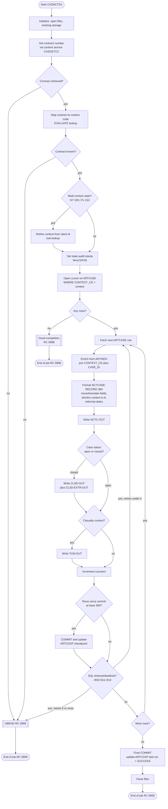
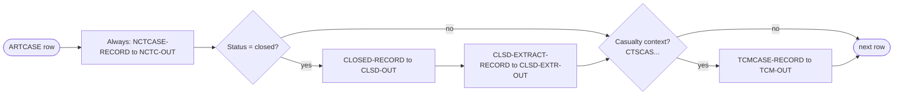

# CASNCTD1 — Process Flow

Two views of the same process: a **Mermaid flowchart** and a **numbered step-by-step**
description. A second Mermaid diagram shows the **per-case routing** decision in detail.

---

## 1. End-to-end flowchart (Mermaid)

---

## 2. Per-case routing detail (Mermaid)

---

## 3. Numbered flow description

1. **Start / initialize.** Open the four output files (`NCTC-OUT`, `TCM-OUT`, `CLSD-OUT`,
   `CLSD-EXTR-OUT`) and any control input; clear working storage and counters.
2. **Contract lookup.** Obtain the **3-digit contract number** for this run from the context
   service (`CASGETCC`) or control input. If retrieval fails → **ABEND 0999** (BR-78).
3. **Context-code mapping.** Translate the contract number to its **context code** via the fixed
   `EVALUATE` lookup (`320→CTSCASNY`, `313→CTSCASFL`, …). Unknown contract → **ABEND 0999**
   (BR-11).
4. **Multi-context refinement.** If the state is **New York (320)** or **Florida (313)**, refine
   the context using the **client id** sub-lookup (casualty / estate / trust / mass-tort / city /
   exchange / option variants). Set the matching **state audit stamp** (`WxxCDF40`).
5. **Context normalization.** If the resolved context code exceeds the **6-character** output slot,
   **shorten** it to its significant left-most 6 characters (BR-14).
6. **DB2 fetch (driver).** Open a cursor / read `ARTCASE` for all cases whose `CONTEXT_CD` matches
   the resolved context (plus any status/date predicates). If **no rows**, end with the
   **good/no-data completion RC 0998** (BR-04/BR-76).
7. **Per-case loop — enrichment.** For each `ARTCASE` row, look up the related **`ARTINDV`** row
   (claimant) using `CONTEXT_CD` + `CASE_ID`. Missing individual → default claimant fields.
8. **Record formatting.** Build the **`NCTCASE-RECORD` (384 bytes)**: move/translate the context
   code, case id, control number; **reformat dates** (incident/open/close, blanking close date for
   open cases); copy raw status and **derive** the `O/C` indicator; add claimant fields; stamp the
   extract date; space-fill filler.
9. **Output writing (primary).** Write the formatted record to **`NCTC-OUT`**.
10. **Closed-case handling.** If the case classifies as **closed**, also write the full
    **`CLOSED-RECORD`** to `CLSD-OUT` and the thin **`CLSD-EXTRACT-RECORD`** to `CLSD-EXTR-OUT`
    (BR-30c).
11. **TCM record generation.** If the resolved context is a **casualty** context (`CTSCAS…`,
    including `CTSCASMT-FL`), write a **`TCMCASE-RECORD`** to `TCM-OUT` (BR-20/BR-22).
12. **Counters & commit.** Increment processed counters; every **300** rows issue a **`COMMIT`**
    and update the **`ARTCCKP`** checkpoint (restart marker) (BR-75).
13. **Timeout/deadlock handling.** On `SQLCODE -904/-911/-913`, **retry** the unit of work up to
    **5** times; beyond that → **ABEND 0999** (BR-73). On `-811` or other negative codes →
    **ABEND 0999** (BR-72/BR-74).
14. **Loop.** Repeat steps 7–13 until the `ARTCASE` cursor is exhausted.
15. **Finalize.** Issue a **final `COMMIT`**, update `ARTCCKP` last-run status to `SUCCESS`, close
    all files.
16. **End of job.** Return **RC 0000** (normal), **RC 0998** (good/no-data), or **RC 0999**
    (error/abend) as appropriate.

---

## 4. Job return codes

| RC / dump code | Meaning | Operator action |
|----------------|---------|-----------------|
| `0000` | Normal completion, records written | None |
| `0998` | Good completion, **no data** to process | None — expected on empty cycles |
| `0999` | Error / abend (unknown contract, `-811`, exhausted retries, service failure, unexpected `SQLCODE`) | Investigate logs; do **not** rerun blindly |
| `3645` | Default dump code baseline | Diagnostic only |

---
*See [business-rules.md](./business-rules.md) for the rules referenced above and
[overview.md](./overview.md) for the data-flow summary.*
