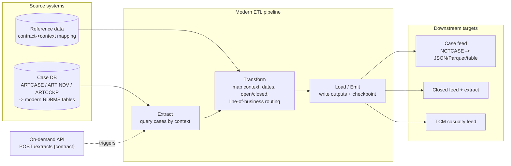

# CASNCTD1 — Technical-to-Business Summary

A plain-English, business-level narrative of what `CASNCTD1` does and why it matters, followed by
the **Implementation Notes for Modernization**.

---

## 1. Why the program exists

Health plans and government health programs (Medicaid and similar) pay medical claims. When a
member's injury or illness was actually **someone else's responsibility** — a car accident, a
work injury, a defective product, a wrongful death handled through an **estate**, or a large
**mass-tort** matter — the payer has the right to **recover** the money it spent. This recovery
work is called **subrogation / casualty recovery**.

To pursue recovery, the business must continuously **identify and hand off the right cases** to the
teams and downstream systems that manage recovery. `CASNCTD1` is the **extract engine** that does
this hand-off: it pulls the relevant **cases** out of the case database and produces standardized
files that downstream recovery systems consume.

## 2. What real-world business process it supports

- **Case intake / feed generation for recovery.** Each run gathers all cases for a given
  **contract** (which represents a *client/state program*), and emits them in a standard format.
- **Open vs closed lifecycle management.** Open cases are actively worked; closed cases are handed
  to closure/reconciliation processes. The program separates these so each downstream system gets
  exactly what it needs.
- **Line-of-business specialization.** Casualty, estate, trust, and mass-tort cases are handled
  differently downstream; the program tags each case with the correct **context code** and routes
  **casualty** cases to the dedicated **TCM** recovery subsystem.
- **State-by-state compliance.** Because subrogation law and data requirements differ by state,
  the program encodes the state and product in the context code so downstream processing follows
  the right rules.

## 3. Which data is pulled from DB2

| Table | Business meaning | What it contributes |
|-------|------------------|---------------------|
| **ARTCASE** | The **case** itself — the accident/injury/estate matter | Identity, dates, status, contract/state — the backbone of every output |
| **ARTINDV** | The **person** (claimant/member) tied to the case | Name, identifiers, demographics for the output records |
| **ARTCCKP** | **Control/checkpoint** bookkeeping per contract-context | Restart safety, last-run markers, commit checkpoints |

## 4. What files are created for downstream systems

| File | Business consumer | Why they need it |
|------|-------------------|------------------|
| **NCTCASE** (`NCTC-OUT`, 384 bytes) | Core case/claims recovery platform | The master feed of all selected cases |
| **CLOSED** (`CLSD-OUT`) | Closed-case processing | Finalized cases to be settled/archived |
| **CLSD-EXTRACT** (`CLSD-EXTR-OUT`) | Reconciliation / audit | Lightweight list to confirm closures line up |
| **TCM** (`TCM-OUT`) | TCM casualty recovery subsystem | Casualty-specific handoff for active recovery |

## 5. Why state-specific logic matters

- **Different statutes, different rights.** New York, Florida, Ohio, California, and the other
  supported states each have their own subrogation/recovery rules and reporting obligations.
- **Different product mixes.** New York alone spans up to **six** context variants (casualty and
  estate, across city/exchange/option-1 populations); Florida spans **four** (casualty, estate,
  trust, mass-tort). The program must select and label each correctly or downstream systems will
  mishandle the case.
- **Auditability.** Each state carries its own **audit stamp** (e.g., `WNYCDF40` for New York) so
  that every extracted/updated record is traceable to the correct state process — important for
  compliance and dispute resolution.
- **Operational separation.** Even where two contracts share a context (Ohio `341` and `535` both
  map to `CTSCASOH`), they are distinguished so the CareSource population is handled and audited
  separately.

## 6. Why this program matters to claims / casualty processing

- It is the **connective tissue** between the system-of-record (DB2 case tables) and the recovery
  ecosystem (case platform, closed-case processing, reconciliation, and TCM).
- It **protects revenue**: missed or mis-tagged cases mean **unrecovered dollars**. Correct
  selection, classification, and routing directly affect recovery yield.
- It is **compliance-sensitive**: state-correct, auditable extracts keep the recovery program
  within each state's legal framework.
- It is **operationally robust**: deliberate no-data completion (`RC 0998`), bounded DB2
  timeout retries, periodic commits, and checkpointing make it safe to schedule frequently and
  restart cleanly.

---

## 7. Implementation Notes for Modernization

This section describes how to re-platform `CASNCTD1` onto a modern stack (ETL, API, or batch),
independent of any specific language.

### 7.1 Target shape: batch ETL with an optional API facade

`CASNCTD1` is fundamentally an **extract/transform/load** job. The natural modern shape is a
**scheduled batch ETL pipeline**, optionally fronted by an **on-demand API** for ad-hoc extracts.

### 7.2 Likely source systems

| Mainframe concept | Modern source |
|-------------------|---------------|
| DB2 `ARTCASE` / `ARTINDV` / `ARTCCKP` | A relational DB (PostgreSQL, SQL Server, Oracle, Db2 LUW) or a lakehouse (case, individual, control tables) |
| `CASGETCC` context service | A configuration/reference service or table holding the contract→context mapping |
| Contract/context **mapping tables** | Externalized **reference data** (DB table or config), *not* hard-coded `EVALUATE` — so new states/contracts are data changes, not code changes |
| JCL scheduling | A workflow orchestrator (Airflow, Control-M, Step Functions, Argo, Azure Data Factory) |

### 7.3 Likely outputs

| Mainframe output | Modern output |
|------------------|---------------|
| Fixed-length `NCTCASE` (384) | A **schema'd record**: JSON/Avro/Parquet or a target table; keep a fixed-width adapter only while legacy consumers remain |
| `CLOSED` / `CLSD-EXTRACT` | Separate closed dataset + a thin reconciliation dataset (or a status column + a materialized view) |
| `TCM` casualty feed | A filtered casualty topic/table/file, or an event stream (e.g., Kafka topic `casualty.cases`) |
| Return codes `0000/0998/0999` | Pipeline run status: `SUCCESS` / `SUCCESS_NO_DATA` / `FAILED`, surfaced to the orchestrator and monitoring |

### 7.4 Recommended schema design

- **`case`** (from ARTCASE): `context_cd`, `case_id` (PK with context), `icn_num`, `status_cd`,
  `open_closed` (derived enum), `incident_dt`, `open_dt`, `close_dt`, `contract_num`, `state_cd`,
  `case_type` (casualty/estate/trust/mass_tort), `claimant_id`.
- **`individual`** (from ARTINDV): `context_cd`, `case_id`, `indv_id`, `last_nm`, `first_nm`,
  `ssn` (**encrypted/tokenized**), `dob`, demographics.
- **`extract_checkpoint`** (from ARTCCKP): `context_cd`, `contract_num`, `last_run_ts`,
  `high_water_key`, `last_status` — powers **incremental** extraction and restart.
- **`contract_context_map`** (reference): `contract_num`, `client_id`, `context_cd`, `state_cd`,
  `line_of_business`, `audit_stamp`, `active_flag`, `effective_dates` — replaces the hard-coded
  `EVALUATE`/state stamps and makes onboarding a new state a **data** operation.
- Model **open/closed** and **line-of-business** as **enumerations**, not raw codes, at the
  boundary; retain the raw code as an attribute for traceability.
- Treat **context-code shortening (16→6)** as a legacy output-format concern; keep the **full**
  context internally and shorten only in the legacy fixed-width adapter.

### 7.5 Transformation stages

1. **Resolve scope** — accept a contract (+ optional client id); look up context code(s),
   state, line of business, and audit stamp from `contract_context_map`. Fail fast on unknown
   contract.
2. **Extract** — query `case` by context (incrementally, using `extract_checkpoint.high_water_key`
   / `last_run_ts`); left-join `individual`.
3. **Transform** — normalize dates; derive `open/closed`; derive line-of-business routing; format
   claimant fields; carry context code (full internally, shortened for legacy output).
4. **Route & emit** — always emit the case record; additionally emit closed + extract records for
   closed cases; emit TCM records for casualty contexts.
5. **Checkpoint & finalize** — commit in batches (the mainframe uses **300**; tune per engine),
   update the checkpoint/high-water mark, and set the run status (including
   **SUCCESS_NO_DATA**).

### 7.6 Candidate modern equivalents for mainframe concepts

| Mainframe concept | Modern equivalent |
|-------------------|-------------------|
| COBOL batch program | ETL job (Spark/Beam/dbt/SQL) **or** a stateless service invoked by an orchestrator |
| Fixed-length copybook record | Versioned schema (JSON Schema / Avro / Parquet / protobuf) + optional fixed-width adapter |
| DB2 cursor + `FETCH` loop | Streaming/paged query or dataframe read |
| `EVALUATE` contract→context | Reference-data lookup (table/feature flag/config) |
| `COMMIT` every 300 rows | Micro-batch/transaction sizing tuned to the engine |
| `SQLCODE -911/-913` retry ≤5 | Retry-with-backoff policy on transient DB errors + circuit breaker |
| `RC 0998` no-data completion | `SUCCESS_NO_DATA` status; alerting suppressed for expected empty cycles |
| `RC 0999` + `ILBOABN0` abend | Fail the run with structured error + non-zero exit; page on-call per severity |
| `WxxCDF40` audit stamp | `audit_stamp` / lineage metadata column; capture run id + source-version |
| GDG generations | Immutable, dated output partitions (object storage) or table snapshots |
| Checkpoint table `ARTCCKP` | Watermark/state store for incremental & idempotent reruns |

### 7.7 Modernization risks & guardrails

- **Fixed-width parity first.** Keep byte-exact `NCTCASE` (384) output during coexistence; add the
  richer schema in parallel and cut consumers over gradually.
- **Externalize the mapping.** The contract/context/state tables are the highest-churn logic;
  move them to data so new states don't require code releases.
- **Protect PII.** SSN/DOB must be encrypted at rest, tokenized in non-prod, and access-audited —
  stronger than the mainframe baseline.
- **Preserve semantics of "no data = success."** Don't let a modern scheduler treat empty cycles
  as failures.
- **Idempotency & restart.** Reproduce the checkpoint/commit behavior so reruns don't double-emit
  or skip cases.
- **Validate against the real copybook.** Reconcile every _(representative)_ field in
  [input-output-mapping.md](./input-output-mapping.md) with the actual `CASNCTD1` copybooks before
  go-live.

---
*This concludes the CASNCTD1 documentation set. Start again at the [README](./README.md) for the
index.*
