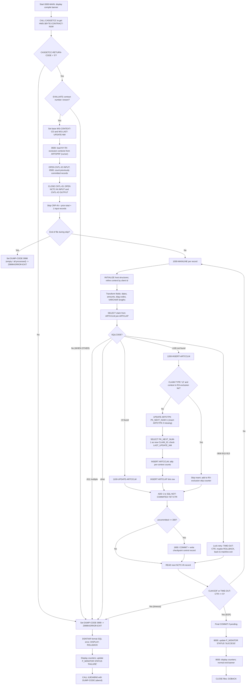

# CASNCTD9 — Process Flow

> Documents program **`CASNCTD9`** (`CASNCTD1` is *Not present in provided source — requires further input*).

## Flowchart

## Numbered process description

1. **Banner** — `0000-MAIN` displays the compile date/time (`FUNCTION WHEN-COMPILED`).
2. **Get contract number** — `CALL CASGETCC`; the returned `HMS-3BYTE-CONTRACT-NUM` drives all routing. Return code `≠ '0'` → dump `0999`, error exit.
3. **Map contract → context** — `EVALUATE HMS-3BYTE-CONTRACT-NUM` sets the base `WS-CONTEXT-CD` and `WS-LAST-UPDATE-NM`. Unknown contract → dump `0999`, error exit.
4. **Load RX exclusions** — `0600-LOAD-RX-EXCLUSIONS` opens cursor `ARTSPRF-CSR`, fetches `CONTEXT_CD`s from `CTSPROD.SEC.ARTSPRF` where `NAME_CD='NY_RX_ENCOUNTER_EXCLUSION'` and `UPPER(VALUE_TXT)='TRUE'` into memory (max 50), then closes the cursor and displays the loaded contexts.
5. **Restart count** — `OPEN INPUT CNTL-IO`; `0500-CREATE-INFILE-CRP` reads control records and accumulates `WS-CNTL-RECS-OUT-TOT` (records committed by prior runs). Close the control file.
6. **Open work files** — `OPEN INPUT NCTC-IN` and `OUTPUT CNTL-IO`.
7. **Skip processed records** — read `CRP-IN = WS-CNTL-RECS-OUT-TOT + 1` records from `NCTC-IN`. If EOF is hit here, the file is empty or fully processed → dump `0998` (good completion for no data), error exit.
8. **Mainline loop** (`1000-MAINLINE`, `UNTIL CLM-EOF OR TIME-OUT-CTR >= 5`), per record:
   1. `INITIALIZE` the DB2 host structures.
   2. Refine `WS-CONTEXT-CD` for multi-context clients using `CLM-HMS-CLIENT-ID` (contracts `326/590/359/645`, `320`, `313`).
   3. Transform input fields into host variables (context/ICN/provider/etc. trimmed via UNSTRING; amounts de-edited; dates reformatted to `YYYY-MM-DD`; diagnosis codes normalized; claim-type routes the service code to NDC or ICD9P).
   4. **Lookup** the claim via `SELECT … FROM ARTCCLM C, ARTCLKP L`.
   5. Branch on `SQLCODE`: `+0` → **update**; `+100` → **insert**; `-811` → abend; `-904/-911/-913` → lock retry; other → abend.
9. **Update path** (`1100-UPDATE-ARTCCLM`) — set all mapped columns + `LAST_UPDATE_DTM = CURRENT TIMESTAMP` (+ RX-written-date null handling) where context/claim id/ICN match.
10. **Insert path** (`1200-INSERT-ARTCCLM`):
    1. If `CLM-CLAIM-TYPE='12'` and the context is in the RX-exclusion list → **skip** (increment skip counter) and exit the paragraph.
    2. `UPDATE ARTCTPK` `PK_NEXT_NUM = PK_NEXT_NUM + 1` (or `1210` inserts a new `ARTCTPK` row if none).
    3. `SELECT PK_NEXT_NUM - 1` for the new `CLAIM_ID`; verify `LAST_UPDATE_NM` unchanged (else abend).
    4. `INSERT` into `ARTCCLM`; record the context into one of seven slots and tally its count.
    5. `INSERT` into `ARTCLKP` (link claim to case; `RELATE_IND='0'`, `IS_AUTO_CHECKED='N'`).
11. **Commit checkpoint** — increment `SQL-NOT-COMMITED-YET-CTR`; when it reaches `300`, `1900-IMPLICIT-COMMIT` commits, captures a timestamp, writes a checkpoint control record (`CNTL-PROC-FLAG='-'`, running total), rolls per-commit counters into totals, and resets `TIME-OUT-CTR`.
12. **Next record** — `READ NCTC-IN`; set `CLM-EOF` at end.
13. **Loop exit** — if `TIME-OUT-CTR >= 5` → error exit; otherwise on EOF, do a final commit if work is pending.
14. **Success finish** — `8000-P-MONITOR` updates `MISC.P_MONITOR` with `SUCCESS`; `9000-TERMINATION`/`9100-DISPLAY-COUNTERS` print run statistics; close files; `GOBACK`.
15. **Error finish** (`Z9999-ERROR-EXIT`) — if `SQLCODE ≠ 0`, call `DSNTIAR` and display up to 7 message lines; `ROLLBACK`; display counters; update `P_MONITOR` with `FAILURE`; `CALL ILBOABN0` with `DUMP-CODE` to abend.
