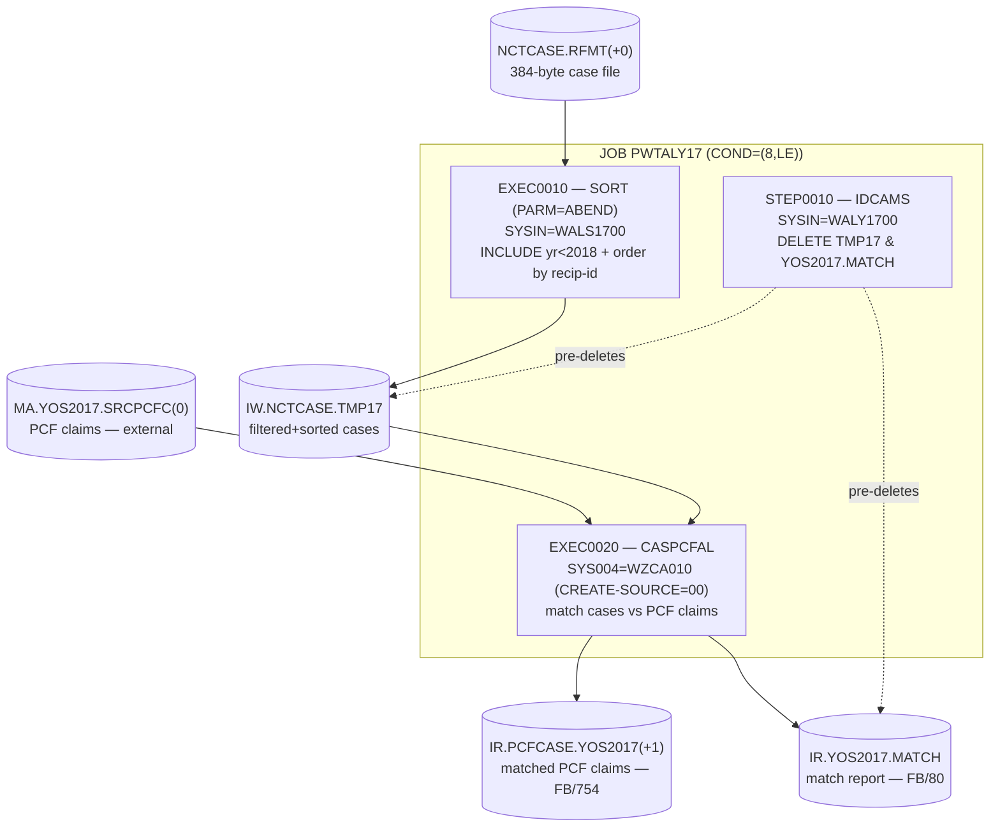
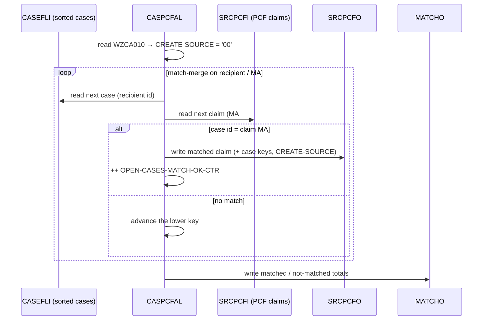
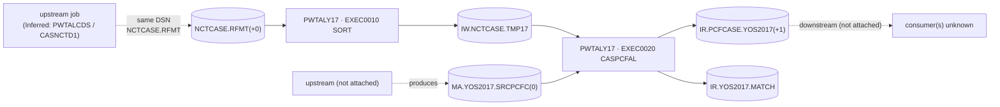

# PWTALY17 — Source-Grounded JCL Analysis

> Reverse‑engineering write‑up for batch job **`PWTALY17`** (repo `swatisable/Mainframe`).
> Every statement below is tied to evidence in the attached JCL, control cards, called program, and copybooks.
> Where something cannot be proven from source it is explicitly flagged as
> **Not proven from source**, **Open question**, **Referenced but artifact not available**, or **Inferred from JCL structure/usage**.

---

## 1. Analysis Method

### Artifacts reviewed (all located on branch `Job-details`)

| Artifact | Type | Role in this analysis | Availability |
|----------|------|-----------------------|--------------|
| `PWTALY17.txt` | JCL (JOB) | Primary subject of the analysis | ✅ Available |
| `WALY1700.txt` | Control card (IDCAMS `SYSIN`) | Consumed by `STEP0010` | ✅ Available |
| `WALS1700.txt` | Control card (SORT `SYSIN`) | Consumed by `EXEC0010` | ✅ Available |
| `WZCA010.txt` | Control card (`SYS004`) | Consumed by `EXEC0020` (CASPCFAL) | ✅ Available |
| `CASPCFAL.txt` | COBOL program | Called by `EXEC0020` | ✅ Available |
| `NCTCASE.txt` | Copybook | Layout of the case file (SORT input / CASPCFAL `CASEFLI`) | ✅ Available |

### Availability summary
- **Available and directly wired to `PWTALY17`:** the JCL itself, the three control cards (`WALY1700`, `WALS1700`, `WZCA010`), the called program `CASPCFAL`, and the `NCTCASE` copybook (proven to be the case‑record layout — see §5).
- **Referenced but artifact not available:** the upstream file that feeds `SRCPCFI` (`…IM.MA.YOS2017.SRCPCFC`) is read as an existing dataset; its producer is not among the attached members.
- **Not part of this job (context only):** `PWTALCDF.txt` and `PWTALCDS.txt` are *separate* jobs found in the same repo. They are **not** invoked by `PWTALY17`; one of them appears to *produce* an input dataset used here (see §8, evidence = matching dataset name).

### How conclusions were derived
1. Read `PWTALY17` line by line; resolved every symbolic parameter (`SET` values) into concrete dataset names.
2. Opened each `SYSIN`/`SYS004` control card to see exactly what each utility/program was told to do.
3. Opened the called program `CASPCFAL` and confirmed its `FD`s and `COPY` statements against the JCL DD `LRECL`s and the `NCTCASE` copybook.
4. Cross‑checked SORT field positions against the `NCTCASE` copybook byte offsets.

### How uncertainty was handled
- Semantic meaning that is *not* literally in the source (e.g., what "YOS2017", "MA#", or a date format "means") is labelled **Inferred** and kept separate from proven facts.
- Cross‑job data dependencies are only asserted when **dataset names match exactly** across two attached members; otherwise they are listed as open questions.

---

## 2. Job Overview

### Apparent purpose (supported by source)
The in‑stream comment header states the purpose directly:

```
//* JOB PWTALY17 - MATCH NCTCASE FILE TO YOS2017 PCF FILE             *
//* AND CREATE FILE OF MATCHING PCF RECORDS + PREFIX :                *
//* P.HMS.TPL.ALT.IR.PCFCASE.YOS2017                                  *
```

So the job **matches an ALT casualty case file (`NCTCASE`) against a PCF claims file and writes out the PCF claim records that match a case**, prefixed with case identifiers, into `P.HMS.TPL.ALT.IR.PCFCASE.YOS2017`. The program abstract in `CASPCFAL` agrees: *"THIS PROGRAM EXTRACTS PCF CLAIM DATA BASED ON CASE DATA."*

### High‑level execution flow
1. **`STEP0010` (IDCAMS)** – housekeeping: delete the work file and the match‑report file from a prior run so the job can be rerun cleanly.
2. **`EXEC0010` (SORT)** – filter the case file to pre‑2018 incident records and sort it by recipient/Medicaid id, producing a work file `…IW.NCTCASE.TMP17`.
3. **`EXEC0020` (CASPCFAL)** – sequential match of the sorted case file against the PCF claims file; emit matched PCF claim records (`…IR.PCFCASE.YOS2017`) plus a match‑count report (`…IR.YOS2017.MATCH`).

### Main components involved
- **Utilities:** `IDCAMS` (delete), `SORT` (filter + order).
- **Custom program:** `CASPCFAL` (COBOL match/extract).
- **Control cards:** `WALY1700`, `WALS1700`, `WZCA010`.
- **Copybook:** `NCTCASE` (case‑record layout, 384 bytes — see §5).

### Key dependencies
- Input case GDG `P.HMS.TPL.ALT.IR.NCTCASE.RFMT(+0)` must exist and be cataloged.
- Input PCF GDG `P.HMS.TPL.ALT.IM.MA.YOS2017.SRCPCFC(0)` must exist. **Inferred:** for the sequential match to work it must already be ordered by Medicaid number (`CASPCFAL` reads it as a match‑merge stream — see §6). This ordering is **not** performed inside `PWTALY17`.
- Load module `CASPCFAL` must be present in `JOBLIB` `P.HMSY.LINKLIB`.
- Control‑card library `P.HMSY.CARD.CNTL` must contain `WALY1700`, `WALS1700`, `WZCA010`.

### Symbolic parameters (resolved once for the whole job)
| Symbolic | `SET` value | Meaning in dataset names |
|----------|-------------|--------------------------|
| `DIPOND` | `P` | High‑level qualifier for **input** datasets |
| `DOPOND` | `P` | High‑level qualifier for **output** datasets |
| `LPOND`  | `P` | High‑level qualifier for control‑card **library** |
| `ACNTR`  | `ALT` | Account/state node in dataset names |

> All three `…POND` symbolics resolve to `P` in this member, so every `&DIPOND.`, `&DOPOND.`, `&LPOND.` below becomes literal `P`. `&ACNTR.` becomes `ALT`.

---

## 3. JCL / PROC Step‑by‑Step Flow

> **PROC usage:** `PWTALY17` invokes **no cataloged PROC** — all three steps are inline `EXEC PGM=`. (The `DB2BATCH` PROC referenced by the *other* jobs in the repo does not appear in this member.) Therefore there is nothing to "expand" for this job; the steps are already flat.

**Job‑level condition:** `COND=(8,LE)` on the JOB card — a step is bypassed when `8 <= (a prior step return code)`, i.e. the job effectively stops running further steps once any step ends with **RC ≥ 8**.

**JOBLIB:** `//JOBLIB DD DSN=P.HMSY.LINKLIB,DISP=SHR` — supplies the `CASPCFAL` load module (and the SORT/IDCAMS aliases if resolved here).

### STEP `STEP0010` — `PGM=IDCAMS` (housekeeping delete)
- **Origin:** directly in JCL (inline `EXEC PGM=IDCAMS`).
- **`SYSIN`:** `P.HMSY.CARD.CNTL(WALY1700)` (`&DIPOND..HMSY.CARD.CNTL`).
- **What the card does (`WALY1700`):**
  ```
   DELETE P.HMS.TPL.ALT.IW.NCTCASE.TMP17 PURGE
   DELETE P.HMS.TPL.ALT.IR.YOS2017.MATCH PURGE
   IF MAXCC LE 8 THEN SET MAXCC EQ 0
  ```
- **Inputs:** none (delete only).
- **Outputs:** deletes the two datasets that later steps recreate; `SYSPRINT → SYSOUT=*`.
- **Execution condition / return code:** no step `COND`. The `IF MAXCC LE 8 … SET MAXCC EQ 0` forces the step's return code to `0` even if a dataset was already absent (`NOT FOUND` = RC 8), so the delete is idempotent and rerun‑safe.
- **Connection to flow:** clears leftovers from a prior run so the `NEW,CATLG,DELETE` allocations in `EXEC0010`/`EXEC0020` don't collide. The comment block above the step confirms the intent: *"MAXCC LE 8 WILL RESET TO 0."*

### STEP `EXEC0010` — `PGM=SORT,PARM='ABEND'` (filter + order the case file)
- **Origin:** directly in JCL.
- **`SORTIN`:** `P.HMS.TPL.ALT.IR.NCTCASE.RFMT(+0)`, `DISP=SHR` — current generation of the reformatted case file (**input**).
- **`SORTOUT`:** `P.HMS.TPL.ALT.IW.NCTCASE.TMP17` — `DISP=(NEW,CATLG,DELETE)`, `UNIT=3390`, `SPACE=(CYL,(600,60),RLSE)`, `DCB=(RECFM=FB,LRECL=384,BLKSIZE=27648)` (**intermediate work file**).
- **`SYSIN`:** `P.HMSY.CARD.CNTL(WALS1700)` — the SORT statements:
  ```
   SORT FIELDS=(16,35,CH,A,7,15,CH,A)
   INCLUDE COND=(240,4,CH,LT,C'2018')
  ```
- **Work space:** `SORTWK01`–`SORTWK06` (`CYL,600` each, `UNIT=(SORTWK)`).
- **`PARM='ABEND'`:** SORT is told to **ABEND on error** rather than return a non‑zero code (fail‑fast behavior).
- **Execution condition:** no step `COND`; governed only by the job‑level `COND=(8,LE)`.
- **Connection to flow:** its output `…IW.NCTCASE.TMP17` becomes the `CASEFLI` input of `EXEC0020`. The `LRECL=384` exactly matches the `NCTCASE` copybook length and `CASPCFAL`'s `CASE-RECORD PIC X(384)` (see §5).

### STEP `EXEC0020` — `PGM=CASPCFAL` (match & extract)
- **Origin:** directly in JCL (custom program from `JOBLIB`).
- **DD wiring:**

  | DD | Dataset (resolved) | Direction | In program (`CASPCFAL`) |
  |----|--------------------|-----------|--------------------------|
  | `SRCPCFI` | `P.HMS.TPL.ALT.IM.MA.YOS2017.SRCPCFC(0)`, `DISP=SHR` | Input (PCF claims) | `SRCPCF-IN`, variable record ≤ 32752 |
  | `CASEFLI` | `P.HMS.TPL.ALT.IW.NCTCASE.TMP17`, `DISP=SHR` | Input (sorted cases) | `CASEFL-IN`, `CASE-RECORD PIC X(384)` |
  | `SRCPCFO` | `P.HMS.TPL.ALT.IR.PCFCASE.YOS2017(+1)` `NEW,CATLG,DELETE`; `MODLDSCB,RECFM=FB,LRECL=754` | Output (matched claims) | `SRCPCF-OUT`, `CLMO-RECORD PIC X(754)` |
  | `MATCHO` | `P.HMS.TPL.ALT.IR.YOS2017.MATCH` `NEW,CATLG,DELETE`; `RECFM=FB,LRECL=80` | Output (report) | `CASE-PCF-MATCH`, `MATCH-RECORD PIC X(80)` |
  | `SYS004` | `P.HMSY.CARD.CNTL(WZCA010)`, `DISP=SHR` | Input (control card) | `CNTL-CARDS`, `CNTL-REC PIC X(80)` |
  | `SYSPRINT`/`SYSOUT` | `SYSOUT=*` | Messages | — |

- **Important parameters:** the new output `SRCPCFO` uses `DCB=(MODLDSCB,…)` — a **model DSCB** named `MODLDSCB` supplies default DCB attributes for the GDG (BLKSIZE resolved by system, `BLKSIZE=0`).
- **Execution condition:** no step `COND`; governed by job‑level `COND=(8,LE)`.
- **Connection to flow:** consumes the `EXEC0010` work file plus the external PCF file, and produces the job's two deliverables. The `SRCPCFO` DSN (`…IR.PCFCASE.YOS2017`) is exactly the file named in the job's purpose comment.

---

## 4. Dataset and File Flow

Legend — **Role:** IN = read, OUT = created, DEL = deleted. **Kind:** Perm = cataloged, Ctl = control‑card member, Lib = load library.

| DD name | Dataset (symbolics resolved) | Kind | Role | Created by | Consumed by | Notes |
|---------|------------------------------|------|------|-----------|-------------|-------|
| `JOBLIB` | `P.HMSY.LINKLIB` | Lib | IN | (external) | all steps | Load lib for `CASPCFAL` |
| `SYSIN` (STEP0010) | `P.HMSY.CARD.CNTL(WALY1700)` | Ctl | IN | (external) | `STEP0010` | IDCAMS delete statements |
| — (deleted) | `P.HMS.TPL.ALT.IW.NCTCASE.TMP17` | Perm | DEL | `STEP0010` | — | Purged before recreation |
| — (deleted) | `P.HMS.TPL.ALT.IR.YOS2017.MATCH` | Perm | DEL | `STEP0010` | — | Purged before recreation |
| `SORTIN` | `P.HMS.TPL.ALT.IR.NCTCASE.RFMT(+0)` | Perm (GDG) | IN | **external / upstream** | `EXEC0010` | Reformatted case file (384‑byte `NCTCASE`) |
| `SYSIN` (EXEC0010) | `P.HMSY.CARD.CNTL(WALS1700)` | Ctl | IN | (external) | `EXEC0010` | SORT + INCLUDE statements |
| `SORTOUT` / `CASEFLI` | `P.HMS.TPL.ALT.IW.NCTCASE.TMP17` | Perm (work) | OUT → IN | `EXEC0010` | `EXEC0020` | FB/384; intermediate hand‑off file |
| `SRCPCFI` | `P.HMS.TPL.ALT.IM.MA.YOS2017.SRCPCFC(0)` | Perm (GDG) | IN | **external (not attached)** | `EXEC0020` | PCF claims, variable length |
| `SYS004` | `P.HMSY.CARD.CNTL(WZCA010)` | Ctl | IN | (external) | `EXEC0020` | Supplies `CREATE-SOURCE='00'` |
| `SRCPCFO` | `P.HMS.TPL.ALT.IR.PCFCASE.YOS2017(+1)` | Perm (GDG) | OUT | `EXEC0020` | **downstream (not attached)** | Matched PCF claims, FB/754 — the job's main deliverable |
| `MATCHO` | `P.HMS.TPL.ALT.IR.YOS2017.MATCH` | Perm | OUT | `EXEC0020` | **downstream (not attached)** | Match‑count report, FB/80 |
| `SORTWK01‑06` | (temp SORT work) | Temp | work | `EXEC0010` | `EXEC0010` | `CYL,600` each |
| `SYSPRINT`/`SYSOUT` | `SYSOUT=*` | — | OUT | all steps | spool | Utility/program messages |

**Temporary vs permanent:** the only true *intermediate* file that both is created and consumed **inside** this job is `…IW.NCTCASE.TMP17` (created in `EXEC0010`, read in `EXEC0020`). It is cataloged rather than a `&&temp`, and is pre‑deleted by `STEP0010` for rerun safety. `SORTWK01‑06` are the only genuinely temporary datasets.

---

## 5. Utility / SORT / COPY / MERGE Behavior

### `EXEC0010` SORT card (`WALS1700`)
```
 SORT FIELDS=(16,35,CH,A,7,15,CH,A)
 INCLUDE COND=(240,4,CH,LT,C'2018')
```

The SORT input is the 384‑byte `NCTCASE` record. Mapping the SORT byte positions onto the `NCTCASE` copybook offsets (offsets computed from the copybook field lengths):

| Copybook field | Bytes | Length |
|----------------|-------|--------|
| `HMS-CLIENT-ID` | 1–6 | 6 |
| `HMS-CASE-KEY` | 7–15 | 9 |
| `RECIPIENT-ID-NUM` | 16–35 | 20 |
| `CASE-SOURCE-CODE` | 36–44 | 9 |
| `CASE-TYPE-CODE` | 45–48 | 4 |
| `CASE-STATUS-CODE` | 49 | 1 |
| … | … | … |
| `INCIDENT-DATE` | 240–249 | 10 |

**SORT keys (both ascending, character):**
- **Primary key `(16,35)` → bytes 16–50.** Begins exactly at `RECIPIENT-ID-NUM` (the field the match program compares — see §6) and continues through `CASE-SOURCE-CODE`, `CASE-TYPE-CODE`, `CASE-STATUS-CODE` into the first byte of `CASE-STAGE-CODE`.
- **Secondary key `(7,15)` → bytes 7–21.** Begins at `HMS-CASE-KEY` and runs into the first 6 bytes of `RECIPIENT-ID-NUM`.
- **Net effect (Inferred from usage):** the case file is ordered primarily by recipient/Medicaid id, which is precisely the ordering `CASPCFAL` requires for its sequential match. The multi‑field span of the keys is reported as observed; the exact business rationale for the 35/15‑byte spans is **Not proven from source**.

**INCLUDE filter `(240,4,CH,LT,C'2018')`:**
- Bytes 240–243 = the first 4 characters of `INCIDENT-DATE`.
- Keeps only records whose first 4 `INCIDENT-DATE` characters are **character‑less‑than `'2018'`**.
- **Inferred:** if `INCIDENT-DATE` is formatted year‑first (`YYYY…`), this keeps incidents with year 2017 or earlier — consistent with the "YOS2017" naming. The actual date format is not defined in the copybook (`PIC X(10)`), so the year interpretation is **Inferred, not proven**.

**INREC/OUTREC/OUTFIL/SUM:** none present. The SORT performs **selection + ordering only**; it does not reshape, reformat, or split records.

### `STEP0010` IDCAMS card (`WALY1700`)
Not a SORT — a pair of `DELETE … PURGE` commands plus `IF MAXCC LE 8 THEN SET MAXCC EQ 0`. No `DEFINE`/`REPRO`/`MERGE` logic. Purpose = idempotent cleanup (see §3).

### Any COPY/MERGE?
- **No `MERGE`, no `IEBGENER`/`IEBCOPY`, no `ICEGENER` COPY** appears in `PWTALY17`. (Merge/backup utilities exist only in the *other* repo jobs, not here.) Stated explicitly per the requirement.

---

## 6. Called Program and Control Card Summaries

> Kept intentionally small; the JCL/SORT flow above is the main focus.

### Called program — `CASPCFAL`
- **Where used:** `EXEC0020` (`EXEC PGM=CASPCFAL`).
- **Abstract (from source):** *"EXTRACTS PCF CLAIM DATA BASED ON CASE DATA FROM CAS2000 SYSTEM."*
- **Files:** reads `SRCPCFI` (PCF claims, variable ≤ 32752), `CASEFLI` (case file, `COPY NCTCASE`, 384 bytes) and `SYS004` (control card); writes `SRCPCFO` (matched claims, 754 bytes) and `MATCHO` (report, 80 bytes).
- **Apparent logic (evidence‑based):**
  - Sequential **match‑merge** comparing case `CASE-RECIPIENT-ID-NUM` against PCF `PFX-APP-MEDICAID-NO` (the JCL comment's *"MATCH … ON MA#"*). It advances whichever stream is behind until the ids align.
  - For a matched recipient it loads the recipient's cases into a table, then for each PCF claim checks the claim's date‑of‑service falls **within the case window** (`PFX-APP-DATE-OF-SERVICE >= WS-INCIDENT-DATE … <= WS-CLM-THRU-DATE`) before writing an output record.
  - Counts open cases matched vs. not matched (`OPEN-CASES-MATCH-OK-CTR` / `OPEN-CASES-NO-MATCH-CTR`) and writes those totals to `MATCHO`.
- **Effect on job flow:** produces the job's two deliverable datasets; a hard error causes an ABEND (no downstream `COND` recovery in this job).
- **Not analysed in depth:** field‑level ICD‑version/provider special‑casing inside the program is out of scope for a JCL write‑up.

### Control card — `WALY1700` (IDCAMS `SYSIN`, `STEP0010`)
- **Controls:** deletion (`PURGE`) of the work file `…IW.NCTCASE.TMP17` and the report `…IR.YOS2017.MATCH`, then resets `MAXCC` to 0 when ≤ 8. **Effect:** makes the step rerun‑safe.

### Control card — `WALS1700` (SORT `SYSIN`, `EXEC0010`)
- **Controls:** the SORT ordering `FIELDS=(16,35,CH,A,7,15,CH,A)` and the `INCLUDE COND=(240,4,CH,LT,C'2018')` record filter. **Effect:** selects pre‑2018‑incident cases and orders them for the match (details in §5).

### Control card — `WZCA010` (`SYS004`, `EXEC0020`)
- **Content:**
  ```
  ***   ACCEPTABLE VALUES FOR CLAIM SOURCE ARE:
  ***      00 =  TPL MEDICAID   01 = CO DSS   02 = CA OTHER 35
  1. ENTER VALUE FOR CREATE-SOURCE: 00;
  ```
- **Controls:** supplies the **`CREATE-SOURCE` value `00` (= "TPL MEDICAID")**. In `CASPCFAL`, `1650-READ-CARDS` reads this card; when the leading tag byte = `'1'` it moves the 2‑byte data field (`00`) to `WS-SAVE-CREATE-SOURCE`, which is later stamped into each output record's `PRO-CREATE-SOURCE`. **Effect:** tags every extracted PCF claim with claim‑source `00`. Comment lines (leading `*`) are ignored.

---

## 7. Visual Maps / Diagrams

### 7.1 Job step / data flow


### 7.2 CASPCFAL match (conceptual sequence)


### 7.3 Dataset lineage (with external/unproven links dashed)


---

## 8. Open Questions / Unresolved References

- **Referenced but artifact not available — PCF input producer.** `SRCPCFI = …IM.MA.YOS2017.SRCPCFC(0)` is read as an existing GDG; no attached member creates it. Its record layout and its **required sort order** (assumed by the match) are therefore unverified. *(Match ordering by Medicaid number is **Inferred** from `CASPCFAL`'s merge logic.)*
- **Inferred cross‑job dependency — case file producer.** `PWTALCDS.txt` (a *separate* job, program `CASNCTD1`) writes `P.HMS.TPL.ALT.IR.NCTCASE.RFMT(+1)`, the same base DSN this job reads as `(+0)`. This strongly suggests `PWTALCDS` produces the case file consumed here, but it is **inferred from matching dataset names only**, not from any call/trigger inside `PWTALY17`.
- **Downstream consumer of the deliverables** (`…IR.PCFCASE.YOS2017`, `…IR.YOS2017.MATCH`) is **not among the attached artifacts**. `PWTALCDF` processes differently named files (`PCFCASE.CURR/.NEW`), so it is **not** confirmed as the consumer.
- **Comment vs. actual member — SORT INCLUDE.** The job's modification history says *"ADD INCLUDE TO SORT WZZCA401 W/ NEW MEMBER"*, but the live `EXEC0010 SYSIN` points to `WALS1700`. `WZZCA401` is **referenced in a comment only**; its member is not attached and may be historical. **Open question.**
- **Date format of `INCIDENT-DATE`.** The `INCLUDE … LT C'2018'` filter and "YOS2017" naming imply a year‑first date, but `NCTCASE` defines the field only as `PIC X(10)`. The 2017/earlier interpretation is **Inferred, not proven**.
- **SORT key spans.** The primary `(16,35)` and secondary `(7,15)` keys each span multiple copybook fields (and overlap). The ordering is reported as observed; the business reason for the exact spans is **Not proven from source**.
- **"MA#" terminology.** The JCL comment's *"MATCH … ON MA#"* is aligned with the program comparing `RECIPIENT-ID-NUM`/`PFX-APP-MEDICAID-NO`; reading "MA#" as *Medicaid number* is **Inferred** from that pairing.
- **Meaning of "YOS2017".** Interpreted as a 2017 service‑year population from dataset naming + the `<2018` filter; the literal expansion of the acronym is **Not proven from source**.

---

*End of analysis — scope limited to what `PWTALY17` and its directly‑wired control cards, program, and copybook prove.*
