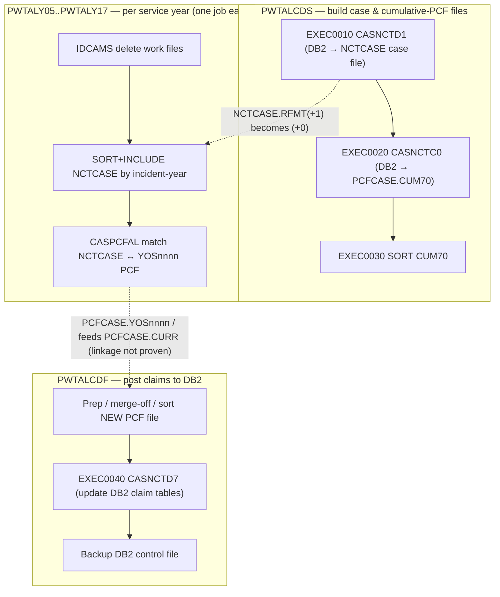
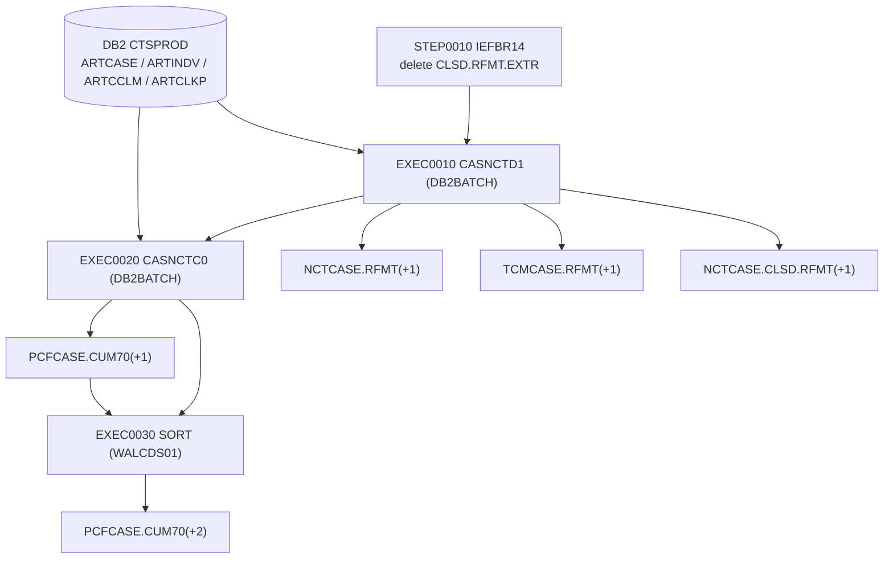
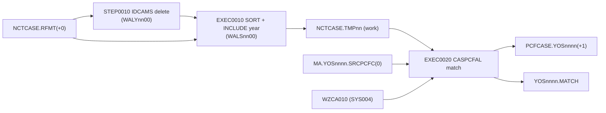
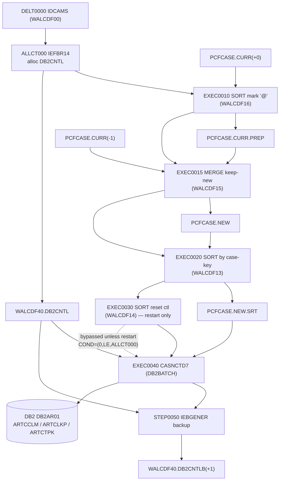
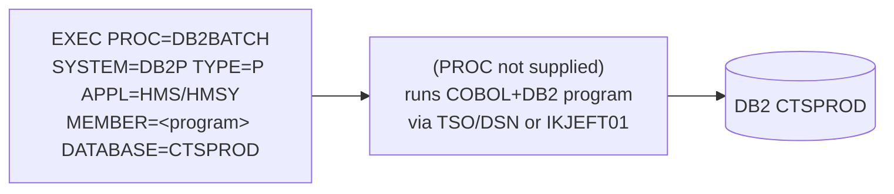

# JCL / PROC Analysis — ALT Casualty "PCF‑to‑DB2" Job Stream

> Source‑grounded reverse‑engineering of the attached JCL members
> `PWTALCDS`, `PWTALY05`–`PWTALY17`, and `PWTALCDF`, plus their control
> cards, called programs, and record‑layout copybooks.
>
> Every statement below is tied to a specific artifact. Anything that cannot be
> proven from the supplied source is explicitly flagged as **Not proven from
> source**, **Open question**, **Referenced but artifact not available**, or
> **Inferred from JCL structure/usage**.

---

## 1. Analysis Method

### 1.1 Artifacts reviewed
The members named in the request were not present on the working branch; they
were located and read from the repository's **`Job-details`** branch. The
following artifacts were reviewed directly:

| Category | Members reviewed |
|---|---|
| Driver JCL | `PWTALCDS`, `PWTALY05`, `PWTALY06`, `PWTALY07`, `PWTALY08`, `PWTALY09`, `PWTALY10`, `PWTALY11`, `PWTALY12`, `PWTALY13`, `PWTALY14`, `PWTALY16`, `PWTALY17`, `PWTALCDF` |
| Control cards (SORT/IDCAMS SYSIN, program SYS004) | `WALCDS01`, `WALCDF00`, `WALCDF13`, `WALCDF14`, `WALCDF15`, `WALCDF16`, `WALY0500`–`WALY1700`, `WALS0500`–`WALS1700`, `WZCA010` |
| Called programs (COBOL) | `CASNCTD1`, `CASNCTC0`, `CASPCFAL`, `CASNCTD7` |
| Record‑layout copybooks | `NCTCASE`, `NCTCLMS4`, `CLMPREFX`, `TPLPREFX`, `FDPCF601`, `FDPCF602`, `FDALPHY3/4/5`, `FDALINH3/4/5`, `FDALRXR3/4/5` |

### 1.2 Available vs. missing
| Requested / referenced | Status |
|---|---|
| `PWTALCDS`, `PWTALY05`–`14`, `PWTALY16`, `PWTALY17`, `PWTALCDF` | **Available** |
| `PWTALY15` | **Referenced but artifact not available** — the member is absent even though its control cards `WALS1500` / `WALY1500` (YOS 2015) *are* present. |
| `PWTALCAM` | **Referenced but artifact not available** — no member and no related control cards were found in the supplied artifacts. |
| `DB2BATCH` PROC (invoked by `EXEC PROC=DB2BATCH`) | **Referenced but artifact not available** — this is the only PROC used by the stream and its definition was not supplied. |

### 1.3 How conclusions were derived
* Each JCL member was read line‑by‑line; steps, programs/utilities, symbolic
  parameters, DD statements, `COND` logic, and control‑card references were
  extracted.
* Every control card was opened and its SORT/MERGE/IDCAMS logic transcribed.
* Called‑program headers and `SELECT … ASSIGN TO ddname` clauses were read to
  confirm that program file names line up with the DD names coded in the JCL.
* SORT/MERGE byte positions were validated against the record‑layout copybooks
  (e.g., the `INCLUDE COND=(240,4,…)` field was mapped to `NCTCASE`).

### 1.4 Handling of uncertain references
* The `DB2BATCH` PROC is expanded only **conceptually** (program + DB2 access);
  its internal DD/STEPLIB structure is **Not proven from source**.
* Cross‑job execution order is **Inferred from JCL structure/usage** (GDG
  relative generations), because there is no scheduler artifact or job‑to‑job
  `COND` chaining in the supplied files.
* Dataset‑qualifier semantics (`.IW.`, `.IR.`, `.IM.`) are treated as naming
  conventions of **unproven** exact meaning.

---

## 2. Job Overview

### 2.1 Apparent purpose (supported by source)
This is an **ALT casualty TPL (Third‑Party Liability) "PCF/CASE to DB2"**
batch stream. Purpose statements taken verbatim from the job comments:

* `PWTALCDS` — *"CREATE EXTRACT FILE OF OPEN CASES FROM DB2 TABLES ARTCASE,
  ARTINDV"* (and, via a second step, build a cumulative PCF/CASE file).
* `PWTALYnn` — *"MATCH NCTCASE FILE TO YOS20nn PCF FILE AND CREATE FILE OF
  MATCHING PCF RECORDS"* (one job per service year).
* `PWTALCDF` — *"UPDATE CORRESPONDING DB2 CLAIM TABLES; FTP ALT PCF/CASE FILE
  AND MATCH REPORTS TO ALT NOVELL SERVER."*
  *(The FTP action is stated in the comment header but **no FTP step exists** in
  the member — see Open Questions.)*

The "`ALT`" qualifier is the contract/account code supplied by `SET ACNTR=ALT`;
its wider business meaning is **Not proven from source**.

### 2.2 High‑level execution flow

```mermaid
flowchart TD
    subgraph EXTRACT["PWTALCDS — build case & cumulative-PCF files"]
        A1["EXEC0010 CASNCTD1 (DB2 → NCTCASE case file)"]
        A2["EXEC0020 CASNCTC0 (DB2 → PCFCASE.CUM70)"]
        A3["EXEC0030 SORT CUM70"]
        A1 --> A2 --> A3
    end

    subgraph MATCH["PWTALY05..PWTALY17 — per service year (one job each)"]
        B1["IDCAMS delete work files"]
        B2["SORT+INCLUDE NCTCASE by incident-year"]
        B3["CASPCFAL match NCTCASE ↔ YOSnnnn PCF"]
        B1 --> B2 --> B3
    end

    subgraph UPDATE["PWTALCDF — post claims to DB2"]
        C1["Prep / merge-off / sort NEW PCF file"]
        C2["EXEC0040 CASNCTD7 (update DB2 claim tables)"]
        C3["Backup DB2 control file"]
        C1 --> C2 --> C3
    end

    A1 -. "NCTCASE.RFMT(+1) becomes (+0)" .-> B2
    B3 -. "PCFCASE.YOSnnnn / feeds PCFCASE.CURR (linkage not proven)" .-> C1
```
*Dashed edges are **Inferred from JCL structure/usage**; solid edges are proven
within a single member.*

### 2.3 Main components involved
* **Utilities:** `IEFBR14`, `IDCAMS`, `SORT` (the system sort utility, invoked as `PGM=SORT`), `IEBGENER`.
* **Called COBOL programs:** `CASNCTD1`, `CASNCTC0`, `CASPCFAL`, `CASNCTD7`
  (the first, second, and fourth run under the `DB2BATCH` PROC; `CASPCFAL`
  runs as a plain `EXEC PGM=`).
* **DB2 subsystem:** `SYSTEM=DB2P`, `DATABASE=CTSPROD` (from the `DB2BATCH`
  invocations).
* **Libraries:** `JOBLIB DD DSN=P.HMSY.LINKLIB` (load modules);
  `P.HMSY.CARD.CNTL(member)` (control‑card PDS).

### 2.4 Key dependencies
* All three jobs share the symbolic set `LPOND=P`, `DIPOND=P`, `DOPOND=P`,
  `ACNTR=ALT`, so every dataset resolves under the high‑level pattern
  `P.HMS.TPL.ALT.*`.
* Every `PWTALYnn` job consumes `…NCTCASE.RFMT(+0)`, which is produced as
  `(+1)` by `CASNCTD1` inside `PWTALCDS` → the match jobs must run **after**
  the extract job (**Inferred from GDG usage**).
* `PWTALCDF` consumes `…PCFCASE.CURR` GDG generations; how those generations
  are populated from the `PWTALCDS`/`PWTALYnn` outputs is **not shown** in the
  supplied members (**Open question**).

---

## 3. JCL / PROC Step‑by‑Step Flow

Common to all three jobs:
* Job card `(600040,ALT)`, `CLASS=P`, `MSGCLASS=J`, `USER=DP3BTCH`,
  `GROUP=TS2GRP`, and **`COND=(8,LE)`** — once any step returns **RC ≥ 8**, all
  remaining steps in that job are bypassed.
* `//JOBLIB DD DSN=P.HMSY.LINKLIB,DISP=SHR`.
* Symbolics: `SET LPOND=P / DIPOND=P / DOPOND=P / ACNTR=ALT`.
* SORT steps run `PARM='ABEND'` (or `'ABEND,EQUALS'`) — a sort failure abends
  rather than returning a code.

### 3.1 `PWTALCDS` — extract open cases & build cumulative PCF file

| Step | Program / utility | Origin | Purpose (from source) |
|---|---|---|---|
| `STEP0010` | `IEFBR14` | JCL | Delete/re‑allocate `…IW.NCTCASE.CLSD.RFMT.EXTR` via `DD001` `DISP=(MOD,DELETE,DELETE)` (cleanup so the next step can create it fresh). |
| `EXEC0010` | `CASNCTD1` under **`PROC=DB2BATCH`** | PROC | Read DB2 `ARTCASE`/`ARTINDV`(/`ARTCCKP`) and write the reformatted case file plus closed‑case files. |
| `EXEC0020` | `CASNCTC0` under **`PROC=DB2BATCH`** | PROC | Read DB2 `ARTCCLM`/`ARTCLKP` and write the cumulative PCF file `PCFCASE.CUM70(+1)`. |
| `EXEC0030` | `SORT` (`PARM='ABEND,EQUALS'`) | JCL | Sort `PCFCASE.CUM70(+1)` → `CUM70(+2)` on a 70‑byte key (card `WALCDS01`). |

Key DDs / parameters:
* `EXEC0010` outputs (names match `CASNCTD1`'s `ASSIGN` clauses):
  `NCTCASO → …IR.NCTCASE.RFMT(+1)`, `TCMCASO → …IR.TCMCASE.RFMT(+1)`,
  `CLSDO → …IR.NCTCASE.CLSD.RFMT(+1)`, `CLSDEXTO → …IW.NCTCASE.CLSD.RFMT.EXTR`
  (the dataset deleted in `STEP0010`).
* `EXEC0020` invocation shows `CASNCTC1` commented out and `CASNCTC0` active —
  consistent with the modification‑history note *"RUN CASNCTC0 INSTEAD OF
  CASNCTC1."* Output `SRCPCFO → &DOPOND..HMS.TPL.ALT.IR.PCFCASE.CUM70(+1)`.
* `EXEC0030` `SYSIN = …CARD.CNTL(WALCDS01)`.
* The `DB2BATCH` steps also code `SYSTEM=DB2P, TYPE=&LPOND(=P), APPL=HMSY,
  MEMBER=<pgm>, DATABASE=CTSPROD` and `DB2BATCH.SYSUDUMP DD DUMMY`.

> **No `COND` on the individual steps** — flow control is only the job‑level
> `COND=(8,LE)`.

### 3.2 `PWTALY05` … `PWTALY17` — per‑service‑year case/PCF match

All twelve available members share one 3‑step template; only the year‑specific
dataset names and control‑card members change. Using **`PWTALY05` (YOS 2005)**
as the worked example:

| Step | Program / utility | Origin | Purpose |
|---|---|---|---|
| `STEP0010` | `IDCAMS` | JCL | Run `DELETE … PURGE` for that year's work file and MATCH file (card `WALY0500`); `IF MAXCC LE 8 THEN SET MAXCC EQ 0`. |
| `EXEC0010` | `SORT` (`PARM='ABEND'`) | JCL | Read `…IR.NCTCASE.RFMT(+0)`, **filter to the target incident year** and sort, writing work file `…IW.NCTCASE.TEMP5` (card `WALS0500`). |
| `EXEC0020` | `CASPCFAL` (`EXEC PGM=`) | JCL | Match the sorted case file against that year's PCF source, writing matched PCF records and a match report. |

`EXEC0020` DDs (names match `CASPCFAL`'s `ASSIGN` clauses):
* `SRCPCFI → …IM.MA.YOS2005.SRCPCFC(0)` — PCF source claims for the year
  (**created upstream, artifact not supplied**).
* `CASEFLI → …IW.NCTCASE.TEMP5` — the sorted case file from `EXEC0010`.
* `SRCPCFO → …IR.PCFCASE.YOS2005(+1)` — matched PCF/case output (`LRECL=754`).
* `MATCHO → …IR.YOS2005.MATCH` — match report (`LRECL=80`).
* `SYS004 → …CARD.CNTL(WZCA010)` — supplies the create‑source code.

Per‑year variance table (everything else is identical):

| Member | Service year | IDCAMS card | SORT card | Work file | Match input `SRCPCFI` | Outputs |
|---|---|---|---|---|---|---|
| `PWTALY05` | 2005 | `WALY0500` | `WALS0500` | `NCTCASE.TEMP5` | `MA.YOS2005.SRCPCFC(0)` | `PCFCASE.YOS2005(+1)`, `YOS2005.MATCH` |
| `PWTALY06` | 2006 | `WALY0600` | `WALS0600` | `NCTCASE.TMP06` | `MA.YOS2006.SRCPCFC(0)` | `PCFCASE.YOS2006(+1)`, `YOS2006.MATCH` |
| `PWTALY07` | 2007 | `WALY0700` | `WALS0700` | `NCTCASE.TMP07` | `MA.YOS2007.SRCPCFC(0)` | `PCFCASE.YOS2007(+1)`, `YOS2007.MATCH` |
| `PWTALY08` | 2008 | `WALY0800` | `WALS0800` | `NCTCASE.TMP08` | `MA.YOS2008.SRCPCFC(0)` | `PCFCASE.YOS2008(+1)`, `YOS2008.MATCH` |
| `PWTALY09` | 2009 | `WALY0900` | `WALS0900` | `NCTCASE.TMP09` | `MA.YOS2009.SRCPCFC(0)` | `PCFCASE.YOS2009(+1)`, `YOS2009.MATCH` |
| `PWTALY10` | 2010 | `WALY1000` | `WALS1000` | `NCTCASE.TMP10` | `MA.YOS2010.SRCPCFC(0)` | `PCFCASE.YOS2010(+1)`, `YOS2010.MATCH` |
| `PWTALY11` | 2011 | `WALY1100` | `WALS1100` | `NCTCASE.TMP11` | `MA.YOS2011.SRCPCFC(0)` | `PCFCASE.YOS2011(+1)`, `YOS2011.MATCH` |
| `PWTALY12` | 2012 | `WALY1200` | `WALS1200` | `NCTCASE.TMP12` | `MA.YOS2012.SRCPCFC(0)` | `PCFCASE.YOS2012(+1)`, `YOS2012.MATCH` |
| `PWTALY13` | 2013 | `WALY1300` | `WALS1300` | `NCTCASE.TMP13` | `MA.YOS2013.SRCPCFC(0)` | `PCFCASE.YOS2013(+1)`, `YOS2013.MATCH` |
| `PWTALY14` | 2014 | `WALY1400` | `WALS1400` | `NCTCASE.TMP14` | `MA.YOS2014.SRCPCFC(0)` | `PCFCASE.YOS2014(+1)`, `YOS2014.MATCH` |
| *`PWTALY15`* | *2015* | *`WALY1500`* | *`WALS1500`* | *`NCTCASE.TMP15`* | *`MA.YOS2015.SRCPCFC(0)`* | **member missing** (cards present) |
| `PWTALY16` | 2016 | `WALY1600` | `WALS1600` | `NCTCASE.TMP16` | `MA.YOS2016.SRCPCFC(0)` | `PCFCASE.YOS2016(+1)`, `YOS2016.MATCH` |
| `PWTALY17` | 2017 | `WALY1700` | `WALS1700` | `NCTCASE.TMP17` | `MA.YOS2017.SRCPCFC(0)` | `PCFCASE.YOS2017(+1)`, `YOS2017.MATCH` |

Only cosmetic differences exist between members (number of `SORTWK` DDs, `SPACE`
sizing, and whether the card PDS is coded as `P.HMSY…` or `&DIPOND..HMSY…`).
`PWTALY05`/`PWTALY09` modification comments mention *"ADD INCLUDE TO SORT
WZZCA401 W/ NEW MEMBER"*, but the DDs actually code `WALSnn00` (SORT) and
`WZCA010` (SYS004); the `WZZCA401` reference is **not resolvable** from the
coded DDs.

### 3.3 `PWTALCDF` — post the "new" PCF/case file to DB2

| Step | Program / utility | Origin | Purpose (from source) |
|---|---|---|---|
| `DELT0000` | `IDCAMS` | JCL | `DELETE … PURGE` the control file and three PCF work files (card `WALCDF00`); `IF MAXCC LE 8 SET MAXCC EQ 0`. |
| `ALLCT000` | `IEFBR14` | JCL | Allocate a **new empty DB2 update control file** `AL001 → …IR.WALCDF40.DB2CNTL` (`LRECL=38`). |
| `EXEC0010` | `SORT` | JCL | Copy current `PCFCASE.CURR(+0)` → `…IW.PCFCASE.CURR.PREP`, marking `'@'` in byte 306 (card `WALCDF16`). |
| `EXEC0015` | `SORT` (MERGE) | JCL | Merge previous `PCFCASE.CURR(-1)` with `CURR.PREP`, keeping **only newly‑marked records** → `…IW.PCFCASE.NEW` (card `WALCDF15`). |
| `EXEC0020` | `SORT` | JCL | Sort `PCFCASE.NEW` by HMS‑CASE‑KEY → `…IR.PCFCASE.NEW.SRT` "to improve DB2 performance" (card `WALCDF13`). |
| `EXEC0030` | `SORT`, `COND=(0,LE,ALLCT000)` | JCL | Reset first byte of the DB2 control file (card `WALCDF14`). **Bypassed on a clean run** (see below). |
| `EXEC0040` | `CASNCTD7` under **`PROC=DB2BATCH`** | PROC | Read `PCFCASE.NEW.SRT` (`NCTCLMI`) and **update DB2 `DB2AR01` tables `ARTCCLM`, `ARTCLKP`, `ARTCTPK`**, maintaining the control file `DB2CNTLO`. |
| `STEP0050` | `IEBGENER` | JCL | Copy the DB2 control file to backup GDG `…IR.WALCDF40.DB2CNTLB(+1)`. |

`COND` / restart logic (from source comments):
* **`EXEC0030 COND=(0,LE,ALLCT000)`** — bypass this step when `0 ≤ RC(ALLCT000)`.
  Because `ALLCT000` is `IEFBR14` (always RC 0), the test is true and the step
  is **skipped on any normal from‑the‑top run**. The comment states exactly
  this: *"THIS STEP WILL NEVER BE EXECUTED IF JOB RAN FROM THE BEGINNING."* It
  exists only for the documented restart path (restart at `EXEC0030`, where
  `ALLCT000` did not run).
* `EXEC0040` DD `DB2CNTLO … DISP=(MOD,KEEP,KEEP)` plus the header notes describe
  a **checkpoint/restart** design: on user completion code **3645** the job may
  be restarted at `EXEC0040.DB2BATCH` and DB2 update resumes from the last
  commit; restarting at `EXEC0030` instead reprocesses the file from the start.

---

## 4. Dataset and File Flow

Symbolics resolved: `&LPOND=&DIPOND=&DOPOND=P`, `&ACNTR=ALT`
(so `&DIPOND..HMS.TPL.&ACNTR.` → `P.HMS.TPL.ALT`).

### 4.1 `PWTALCDS`
| DD | Dataset (resolved) | Temp/Perm | Role | Created by | Consumed by | Notes |
|---|---|---|---|---|---|---|
| `DD001` | `P.HMS.TPL.ALT.IW.NCTCASE.CLSD.RFMT.EXTR` | Perm (GDG‑less) | Delete | `STEP0010` (`IEFBR14`) | — | `DISP=(MOD,DELETE,DELETE)` cleanup before re‑create |
| `NCTCASO` | `P.HMS.TPL.ALT.IR.NCTCASE.RFMT(+1)` | Perm (GDG) | Output | `EXEC0010` `CASNCTD1` | `PWTALYnn` as `(+0)` *(inferred)* | Reformatted case file, `LRECL=384` |
| `TCMCASO` | `P.HMS.TPL.ALT.IR.TCMCASE.RFMT(+1)` | Perm (GDG) | Output | `EXEC0010` | Not shown | `LRECL=384` |
| `CLSDO` | `P.HMS.TPL.ALT.IR.NCTCASE.CLSD.RFMT(+1)` | Perm (GDG) | Output | `EXEC0010` | Not shown | Closed‑case file |
| `CLSDEXTO` | `P.HMS.TPL.ALT.IW.NCTCASE.CLSD.RFMT.EXTR` | Perm | Output | `EXEC0010` | Not shown | `LRECL=9`; same DSN deleted by `STEP0010` |
| `SRCPCFO` | `P.HMS.TPL.ALT.IR.PCFCASE.CUM70(+1)` | Perm (GDG) | Output | `EXEC0020` `CASNCTC0` | `EXEC0030` | Cumulative PCF file, `LRECL=70` |
| `SORTIN` | `…PCFCASE.CUM70(+1)` | Perm (GDG) | Input | `EXEC0020` | `EXEC0030` | Same generation just created |
| `SORTOUT` | `…PCFCASE.CUM70(+2)` | Perm (GDG) | Output | `EXEC0030` | Not shown | Sorted cumulative file |

### 4.2 `PWTALYnn` (pattern; `nn`/year vary per §3.2 table)
| DD | Dataset (resolved) | Temp/Perm | Role | Created by | Consumed by | Notes |
|---|---|---|---|---|---|---|
| `SORTIN` | `P.HMS.TPL.ALT.IR.NCTCASE.RFMT(+0)` | Perm (GDG) | Input | `PWTALCDS` *(inferred)* | `EXEC0010` | Latest reformatted case file |
| `SORTOUT`/`CASEFLI` | `P.HMS.TPL.ALT.IW.NCTCASE.TMPnn` | **Temp/work** | Intermediate | `EXEC0010` | `EXEC0020` | Filtered & sorted cases; deleted next run by IDCAMS card |
| `SRCPCFI` | `P.HMS.TPL.ALT.IM.MA.YOSnnnn.SRCPCFC(0)` | Perm (GDG) | Input | **Upstream, not supplied** | `EXEC0020` | Year's PCF source claims |
| `SRCPCFO` | `P.HMS.TPL.ALT.IR.PCFCASE.YOSnnnn(+1)` | Perm (GDG) | Output | `EXEC0020` `CASPCFAL` | Not shown | Matched PCF/case records, `LRECL=754` |
| `MATCHO` | `P.HMS.TPL.ALT.IR.YOSnnnn.MATCH` | Perm | Output | `EXEC0020` | Not shown | Match report, `LRECL=80` |

### 4.3 `PWTALCDF`
| DD | Dataset (resolved) | Temp/Perm | Role | Created by | Consumed by | Notes |
|---|---|---|---|---|---|---|
| `AL001` | `P.HMS.TPL.ALT.IR.WALCDF40.DB2CNTL` | Perm | Allocate | `ALLCT000` | `EXEC0030`/`EXEC0040`/`STEP0050` | DB2 update control file, `LRECL=38` |
| `SORTIN` | `…IR.PCFCASE.CURR(+0)` | Perm (GDG) | Input | **Not shown here** | `EXEC0010` | Current PCF/case file |
| `SORTOUT` | `…IW.PCFCASE.CURR.PREP` | **Temp/work** | Intermediate | `EXEC0010` | `EXEC0015` | Marked `'@'` in byte 306 |
| `SORTIN01` | `…IR.PCFCASE.CURR(-1)` | Perm (GDG) | Input | Prior run | `EXEC0015` | Previous generation |
| `SORTIN02` | `…IW.PCFCASE.CURR.PREP` | Temp | Input | `EXEC0010` | `EXEC0015` | — |
| `SORTOUT` | `…IW.PCFCASE.NEW` | **Temp/work** | Intermediate | `EXEC0015` | `EXEC0020` | Only `'@'`‑marked (new) records kept |
| `SORTOUT` | `…IR.PCFCASE.NEW.SRT` | Perm | Intermediate | `EXEC0020` | `EXEC0040` | Sorted by HMS‑CASE‑KEY |
| `NCTCLMI` | `…IR.PCFCASE.NEW.SRT` | Perm | Input | `EXEC0020` | `EXEC0040` `CASNCTD7` | Claims fed to DB2 |
| `DB2CNTLO` | `…IR.WALCDF40.DB2CNTL` | Perm | Update | `ALLCT000` | `EXEC0040` | `DISP=(MOD,KEEP,KEEP)` — restart checkpoint |
| `SYSUT2` | `…IR.WALCDF40.DB2CNTLB(+1)` | Perm (GDG) | Output | `STEP0050` | — | Backup of control file |

> `.IW.` datasets behave as recreated‑each‑run work files (deleted by IDCAMS
> cards, `DISP=(NEW,CATLG,DELETE)`); `.IR.` datasets are the retained results;
> `.IM.` is the match‑input PCF source. These qualifier meanings are an
> observation, **not proven from source**.

---

## 5. Utility / SORT / COPY / MERGE Behavior

All logic below is transcribed directly from the control cards; byte positions
are validated against the copybooks in §6.3.

### 5.1 `PWTALYnn` case filter & sort — `WALSnn00`
```
 SORT FIELDS=(16,35,CH,A,7,15,CH,A)
 INCLUDE COND=(240,4,CH,LT,C'<year+1>')
```
* **Sort keys** (against `NCTCASE`): primary = 35 bytes starting at position 16
  (begins at `RECIPIENT-ID-NUM`, i.e. the Medicaid/"MA#"), secondary = 15 bytes
  at position 7 (begins at `HMS-CASE-KEY`). This matches the comment *"MATCH …
  ON MA#."*
* **INCLUDE filter:** position **240 for 4 bytes** maps exactly to the first 4
  characters (the year) of `NCTCASE … INCIDENT-DATE PIC X(10)`. Each year's job
  keeps cases whose incident year is **< (target year + 1)**:

  | Card | Keeps incident year |
  |---|---|
  | `WALS0500` | `< 2006` |
  | `WALS0900` | `< 2010` |
  | `WALS1700` | `< 2018` |

  i.e., a cumulative "incident on/before this service year" filter (all
  `WALSnn00` cards are otherwise identical).

### 5.2 `PWTALCDS` cumulative sort — `WALCDS01`
```
 SORT FIELDS=(1,70,CH,A)
```
Straight ascending sort of the 70‑byte `PCFCASE.CUM70` record on its full key.

### 5.3 `PWTALCDF` reshaping cards
| Card | Step | Logic | Effect |
|---|---|---|---|
| `WALCDF16` | `EXEC0010` | `SORT FIELDS=COPY` + `OUTREC FIELDS=(1:1,305, 306:1C'@')` | Copy 305 data bytes and append a `'@'` **current‑file mark** in byte 306. |
| `WALCDF15` | `EXEC0015` | `MERGE FIELDS=(1,70,CH,A)` + `SUM FIELDS=NONE` + `OUTFIL INCLUDE=(306,1,CH,EQ,C'@')` | Merge current+previous on the 70‑byte key (`RECIPIENT-ID + HMS-CASE-KEY + ICN`, per the card's own comment), drop duplicates, and **keep only records still flagged `'@'`** — i.e., records new/changed this cycle. |
| `WALCDF13` | `EXEC0020` | `SORT FIELDS=(21,09,ZD,A)` | Sort by `HMS-CASE-KEY` (position 21, 9‑byte zoned decimal — the card annotates it `CLKP_CASE_ID`). |
| `WALCDF14` | `EXEC0030` | `SORT FIELDS=COPY` + `OUTREC FIELDS=(1:1C'N',2:2,37)` | Force byte 1 = `'N'` and pass bytes 2–38 — a reset of the 38‑byte DB2 control record (restart‑only step). |

### 5.4 IDCAMS delete cards — `WALCDF00`, `WALYnn00`
* `WALCDF00`: `DELETE … PURGE` of `WALCDF40.DB2CNTL`, `PCFCASE.CURR.PREP`,
  `PCFCASE.NEW`, `PCFCASE.NEW.SRT`, then `IF MAXCC LE 8 THEN SET MAXCC EQ 0`
  (so a "not found" RC 8 does not fail the job).
* `WALYnn00`: same pattern for that year's `NCTCASE.TMPnn` and `YOSnnnn.MATCH`.

### 5.5 `CASPCFAL` control card — `WZCA010`
Read on `SYS004`; supplies `CREATE-SOURCE` (see §6.2). Content:
`ENTER VALUE FOR CREATE-SOURCE: 00;` with a legend (`00 = TPL MEDICAID`,
`01 = CO DSS`, `02 = CA OTHER 35`).

---

## 6. Called Program and Control Card Summaries

*(Kept intentionally small; the JCL/PROC flow above is the focus.)*

### 6.1 Called programs
| Program | Used by | Apparent purpose (from program header) | Effect on job flow |
|---|---|---|---|
| **`CASNCTD1`** | `PWTALCDS` `EXEC0010` (DB2BATCH) | *"Select data from DB2 tables and create new generation of casualty case file (NCTCASE 384 file)… also create 2 files of closed cases."* Reads `ARTCASE`, `ARTINDV`, `ARTCCKP`. | Produces the `NCTCASE.RFMT` case file that every `PWTALYnn` later consumes. |
| **`CASNCTC0`** | `PWTALCDS` `EXEC0020` (DB2BATCH) | *"Select data from DB2 tables and create new generation of the CUM file… process both opened and closed."* Reads `ARTCCLM`, `ARTCLKP`. | Produces `PCFCASE.CUM70`, sorted by `EXEC0030`. |
| **`CASPCFAL`** | every `PWTALYnn` `EXEC0020` | *"Extracts PCF claim data based on case data from CAS2000 system"* (cloned from `CASPCFM1`). Matches `SRCPCFI` (PCF source) against `CASEFLI` (sorted cases); writes `SRCPCFO` matches and `MATCHO` report; reads `SYS004` to stamp `CREATE-SOURCE`; stops on case‑EOF. | The core matcher that builds each year's `PCFCASE.YOSnnnn` output. |
| **`CASNCTD7`** | `PWTALCDF` `EXEC0040` (DB2BATCH) | *"Update DB2 tables from the new current GDG of PCFCASE claims file."* Reads `NCTCLMI`; updates `ARTCTPK`, `ARTCCLM`, `ARTCLKP`; maintains `DB2CNTLO`; header notes RC 0998 = good completion when input is empty. | The DB2 posting step; its checkpoint/restart behavior drives the `EXEC0030`/`EXEC0040` restart notes. |

### 6.2 Control cards
| Card | Where used | Controls |
|---|---|---|
| `WALCDS01` | `PWTALCDS` `EXEC0030` SYSIN | 70‑byte ascending sort of the cumulative PCF file. |
| `WALYnn00` | `PWTALYnn` `STEP0010` SYSIN | IDCAMS delete of that year's work + match datasets; `MAXCC` reset. |
| `WALSnn00` | `PWTALYnn` `EXEC0010` SYSIN | Sort by MA#/case‑key **and** include‑filter on incident year. |
| `WZCA010` | `PWTALYnn` `EXEC0020` `SYS004` | Sets `CASPCFAL` `CREATE-SOURCE = 00` (TPL Medicaid). |
| `WALCDF00` | `PWTALCDF` `DELT0000` SYSIN | IDCAMS delete of control + PCF work files; `MAXCC` reset. |
| `WALCDF16` | `PWTALCDF` `EXEC0010` SYSIN | Append `'@'` current‑file mark at byte 306. |
| `WALCDF15` | `PWTALCDF` `EXEC0015` SYSIN | Merge current/previous; keep only new (`'@'`) records. |
| `WALCDF13` | `PWTALCDF` `EXEC0020` SYSIN | Sort by `HMS-CASE-KEY` for DB2 load performance. |
| `WALCDF14` | `PWTALCDF` `EXEC0030` SYSIN | Reset the 38‑byte DB2 control record (restart‑only). |

### 6.3 Copybooks used to validate byte positions
* **`NCTCASE`** (384‑byte case record) — confirms `HMS-CASE-KEY` @7,
  `RECIPIENT-ID-NUM` @16, and `INCIDENT-DATE` @240; the field offsets sum
  exactly to 384, validating the `WALSnn00` sort/include positions.
* **`NCTCLMS4`** / **`CLMPREFX`** (PCF/claim prefix) — confirm
  `RECIPIENT-ID-NUM` @1, `HMS-CASE-KEY` @21, `ICN` @30, matching the
  `WALCDF13` (@21) and `WALCDF15` (1–70) keys.
* **`TPLPREFX`, `FDPCF601/602`, `FDALPHY*`, `FDALINH*`, `FDALRXR*`** —
  PCF/claim record layouts (physician / institutional / Rx) referenced inside
  the COBOL programs; they corroborate that the PCF source carries paid‑claim
  detail but are **program‑internal** (not referenced by the JCL directly).

---

## 7. Visual Maps / Diagrams

### 7.1 `PWTALCDS` step & data flow

```mermaid
flowchart TD
    S0["STEP0010 IEFBR14<br/>delete CLSD.RFMT.EXTR"]
    E1["EXEC0010 CASNCTD1 (DB2BATCH)"]
    E2["EXEC0020 CASNCTC0 (DB2BATCH)"]
    E3["EXEC0030 SORT (WALCDS01)"]
    DB[("DB2 CTSPROD<br/>ARTCASE / ARTINDV / ARTCCLM / ARTCLKP")]

    S0 --> E1 --> E2 --> E3
    DB --> E1
    DB --> E2
    E1 --> N1["NCTCASE.RFMT(+1)"]
    E1 --> N2["TCMCASE.RFMT(+1)"]
    E1 --> N3["NCTCASE.CLSD.RFMT(+1)"]
    E2 --> C1["PCFCASE.CUM70(+1)"]
    C1 --> E3 --> C2["PCFCASE.CUM70(+2)"]
```

### 7.2 `PWTALYnn` (generic per‑year) flow

```mermaid
flowchart LR
    I["NCTCASE.RFMT(+0)"] --> D["STEP0010 IDCAMS delete<br/>(WALYnn00)"]
    D --> S["EXEC0010 SORT + INCLUDE year<br/>(WALSnn00)"]
    I --> S
    S --> W["NCTCASE.TMPnn (work)"]
    W --> M["EXEC0020 CASPCFAL match"]
    P["MA.YOSnnnn.SRCPCFC(0)"] --> M
    K["WZCA010 (SYS004)"] --> M
    M --> O1["PCFCASE.YOSnnnn(+1)"]
    M --> O2["YOSnnnn.MATCH"]
```

### 7.3 `PWTALCDF` match‑off / DB2 update lineage

```mermaid
flowchart TD
    D0["DELT0000 IDCAMS (WALCDF00)"]
    A0["ALLCT000 IEFBR14<br/>alloc DB2CNTL"]
    E10["EXEC0010 SORT mark '@'<br/>(WALCDF16)"]
    E15["EXEC0015 MERGE keep-new<br/>(WALCDF15)"]
    E20["EXEC0020 SORT by case-key<br/>(WALCDF13)"]
    E30["EXEC0030 SORT reset ctl<br/>(WALCDF14) — restart only"]
    E40["EXEC0040 CASNCTD7 (DB2BATCH)"]
    S50["STEP0050 IEBGENER backup"]

    CUR0["PCFCASE.CURR(+0)"] --> E10 --> PREP["PCFCASE.CURR.PREP"]
    CURm1["PCFCASE.CURR(-1)"] --> E15
    PREP --> E15 --> NEW["PCFCASE.NEW"]
    NEW --> E20 --> SRT["PCFCASE.NEW.SRT"]
    D0 --> A0 --> E10 --> E15 --> E20 --> E30 --> E40 --> S50
    SRT --> E40 --> DB[("DB2 DB2AR01<br/>ARTCCLM / ARTCLKP / ARTCTPK")]
    A0 --> CTL["WALCDF40.DB2CNTL"]
    CTL --> E40
    CTL --> S50 --> BK["WALCDF40.DB2CNTLB(+1)"]
    E30 -. "bypassed unless restart<br/>COND=(0,LE,ALLCT000)" .-> E40
```

### 7.4 Conceptual `DB2BATCH` expansion (structure not proven)

```mermaid
flowchart LR
    J["EXEC PROC=DB2BATCH<br/>SYSTEM=DB2P TYPE=P APPL=HMS/HMSY<br/>MEMBER=&lt;program&gt; DATABASE=CTSPROD"]
    J --> P["(PROC not supplied)<br/>runs COBOL+DB2 program<br/>via TSO/DSN or IKJEFT01"]
    P --> DB[("DB2 CTSPROD")]
```
*The `DB2BATCH` box is **Inferred from JCL structure/usage**; the actual PROC
DDs (STEPLIB, DBRMLIB, SYSTSIN, plan name, etc.) are **Not proven from
source**.*

---

## 8. Open Questions / Unresolved References

1. **`DB2BATCH` PROC — Referenced but artifact not available.** Invoked three
   times (`PWTALCDS` `EXEC0010`/`EXEC0020`, `PWTALCDF` `EXEC0040`). Its DD
   layout, load library, DB2 plan, and how `TYPE`/`APPL`/`MEMBER`/`DATABASE`
   are consumed cannot be proven.
2. **`PWTALY15` — Referenced but artifact not available.** The YOS 2015 control
   cards (`WALS1500`, `WALY1500`) exist, but the driver member does not. The
   year‑2015 slice of the stream cannot be confirmed to run.
3. **`PWTALCAM` — Referenced but artifact not available.** No member or related
   control card was found; its purpose and relationship to this stream are
   unknown. *(Note: `PWTALCDF`'s header states it "REPLACE[S] **PWTALCAF** IN
   CASUALTY 'TO DB2' PROJECT" — a similarly‑named member, also not supplied;
   whether `PWTALCAM` is related to `PWTALCAF`/`PWTALCDF` cannot be determined
   from source.)*
4. **`PCFCASE.CURR` population — Open question.** `PWTALCDF` consumes
   `PCFCASE.CURR(+0)/(-1)`, but none of the supplied members creates a dataset
   named `PCFCASE.CURR`. The link from `PWTALCDS` (`PCFCASE.CUM70`) and
   `PWTALYnn` (`PCFCASE.YOSnnnn`) outputs into `PCFCASE.CURR` is **not shown**.
5. **Cross‑job scheduling — Inferred only.** Execution order
   (`PWTALCDS` → `PWTALYnn` → `PWTALCDF`) is inferred from GDG relative
   generations; there is no scheduler definition or inter‑job `COND` in the
   artifacts.
6. **`MA.YOSnnnn.SRCPCFC` sources — not supplied.** The per‑year PCF source
   claim files that `CASPCFAL` matches against are created by an upstream
   process outside these members.
7. **FTP action in `PWTALCDF` — not present.** The header comment promises
   *"FTP … to ALT Novell server,"* but the member contains no FTP/transfer
   step. Either it was removed or occurs in another (unsupplied) member.
8. **`WZZCA401` reference — unresolved.** `PWTALY05`/`PWTALY09` modification
   comments mention a SORT INCLUDE member `WZZCA401`, but the coded DDs use
   `WALSnn00` and `WZCA010`; the `WZZCA401` member was not supplied.
9. **Qualifier semantics (`.IW.` / `.IR.` / `.IM.`) — not proven.** Their usage
   pattern is described in §4 as an observation only.
10. **`CASNCTD9_Version2` present but unreferenced.** A NY‑only clone of
    `CASNCTD7` exists in the artifacts but is **not** called by any member in
    this stream; it is noted for completeness, not part of the ALT flow.
